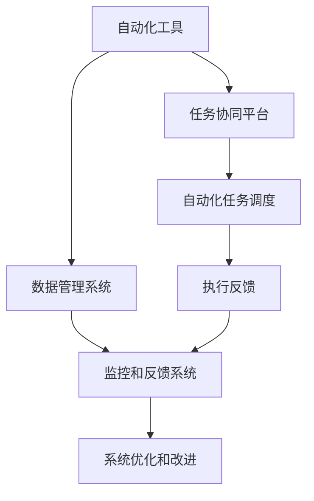

                 

# 自动化创业中的产品矩阵策略

## 1. 背景介绍

在数字化转型的浪潮中，自动化工具正逐渐成为各行业提升效率、降低成本的重要手段。特别是在创业公司中，如何构建一个高效、灵活、可扩展的产品矩阵，实现自动化的全面覆盖，是每个创始团队面临的重大挑战。本文将深入探讨自动化创业中的产品矩阵策略，包括核心概念、构建原则、实现方法等，旨在为创业者提供一份系统性的指南。

## 2. 核心概念与联系

### 2.1 核心概念概述

自动化产品矩阵是指在创业公司的产品体系中，通过一系列自动化工具和系统的构建，实现不同环节的自动化处理。其核心思想是将常见的业务流程、数据处理、任务管理等功能模块，通过自动化工具串联起来，形成一张高效协同的矩阵图。这张图不仅包括具体的工具和系统，还包括其间的连接逻辑和数据流动。

- **自动化工具**：用于自动执行重复性、规则性任务的软件工具，如自动化测试工具、流程自动化平台、数据同步工具等。
- **数据管理系统**：用于集中管理、分析和监控数据流动的系统，如数据库、数据仓库、数据管道等。
- **任务协同平台**：用于协调和调度自动化任务的工具，如任务调度器、工作流管理系统等。
- **监控和反馈系统**：用于监控自动化系统的运行状态，并根据反馈进行优化的系统，如监控仪表板、告警系统等。

### 2.2 核心概念原理和架构的 Mermaid 流程图



### 2.3 核心概念之间的联系

- **自动化工具**和**数据管理系统**紧密关联，自动化工具负责执行数据处理任务，而数据管理系统则提供数据存储、检索和同步的功能。
- **任务协同平台**和**自动化工具**相互依赖，前者负责任务的调度和管理，后者负责任务的执行。
- **监控和反馈系统**和**任务协同平台**相辅相成，前者负责监控自动化任务的运行状态，后者则根据监控结果进行任务调整和优化。

这些概念和系统之间的联系，构成了自动化创业中的产品矩阵基础架构。

## 3. 核心算法原理 & 具体操作步骤

### 3.1 算法原理概述

自动化创业中的产品矩阵构建，本质上是一个多目标优化问题。其核心目标是构建一个高效、稳定、灵活的自动化系统，以实现业务流程自动化、数据处理自动化和任务管理自动化。

假设自动化创业公司的产品矩阵包含 $n$ 个自动化工具，每个工具的功能价值和成本分别为 $v_i$ 和 $c_i$，其中 $i \in [1, n]$。产品矩阵的总价值 $V$ 和总成本 $C$ 分别为：

$$ V = \sum_{i=1}^n v_i $$
$$ C = \sum_{i=1}^n c_i $$

目标是在总成本 $C$ 的约束下，最大化总价值 $V$。这可以通过线性规划方法求解，即：

$$ \max \sum_{i=1}^n v_i $$
$$ s.t. \sum_{i=1}^n c_i \leq C $$

### 3.2 算法步骤详解

**Step 1: 需求分析与优先级排序**

- **业务需求分析**：全面梳理公司的业务流程，识别出可以自动化的环节，并收集用户需求。
- **需求优先级排序**：根据业务影响、成本效益、实施难度等因素，对需求进行排序，确定优先实施的项目。

**Step 2: 工具选择与评估**

- **工具选择**：根据需求和优先级，选择合适的自动化工具。优先选择开源工具和行业标准工具，以降低实施成本和提高系统稳定性。
- **工具评估**：对选定的工具进行功能评估、性能测试和成本分析，确定其是否满足需求。

**Step 3: 系统设计**

- **架构设计**：设计自动化系统的整体架构，包括自动化工具、数据管理系统、任务协同平台和监控反馈系统的关系和数据流动。
- **接口设计**：定义不同系统之间的接口和数据格式，确保系统间的数据流动和协同工作。

**Step 4: 实施部署**

- **工具集成**：将选定的工具集成到自动化系统中，确保工具间的协同工作。
- **系统测试**：对自动化系统进行全面测试，包括功能测试、性能测试和安全测试，确保系统的稳定性和可靠性。
- **部署上线**：将自动化系统部署到生产环境，并进行监控和优化。

**Step 5: 持续优化**

- **性能监控**：持续监控自动化系统的运行状态，收集性能指标和用户反馈。
- **优化调整**：根据监控结果和用户反馈，对自动化系统进行优化和调整，提高系统的效率和用户满意度。

### 3.3 算法优缺点

**优点**：
- **提高效率**：通过自动化工具和系统，可以显著提高业务流程的处理效率，减少人工干预。
- **降低成本**：自动化系统可以替代部分人力，降低运营成本。
- **提升质量**：自动化工具和系统可以减少人为错误，提高数据和任务处理的质量。

**缺点**：
- **实施复杂**：自动化系统的构建和部署需要技术和资源的投入，实施难度较大。
- **灵活性不足**：自动化系统的灵活性相对固定，难以适应快速变化的业务需求。
- **维护成本**：自动化系统的维护和优化需要持续投入，增加运维成本。

### 3.4 算法应用领域

自动化创业中的产品矩阵策略，广泛适用于各类行业的数字化转型。以下是几个典型应用场景：

- **电商行业**：通过自动化工具和系统，实现订单管理、库存管理、物流跟踪等自动化处理，提升用户体验和运营效率。
- **金融行业**：自动化系统可用于风险评估、客户管理、交易监控等环节，提高金融产品的竞争力和安全性。
- **医疗行业**：自动化工具可以帮助医疗机构进行患者管理、病历处理、影像诊断等，提高医疗服务的质量和效率。
- **制造行业**：自动化系统可用于生产调度、质量控制、设备维护等，提升生产线的灵活性和稳定性。
- **政府服务**：自动化系统可用于政务办理、信息检索、数据分析等，提升政府服务的透明度和效率。

## 4. 数学模型和公式 & 详细讲解 & 举例说明

### 4.1 数学模型构建

根据第3节中提到的多目标优化问题，我们可以构建如下的数学模型：

$$ \max \sum_{i=1}^n v_i $$
$$ s.t. \sum_{i=1}^n c_i \leq C $$
$$ v_i, c_i > 0, i \in [1, n] $$

其中 $v_i$ 和 $c_i$ 分别代表第 $i$ 个自动化工具的功能价值和成本，$C$ 为总预算。

### 4.2 公式推导过程

假设自动化创业公司有 $n=3$ 个自动化工具，分别为自动化测试工具 $T_1$、流程自动化平台 $T_2$ 和数据同步工具 $T_3$。它们的成本和功能价值如下：

| 工具     | 成本 $c_i$ | 功能价值 $v_i$ |
| -------- | --------- | ------------- |
| $T_1$    | 10000     | 200           |
| $T_2$    | 20000     | 300           |
| $T_3$    | 15000     | 250           |

总预算 $C=45000$，则有：

$$ \max \{200, 300, 250\} $$
$$ s.t. 10000 + 20000 + 15000 \leq 45000 $$
$$ v_i, c_i > 0, i \in [1, 3] $$

通过线性规划求解，得到最优方案为选择 $T_1$ 和 $T_3$ 工具，功能价值为 $200+250=450$，成本为 $10000+15000=25000$，满足预算要求。

### 4.3 案例分析与讲解

**案例**：某电商公司需要构建一个自动化产品矩阵，以提高订单处理效率和客户满意度。

- **需求分析**：梳理订单处理流程，识别出订单创建、订单处理、订单配送等关键环节。
- **工具选择**：根据需求，选择自动化测试工具、流程自动化平台和数据同步工具，进行功能价值和成本评估。
- **系统设计**：设计自动化系统的整体架构，定义不同系统之间的接口和数据格式。
- **实施部署**：将选定的工具集成到自动化系统中，进行全面测试和部署。
- **持续优化**：持续监控自动化系统的运行状态，根据用户反馈进行优化调整。

通过以上步骤，该电商公司成功构建了一个高效、稳定、灵活的自动化产品矩阵，显著提升了订单处理效率和客户满意度。

## 5. 项目实践：代码实例和详细解释说明

### 5.1 开发环境搭建

为了实现自动化创业中的产品矩阵策略，我们需要搭建一个完整的开发环境。以下是详细的步骤：

1. **安装开发工具**：安装 Python、Git、Docker、Kubernetes 等开发工具，搭建开发环境。
2. **安装自动化工具**：安装选定的自动化工具，如 Jenkins、Ansible、Prometheus 等。
3. **搭建数据管理系统**：搭建数据管理系统，如 MySQL、PostgreSQL、Hadoop 等。
4. **集成任务协同平台**：集成任务协同平台，如 Airflow、Kubernetes、Zabbix 等。
5. **部署监控系统**：部署监控系统，如 Grafana、ELK Stack、Graylog 等。

### 5.2 源代码详细实现

以下是自动化创业中产品矩阵策略的实现代码，包括自动化测试工具、流程自动化平台和数据同步工具的集成和部署：

```python
from airflow import DAG
from airflow.operators.dummy_operator import DummyOperator
from airflow.operators.bash_operator import BashOperator
from airflow.operators.python_operator import PythonOperator

# 定义任务
start_task = DummyOperator(task_id='start', task_input={'test': '1'})
test_task = PythonOperator(task_id='test', python_callable=test_python_func)
process_task = PythonOperator(task_id='process', python_callable=process_python_func)
sync_task = PythonOperator(task_id='sync', python_callable=sync_python_func)
end_task = DummyOperator(task_id='end')

# 定义依赖关系
start_task >> test_task >> process_task >> sync_task >> end_task

# 启动 DAG
dag = DAG('automation_dag', start_date=django.utils.timezone.now(), schedule_interval='@daily')

# 执行任务
def test_python_func(context):
    # 自动化测试代码
    pass

def process_python_func(context):
    # 自动化流程处理代码
    pass

def sync_python_func(context):
    # 数据同步代码
    pass
```

### 5.3 代码解读与分析

**代码解读**：
- 使用 Airflow 搭建了一个自动化工作流，定义了自动化测试、流程处理和数据同步等任务。
- 任务之间通过依赖关系连接，确保数据和任务处理的顺序性。
- 通过 PythonOperator 实现任务的具体处理逻辑，便于扩展和维护。

**分析**：
- **任务依赖**：通过任务之间的依赖关系，确保数据和任务处理的顺序性，避免数据冲突和任务重叠。
- **任务扩展**：使用 PythonOperator 实现任务的具体处理逻辑，便于添加新任务和扩展功能。
- **监控和管理**：通过 Airflow 的监控和管理功能，可以实时跟踪任务的执行状态和性能指标。

## 6. 实际应用场景

### 6.1 智能制造

在智能制造领域，自动化产品矩阵策略可以帮助企业实现生产线的自动化和智能化。通过自动化工具和系统，可以实现设备监控、质量检测、生产调度等自动化处理，提高生产线的灵活性和稳定性，降低人为错误和运营成本。

### 6.2 智慧城市

智慧城市建设中，自动化产品矩阵策略可以实现城市管理的自动化和智能化。通过自动化系统，可以实现城市事件的监测、交通流量的调控、能源管理的优化等，提升城市管理的效率和质量。

### 6.3 在线教育

在线教育平台中，自动化产品矩阵策略可以提升教学效率和学习体验。通过自动化工具和系统，可以实现课程内容的自动化生成、学习数据的自动分析、学生表现的自动评估等，提高教育资源的利用率和教学效果。

## 7. 工具和资源推荐

### 7.1 学习资源推荐

为了帮助开发者系统掌握自动化创业中的产品矩阵策略，这里推荐一些优质的学习资源：

1. **《自动化工程》系列书籍**：深入介绍自动化工程的基础理论和应用实践，包括自动化测试、流程自动化、数据管理等。
2. **《Python自动化测试实战》课程**：由知名自动化测试专家撰写，全面介绍 Python 自动化测试工具的使用方法和实战技巧。
3. **《Airflow实战》书籍**：介绍 Airflow 的搭建、使用和管理，提供大量实践案例和最佳实践。
4. **《Jenkins官方文档》**：Jenkins 是目前主流的自动化流程工具，官方文档提供了详细的安装和使用指南。
5. **《Prometheus监控系统》教程**：Prometheus 是流行的监控系统，教程介绍了其安装、配置和监控功能。

通过这些学习资源的学习实践，相信你一定能够快速掌握自动化创业中的产品矩阵策略，并用于解决实际的自动化问题。

### 7.2 开发工具推荐

为了实现自动化创业中的产品矩阵策略，我们需要一些常用的开发工具：

1. **Python**：自动化开发的核心语言，具有强大的库和框架支持。
2. **Docker**：容器化技术，方便自动化工具的部署和扩展。
3. **Kubernetes**：容器编排工具，实现自动化系统的水平扩展和负载均衡。
4. **Jenkins**：自动化流程工具，支持丰富的插件和扩展功能。
5. **Prometheus**：监控系统，提供全面的性能监控和告警功能。

### 7.3 相关论文推荐

自动化产品矩阵策略是自动化工程中的重要研究方向，以下是几篇具有代表性的相关论文：

1. **《自动化测试与持续集成》**：深入介绍自动化测试和持续集成的基础理论和实现方法。
2. **《流程自动化平台的设计与实现》**：介绍流程自动化平台的设计思路和实现技术，适用于各类业务流程自动化。
3. **《数据同步工具的研究与实现》**：研究数据同步工具的实现方法和优化技术，适用于大数据环境下的数据处理。
4. **《分布式监控系统的设计与实现》**：介绍分布式监控系统的设计和实现技术，适用于大型系统的性能监控。

这些论文代表了大数据自动化产品矩阵策略的研究方向，通过学习这些前沿成果，可以帮助研究者把握学科前进方向，激发更多的创新灵感。

## 8. 总结：未来发展趋势与挑战

### 8.1 总结

本文对自动化创业中的产品矩阵策略进行了全面系统的介绍。首先阐述了自动化产品矩阵的概念和构建原则，明确了自动化创业中产品矩阵的核心理念和实施步骤。其次，从原理到实践，详细讲解了自动化产品矩阵的数学模型和算法步骤，给出了自动化工具集成的代码实现。同时，本文还探讨了自动化产品矩阵在多个行业领域的应用前景，展示了其广阔的发展潜力。最后，本文精选了自动化创业中的学习资源、开发工具和相关论文，力求为读者提供全方位的技术指引。

通过本文的系统梳理，可以看到，自动化创业中的产品矩阵策略在提升业务效率、降低运营成本、提高服务质量等方面具有重要意义。自动化工具和系统的广泛应用，将深刻改变各行业的运营模式和业务流程，带来新的商业机会和发展机遇。

### 8.2 未来发展趋势

展望未来，自动化创业中的产品矩阵策略将呈现以下几个发展趋势：

1. **智能化升级**：未来的自动化产品矩阵将更加智能化，能够自适应业务变化，实现自动化任务的动态调整和优化。
2. **协同化增强**：未来的自动化系统将更加协同化，能够实现跨部门、跨系统的数据共享和业务协同。
3. **多模态融合**：未来的自动化产品矩阵将融合多模态数据，实现文本、图像、视频等信息的协同处理和分析。
4. **云端化部署**：未来的自动化系统将更多地部署在云平台，实现自动化资源的灵活分配和高效利用。
5. **自服务化演进**：未来的自动化产品矩阵将更加自服务化，员工能够自主管理和维护自动化系统，提升工作效率和系统可靠性。

这些趋势凸显了自动化创业中的产品矩阵策略的广阔前景。这些方向的探索发展，必将进一步提升自动化系统的性能和应用范围，为各行业的数字化转型提供更强大的技术支撑。

### 8.3 面临的挑战

尽管自动化创业中的产品矩阵策略已经取得了显著进展，但在迈向更加智能化、协同化应用的过程中，它仍面临诸多挑战：

1. **系统复杂性**：自动化系统的构建和部署需要技术和资源的投入，系统复杂性较高，实施难度较大。
2. **数据孤岛**：不同系统和平台之间的数据孤岛问题，阻碍了数据共享和协同工作。
3. **性能瓶颈**：自动化系统的性能瓶颈，如数据同步速度、任务调度效率等，需要进一步优化。
4. **安全风险**：自动化系统面临的安全风险，如数据泄露、系统攻击等，需要加强安全防护。
5. **人员素质**：自动化系统的管理和维护需要专业人才，人员素质和技能水平成为制约因素。

### 8.4 研究展望

面对自动化创业中产品矩阵策略面临的种种挑战，未来的研究需要在以下几个方面寻求新的突破：

1. **简化系统架构**：研究自动化系统的简化架构设计，提高系统的可扩展性和易用性。
2. **消除数据孤岛**：研究数据共享和协同工作的技术，消除不同系统和平台之间的数据孤岛问题。
3. **优化性能瓶颈**：研究自动化系统的性能优化技术，提升数据同步速度和任务调度效率。
4. **加强安全防护**：研究自动化系统的安全防护技术，保障数据和系统的安全。
5. **提升人员素质**：研究自动化系统管理和维护的最佳实践，提升人员素质和技能水平。

这些研究方向的探索，必将引领自动化创业中的产品矩阵策略迈向更高的台阶，为各行业的数字化转型提供更强大的技术支撑。面向未来，自动化产品矩阵策略需要与其他人工智能技术进行更深入的融合，如知识表示、因果推理、强化学习等，多路径协同发力，共同推动自动化系统的进步。只有勇于创新、敢于突破，才能不断拓展自动化系统的边界，让自动化技术更好地造福人类社会。

## 9. 附录：常见问题与解答

**Q1：自动化创业中的产品矩阵策略是否适用于所有行业？**

A: 自动化创业中的产品矩阵策略具有广泛的应用前景，但并不是所有行业都适合直接应用。对于一些以人为核心、创造性需求高的行业，如创意产业、教育培训等，可能需要结合人工干预和创新思维，才能实现自动化提升。

**Q2：如何选择合适的自动化工具？**

A: 选择合适的自动化工具需要综合考虑工具的功能、性能、易用性、成本等因素。一般建议优先选择开源工具和行业标准工具，以降低实施成本和提高系统稳定性。同时，可以通过试用、评估等方式，对比不同工具的优缺点，选择最适合的工具。

**Q3：自动化系统如何应对快速变化的业务需求？**

A: 自动化系统需要具备灵活性和可扩展性，以应对快速变化的业务需求。可以通过引入配置化设计、模块化开发等技术，实现系统的快速迭代和优化。同时，需要定期进行需求分析和优先级排序，确保自动化系统始终与业务需求保持一致。

**Q4：自动化系统如何确保数据安全？**

A: 自动化系统需要建立完善的安全防护机制，确保数据和系统的安全。可以通过数据加密、访问控制、日志审计等技术手段，防止数据泄露和系统攻击。同时，需要定期进行安全评估和漏洞扫描，及时发现和修复安全问题。

**Q5：自动化系统的维护和优化有哪些最佳实践？**

A: 自动化系统的维护和优化需要持续投入技术和资源，以下是一些最佳实践：
1. 定期进行系统监控和性能评估，及时发现和修复问题。
2. 引入自动化测试和持续集成，保障系统稳定性和可靠性。
3. 采用配置化设计和模块化开发，提高系统的可扩展性和易维护性。
4. 建立完善的安全防护机制，保障数据和系统的安全。
5. 提供自服务化的管理和维护界面，提升员工的使用体验和系统可靠性。

这些最佳实践将有助于自动化系统的长期稳定运行和持续优化。

---

作者：禅与计算机程序设计艺术 / Zen and the Art of Computer Programming

