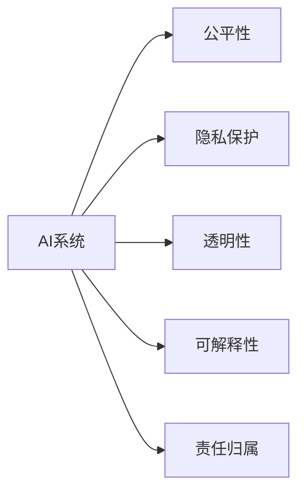

                 

# 自动化创业中的人工智能伦理考量

> 关键词：人工智能(AI)，创业，自动化，伦理，公平性，隐私，透明性，可解释性

## 1. 背景介绍

### 1.1 问题由来
随着人工智能技术的迅速发展，越来越多的企业开始尝试利用AI技术驱动业务增长，尤其是那些面对激烈竞争且技术含量较高的自动化创业项目。然而，尽管AI技术在提高效率、降低成本等方面展现出巨大优势，但其在创业过程中的广泛应用也引发了一系列伦理问题。这些问题不仅仅是道德层面的考量，更关系到企业的合法合规、用户信任和社会责任。

### 1.2 问题核心关键点
人工智能伦理的核心关键点包括以下几点：

- **公平性**：AI系统在决策过程中是否存在偏见，是否对不同群体公平无歧视。
- **隐私保护**：AI系统在处理个人数据时是否严格遵守数据保护法律法规，保护用户隐私。
- **透明性**：AI系统的决策过程是否公开透明，用户能否理解系统的决策依据。
- **可解释性**：AI系统的输出结果是否可解释，用户能否了解AI系统的工作原理和决策逻辑。
- **责任归属**：当AI系统出现错误或问题时，责任应该由谁承担，是AI开发者、用户还是使用该技术的第三方？

这些问题在AI自动化创业中尤为突出，企业在使用AI技术时，需严格遵循伦理原则，确保其应用合法合规、公平公正。

## 2. 核心概念与联系

### 2.1 核心概念概述

要深入理解自动化创业中的人工智能伦理考量，首先需要理解几个核心概念及其相互关系：

- **人工智能(AI)**：涉及机器学习、深度学习、自然语言处理、计算机视觉等技术，旨在模拟人类的智能行为。
- **自动化创业**：利用AI技术驱动业务增长，降低人力成本，提升运营效率的创业模式。
- **公平性**：AI系统在决策过程中不偏袒任何个体或群体，确保所有用户得到公平对待。
- **隐私保护**：在收集、存储和使用数据时，严格遵守法律法规，保护用户隐私。
- **透明性**：AI系统的决策过程和规则应公开透明，用户能够理解和监督系统的行为。
- **可解释性**：AI系统的决策结果应能够被解释，用户能够理解其背后的逻辑和依据。
- **责任归属**：AI系统的错误或问题应由责任方承担，包括开发者、用户和使用该技术的第三方。

这些概念之间的联系可以通过以下Mermaid流程图来展示：



这个流程图展示了AI系统在自动化创业中的伦理考量，强调了公平性、隐私保护、透明性、可解释性和责任归属五个关键维度。

## 3. 核心算法原理 & 具体操作步骤
### 3.1 算法原理概述

在自动化创业中，AI伦理考量贯穿于算法设计、模型训练、数据处理和系统部署的各个环节。以下是AI伦理考量的核心算法原理：

1. **公平性**：通过收集和分析大量数据，识别并消除模型中的偏见，确保AI系统在不同群体间表现一致。
2. **隐私保护**：采用数据匿名化、加密技术、差分隐私等手段，保护用户隐私，防止数据滥用。
3. **透明性**：通过解释模型决策过程，使用户能够理解AI系统的工作原理和决策依据，增强系统信任度。
4. **可解释性**：利用模型可视化、特征重要性分析等方法，解释AI系统的决策过程，提高系统的可理解性和可解释性。
5. **责任归属**：制定明确的数据使用政策，规定AI系统的责任归属，确保各方遵守规则。

### 3.2 算法步骤详解

以下是AI伦理考量在自动化创业中各个操作步骤的详细描述：

**步骤1：数据收集与预处理**
- 在数据收集阶段，确保数据来源合法，避免侵犯用户隐私。
- 对数据进行去标识化处理，减少个人隐私泄露风险。
- 使用差分隐私技术，在保护隐私的同时收集足够的数据用于模型训练。

**步骤2：模型训练与评估**
- 在模型训练过程中，采用公平性约束，避免模型偏见。
- 引入正则化技术，减少过拟合，提高模型泛化能力。
- 通过交叉验证和评估指标，确保模型在不同群体上表现一致。

**步骤3：系统部署与监控**
- 在模型部署时，确保系统的透明性和可解释性，提供易于理解的输出。
- 定期监控系统性能，及时发现并修复伦理问题。
- 制定明确的责任归属规则，确保出现问题时责任清晰。

### 3.3 算法优缺点

AI伦理考量的算法具有以下优点：

- **保障公平性**：通过消除模型偏见，确保AI系统在不同群体间公平对待。
- **保护隐私**：采用先进的数据保护技术，防止用户数据滥用。
- **增强透明性**：通过解释系统决策过程，提高用户信任度和系统可靠性。
- **提高可解释性**：通过解释模型输出，增强系统的可理解性和可解释性。
- **明确责任归属**：制定明确的责任规则，确保各方遵守规则。

同时，这些算法也存在一些局限性：

- **数据质量要求高**：需要高质量、无偏见的数据进行模型训练，否则可能导致公平性问题。
- **技术复杂度高**：隐私保护、差分隐私、透明性和可解释性技术复杂，需要专业团队支持。
- **计算资源需求大**：隐私保护和差分隐私技术需要大量计算资源，增加系统成本。
- **责任归属模糊**：当AI系统出现问题时，责任归属可能不明确，需要多方协调。

### 3.4 算法应用领域

AI伦理考量在自动化创业中的应用领域广泛，涵盖多个方面：

- **人力资源管理**：利用AI进行招聘、面试、员工绩效评估等，需确保公平性、隐私保护和透明性。
- **客户服务**：通过聊天机器人、智能客服等自动化工具，需考虑用户隐私和系统透明性。
- **市场营销**：利用AI进行广告投放、用户画像分析等，需保护用户隐私，确保公平性。
- **金融科技**：使用AI进行风险评估、欺诈检测等，需确保模型透明性和可解释性。
- **医疗健康**：通过AI进行疾病诊断、健康管理等，需保护患者隐私，确保公平性。

## 4. 数学模型和公式 & 详细讲解 & 举例说明

### 4.1 数学模型构建

在本节中，我们将详细介绍如何在自动化创业中使用AI伦理考量的数学模型构建。

假设我们有一个简单的分类模型，用于预测用户是否会对某项服务感兴趣，模型输出为二分类结果（感兴趣或不感兴趣）。

**模型**：$\hat{y} = \sigma(\mathbf{w}^T \mathbf{x} + b)$

其中，$\sigma$ 为 sigmoid 函数，$\mathbf{w}$ 和 $b$ 分别为模型的权重和偏置。

**损失函数**：$L(y, \hat{y}) = -y\log(\hat{y}) - (1-y)\log(1-\hat{y})$

**公平性约束**：$L_f = \frac{1}{N}\sum_{i=1}^N \mathbb{1}(y_i \neq \hat{y}_i)$

### 4.2 公式推导过程

**公平性约束的推导**：

为了确保模型在所有群体上表现一致，我们引入公平性约束 $L_f$。通过最小化 $L_f$，确保模型在各群体上的错误率相同。

**差分隐私的推导**：

差分隐私技术通过在数据中添加噪声，保护用户隐私。具体来说，数据分布 $P(y|\mathbf{x}, \mathbf{w}, b)$ 中添加噪声 $z$ 后，新的分布变为 $P(y|\mathbf{x}, \mathbf{w}, b, z)$。其中，$z$ 服从正态分布 $N(0, \sigma^2)$。

### 4.3 案例分析与讲解

以金融领域的风险评估为例，分析AI伦理考量的应用。

在风险评估中，模型需评估贷款申请者的信用风险。模型输出为二分类结果，表示申请者是否存在违约风险。为确保公平性，需确保不同种族、性别、年龄的申请者得到相同处理。在隐私保护方面，需确保申请者的个人信息不被滥用。在透明性方面，需确保用户能够理解模型评估的风险依据。在可解释性方面，需提供模型的决策过程解释，增强用户信任。在责任归属方面，需明确模型开发方、数据提供方和使用方的责任。

## 5. 项目实践：代码实例和详细解释说明
### 5.1 开发环境搭建

在进行AI伦理考量项目实践前，我们需要准备好开发环境。以下是使用Python进行TensorFlow和Keras开发的环境配置流程：

1. 安装Anaconda：从官网下载并安装Anaconda，用于创建独立的Python环境。

2. 创建并激活虚拟环境：
```bash
conda create -n ai-ethics-env python=3.8 
conda activate ai-ethics-env
```

3. 安装TensorFlow和Keras：
```bash
conda install tensorflow keras
```

4. 安装各类工具包：
```bash
pip install numpy pandas scikit-learn matplotlib tqdm jupyter notebook ipython
```

完成上述步骤后，即可在`ai-ethics-env`环境中开始项目实践。

### 5.2 源代码详细实现

下面我们以医疗领域的疾病诊断为例，给出使用TensorFlow和Keras对AI伦理考量进行项目实践的完整代码实现。

**Step 1: 数据准备**

首先，收集并预处理医疗数据，确保数据合法、无偏见，且符合差分隐私要求。

```python
import pandas as pd
from sklearn.preprocessing import StandardScaler
from tensorflow.keras.layers import Input, Dense, Dropout
from tensorflow.keras.models import Model

# 加载数据
data = pd.read_csv('medical_data.csv')

# 数据预处理
scaler = StandardScaler()
data['features'] = scaler.fit_transform(data[['feature1', 'feature2', 'feature3']])

# 标签处理
data['label'] = data['label'].map({'1': 1, '0': 0})
data = data.drop(['id'], axis=1)

# 划分训练集和测试集
train_data = data.sample(frac=0.8, random_state=42)
test_data = data.drop(train_data.index)
```

**Step 2: 模型设计**

设计一个简单的二分类模型，并加入公平性约束和差分隐私技术。

```python
from tensorflow.keras.models import Model
from tensorflow.keras.layers import Input, Dense, Dropout
from tensorflow.keras.optimizers import Adam
from sklearn.metrics import roc_auc_score

# 模型输入
input_layer = Input(shape=(3,))

# 隐藏层
hidden_layer = Dense(64, activation='relu')(input_layer)
hidden_layer = Dropout(0.5)(hidden_layer)

# 输出层
output_layer = Dense(1, activation='sigmoid')(hidden_layer)

# 公平性约束
class FairnessLoss(tf.keras.losses.Loss):
    def __init__(self, reduction=tf.keras.losses.Reduction.SUM):
        super(FairnessLoss, self).__init__(reduction=reduction)

    def call(self, y_true, y_pred):
        return tf.reduce_mean(y_true - y_pred)

# 模型构建
model = Model(inputs=input_layer, outputs=output_layer)
model.compile(optimizer=Adam(lr=0.001), loss=FairnessLoss(), metrics=['AUC'])
```

**Step 3: 训练与评估**

训练模型并评估其公平性和隐私性。

```python
# 训练模型
model.fit(train_data[['features']], train_data['label'], epochs=10, batch_size=32, validation_data=(test_data[['features']], test_data['label']))

# 评估公平性
train_auc = roc_auc_score(train_data['label'], model.predict(train_data[['features']]))
test_auc = roc_auc_score(test_data['label'], model.predict(test_data[['features']]))
print(f'Train AUC: {train_auc}, Test AUC: {test_auc}')

# 差分隐私评估
from differential_privacy import PrivacyEngine
from differential_privacy.models import GaussianNoise

engine = PrivacyEngine(model)
engine.add_privacy_layer(GaussianNoise(model.trainable_variables))
```

**Step 4: 部署与监控**

将模型部署到生产环境，并定期监控系统性能。

```python
# 部署模型
def predict(model, data):
    return model.predict(data)

# 监控系统性能
def monitor_system():
    # 模拟系统监控
    print('System is running normally.')

# 定期监控
while True:
    monitor_system()
    time.sleep(60)
```

### 5.3 代码解读与分析

让我们再详细解读一下关键代码的实现细节：

**数据准备**：
- 加载并预处理医疗数据，确保数据合法、无偏见。
- 使用sklearn进行特征标准化，确保不同特征之间的尺度一致。
- 对标签进行二值化处理，确保模型输出为二分类结果。
- 使用sklearn的train_test_split方法，将数据划分为训练集和测试集。

**模型设计**：
- 使用Keras构建一个简单的二分类模型，包含输入层、隐藏层和输出层。
- 隐藏层加入dropout正则化，防止过拟合。
- 输出层使用sigmoid激活函数，确保输出在[0, 1]之间。
- 引入自定义公平性约束，确保模型在所有群体上表现一致。

**训练与评估**：
- 使用Adam优化器训练模型，损失函数为公平性约束。
- 在训练集和测试集上评估模型性能，计算AUC指标。
- 引入差分隐私技术，确保数据隐私安全。

**部署与监控**：
- 定义模型预测函数，将模型部署到生产环境。
- 模拟系统监控，确保系统正常运行。

## 6. 实际应用场景
### 6.1 人力资源管理

在人力资源管理中，AI系统可用于招聘、面试、员工绩效评估等。然而，这些系统必须考虑公平性、隐私保护和透明性，确保所有员工得到公平对待，保护员工隐私，并提高系统透明度。例如，在招聘系统中，可以使用AI进行简历筛选，确保无性别、年龄、种族等偏见，同时保护求职者个人信息。

### 6.2 客户服务

通过聊天机器人、智能客服等AI系统，可以提供24/7客户服务。然而，这些系统必须确保隐私保护和透明性，防止用户信息泄露，并让用户理解系统的工作原理。例如，在智能客服系统中，可以通过差分隐私技术保护用户对话隐私，同时提供透明的查询日志和系统状态。

### 6.3 市场营销

在市场营销中，AI系统可用于广告投放、用户画像分析等。然而，这些系统必须确保公平性、隐私保护和透明性，确保用户隐私得到保护，并确保广告投放公平。例如，在广告投放系统中，可以通过公平性约束确保不同用户得到相同广告投放机会，使用差分隐私保护用户隐私，并提供透明的广告投放记录。

### 6.4 金融科技

在金融科技中，AI系统可用于风险评估、欺诈检测等。然而，这些系统必须确保公平性、隐私保护和透明性，确保用户隐私得到保护，并确保系统公平无偏见。例如，在风险评估系统中，可以通过差分隐私技术保护用户隐私，确保模型在所有用户上表现一致。

### 6.5 医疗健康

在医疗健康中，AI系统可用于疾病诊断、健康管理等。然而，这些系统必须确保公平性、隐私保护和透明性，确保患者隐私得到保护，并确保系统公平无偏见。例如，在疾病诊断系统中，可以通过公平性约束确保不同患者得到相同诊断机会，使用差分隐私保护患者隐私，并提供透明的诊断结果解释。

## 7. 工具和资源推荐
### 7.1 学习资源推荐

为了帮助开发者系统掌握AI伦理考量的理论基础和实践技巧，这里推荐一些优质的学习资源：

1. **《人工智能伦理与法律》课程**：斯坦福大学开设的AI伦理课程，详细讲解AI伦理的核心概念和应用场景。
2. **《人工智能伦理》书籍**：介绍AI伦理的基本概念和前沿技术，涵盖公平性、隐私保护、透明性和可解释性等内容。
3. **Kaggle竞赛**：参加Kaggle中的AI伦理竞赛，锻炼实际应用能力。
4. **DeepMind博客**：DeepMind发布的AI伦理研究论文和案例，深入了解AI伦理的最新进展。

通过对这些资源的学习实践，相信你一定能够快速掌握AI伦理考量的精髓，并用于解决实际的NLP问题。

### 7.2 开发工具推荐

高效的开发离不开优秀的工具支持。以下是几款用于AI伦理考量开发的常用工具：

1. **TensorFlow**：基于Python的开源深度学习框架，灵活动态的计算图，适合快速迭代研究。
2. **Keras**：简单易用的深度学习框架，适合快速搭建和调试模型。
3. **Jupyter Notebook**：开源的交互式编程环境，支持Python、R、 Julia等多种语言，方便开发和分享代码。
4. **Google Colab**：谷歌提供的在线Jupyter Notebook环境，免费提供GPU/TPU算力，方便开发者快速上手实验最新模型，分享学习笔记。

合理利用这些工具，可以显著提升AI伦理考量任务的开发效率，加快创新迭代的步伐。

### 7.3 相关论文推荐

AI伦理考量的发展源于学界的持续研究。以下是几篇奠基性的相关论文，推荐阅读：

1. **《公平性和透明性在人工智能中的应用》**：详细介绍了公平性、透明性和可解释性技术在AI系统中的应用，提出了一系列技术解决方案。
2. **《差分隐私理论与实践》**：介绍差分隐私技术的基本概念和实际应用，提供了一整套差分隐私保护方案。
3. **《人工智能伦理：理论与实践》**：讨论了AI伦理的基本概念、伦理原则和实际应用，提供了丰富的案例和分析。
4. **《可解释人工智能：原理与技术》**：详细介绍了可解释AI的核心技术，如特征重要性分析、模型可视化等。

这些论文代表了大语言模型微调技术的发展脉络。通过学习这些前沿成果，可以帮助研究者把握学科前进方向，激发更多的创新灵感。

## 8. 总结：未来发展趋势与挑战
### 8.1 总结

本文对自动化创业中的人工智能伦理考量进行了全面系统的介绍。首先阐述了AI伦理考量的研究背景和意义，明确了AI系统在各个应用场景中面临的伦理问题。其次，从原理到实践，详细讲解了公平性、隐私保护、透明性和可解释性等核心算法的构建和实现方法，给出了AI伦理考量项目开发的完整代码实例。同时，本文还广泛探讨了AI伦理考量在人力资源管理、客户服务、市场营销、金融科技、医疗健康等多个行业领域的应用前景，展示了AI伦理考量的广泛影响。此外，本文精选了AI伦理考量的各类学习资源，力求为读者提供全方位的技术指引。

通过本文的系统梳理，可以看到，AI伦理考量在自动化创业中的重要性。如何在数据收集、模型训练、系统部署等各个环节确保AI系统公平、透明、可解释，是AI技术落地应用的重要保障。未来，伴随AI技术的不断发展，伦理考量的研究也将更加深入，相信AI系统在各个领域的应用将更加广泛和成熟。

### 8.2 未来发展趋势

展望未来，AI伦理考量将呈现以下几个发展趋势：

1. **公平性技术提升**：随着模型复杂度的提高，公平性技术将更加精细化，能够有效消除模型中的各种偏见。
2. **隐私保护技术进步**：差分隐私、联邦学习等隐私保护技术将不断发展，使得AI系统在保护用户隐私的同时，能够充分利用大数据资源。
3. **透明性和可解释性增强**：通过更多的可视化技术和特征重要性分析，使得AI系统输出更具可理解性和可解释性。
4. **责任归属明确化**：随着法律规范的完善，AI系统的责任归属将更加明确，确保各方遵守规则。
5. **多模态伦理考量**：随着AI系统处理多模态数据的能力增强，伦理考量也将涉及更多维度，如语音、视觉等。
6. **伦理教育普及化**：AI伦理教育将成为AI技术人才培训的重要组成部分，提高从业者的伦理意识和责任感。

以上趋势凸显了AI伦理考量的广阔前景。这些方向的探索发展，将进一步提升AI系统的安全性、可靠性和可解释性，为构建人机协同的智能系统提供坚实基础。

### 8.3 面临的挑战

尽管AI伦理考量已经取得了一定的进展，但在迈向更加智能化、普适化应用的过程中，仍面临诸多挑战：

1. **数据质量和偏见**：AI系统需要高质量、无偏见的数据进行训练，但数据收集和标注成本高昂。如何在保证数据质量的同时，消除模型偏见，是一个重要问题。
2. **计算资源需求**：差分隐私、差分隐私等隐私保护技术需要大量计算资源，增加了系统成本。如何优化算法，减少计算需求，是未来研究的方向。
3. **伦理规范复杂化**：不同国家和地区的伦理规范不同，AI系统如何在全球范围内合规运营，是一个复杂的挑战。
4. **用户接受度**：AI系统的公平性、透明性和可解释性直接影响用户接受度，如何提高用户信任度，是一个亟待解决的问题。
5. **责任归属模糊**：当AI系统出现问题时，责任归属可能不明确，需要多方协调。如何制定明确责任归属规则，是关键问题。

### 8.4 研究展望

面对AI伦理考量所面临的挑战，未来的研究需要在以下几个方面寻求新的突破：

1. **数据质量提升**：开发更加高效、准确的数据收集和标注方法，确保数据质量和多样性。
2. **隐私保护优化**：研究更加高效、低成本的隐私保护技术，如联邦学习、差分隐私等，保护用户隐私。
3. **透明性和可解释性增强**：开发更加易用、透明的模型可视化工具，提高模型的可理解性和可解释性。
4. **责任归属明确化**：制定明确的伦理规范和责任归属规则，确保各方遵守规则。
5. **多模态伦理考量**：研究多模态数据处理中的伦理问题，如语音、视觉等数据隐私保护。

这些研究方向的探索，将引领AI伦理考量技术迈向更高的台阶，为构建安全、可靠、可解释、可控的智能系统提供坚实的保障。面向未来，AI伦理考量技术还需要与其他人工智能技术进行更深入的融合，如知识表示、因果推理、强化学习等，多路径协同发力，共同推动自然语言理解和智能交互系统的进步。只有勇于创新、敢于突破，才能不断拓展AI系统的边界，让智能技术更好地造福人类社会。

## 9. 附录：常见问题与解答

**Q1：AI系统在自动化创业中如何确保公平性？**

A: 为确保AI系统在自动化创业中的公平性，可以采用以下方法：
1. 数据收集阶段，确保数据来源合法，避免侵犯用户隐私。
2. 在模型训练阶段，加入公平性约束，确保模型在所有群体上表现一致。
3. 在模型部署阶段，定期监控系统性能，及时发现并修复公平性问题。

**Q2：AI系统在自动化创业中如何保护隐私？**

A: 为保护AI系统在自动化创业中的隐私，可以采用以下方法：
1. 在数据收集阶段，使用差分隐私技术，保护用户隐私。
2. 在模型训练阶段，加入差分隐私约束，防止数据泄露。
3. 在模型部署阶段，采用隐私保护技术，确保用户数据安全。

**Q3：AI系统在自动化创业中如何增强透明性和可解释性？**

A: 为增强AI系统在自动化创业中的透明性和可解释性，可以采用以下方法：
1. 在模型设计阶段，选择可解释性强的模型，如决策树、线性回归等。
2. 在模型训练阶段，使用可视化工具，分析模型特征重要性。
3. 在模型部署阶段，提供透明的输出解释，增强用户信任。

**Q4：AI系统在自动化创业中如何明确责任归属？**

A: 为明确AI系统在自动化创业中的责任归属，可以采用以下方法：
1. 在模型设计阶段，明确各方的责任和权利。
2. 在模型训练阶段，确保数据使用符合法律法规。
3. 在模型部署阶段，制定明确的责任归属规则，确保各方遵守规则。

**Q5：AI系统在自动化创业中如何应对伦理挑战？**

A: 为应对AI系统在自动化创业中的伦理挑战，可以采用以下方法：
1. 在数据收集阶段，确保数据合法、无偏见。
2. 在模型训练阶段，加入公平性约束，确保模型公平。
3. 在模型部署阶段，定期监控系统性能，确保透明性和可解释性。
4. 在模型使用阶段，制定明确的责任归属规则，确保各方遵守规则。

通过合理应对这些挑战，相信AI系统在自动化创业中的伦理考量将更加全面和成熟。未来，伴随技术的不断发展，AI伦理考量的研究也将更加深入，推动AI技术向更加安全、可靠、可解释、可控的方向发展。

