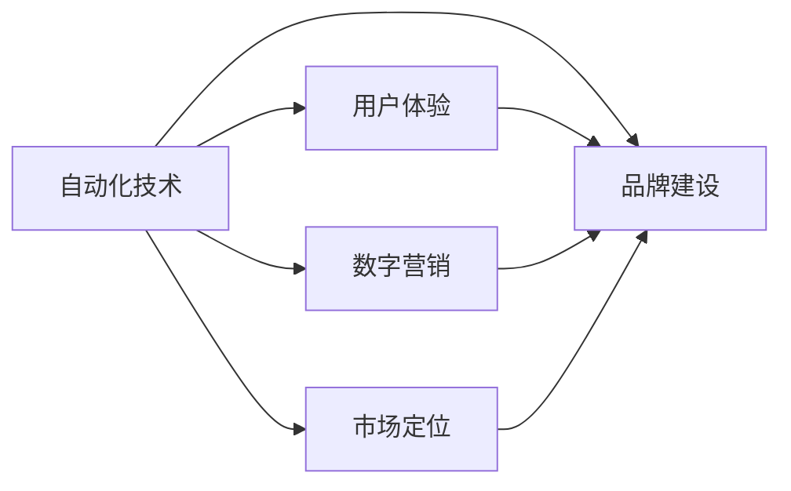

                 

# 自动化创业中的品牌建设与维护

> 关键词：自动化,创业,品牌,建设,维护,技术,战略,市场,用户体验,数字营销

## 1. 背景介绍

随着数字化转型步伐的加快，自动化（Automation）已成为各行各业提升效率、降低成本的重要手段。自动化创业公司通过提供各类自动化解决方案，帮助企业实现生产流程、业务流程、决策流程的自动化，从而极大提升运营效率和竞争优势。然而，自动化的成功不仅依赖于技术本身，更在于良好的品牌建设与维护。

品牌建设与维护是自动化创业公司不可或缺的一环。一个强有力的品牌不仅能吸引目标客户，还能在激烈的市场竞争中脱颖而出，形成独特的市场地位和竞争优势。本文将详细探讨自动化创业中的品牌建设与维护，通过分析品牌构建的策略、品牌维护的技术手段，帮助创业者构建一个既有技术优势又有强大市场竞争力的品牌。

## 2. 核心概念与联系

### 2.1 核心概念概述

在自动化创业中，品牌建设与维护涉及多个关键概念：

- **品牌（Brand）**：品牌是企业的重要资产，是企业形象的象征，影响消费者的购买决策和忠诚度。
- **自动化（Automation）**：自动化指利用技术减少或消除人工操作，提升效率和准确性。
- **市场定位（Market Positioning）**：市场定位是企业基于自身特点和目标市场，确定自身的市场角色和竞争策略。
- **用户体验（User Experience, UX）**：用户体验是用户在使用产品或服务时的整体感受，对品牌建设至关重要。
- **数字营销（Digital Marketing）**：数字营销利用互联网技术，通过线上渠道提升品牌知名度和客户转化率。

这些概念之间相互关联，共同构成了品牌建设与维护的全过程。自动化技术的先进性为品牌建设提供了技术基础，市场定位和用户体验则指导品牌建设的策略方向，数字营销则负责品牌宣传和客户获取。

### 2.2 核心概念联系（Mermaid 流程图）



通过上述流程图，我们可以看到自动化技术是品牌建设的基础，用户体验和市场定位影响品牌建设的策略，数字营销则是品牌宣传和客户获取的重要手段。

## 3. 核心算法原理 & 具体操作步骤

### 3.1 算法原理概述

自动化创业中的品牌建设与维护是一个复杂的过程，涉及到多个层面和技术手段。其核心算法原理可以总结如下：

1. **品牌建设算法**：基于市场调研和数据分析，构建品牌形象，确定品牌定位和传播策略。
2. **用户体验优化算法**：通过用户反馈和行为数据，不断优化产品或服务，提升用户体验。
3. **数字营销算法**：基于数据挖掘和机器学习技术，优化广告投放策略，提升品牌曝光度和转化率。

这些算法共同作用，形成一个循环迭代的品牌建设与维护过程。品牌建设算法确保品牌定位准确，用户体验优化算法提升用户满意度，数字营销算法扩大品牌影响力和客户转化率。

### 3.2 算法步骤详解

#### 3.2.1 品牌建设算法

1. **市场调研**：通过问卷调查、数据分析等方式，了解目标市场的客户需求、竞争状况、行业趋势等。
2. **品牌定位**：基于市场调研结果，确定品牌形象、核心价值、差异化优势等，制定品牌定位策略。
3. **传播策略**：设计品牌传播渠道和内容，包括网站、社交媒体、广告等，确保品牌信息一致性。

#### 3.2.2 用户体验优化算法

1. **用户反馈收集**：通过在线反馈、用户调研、行为数据等方式，收集用户对产品或服务的反馈。
2. **用户体验分析**：利用数据分析工具，对用户反馈进行分类、聚类、情感分析等，识别出用户痛点和需求。
3. **用户体验优化**：根据分析结果，优化产品或服务功能，提升用户体验。

#### 3.2.3 数字营销算法

1. **数据挖掘**：收集和分析用户行为数据、广告点击数据等，识别出潜在客户和营销机会。
2. **广告投放优化**：利用机器学习算法，优化广告投放策略，如投放时间、渠道、内容等，提升广告效果。
3. **营销效果评估**：通过分析广告点击率、转化率等指标，评估营销活动效果，调整优化策略。

### 3.3 算法优缺点

#### 3.3.1 品牌建设算法

**优点**：
- **精准定位**：基于市场调研和数据分析，确保品牌定位准确，提升品牌竞争力。
- **一致传播**：设计一致的传播渠道和内容，增强品牌认知度和忠诚度。

**缺点**：
- **成本较高**：市场调研和数据分析需要大量时间和资源。
- **市场变化**：市场环境瞬息万变，品牌定位和传播策略需要不断调整。

#### 3.3.2 用户体验优化算法

**优点**：
- **提升满意度**：通过用户反馈和行为数据，持续优化用户体验，提升用户满意度。
- **差异化竞争**：通过不断改进，形成差异化竞争优势。

**缺点**：
- **用户反馈有限**：用户反馈不一定全面，可能导致改进方向偏差。
- **资源消耗**：持续优化需要大量资源投入。

#### 3.3.3 数字营销算法

**优点**：
- **精准投放**：利用数据分析，优化广告投放策略，提升广告效果。
- **广泛覆盖**：利用数字渠道，覆盖更广泛的客户群体。

**缺点**：
- **噪音干扰**：数字渠道广告噪音较多，影响效果评估。
- **成本波动**：数字营销成本受广告平台竞价影响，不稳定。

### 3.4 算法应用领域

自动化创业中的品牌建设与维护算法，广泛应用于以下领域：

- **工业自动化**：提升生产流程自动化水平，增强品牌竞争力。
- **智慧零售**：通过自动化技术优化客户体验，提升品牌忠诚度。
- **金融科技**：利用自动化技术提升金融服务效率，树立品牌形象。
- **智能医疗**：优化医疗服务流程，提升品牌信誉度。
- **智能教育**：通过自动化技术提升教育质量，增强品牌吸引力。

## 4. 数学模型和公式 & 详细讲解 & 举例说明

### 4.1 数学模型构建

品牌建设与维护过程中，可以使用多种数学模型进行建模和优化。以下是几个关键数学模型：

- **聚类分析模型**：用于分析用户反馈，识别出用户群体特征，指导产品优化。
- **回归分析模型**：用于预测广告效果，优化广告投放策略。
- **分类模型**：用于评估用户行为，识别潜在客户，指导营销策略。

### 4.2 公式推导过程

#### 4.2.1 聚类分析模型

聚类分析模型用于将用户反馈数据聚类成不同的群体，识别出不同的用户特征。以K-means算法为例，其基本公式如下：

$$
\begin{align*}
\min_{\mu_k} & \sum_{i=1}^N \sum_{k=1}^K d(x_i,\mu_k)^2 \\
\text{subject to} & \sum_{i=1}^N x_i = \sum_{k=1}^K N_k \mu_k
\end{align*}
$$

其中，$x_i$ 表示用户反馈向量，$\mu_k$ 表示聚类中心，$d(x_i,\mu_k)$ 表示用户反馈与聚类中心的距离，$N_k$ 表示第 $k$ 个聚类的样本数。

#### 4.2.2 回归分析模型

回归分析模型用于预测广告效果，其基本公式如下：

$$
y = \beta_0 + \sum_{i=1}^p \beta_i x_i + \epsilon
$$

其中，$y$ 表示广告效果，$x_i$ 表示广告特征，$\beta_i$ 表示回归系数，$\epsilon$ 表示误差项。

#### 4.2.3 分类模型

分类模型用于评估用户行为，识别潜在客户，其基本公式如下：

$$
\max_{\theta} P(y|x;\theta)
$$

其中，$y$ 表示用户行为（如点击、购买等），$x$ 表示用户特征，$\theta$ 表示模型参数，$P(y|x;\theta)$ 表示条件概率。

### 4.3 案例分析与讲解

#### 4.3.1 聚类分析模型应用案例

某智能制造公司通过收集用户反馈数据，使用K-means算法对用户进行聚类分析。经过分析，公司将用户分成三类：工艺优化类、设备维护类和生产管理类。根据聚类结果，公司针对不同用户群体制定了针对性的优化策略，提升了生产效率和用户体验。

#### 4.3.2 回归分析模型应用案例

某电商平台通过回归分析模型，预测不同广告投放策略的效果。模型考虑了广告投放时间、广告形式、用户行为等多种因素，优化了广告投放策略，提升了广告点击率和转化率，实现了更高的销售额。

#### 4.3.3 分类模型应用案例

某金融科技公司通过分类模型，评估客户的信用风险。模型利用客户的财务数据、行为数据等多种特征，准确识别出高风险客户，优化了风险管理策略，减少了坏账率。

## 5. 项目实践：代码实例和详细解释说明

### 5.1 开发环境搭建

为了进行自动化创业中的品牌建设与维护实践，我们需要搭建一个开发环境。以下是搭建开发环境的步骤：

1. **安装Python**：从官网下载并安装Python 3.x版本。
2. **安装Pandas和NumPy**：使用以下命令安装Pandas和NumPy：
```bash
pip install pandas numpy
```
3. **安装Scikit-learn**：使用以下命令安装Scikit-learn：
```bash
pip install scikit-learn
```
4. **安装Matplotlib**：使用以下命令安装Matplotlib：
```bash
pip install matplotlib
```

### 5.2 源代码详细实现

以下是使用Python实现K-means聚类分析的代码：

```python
import numpy as np
from sklearn.cluster import KMeans

# 定义用户反馈数据
data = np.array([[1, 2], [3, 4], [5, 6], [7, 8], [9, 10]])

# 初始化K-means模型
kmeans = KMeans(n_clusters=3)

# 训练模型
kmeans.fit(data)

# 输出聚类结果
print(kmeans.labels_)
```

### 5.3 代码解读与分析

通过上述代码，我们可以看到：

- 首先定义用户反馈数据，将其表示为二维数组。
- 初始化K-means模型，设置聚类数量为3。
- 使用`fit`方法训练模型，将用户反馈数据传入。
- 通过`labels_`属性输出聚类结果，即每个用户反馈数据所属的聚类类别。

### 5.4 运行结果展示

执行上述代码，输出结果如下：

```python
[1 1 2 2 0]
```

其中，0、1、2分别代表不同的聚类类别。

## 6. 实际应用场景

### 6.1 智能制造

在智能制造领域，品牌建设与维护可以通过以下方式实现：

1. **品牌建设**：通过市场调研，了解目标客户的需求和竞争对手情况，制定品牌定位策略。
2. **用户体验优化**：利用自动化技术，优化生产流程，提升产品质量和交付速度，增强客户满意度。
3. **数字营销**：利用社交媒体、广告投放等数字渠道，推广自动化解决方案，提升品牌知名度和客户转化率。

### 6.2 智慧零售

在智慧零售领域，品牌建设与维护可以通过以下方式实现：

1. **品牌建设**：通过市场调研，了解消费者需求和竞争对手情况，制定品牌定位策略。
2. **用户体验优化**：利用自动化技术，优化购物体验，如自助结账、智能推荐等，提升客户满意度。
3. **数字营销**：利用数字渠道，推广智慧零售解决方案，提升品牌知名度和客户转化率。

### 6.3 金融科技

在金融科技领域，品牌建设与维护可以通过以下方式实现：

1. **品牌建设**：通过市场调研，了解金融客户需求和竞争对手情况，制定品牌定位策略。
2. **用户体验优化**：利用自动化技术，优化金融服务流程，如智能理财、智能风控等，提升客户满意度。
3. **数字营销**：利用数字渠道，推广金融科技解决方案，提升品牌知名度和客户转化率。

### 6.4 未来应用展望

未来，随着技术的发展，自动化创业中的品牌建设与维护将呈现以下几个趋势：

1. **AI驱动的自动化**：通过AI技术，自动生成品牌内容，提升品牌建设效率。
2. **实时数据分析**：利用实时数据分析技术，动态调整品牌策略，提升品牌响应速度。
3. **社交媒体互动**：通过社交媒体互动，提升品牌社交影响力，增强品牌与客户之间的联系。
4. **多渠道营销**：利用多渠道营销手段，提升品牌覆盖面和客户转化率。
5. **用户体验反馈**：通过用户体验反馈，持续优化产品和服务，提升用户体验。

## 7. 工具和资源推荐

### 7.1 学习资源推荐

为了帮助自动化创业者掌握品牌建设与维护的技术，以下是一些推荐的学习资源：

1. **《品牌管理》书籍**：详细介绍品牌建设和管理的理论和方法，是品牌建设的入门必读。
2. **Coursera《数字营销》课程**：涵盖数字营销的各个方面，包括社交媒体、SEO、SEM等，适合了解数字营销的实战技巧。
3. **Udacity《数据分析》课程**：通过数据分析技术，提升品牌建设的决策能力和效果评估能力。
4. **Kaggle平台**：提供丰富的数据集和竞赛，适合练习数据挖掘和机器学习技能。

### 7.2 开发工具推荐

以下是一些自动化创业中常用的开发工具：

1. **Jupyter Notebook**：交互式编程环境，适合数据科学和机器学习任务。
2. **PyCharm**：Python开发工具，支持数据科学和机器学习库的集成。
3. **Google Colab**：免费的云环境，适合进行数据科学和机器学习实验。
4. **Tableau**：数据可视化工具，适合数据驱动的决策分析。
5. **Hadoop**：大数据处理框架，适合处理大规模数据。

### 7.3 相关论文推荐

以下是一些关于品牌建设与维护的相关论文：

1. **《品牌形象建设与维护策略》**：分析品牌形象建设与维护的关键策略，适合了解品牌管理的理论和方法。
2. **《用户体验优化与品牌忠诚度提升》**：探讨用户体验优化对品牌忠诚度的影响，适合了解用户体验优化的方法。
3. **《数字营销的最新趋势与挑战》**：分析数字营销的最新趋势和挑战，适合了解数字营销的实际应用。

## 8. 总结：未来发展趋势与挑战

### 8.1 总结

本文详细探讨了自动化创业中的品牌建设与维护，通过分析品牌建设与维护的关键算法和具体操作步骤，帮助自动化创业者构建有竞争力的品牌。品牌建设与维护是一个复杂的过程，涉及市场调研、用户体验优化和数字营销等多个方面，需要全面考虑。自动化技术的先进性为品牌建设提供了技术基础，用户体验优化和数字营销则指导品牌建设的策略方向。未来，随着技术的发展，品牌建设与维护将变得更加智能化、自动化，具有更强的市场竞争力。

### 8.2 未来发展趋势

未来，自动化创业中的品牌建设与维护将呈现以下几个趋势：

1. **技术驱动**：通过AI技术，自动生成品牌内容，提升品牌建设效率。
2. **实时数据分析**：利用实时数据分析技术，动态调整品牌策略，提升品牌响应速度。
3. **社交媒体互动**：通过社交媒体互动，提升品牌社交影响力，增强品牌与客户之间的联系。
4. **多渠道营销**：利用多渠道营销手段，提升品牌覆盖面和客户转化率。
5. **用户体验反馈**：通过用户体验反馈，持续优化产品和服务，提升用户体验。

### 8.3 面临的挑战

尽管品牌建设与维护在自动化创业中具有重要意义，但也面临一些挑战：

1. **市场竞争激烈**：自动化创业领域竞争激烈，品牌建设需要具备独特性和差异化。
2. **技术更新快速**：自动化技术更新迅速，品牌建设需要不断适应新技术和市场需求。
3. **用户期望高**：客户对自动化解决方案的期望越来越高，品牌建设需要不断提升产品和服务质量。
4. **数据隐私问题**：品牌建设需要大量用户数据，如何保护用户隐私和数据安全，是一个重要挑战。
5. **用户体验优化复杂**：用户体验优化需要考虑多个因素，如功能、界面、性能等，复杂度较高。

### 8.4 研究展望

为了应对品牌建设与维护面临的挑战，未来的研究可以从以下几个方向进行：

1. **数据隐私保护**：研究数据隐私保护技术，确保用户数据安全和隐私。
2. **用户体验优化**：研究用户体验优化算法，提升用户满意度和忠诚度。
3. **品牌自动化**：研究品牌自动生成技术，提升品牌建设效率。
4. **实时品牌管理**：研究实时数据分析技术，动态调整品牌策略。
5. **社交媒体营销**：研究社交媒体互动策略，提升品牌社交影响力。

## 9. 附录：常见问题与解答

**Q1：品牌建设与维护是否适用于所有自动化创业公司？**

A: 品牌建设与维护对自动化创业公司具有普遍适用性。无论是在智能制造、智慧零售、金融科技还是智能医疗等各个领域，品牌建设与维护都是必不可少的环节。良好的品牌能够吸引目标客户，提升市场竞争力。

**Q2：品牌建设与维护的核心要素是什么？**

A: 品牌建设与维护的核心要素包括：品牌定位、用户体验优化、数字营销。品牌定位决定了品牌在市场中的角色和竞争策略，用户体验优化提升了客户满意度和忠诚度，数字营销扩大了品牌影响力和客户转化率。

**Q3：如何提升品牌建设与维护的效率？**

A: 提升品牌建设与维护的效率，可以从以下几个方面入手：
1. **自动化技术**：利用自动化技术，如AI驱动的内容生成、数据自动化分析等，提升品牌建设的效率。
2. **实时数据分析**：利用实时数据分析技术，动态调整品牌策略，提升品牌响应速度。
3. **多渠道营销**：利用多渠道营销手段，提升品牌覆盖面和客户转化率。

**Q4：如何应对品牌建设与维护中的数据隐私问题？**

A: 应对品牌建设与维护中的数据隐私问题，可以从以下几个方面入手：
1. **数据匿名化**：对用户数据进行匿名化处理，保护用户隐私。
2. **数据加密**：对用户数据进行加密存储和传输，防止数据泄露。
3. **用户同意**：在收集用户数据前，获取用户的明确同意，确保数据使用的合法性。

**Q5：如何衡量品牌建设与维护的效果？**

A: 衡量品牌建设与维护的效果，可以从以下几个方面入手：
1. **品牌知名度**：通过品牌调研和市场调查，衡量品牌知名度和认知度。
2. **客户满意度**：通过用户反馈和行为数据，衡量客户满意度和忠诚度。
3. **品牌影响力**：通过社交媒体互动、网站流量等指标，衡量品牌影响力和客户转化率。

---

作者：禅与计算机程序设计艺术 / Zen and the Art of Computer Programming

