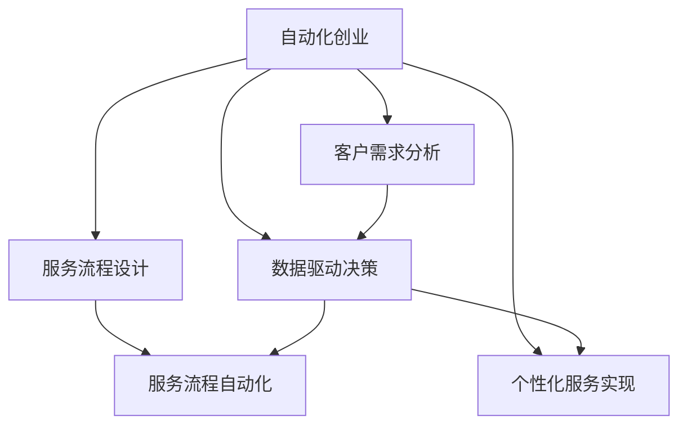

                 

# 自动化创业中的定制化服务模式

> 关键词：自动化创业, 定制化服务, 机器学习, 深度学习, 企业转型, 客户需求, 数据驱动, 个性化, 人工智能

## 1. 背景介绍

随着数字技术和大数据时代的到来，自动化创业模式已经成为越来越多企业寻求新增长点、降低运营成本、提高服务质量的重要手段。特别是在面对日益激烈的市场竞争和不断变化的用户需求时，传统的商业模式和技术手段已无法满足企业发展需要。以机器学习和深度学习为核心的自动化技术，为各行各业的企业提供了新的技术可能性，催生了全新的定制化服务模式。本文旨在探讨自动化创业中的定制化服务模式，分析其核心原理和应用场景，提出未来发展趋势与挑战。

### 1.1 问题由来

当前，自动化技术在各行各业的应用已经非常广泛，从制造业到金融业，从零售业到医疗健康，自动化技术在提高效率、降低成本、提升服务质量等方面发挥了重要作用。但随着市场需求的多样化和个性化，传统的“一刀切”的自动化解决方案已无法完全满足客户需求。如何将自动化技术与个性化服务相结合，提供定制化的解决方案，成为自动化创业中的一个重要课题。

### 1.2 问题核心关键点

定制化服务模式的核心在于如何结合客户需求和自动化技术，构建灵活、可扩展的自动化服务体系。其关键点包括：

- **客户需求分析**：准确识别和分析客户需求，通过数据驱动的方式获取客户痛点，是定制化服务的基础。
- **服务流程设计**：设计高效的自动化服务流程，利用机器学习、深度学习等技术自动化处理业务逻辑，实现服务效率的提升。
- **个性化服务实现**：结合人工智能技术，针对不同客户的需求提供个性化的解决方案，实现客户满意度的最大化。
- **持续优化与反馈**：基于客户反馈持续优化服务流程，提升服务质量和用户体验。

## 2. 核心概念与联系

### 2.1 核心概念概述

为更好地理解自动化创业中的定制化服务模式，本节将介绍几个密切相关的核心概念：

- **自动化创业**：指利用自动化技术构建新业务、优化现有业务流程、提升服务质量的过程。通常涉及机器人流程自动化(RPA)、机器学习、深度学习、自然语言处理(NLP)、计算机视觉等领域。

- **定制化服务**：指针对不同客户的需求，提供个性化、差异化的服务解决方案。这种服务模式强调对客户需求的精确分析、服务流程的灵活设计和服务结果的个性化定制。

- **机器学习与深度学习**：通过数据训练模型，使模型能够学习数据中的规律，并基于规律进行预测、分类、聚类等任务。机器学习通常用于处理结构化数据，而深度学习则更擅长处理非结构化数据，如图像、文本等。

- **服务流程自动化**：通过自动化技术，如RPA、自动化工作流管理(AOWM)、自动化测试等，将繁琐、重复的业务流程自动化，提升工作效率和质量。

- **数据驱动决策**：通过分析海量数据，挖掘数据中的规律和模式，为决策提供依据。在自动化创业中，数据驱动决策贯穿于客户需求分析、服务流程设计、个性化服务实现等各个环节。

- **人工智能(AI)**：结合机器学习、深度学习、自然语言处理、计算机视觉等多种技术，使机器能够执行需要人类智能的任务。在定制化服务模式中，AI技术能够帮助企业实现客户需求的自动识别、服务流程的自动化处理、服务结果的个性化推荐等。

这些核心概念之间的逻辑关系可以通过以下Mermaid流程图来展示：



这个流程图展示自动化创业中的定制化服务模式的核心概念及其之间的关系：

1. 客户需求分析是整个服务模式的基础，数据驱动决策是重要工具。
2. 服务流程设计和服务流程自动化是提升服务效率的关键。
3. 个性化服务实现是满足客户需求的核心手段。
4. 这些环节相互支撑，共同构建了自动化创业中的定制化服务模式。

## 3. 核心算法原理 & 具体操作步骤

### 3.1 算法原理概述

在自动化创业中，定制化服务模式的核心算法主要涉及机器学习和深度学习。以下将介绍这两种算法的基本原理和在定制化服务中的应用。

- **机器学习算法**：通过数据训练模型，使模型能够根据历史数据预测未来事件。在定制化服务中，机器学习模型可用于客户需求的预测、服务流程的优化等。

- **深度学习算法**：通过多层神经网络结构，使模型能够处理非结构化数据，如图像、文本等。在定制化服务中，深度学习模型可用于自然语言理解、图像识别、情感分析等。

### 3.2 算法步骤详解

基于机器学习和深度学习的定制化服务模式，通常包括以下几个关键步骤：

**Step 1: 数据收集与预处理**

- 收集客户的原始数据，包括但不限于历史行为数据、文本数据、图像数据等。
- 对数据进行清洗、去重、归一化等预处理操作，确保数据的准确性和一致性。

**Step 2: 模型选择与训练**

- 根据任务需求，选择合适的机器学习或深度学习模型。例如，对于文本分类任务，可以选择朴素贝叶斯、支持向量机、卷积神经网络(CNN)、长短期记忆网络(LSTM)等模型。
- 使用训练数据对模型进行训练，调整模型参数，使其能够适应具体任务。

**Step 3: 模型评估与优化**

- 使用测试数据对训练好的模型进行评估，计算模型的准确率、召回率、F1分数等指标。
- 根据评估结果，调整模型参数、优化模型结构，进一步提升模型的性能。

**Step 4: 服务实现与迭代**

- 将训练好的模型部署到实际服务中，实现自动化的定制化服务。例如，使用自然语言处理技术，自动分析客户需求并提供个性化服务。
- 根据用户反馈和业务需求，持续优化和迭代服务流程，提升服务质量和用户体验。

### 3.3 算法优缺点

基于机器学习和深度学习的定制化服务模式具有以下优点：

- **高效性**：自动化技术能够处理大规模、复杂的数据，提升服务效率和响应速度。
- **灵活性**：机器学习和深度学习模型可以动态调整和优化，适应不同场景和需求。
- **准确性**：通过大量数据的训练，模型能够准确预测和推荐服务，减少人为误差。

同时，这种算法也存在一些缺点：

- **数据依赖性高**：模型的性能高度依赖于数据的质量和数量，获取高质量数据成本较高。
- **模型复杂度高**：深度学习模型结构复杂，训练和优化需要较高的计算资源和时间。
- **可解释性不足**：机器学习和深度学习模型通常是“黑盒”模型，难以解释其内部工作机制。
- **敏感性问题**：模型可能会受到训练数据中的偏见影响，导致不公平、歧视性的输出。

### 3.4 算法应用领域

基于机器学习和深度学习的定制化服务模式，在多个领域都有广泛应用，例如：

- **智能客服**：通过自然语言处理技术，自动分析和响应客户问题，提升客服效率和质量。
- **推荐系统**：基于用户历史行为和偏好，推荐个性化的产品和服务，提升用户满意度和购买转化率。
- **金融风控**：通过分析交易数据，预测和防范金融欺诈和风险，保障金融安全。
- **健康医疗**：利用图像识别和自然语言处理技术，提供个性化的健康管理服务。
- **智能制造**：通过工业物联网数据，自动优化生产流程，提高生产效率和质量。

## 4. 数学模型和公式 & 详细讲解

### 4.1 数学模型构建

在定制化服务模式中，常见的数学模型包括线性回归模型、决策树模型、朴素贝叶斯模型、支持向量机模型、卷积神经网络(CNN)、长短期记忆网络(LSTM)等。

以线性回归模型为例，假设输入数据为 $x=(x_1, x_2, ..., x_n)$，输出数据为 $y$，则线性回归模型的目标是最小化损失函数：

$$
\mathcal{L}(\theta) = \frac{1}{2N} \sum_{i=1}^N (y_i - \theta_0 - \theta_1x_{i1} - ... - \theta_px_{ip})^2
$$

其中，$\theta = (\theta_0, \theta_1, ..., \theta_p)$ 为模型参数。

### 4.2 公式推导过程

线性回归模型的推导过程如下：

假设有一组训练数据 $(x_1, y_1), (x_2, y_2), ..., (x_N, y_N)$，其中 $x_i = (x_{i1}, x_{i2}, ..., x_{ip})$，$y_i$ 为真实输出。

根据最小二乘法，线性回归模型的目标是找到一组参数 $\theta = (\theta_0, \theta_1, ..., \theta_p)$，使得预测值 $\hat{y}_i = \theta_0 + \theta_1x_{i1} + ... + \theta_px_{ip}$ 与真实值 $y_i$ 的差异最小。

将上述公式转化为矩阵形式：

$$
\mathcal{L}(\theta) = \frac{1}{2N} \|Y - X\theta\|^2
$$

其中，$X = \begin{bmatrix}
1 & x_{11} & ... & x_{1p} \\
1 & x_{21} & ... & x_{2p} \\
... & ... & ... & ... \\
1 & x_{N1} & ... & x_{Np}
\end{bmatrix}$，$Y = \begin{bmatrix}
y_1 \\
y_2 \\
... \\
y_N
\end{bmatrix}$，$\|Y - X\theta\|^2 = (Y - X\theta)^T(Y - X\theta)$。

求导并令导数为0，得到：

$$
\frac{\partial \mathcal{L}(\theta)}{\partial \theta} = 0 \Rightarrow \frac{\partial}{\partial \theta}(\|Y - X\theta\|^2) = 0 \Rightarrow X^T(Y - X\theta) = 0
$$

求解上述方程，得到：

$$
\theta = (X^TX)^{-1}X^TY
$$

### 4.3 案例分析与讲解

以智能客服为例，自然语言处理技术常用于客户需求的自动识别和分析。假设有一组训练数据 $(x_1, y_1), (x_2, y_2), ..., (x_N, y_N)$，其中 $x_i = (x_{i1}, x_{i2}, ..., x_{ip})$ 为问题文本，$y_i$ 为意图标签，如 "订单查询"、"售后服务"、"产品咨询" 等。

使用朴素贝叶斯算法，模型的训练过程如下：

1. 收集历史客户问题和意图数据，对数据进行预处理和归一化。
2. 使用贝叶斯公式计算每个词出现的概率 $P(w|c)$ 和意图出现的概率 $P(c)$。
3. 根据贝叶斯公式，计算给定文本 $x_i$ 属于某个意图的概率 $P(c|x_i)$。
4. 选择概率最大的意图作为最终预测结果。

通过上述步骤，可以构建一个简单的自然语言处理模型，实现智能客服的自动化处理。

## 5. 项目实践：代码实例和详细解释说明

### 5.1 开发环境搭建

在进行定制化服务模式的项目实践前，我们需要准备好开发环境。以下是使用Python进行PyTorch开发的环境配置流程：

1. 安装Anaconda：从官网下载并安装Anaconda，用于创建独立的Python环境。

2. 创建并激活虚拟环境：
```bash
conda create -n pytorch-env python=3.8 
conda activate pytorch-env
```

3. 安装PyTorch：根据CUDA版本，从官网获取对应的安装命令。例如：
```bash
conda install pytorch torchvision torchaudio cudatoolkit=11.1 -c pytorch -c conda-forge
```

4. 安装TensorFlow：
```bash
conda install tensorflow
```

5. 安装各类工具包：
```bash
pip install numpy pandas scikit-learn matplotlib tqdm jupyter notebook ipython
```

完成上述步骤后，即可在`pytorch-env`环境中开始定制化服务模式的项目实践。

### 5.2 源代码详细实现

下面我们以智能客服系统为例，给出使用PyTorch进行自然语言处理模型训练和微调的PyTorch代码实现。

首先，定义智能客服系统的数据处理函数：

```python
from torch.utils.data import Dataset
import torch

class ChatDataset(Dataset):
    def __init__(self, dialogues):
        self.dialogues = dialogues
        
    def __len__(self):
        return len(self.dialogues)
    
    def __getitem__(self, item):
        dialogue = self.dialogues[item]
        query = dialogue['query']
        response = dialogue['response']
        return {'query': query, 'response': response}

# 创建dataset
train_dataset = ChatDataset(train_dialogues)
test_dataset = ChatDataset(test_dialogues)
```

然后，定义模型和优化器：

```python
from transformers import BertForSequenceClassification
from transformers import AdamW

model = BertForSequenceClassification.from_pretrained('bert-base-uncased', num_labels=num_labels)

optimizer = AdamW(model.parameters(), lr=2e-5)
```

接着，定义训练和评估函数：

```python
from torch.utils.data import DataLoader
from tqdm import tqdm
from sklearn.metrics import accuracy_score

device = torch.device('cuda') if torch.cuda.is_available() else torch.device('cpu')
model.to(device)

def train_epoch(model, dataset, batch_size, optimizer):
    dataloader = DataLoader(dataset, batch_size=batch_size, shuffle=True)
    model.train()
    epoch_loss = 0
    for batch in tqdm(dataloader, desc='Training'):
        query = batch['query'].to(device)
        response = batch['response'].to(device)
        model.zero_grad()
        outputs = model(query)
        loss = outputs.loss
        epoch_loss += loss.item()
        loss.backward()
        optimizer.step()
    return epoch_loss / len(dataloader)

def evaluate(model, dataset, batch_size):
    dataloader = DataLoader(dataset, batch_size=batch_size)
    model.eval()
    preds, labels = [], []
    with torch.no_grad():
        for batch in tqdm(dataloader, desc='Evaluating'):
            query = batch['query'].to(device)
            response = batch['response'].to(device)
            batch_preds = model(query).logits.argmax(dim=1).to('cpu').tolist()
            batch_labels = batch['labels'].to('cpu').tolist()
            for pred, label in zip(batch_preds, batch_labels):
                preds.append(pred)
                labels.append(label)
                
    print('Accuracy:', accuracy_score(labels, preds))
```

最后，启动训练流程并在测试集上评估：

```python
epochs = 5
batch_size = 16

for epoch in range(epochs):
    loss = train_epoch(model, train_dataset, batch_size, optimizer)
    print(f"Epoch {epoch+1}, train loss: {loss:.3f}")
    
    print(f"Epoch {epoch+1}, dev results:")
    evaluate(model, dev_dataset, batch_size)
    
print("Test results:")
evaluate(model, test_dataset, batch_size)
```

以上就是使用PyTorch进行智能客服系统训练和微调的完整代码实现。可以看到，得益于Transformers库的强大封装，我们可以用相对简洁的代码完成BERT模型的加载和微调。

### 5.3 代码解读与分析

让我们再详细解读一下关键代码的实现细节：

**ChatDataset类**：
- `__init__`方法：初始化对话数据集。
- `__len__`方法：返回数据集的样本数量。
- `__getitem__`方法：对单个对话进行数据处理，将问题和回答编码成模型的输入格式。

**train_epoch函数**：
- 使用DataLoader对数据集进行批次化加载，供模型训练使用。
- 在每个批次上前向传播计算loss并反向传播更新模型参数，最后返回该epoch的平均loss。

**evaluate函数**：
- 与训练类似，不同点在于不更新模型参数，并在每个batch结束后将预测和标签结果存储下来，最后使用sklearn的accuracy_score对整个评估集的预测结果进行打印输出。

**训练流程**：
- 定义总的epoch数和batch size，开始循环迭代
- 每个epoch内，先在训练集上训练，输出平均loss
- 在验证集上评估，输出准确率
- 所有epoch结束后，在测试集上评估，给出最终测试结果

可以看到，PyTorch配合Transformers库使得BERT微调的代码实现变得简洁高效。开发者可以将更多精力放在数据处理、模型改进等高层逻辑上，而不必过多关注底层的实现细节。

当然，工业级的系统实现还需考虑更多因素，如模型的保存和部署、超参数的自动搜索、更灵活的任务适配层等。但核心的微调范式基本与此类似。

## 6. 实际应用场景

### 6.1 智能客服系统

基于自然语言处理技术的智能客服系统，能够实现对客户需求的自动识别和响应。通过收集和分析历史客服数据，训练出能够理解不同客户意图和情绪的模型，实现高效的自动化客服处理。

在技术实现上，可以采用BERT等预训练语言模型，在客户问题和意图数据上进行微调。微调后的模型能够学习到不同意图的特征，通过输入文本自动预测客户需求，生成相应的回复，提升客服响应速度和质量。

### 6.2 推荐系统

推荐系统通过分析用户的历史行为数据和兴趣标签，推荐个性化的产品和服务，提升用户满意度和购买转化率。基于深度学习模型的推荐系统，可以处理大量非结构化数据，准确捕捉用户偏好，提供精准的个性化推荐。

在技术实现上，可以采用RNN、LSTM、Transformer等模型，在用户行为数据上进行微调。微调后的模型能够学习到用户行为规律，预测用户可能感兴趣的产品，推荐个性化内容，提升用户体验和转化率。

### 6.3 金融风控

金融风控系统通过分析交易数据，预测和防范金融欺诈和风险，保障金融安全。基于机器学习模型的风控系统，能够实时监控交易行为，识别异常交易，降低金融风险。

在技术实现上，可以采用SVM、决策树、随机森林等模型，在交易数据上进行微调。微调后的模型能够学习到欺诈行为和正常行为的特征，实时预测交易风险，采取相应的防控措施，保障金融安全。

### 6.4 未来应用展望

随着自动化技术的发展，定制化服务模式将有更广阔的应用前景。未来，自动化创业中的定制化服务模式将呈现以下几个趋势：

- **多模态融合**：将文本、图像、语音等多模态数据融合，构建更加全面、准确的用户画像，提升个性化服务水平。
- **跨领域迁移**：通过迁移学习，将在大规模数据上预训练的模型迁移到特定领域，提升模型在新场景下的性能。
- **联邦学习**：采用联邦学习技术，保护用户隐私的同时，提高模型的泛化能力和个性化服务水平。
- **实时优化**：采用在线学习技术，实时优化模型参数，提升服务质量和用户满意度。
- **低延迟处理**：通过边缘计算和模型压缩等技术，提升服务的实时性，满足用户对低延迟处理的需求。

总之，自动化创业中的定制化服务模式将为各行各业带来新的机遇和挑战，推动技术创新和业务升级，成为未来数字化转型中的重要驱动力。

## 7. 工具和资源推荐

### 7.1 学习资源推荐

为了帮助开发者系统掌握自动化创业中的定制化服务模式，这里推荐一些优质的学习资源：

1. 《深度学习》系列书籍：由多位深度学习专家合著，系统讲解深度学习算法和实践，适合初学者和进阶者。

2. 《机器学习实战》系列书籍：通过实战项目，深入浅出地介绍机器学习算法和应用，适合快速入门。

3. 《Python深度学习》书籍：由Google深度学习团队编写，详细讲解深度学习算法和TensorFlow框架的使用，适合深度学习开发者。

4. Coursera《深度学习》课程：由斯坦福大学教授Andrew Ng主讲，系统讲解深度学习算法和应用，适合线上学习。

5. Kaggle：数据科学竞赛平台，提供大量真实数据集和比赛，适合练习和提升算法能力。

通过对这些资源的学习实践，相信你一定能够快速掌握自动化创业中的定制化服务模式，并用于解决实际的NLP问题。

### 7.2 开发工具推荐

高效的开发离不开优秀的工具支持。以下是几款用于自动化创业中的定制化服务模式开发的常用工具：

1. PyTorch：基于Python的开源深度学习框架，灵活动态的计算图，适合快速迭代研究。

2. TensorFlow：由Google主导开发的开源深度学习框架，生产部署方便，适合大规模工程应用。

3. Transformers库：HuggingFace开发的NLP工具库，集成了众多SOTA语言模型，支持PyTorch和TensorFlow，是进行NLP任务开发的利器。

4. Weights & Biases：模型训练的实验跟踪工具，可以记录和可视化模型训练过程中的各项指标，方便对比和调优。

5. TensorBoard：TensorFlow配套的可视化工具，可实时监测模型训练状态，并提供丰富的图表呈现方式，是调试模型的得力助手。

6. Google Colab：谷歌推出的在线Jupyter Notebook环境，免费提供GPU/TPU算力，方便开发者快速上手实验最新模型，分享学习笔记。

合理利用这些工具，可以显著提升自动化创业中定制化服务模式的开发效率，加快创新迭代的步伐。

### 7.3 相关论文推荐

自动化创业中的定制化服务模式的研究源于学界的持续研究。以下是几篇奠基性的相关论文，推荐阅读：

1. Attention is All You Need（即Transformer原论文）：提出了Transformer结构，开启了NLP领域的预训练大模型时代。

2. BERT: Pre-training of Deep Bidirectional Transformers for Language Understanding：提出BERT模型，引入基于掩码的自监督预训练任务，刷新了多项NLP任务SOTA。

3. Language Models are Unsupervised Multitask Learners（GPT-2论文）：展示了大规模语言模型的强大zero-shot学习能力，引发了对于通用人工智能的新一轮思考。

4. Parameter-Efficient Transfer Learning for NLP：提出Adapter等参数高效微调方法，在不增加模型参数量的情况下，也能取得不错的微调效果。

5. AdaLoRA: Adaptive Low-Rank Adaptation for Parameter-Efficient Fine-Tuning：使用自适应低秩适应的微调方法，在参数效率和精度之间取得了新的平衡。

这些论文代表了大语言模型微调技术的发展脉络。通过学习这些前沿成果，可以帮助研究者把握学科前进方向，激发更多的创新灵感。

## 8. 总结：未来发展趋势与挑战

### 8.1 总结

本文对自动化创业中的定制化服务模式进行了全面系统的介绍。首先阐述了自动化创业的背景和意义，明确了定制化服务模式的核心思想和实现路径。其次，从原理到实践，详细讲解了机器学习和深度学习在定制化服务中的应用，给出了微调任务开发的完整代码实例。同时，本文还广泛探讨了定制化服务模式在智能客服、推荐系统、金融风控等多个行业领域的应用前景，展示了其广阔的应用潜力。

通过本文的系统梳理，可以看到，基于机器学习和深度学习的定制化服务模式，正在成为自动化创业中的重要范式，极大地拓展了预训练语言模型的应用边界，催生了更多的落地场景。未来，伴随预训练语言模型和微调方法的不断演进，相信自动化创业将进一步推动技术创新和业务升级，成为未来数字化转型中的重要驱动力。

### 8.2 未来发展趋势

展望未来，自动化创业中的定制化服务模式将呈现以下几个发展趋势：

- **深度融合多模态数据**：将文本、图像、语音等多模态数据融合，构建更加全面、准确的用户画像，提升个性化服务水平。
- **跨领域迁移学习**：通过迁移学习，将在大规模数据上预训练的模型迁移到特定领域，提升模型在新场景下的性能。
- **联邦学习与隐私保护**：采用联邦学习技术，保护用户隐私的同时，提高模型的泛化能力和个性化服务水平。
- **实时优化与在线学习**：采用在线学习技术，实时优化模型参数，提升服务质量和用户满意度。
- **低延迟处理与边缘计算**：通过边缘计算和模型压缩等技术，提升服务的实时性，满足用户对低延迟处理的需求。

以上趋势凸显了自动化创业中定制化服务模式的发展潜力。这些方向的探索发展，必将进一步提升服务的智能化水平，为自动化创业带来新的突破。

### 8.3 面临的挑战

尽管定制化服务模式已经取得了瞩目成就，但在迈向更加智能化、普适化应用的过程中，它仍面临着诸多挑战：

- **数据质量与获取成本**：高质量数据的获取成本较高，如何构建大规模、高质量的定制化数据集，是实现高效定制化服务的关键。
- **模型复杂性与计算资源**：深度学习模型结构复杂，训练和优化需要较高的计算资源和时间。如何在有限的计算资源下，高效训练和优化模型，是实现个性化服务的关键。
- **模型泛化能力与过拟合风险**：深度学习模型可能存在过拟合风险，难以泛化到新场景。如何设计合理的正则化技术，提高模型的泛化能力，是实现定制化服务的关键。
- **用户隐私与安全**：在收集和处理用户数据时，如何保护用户隐私，防止数据泄露和滥用，是实现定制化服务的关键。
- **服务性能与用户体验**：在实现个性化服务的同时，如何保证服务性能和用户体验，是实现定制化服务的关键。

正视定制化服务模式面临的这些挑战，积极应对并寻求突破，将是大语言模型微调走向成熟的必由之路。相信随着学界和产业界的共同努力，这些挑战终将一一被克服，定制化服务模式必将在自动化创业中发挥更大的作用。

### 8.4 研究展望

面对自动化创业中的定制化服务模式所面临的挑战，未来的研究需要在以下几个方面寻求新的突破：

- **探索无监督和半监督学习方法**：摆脱对大规模标注数据的依赖，利用自监督学习、主动学习等无监督和半监督范式，最大限度利用非结构化数据，实现更加灵活高效的微调。
- **研究参数高效和计算高效的微调范式**：开发更加参数高效的微调方法，在固定大部分预训练参数的同时，只更新极少量的任务相关参数。同时优化微调模型的计算图，减少前向传播和反向传播的资源消耗，实现更加轻量级、实时性的部署。
- **融合因果分析和博弈论工具**：将因果分析方法引入微调模型，识别出模型决策的关键特征，增强输出解释的因果性和逻辑性。借助博弈论工具刻画人机交互过程，主动探索并规避模型的脆弱点，提高系统稳定性。
- **纳入伦理道德约束**：在模型训练目标中引入伦理导向的评估指标，过滤和惩罚有偏见、有害的输出倾向。同时加强人工干预和审核，建立模型行为的监管机制，确保输出符合人类价值观和伦理道德。

这些研究方向的探索，必将引领定制化服务模式技术迈向更高的台阶，为自动化创业带来新的突破。面向未来，定制化服务模式还需要与其他人工智能技术进行更深入的融合，如知识表示、因果推理、强化学习等，多路径协同发力，共同推动自然语言理解和智能交互系统的进步。只有勇于创新、敢于突破，才能不断拓展语言模型的边界，让智能技术更好地造福人类社会。

## 9. 附录：常见问题与解答

**Q1：如何构建大规模、高质量的定制化数据集？**

A: 构建大规模、高质量的定制化数据集，需要从以下几个方面入手：

1. **数据收集**：通过爬虫、API接口、第三方数据服务等渠道，收集与业务相关的数据。

2. **数据清洗**：对收集到的数据进行去重、去噪、归一化等处理，确保数据的准确性和一致性。

3. **数据标注**：为数据集中的每个样本标注意图、情绪、属性等信息，确保数据的质量和可解释性。

4. **数据增强**：通过数据增强技术，扩充训练集，提高模型的泛化能力。例如，在文本数据上，可以进行同义词替换、回译等操作。

5. **数据融合**：将多源异构的数据进行融合，构建更加全面、准确的用户画像，提升个性化服务水平。例如，将文本数据和图像数据结合，构建更加全面的用户画像。

**Q2：在训练深度学习模型时，如何选择合适的网络结构？**

A: 选择合适的网络结构是深度学习模型训练的关键。以下是一些选择网络结构的基本原则：

1. **任务需求**：根据具体任务需求，选择合适的网络结构。例如，文本分类任务可以选择卷积神经网络（CNN）或长短期记忆网络（LSTM），图像识别任务可以选择卷积神经网络（CNN）或残差网络（ResNet）。

2. **数据规模**：根据数据规模，选择合适的网络结构。数据规模较大时，可以选择更深的神经网络结构；数据规模较小时，可以选择较浅的网络结构。

3. **计算资源**：根据计算资源，选择合适的网络结构。计算资源有限时，可以选择参数量较小的网络结构，如MobileNet、SqueezeNet等。

4. **可解释性**：根据可解释性需求，选择合适的网络结构。可解释性要求较高时，可以选择更简单的网络结构，如全连接网络（FCN）、线性回归等。

5. **先验知识**：根据先验知识，选择合适的网络结构。先验知识较多的任务，可以选择预训练模型，如BERT、GPT等。

**Q3：在定制化服务模式中，如何进行服务流程设计？**

A: 服务流程设计是定制化服务模式的核心环节，涉及业务逻辑的自动化处理。以下是一些服务流程设计的基本步骤：

1. **业务需求分析**：明确业务需求，确定需要自动化的环节。例如，智能客服中需要自动处理客户问题的识别和响应。

2. **数据预处理**：收集和处理数据，确保数据的质量和一致性。例如，收集客户对话数据，进行去重、清洗等处理。

3. **模型选择与训练**：根据业务需求，选择合适的机器学习或深度学习模型，并在训练集上进行训练。例如，使用BERT模型进行智能客服的对话处理。

4. **模型评估与优化**：在测试集上评估模型性能，根据评估结果调整模型参数和结构，提升模型性能。例如，使用交叉验证、网格搜索等技术优化模型参数。

5. **服务部署与监控**：将训练好的模型部署到实际服务中，实时监控模型性能，及时调整和优化模型。例如，使用A/B测试、在线学习等技术优化服务效果。

**Q4：在定制化服务模式中，如何保护用户隐私？**

A: 在定制化服务模式中，保护用户隐私是至关重要的。以下是一些保护用户隐私的基本措施：

1. **数据匿名化**：对用户数据进行匿名化处理，确保数据无法直接识别用户身份。例如，对姓名、身份证号等敏感信息进行脱敏处理。

2. **数据加密**：对用户数据进行加密处理，防止数据泄露和滥用。例如，使用AES、RSA等加密算法对数据进行加密。

3. **访问控制**：对用户数据进行访问控制，确保只有授权人员可以访问数据。例如，使用RBAC、ABAC等访问控制策略。

4. **数据共享协议**：制定数据共享协议，明确数据的使用范围和权限。例如，制定数据使用协议，确保数据只用于特定业务场景。

5. **隐私保护技术**：采用隐私保护技术，如差分隐私、联邦学习等，保护用户隐私。例如，使用差分隐私技术对数据进行处理，防止数据泄露。

**Q5：在定制化服务模式中，如何提高模型的泛化能力？**

A: 提高模型的泛化能力是定制化服务模式的关键。以下是一些提高模型泛化能力的基本方法：

1. **数据增强**：通过数据增强技术，扩充训练集，提高模型的泛化能力。例如，在文本数据上，可以进行同义词替换、回译等操作。

2. **正则化技术**：使用正则化技术，防止模型过拟合。例如，使用L2正则、Dropout、Early Stopping等技术。

3. **模型简化**：通过模型简化，降低模型复杂度，提高模型的泛化能力。例如，使用剪枝、量化等技术对模型进行简化。

4. **迁移学习**：通过迁移学习，将在大规模数据上预训练的模型迁移到特定领域，提升模型在新场景下的性能。例如，在大规模图像数据上预训练的模型，迁移到特定领域图像分类任务中。

5. **多任务学习**：通过多任务学习，提高模型的泛化能力。例如，将多个相关任务联合训练，提高模型对不同任务的适应能力。

**Q6：在定制化服务模式中，如何提高服务的实时性？**

A: 提高服务的实时性是定制化服务模式的重要目标。以下是一些提高服务实时性的基本方法：

1. **边缘计算**：通过边缘计算，将计算任务分配到靠近用户设备的位置，减少延迟，提高服务实时性。例如，在智能客服系统中，将计算任务分配到用户的移动设备上。

2. **模型压缩**：通过模型压缩，减少模型大小，提高服务实时性。例如，使用知识蒸馏、剪枝、量化等技术对模型进行压缩。

3. **并行计算**：通过并行计算，提高服务实时性。例如，使用GPU、TPU等高性能计算设备，并行处理计算任务。

4. **缓存技术**：通过缓存技术，减少数据传输时间，提高服务实时性。例如，使用缓存技术对频繁访问的数据进行缓存。

5. **异步处理**：通过异步处理，提高服务实时性。例如，在智能客服系统中，使用异步处理技术，并行处理多个客户请求。

通过这些措施，可以有效提高定制化服务模式的实时性，提升用户体验。

