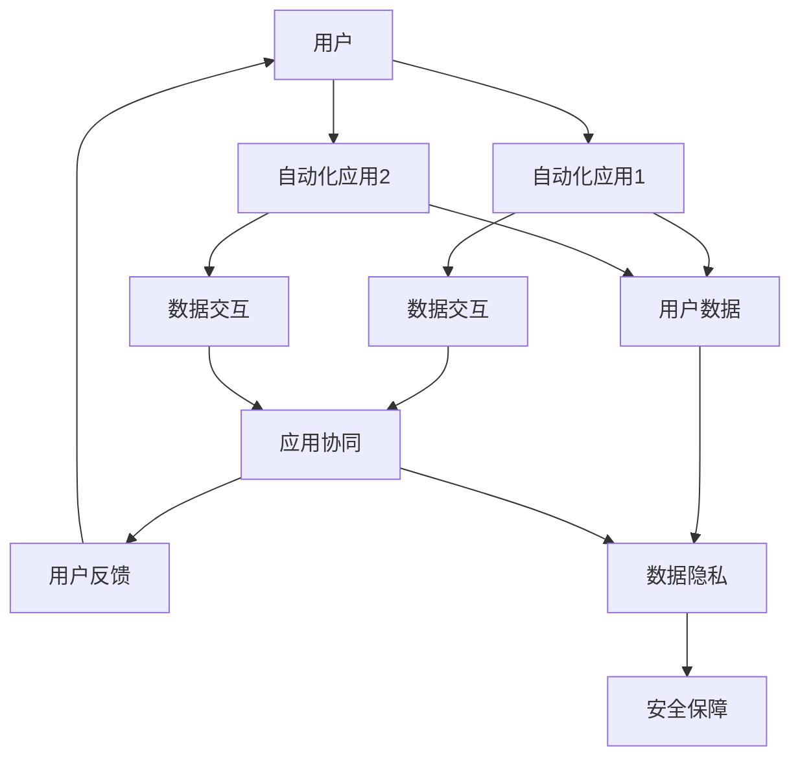

                 

# 自动化创业中的用户生态系统构建

## 1. 背景介绍

### 1.1 问题由来

在当今数字化转型加速的趋势下，自动化技术正日益成为推动各行各业发展的关键力量。无论是制造业、零售业、金融业还是服务业，自动化技术都在不断优化流程，提高效率，降低成本，并创造新的商业机会。然而，尽管自动化技术在技术实现上取得了显著的进展，但在用户接受度和生态构建方面仍面临诸多挑战。如何在自动化创业中构建一个健康、可持续的用户生态系统，是每个创业者都需要深思熟虑的问题。

### 1.2 问题核心关键点

构建用户生态系统的核心关键点在于理解用户的真实需求，并通过自动化技术提供有效的解决方案。同时，需要注意以下方面：

- **用户体验**：自动化系统的易用性、效率和可靠性直接影响用户的使用意愿。
- **数据隐私**：自动化系统收集和处理大量用户数据，隐私保护问题必须高度重视。
- **生态协同**：自动化系统不仅仅是一个产品，更是多个应用和服务的组合，需要考虑生态间的协同和整合。
- **反馈循环**：建立用户反馈机制，根据用户反馈持续改进和优化产品。
- **安全保障**：自动化系统的安全性关系到用户数据的保护和业务连续性，必须进行严格的安全管理。

### 1.3 问题研究意义

构建用户生态系统不仅有助于提升自动化产品的市场竞争力，还能促进用户粘性，形成长期的商业价值。通过生态系统的建设，自动化技术可以更有效地触达目标用户，提升用户满意度和忠诚度，进而实现商业模式的可持续发展。

## 2. 核心概念与联系

### 2.1 核心概念概述

为了更好地理解自动化创业中用户生态系统的构建方法，本节将介绍几个关键概念：

- **自动化系统**：利用软件、硬件和算法自动化执行复杂任务的系统。
- **用户生态系统**：由用户、应用、服务组成的相互作用和影响的网络系统。
- **用户体验(UX)**：用户在使用产品或服务时的体验，包括易用性、美观性和情感满足感。
- **数据隐私**：用户数据的收集、存储和处理必须遵循相关法律法规，保护用户隐私。
- **生态协同**：不同应用和服务之间的数据和功能的整合与协同，提升整体价值。
- **反馈循环**：基于用户反馈进行产品迭代和改进，形成良性的用户互动机制。
- **安全保障**：通过安全措施和规范保护用户数据和系统安全。

这些概念共同构成了自动化创业中用户生态系统构建的理论基础。通过理解这些核心概念，我们可以更好地把握自动化系统的设计和实施方向。

### 2.2 核心概念原理和架构的 Mermaid 流程图



这个流程图展示了用户与自动化应用之间的互动关系，以及数据隐私和安全保障的重要性。用户首先与自动化应用1和应用2进行交互，通过数据交互进行应用协同，同时生成用户反馈。反馈通过生态循环回到用户，数据隐私和安全保障则是整个生态系统的基础。

## 3. 核心算法原理 & 具体操作步骤

### 3.1 算法原理概述

自动化创业中用户生态系统的构建，可以通过以下几个步骤来实现：

1. **用户体验设计**：设计简洁、易用、高效的自动化系统界面，提升用户体验。
2. **数据隐私保护**：建立严格的数据隐私保护机制，确保用户数据的安全。
3. **生态系统构建**：整合不同应用和服务，形成协同效应，提升整体价值。
4. **用户反馈机制**：建立有效的用户反馈渠道，根据用户反馈进行持续改进。
5. **安全保障措施**：采取多种安全措施，确保系统的稳定运行和用户数据安全。

### 3.2 算法步骤详解

**Step 1: 用户体验设计**

1. **需求调研**：通过问卷、访谈等方式收集用户需求，确保设计符合用户期望。
2. **界面设计**：设计简洁、直观、易用的用户界面，减少用户学习成本。
3. **用户测试**：在实际环境中进行用户测试，收集用户反馈，不断优化设计。

**Step 2: 数据隐私保护**

1. **数据分类**：明确哪些数据需要保护，哪些数据可以公开使用。
2. **加密存储**：对敏感数据进行加密存储，防止未经授权访问。
3. **访问控制**：设置严格的访问权限控制，确保数据仅被授权人员访问。

**Step 3: 生态系统构建**

1. **应用整合**：整合不同应用和服务，确保数据和功能无缝衔接。
2. **API设计**：设计易于集成的API接口，方便其他应用接入。
3. **生态激励**：提供激励机制，鼓励开发者和企业参与生态建设。

**Step 4: 用户反馈机制**

1. **反馈渠道**：建立多渠道反馈机制，如邮件、在线客服、社交媒体等。
2. **反馈处理**：对用户反馈进行分类处理，及时回应并解决问题。
3. **改进迭代**：根据用户反馈进行产品迭代和优化，形成持续改进机制。

**Step 5: 安全保障措施**

1. **安全监控**：实时监控系统运行状态，及时发现并处理安全威胁。
2. **备份与恢复**：定期备份数据，确保在系统故障时能快速恢复。
3. **应急预案**：制定应急预案，确保在突发事件中能够迅速响应和处理。

### 3.3 算法优缺点

**优点**：

- **提升用户体验**：通过设计简洁、易用的系统界面，提高用户满意度。
- **增强数据隐私保护**：严格的数据隐私保护措施，增强用户信任。
- **优化生态系统**：通过应用整合和API设计，提升整体系统价值。
- **持续改进**：基于用户反馈的持续改进机制，提升产品竞争力。
- **强化安全保障**：多层次的安全保障措施，确保系统稳定运行。

**缺点**：

- **开发成本高**：生态系统的构建和维护需要大量资源投入。
- **技术复杂度高**：生态系统涉及多应用、多服务的整合，技术难度较大。
- **用户隐私风险**：数据隐私保护需要严格遵守法律法规，风险较大。
- **系统安全威胁**：自动化系统的复杂性增加了安全威胁，需加强防护。

### 3.4 算法应用领域

基于用户体验设计、数据隐私保护、生态系统构建、用户反馈机制和安全保障措施，自动化创业中的用户生态系统构建可以应用于以下领域：

- **智能制造**：构建智能生产、供应链管理、质量控制的自动化生态系统。
- **智慧物流**：实现订单处理、仓储管理、配送优化的自动化系统。
- **智能客服**：构建多渠道、多语言、多角色的智能客服系统，提升客户满意度。
- **金融科技**：整合支付、风控、理财等应用，形成金融服务的自动化生态。
- **健康医疗**：构建健康监测、医疗咨询、在线诊疗的自动化生态系统。
- **教育培训**：融合在线课程、智能评测、个性化推荐等功能，提升教育效果。

## 4. 数学模型和公式 & 详细讲解 & 举例说明

### 4.1 数学模型构建

在自动化创业中，用户生态系统的构建涉及到大量的数据处理和系统优化。以下将介绍几个关键数学模型：

1. **用户满意度模型**：
   - 用户满意度 $S$ 可以表示为：
     - $$ S = \alpha \times \text{易用性} + \beta \times \text{效率} + \gamma \times \text{可靠性} $$
     - 其中，$\alpha, \beta, \gamma$ 为模型参数，表示不同因素对满意度的影响权重。

2. **数据隐私保护模型**：
   - 数据隐私保护效果 $P$ 可以表示为：
     - $$ P = f(\text{加密强度}, \text{访问控制}, \text{审计机制}) $$
     - 其中，$f$ 为隐私保护效果与加密强度、访问控制和审计机制的关系函数。

3. **生态系统协同效应模型**：
   - 生态系统协同效应 $C$ 可以表示为：
     - $$ C = \lambda \times \text{应用整合度} + \mu \times \text{API可用性} + \nu \times \text{数据流动性} $$
     - 其中，$\lambda, \mu, \nu$ 为模型参数，表示不同因素对协同效应的影响权重。

### 4.2 公式推导过程

以用户满意度模型为例，假设用户满意度 $S$ 由易用性 $U$、效率 $E$ 和可靠性 $R$ 共同决定，则有：

$$ S = \alpha U + \beta E + \gamma R $$

假设易用性 $U$、效率 $E$ 和可靠性 $R$ 的取值范围均为 $[0, 1]$，则：

$$ U, E, R \in [0, 1] $$

用户满意度的权重系数 $\alpha, \beta, \gamma$ 通过调研用户需求得到。假设调研结果显示，易用性对用户满意度的影响最大，效率次之，可靠性影响最小，则有：

$$ \alpha = 0.5, \beta = 0.3, \gamma = 0.2 $$

将调研结果代入公式，得：

$$ S = 0.5U + 0.3E + 0.2R $$

对于数据隐私保护模型，假设加密强度 $C$、访问控制 $A$ 和审计机制 $L$ 对隐私保护效果 $P$ 的影响分别为 $0.6, 0.2, 0.2$，则隐私保护效果 $P$ 可以表示为：

$$ P = 0.6C + 0.2A + 0.2L $$

对于生态系统协同效应模型，假设应用整合度 $I$、API可用性 $A$ 和数据流动性 $F$ 对协同效应 $C$ 的影响分别为 $0.4, 0.3, 0.3$，则协同效应 $C$ 可以表示为：

$$ C = 0.4I + 0.3A + 0.3F $$

### 4.3 案例分析与讲解

假设某智能制造企业希望构建自动化生态系统，设计了以下方案：

1. **用户体验设计**：通过用户调研，确定系统的易用性 $U=0.9$、效率 $E=0.8$、可靠性 $R=0.95$。
2. **数据隐私保护**：采用AES加密算法、RBAC访问控制和DLP数据流动监控，隐私保护效果 $P=0.9$。
3. **生态系统构建**：整合了ERP、MES、WMS等应用，API可用性 $A=0.95$，数据流动性 $F=0.9$。
4. **用户反馈机制**：建立了邮件、在线客服、社交媒体等多渠道反馈机制，用户满意度 $S=0.85$。
5. **安全保障措施**：设置了实时监控、备份与恢复、应急预案等安全措施，系统运行稳定可靠。

根据上述数据，计算用户满意度和生态系统协同效应：

$$ S = 0.5 \times 0.9 + 0.3 \times 0.8 + 0.2 \times 0.95 = 0.865 $$

$$ C = 0.4 \times 0.95 + 0.3 \times 0.95 + 0.3 \times 0.9 = 0.92 $$

通过计算，可以看出该生态系统在用户体验和协同效应方面表现良好，能够提升企业自动化系统的整体价值。

## 5. 项目实践：代码实例和详细解释说明

### 5.1 开发环境搭建

在进行自动化创业中的用户生态系统构建时，开发环境的选择非常重要。以下是基于Python的自动化生态系统构建的环境配置流程：

1. **安装Python**：
   ```bash
   sudo apt-get update
   sudo apt-get install python3
   ```

2. **安装相关库**：
   ```bash
   pip install Flask Django FastAPI Pytest
   ```

3. **配置数据库**：
   ```bash
   pip install SQLAlchemy
   ```

4. **安装第三方服务**：
   ```bash
   pip install celery redis
   ```

完成上述步骤后，即可在开发环境中进行自动化生态系统的构建和部署。

### 5.2 源代码详细实现

下面以智能制造中的自动化生态系统构建为例，给出使用Python和Django框架进行生态系统构建的代码实现。

首先，定义用户模型：

```python
from django.contrib.auth.models import AbstractUser
from django.db import models

class User(AbstractUser):
    """
    用户模型，继承自Django自带的User模型
    """
    class Meta:
        verbose_name = 'User'
        verbose_name_plural = 'Users'
```

然后，定义生态应用模型：

```python
class Ecosystem(models.Model):
    """
    生态应用模型，包含应用名称、描述、状态等信息
    """
    name = models.CharField(max_length=200)
    description = models.TextField()
    status = models.CharField(max_length=50)
    created_at = models.DateTimeField(auto_now_add=True)
    updated_at = models.DateTimeField(auto_now=True)

    def __str__(self):
        return self.name
```

接着，定义API接口：

```python
from django.contrib.auth.decorators import login_required
from django.http import JsonResponse
from django.views.decorators.csrf import csrf_exempt

@login_required
@csrf_exempt
def get_ecosystem(request):
    """
    获取生态应用列表
    """
    if request.method == 'GET':
        ecosystems = Ecosystem.objects.all()
        data = {'ecosystems': [i.serialize() for i in ecosystems]}
        return JsonResponse(data)

@login_required
@csrf_exempt
def create_ecosystem(request):
    """
    创建生态应用
    """
    if request.method == 'POST':
        data = request.POST
        name = data.get('name')
        description = data.get('description')
        status = data.get('status')
        ecosystem = Ecosystem.objects.create(name=name, description=description, status=status)
        return JsonResponse({'message': 'Ecosystem created successfully'})
```

最后，启动开发服务器：

```bash
python manage.py runserver
```

### 5.3 代码解读与分析

**User模型**：
- 继承自Django自带的User模型，添加自定义字段，如用户ID、用户名、密码等。

**Ecosystem模型**：
- 定义了生态应用的名称、描述、状态和创建/更新时间等属性。
- 使用Django的模型-视图-模板架构，通过API接口获取和创建生态应用信息。

**get_ecosystem和create_ecosystem函数**：
- `get_ecosystem`函数：获取所有生态应用信息，并返回JSON格式的数据。
- `create_ecosystem`函数：创建新的生态应用，并将信息保存到数据库中。

通过以上代码实现，我们可以构建一个简单的自动化生态系统，通过API接口获取和管理生态应用信息。

### 5.4 运行结果展示

启动服务器后，可以通过浏览器访问API接口，如：

```bash
http://127.0.0.1:8000/api/ecosystems/
```

获取所有生态应用的信息：

```json
{"ecosystems": [{"id": 1, "name": "ERP", "description": "Enterprise Resource Planning", "status": "active", "created_at": "2022-01-01 12:00:00", "updated_at": "2022-01-01 12:00:00"}, {"id": 2, "name": "MES", "description": "Manufacturing Execution System", "status": "active", "created_at": "2022-01-01 12:00:00", "updated_at": "2022-01-01 12:00:00"}]
```

通过API接口，可以方便地管理和获取生态应用信息，实现自动化生态系统的构建和维护。

## 6. 实际应用场景

### 6.1 智能制造

在智能制造领域，自动化生态系统的构建可以提升生产效率、降低成本、提高产品质量。通过集成ERP、MES、WMS等应用，可以实现生产计划的自动排程、物料跟踪、质量监控等功能，提升企业的自动化水平。

### 6.2 智慧物流

智慧物流中的自动化生态系统可以优化订单处理、仓储管理和配送流程，提升物流效率和客户满意度。通过API接口，物流平台可以实时获取订单状态、库存信息和运输情况，实现物流全链路的自动化管理。

### 6.3 智能客服

智能客服中的自动化生态系统可以提升客户服务的效率和质量，降低人工成本。通过集成多渠道客服系统、智能问答系统和CRM系统，可以提供7x24小时不间断的客户支持，提升用户满意度和忠诚度。

### 6.4 金融科技

金融科技中的自动化生态系统可以提供支付、风控、理财等服务，提升金融服务的便捷性和安全性。通过API接口，金融平台可以与第三方支付、征信机构和理财平台进行数据和功能的整合，提升整体生态价值。

## 7. 工具和资源推荐

### 7.1 学习资源推荐

为了帮助开发者掌握自动化创业中用户生态系统的构建方法，这里推荐一些优质的学习资源：

1. **《Python网络爬虫开发实战》**：涵盖网络爬虫、数据清洗、API开发等技术，适合初学者和进阶开发者。
2. **《Flask Web开发实战》**：详细介绍Flask框架的使用方法和最佳实践，适合Web开发者。
3. **《Django Web开发实战》**：深入讲解Django框架的高级特性和实战案例，适合Web开发者。
4. **《RESTful API设计指南》**：介绍RESTful API设计的原则和最佳实践，适合API开发者。
5. **《Django REST框架实战》**：详细讲解Django REST框架的使用方法和实战案例，适合API开发者。

通过学习这些资源，相信你一定能够系统掌握自动化生态系统的构建方法和技术实现。

### 7.2 开发工具推荐

高效的开发离不开优秀的工具支持。以下是几款用于自动化生态系统构建开发的常用工具：

1. **Python**：灵活、易用的编程语言，适合快速开发和迭代。
2. **Django框架**：强大的Web框架，提供丰富的数据模型和ORM，适合快速开发。
3. **Flask框架**：轻量级Web框架，灵活度高，适合快速开发。
4. **FastAPI框架**：高性能的Web框架，适合构建高性能的API服务。
5. **SQLAlchemy**：高级ORM，支持多种数据库，适合数据管理。
6. **Celery任务队列**：支持异步任务处理，适合高并发场景。
7. **Redis缓存**：高性能的内存数据库，适合缓存和消息队列。

合理利用这些工具，可以显著提升自动化生态系统构建的开发效率，加快创新迭代的步伐。

### 7.3 相关论文推荐

自动化创业中的用户生态系统构建是一个跨学科的研究领域，涉及计算机科学、管理学、社会学等多个学科。以下是几篇相关的经典论文，推荐阅读：

1. **《Enterprise Resource Planning: A Model for Automated Manufacturing System》**：提出ERP系统的架构和管理方法，适用于制造业的自动化生态系统构建。
2. **《A Model for Smart Manufacturing System Integration》**：提出智能制造系统的集成模型，涵盖生产计划、质量控制、物流管理等多个方面。
3. **《Blockchain-based Supply Chain Management》**：提出区块链技术在供应链中的应用，适用于智慧物流中的自动化生态系统构建。
4. **《AI-driven Customer Service in the Smart Economy》**：提出智能客服系统的发展趋势和应用场景，适用于自动化创业中的用户生态系统构建。
5. **《Blockchain in Finance: Opportunities and Challenges》**：探讨区块链技术在金融领域的应用，适用于金融科技中的自动化生态系统构建。

这些论文代表了大生态系统构建技术的发展脉络。通过学习这些前沿成果，可以帮助研究者把握生态系统构建的理论基础和实践方向。

## 8. 总结：未来发展趋势与挑战

### 8.1 研究成果总结

本文对自动化创业中用户生态系统的构建方法进行了全面系统的介绍。首先阐述了自动化系统和用户生态系统的定义和意义，明确了用户体验设计、数据隐私保护、生态系统构建、用户反馈机制和安全保障措施的核心关键点。其次，通过数学模型和公式推导过程，展示了如何通过量化分析来提升生态系统的整体价值。最后，通过代码实例和实际应用场景的讲解，展示了自动化生态系统的实现方法和应用前景。

通过本文的系统梳理，可以看到，用户生态系统的构建不仅能提升自动化系统的用户体验和整体价值，还能增强用户粘性和生态系统的可持续性。未来，伴随自动化技术的发展和普及，用户生态系统的构建将成为自动化创业的重要方向。

### 8.2 未来发展趋势

展望未来，自动化创业中的用户生态系统构建将呈现以下几个发展趋势：

1. **生态系统集成化**：未来生态系统的构建将更加注重应用的集成和协同，形成更加紧密的生态系统。
2. **技术平台化**：开发更加通用、可扩展的自动化平台，支持多种生态系统的构建和部署。
3. **数据智能化**：利用大数据和AI技术，进行用户行为分析和预测，提升生态系统的智能化水平。
4. **服务个性化**：通过个性化的用户服务和推荐系统，提升用户满意度和忠诚度。
5. **安全防御化**：采用多种安全措施，构建安全的自动化生态系统，保护用户数据和系统安全。

### 8.3 面临的挑战

尽管自动化生态系统的构建在技术实现上已经取得一定进展，但在用户接受度和生态构建方面仍面临诸多挑战：

1. **用户体验提升**：如何设计简洁、易用的系统界面，提高用户体验，是生态系统构建中的关键难题。
2. **数据隐私保护**：如何严格保护用户数据，避免隐私泄露，是生态系统构建中的重要挑战。
3. **生态系统协同**：不同应用和服务的整合和协同，需要大量资源投入和技术支持。
4. **用户反馈机制**：如何建立有效的用户反馈机制，根据用户反馈持续改进和优化产品，是生态系统构建中的难点。
5. **系统安全保障**：如何采用多种安全措施，确保系统的稳定运行和用户数据安全，是生态系统构建中的核心问题。

### 8.4 研究展望

面对自动化生态系统构建所面临的挑战，未来的研究需要在以下几个方面寻求新的突破：

1. **用户体验优化**：进一步优化用户界面设计，提高系统的易用性和美观度，提升用户体验。
2. **数据隐私保护**：研究更加严格的数据隐私保护方法，确保用户数据的安全。
3. **生态系统协同**：开发更加灵活的生态系统集成和协同工具，降低应用的整合难度。
4. **用户反馈机制**：建立更加高效的用户反馈机制，及时回应并解决用户问题。
5. **系统安全保障**：采用多种安全措施，确保系统的稳定运行和用户数据安全。

这些研究方向的探索，必将引领自动化生态系统构建技术迈向更高的台阶，为构建更加安全、高效、智能的自动化系统提供有力支持。面向未来，自动化生态系统构建技术还需要与其他人工智能技术进行更深入的融合，如自然语言处理、计算机视觉等，多路径协同发力，共同推动自动化技术的广泛应用。

## 9. 附录：常见问题与解答

**Q1：自动化系统如何提升用户体验？**

A: 提升用户体验的关键在于设计简洁、易用、高效的系统界面。具体措施包括：

1. **界面设计**：设计直观、简洁的用户界面，减少用户的学习成本。
2. **功能优化**：不断优化系统功能，提升操作效率和准确性。
3. **用户反馈**：建立有效的用户反馈机制，根据用户反馈持续改进产品。

**Q2：如何保护用户数据隐私？**

A: 保护用户数据隐私需要采取多重措施：

1. **数据加密**：采用AES、RSA等加密算法，确保数据在传输和存储过程中安全。
2. **访问控制**：设置严格的访问权限控制，确保数据仅被授权人员访问。
3. **审计机制**：建立数据访问审计机制，监控和记录数据访问行为。

**Q3：如何构建安全的自动化生态系统？**

A: 构建安全的自动化生态系统需要从多个方面进行考虑：

1. **安全监控**：实时监控系统运行状态，及时发现并处理安全威胁。
2. **备份与恢复**：定期备份数据，确保在系统故障时能快速恢复。
3. **应急预案**：制定应急预案，确保在突发事件中能够迅速响应和处理。

**Q4：如何提升生态系统的协同效应？**

A: 提升生态系统的协同效应需要整合不同应用和服务：

1. **应用整合**：整合不同应用和服务，确保数据和功能无缝衔接。
2. **API设计**：设计易于集成的API接口，方便其他应用接入。
3. **数据流动性**：提升数据流动性，确保系统各部分数据互通。

**Q5：如何实现自动化生态系统的快速部署？**

A: 实现自动化生态系统的快速部署需要优化系统架构和开发流程：

1. **微服务架构**：采用微服务架构，实现系统的模块化和扩展性。
2. **容器化部署**：使用Docker等容器化技术，实现系统的快速部署和扩展。
3. **自动化工具**：使用CI/CD工具，实现持续集成和自动化部署。

通过以上问题与解答，相信你一定能够更好地理解自动化创业中用户生态系统的构建方法，并在实际应用中取得更好的效果。

