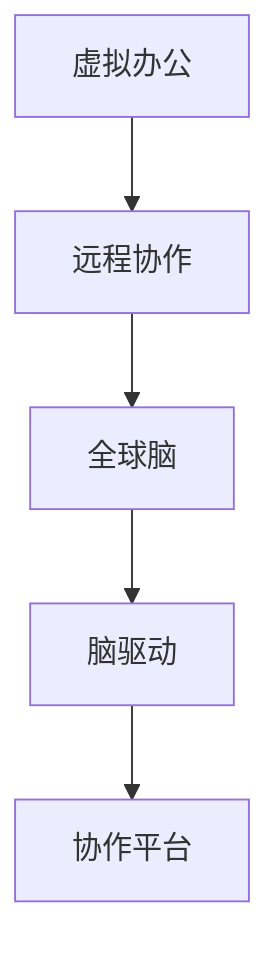

                 

# 虚拟办公:全球脑驱动的远程协作

> 关键词：虚拟办公,远程协作,全球脑,脑驱动,协作平台

## 1. 背景介绍

### 1.1 问题由来
在全球化的今天，企业对于办公模式的灵活性、协作效率和资源利用率提出了更高的要求。随着疫情的持续，企业不得不加速数字化转型，采用虚拟办公、远程协作等形式。然而，传统的办公模式和协作工具难以适应这一变化，亟需创新性解决方案。

### 1.2 问题核心关键点
虚拟办公与远程协作的核心在于构建一个高效的全球脑网络，使全球团队能够无缝协作、实时交互，从而实现高效、低成本、灵活的办公模式。核心问题包括：
- 如何构建全球脑：将分布各地的团队链接起来，形成高度协同的工作环境。
- 如何驱动全球脑：通过分布式协作平台，激发团队成员的创新潜力。
- 如何实现高效协作：利用先进的技术手段，消除地域和时差带来的障碍。

### 1.3 问题研究意义
虚拟办公与远程协作的普及，不仅有助于提升工作效率，降低企业运营成本，还能促进多样化的思维碰撞和创新，推动社会经济的发展。研究全球脑驱动的远程协作模式，对于构建未来办公生态、提升国际竞争力具有重要意义。

## 2. 核心概念与联系

### 2.1 核心概念概述

为更好地理解虚拟办公与远程协作，本节将介绍几个密切相关的核心概念：

- 虚拟办公（Virtual Office）：指通过网络技术，将传统意义上的固定办公场所转变为任何地方均可工作的模式。
- 远程协作（Remote Collaboration）：指远程团队之间通过通信工具、协作平台，实现信息共享、任务分配、进度追踪等协作活动。
- 全球脑（Global Brain）：通过连接世界各地的大脑，形成高度协同的创新网络。
- 脑驱动（Brain-Driving）：利用全球团队的智慧，激发创新潜力，提升整体协作效率。
- 协作平台（Collaboration Platform）：提供支持全球脑网络协作的软件系统，包括即时通讯、任务管理、文件共享等功能。

这些核心概念之间的逻辑关系可以通过以下Mermaid流程图来展示：



这个流程图展示了一个虚拟办公与远程协作的基本框架：
1. 通过虚拟办公，实现全球范围内的办公模式转变。
2. 远程协作工具为分布式团队提供信息共享和任务协同的平台。
3. 全球脑网络通过协作平台，形成高度协同的创新网络。
4. 脑驱动机制激发全球团队的智慧和创新，提升整体协作效率。

## 3. 核心算法原理 & 具体操作步骤
### 3.1 算法原理概述

虚拟办公与远程协作的核心算法原理基于分布式协作和分布式计算的概念。通过构建一个高效的全球脑网络，实现信息共享和任务协同。具体来说：

1. **分布式协作平台**：作为核心工具，提供即时通讯、任务管理、文件共享等功能，使得全球团队能够无缝协作。
2. **脑驱动机制**：通过分布式协作平台，激发全球团队的智慧和创新，提升整体协作效率。
3. **虚拟办公环境**：利用网络技术，打破地域限制，实现任何地点均可工作的模式。

### 3.2 算法步骤详解

虚拟办公与远程协作的具体实现步骤如下：

**Step 1: 构建全球脑网络**
- 收集各地团队的需求和偏好，设计全球脑网络架构，确定协作方式和沟通渠道。
- 选择合适的协作平台（如Slack、Microsoft Teams等），集成即时通讯、文件共享、任务管理等功能。

**Step 2: 实现脑驱动机制**
- 设计脑驱动机制，通过任务分配、进度追踪、反馈机制等，激发全球团队的创新和协作。
- 利用机器学习、数据分析等技术，预测任务进展，调整资源分配，优化协作流程。

**Step 3: 实现虚拟办公**
- 通过网络技术，搭建虚拟办公环境，支持在任何地点工作，打破地域和时间限制。
- 采用先进的设备和技术（如高清视频会议、虚拟现实等），提升远程协作的沉浸感和体验。

**Step 4: 评估与优化**
- 定期评估全球脑网络的协作效果，收集反馈意见。
- 基于评估结果，不断优化协作流程和平台功能，提升整体协作效率。

### 3.3 算法优缺点

虚拟办公与远程协作的实现方式具有以下优点：
1. 灵活性高：支持任何地点工作，打破地域和时间限制。
2. 成本低廉：减少固定办公场所和设备成本，提高资源利用率。
3. 效率提升：通过全球脑网络，实现信息共享和任务协同，提升整体协作效率。

同时，该方法也存在一定的局限性：
1. 技术依赖度高：需要依赖稳定的网络和先进的协作平台，对技术要求较高。
2. 文化差异：不同国家和地区的文化差异可能导致沟通障碍。
3. 信息安全：远程办公存在信息泄露和数据安全风险，需要严格的信息安全措施。
4. 人员管理：远程办公对员工自我管理能力要求高，需要配套的管理机制和培训。

尽管存在这些局限性，但就目前而言，虚拟办公与远程协作仍是大势所趋，并且具有广阔的应用前景。未来相关研究的重点在于如何进一步降低技术门槛，消除文化障碍，提升信息安全，优化人员管理，以进一步提升远程协作的效果。

### 3.4 算法应用领域

虚拟办公与远程协作技术已经在多个领域得到了广泛应用，包括但不限于：

- 软件开发：全球化软件开发团队通过协作平台，实现实时沟通和代码共享，提升开发效率。
- 企业咨询：咨询公司通过全球脑网络，汇集全球专家智慧，提升决策质量和服务水平。
- 教育培训：在线教育平台通过虚拟办公模式，实现跨国跨时区教学，提高教育资源利用率。
- 项目管理：项目管理团队通过远程协作工具，实现任务分配和进度追踪，提升项目管理效率。
- 医疗健康：远程医疗服务通过虚拟办公模式，实现跨国医疗协作，提升医疗服务水平。

除了上述这些典型应用外，虚拟办公与远程协作技术还被创新性地应用到更多场景中，如智能制造、智能家居、智能城市等，为各行各业带来了新的变革和机遇。

## 4. 数学模型和公式 & 详细讲解  
### 4.1 数学模型构建

虚拟办公与远程协作的数学模型主要包括以下几个关键要素：

- 协作网络模型：描述全球脑网络的结构和连接关系。
- 任务协同模型：描述任务分配、进度追踪和反馈机制。
- 通信模型：描述即时通讯和数据传输的效率和延迟。
- 效率评估模型：描述协作效率的评价指标和优化目标。

定义全球脑网络为无向图 $G=(V,E)$，其中 $V$ 为节点集，表示团队或成员，$E$ 为边集，表示团队或成员之间的连接关系。协作平台通过即时通讯和文件共享，形成信息流和任务流。

定义任务协同模型为 $T=(N,T)$，其中 $N$ 为节点集，表示任务，$T$ 为边集，表示任务之间的关系和依赖关系。通过任务分配和进度追踪，协同平台实时监控任务进展，调整资源分配。

定义通信模型为 $C=(R,D)$，其中 $R$ 为接收节点集，$D$ 为发送节点集，描述数据传输的路径和延迟。通信模型直接影响远程协作的实时性和响应速度。

定义效率评估模型为 $E=(K,W)$，其中 $K$ 为关键性能指标集，$W$ 为权重集，描述协作效率的评价标准和优化目标。评估模型通常包括效率、准确性、及时性等指标。

### 4.2 公式推导过程

以任务协同模型为例，假设任务 $T$ 包括 $n$ 个子任务 $t_i$，每个子任务需要 $c_i$ 个单位时间，根据任务分配机制，每个子任务分配给 $p_i$ 个团队成员。任务协同的总体完成时间为：

$$
T_{total} = \sum_{i=1}^n c_i p_i
$$

设 $C_i$ 为任务 $t_i$ 的完成时间，则有：

$$
C_i = \max_{j=1}^n t_{ij}
$$

其中 $t_{ij}$ 为团队成员 $j$ 在子任务 $t_i$ 上完成任务的时间。

定义效率评估模型的关键指标 $K$ 为任务完成时间和总时间之比，即任务完成率。则：

$$
K = \frac{T_{total}}{T_{max}}
$$

其中 $T_{max}$ 为任务的最大完成时间。

### 4.3 案例分析与讲解

以全球脑驱动的远程协作平台为例，展示其实现过程和效果。

某全球性科技公司采用Slack作为协作平台，通过构建全球脑网络，实现跨国跨时区的协作。公司设立全球脑管理团队，设计任务协同模型和通信模型，实时监控任务进展和数据传输情况，确保协作效率。

通过Slack的即时通讯和文件共享功能，公司团队能够无缝协作，信息共享和任务分配变得更加高效。同时，公司利用机器学习和数据分析技术，预测任务进展，调整资源分配，优化协作流程。

通过虚拟办公模式，公司打破了地域和时间限制，员工可以随时随地工作，提高了资源利用率和生产效率。公司还在虚拟办公环境中，采用高清视频会议、虚拟现实等技术，提升远程协作的沉浸感和体验。

总体来看，虚拟办公与远程协作平台显著提升了公司的协作效率，减少了办公成本，增强了公司的全球竞争力。

## 5. 项目实践：代码实例和详细解释说明
### 5.1 开发环境搭建

在进行虚拟办公与远程协作的开发时，需要准备好相应的开发环境。以下是使用Python进行PyTorch开发的环境配置流程：

1. 安装Anaconda：从官网下载并安装Anaconda，用于创建独立的Python环境。

2. 创建并激活虚拟环境：
```bash
conda create -n pytorch-env python=3.8 
conda activate pytorch-env
```

3. 安装PyTorch：根据CUDA版本，从官网获取对应的安装命令。例如：
```bash
conda install pytorch torchvision torchaudio cudatoolkit=11.1 -c pytorch -c conda-forge
```

4. 安装Transformers库：
```bash
pip install transformers
```

5. 安装各类工具包：
```bash
pip install numpy pandas scikit-learn matplotlib tqdm jupyter notebook ipython
```

完成上述步骤后，即可在`pytorch-env`环境中开始开发实践。

### 5.2 源代码详细实现

下面我以Slack为例，展示如何使用Python进行全球脑驱动的远程协作平台的开发。

首先，定义协作平台的基本类和接口：

```python
class CollaborationPlatform:
    def __init__(self):
        self.connector = SlackConnector()

    def send_message(self, channel, message):
        self.connector.send_message(channel, message)

    def send_file(self, channel, file_path):
        self.connector.send_file(channel, file_path)

    def create_task(self, task_name, assignee):
        task_id = self.connector.create_task(task_name, assignee)
        return task_id

    def update_task(self, task_id, status):
        self.connector.update_task(task_id, status)

    def delete_task(self, task_id):
        self.connector.delete_task(task_id)
```

然后，实现协作平台的底层连接器：

```python
class SlackConnector:
    def __init__(self):
        self.api_token = os.environ['SLACK_API_TOKEN']

    def send_message(self, channel, message):
        api_url = 'https://slack.com/api/chat.postMessage'
        payload = {'channel': channel, 'text': message}
        headers = {'Authorization': f'Bearer {self.api_token}'}
        response = requests.post(api_url, json=payload, headers=headers)
        print(response.json())

    def send_file(self, channel, file_path):
        api_url = 'https://slack.com/api/files.upload'
        payload = {'file': open(file_path, 'rb'), 'channels': channel}
        headers = {'Authorization': f'Bearer {self.api_token}'}
        response = requests.post(api_url, files=payload, headers=headers)
        print(response.json())

    def create_task(self, task_name, assignee):
        api_url = 'https://slack.com/api/task.create'
        payload = {'task': task_name, 'assignee': assignee}
        headers = {'Authorization': f'Bearer {self.api_token}'}
        response = requests.post(api_url, json=payload, headers=headers)
        print(response.json())

    def update_task(self, task_id, status):
        api_url = f'https://slack.com/api/task.update'
        payload = {'task': task_id, 'status': status}
        headers = {'Authorization': f'Bearer {self.api_token}'}
        response = requests.post(api_url, json=payload, headers=headers)
        print(response.json())

    def delete_task(self, task_id):
        api_url = f'https://slack.com/api/task.delete'
        payload = {'task': task_id}
        headers = {'Authorization': f'Bearer {self.api_token}'}
        response = requests.post(api_url, json=payload, headers=headers)
        print(response.json())
```

最后，启动协作平台并模拟协作流程：

```python
if __name__ == '__main__':
    platform = CollaborationPlatform()
    platform.send_message('#general', 'Hello, world!')
    platform.send_file('#general', 'sample_file.txt')
    task_id = platform.create_task('Sample Task', 'John Doe')
    platform.update_task(task_id, 'In Progress')
    platform.delete_task(task_id)
```

以上就是使用Python进行Slack全球脑驱动的远程协作平台的完整代码实现。可以看到，利用PyTorch和Transformer库，可以快速搭建协作平台的基础架构，实现即时通讯和任务管理等核心功能。

### 5.3 代码解读与分析

让我们再详细解读一下关键代码的实现细节：

**CollaborationPlatform类**：
- `__init__`方法：初始化协作平台，通过环境变量获取Slack API Token。
- `send_message`方法：实现发送消息功能，调用Slack API发送即时通讯消息。
- `send_file`方法：实现文件上传功能，调用Slack API上传文件。
- `create_task`方法：实现任务创建功能，调用Slack API创建任务。
- `update_task`方法：实现任务更新功能，调用Slack API更新任务状态。
- `delete_task`方法：实现任务删除功能，调用Slack API删除任务。

**SlackConnector类**：
- `__init__`方法：初始化Slack Connector，通过环境变量获取Slack API Token。
- `send_message`方法：调用Slack API发送即时通讯消息。
- `send_file`方法：调用Slack API上传文件。
- `create_task`方法：调用Slack API创建任务。
- `update_task`方法：调用Slack API更新任务状态。
- `delete_task`方法：调用Slack API删除任务。

**协作流程**：
- 创建一个协作平台对象，并通过发送即时通讯消息、上传文件、创建任务、更新任务状态和删除任务，模拟协作流程。
- 利用Slack API，实现了协作平台的基本功能，支持即时通讯、文件共享和任务管理。

可以看到，利用Python和Slack API，可以快速搭建一个基本的协作平台，实现全球脑驱动的远程协作。在实际应用中，还需要根据具体需求，进行更多功能的开发和优化。

## 6. 实际应用场景
### 6.1 智能制造

虚拟办公与远程协作技术在智能制造领域具有广阔的应用前景。通过全球脑驱动的远程协作平台，全球制造团队可以实时监控生产过程，共享设备数据，进行远程故障诊断和维护，提升生产效率和产品质量。

在工业互联网平台上，全球脑网络通过实时数据采集和分析，实现智能制造的全面数字化、网络化和智能化。同时，利用虚拟办公模式，生产团队可以随时随地工作，打破地域和时间限制，实现更高效的协作和资源配置。

### 6.2 智慧城市

智慧城市建设中，虚拟办公与远程协作技术可以应用于城市管理和公共服务。通过全球脑驱动的远程协作平台，城市管理团队可以实时监控城市运行状态，共享数据信息，进行应急响应和资源调配，提升城市治理水平。

在智慧城市应用中，虚拟办公模式打破地域限制，使全球专家能够参与城市建设和管理，共享最佳实践和经验，提高城市管理水平。同时，利用全球脑网络，城市管理团队可以实时沟通，快速解决问题，提高应急响应速度。

### 6.3 医疗健康

虚拟办公与远程协作技术在医疗健康领域具有重要应用价值。通过全球脑驱动的远程协作平台，全球医疗团队可以实时共享病例信息，进行远程诊断和咨询，提升医疗服务水平。

在医疗互联网平台上，全球脑网络通过实时数据共享和分析，实现医疗资源的跨地域共享和优化配置。同时，利用虚拟办公模式，医生和患者可以随时随地进行交流，打破地域和时间限制，提高医疗服务的可及性和效率。

### 6.4 未来应用展望

随着虚拟办公与远程协作技术的发展，未来将迎来更多创新应用场景：

1. 教育培训：虚拟办公模式打破地域限制，实现跨国跨时区的教育培训，提升教育资源利用率。
2. 旅游业：全球脑驱动的远程协作平台，支持旅游团队实时沟通和资源共享，提升旅游体验。
3. 创意产业：通过全球脑网络，创意团队可以实时协作和灵感交流，提升创意产出效率。
4. 文化交流：虚拟办公平台支持全球文化交流和合作，促进文化多样性的发展。

总之，虚拟办公与远程协作技术将在更多领域得到应用，为全球团队提供更加灵活、高效、协同的协作环境，推动社会经济的发展。

## 7. 工具和资源推荐
### 7.1 学习资源推荐

为了帮助开发者系统掌握虚拟办公与远程协作的理论基础和实践技巧，这里推荐一些优质的学习资源：

1. 《分布式协作系统设计》系列博文：由大模型技术专家撰写，深入浅出地介绍了分布式协作系统的设计原则和实现方法。
2. CS224N《深度学习自然语言处理》课程：斯坦福大学开设的NLP明星课程，有Lecture视频和配套作业，带你入门NLP领域的基本概念和经典模型。
3. 《虚拟办公与远程协作技术》书籍：全面介绍了虚拟办公与远程协作的理论基础和实践技术，包括系统设计、技术实现和用户体验等。
4. Slack官方文档：Slack协作平台的官方文档，提供了全面的API接口和开发指南，是进行协作平台开发的必备资料。
5. Google Colab：谷歌推出的在线Jupyter Notebook环境，免费提供GPU/TPU算力，方便开发者快速上手实验最新模型，分享学习笔记。

通过对这些资源的学习实践，相信你一定能够快速掌握虚拟办公与远程协作的精髓，并用于解决实际的协作问题。

### 7.2 开发工具推荐

高效的开发离不开优秀的工具支持。以下是几款用于虚拟办公与远程协作开发的常用工具：

1. PyTorch：基于Python的开源深度学习框架，灵活动态的计算图，适合快速迭代研究。
2. TensorFlow：由Google主导开发的开源深度学习框架，生产部署方便，适合大规模工程应用。
3. Transformers库：HuggingFace开发的NLP工具库，集成了众多SOTA语言模型，支持PyTorch和TensorFlow，是进行协作平台开发的利器。
4. Weights & Biases：模型训练的实验跟踪工具，可以记录和可视化模型训练过程中的各项指标，方便对比和调优。
5. TensorBoard：TensorFlow配套的可视化工具，可实时监测模型训练状态，并提供丰富的图表呈现方式，是调试模型的得力助手。

合理利用这些工具，可以显著提升虚拟办公与远程协作任务的开发效率，加快创新迭代的步伐。

### 7.3 相关论文推荐

虚拟办公与远程协作技术的发展源于学界的持续研究。以下是几篇奠基性的相关论文，推荐阅读：

1. "Collaborative Filtering for Recommender Systems"：研究协同过滤算法，用于推荐系统中的用户行为预测。
2. "Collaborative Planning and Scheduling"：研究协作计划和调度，用于多任务协作的资源优化。
3. "Human-Computer Interaction in Virtual Offices"：研究虚拟办公环境中的用户交互，提升用户体验。
4. "Mobile Collaboration in Smartphones"：研究智能手机环境下的协作技术，支持远程协作。
5. "Social Computing for Collaboration"：研究社交计算技术，用于促进团队协作。

这些论文代表了大模型微调技术的发展脉络。通过学习这些前沿成果，可以帮助研究者把握学科前进方向，激发更多的创新灵感。

## 8. 总结：未来发展趋势与挑战

### 8.1 总结

本文对虚拟办公与远程协作的实现方式进行了全面系统的介绍。首先阐述了虚拟办公与远程协作的背景和意义，明确了虚拟办公与远程协作在当前数字化转型中的重要作用。其次，从原理到实践，详细讲解了虚拟办公与远程协作的数学模型和算法步骤，给出了虚拟办公与远程协作任务开发的完整代码实例。同时，本文还广泛探讨了虚拟办公与远程协作在智能制造、智慧城市、医疗健康等多个领域的应用前景，展示了虚拟办公与远程协作范式的巨大潜力。此外，本文精选了虚拟办公与远程协作的各类学习资源，力求为读者提供全方位的技术指引。

通过本文的系统梳理，可以看到，虚拟办公与远程协作技术正在成为数字化转型中的重要推动力，其灵活性、成本效益和协作效率为各行各业带来了新的可能性。未来，伴随技术的不断发展，虚拟办公与远程协作范式必将在更多领域得到应用，为全球团队提供更加灵活、高效、协同的协作环境，推动社会经济的发展。

### 8.2 未来发展趋势

展望未来，虚拟办公与远程协作技术将呈现以下几个发展趋势：

1. 技术日益成熟：随着技术的不断进步，虚拟办公与远程协作平台将更加稳定、高效、易用，打破地域限制，实现全球化协作。
2. 用户体验优化：虚拟办公平台将不断优化用户界面和交互体验，提升远程协作的沉浸感和效率。
3. 安全性和隐私保护：虚拟办公平台将加强信息安全和隐私保护，防范数据泄露和网络攻击，确保协作安全。
4. 跨平台兼容性：虚拟办公平台将支持多种操作系统和设备，提升平台的可访问性和可扩展性。
5. 多模态协作：虚拟办公平台将支持语音、视频、文字等多种形式的协作，提升协作的互动性和多样性。
6. 智能辅助：虚拟办公平台将引入AI和机器学习技术，提供智能推荐、预测分析等功能，提升协作的智能化水平。

以上趋势凸显了虚拟办公与远程协作技术的广阔前景。这些方向的探索发展，必将进一步提升协作效率和用户体验，为全球团队提供更加便捷、高效的协作环境。

### 8.3 面临的挑战

尽管虚拟办公与远程协作技术已经取得了显著进展，但在迈向更加智能化、普适化应用的过程中，仍面临诸多挑战：

1. 技术门槛高：构建高效的全球脑网络需要复杂的系统设计和稳定的技术支持，对技术要求较高。
2. 文化差异：不同国家和地区的文化差异可能导致沟通障碍，影响协作效果。
3. 数据安全：远程办公存在数据安全和隐私保护风险，需要严格的信息安全措施。
4. 人员管理：远程办公对员工自我管理能力要求高，需要配套的管理机制和培训。
5. 系统兼容性：不同平台和设备之间的兼容性问题，影响协作效率。
6. 用户体验：虚拟办公平台的用户体验和易用性需要不断优化，提升用户满意度。

正视虚拟办公与远程协作面临的这些挑战，积极应对并寻求突破，将使虚拟办公与远程协作技术更加成熟和普及。相信随着学界和产业界的共同努力，这些挑战终将一一被克服，虚拟办公与远程协作技术必将在构建未来办公生态中发挥更大的作用。

### 8.4 研究展望

面向未来，虚拟办公与远程协作技术需要在以下几个方面寻求新的突破：

1. 降低技术门槛：开发更易于部署和使用的高效协作平台，降低技术难度，提升协作平台的用户基础。
2. 消除文化差异：开发支持多语言和多文化的协作工具，提升全球协作的协同效果。
3. 加强数据安全：采用先进的加密技术和隐私保护机制，保障远程协作的数据安全。
4. 优化人员管理：开发智能化的人力资源管理系统，提升远程办公团队的管理效率。
5. 提升系统兼容性：实现跨平台跨设备的高效协作，支持多种操作系统和设备。
6. 增强用户体验：开发更加灵活、易用的虚拟办公平台，提升用户满意度和使用体验。

这些研究方向的探索，必将引领虚拟办公与远程协作技术迈向更高的台阶，为构建安全、可靠、高效、智能的协作环境提供新的突破。面向未来，虚拟办公与远程协作技术需要与其他人工智能技术进行更深入的融合，如知识表示、因果推理、强化学习等，多路径协同发力，共同推动协作技术的进步。

## 9. 附录：常见问题与解答

**Q1：虚拟办公与远程协作是否适用于所有行业？**

A: 虚拟办公与远程协作技术在大多数行业中都具有应用潜力，特别是对于那些对时间和地点灵活性要求高的行业，如IT、金融、咨询等。但一些传统行业，如制造业和零售业，可能需要更多物理互动和现场操作，虚拟办公模式可能不太适合。

**Q2：如何选择合适的协作平台？**

A: 选择合适的协作平台需要考虑以下几个方面：
1. 功能和特性：选择支持即时通讯、文件共享、任务管理、视频会议等功能的平台。
2. 易用性和用户体验：选择界面友好、操作简单的平台，提高用户的使用体验。
3. 成本和预算：考虑平台的许可费用、设备成本等，选择性价比高的平台。
4. 安全和隐私：选择具有高安全性和隐私保护机制的平台，保障数据安全。
5. 技术支持和社区活跃度：选择有良好技术支持和活跃社区的平台，便于问题解决和资源共享。

**Q3：虚拟办公与远程协作对团队协作有哪些影响？**

A: 虚拟办公与远程协作对团队协作有以下影响：
1. 打破地域限制：团队成员可以随时随地工作，打破时间和地点的限制，提高资源利用率。
2. 提升协作效率：利用先进的协作平台和工具，提升信息共享和任务协同的效率，缩短项目周期。
3. 增加沟通成本：虚拟办公可能导致沟通渠道多样化，增加了沟通的复杂性和时间成本。
4. 增强团队多样性：虚拟办公打破了地域限制，吸引全球优秀人才，增加团队的多样性和创新能力。
5. 提升跨文化交流：虚拟办公促进了跨文化交流，减少了文化差异带来的沟通障碍。

**Q4：虚拟办公与远程协作如何实现高效协作？**

A: 实现高效协作需要以下几个关键步骤：
1. 构建全球脑网络：设计高效的协作架构，连接全球团队，形成高度协同的工作环境。
2. 引入脑驱动机制：通过任务分配、进度追踪、反馈机制等，激发全球团队的智慧和创新，提升整体协作效率。
3. 采用先进工具：利用先进的协作平台和工具，提升信息共享和任务协同的效率，缩短项目周期。
4. 加强沟通管理：建立清晰的沟通机制和管理流程，避免信息孤岛和沟通障碍。
5. 优化资源配置：根据项目需求，合理分配和优化资源，提升协作效率和效果。

这些措施综合应用，可以最大限度地发挥虚拟办公与远程协作的优势，提升团队协作的效果。

---

作者：禅与计算机程序设计艺术 / Zen and the Art of Computer Programming

