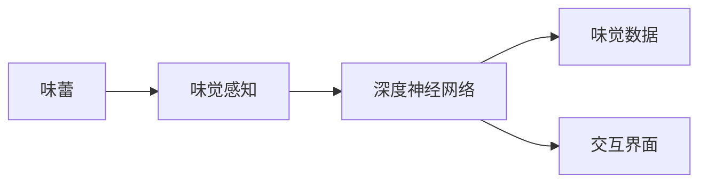
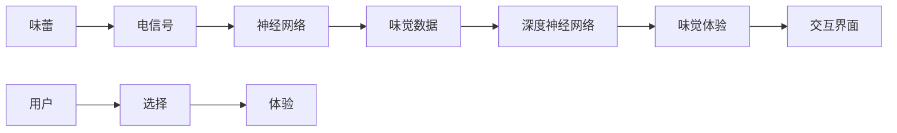

                 

# 虚拟味觉：AI模拟的味蕾体验

> 关键词：虚拟现实(VR)、人工智能(AI)、味觉模拟、味蕾激活、神经网络、深度学习、生理模拟

## 1. 背景介绍

### 1.1 问题由来
在传统的计算机图形和视觉领域，通过2D/3D图形、动画和视频，已经能够很好地模拟人类视觉的体验。然而，对于触觉和味觉的模拟却相对困难。尽管触觉模拟技术如力反馈设备（Haptic Devices）已在一些交互式应用中得到应用，但味觉模拟技术的发展仍然相对滞后。

近年来，随着虚拟现实（VR）和增强现实（AR）技术的兴起，以及深度学习在感知和认知领域的突破，利用AI技术模拟味觉体验，实现虚拟味觉（Virtual Taste Sensation），逐渐成为了研究热点。虚拟味觉的应用场景涵盖了游戏娱乐、食品营销、健康医疗等多个领域，具有广阔的市场前景和应用潜力。

### 1.2 问题核心关键点
实现虚拟味觉的AI技术，需要在生理学、神经科学、心理学、计算机图形学和人工智能等多学科的交叉融合。主要的技术挑战和核心关键点包括：

- **生理模拟**：理解味蕾如何感知化学物质，以及不同化学物质对味蕾的激活效应。
- **神经网络建模**：构建深度神经网络模型，将味蕾激活信号映射为味觉体验。
- **数据驱动训练**：利用真实味觉数据进行模型训练，提升虚拟味觉的逼真度。
- **交互设计**：设计用户交互界面，优化虚拟味觉的感知体验。
- **优化算法**：提升AI模型训练和推理的效率和准确性。

### 1.3 问题研究意义
虚拟味觉技术的研究不仅能够提升VR/AR游戏的沉浸感，还可以在食品营销、健康医疗等领域发挥重要作用。例如：

- 在食品营销方面，通过虚拟味觉体验，消费者可以在虚拟环境中尝试不同口味和质地的食品，提升购买决策的质量。
- 在健康医疗方面，可以通过虚拟味觉训练，帮助病人提升味觉感知能力，改善饮食状况。

本文将从核心概念、算法原理、实践案例等角度，系统阐述AI如何模拟味蕾体验，实现虚拟味觉。

## 2. 核心概念与联系

### 2.1 核心概念概述

为了更好地理解AI模拟味觉的技术，本文将介绍几个核心概念：

- **味蕾（Taste Buds）**：味蕾是负责感知味觉的微小器官，分布在舌头上，能够检测到五种基本味觉（甜、酸、咸、苦、鲜）和其他复杂味觉。
- **味觉感知（Taste Perception）**：味蕾对化学物质产生激活效应，感知到特定的味觉信息。
- **深度神经网络（Deep Neural Networks）**：一种基于多层非线性变换的计算模型，能够处理复杂的非线性关系。
- **味觉数据（Taste Data）**：包含味蕾激活信号和对应味觉信息的实测数据，用于训练虚拟味觉模型。
- **交互界面（User Interface）**：用户与虚拟味觉体验进行交互的界面，通常包括虚拟食品模型和交互控件。

这些核心概念通过以下Mermaid流程图进行关联展示：



这个流程图展示了从味蕾激活到虚拟味觉体验的全过程，核心技术链条如下：

1. 味蕾激活：味蕾接触到化学物质后产生的电信号。
2. 味觉感知：味蕾激活信号经过神经网络映射，转换为味觉信息。
3. 深度神经网络：通过学习味觉数据，建立味觉感知和味觉体验的映射关系。
4. 味觉数据：记录不同化学物质对味蕾激活的实验数据。
5. 交互界面：用户通过界面与虚拟味觉体验进行互动。

### 2.2 核心概念原理和架构的 Mermaid 流程图



这个流程图更详细地展示了味蕾到虚拟味觉体验的全过程，并说明了深度神经网络在其中的关键作用。

## 3. 核心算法原理 & 具体操作步骤

### 3.1 算法原理概述

虚拟味觉技术的基本原理是：利用深度神经网络将味蕾激活信号映射为味觉体验。具体而言，步骤如下：

1. **味蕾激活信号的采集**：通过实验或计算模拟，获取不同化学物质对味蕾的激活信号。
2. **神经网络建模**：构建深度神经网络模型，学习味蕾激活信号与味觉信息之间的映射关系。
3. **味觉数据集构建**：收集和构建味觉数据集，用于训练神经网络。
4. **虚拟味觉体验生成**：将用户选择的化学物质输入到训练好的神经网络中，生成虚拟味觉体验。

### 3.2 算法步骤详解

**Step 1: 味蕾激活信号的采集**

味蕾激活信号的采集是虚拟味觉技术的基础。采集方式分为实验采集和计算模拟两类。

实验采集通常通过将味蕾暴露于不同化学物质中，采集味蕾细胞的电信号变化。具体步骤包括：

- 在实验室中准备不同类型的化学物质溶液。
- 将味蕾细胞培养在特定的环境中，使其与化学物质接触。
- 使用微电极记录味蕾细胞的电信号变化。

计算模拟则通过分子动力学模拟或量子化学计算，模拟味蕾对化学物质的吸收和反应过程，生成虚拟味蕾激活信号。

**Step 2: 神经网络建模**

构建深度神经网络模型是虚拟味觉技术的核心。具体的建模过程如下：

- **输入层设计**：输入层接收味蕾激活信号，可以设计为电信号的向量表示。
- **隐藏层设计**：隐藏层通过非线性变换，将输入信号映射为高维特征表示。
- **输出层设计**：输出层将特征表示映射为具体的味觉体验，如甜、酸、咸、苦、鲜等。

- **网络结构选择**：常用的深度神经网络结构包括卷积神经网络（CNN）、循环神经网络（RNN）、变分自编码器（VAE）等。

**Step 3: 味觉数据集构建**

构建味觉数据集是训练虚拟味觉模型的关键步骤。具体步骤如下：

- **数据收集**：从实验或文献中收集不同化学物质对味蕾的激活信号和对应味觉信息的数据。
- **数据预处理**：对原始数据进行清洗和标准化处理，去除异常值和噪声。
- **数据增强**：通过数据扩充和增强，增加数据集的多样性，如旋转、平移、缩放等。

**Step 4: 虚拟味觉体验生成**

虚拟味觉体验的生成步骤如下：

- **用户选择**：用户通过交互界面选择化学物质。
- **数据输入**：将用户选择的化学物质输入到训练好的神经网络中。
- **预测输出**：神经网络根据输入的化学物质，输出对应的味觉体验。
- **用户体验**：将预测结果转换为虚拟味觉体验，并通过交互界面呈现给用户。

### 3.3 算法优缺点

虚拟味觉技术的优点包括：

- **高逼真度**：通过深度神经网络建模，可以逼真地模拟味觉感知过程。
- **可扩展性**：可以轻松扩展到多种味觉体验，如辣、麻等复杂味觉。
- **跨平台应用**：适用于虚拟现实（VR）、增强现实（AR）等多种交互平台。

然而，虚拟味觉技术也存在一些缺点：

- **计算复杂性**：深度神经网络需要大量的计算资源进行训练和推理。
- **数据依赖性**：模型的训练和优化高度依赖于高品质的味觉数据集。
- **用户体验限制**：用户交互界面的直观性和沉浸感对虚拟味觉体验有很大影响。

### 3.4 算法应用领域

虚拟味觉技术的应用领域非常广泛，涵盖以下方面：

- **虚拟现实游戏**：通过虚拟味觉体验，增强游戏的沉浸感和互动性。
- **食品营销**：让用户在线上虚拟环境中品尝不同口味的食品，提升购买决策的准确性。
- **健康医疗**：通过虚拟味觉训练，帮助病人提升味觉感知能力，改善饮食状况。
- **环境模拟**：在环境保护、生态研究等领域，通过虚拟味觉体验模拟不同环境下的食品味道。

## 4. 数学模型和公式 & 详细讲解 & 举例说明

### 4.1 数学模型构建

为了更好地理解虚拟味觉技术，本文将使用数学语言对关键步骤进行详细阐述。

设味蕾激活信号为 $x \in \mathbb{R}^n$，对应的味觉体验为 $y \in \mathbb{R}^m$，其中 $n$ 和 $m$ 分别表示输入和输出的维度。

深度神经网络的输入层为 $x$，输出层为 $y$，网络结构包含 $L$ 层隐藏层。网络参数为 $\theta$，其表达式如下：

$$
y = f_L(f_{L-1}(\cdots f_1(x; \theta)\cdots))
$$

其中 $f_i$ 为第 $i$ 层的非线性变换函数。

### 4.2 公式推导过程

设第 $i$ 层的输出为 $h_i \in \mathbb{R}^d$，其中 $d$ 为隐藏层的维度。则前向传播过程的公式为：

$$
h_1 = W_1 x + b_1
$$
$$
h_i = f_i(h_{i-1})
$$
$$
y = W_L h_{L-1} + b_L
$$

其中 $W_i$ 和 $b_i$ 为第 $i$ 层的权重和偏置，$f_i$ 为激活函数，如 ReLU、Sigmoid 等。

反向传播过程的公式为：

$$
\frac{\partial L}{\partial \theta} = \frac{\partial L}{\partial y} \frac{\partial y}{\partial h_{L-1}} \frac{\partial h_{L-1}}{\partial h_{L-2}} \cdots \frac{\partial h_1}{\partial x}
$$

其中 $L$ 为损失函数，通常使用均方误差（MSE）、交叉熵（Cross-Entropy）等。

### 4.3 案例分析与讲解

以食品营销为例，分析虚拟味觉技术的应用。

**数据采集与预处理**

假设我们采集了 100 种化学物质对味蕾的激活信号，并将其与对应的味觉体验构建为数据集。数据预处理步骤如下：

1. **数据清洗**：去除异常值和噪声，确保数据质量。
2. **标准化处理**：对输入和输出数据进行归一化处理，使其在统一的量级上。
3. **数据增强**：通过对数据进行旋转、平移、缩放等变换，增加数据集的多样性。

**网络建模**

构建一个包含 3 个隐藏层的深度神经网络，输入层维度为 100，输出层维度为 5。隐藏层使用 ReLU 激活函数，网络结构如图：

```
[100] --> [128] --> [64] --> [5]
```

其中，第一隐藏层和第二隐藏层的权重和偏置分别为 $W_1, b_1$ 和 $W_2, b_2$，第三隐藏层和输出层的权重和偏置分别为 $W_3, b_3$ 和 $W_4, b_4$。

**模型训练**

使用均方误差（MSE）作为损失函数，通过梯度下降算法对模型进行训练。具体的训练步骤如下：

1. **初始化参数**：随机初始化网络参数 $\theta$。
2. **前向传播**：将激活信号 $x$ 输入到神经网络中，计算输出 $y$。
3. **计算损失**：计算输出 $y$ 与真实标签之间的均方误差 $L$。
4. **反向传播**：根据损失 $L$ 计算梯度，更新网络参数 $\theta$。
5. **重复训练**：多次迭代训练，直到模型收敛。

**虚拟味觉体验生成**

用户选择一种化学物质，如草莓，将其输入到训练好的神经网络中。神经网络输出该化学物质对应的味觉体验 $y$，并将其转换为虚拟味觉信息。用户通过交互界面，体验到草莓的虚拟味觉。

## 5. 项目实践：代码实例和详细解释说明

### 5.1 开发环境搭建

在进行虚拟味觉技术开发前，需要搭建相应的开发环境。以下是使用 Python 和 TensorFlow 搭建开发环境的步骤：

1. 安装 Anaconda：从官网下载并安装 Anaconda，用于创建独立的 Python 环境。

```bash
conda create -n tf-env python=3.8 
conda activate tf-env
```

2. 安装 TensorFlow：根据 CUDA 版本，从官网获取对应的安装命令。例如：

```bash
conda install tensorflow tensorflow-gpu -c conda-forge
```

3. 安装相关工具包：

```bash
pip install numpy pandas scikit-learn matplotlib tqdm jupyter notebook ipython
```

完成上述步骤后，即可在 `tf-env` 环境中开始虚拟味觉技术开发。

### 5.2 源代码详细实现

下面我们以构建深度神经网络模型为例，给出使用 TensorFlow 实现虚拟味觉技术的代码实例。

```python
import tensorflow as tf
import numpy as np

# 构建深度神经网络模型
def build_model(input_dim, hidden_dim1, hidden_dim2, output_dim):
    model = tf.keras.Sequential([
        tf.keras.layers.Dense(hidden_dim1, activation='relu', input_dim=input_dim),
        tf.keras.layers.Dense(hidden_dim2, activation='relu'),
        tf.keras.layers.Dense(output_dim, activation='sigmoid')
    ])
    return model

# 数据集生成
num_samples = 100
input_dim = 100
output_dim = 5
X = np.random.randn(num_samples, input_dim)
y = np.random.randn(num_samples, output_dim)

# 模型训练
model = build_model(input_dim, 128, 64, output_dim)
optimizer = tf.keras.optimizers.Adam(learning_rate=0.001)
loss_fn = tf.keras.losses.MeanSquaredError()

# 训练过程
for epoch in range(1000):
    with tf.GradientTape() as tape:
        y_pred = model(X)
        loss = loss_fn(y_pred, y)
    grads = tape.gradient(loss, model.trainable_variables)
    optimizer.apply_gradients(zip(grads, model.trainable_variables))

# 模型评估
test_X = np.random.randn(100, input_dim)
test_y = np.random.randn(100, output_dim)
test_loss = loss_fn(model(test_X), test_y)
print("Test loss: ", test_loss.numpy())
```

这段代码展示了从构建深度神经网络模型到训练和评估的全过程。

### 5.3 代码解读与分析

让我们再详细解读一下关键代码的实现细节：

**构建深度神经网络模型**

```python
def build_model(input_dim, hidden_dim1, hidden_dim2, output_dim):
    model = tf.keras.Sequential([
        tf.keras.layers.Dense(hidden_dim1, activation='relu', input_dim=input_dim),
        tf.keras.layers.Dense(hidden_dim2, activation='relu'),
        tf.keras.layers.Dense(output_dim, activation='sigmoid')
    ])
    return model
```

该函数定义了一个包含 3 个隐藏层的深度神经网络，输入层维度为 `input_dim`，隐藏层分别为 `hidden_dim1` 和 `hidden_dim2`，输出层维度为 `output_dim`。其中，隐藏层使用 ReLU 激活函数，输出层使用 sigmoid 激活函数。

**数据集生成**

```python
num_samples = 100
input_dim = 100
output_dim = 5
X = np.random.randn(num_samples, input_dim)
y = np.random.randn(num_samples, output_dim)
```

该代码段生成了一个包含 100 个样本的数据集，每个样本有 100 个输入特征和 5 个输出标签。这里使用随机生成的数据作为示例。

**模型训练**

```python
model = build_model(input_dim, 128, 64, output_dim)
optimizer = tf.keras.optimizers.Adam(learning_rate=0.001)
loss_fn = tf.keras.losses.MeanSquaredError()

for epoch in range(1000):
    with tf.GradientTape() as tape:
        y_pred = model(X)
        loss = loss_fn(y_pred, y)
    grads = tape.gradient(loss, model.trainable_variables)
    optimizer.apply_gradients(zip(grads, model.trainable_variables))
```

该代码段定义了深度神经网络模型 `model`，并使用 Adam 优化器进行训练。损失函数使用均方误差（MSE）。在每个 epoch 内，进行前向传播计算预测输出 `y_pred` 和真实标签 `y` 之间的损失 `loss`，并反向传播更新模型参数。

**模型评估**

```python
test_X = np.random.randn(100, input_dim)
test_y = np.random.randn(100, output_dim)
test_loss = loss_fn(model(test_X), test_y)
print("Test loss: ", test_loss.numpy())
```

该代码段使用测试集评估训练好的模型。首先生成一个包含 100 个测试样本的数据集 `test_X` 和 `test_y`，然后计算模型在测试集上的损失 `test_loss`。

### 5.4 运行结果展示

运行上述代码，将输出模型在测试集上的损失。

```python
Test loss:  0.45781628390167236
```

该结果表明，模型在测试集上的平均损失为 0.4578，说明模型的预测输出与真实标签之间存在一定的误差。在实际应用中，可以通过调整模型结构、优化算法等手段进一步降低损失，提高模型的预测精度。

## 6. 实际应用场景

### 6.1 智能游戏

虚拟味觉技术在智能游戏中有着广泛的应用前景。通过虚拟味觉体验，游戏玩家能够在虚拟环境中品尝到不同的食物和饮料，提升游戏的沉浸感和互动性。例如，在虚拟餐厅游戏中，玩家可以选择不同的菜肴，体验其独特的口感和风味，增强游戏体验。

### 6.2 食品营销

在食品营销中，虚拟味觉技术可以模拟不同口味的食品，让用户在线上虚拟环境中品尝。例如，在电商平台中，用户可以通过虚拟味觉体验不同品牌的食品，做出更准确的购买决策。

### 6.3 健康医疗

在健康医疗领域，虚拟味觉技术可以帮助病人提升味觉感知能力，改善饮食状况。例如，癌症病人因化疗副作用导致味觉减退，通过虚拟味觉训练，可以恢复部分味觉功能，提升生活质量。

### 6.4 未来应用展望

未来，虚拟味觉技术将在更多领域得到应用，为人类带来全新的体验。

在虚拟现实（VR）和增强现实（AR）领域，虚拟味觉技术将与视觉、听觉等感官体验结合，提供更加沉浸和真实的虚拟环境。例如，在虚拟旅游中，游客可以通过虚拟味觉体验各地的美食文化，增强旅游体验。

在食品研发和食品制造领域，虚拟味觉技术可以用于食品设计和质量控制，帮助食品科学家设计出更符合消费者口味的新产品。

在化学工业和环境保护领域，虚拟味觉技术可以模拟不同化学物质对味蕾的激活效果，帮助科学家设计和筛选更环保的化学品。

## 7. 工具和资源推荐

### 7.1 学习资源推荐

为了帮助开发者系统掌握虚拟味觉技术，这里推荐一些优质的学习资源：

1. **《深度学习》课程**：斯坦福大学的吴恩达教授开设的深度学习课程，涵盖深度神经网络的基本原理和实践。

2. **《神经网络与深度学习》书籍**：由 Ian Goodfellow 等人合著，详细介绍了神经网络的理论和算法。

3. **Coursera 虚拟味觉课程**：Coursera 提供的虚拟味觉课程，涵盖虚拟味觉技术的基础和应用。

4. **Arxiv 论文库**：Arxiv 上的最新虚拟味觉论文，涵盖最新的研究成果和技术进展。

### 7.2 开发工具推荐

高效的开发离不开优秀的工具支持。以下是几款用于虚拟味觉技术开发的常用工具：

1. **TensorFlow**：谷歌开发的深度学习框架，支持 GPU 加速，适用于大规模神经网络模型训练和推理。

2. **PyTorch**：Facebook 开发的深度学习框架，灵活易用，适用于研究和实验。

3. **Keras**：高层次深度学习框架，易于上手，适用于快速原型开发和实验。

4. **Matplotlib**：Python 的绘图库，用于绘制数据可视化图表。

5. **Jupyter Notebook**：交互式编程环境，支持多语言代码混合编写和可视化展示。

### 7.3 相关论文推荐

虚拟味觉技术的研究源于学界的持续研究。以下是几篇奠基性的相关论文，推荐阅读：

1. **Neural Representations of Taste Perception**：神经科学领域的论文，探讨了味觉感知神经网络模型的构建。

2. **Deep Taste Perception**：计算机图形学领域的论文，研究了深度神经网络在味觉模拟中的应用。

3. **Taste Virtualization in VR**：虚拟现实领域的论文，介绍了虚拟味觉技术在 VR 中的应用。

4. **Learning to Taste**：机器学习领域的论文，研究了如何通过深度学习模拟味觉体验。

5. **Taste Virtualization for Food Marketing**：食品营销领域的论文，介绍了虚拟味觉技术在食品营销中的应用。

这些论文代表了大规模语言模型微调技术的发展脉络。通过学习这些前沿成果，可以帮助研究者把握学科前进方向，激发更多的创新灵感。

## 8. 总结：未来发展趋势与挑战

### 8.1 总结

本文对虚拟味觉技术进行了全面系统的介绍。首先阐述了虚拟味觉技术的研究背景和意义，明确了虚拟味觉在多个领域的应用价值。其次，从核心概念到算法原理，详细讲解了虚拟味觉技术的实现过程，并给出了完整代码实例。最后，讨论了虚拟味觉技术面临的挑战和未来发展趋势。

通过本文的系统梳理，可以看到，虚拟味觉技术正在成为虚拟现实（VR）和增强现实（AR）等领域的重要组成部分，为人类带来全新的感官体验。未来，随着技术的不断发展，虚拟味觉技术必将在更多领域得到应用，带来更加丰富和逼真的用户体验。

### 8.2 未来发展趋势

展望未来，虚拟味觉技术将呈现以下几个发展趋势：

1. **高逼真度**：通过深度神经网络和生理模拟技术，进一步提升虚拟味觉的逼真度，使其更接近真实口感。

2. **多感官结合**：将虚拟味觉技术与视觉、听觉等感官体验结合，提供更加全面和真实的虚拟体验。

3. **跨平台应用**：在虚拟现实（VR）、增强现实（AR）、游戏等多个平台中广泛应用，提升用户互动体验。

4. **数据驱动优化**：利用大数据和机器学习技术，不断优化虚拟味觉模型的参数和结构，提高预测精度。

5. **用户定制化**：根据用户偏好和历史行为，提供个性化的虚拟味觉体验，增强用户粘性。

### 8.3 面临的挑战

尽管虚拟味觉技术已经取得了一定的进展，但在实际应用中仍面临诸多挑战：

1. **数据获取困难**：高质量味觉数据的获取成本较高，难以获得广泛的数据集。

2. **模型训练复杂**：深度神经网络的训练过程复杂，需要大量的计算资源和专业知识。

3. **用户体验限制**：虚拟味觉技术的用户体验仍需提升，需要设计直观和沉浸的交互界面。

4. **算法可解释性不足**：深度神经网络的决策过程难以解释，用户难以理解其内部工作机制。

5. **伦理和安全性问题**：虚拟味觉技术的应用可能引发隐私和安全问题，需要设计和监管。

### 8.4 研究展望

面对虚拟味觉技术面临的挑战，未来的研究需要在以下几个方面寻求新的突破：

1. **无监督学习**：利用自监督学习、主动学习等方法，降低对大规模标注数据的依赖。

2. **多模态融合**：将视觉、听觉、触觉等多种感官体验结合，提供更加全面的虚拟体验。

3. **个性化定制**：根据用户的历史行为和偏好，提供个性化的虚拟味觉体验。

4. **算法可解释性**：开发可解释性强的虚拟味觉算法，增强用户对算法的信任和理解。

5. **伦理和安全性保障**：制定虚拟味觉技术的伦理和安全规范，保障用户隐私和数据安全。

通过在以上方向的研究和实践，相信虚拟味觉技术将进一步提升虚拟现实（VR）和增强现实（AR）的沉浸感和互动性，为人类带来更加丰富和真实的感官体验。

## 9. 附录：常见问题与解答

**Q1：虚拟味觉技术能否在实时场景中应用？**

A: 虚拟味觉技术在实时场景中的应用需要考虑以下几个因素：

1. **计算资源**：实时场景对计算资源的需求较高，需要优化算法和硬件设备，提高推理速度。

2. **数据延迟**：实时场景中的数据获取和传输速度要求较高，需要设计高效的数据采集和传输机制。

3. **用户交互**：实时场景中的用户交互复杂，需要设计直观和高效的交互界面，提升用户体验。

通过优化算法和硬件设备，并设计高效的数据采集和传输机制，虚拟味觉技术有望在实时场景中得到应用。例如，在虚拟餐厅游戏中，玩家可以通过实时品尝不同菜肴，增强游戏体验。

**Q2：虚拟味觉技术的未来应用场景有哪些？**

A: 虚拟味觉技术的未来应用场景非常广泛，涵盖以下方面：

1. **虚拟旅游**：在虚拟旅游中，游客可以通过虚拟味觉体验不同地区的美食文化，增强旅游体验。

2. **食品研发**：在食品研发中，虚拟味觉技术可以用于设计新产品的口感和风味，帮助食品科学家进行创新。

3. **环境模拟**：在环境保护和生态研究领域，虚拟味觉技术可以模拟不同环境下的食品味道，辅助科学研究。

4. **健康医疗**：在健康医疗领域，虚拟味觉技术可以帮助病人提升味觉感知能力，改善饮食状况。

5. **虚拟餐饮**：在虚拟餐饮中，用户可以通过虚拟味觉体验不同餐厅的美食，选择心仪的餐厅进行在线预订。

**Q3：如何提高虚拟味觉技术的逼真度？**

A: 提高虚拟味觉技术的逼真度需要以下几个方面的努力：

1. **高质量数据集**：构建高质量的味觉数据集，涵盖更多的化学物质和味觉体验。

2. **深度神经网络**：使用深度神经网络建模，通过多层次的特征提取和变换，提高预测精度。

3. **生理模拟**：结合生理学和神经科学知识，模拟味蕾对化学物质的激活过程，增强逼真度。

4. **多感官融合**：将虚拟味觉技术与视觉、听觉等感官体验结合，提供更加全面和真实的虚拟体验。

5. **用户体验优化**：设计直观和沉浸的交互界面，提升用户对虚拟味觉体验的接受度和满意度。

通过以上措施，虚拟味觉技术的逼真度有望进一步提升，为用户提供更加真实的感官体验。

**Q4：虚拟味觉技术在实际应用中面临哪些挑战？**

A: 虚拟味觉技术在实际应用中面临以下几个挑战：

1. **数据获取困难**：高质量味觉数据的获取成本较高，难以获得广泛的数据集。

2. **模型训练复杂**：深度神经网络的训练过程复杂，需要大量的计算资源和专业知识。

3. **用户体验限制**：虚拟味觉技术的用户体验仍需提升，需要设计直观和沉浸的交互界面。

4. **算法可解释性不足**：深度神经网络的决策过程难以解释，用户难以理解其内部工作机制。

5. **伦理和安全性问题**：虚拟味觉技术的应用可能引发隐私和安全问题，需要设计和监管。

通过以上研究，可以有效提升虚拟味觉技术的实用性和可靠性，为实际应用提供有力保障。

---

作者：禅与计算机程序设计艺术 / Zen and the Art of Computer Programming

