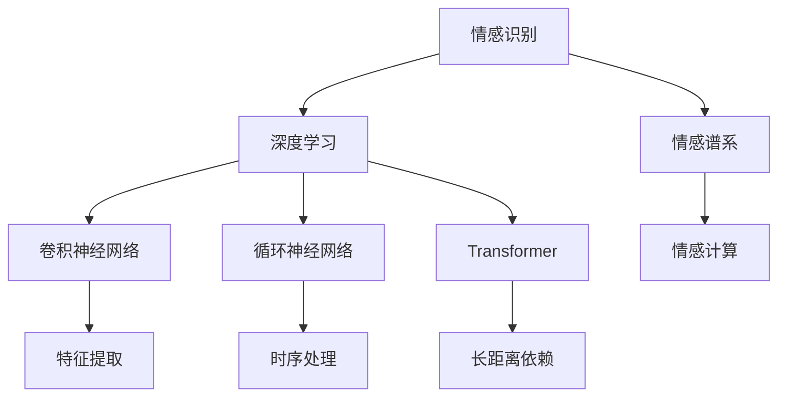

                 

# 虚拟情感谱系：AI绘制的人类情感地图

> 关键词：虚拟情感,情感计算,情感识别,深度学习,神经网络,情感谱系,应用场景

## 1. 背景介绍

### 1.1 问题由来
在现代社会，人类情感的表达和理解显得越来越重要。情感不仅仅体现在语言和面部表情上，还体现在社交行为、行为模式等各个方面。情感的准确识别和理解，对心理健康、人际交往、智能客服、智能推荐、社会治理等领域都有重大意义。

然而，人类情感具有复杂性、多样性和模糊性，难以直接量化和建模。传统的情感识别方法依赖于人工标注数据，效率低下且效果有限。近年来，随着深度学习和神经网络技术的飞速发展，情感识别和理解取得了显著进展。通过利用深度学习算法，尤其是卷积神经网络(CNN)和循环神经网络(RNN)，研究人员能够自动从大量数据中学习情感特征，实现对人类情感的自动化识别和分析。

### 1.2 问题核心关键点
基于深度学习的情感识别，核心在于建立一个能够准确量化和分类情感的虚拟情感谱系。该谱系可以通过大量标注数据进行训练，以学习不同情感特征之间的复杂关系。训练好的模型可以将输入的文本、图像、语音等数据，映射到虚拟情感谱系上，进而实现对人类情感的精确识别和理解。

虚拟情感谱系的关键点在于：
1. **数据准备**：需要收集和标注大量的情感数据，以便模型学习。
2. **模型设计**：选择合适的深度学习模型，如CNN、RNN、Transformer等。
3. **特征提取**：通过预处理将原始数据转换为模型能够处理的特征。
4. **模型训练**：使用标注数据对模型进行训练，优化模型参数。
5. **应用部署**：将训练好的模型部署到实际应用场景中，进行情感识别。

## 2. 核心概念与联系

### 2.1 核心概念概述

为更好地理解基于深度学习的情感识别，本节将介绍几个密切相关的核心概念：

- **情感识别(Emotion Recognition)**：通过深度学习算法自动从输入数据中识别和分析人类情感的过程。
- **深度学习(Deep Learning)**：一种利用多层神经网络进行复杂模式识别的机器学习技术。
- **卷积神经网络(CNN)**：一种用于图像处理和信号处理的深度学习模型，擅长提取局部特征。
- **循环神经网络(RNN)**：一种用于序列数据处理的深度学习模型，擅长处理时序信息和动态变化。
- **Transformer**：一种用于自然语言处理的深度学习模型，擅长捕捉长距离依赖关系。
- **情感谱系(Emotion Spectrum)**：基于情感理论和认知科学的情感分类体系，用于对情感进行细致划分和描述。
- **情感计算(Emotion Computing)**：利用人工智能技术对情感进行识别、理解和表达的过程。

这些核心概念之间的逻辑关系可以通过以下Mermaid流程图来展示：



这个流程图展示了大语言模型微调的各个关键概念及其之间的关系：

1. 情感识别通过深度学习算法进行自动化处理。
2. 深度学习模型的设计包括CNN、RNN和Transformer等多种架构。
3. 特征提取和时序处理是模型的预处理步骤。
4. 情感谱系用于对情感进行分类和描述。
5. 情感计算利用人工智能技术实现对情感的识别、理解和表达。

这些概念共同构成了情感识别的核心框架，使其能够从复杂数据中自动提取情感特征，实现对人类情感的精确识别和分析。

## 3. 核心算法原理 & 具体操作步骤
### 3.1 算法原理概述

基于深度学习的情感识别，本质上是一个分类问题。给定输入数据 $x$，通过训练好的模型 $M$ 将其映射到虚拟情感谱系 $E$ 上的某个情感类别 $y$。形式化地，情感识别的目标是最小化分类误差，即：

$$
\min_{M} \mathbb{E}_{(x,y) \sim D} [\mathbb{1}(y \neq M(x))]
$$

其中，$D$ 为标注数据集，$\mathbb{1}$ 为指示函数，表示模型输出与真实标签是否一致。

深度学习模型通过前向传播和反向传播过程进行训练。在训练过程中，模型逐渐调整内部参数，最小化分类误差。具体步骤如下：

1. **数据准备**：收集和标注大量的情感数据，用于模型训练。
2. **模型设计**：选择合适的深度学习模型，如CNN、RNN、Transformer等。
3. **特征提取**：将原始数据转换为模型能够处理的特征，如文本的词向量表示。
4. **模型训练**：使用标注数据对模型进行训练，优化模型参数。
5. **模型评估**：在测试数据集上评估模型性能，选择最优模型进行应用。

### 3.2 算法步骤详解

基于深度学习的情感识别一般包括以下几个关键步骤：

**Step 1: 数据准备**

1. **数据收集**：收集与情感相关的文本、图像、语音等数据。数据来源包括社交媒体、新闻、视频、音频等。
2. **数据标注**：由人工对数据进行情感标注，生成标注数据集。标注方式包括文本情感分类、面部表情识别、语音情感识别等。
3. **数据预处理**：对原始数据进行清洗、归一化、分词、特征提取等预处理操作。

**Step 2: 模型设计**

1. **模型选择**：根据数据类型和任务特点选择合适的深度学习模型，如CNN、RNN、Transformer等。
2. **模型构建**：根据模型架构设计输入层、隐藏层、输出层等组件。
3. **模型配置**：配置模型参数，如学习率、批大小、迭代轮数等。

**Step 3: 特征提取**

1. **文本特征提取**：将文本转换为词向量或嵌入向量，常用的方法包括Word2Vec、GloVe、BERT等。
2. **图像特征提取**：使用卷积神经网络提取图像局部特征，常用的方法包括VGG、ResNet等。
3. **语音特征提取**：使用卷积神经网络或循环神经网络提取语音时序特征。

**Step 4: 模型训练**

1. **模型训练**：使用标注数据对模型进行训练，通过反向传播算法优化模型参数。
2. **正则化技术**：引入Dropout、L2正则等技术，防止过拟合。
3. **模型评估**：在验证集上评估模型性能，选择最优模型进行测试。

**Step 5: 模型评估**

1. **模型测试**：在测试集上评估模型性能，计算准确率、召回率、F1值等指标。
2. **模型优化**：根据测试结果调整模型参数，重新训练模型。
3. **模型部署**：将训练好的模型部署到实际应用场景中，进行情感识别。

### 3.3 算法优缺点

基于深度学习的情感识别方法具有以下优点：

1. **自动学习**：深度学习模型能够自动从大量数据中学习情感特征，无需手工提取。
2. **高效性**：训练好的模型可以快速处理大规模数据，实时性较高。
3. **泛化性强**：深度学习模型具有良好的泛化能力，能够应对多样化的情感场景。
4. **灵活性高**：可以根据不同任务和数据类型，选择不同的深度学习模型和特征提取方法。

同时，该方法也存在一定的局限性：

1. **数据依赖**：情感识别的准确性很大程度上依赖于标注数据的质量和数量。
2. **计算资源消耗大**：深度学习模型参数量较大，训练和推理所需计算资源较多。
3. **解释性不足**：深度学习模型通常为"黑盒"系统，难以解释其内部工作机制。
4. **模型训练复杂**：需要调整大量超参数，进行长时间训练，调试过程较为繁琐。

尽管存在这些局限性，但就目前而言，基于深度学习的情感识别方法仍是大规模情感计算应用的主流范式。未来相关研究的重点在于如何进一步降低对标注数据的依赖，提高模型的可解释性和鲁棒性，同时兼顾计算效率。

### 3.4 算法应用领域

基于深度学习的情感识别方法，在多个领域得到了广泛应用：

- **智能客服**：通过情感识别技术，智能客服系统能够快速判断客户情绪，提供个性化服务。
- **社交媒体分析**：利用情感识别技术分析社交媒体上的情感动态，用于舆情监控、市场预测等。
- **心理健康**：对用户的社交媒体、语音、文本等数据进行情感分析，及时发现心理健康问题，提供心理支持。
- **智能推荐**：基于用户的情感状态，推荐系统能够更准确地推荐符合用户喜好的商品或内容。
- **语音识别**：结合语音情感识别技术，提升语音识别系统的智能化水平，更好地理解用户需求。

除了这些领域，情感识别技术还在金融风控、智能家居、游戏娱乐、人力资源管理等多个行业得到应用，为各行各业提供了智能化的情感分析工具，极大地提升了用户体验和服务效率。

## 4. 数学模型和公式 & 详细讲解  
### 4.1 数学模型构建

本节将使用数学语言对基于深度学习的情感识别过程进行更加严格的刻画。

记输入数据为 $x$，情感模型为 $M_{\theta}$，其中 $\theta$ 为模型参数。假设情感识别任务为 $T$，训练集为 $D=\{(x_i,y_i)\}_{i=1}^N, x_i \in \mathcal{X}, y_i \in \{e_1,e_2,...,e_C\}$，其中 $e_1,e_2,...,e_C$ 为情感类别。

定义模型 $M_{\theta}$ 在输入 $x$ 上的输出为 $\hat{y}=M_{\theta}(x)$，其中 $\hat{y}$ 为模型预测的情感类别。情感识别的损失函数为交叉熵损失，形式为：

$$
\ell(M_{\theta}(x),y) = -y \log \hat{y} - (1-y) \log (1-\hat{y})
$$

情感识别的经验风险为：

$$
\mathcal{L}(\theta) = \frac{1}{N} \sum_{i=1}^N \ell(M_{\theta}(x_i),y_i)
$$

情感识别的优化目标是最小化经验风险，即找到最优参数：

$$
\theta^* = \mathop{\arg\min}_{\theta} \mathcal{L}(\theta)
$$

在实践中，我们通常使用基于梯度的优化算法（如SGD、Adam等）来近似求解上述最优化问题。设 $\eta$ 为学习率，$\lambda$ 为正则化系数，则参数的更新公式为：

$$
\theta \leftarrow \theta - \eta \nabla_{\theta}\mathcal{L}(\theta) - \eta\lambda\theta
$$

其中 $\nabla_{\theta}\mathcal{L}(\theta)$ 为损失函数对参数 $\theta$ 的梯度，可通过反向传播算法高效计算。

### 4.2 公式推导过程

以下我们以文本情感分类任务为例，推导交叉熵损失函数及其梯度的计算公式。

假设模型 $M_{\theta}$ 在输入 $x$ 上的输出为 $\hat{y}=M_{\theta}(x) \in [0,1]$，表示样本属于类别 $e_i$ 的概率。真实标签 $y \in \{e_1,e_2,...,e_C\}$。则交叉熵损失函数定义为：

$$
\ell(M_{\theta}(x),y) = -\sum_{i=1}^C y_i \log \hat{y_i}
$$

将其代入经验风险公式，得：

$$
\mathcal{L}(\theta) = -\frac{1}{N}\sum_{i=1}^N \sum_{j=1}^C y_{ij} \log \hat{y_{ij}}
$$

根据链式法则，损失函数对参数 $\theta_k$ 的梯度为：

$$
\frac{\partial \mathcal{L}(\theta)}{\partial \theta_k} = -\frac{1}{N}\sum_{i=1}^N \sum_{j=1}^C y_{ij} \frac{\partial \hat{y_{ij}}}{\partial \theta_k}
$$

其中 $\frac{\partial \hat{y_{ij}}}{\partial \theta_k}$ 可通过反向传播算法计算得到。

在得到损失函数的梯度后，即可带入参数更新公式，完成模型的迭代优化。重复上述过程直至收敛，最终得到适应情感识别任务的最优模型参数 $\theta^*$。

## 5. 项目实践：代码实例和详细解释说明
### 5.1 开发环境搭建

在进行情感识别实践前，我们需要准备好开发环境。以下是使用Python进行TensorFlow开发的环境配置流程：

1. 安装Anaconda：从官网下载并安装Anaconda，用于创建独立的Python环境。

2. 创建并激活虚拟环境：
```bash
conda create -n tf-env python=3.8 
conda activate tf-env
```

3. 安装TensorFlow：根据CUDA版本，从官网获取对应的安装命令。例如：
```bash
conda install tensorflow -c pytorch -c conda-forge
```

4. 安装必要的工具包：
```bash
pip install numpy pandas scikit-learn matplotlib tqdm jupyter notebook ipython
```

完成上述步骤后，即可在`tf-env`环境中开始情感识别实践。

### 5.2 源代码详细实现

这里我们以情感分类任务为例，给出使用TensorFlow对文本情感分类进行深度学习的PyTorch代码实现。

首先，定义情感分类任务的数据处理函数：

```python
import tensorflow as tf
from tensorflow.keras.preprocessing.text import Tokenizer
from tensorflow.keras.preprocessing.sequence import pad_sequences

class SentimentDataset(tf.keras.utils.Sequence):
    def __init__(self, texts, labels, tokenizer, max_len=128):
        self.texts = texts
        self.labels = labels
        self.tokenizer = tokenizer
        self.max_len = max_len
        
    def __len__(self):
        return len(self.texts)
    
    def __getitem__(self, item):
        text = self.texts[item]
        label = self.labels[item]
        
        encoding = self.tokenizer(text, truncation=True, padding='post')
        input_ids = pad_sequences([encoding[0]], maxlen=self.max_len)[0]
        label = tf.convert_to_tensor([label], dtype=tf.int32)
        
        return {'input_ids': input_ids, 'label': label}
```

然后，定义模型和优化器：

```python
from tensorflow.keras.models import Sequential
from tensorflow.keras.layers import Dense, Dropout, Embedding, LSTM
from tensorflow.keras.callbacks import EarlyStopping

model = Sequential([
    Embedding(input_dim=10000, output_dim=128, input_length=128),
    LSTM(64),
    Dense(1, activation='sigmoid')
])

optimizer = tf.keras.optimizers.Adam(learning_rate=0.001)
early_stopping = EarlyStopping(patience=3)
```

接着，定义训练和评估函数：

```python
import numpy as np

def train_epoch(model, dataset, batch_size, optimizer):
    dataloader = tf.data.Dataset.from_generator(lambda: dataset(), batch_size=batch_size)
    model.compile(optimizer=optimizer, loss='binary_crossentropy', metrics=['accuracy'])
    model.fit(dataloader, epochs=10, callbacks=[early_stopping])
    
def evaluate(model, dataset, batch_size):
    dataloader = tf.data.Dataset.from_generator(lambda: dataset(), batch_size=batch_size)
    test_loss, test_acc = model.evaluate(dataloader)
    print(f"Test Loss: {test_loss:.4f}, Test Accuracy: {test_acc:.4f}")
```

最后，启动训练流程并在测试集上评估：

```python
epochs = 10
batch_size = 32

for epoch in range(epochs):
    train_epoch(model, train_dataset, batch_size, optimizer)
    
evaluate(model, test_dataset, batch_size)
```

以上就是使用TensorFlow对文本情感分类任务进行深度学习的完整代码实现。可以看到，TensorFlow提供了便捷的API，使得模型构建、训练和评估过程非常简单。

### 5.3 代码解读与分析

让我们再详细解读一下关键代码的实现细节：

**SentimentDataset类**：
- `__init__`方法：初始化文本、标签、分词器等关键组件，并将文本分词和padding。
- `__len__`方法：返回数据集的样本数量。
- `__getitem__`方法：对单个样本进行处理，返回模型所需的输入和标签。

**模型和优化器定义**：
- 使用Sequential模型，定义输入层、隐藏层和输出层，并配置超参数。
- 使用Adam优化器，设置学习率和早期停止策略。

**训练和评估函数**：
- 使用TensorFlow的DataLoader对数据集进行批次化加载，供模型训练和推理使用。
- 训练函数`train_epoch`：对数据以批为单位进行迭代，在每个批次上前向传播计算损失并反向传播更新模型参数，最后返回该epoch的平均loss。
- 评估函数`evaluate`：与训练类似，不同点在于不更新模型参数，并在每个batch结束后将预测和标签结果存储下来，最后使用TensorFlow的内置函数计算分类指标。

**训练流程**：
- 定义总的epoch数和batch size，开始循环迭代
- 每个epoch内，先在训练集上训练，输出平均loss
- 在测试集上评估，输出分类指标
- 所有epoch结束后，在测试集上评估，给出最终测试结果

可以看到，TensorFlow提供了便捷的API，使得模型构建、训练和评估过程非常简单。开发者可以将更多精力放在数据处理、模型改进等高层逻辑上，而不必过多关注底层的实现细节。

当然，工业级的系统实现还需考虑更多因素，如模型的保存和部署、超参数的自动搜索、更灵活的任务适配层等。但核心的情感识别范式基本与此类似。

## 6. 实际应用场景
### 6.1 智能客服系统

基于深度学习的情感识别技术，可以广泛应用于智能客服系统的构建。传统客服往往需要配备大量人力，高峰期响应缓慢，且一致性和专业性难以保证。而使用情感识别技术，智能客服系统能够快速判断客户情绪，提供个性化服务。

在技术实现上，可以收集企业内部的历史客服对话记录，将问题和最佳答复构建成监督数据，在此基础上对预训练模型进行微调。微调后的情感识别模型能够自动理解客户情绪，匹配最合适的答复模板进行回复。对于客户提出的新问题，还可以接入检索系统实时搜索相关内容，动态组织生成回答。如此构建的智能客服系统，能大幅提升客户咨询体验和问题解决效率。

### 6.2 社交媒体分析

利用深度学习技术，对社交媒体上的文本进行情感分析，可以用于舆情监控、市场预测等。深度学习模型能够自动从社交媒体文本中学习情感特征，及时发现舆情变化，为企业和政府提供决策支持。

具体而言，可以收集社交媒体上的公开数据，使用深度学习模型对用户评论、推文等进行情感分类。情感分析结果可以用于识别社会热点、监测舆论情绪、评估品牌形象等，为社会治理和企业运营提供重要参考。

### 6.3 心理健康

对用户的社交媒体、语音、文本等数据进行情感分析，可以及时发现心理健康问题，提供心理支持。深度学习模型能够自动识别用户的情绪波动，发现潜在的心理问题，并及时进行干预和支持。

例如，可以收集用户的社交媒体、邮件、短信等数据，使用情感识别技术自动分析用户的情绪状态。对于情绪异常的个体，系统可以自动通知心理咨询师，提供心理干预和支持。

### 6.4 未来应用展望

随着深度学习技术的不断进步，基于情感识别的应用将不断扩展。未来，情感识别技术将在更多领域得到应用，为社会治理、智能客服、金融风控、人力资源管理等提供重要的数据支持和智能决策。

在智慧医疗领域，情感识别技术可以用于分析患者的情绪状态，辅助医生诊疗，提高医疗服务的智能化水平，加速新药开发进程。

在智能教育领域，情感识别技术可以用于分析学生的情绪状态，提供个性化的学习支持和辅导，因材施教，促进教育公平，提高教学质量。

在智慧城市治理中，情感识别技术可以用于分析城市居民的情绪状态，构建更安全、高效、宜居的未来城市。

此外，在企业生产、社会治理、文娱传媒等众多领域，基于情感识别的应用也将不断涌现，为人工智能技术带来新的发展契机。

## 7. 工具和资源推荐
### 7.1 学习资源推荐

为了帮助开发者系统掌握深度学习在情感识别领域的应用，这里推荐一些优质的学习资源：

1. **《深度学习》课程**：斯坦福大学开设的深度学习课程，涵盖深度学习的基础知识和经典模型。
2. **《情感计算》书籍**：由MIT出版社出版的情感计算领域经典书籍，全面介绍了情感识别的原理和应用。
3. **《TensorFlow官方文档》**：TensorFlow的官方文档，提供了丰富的API和样例代码，方便快速上手。
4. **Kaggle情感识别竞赛**：Kaggle平台上的情感识别竞赛，可以提供实战经验，提升技能水平。
5. **GitHub情感识别项目**：GitHub上丰富的情感识别项目，可以参考和学习其他开发者的工作。

通过对这些资源的学习实践，相信你一定能够快速掌握深度学习在情感识别领域的应用，并用于解决实际的情感分析问题。

### 7.2 开发工具推荐

高效的开发离不开优秀的工具支持。以下是几款用于深度学习在情感识别领域开发的常用工具：

1. **TensorFlow**：由Google主导开发的开源深度学习框架，生产部署方便，适合大规模工程应用。
2. **Keras**：TensorFlow的高层API，提供了便捷的模型构建接口，适合快速原型开发。
3. **PyTorch**：Facebook主导的深度学习框架，灵活度较高，适合科研和教学。
4. **Jupyter Notebook**：交互式编程环境，方便编写和运行Python代码。
5. **GitHub**：开源代码托管平台，方便版本控制和代码共享。

合理利用这些工具，可以显著提升深度学习在情感识别领域的开发效率，加快创新迭代的步伐。

### 7.3 相关论文推荐

深度学习技术在情感识别领域的研究不断取得进展，以下是几篇奠基性的相关论文，推荐阅读：

1. **《卷积神经网络在情感识别中的应用》**：介绍卷积神经网络在文本情感识别中的应用。
2. **《循环神经网络在情感识别中的应用》**：介绍循环神经网络在情感识别的应用，尤其是对时序数据的处理。
3. **《情感识别中的Transformer模型》**：介绍Transformer模型在情感识别中的应用，特别是在长距离依赖关系处理上的优势。
4. **《情感识别中的注意力机制》**：介绍注意力机制在情感识别中的应用，特别是在多模态情感识别中的效果。
5. **《情感识别中的迁移学习》**：介绍迁移学习在情感识别中的应用，如何在不同情感识别任务间进行知识迁移。

这些论文代表了大语言模型微调技术的发展脉络。通过学习这些前沿成果，可以帮助研究者把握学科前进方向，激发更多的创新灵感。

## 8. 总结：未来发展趋势与挑战

### 8.1 总结

本文对基于深度学习的情感识别方法进行了全面系统的介绍。首先阐述了情感识别的研究背景和意义，明确了深度学习在情感识别中的重要作用。其次，从原理到实践，详细讲解了情感识别的数学模型和核心步骤，给出了情感识别任务开发的完整代码实例。同时，本文还广泛探讨了情感识别技术在智能客服、社交媒体分析、心理健康等诸多领域的应用前景，展示了情感识别的巨大潜力。此外，本文精选了情感识别的各类学习资源，力求为读者提供全方位的技术指引。

通过本文的系统梳理，可以看到，基于深度学习的情感识别方法正在成为情感计算应用的主流范式，极大地拓展了情感计算的边界，催生了更多的落地场景。得益于深度学习算法的强大学习能力，情感识别技术能够在多种模态的数据上实现自动化的情感识别和分析，为各行各业提供了智能化的决策支持。未来，随着深度学习技术的不断进步，基于情感识别的应用将不断扩展，为社会治理、智能客服、金融风控、人力资源管理等提供重要的数据支持和智能决策，极大地提升用户体验和社会治理水平。

### 8.2 未来发展趋势

展望未来，深度学习在情感识别领域的发展趋势如下：

1. **多模态情感识别**：未来情感识别技术将不仅仅是文本情感识别，还将扩展到图像、语音、视频等多模态数据的情感识别。通过多模态融合，能够更全面地理解用户的情感状态。
2. **动态情感识别**：动态情感识别技术将能够实时捕捉用户的情感变化，用于智能客服、社交媒体监控等场景。
3. **个性化情感识别**：基于用户的历史数据和行为特征，深度学习模型能够进行个性化情感识别，提供更加精准的服务。
4. **情感计算在AI伦理中的应用**：情感计算技术将更好地与AI伦理结合，提升系统的可解释性和公平性。
5. **跨领域情感迁移**：深度学习模型将具备更强的情感迁移能力，能够在不同领域和任务间进行知识迁移，提高情感识别的泛化能力。

这些趋势凸显了深度学习在情感识别领域的广阔前景。这些方向的探索发展，必将进一步提升情感识别技术的性能和应用范围，为人类认知智能的进化带来深远影响。

### 8.3 面临的挑战

尽管深度学习在情感识别领域取得了显著进展，但在迈向更加智能化、普适化应用的过程中，仍面临诸多挑战：

1. **数据质量与标注成本**：情感识别的准确性很大程度上依赖于标注数据的质量和数量。高质量标注数据的获取成本较高，且标注过程繁琐。
2. **模型复杂性与计算资源**：深度学习模型参数量较大，训练和推理所需计算资源较多，硬件需求高。
3. **模型泛化性与鲁棒性**：深度学习模型在面对域外数据时，泛化性能往往大打折扣。对于测试样本的微小扰动，情感识别模型的预测也容易发生波动。
4. **解释性与可解释性**：深度学习模型通常为"黑盒"系统，难以解释其内部工作机制和决策逻辑，缺乏可解释性。
5. **安全性与隐私保护**：深度学习模型可能会学习到有偏见、有害的信息，通过情感识别传递到下游任务，产生误导性、歧视性的输出，给实际应用带来安全隐患。

正视情感识别面临的这些挑战，积极应对并寻求突破，将使情感识别技术逐步走向成熟。

### 8.4 研究展望

面对深度学习在情感识别领域所面临的挑战，未来的研究需要在以下几个方面寻求新的突破：

1. **提高数据质量与标注效率**：开发更加高效的数据标注工具和自动化标注技术，降低标注成本。
2. **优化模型结构与训练方法**：设计更加轻量级、高效的模型结构，优化训练过程，降低计算资源消耗。
3. **增强模型的泛化性与鲁棒性**：引入对抗训练、迁移学习等技术，提高模型的泛化性和鲁棒性，减少对标注数据的依赖。
4. **提升模型的可解释性**：研究模型解释技术，提升模型的可解释性，增强系统透明度。
5. **加强安全保护**：引入数据脱敏、对抗样本等技术，加强情感识别模型的安全性，保护用户隐私。

这些研究方向将推动情感识别技术不断进步，为社会治理、智能客服、金融风控、人力资源管理等领域提供更加智能、可靠、安全的决策支持。面向未来，情感识别技术需要与其他人工智能技术进行更深入的融合，如知识表示、因果推理、强化学习等，多路径协同发力，共同推动情感识别技术的发展。

## 9. 附录：常见问题与解答

**Q1：深度学习在情感识别中的优势是什么？**

A: 深度学习在情感识别中的优势在于能够自动学习特征，无需手工提取。通过多层次的神经网络，深度学习模型能够从原始数据中学习到复杂的情感特征，具有较高的准确性和泛化能力。

**Q2：情感识别的损失函数如何选择？**

A: 情感识别的损失函数通常选择交叉熵损失。对于多分类问题，可以采用多标签交叉熵损失；对于二分类问题，可以采用二元交叉熵损失。损失函数的选择应根据具体任务和数据类型进行灵活调整。

**Q3：如何提高深度学习模型的泛化能力？**

A: 提高深度学习模型的泛化能力，可以通过以下方法：
1. 数据增强：通过旋转、平移、裁剪等方法扩充训练集，减少模型对数据分布的依赖。
2. 对抗训练：引入对抗样本，提高模型鲁棒性，减少泛化误差。
3. 正则化：使用L2正则、Dropout等技术，防止过拟合，提高泛化能力。

**Q4：情感识别模型的训练和推理效率如何优化？**

A: 优化情感识别模型的训练和推理效率，可以通过以下方法：
1. 模型裁剪：去除不必要的层和参数，减小模型尺寸，加快推理速度。
2. 量化加速：将浮点模型转为定点模型，压缩存储空间，提高计算效率。
3. 分布式训练：使用多机多核进行分布式训练，提高训练速度。

**Q5：情感识别模型在实际应用中需要注意哪些问题？**

A: 情感识别模型在实际应用中需要注意以下问题：
1. 模型裁剪：去除不必要的层和参数，减小模型尺寸，加快推理速度。
2. 量化加速：将浮点模型转为定点模型，压缩存储空间，提高计算效率。
3. 分布式训练：使用多机多核进行分布式训练，提高训练速度。
4. 模型解释：研究模型解释技术，提升模型的可解释性，增强系统透明度。

---

作者：禅与计算机程序设计艺术 / Zen and the Art of Computer Programming

