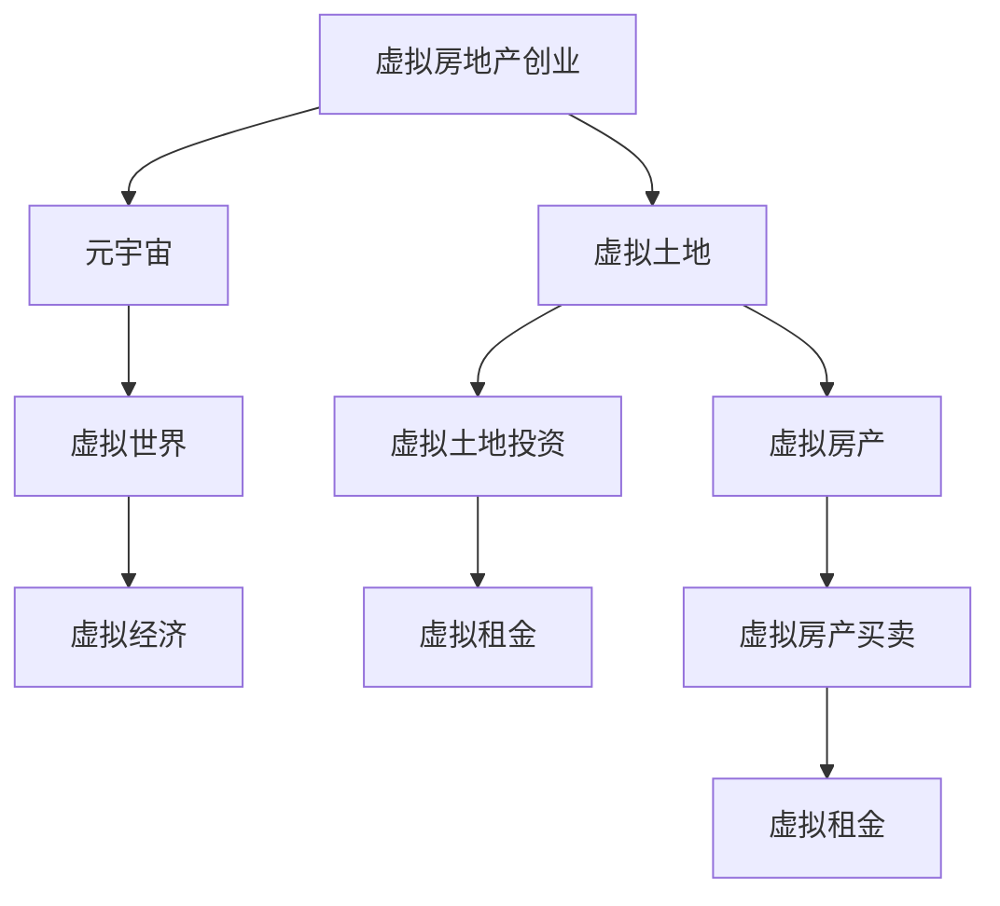

                 

## 1. 背景介绍

在科技迅猛发展的今天，虚拟现实（VR）、增强现实（AR）和混合现实（MR）技术已经深入到人们的生活中，改变了传统的生产、生活和工作方式。元宇宙（Metaverse）作为虚拟与现实紧密融合的下一代互联网，提供了无限可能的应用场景。在这样的背景下，虚拟房地产投资成为了一个热门话题，吸引了众多企业和个人参与其中。本文将探讨虚拟房地产创业的原理、应用和未来发展趋势，并给出一些实际项目实践的指导。

## 2. 核心概念与联系

### 2.1 核心概念概述

元宇宙是指一个由多个计算机生成的虚拟空间，通过互联网技术将虚拟世界与现实世界相结合，实现虚拟与现实的无缝融合。它包括社交、游戏、工作、教育、艺术等多个领域，是一个开放式的生态系统。在元宇宙中，用户可以创建、交互和拥有虚拟资产，包括土地、房产、虚拟物品等。

虚拟房地产创业是指在元宇宙中，通过投资虚拟土地和房产等虚拟资产，获得租金收益或增值收益的商业模式。与传统的房地产投资类似，虚拟房地产投资也需要考虑地段、物业质量、租金收入、增值潜力等因素。

### 2.2 核心概念联系

虚拟房地产创业与元宇宙之间存在紧密的联系。元宇宙作为虚拟空间的载体，提供了丰富的应用场景，为虚拟房地产的开发和投资提供了平台。而虚拟房地产则是元宇宙中重要的虚拟资产，吸引用户参与，提升平台粘性。

以下是一个Mermaid流程图，展示了虚拟房地产创业和元宇宙之间的联系：



该流程图展示了虚拟房地产创业如何依托元宇宙进行发展，以及其在虚拟经济中的地位。

## 3. 核心算法原理 & 具体操作步骤

### 3.1 算法原理概述

虚拟房地产创业涉及虚拟土地和房产的开发、管理和租赁。其核心算法包括但不限于：

- 虚拟土地和房产生成算法：利用3D建模技术，生成虚拟土地和房产，包括地块规划、建筑风格、内部结构等。
- 虚拟租金计算算法：根据虚拟房产的位置、大小、装修等因素，计算租金收益。
- 虚拟房产交易算法：实现虚拟房产的买卖、租赁、转让等操作。

### 3.2 算法步骤详解

**Step 1: 虚拟土地和房产的生成**

- 定义虚拟地块的尺寸、形状和属性，如地形、土壤、植被等。
- 设计虚拟建筑的样式和功能，如房间数量、布局、材料等。
- 使用3D建模工具，如Blender、Unity等，生成虚拟土地和房产。

**Step 2: 虚拟土地和房产的出租**

- 设定租金标准，根据地段、物业质量等因素，制定合理的租金价格。
- 收集潜在租户信息，进行虚拟房产展示和出租。
- 利用自动租赁系统，根据用户需求匹配最优房产。

**Step 3: 虚拟房产的买卖和转让**

- 实现虚拟房产的买卖、转让、继承等操作。
- 使用智能合约技术，确保交易的安全性和透明性。
- 提供虚拟钱包，方便用户进行虚拟货币的交易和结算。

### 3.3 算法优缺点

**优点：**

- 低成本：虚拟房地产创业无需大量物理空间和维护成本。
- 高效率：虚拟房地产的管理和运营效率高，可以快速扩展和复制。
- 无限可扩展：元宇宙的虚拟空间没有物理限制，可以无限扩展和开发。

**缺点：**

- 虚拟资产安全性：虚拟资产存在被复制、盗窃等风险，需要加强安全防护。
- 技术依赖性：虚拟房地产的开发和运营依赖于复杂的技术栈，需要专业团队支持。
- 市场监管难度：虚拟房地产的市场监管和规范尚不完善，存在法律和政策风险。

### 3.4 算法应用领域

虚拟房地产创业在元宇宙中具有广泛的应用领域，包括但不限于：

- 虚拟地产开发：创建和管理虚拟土地和房产，吸引用户投资和消费。
- 虚拟房产租赁：提供虚拟房产租赁服务，获得租金收益。
- 虚拟地产交易：实现虚拟房产的买卖、转让等操作，创造市场价值。
- 虚拟地产管理：提供虚拟地产的管理和维护服务，确保虚拟资产的健康运营。

## 4. 数学模型和公式 & 详细讲解

### 4.1 数学模型构建

假设虚拟土地和房产位于平面直角坐标系中，坐标原点为土地中心，土地的尺寸为LxW，房产的尺寸为l×w。虚拟租金计算模型可以表示为：

$$
Rent = \alpha \times \left( \frac{l}{L} \right)^2 \times \left( \frac{w}{W} \right)^2 \times f(x)
$$

其中，$\alpha$ 为租金系数，$l$ 和 $w$ 为房产的长宽，$L$ 和 $W$ 为土地的长宽，$f(x)$ 为地点的地段评分函数，$x$ 表示地点的地段评分。

### 4.2 公式推导过程

地段评分函数 $f(x)$ 可以根据地点的地理位置、交通便利性、人口密度等因素进行设计。例如，可以定义一个权重向量 $\vec{w}$，其中 $w_i$ 表示第 $i$ 个因素的权重，计算方法为：

$$
f(x) = \sum_{i=1}^{n} w_i \times \text{score}_i
$$

其中，$\text{score}_i$ 为第 $i$ 个因素的评分。

### 4.3 案例分析与讲解

假设某虚拟土地的尺寸为 100m x 100m，房产的尺寸为 30m x 20m，租金系数为 5 元/平方米/天。根据上述模型，计算该地块的租金为：

$$
Rent = 5 \times \left( \frac{30}{100} \right)^2 \times \left( \frac{20}{100} \right)^2 \times f(x)
$$

假设地点的地段评分为 0.8，则租金为：

$$
Rent = 5 \times 0.09 \times 0.04 \times 0.8 = 0.144 \text{ 元/天}
$$

## 5. 项目实践：代码实例和详细解释说明

### 5.1 开发环境搭建

开发虚拟房地产创业项目，需要搭建一个包含虚拟土地和房产生成、管理、租赁、交易等功能的平台。以下是一个基本的开发环境搭建步骤：

1. 安装Python和相关依赖库，如Blender、Unity、Flask等。
2. 搭建虚拟土地和房产的3D模型库，用于生成虚拟资产。
3. 搭建虚拟租赁和交易系统，用于管理和运营虚拟资产。
4. 搭建Web应用，用于展示和管理虚拟资产。

### 5.2 源代码详细实现

以下是一个简单的虚拟房地产创业平台开发实现示例：

```python
import blender
from flask import Flask, request, jsonify

app = Flask(__name__)

@app.route('/generate_land', methods=['POST'])
def generate_land():
    # 读取请求参数，如土地尺寸、位置等
    data = request.get_json()
    land = blender.generate_land(**data)
    return jsonify(land)

@app.route('/lease_land', methods=['POST'])
def lease_land():
    # 读取请求参数，如租金、地段评分等
    data = request.get_json()
    land = blender.lease_land(**data)
    return jsonify(land)

@app.route('/sell_land', methods=['POST'])
def sell_land():
    # 读取请求参数，如租金、地段评分等
    data = request.get_json()
    land = blender.sell_land(**data)
    return jsonify(land)

if __name__ == '__main__':
    app.run(debug=True)
```

### 5.3 代码解读与分析

上述代码实现了一个简单的虚拟房地产创业平台，包含生成虚拟土地、租赁虚拟土地、销售虚拟土地等功能。其中，`blender` 是一个虚拟土地和房产生成的库，用于生成和管理虚拟资产。

**生成虚拟土地**：

```python
def generate_land(**kwargs):
    # 生成虚拟土地
    land = blender.generate_land(**kwargs)
    return land
```

**租赁虚拟土地**：

```python
def lease_land(**kwargs):
    # 租赁虚拟土地
    land = blender.lease_land(**kwargs)
    return land
```

**销售虚拟土地**：

```python
def sell_land(**kwargs):
    # 销售虚拟土地
    land = blender.sell_land(**kwargs)
    return land
```

### 5.4 运行结果展示

运行上述代码后，可以在浏览器中访问虚拟土地和房产生成的API接口，展示生成的虚拟土地和房产。通过接口调用，可以实现虚拟土地的生成、租赁和销售等功能。

## 6. 实际应用场景

### 6.1 虚拟地产开发

虚拟地产开发是指在元宇宙中，创建和管理虚拟土地和房产，吸引用户投资和消费。例如，某公司开发了一个虚拟城市，包含多个虚拟地块的开发和销售。用户可以在该平台上进行虚拟土地的购买、租赁、开发和销售，从而获得租金收益或增值收益。

### 6.2 虚拟房产租赁

虚拟房产租赁是指在元宇宙中，提供虚拟房产的租赁服务，获得租金收益。例如，某公司开发了一个虚拟房产租赁平台，用户可以在平台上选择租赁虚拟房产，获得租金收益。平台可以根据地点的地段评分、房产质量等因素，制定合理的租金价格。

### 6.3 虚拟地产交易

虚拟地产交易是指在元宇宙中，实现虚拟房产的买卖、转让等操作。例如，某公司开发了一个虚拟地产交易平台，用户可以在平台上进行虚拟房产的交易，获取买卖差价收益。平台使用智能合约技术，确保交易的安全性和透明性。

### 6.4 未来应用展望

随着元宇宙技术的发展，虚拟房地产创业将迎来更广阔的应用场景和更多机会。未来，虚拟房地产创业将在以下方面有所突破：

- 虚拟土地和房产的精细化生成和管理：通过更先进的3D建模技术和智能算法，生成更真实、更丰富的虚拟土地和房产。
- 虚拟租赁和交易系统的完善：构建更智能、更可靠的虚拟租赁和交易系统，提升用户体验和服务质量。
- 虚拟资产的金融化：将虚拟资产纳入金融产品，如虚拟房地产基金、虚拟货币等，提供更多投资渠道。
- 虚拟地产的跨平台互通：实现虚拟地产在多个平台之间的互通和交互，提升用户体验。

## 7. 工具和资源推荐

### 7.1 学习资源推荐

为了更好地掌握虚拟房地产创业的技术和应用，以下是一些推荐的学习资源：

1. **《Python 3D Graphics Programming Cookbook》**：本书介绍了使用Python进行3D建模和渲染的技术，适用于虚拟土地和房产的生成和管理。
2. **《Flask Web Development》**：本书介绍了使用Flask进行Web开发的技术，适用于虚拟地产管理和运营平台。
3. **《Blockchain Basics》**：本书介绍了区块链技术和智能合约的基本原理，适用于虚拟地产交易系统的开发。
4. **《Metaverse: Engineering Virtual Worlds》**：本书介绍了元宇宙的开发和应用，适用于虚拟房地产创业的整体理解和设计。

### 7.2 开发工具推荐

开发虚拟房地产创业项目，需要利用多种开发工具和技术，以下是一些推荐的开发工具：

1. **Blender**：用于生成和管理虚拟土地和房产的3D建模工具。
2. **Unity**：用于开发虚拟地产开发和运营平台的游戏引擎。
3. **Flask**：用于开发虚拟地产管理和运营平台的Web框架。
4. **Web3.js**：用于开发虚拟地产交易平台的JavaScript库。

### 7.3 相关论文推荐

为了更好地了解虚拟房地产创业的理论和技术，以下是一些推荐的相关论文：

1. **《Metaverse: A Virtual Space》**：这篇论文介绍了元宇宙的基本概念和技术架构，适用于虚拟房地产创业的理论基础。
2. **《Virtual Reality in Real Estate》**：这篇论文介绍了虚拟现实技术在房地产领域的应用，适用于虚拟房地产创业的实际案例。
3. **《Blockchain-based Property Management System》**：这篇论文介绍了使用区块链技术进行房地产管理的方案，适用于虚拟地产交易系统的技术实现。

## 8. 总结：未来发展趋势与挑战

### 8.1 研究成果总结

虚拟房地产创业是元宇宙发展的重要应用领域，近年来得到了广泛关注和研究。本文介绍了虚拟房地产创业的原理、应用和未来发展趋势，希望能为读者提供一些有价值的参考。

### 8.2 未来发展趋势

未来，虚拟房地产创业将会在以下方面有所突破：

1. **技术进步**：随着3D建模技术、人工智能、区块链等技术的进步，虚拟房地产创业的技术将更加成熟和可靠。
2. **市场扩展**：虚拟房地产创业的市场将不断扩大，吸引更多企业和个人参与。
3. **应用多样化**：虚拟房地产创业将应用于更多场景，如虚拟地产开发、租赁、交易、管理等。

### 8.3 面临的挑战

虚拟房地产创业也面临一些挑战：

1. **技术壁垒**：虚拟房地产创业需要掌握多种先进技术和工具，存在较高的技术壁垒。
2. **市场竞争**：虚拟房地产创业市场竞争激烈，需要具备较强的市场竞争力和创新能力。
3. **法律和政策风险**：虚拟房地产创业面临的法律和政策风险较大，需要加强规范和监管。

### 8.4 研究展望

未来，虚拟房地产创业将在以下几个方面进行深入研究：

1. **技术创新**：研究更高效、更智能的虚拟地产生成和管理技术，提升用户体验和满意度。
2. **市场规范**：制定虚拟房地产创业的市场规范和标准，保障市场公平和透明。
3. **应用推广**：推广虚拟房地产创业的应用场景和应用案例，提升市场认知度。

## 9. 附录：常见问题与解答

**Q1: 虚拟房地产创业的盈利模式有哪些？**

A: 虚拟房地产创业的盈利模式包括：

1. **租金收益**：通过出租虚拟房产，获得租金收益。
2. **买卖差价**：通过买卖虚拟房产，获得差价收益。
3. **增值收益**：通过开发和销售虚拟房产，获得增值收益。

**Q2: 如何保证虚拟房地产的安全性？**

A: 虚拟房地产的安全性可以通过以下措施保障：

1. **加密技术**：使用加密技术保护虚拟资产的隐私和安全。
2. **智能合约**：使用智能合约技术，确保虚拟资产的交易安全。
3. **用户身份验证**：使用用户身份验证技术，防止虚假用户恶意操作。

**Q3: 如何评估虚拟土地的地段评分？**

A: 虚拟土地的地段评分可以从以下几个方面进行评估：

1. **地理位置**：土地的地理位置，如交通便利性、人口密度等。
2. **环境因素**：土地的环境因素，如植被覆盖、空气质量等。
3. **经济因素**：土地的经济因素，如经济发展水平、商业活动等。

**Q4: 虚拟地产平台应该如何进行市场推广？**

A: 虚拟地产平台可以采取以下方式进行市场推广：

1. **社交媒体营销**：通过社交媒体平台进行宣传和推广。
2. **用户口碑传播**：鼓励用户分享使用体验，提升平台声誉。
3. **合作推广**：与相关领域的企业或机构合作，进行联合推广。

**Q5: 虚拟地产交易平台应该如何进行规范和管理？**

A: 虚拟地产交易平台可以采取以下措施进行规范和管理：

1. **法律合规**：遵守相关法律法规，确保平台的合法合规。
2. **用户身份验证**：对用户进行身份验证，防止虚假用户恶意操作。
3. **数据安全**：保护用户数据和虚拟资产的安全，防止信息泄露。

总之，虚拟房地产创业是一个充满机遇和挑战的领域，需要技术、市场、法律等多方面的协同努力。希望本文能为您提供一些有价值的参考，助力您在元宇宙中取得成功。

---

作者：禅与计算机程序设计艺术 / Zen and the Art of Computer Programming

