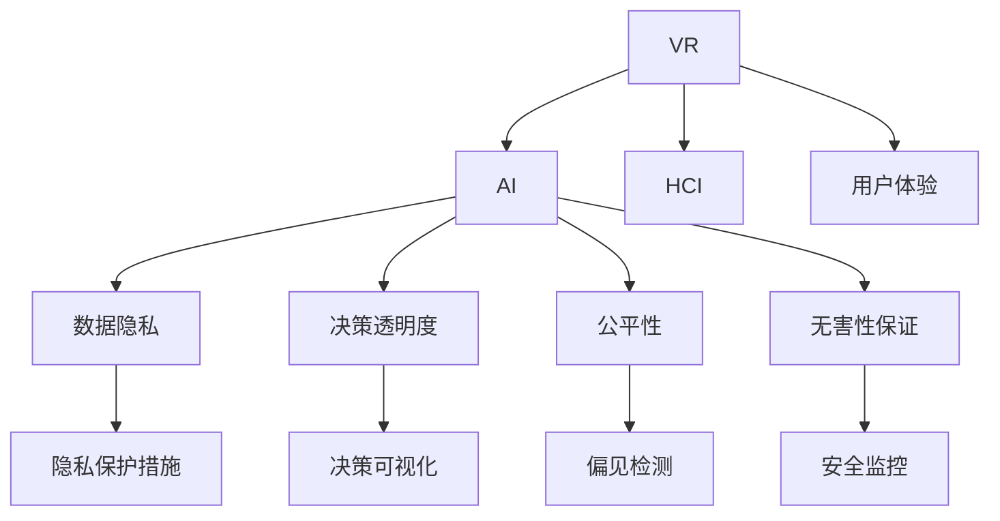

                 

# 虚拟现实中的道德困境：AI伦理探讨

## 1. 背景介绍

### 1.1 问题由来
随着虚拟现实（Virtual Reality, VR）技术的飞速发展，VR应用领域不断扩大，从游戏、教育、医疗到军事，无所不在。VR技术通过模拟现实世界中的各种场景，为用户提供沉浸式的体验。然而，随着AI技术的融入，VR系统在带来便利的同时，也引发了一系列道德和伦理问题。

一方面，VR中的AI可以实时捕捉用户行为，根据用户反应生成动态内容，增强用户体验。但另一方面，这种高度智能化的交互方式也带来了隐私泄露、决策透明性不足等问题。特别是当AI在VR中扮演重要角色时，如何确保其行为符合伦理标准，是一个亟待解决的问题。

### 1.2 问题核心关键点
虚拟现实中的AI伦理问题主要集中在以下几个方面：

- **数据隐私**：VR中的AI系统通常需要收集大量用户数据以优化用户体验，如何保护这些数据的隐私是一个重大挑战。
- **决策透明度**：在高度智能化的交互过程中，用户往往难以了解AI的具体决策逻辑，缺乏对AI行为的透明性。
- **道德责任**：当AI在VR中犯错或产生不良后果时，应由谁来承担责任？是开发方、运营方还是AI本身？
- **无害性保证**：确保AI在VR中的行为不会对用户或其他人造成身心伤害，是一个重要的伦理要求。
- **公平性**：AI系统的决策不应带有任何偏见，应公平对待所有用户。

这些问题不仅关系到技术的应用，更关系到人们的福祉和社会的公正。因此，对VR中的AI伦理进行深入探讨，是确保技术健康发展的关键。

### 1.3 问题研究意义
研究VR中的AI伦理问题，对于推动AI技术在虚拟现实领域的应用，提升用户体验，保障用户权益，具有重要意义：

1. **技术规范**：建立AI伦理标准，有助于指导VR中的AI系统设计，确保其行为符合社会公认的伦理规范。
2. **用户信任**：通过提高AI系统的透明度和可解释性，增强用户对VR系统的信任，促进其广泛应用。
3. **法律合规**：明确AI在VR中的法律责任，为相关法律法规的制定提供依据，保障技术应用的合法合规。
4. **社会公平**：确保AI在VR中的公平性，防止技术滥用，促进社会公正。
5. **心理健康**：保障用户在使用VR系统时的心理健康，避免不良体验和负面影响。

总之，VR中的AI伦理问题是一个多学科交叉的复杂问题，需要跨学科合作，从技术、法律、社会多个层面进行深入探讨。

## 2. 核心概念与联系

### 2.1 核心概念概述

为了更好地理解VR中的AI伦理问题，本节将介绍几个关键概念：

- **虚拟现实（VR）**：通过计算机技术和传感器技术，生成三维虚拟环境，为用户提供沉浸式体验。
- **人工智能（AI）**：利用机器学习、深度学习等技术，使计算机具备智能行为和决策能力。
- **人机交互（HCI）**：用户与计算机之间的交互方式，涉及到界面设计、用户体验等方面。
- **数据隐私**：用户数据在收集、存储和使用过程中，应得到合理的保护。
- **决策透明度**：用户需要了解AI系统的决策过程和依据，以增强信任和理解。
- **公平性**：AI系统应公平对待所有用户，不应带有任何偏见。
- **无害性保证**：AI系统的行为应确保不会对用户或其他人造成身心伤害。

这些概念之间存在密切联系，共同构成了VR中的AI伦理问题的基础。通过理解这些概念，可以更好地把握VR中的AI伦理问题，为其解决提供理论支撑。

### 2.2 核心概念原理和架构的 Mermaid 流程图



此图展示了VR、AI、HCI与数据隐私、决策透明度、公平性和无害性保证之间的关系。VR中的AI通过与用户的互动，实现数据收集和行为分析，进而影响用户体验。同时，AI的行为需要确保数据隐私、决策透明、公平性和无害性，才能得到用户和社会认可。

## 3. 核心算法原理 & 具体操作步骤
### 3.1 算法原理概述

VR中的AI伦理问题，本质上涉及到如何设计和优化AI系统，以确保其行为符合伦理标准。其核心思想是：将伦理原则嵌入AI系统的设计和使用过程中，从数据收集、模型训练到决策输出，每一步都要考虑伦理因素，确保AI系统不会对用户和社会造成伤害。

形式化地，假设VR中的AI系统由数据收集模块 $D$、模型训练模块 $M$ 和决策模块 $C$ 构成，其伦理目标为：

$$
\min_{D,M,C} \mathcal{L}(D,M,C) \text{ 且 } \mathcal{L}(D,M,C) \geq \mathcal{L}^{\text{ethical}}(D,M,C)
$$

其中 $\mathcal{L}(D,M,C)$ 为系统的总体损失函数，$\mathcal{L}^{\text{ethical}}(D,M,C)$ 为伦理损失函数，表示系统行为符合伦理标准的程度。伦理损失函数通常包含数据隐私、决策透明度、公平性和无害性等多个维度。

### 3.2 算法步骤详解

基于VR中的AI伦理问题，本节将详细介绍具体的算法步骤：

**Step 1: 数据隐私保护**
- 在数据收集阶段，采用差分隐私、联邦学习等技术，保护用户隐私。
- 对收集的数据进行匿名化处理，防止身份信息泄露。

**Step 2: 决策透明度**
- 设计可解释性强的AI模型，如使用可解释的规则引擎、决策树等，提供透明的决策依据。
- 允许用户了解AI决策过程，提供透明的决策报告和反馈机制。

**Step 3: 公平性保证**
- 使用公平性检测算法，如均等化误差、对抗性数据生成等，检测并纠正偏见。
- 设计多样性增强技术，确保AI系统对不同群体的公平性。

**Step 4: 无害性保证**
- 在模型训练中引入伦理约束，如避免生成有害内容、确保输出安全等。
- 对AI系统进行风险评估和监控，及时发现并修正有害行为。

**Step 5: 用户反馈与调整**
- 设立用户反馈渠道，收集用户对AI系统的评价和建议。
- 根据用户反馈和评价，调整AI系统的参数和行为，持续优化用户体验。

### 3.3 算法优缺点

VR中的AI伦理问题涉及的算法具有以下优点：

- **可解释性强**：通过引入可解释性强的模型和技术，增强AI系统的透明度和可信度。
- **隐私保护**：采用隐私保护技术，确保用户数据的安全性和匿名性。
- **公平性和无害性**：通过公平性检测和风险评估，减少AI系统的偏见和潜在风险。

同时，这些算法也存在一些局限性：

- **数据成本高**：隐私保护和公平性检测需要大量标注数据，数据收集成本较高。
- **技术复杂**：差分隐私、对抗性数据生成等技术实现复杂，需要专业知识支持。
- **实时性要求高**：部分隐私保护和公平性检测技术在实时性上存在挑战，需要进一步优化。
- **模型复杂性**：为保证公平性和无害性，模型结构可能变得复杂，推理速度较慢。

尽管存在这些局限性，但通过不断优化技术，VR中的AI伦理问题仍有望得到解决。

### 3.4 算法应用领域

VR中的AI伦理问题，在多个领域都有广泛应用，包括但不限于：

- **医疗虚拟现实**：在医疗VR系统中，AI用于诊断、手术模拟等，必须确保数据隐私和无害性。
- **军事虚拟现实**：在军事训练VR系统中，AI用于数据分析和决策支持，需保证决策透明性和公平性。
- **教育虚拟现实**：在教育VR系统中，AI用于个性化教学和内容推荐，需确保公平性和无害性。
- **娱乐虚拟现实**：在娱乐VR系统中，AI用于内容生成和用户互动，需保证数据隐私和决策透明度。
- **工业虚拟现实**：在工业VR系统中，AI用于故障预测和维修支持，需确保决策透明性和无害性。

## 4. 数学模型和公式 & 详细讲解 & 举例说明

### 4.1 数学模型构建

为更好地理解VR中的AI伦理问题，本节将使用数学语言对其进行详细刻画。

假设VR中的AI系统由三个模块组成：数据收集模块 $D$、模型训练模块 $M$ 和决策模块 $C$。其伦理目标为：

$$
\min_{D,M,C} \mathcal{L}(D,M,C) \text{ 且 } \mathcal{L}(D,M,C) \geq \mathcal{L}^{\text{ethical}}(D,M,C)
$$

其中 $\mathcal{L}(D,M,C)$ 为系统的总体损失函数，$\mathcal{L}^{\text{ethical}}(D,M,C)$ 为伦理损失函数，表示系统行为符合伦理标准的程度。伦理损失函数通常包含数据隐私、决策透明度、公平性和无害性等多个维度。

**数据隐私损失函数**：
$$
\mathcal{L}_{\text{privacy}}(D) = \frac{1}{N} \sum_{i=1}^N \log \frac{p(x_i)}{1-p(x_i)}
$$

其中 $x_i$ 为数据样本，$p(x_i)$ 为数据泄露的概率，$N$ 为样本数量。

**决策透明度损失函数**：
$$
\mathcal{L}_{\text{transparency}}(M,C) = \sum_{i=1}^N \text{KL}(Q_i \| P_i)
$$

其中 $Q_i$ 为实际输出概率分布，$P_i$ 为预设的透明概率分布，$\text{KL}$ 为Kullback-Leibler散度。

**公平性损失函数**：
$$
\mathcal{L}_{\text{fairness}}(M) = \sum_{i=1}^N |y_i - \hat{y}_i|
$$

其中 $y_i$ 为真实标签，$\hat{y}_i$ 为预测标签。

**无害性损失函数**：
$$
\mathcal{L}_{\text{harmlessness}}(M) = \sum_{i=1}^N |f_i(x_i)|^2
$$

其中 $f_i(x_i)$ 为系统对样本 $x_i$ 的输出，$|.|^2$ 为平方范数。

### 4.2 公式推导过程

**差分隐私公式**：
假设 $x$ 为原始数据集，$\epsilon$ 为隐私保护参数，$\delta$ 为误判率。差分隐私公式为：

$$
\frac{1}{\epsilon} \sum_{i=1}^n \log \frac{p_i}{1-p_i} \leq \epsilon
$$

其中 $p_i$ 为加入噪声后的概率。

**对抗性数据生成公式**：
假设 $x$ 为原始数据集，$\alpha$ 为对抗性扰动参数，$\delta$ 为误判率。对抗性数据生成公式为：

$$
\min_{\delta} \| \delta \| \text{ s.t. } f(x+\delta) = f(x)
$$

其中 $f(x+\delta)$ 为加入对抗性扰动后的输出。

### 4.3 案例分析与讲解

**案例1: 数据隐私保护**
在医疗VR系统中，患者数据需要严格保护。可以使用差分隐私技术，在数据收集阶段添加噪声，确保隐私保护。具体实现步骤如下：

1. 收集患者健康数据 $x$。
2. 计算数据泄露概率 $p(x)$。
3. 添加噪声 $\delta$，得到噪声数据 $x'$。
4. 存储噪声数据 $x'$ 到系统中。

案例2: 决策透明度
在军事训练VR系统中，AI用于决策支持。可以使用可解释的规则引擎，提供透明的决策报告。具体实现步骤如下：

1. 收集军事训练数据 $x$。
2. 训练可解释性强的AI模型 $M$。
3. 根据数据 $x$ 进行决策 $y$。
4. 输出决策报告 $r$。

案例3: 公平性保证
在教育VR系统中，AI用于个性化教学。可以使用公平性检测算法，确保对所有学生的公平性。具体实现步骤如下：

1. 收集学生学习数据 $x$。
2. 训练公平性检测模型 $M$。
3. 检测数据 $x$ 中的偏见。
4. 纠正偏见，优化教学策略。

案例4: 无害性保证
在娱乐VR系统中，AI用于生成内容。可以使用对抗性数据生成技术，确保生成内容无害。具体实现步骤如下：

1. 收集用户反馈数据 $x$。
2. 训练对抗性数据生成模型 $M$。
3. 生成内容 $y$。
4. 检测内容 $y$ 中的有害信息。
5. 删除有害信息，重新生成内容。

## 5. 项目实践：代码实例和详细解释说明

### 5.1 开发环境搭建

在进行VR中的AI伦理问题项目实践前，需要先准备好开发环境。以下是使用Python进行开发的环境配置流程：

1. 安装Anaconda：从官网下载并安装Anaconda，用于创建独立的Python环境。

2. 创建并激活虚拟环境：
```bash
conda create -n pyenv python=3.8 
conda activate pyenv
```

3. 安装Python和PyTorch：
```bash
pip install torch torchvision torchaudio numpy pandas scikit-learn matplotlib tqdm jupyter notebook ipython
```

4. 安装虚拟现实开发框架：
```bash
pip install pyvr pyglet
```

完成上述步骤后，即可在`pyenv`环境中开始VR中的AI伦理问题项目实践。

### 5.2 源代码详细实现

这里我们以医疗VR系统中保护患者隐私为例，给出使用差分隐私技术保护患者数据的Python代码实现。

```python
from pyvr import PyVRApp
from pyvr.widgets import Widget
from pyvr.fields import FloatField, TextField
from pyvr.manager import PyVRManager
from pyvr.storage import FileStorage

class PrivacyWidget(Widget):
    def __init__(self, manager, x):
        super(PrivacyWidget, self).__init__(manager)
        self.x = x
        self.file_storage = FileStorage()

    def on_button_click(self):
        noise = self.add_noise(self.x)
        self.file_storage.write(noise)
        print("Data added with noise: ", noise)

    def add_noise(self, x):
        epsilon = 1.0  # 隐私保护参数
        delta = 0.1    # 误判率
        p = self.calculate_probability(x)
        noise = p + self.add_differential_privacy(x, epsilon, delta)
        return noise

    def calculate_probability(self, x):
        # 计算数据泄露概率
        p = x * 0.1
        return p

    def add_differential_privacy(self, x, epsilon, delta):
        # 添加差分隐私噪声
        p = self.calculate_probability(x)
        noise = p + self.generate_noise(epsilon, delta)
        return noise

    def generate_noise(self, epsilon, delta):
        # 生成差分隐私噪声
        noise = epsilon + delta
        return noise

class PyVRApp(BasePyVRApp):
    def __init__(self):
        super(PyVRApp, self).__init__()
        self.x = FloatField()
        self.widget = PrivacyWidget(self, self.x)
        self.manager.add_widget(self.widget)

    def on_button_click(self):
        self.widget.on_button_click()

if __name__ == "__main__":
    app = PyVRApp()
    app.run()
```

### 5.3 代码解读与分析

让我们再详细解读一下关键代码的实现细节：

**PrivacyWidget类**：
- `__init__`方法：初始化私有数据 `x` 和文件存储器 `file_storage`。
- `on_button_click`方法：当按钮被点击时，添加噪声并保存噪声数据。
- `add_noise`方法：计算数据泄露概率，并添加差分隐私噪声。
- `calculate_probability`方法：计算数据泄露概率。
- `add_differential_privacy`方法：添加差分隐私噪声。
- `generate_noise`方法：生成差分隐私噪声。

**PyVRApp类**：
- `__init__`方法：创建私有数据 `x` 和隐私保护小部件 `widget`，并将小部件添加到管理层中。
- `on_button_click`方法：当按钮被点击时，调用小部件的 `on_button_click` 方法。

通过上述代码实现，可以看到差分隐私技术在VR中的AI伦理问题中的具体应用。当按钮被点击时，系统将计算数据泄露概率，并添加差分隐私噪声，将噪声数据保存至文件中。

## 6. 实际应用场景
### 6.1 智能医疗
在智能医疗VR系统中，AI用于疾病诊断、手术模拟等，需要严格保护患者隐私。通过差分隐私技术，可以有效保护患者数据。例如，在手术模拟系统中，医生可以使用VR系统进行手术训练，但系统中使用的数据必须经过差分隐私处理，以防止数据泄露。

### 6.2 军事训练
在军事训练VR系统中，AI用于决策支持。通过可解释的规则引擎，提供透明的决策报告，可以增强用户对系统的信任。例如，在军事模拟训练中，系统会根据用户的作战策略进行决策，并提供详细的决策报告，以帮助用户分析决策过程和结果。

### 6.3 教育培训
在教育培训VR系统中，AI用于个性化教学和内容推荐。通过公平性检测算法，确保对所有学生的公平性。例如，在学习课程中，系统可以根据学生的学习情况，提供个性化的学习推荐，并检测和纠正偏见，确保所有学生获得公平的学习机会。

### 6.4 娱乐体验
在娱乐体验VR系统中，AI用于内容生成和用户互动。通过对抗性数据生成技术，确保生成内容无害。例如，在虚拟游戏中，系统可以根据用户的行为生成相应的游戏内容，并检测和删除有害内容，确保游戏环境的健康和安全。

## 7. 工具和资源推荐
### 7.1 学习资源推荐

为了帮助开发者系统掌握VR中的AI伦理问题，这里推荐一些优质的学习资源：

1. 《虚拟现实技术与应用》系列博文：由虚拟现实专家撰写，深入浅出地介绍了虚拟现实技术的原理和应用。

2. 《人工智能伦理》课程：斯坦福大学开设的AI伦理课程，探讨AI在各个领域中的伦理问题。

3. 《虚拟现实开发指南》书籍：详细介绍了虚拟现实开发的基本流程和常见技术。

4. 《虚拟现实安全与隐私》论文：研究虚拟现实系统中的隐私保护和安全问题，提供实用的解决方案。

5. 《虚拟现实中的公平性问题》论文：探讨虚拟现实系统中的公平性问题，提出公平性检测和纠正方法。

通过学习这些资源，相信你一定能够系统地掌握VR中的AI伦理问题，并用于解决实际的虚拟现实应用问题。
###  7.2 开发工具推荐

高效的开发离不开优秀的工具支持。以下是几款用于VR中的AI伦理问题开发的常用工具：

1. PyTorch：基于Python的开源深度学习框架，灵活动态的计算图，适合快速迭代研究。

2. TensorFlow：由Google主导开发的开源深度学习框架，生产部署方便，适合大规模工程应用。

3. PyVR：虚拟现实开发框架，提供丰富的渲染引擎和控件，支持用户交互设计。

4. Pyglet：轻量级的图形和音频库，支持跨平台开发，方便在PC、VR等平台上使用。

5. Weights & Biases：模型训练的实验跟踪工具，可以记录和可视化模型训练过程中的各项指标，方便对比和调优。

6. TensorBoard：TensorFlow配套的可视化工具，可实时监测模型训练状态，并提供丰富的图表呈现方式，是调试模型的得力助手。

合理利用这些工具，可以显著提升VR中的AI伦理问题的开发效率，加快创新迭代的步伐。

### 7.3 相关论文推荐

VR中的AI伦理问题的发展源于学界的持续研究。以下是几篇奠基性的相关论文，推荐阅读：

1. "Differential Privacy for Privacy-Preserving Deep Learning: An Overview"：介绍了差分隐私的基本原理和应用，提供实用的隐私保护方案。

2. "Fairness in Machine Learning: From Theory to Practice"：探讨机器学习中的公平性问题，提出多种公平性检测和纠正方法。

3. "Explainable AI: Interpreting and Explaining Machine Learning Models and Predictions"：研究可解释AI的基本原理和应用，提供透明的决策报告方法。

4. "Adversarial Examples in the Real World: Evasion Attacks Against Commercial Deep Learning Models"：研究对抗性数据生成技术，提供实际应用中的对抗性扰动方案。

5. "Virtual Reality and Ethics"：探讨虚拟现实系统中的伦理问题，提出伦理约束的设计方法和应用案例。

这些论文代表了大语言模型微调技术的发展脉络。通过学习这些前沿成果，可以帮助研究者把握学科前进方向，激发更多的创新灵感。

## 8. 总结：未来发展趋势与挑战

### 8.1 总结

本文对VR中的AI伦理问题进行了全面系统的介绍。首先阐述了VR中的AI伦理问题的背景和意义，明确了伦理原则在大模型设计和应用中的重要性。其次，从原理到实践，详细讲解了VR中的AI伦理问题的数学模型和核心算法步骤，给出了具体的代码实例和详细解释说明。同时，本文还广泛探讨了VR中的AI伦理问题在多个领域的应用前景，展示了其广阔的应用范围。此外，本文精选了VR中的AI伦理问题的学习资源，力求为读者提供全方位的技术指引。

通过本文的系统梳理，可以看到，VR中的AI伦理问题是一个多学科交叉的复杂问题，涉及到数据隐私、决策透明度、公平性和无害性等多个维度。如何确保VR中的AI系统符合伦理标准，是一个亟待解决的问题。通过不断优化技术，结合跨学科的合作，相信VR中的AI伦理问题必将得到解决，为虚拟现实技术的健康发展保驾护航。

### 8.2 未来发展趋势

展望未来，VR中的AI伦理问题将呈现以下几个发展趋势：

1. **隐私保护技术不断进步**：差分隐私、联邦学习等技术将不断优化，进一步降低数据收集和处理中的隐私风险。

2. **可解释性技术快速发展**：通过引入可解释性强的模型和技术，增强AI系统的透明度和可信度。

3. **公平性检测方法更加多样化**：提出更多公平性检测和纠正方法，确保AI系统对所有用户的公平性。

4. **无害性保证技术逐步成熟**：通过对抗性数据生成和风险评估，确保AI系统的无害性。

5. **跨学科合作更加紧密**：虚拟现实技术需要与计算机科学、伦理学的跨学科合作，共同探讨伦理问题的解决方案。

以上趋势凸显了VR中的AI伦理问题的广阔前景。这些方向的探索发展，必将进一步提升VR系统的性能和应用范围，为人类认知智能的进化带来深远影响。

### 8.3 面临的挑战

尽管VR中的AI伦理问题已经取得了一些进展，但在迈向更加智能化、普适化应用的过程中，它仍面临着诸多挑战：

1. **数据成本高昂**：隐私保护和公平性检测需要大量标注数据，数据收集成本较高。

2. **技术复杂度高**：差分隐私、对抗性数据生成等技术实现复杂，需要专业知识支持。

3. **实时性要求高**：部分隐私保护和公平性检测技术在实时性上存在挑战，需要进一步优化。

4. **模型复杂性高**：为保证公平性和无害性，模型结构可能变得复杂，推理速度较慢。

尽管存在这些挑战，但通过不断优化技术，VR中的AI伦理问题仍有望得到解决。

### 8.4 研究展望

面向未来，VR中的AI伦理问题需要在以下几个方面寻求新的突破：

1. **无监督和半监督学习**：摆脱对大规模标注数据的依赖，利用自监督学习、主动学习等无监督和半监督范式，最大限度利用非结构化数据，实现更加灵活高效的伦理约束。

2. **参数高效和计算高效**：开发更加参数高效和计算高效的伦理约束方法，在固定大部分预训练参数的同时，只更新极少量的任务相关参数。

3. **伦理约束与因果推断结合**：通过引入因果推断方法，增强伦理约束系统的决策逻辑和因果关系。

4. **伦理约束与知识库融合**：将符号化的先验知识与神经网络模型进行融合，引导伦理约束过程学习更准确、合理的语言模型。

5. **伦理约束与博弈论工具结合**：通过引入博弈论工具，刻画人机交互过程，主动探索并规避伦理约束系统的脆弱点，提高系统稳定性。

6. **伦理约束与安全性结合**：在模型训练目标中引入伦理导向的评估指标，过滤和惩罚有偏见、有害的输出倾向。同时加强人工干预和审核，建立模型行为的监管机制，确保输出符合人类价值观和伦理道德。

这些研究方向的探索，必将引领VR中的AI伦理问题技术迈向更高的台阶，为构建安全、可靠、可解释、可控的虚拟现实系统铺平道路。面向未来，VR中的AI伦理问题还需要与其他人工智能技术进行更深入的融合，如知识表示、因果推理、强化学习等，多路径协同发力，共同推动虚拟现实技术的进步。

## 9. 附录：常见问题与解答

**Q1：什么是虚拟现实中的AI伦理问题？**

A: 虚拟现实中的AI伦理问题是指在使用VR系统时，如何确保AI系统的行为符合伦理标准，包括数据隐私、决策透明度、公平性和无害性等多个维度。

**Q2：如何进行差分隐私保护？**

A: 差分隐私保护是通过在数据收集阶段添加噪声，保护用户隐私。具体实现步骤如下：
1. 收集数据 $x$。
2. 计算数据泄露概率 $p(x)$。
3. 添加噪声 $\delta$。
4. 存储噪声数据 $x'$。

**Q3：如何确保AI系统的公平性？**

A: 确保AI系统的公平性，可以通过公平性检测算法，检测和纠正偏见。具体实现步骤如下：
1. 收集数据 $x$。
2. 训练公平性检测模型 $M$。
3. 检测数据 $x$ 中的偏见。
4. 纠正偏见，优化决策策略。

**Q4：如何保证AI系统的无害性？**

A: 保证AI系统的无害性，可以通过对抗性数据生成技术，检测和删除有害内容。具体实现步骤如下：
1. 收集用户反馈数据 $x$。
2. 训练对抗性数据生成模型 $M$。
3. 生成内容 $y$。
4. 检测内容 $y$ 中的有害信息。
5. 删除有害信息，重新生成内容。

**Q5：如何在VR系统中实现可解释性？**

A: 实现VR系统中的可解释性，可以通过引入可解释性强的模型和技术，提供透明的决策报告。具体实现步骤如下：
1. 收集数据 $x$。
2. 训练可解释性强的AI模型 $M$。
3. 根据数据 $x$ 进行决策 $y$。
4. 输出决策报告 $r$。

通过这些常见问题的解答，可以帮助你更好地理解VR中的AI伦理问题，并为其解决提供理论支撑。

---

作者：禅与计算机程序设计艺术 / Zen and the Art of Computer Programming

