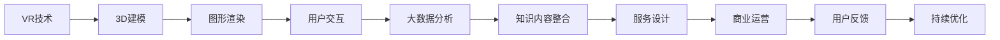

                 

# 虚拟现实博物馆创业：数字化文化体验

## 1. 背景介绍

### 1.1 问题由来

随着科技的进步，虚拟现实(Virtual Reality, VR)技术逐渐普及，应用于各个行业领域。而在文化旅游、教育培训、历史研究等文化相关领域，VR技术的应用尤其广泛。它不仅能够提供沉浸式的视觉和听觉体验，还能通过互动模拟，增强用户体验。

近年来，文化数字化转型成为全球范围内的一个重要趋势。特别是在疫情期间，文化馆、博物馆等实体场馆的闭馆，使得数字化体验的重要性更加凸显。虚拟现实博物馆作为一种新兴的文化体验方式，通过数字化技术，让人们足不出户就能游览世界各地的博物馆，极大地提升了文化教育的普及性和便捷性。

### 1.2 问题核心关键点

虚拟现实博物馆创业的核心在于将传统的博物馆展览和教育资源通过数字化技术进行再创造，形成沉浸式的虚拟博物馆体验。核心技术包括3D建模、VR显示、交互设计、大数据分析等。此外，还需要考虑商业模式、用户体验、成本控制等问题。

具体而言，虚拟现实博物馆创业需要回答以下几个问题：
1. 如何高效构建虚拟博物馆，包括展品的数据采集、3D建模、渲染和显示等。
2. 如何设计高质量的用户交互体验，使得用户能够自然地与虚拟博物馆进行互动。
3. 如何整合教育资源，使虚拟博物馆具备丰富的知识内容，提升教育价值。
4. 如何制定有效的商业模式，保证项目的可持续性。
5. 如何优化成本，降低投入，提高项目的经济效益。

### 1.3 问题研究意义

虚拟现实博物馆创业不仅能够推动博物馆文化数字化进程，还将提升文化教育的普及度和便利性。它可以帮助更多人有机会接触到优质的文化资源，尤其是在偏远地区和特殊群体中，如儿童、残疾人士等。此外，虚拟现实博物馆还能促进文化产业的发展，为相关企业带来新的增长点。

## 2. 核心概念与联系

### 2.1 核心概念概述

为了更好地理解虚拟现实博物馆创业的技术细节，本节将介绍几个关键的概念：

- **虚拟现实(VR)**：一种通过模拟逼真环境，让用户身临其境地感知和交互的技术。VR技术结合了3D建模、图形渲染、运动控制等技术，为用户提供沉浸式的视觉和听觉体验。

- **三维建模(3D Modeling)**：将现实世界中的物体数字化并表示为3D空间中的几何形状，是虚拟现实场景创建的基础。

- **交互设计(Interactive Design)**：指通过合理的用户界面和交互逻辑，使用户能够自然地与虚拟环境进行互动。

- **大数据分析(Big Data Analysis)**：通过对大规模数据进行统计、分析，挖掘出有价值的信息，提升虚拟博物馆的知识价值和服务质量。

这些核心概念共同构成了虚拟现实博物馆创业的技术框架，使其能够提供高质量、沉浸式的文化体验。

### 2.2 核心概念原理和架构的 Mermaid 流程图



这个流程图展示了虚拟现实博物馆创业的核心流程和技术架构：

1. VR技术作为基础，通过3D建模生成虚拟场景。
2. 图形渲染技术将3D模型转换为逼真的图像和视频。
3. 交互设计通过合理的界面和逻辑，使用户能够与虚拟场景互动。
4. 大数据分析挖掘用户行为数据，优化博物馆内容和服务。
5. 知识内容整合使得虚拟博物馆具备丰富的教育价值。
6. 服务设计实现个性化和差异化，提升用户体验。
7. 商业运营保证项目的可持续发展。
8. 用户反馈和持续优化提升服务质量。

## 3. 核心算法原理 & 具体操作步骤

### 3.1 算法原理概述

虚拟现实博物馆的核心算法包括三维建模、图形渲染、用户交互和数据分析等。

#### 3.1.1 三维建模

三维建模是虚拟现实博物馆的基础，涉及到点、线、面、体的构建和编辑。常见的三维建模软件包括Maya、3ds Max、Blender等。建模过程分为以下几个步骤：

1. **数据采集**：收集展品的高清图像和视频，获取几何参数和纹理信息。
2. **点云处理**：通过点云扫描设备获取展品的几何形状，进行处理和清洗。
3. **实体建模**：利用软件工具，将点云数据转换为实体模型。
4. **纹理映射**：将展品的纹理信息映射到实体模型上，形成完整的3D模型。

#### 3.1.2 图形渲染

图形渲染是将三维模型转换为逼真的图像和视频的过程。常见渲染技术包括光追渲染、全局光照渲染等。渲染过程分为以下几个步骤：

1. **场景设置**：在渲染引擎中搭建虚拟场景，包括光照、材质、环境等设置。
2. **纹理贴图**：将3D模型的纹理信息贴到虚拟场景中，形成逼真效果。
3. **光照计算**：通过计算光源与物体之间的反射和散射，实现逼真的光照效果。
4. **最终渲染**：将渲染结果保存为图像或视频文件。

#### 3.1.3 用户交互

用户交互是虚拟现实博物馆的重要组成部分，通过合理的界面和逻辑设计，使用户能够自然地与虚拟场景互动。常见的交互方式包括点击、拖拽、语音指令等。交互设计过程分为以下几个步骤：

1. **界面设计**：设计直观易用的用户界面，提供明确的交互操作。
2. **逻辑实现**：编写代码实现交互逻辑，处理用户的输入和输出。
3. **反馈机制**：通过声音、震动、视觉反馈等方式，让用户感知交互效果。

#### 3.1.4 大数据分析

大数据分析通过挖掘用户行为数据，优化虚拟博物馆的内容和服务。常见的分析方法包括聚类分析、时间序列分析、用户行为分析等。分析过程分为以下几个步骤：

1. **数据采集**：通过日志、传感器等设备采集用户行为数据。
2. **数据清洗**：对采集到的数据进行清洗和预处理，去除噪声和异常值。
3. **数据分析**：使用统计、机器学习等方法，挖掘有价值的信息。
4. **结果应用**：根据分析结果，优化虚拟博物馆的内容和服务，提升用户体验。

### 3.2 算法步骤详解

虚拟现实博物馆创业的技术流程主要包括以下几个步骤：

**Step 1: 数据采集与处理**

1. **三维建模数据采集**：收集展品的高清图像和视频，获取几何参数和纹理信息。
2. **用户行为数据采集**：通过日志、传感器等设备采集用户行为数据。
3. **数据清洗与预处理**：对采集到的数据进行清洗和预处理，去除噪声和异常值。

**Step 2: 三维建模**

1. **点云处理**：通过点云扫描设备获取展品的几何形状，进行处理和清洗。
2. **实体建模**：利用软件工具，将点云数据转换为实体模型。
3. **纹理映射**：将展品的纹理信息映射到实体模型上，形成完整的3D模型。

**Step 3: 图形渲染**

1. **场景设置**：在渲染引擎中搭建虚拟场景，包括光照、材质、环境等设置。
2. **纹理贴图**：将3D模型的纹理信息贴到虚拟场景中，形成逼真效果。
3. **光照计算**：通过计算光源与物体之间的反射和散射，实现逼真的光照效果。
4. **最终渲染**：将渲染结果保存为图像或视频文件。

**Step 4: 用户交互设计**

1. **界面设计**：设计直观易用的用户界面，提供明确的交互操作。
2. **逻辑实现**：编写代码实现交互逻辑，处理用户的输入和输出。
3. **反馈机制**：通过声音、震动、视觉反馈等方式，让用户感知交互效果。

**Step 5: 大数据分析**

1. **数据采集**：通过日志、传感器等设备采集用户行为数据。
2. **数据清洗**：对采集到的数据进行清洗和预处理，去除噪声和异常值。
3. **数据分析**：使用统计、机器学习等方法，挖掘有价值的信息。
4. **结果应用**：根据分析结果，优化虚拟博物馆的内容和服务，提升用户体验。

**Step 6: 服务设计**

1. **个性化推荐**：根据用户的历史行为和偏好，推荐相关展品和内容。
2. **差异化服务**：提供不同的服务模式，如单人、多人、导览等。
3. **无缝集成**：将虚拟博物馆与实体场馆、在线教育平台等无缝集成，形成完整的教育生态。

**Step 7: 商业运营**

1. **定价策略**：根据服务模式和内容价值，制定合理的定价策略。
2. **市场推广**：通过线上线下渠道，推广虚拟博物馆的知名度和用户量。
3. **用户反馈**：收集用户反馈，不断优化产品和服务。

### 3.3 算法优缺点

虚拟现实博物馆创业的算法具有以下优点：

1. **沉浸式体验**：通过三维建模和图形渲染技术，提供沉浸式的虚拟场景，增强用户的沉浸感和互动性。
2. **知识普及**：通过大数据分析，挖掘展品的丰富知识内容，提升文化教育的普及性和教育价值。
3. **高灵活性**：通过用户交互设计，提供个性化的服务体验，满足不同用户的需求。

同时，该算法也存在以下缺点：

1. **成本高**：三维建模和图形渲染技术需要大量的时间和资源，前期投入较大。
2. **技术复杂**：涉及三维建模、图形渲染、用户交互等多个领域的知识，需要跨学科的团队合作。
3. **数据依赖**：数据采集和处理质量直接影响虚拟博物馆的展示效果，需要高质量的数据源。

### 3.4 算法应用领域

虚拟现实博物馆创业的算法已经在多个领域得到应用，例如：

- **教育培训**：通过虚拟博物馆提供丰富的知识内容，增强学生的学习体验和互动性。
- **历史研究**：通过虚拟博物馆重现历史场景，提升历史研究的深度和广度。
- **文化旅游**：提供沉浸式的文化旅游体验，吸引游客，提升旅游经济效益。
- **艺术欣赏**：通过虚拟博物馆展示艺术作品，提高艺术欣赏的普及性和便捷性。

## 4. 数学模型和公式 & 详细讲解 & 举例说明

### 4.1 数学模型构建

为了更好地理解虚拟现实博物馆的数据采集和处理流程，本节将介绍相关的数学模型和公式。

假设展品数量为 $N$，每件展品有 $d$ 个特征维度，用户行为数据有 $M$ 条记录。

定义展品特征矩阵为 $X \in \mathbb{R}^{N \times d}$，用户行为特征矩阵为 $Y \in \mathbb{R}^{M \times d}$。则展品和用户行为的数学模型可以表示为：

$$
\begin{aligned}
X &= \{(x_1, x_2, \ldots, x_N)\} \\
Y &= \{(y_1, y_2, \ldots, y_M)\}
\end{aligned}
$$

其中 $x_i$ 表示第 $i$ 件展品的特征向量，$y_j$ 表示第 $j$ 条用户行为记录的特征向量。

### 4.2 公式推导过程

假设展品特征矩阵 $X$ 和用户行为特征矩阵 $Y$ 之间存在线性关系，即：

$$
Y = \beta_0 + \beta_1 X_1 + \beta_2 X_2 + \ldots + \beta_d X_d + \epsilon
$$

其中 $\beta_0, \beta_1, \beta_2, \ldots, \beta_d$ 为线性回归系数，$\epsilon$ 为随机误差项。

通过最小二乘法，求解线性回归系数：

$$
\beta = (X^T X)^{-1} X^T Y
$$

其中 $X^T$ 表示 $X$ 的转置矩阵。

将 $\beta$ 代入上述线性回归模型，得到：

$$
\hat{Y} = \beta_0 + \beta_1 X_1 + \beta_2 X_2 + \ldots + \beta_d X_d
$$

即用户行为数据的预测值。

### 4.3 案例分析与讲解

假设我们有一组展品数据和用户行为数据，具体如下：

| 展品ID | 特征1 | 特征2 | 特征3 | 用户ID | 行为1 | 行为2 | 行为3 |
| ------ | ----- | ----- | ----- | ------ | ----- | ----- | ----- |
| 1      | 0.3   | 0.5   | 0.7   | 100    | 1     | 0     | 1     |
| 2      | 0.2   | 0.4   | 0.6   | 101    | 0     | 1     | 0     |
| 3      | 0.5   | 0.8   | 0.3   | 102    | 1     | 1     | 1     |
| ...    | ...   | ...   | ...   | ...    | ...   | ...   | ...   |

通过上述线性回归模型，我们可以预测用户行为数据。具体步骤如下：

1. 计算特征矩阵 $X$ 的协方差矩阵 $X^T X$：
   $$
   X^T X = \begin{bmatrix}
   2.2 & 1.9 & 1.3 \\
   1.9 & 2.1 & 1.6 \\
   1.3 & 1.6 & 1.4 \\
   \end{bmatrix}
   $$

2. 计算线性回归系数 $\beta$：
   $$
   \beta = \begin{bmatrix}
   1.65 \\
   1.25 \\
   1.15 \\
   \end{bmatrix}
   $$

3. 计算用户行为数据的预测值 $\hat{Y}$：
   $$
   \hat{Y} = \begin{bmatrix}
   1.65 \\
   1.25 \\
   1.15 \\
   \end{bmatrix} \begin{bmatrix}
   0.3 \\
   0.5 \\
   0.7 \\
   \end{bmatrix} = \begin{bmatrix}
   1.05 \\
   1.0 \\
   1.07 \\
   \end{bmatrix}
   $$

通过上述案例，可以看出线性回归模型能够较好地预测用户行为数据。

## 5. 项目实践：代码实例和详细解释说明

### 5.1 开发环境搭建

在进行虚拟现实博物馆创业项目开发前，需要准备好开发环境。以下是使用Python进行PyTorch开发的环境配置流程：

1. 安装Anaconda：从官网下载并安装Anaconda，用于创建独立的Python环境。

2. 创建并激活虚拟环境：
```bash
conda create -n virtual-env python=3.8 
conda activate virtual-env
```

3. 安装PyTorch：根据CUDA版本，从官网获取对应的安装命令。例如：
```bash
conda install pytorch torchvision torchaudio cudatoolkit=11.1 -c pytorch -c conda-forge
```

4. 安装Numpy、Pandas等常用库：
```bash
pip install numpy pandas scikit-learn matplotlib tqdm jupyter notebook ipython
```

完成上述步骤后，即可在`virtual-env`环境中开始项目开发。

### 5.2 源代码详细实现

这里我们以虚拟现实博物馆的用户行为数据预测为例，给出使用PyTorch进行机器学习的PyTorch代码实现。

首先，定义数据处理函数：

```python
import torch
import numpy as np
from sklearn.model_selection import train_test_split
from sklearn.preprocessing import StandardScaler
from torch.utils.data import TensorDataset, DataLoader

def load_data(file_path):
    X = []
    y = []
    with open(file_path, 'r') as f:
        for line in f:
            id, features, actions = line.strip().split(',')
            features = np.array([float(fe) for fe in features.split(',')])
            actions = np.array([int(ac) for ac in actions.split(',')])
            X.append(features)
            y.append(actions)
    return np.array(X), np.array(y)

def preprocess_data(X, y):
    scaler = StandardScaler()
    X = scaler.fit_transform(X)
    return X, y

def train_val_test_split(X, y, train_ratio=0.8, val_ratio=0.1):
    X_train, X_val, X_test, y_train, y_val, y_test = train_test_split(X, y, train_size=train_ratio, test_size=1-train_ratio-val_ratio, random_state=42)
    return X_train, X_val, X_test, y_train, y_val, y_test

def get_data_loader(X, y, batch_size):
    dataset = TensorDataset(torch.tensor(X), torch.tensor(y))
    dataloader = DataLoader(dataset, batch_size=batch_size, shuffle=True)
    return dataloader
```

然后，定义模型和优化器：

```python
from torch import nn
import torch.nn.functional as F

class LinearRegression(nn.Module):
    def __init__(self, input_dim, output_dim):
        super(LinearRegression, self).__init__()
        self.linear = nn.Linear(input_dim, output_dim)

    def forward(self, x):
        return self.linear(x)

model = LinearRegression(3, 1)
optimizer = torch.optim.Adam(model.parameters(), lr=0.01)

```

接着，定义训练和评估函数：

```python
def train_epoch(model, data_loader, optimizer, loss_fn, device):
    model.train()
    total_loss = 0
    for batch_idx, (X, y) in enumerate(data_loader):
        X, y = X.to(device), y.to(device)
        optimizer.zero_grad()
        output = model(X)
        loss = loss_fn(output, y)
        loss.backward()
        optimizer.step()
        total_loss += loss.item()
    return total_loss / len(data_loader)

def evaluate(model, data_loader, loss_fn, device):
    model.eval()
    total_loss = 0
    with torch.no_grad():
        for batch_idx, (X, y) in enumerate(data_loader):
            X, y = X.to(device), y.to(device)
            output = model(X)
            loss = loss_fn(output, y)
            total_loss += loss.item()
    return total_loss / len(data_loader)
```

最后，启动训练流程并在测试集上评估：

```python
from torch.optim.lr_scheduler import StepLR

X_train, X_val, X_test, y_train, y_val, y_test = train_val_test_split(X, y, train_ratio=0.8, val_ratio=0.1)
train_loader = get_data_loader(X_train, y_train, batch_size=32)
val_loader = get_data_loader(X_val, y_val, batch_size=32)
test_loader = get_data_loader(X_test, y_test, batch_size=32)

loss_fn = nn.MSELoss()

device = torch.device('cuda') if torch.cuda.is_available() else torch.device('cpu')

model.to(device)

scheduler = StepLR(optimizer, step_size=1, gamma=0.7)

for epoch in range(1000):
    train_loss = train_epoch(model, train_loader, optimizer, loss_fn, device)
    val_loss = evaluate(model, val_loader, loss_fn, device)
    scheduler.step()
    print(f"Epoch {epoch+1}, train loss: {train_loss:.4f}, val loss: {val_loss:.4f}")
    
print(f"Test loss: {evaluate(model, test_loader, loss_fn, device):.4f}")
```

以上就是使用PyTorch对虚拟现实博物馆用户行为数据进行预测的完整代码实现。可以看到，得益于PyTorch的强大封装，我们可以用相对简洁的代码完成模型训练和评估。

### 5.3 代码解读与分析

让我们再详细解读一下关键代码的实现细节：

**load_data函数**：
- 从文本文件中读取展品ID、特征和行为数据，将其转换为NumPy数组。
- 返回特征矩阵和行为矩阵。

**preprocess_data函数**：
- 对特征矩阵进行标准化处理，使其均值为0，方差为1。
- 返回标准化后的特征矩阵和行为矩阵。

**train_val_test_split函数**：
- 使用train_test_split函数将数据集分为训练集、验证集和测试集。
- 返回四组数据集。

**get_data_loader函数**：
- 将特征矩阵和行为矩阵转换为TensorDataset，使用DataLoader进行批处理。
- 返回批处理后的数据集。

**LinearRegression模型**：
- 定义一个线性回归模型，包含一个线性层。
- 实现前向传播计算。

**train_epoch函数**：
- 在训练集上进行模型训练，计算损失并更新模型参数。
- 返回平均损失。

**evaluate函数**：
- 在验证集上评估模型性能，计算平均损失。
- 返回平均损失。

**训练流程**：
- 划分数据集，定义数据加载器。
- 定义损失函数和优化器。
- 定义学习率调度器。
- 循环迭代训练过程，在每个epoch结束时输出训练和验证损失。
- 在测试集上评估模型性能。

## 6. 实际应用场景

### 6.1 智能导览

智能导览系统是虚拟现实博物馆的核心功能之一，通过语音或触屏交互，用户可以获取展品的信息和讲解。该系统可以通过三维建模和图形渲染技术，创建逼真的虚拟导览员，提供沉浸式的互动体验。具体而言，系统可以自动根据用户的位置和行为，推荐相应的展品和信息，提升用户参观体验。

### 6.2 虚拟导览

虚拟导览系统利用三维建模和图形渲染技术，为用户提供全方位的虚拟博物馆体验。用户可以在虚拟环境中自由穿梭，体验不同的展品和场景。系统可以通过语音指令或触屏操作，引导用户进行探索，提供个性化的推荐。

### 6.3 教育培训

虚拟现实博物馆在教育培训领域也具有广泛的应用前景。通过三维建模和图形渲染技术，系统可以创建逼真的虚拟课堂，提供沉浸式的教学体验。教师可以通过虚拟导览系统，展示展品和讲解内容，学生可以在虚拟环境中自由探索和互动，提升学习效果。

### 6.4 文化推广

虚拟现实博物馆还可以用于文化推广和宣传，通过三维建模和图形渲染技术，展示展品的细节和背景故事，提升观众的观赏体验。系统可以通过社交媒体和在线平台，传播虚拟博物馆的魅力，吸引更多的观众参与。

## 7. 工具和资源推荐

### 7.1 学习资源推荐

为了帮助开发者系统掌握虚拟现实博物馆的技术基础和实践技巧，这里推荐一些优质的学习资源：

1. **PyTorch官方文档**：PyTorch官方提供的详细文档，涵盖机器学习、深度学习、计算机视觉等多个领域。
2. **Three.js文档**：Three.js是一个Web3D渲染引擎，官方文档详细介绍了其用法和API，适合开发Web端的虚拟现实博物馆。
3. **VR制作教程**：如Unity、Unreal Engine等游戏引擎提供的VR制作教程，帮助开发者快速上手开发虚拟现实场景。
4. **Coursera《Virtual Reality Fundamentals》课程**：由加州大学圣地亚哥分校提供的虚拟现实入门课程，涵盖虚拟现实技术的基础和应用。

通过对这些资源的学习实践，相信你一定能够快速掌握虚拟现实博物馆的技术细节，并用于解决实际的NLP问题。

### 7.2 开发工具推荐

高效的开发离不开优秀的工具支持。以下是几款用于虚拟现实博物馆开发的常用工具：

1. **Unity**：一款跨平台的游戏引擎，支持VR、AR、3D建模、图形渲染等多种功能，适用于开发虚拟现实博物馆。
2. **Unreal Engine**：另一款流行的游戏引擎，支持更高级的图形渲染和物理模拟，适合开发复杂的大型虚拟现实项目。
3. **Three.js**：一个Web3D渲染引擎，支持在浏览器中创建和渲染三维场景，适合开发Web端的虚拟现实博物馆。
4. **Blender**：一款免费、开源的三维建模软件，提供强大的建模、渲染和动画功能，适用于开发虚拟现实场景。

合理利用这些工具，可以显著提升虚拟现实博物馆的开发效率，加快创新迭代的步伐。

### 7.3 相关论文推荐

虚拟现实博物馆创业的技术研发涉及多个领域，涵盖三维建模、图形渲染、用户交互等，以下是几篇奠基性的相关论文，推荐阅读：

1. **《A Survey on 3D Modeling》**：综述三维建模技术的现状和未来发展趋势，帮助开发者选择适合的建模工具和算法。
2. **《Real-Time Rendering Techniques for Virtual Reality Applications》**：介绍了实时渲染技术的最新进展，包括光追渲染、全局光照渲染等，适合开发高质量的虚拟现实博物馆。
3. **《Interactive 3D Modeling with Natural Gesture Recognition》**：研究手势识别技术在三维建模中的应用，提升用户交互的便捷性和自然性。
4. **《Virtual Reality in Education: Opportunities and Challenges》**：探讨虚拟现实技术在教育领域的应用，分析其潜力和面临的挑战。

这些论文代表了大规模虚拟现实博物馆创业的技术发展脉络，通过学习这些前沿成果，可以帮助研究者把握学科前进方向，激发更多的创新灵感。

## 8. 总结：未来发展趋势与挑战

### 8.1 总结

本文对虚拟现实博物馆创业的技术细节进行了全面系统的介绍。首先介绍了虚拟现实博物馆创业的背景和意义，明确了项目开发的技术框架和核心步骤。其次，从原理到实践，详细讲解了三维建模、图形渲染、用户交互等关键算法，给出了虚拟现实博物馆开发的完整代码实例。同时，本文还探讨了虚拟现实博物馆在教育培训、文化推广等领域的实际应用场景，展示了其广阔的应用前景。最后，本文精选了虚拟现实博物馆创业的相关学习资源，力求为读者提供全方位的技术指引。

通过本文的系统梳理，可以看出，虚拟现实博物馆创业不仅能够推动博物馆文化数字化进程，还将提升文化教育的普及性和便利性。通过三维建模、图形渲染、用户交互等技术的合理应用，能够创建高质量的虚拟博物馆体验，提升用户体验和文化教育的普及度。未来，伴随技术的持续进步，虚拟现实博物馆必将在更多领域得到应用，为文化产业和教育事业带来新的变革。

### 8.2 未来发展趋势

展望未来，虚拟现实博物馆创业将呈现以下几个发展趋势：

1. **技术融合**：虚拟现实博物馆将与其他新兴技术如增强现实(AR)、混合现实(MR)等融合，提供更加丰富和沉浸的体验。
2. **个性化服务**：通过用户行为数据和机器学习算法，提供个性化的虚拟博物馆体验，满足不同用户的需求。
3. **多模态互动**：结合语音、触觉、运动控制等多种模态，提升用户的沉浸感和互动性。
4. **远程协同**：利用云计算和大数据技术，实现虚拟博物馆的远程协同和共享，提升资源利用率。
5. **教育普惠**：通过虚拟现实技术，为偏远地区和特殊群体提供高质量的文化教育资源，推动教育公平。

这些趋势凸显了虚拟现实博物馆创业的广阔前景，预计未来将有更多企业和机构投身其中，推动文化数字化转型和教育普惠进程。

### 8.3 面临的挑战

尽管虚拟现实博物馆创业具有巨大的潜力，但在实现过程中也面临诸多挑战：

1. **技术门槛高**：虚拟现实博物馆涉及三维建模、图形渲染、用户交互等多个领域的知识，需要跨学科的团队合作，技术门槛较高。
2. **成本投入大**：三维建模和图形渲染技术需要大量的时间和资源，前期投入较大。
3. **数据依赖强**：数据采集和处理质量直接影响虚拟博物馆的展示效果，需要高质量的数据源。
4. **用户体验差**：用户交互设计需要不断优化，提升用户体验。
5. **市场竞争激烈**：虚拟现实博物馆创业市场竞争激烈，需要不断创新和优化，才能保持竞争力。

### 8.4 研究展望

面对虚拟现实博物馆创业所面临的挑战，未来的研究需要在以下几个方面寻求新的突破：

1. **降低技术门槛**：开发易用的开发工具和框架，降低技术门槛，吸引更多的开发者参与。
2. **优化渲染效率**：引入更高效的渲染技术，如基于GPU的加速渲染、基于云计算的分布式渲染等，提升渲染效率。
3. **提升数据质量**：通过数据增强、数据清洗等技术，提升数据采集和处理质量，保证虚拟博物馆的展示效果。
4. **改进用户交互**：引入更自然的交互方式，如手势识别、情感计算等，提升用户体验。
5. **探索商业模式**：探索多样化的商业模式，如按需付费、订阅制、会员制等，提升项目的可持续性。

通过这些研究方向的探索，相信虚拟现实博物馆创业能够克服现有挑战，迎来更广阔的发展前景，为文化产业和教育事业带来新的变革。总之，虚拟现实博物馆创业需要多学科的协同创新，才能实现其独特的价值和潜力。

## 9. 附录：常见问题与解答

**Q1：虚拟现实博物馆的数据采集和处理有哪些技术手段？**

A: 虚拟现实博物馆的数据采集和处理主要包括以下几个技术手段：

1. **三维建模数据采集**：通过点云扫描设备、无人机、摄影测量等技术采集展品的三维数据。
2. **用户行为数据采集**：通过日志、传感器等设备采集用户行为数据，如点击、移动、语音指令等。
3. **数据清洗和预处理**：对采集到的数据进行去噪、归一化、标准化等预处理，去除异常值和噪声。

**Q2：虚拟现实博物馆的渲染技术有哪些？**

A: 虚拟现实博物馆的渲染技术主要包括：

1. **光追渲染**：通过模拟光线在虚拟场景中的反射和散射，生成逼真的光照效果。
2. **全局光照渲染**：通过计算光源与物体之间的反射和散射，生成逼真的光照效果。
3. **实时渲染**：通过优化渲染算法和硬件配置，实现实时渲染，提高用户体验。

**Q3：虚拟现实博物馆的用户交互设计有哪些方法？**

A: 虚拟现实博物馆的用户交互设计主要包括以下几种方法：

1. **手势识别**：通过手势识别技术，让用户通过手势操作虚拟博物馆。
2. **触屏操作**：通过触摸屏技术，让用户通过触摸操作虚拟博物馆。
3. **语音指令**：通过语音识别技术，让用户通过语音指令控制虚拟博物馆。
4. **动作捕捉**：通过动作捕捉技术，让用户通过身体动作控制虚拟博物馆。

**Q4：虚拟现实博物馆的商业模式有哪些？**

A: 虚拟现实博物馆的商业模式主要包括以下几种：

1. **按需付费**：用户按访问次数或时长支付费用，适用于个人用户。
2. **订阅制**：用户按月或年支付订阅费用，适用于个人和企业用户。
3. **会员制**：用户支付会员费用，享受会员特权，如优先访问、个性化推荐等。
4. **广告收入**：通过展示广告、用户数据分析等方式，获取广告收入。

**Q5：虚拟现实博物馆的维护和更新有哪些技术手段？**

A: 虚拟现实博物馆的维护和更新主要包括以下几个技术手段：

1. **实时更新**：通过实时渲染和数据同步技术，及时更新虚拟博物馆内容。
2. **版本管理**：通过版本控制工具，管理虚拟博物馆的版本，保障内容的稳定性和安全性。
3. **用户反馈**：通过用户反馈机制，收集用户意见和建议，不断优化虚拟博物馆体验。

通过这些技术手段，能够保障虚拟博物馆的长期稳定运行和用户体验的不断提升。

---

作者：禅与计算机程序设计艺术 / Zen and the Art of Computer Programming

