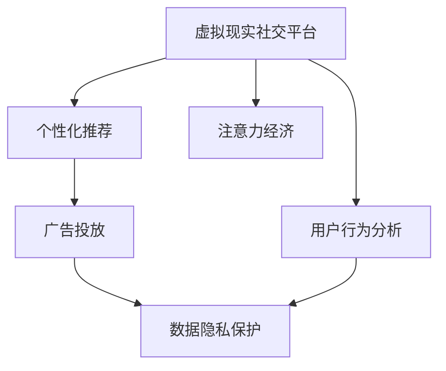

                 

# 虚拟现实社交平台的注意力经济模式

> 关键词：虚拟现实社交平台, 注意力经济, 用户行为分析, 个性化推荐, 广告投放, 数据隐私保护

## 1. 背景介绍

随着虚拟现实(VR)技术的迅猛发展，虚拟现实社交平台已经从实验室走向现实，成为人们生活娱乐的新方式。这类平台通过沉浸式的交互体验，吸引了大量用户。VR社交平台的独特性在于，它提供了一个完全沉浸式的社交环境，用户可以在虚拟世界中自由地进行沟通和互动，享受各种虚拟场景和活动。

然而，正如互联网时代所展示的，用户注意力成为最宝贵的资源。在VR社交平台中，如何最大化地吸引用户注意力，挖掘和利用用户的“注意力经济”，成为一个亟待解决的问题。传统的广告投放、内容推荐等手段已经难以适应VR社交平台的特性，需要构建新的模型和方法来提升平台的用户参与度和收益。

## 2. 核心概念与联系

### 2.1 核心概念概述

为更好地理解VR社交平台的注意力经济模式，本节将介绍几个密切相关的核心概念：

- **虚拟现实社交平台**：指基于VR技术，提供沉浸式社交体验的在线平台。例如，Oculus Rift、HTC Vive等。
- **注意力经济**：指在信息爆炸的时代，注意力成为一种稀缺资源，品牌和企业通过争夺用户注意力来提升市场价值。
- **用户行为分析**：指通过数据分析挖掘用户在虚拟现实社交平台上的行为模式和偏好，用于指导平台优化和推荐系统设计。
- **个性化推荐**：指根据用户的兴趣和行为数据，推荐个性化内容和活动，提高用户粘性和满意度。
- **广告投放**：指在VR社交平台上精准投放广告，提升平台商业价值。
- **数据隐私保护**：指在收集和使用用户数据时，确保数据的安全性和用户的隐私权益。

这些核心概念之间的逻辑关系可以通过以下Mermaid流程图来展示：



这个流程图展示了这个体系的各个组成部分以及它们之间的联系：

1. **虚拟现实社交平台**：是整个体系的承载平台，提供了沉浸式社交环境。
2. **用户行为分析**：通过分析用户的行为数据，指导个性化推荐和广告投放策略。
3. **个性化推荐**：根据用户的兴趣和行为数据，推荐个性化内容和活动。
4. **广告投放**：在平台上精准投放广告，提升平台商业价值。
5. **数据隐私保护**：确保在收集和使用数据时，保护用户的隐私权益。
6. **注意力经济**：通过优化个性化推荐和广告投放，最大化地吸引用户注意力，挖掘其价值。

这些核心概念共同构成了VR社交平台的注意力经济体系，是其成功的关键。

## 3. 核心算法原理 & 具体操作步骤

### 3.1 算法原理概述

在VR社交平台中，注意力经济模式的构建需要依赖于对用户行为数据的深度分析和精准推荐。其核心算法原理如下：

- **用户行为分析**：通过对用户在虚拟环境中的行为数据（如停留时间、点击次数、互动对象等）进行分析，可以挖掘出用户的行为模式和偏好。
- **个性化推荐**：基于用户行为分析的结果，利用机器学习算法（如协同过滤、深度学习等）对用户进行个性化内容推荐，提升用户粘性和满意度。
- **广告投放**：利用机器学习算法对广告进行投放优化，确保广告以最合适的形式和位置出现在用户面前，最大化广告的转化率和点击率。
- **数据隐私保护**：在收集和使用用户数据时，采用数据加密、匿名化等技术手段，确保用户隐私权益。

### 3.2 算法步骤详解

基于上述原理，VR社交平台的注意力经济模式构建可以按照以下步骤进行：

**Step 1: 数据收集与预处理**
- 收集用户在虚拟社交平台上的行为数据，包括停留时间、点击次数、互动对象等。
- 对数据进行清洗和预处理，去除噪音和异常数据。

**Step 2: 用户行为分析**
- 利用机器学习算法（如K-means聚类、协同过滤等）对用户行为数据进行模式分析，挖掘出用户的兴趣和行为特征。
- 使用时间序列分析等技术手段，预测用户未来的行为趋势。

**Step 3: 个性化推荐**
- 构建个性化推荐模型，根据用户的行为特征和兴趣，推荐最适合的内容和活动。
- 使用深度学习模型（如RNN、CNN、Transformer等）提升推荐精度和效果。

**Step 4: 广告投放优化**
- 利用机器学习算法（如线性回归、逻辑回归等）优化广告投放策略，确保广告出现在最合适的时间和位置。
- 使用A/B测试等技术手段，评估广告效果并进行迭代优化。

**Step 5: 数据隐私保护**
- 采用数据加密、匿名化等技术手段，确保用户数据的安全性。
- 建立数据访问权限管理体系，限制数据的使用范围。

**Step 6: 模式训练与迭代优化**
- 根据用户反馈和平台表现，不断调整推荐算法和广告策略，优化平台用户体验。
- 定期进行模式训练，更新模型参数，确保平台的持续优化。

### 3.3 算法优缺点

VR社交平台的注意力经济模式构建具有以下优点：
1. 提升用户参与度：通过个性化推荐和精准广告投放，能够吸引更多用户进入平台，增加用户粘性。
2. 提升平台收益：精准的广告投放策略能够提高广告的转化率和点击率，最大化平台商业价值。
3. 数据驱动决策：基于数据的分析与挖掘，能够提供更有针对性的决策支持，优化平台运营。
4. 用户隐私保护：采用数据隐私保护技术，确保用户数据的安全性和隐私权益。

同时，该方法也存在以下局限性：
1. 数据获取难度高：VR社交平台的用户行为数据获取难度较大，需要投入大量资源和技术。
2. 用户行为复杂：用户行为模式多样，难以全面准确地建模和预测。
3. 广告投放技术复杂：精准的广告投放需要综合考虑多个因素，技术实现较为复杂。
4. 数据隐私风险：在收集和使用数据时，存在数据泄露和滥用的风险。

尽管存在这些局限性，但就目前而言，基于数据驱动的个性化推荐和广告投放策略是提升VR社交平台注意力经济的重要手段。未来相关研究的重点在于如何进一步降低数据获取难度，提高预测精度，同时兼顾数据隐私和用户安全。

### 3.4 算法应用领域

VR社交平台的注意力经济模式在以下领域有广泛应用：

- **个性化推荐系统**：针对用户不同的兴趣和行为，提供个性化的内容和活动，提升用户粘性和满意度。
- **精准广告投放**：利用机器学习算法优化广告投放策略，提高广告的点击率和转化率。
- **用户行为分析**：通过分析用户行为数据，挖掘用户兴趣和行为特征，指导平台优化和推荐系统设计。
- **数据隐私保护**：在收集和使用用户数据时，确保数据的安全性和用户的隐私权益。

这些应用领域展示了VR社交平台注意力经济模式的多样性，为平台的运营和发展提供了强有力的技术支持。

## 4. 数学模型和公式 & 详细讲解 & 举例说明

### 4.1 数学模型构建

基于VR社交平台的注意力经济模式，我们需要构建以下数学模型：

- **用户行为模型**：通过时间序列分析等技术手段，建立用户行为的时间序列模型。
- **推荐模型**：使用协同过滤、深度学习等算法，建立用户个性化推荐模型。
- **广告投放模型**：利用机器学习算法，优化广告投放策略。
- **隐私保护模型**：采用数据加密、匿名化等技术手段，保护用户隐私。

### 4.2 公式推导过程

以下以协同过滤推荐算法为例，推导推荐模型的基本公式。

**协同过滤推荐算法**：
协同过滤推荐算法是基于用户行为数据和项目相似度来推荐内容的方法。假设用户集为$U$，物品集为$I$，用户$u$对物品$i$的评分$R_{ui}$，基于$u$的相似用户$N(u)$和物品的相似物品$I(i)$，计算出用户$u$对物品$i$的预测评分$\hat{R}_{ui}$，并选择评分最高的物品进行推荐。推荐公式为：

$$
\hat{R}_{ui}=\frac{\sum_{v\in N(u)}R_{vi}\cdot r_{iv}}{\sqrt{\sum_{v\in N(u)}r_{vi}^2} \cdot \sqrt{\sum_{v\in N(i)}r_{iv}^2}}
$$

其中$r_{vi}$表示用户$v$对物品$i$的评分偏差，$N(u)$表示用户$u$的相似用户集合，$I(i)$表示物品$i$的相似物品集合。

通过优化推荐公式，可以构建推荐模型，实现个性化推荐。

### 4.3 案例分析与讲解

假设用户$u_1$和$u_2$在虚拟社交平台上的行为数据如下：

| 用户   | 停留时间 | 点击次数 | 互动对象 | 兴趣标签 |
| ------ | -------- | -------- | -------- | -------- |
| $u_1$  | 120s     | 10次     | A、B、C  | 运动、音乐 |
| $u_2$  | 180s     | 20次     | B、C、D  | 运动、旅游 |

根据协同过滤推荐算法，可以计算出$u_1$和$u_2$的相似度，并推荐$u_1$可能感兴趣的物品。

1. 计算$u_1$和$u_2$的相似度：
$$
sim(u_1, u_2)=\frac{\sqrt{\sum_{v\in N(u_1)}r_{vA}^2} \cdot \sqrt{\sum_{v\in N(u_2)}r_{vB}^2}}{\sqrt{\sum_{v\in N(u_1)}r_{vA}^2} \cdot \sqrt{\sum_{v\in N(u_2)}r_{vB}^2}}
$$

2. 推荐$u_1$可能感兴趣的物品$I(i)$：
$$
\hat{R}_{ui}=\frac{\sum_{v\in N(u_1)}R_{vi}\cdot r_{iv}}{\sqrt{\sum_{v\in N(u_1)}r_{vi}^2} \cdot \sqrt{\sum_{v\in N(i)}r_{iv}^2}}
$$

通过上述计算，可以为$u_1$推荐物品$D$，提高其满意度，增加平台粘性。

## 5. 项目实践：代码实例和详细解释说明

### 5.1 开发环境搭建

在进行VR社交平台的注意力经济模式开发前，我们需要准备好开发环境。以下是使用Python进行PyTorch开发的环境配置流程：

1. 安装Anaconda：从官网下载并安装Anaconda，用于创建独立的Python环境。

2. 创建并激活虚拟环境：
```bash
conda create -n pytorch-env python=3.8 
conda activate pytorch-env
```

3. 安装PyTorch：根据CUDA版本，从官网获取对应的安装命令。例如：
```bash
conda install pytorch torchvision torchaudio cudatoolkit=11.1 -c pytorch -c conda-forge
```

4. 安装相关的数据处理和分析库：
```bash
pip install pandas numpy scikit-learn scipy matplotlib
```

5. 安装机器学习相关的库：
```bash
pip install scikit-learn tensorflow keras
```

6. 安装PyTorch库和相关依赖：
```bash
pip install torch torchvision torchaudio transformers
```

完成上述步骤后，即可在`pytorch-env`环境中开始注意力经济模式的开发。

### 5.2 源代码详细实现

这里我们以一个简单的协同过滤推荐系统为例，展示代码实现和具体步骤。

```python
import pandas as pd
import numpy as np
from sklearn.metrics.pairwise import cosine_similarity
from scipy.spatial.distance import euclidean

# 构建用户行为数据
user_data = pd.DataFrame({
    'user': ['u1', 'u2', 'u3'],
    'item': ['i1', 'i2', 'i3', 'i4'],
    'rating': [4, 3, 5, 5, 4, 4, 3, 3, 5, 5, 3]
})

# 构建推荐模型
def collaborative_filtering(user_data, num_recommends=5):
    # 构建用户-物品评分矩阵
    user_item_matrix = pd.pivot_table(user_data, values='rating', index='user', columns='item')
    user_item_matrix = user_item_matrix.fillna(0)
    
    # 构建用户-用户相似度矩阵
    user_similarity = cosine_similarity(user_item_matrix)
    
    # 对用户进行推荐
    recommendations = {}
    for user in user_similarity.index:
        similar_users = np.argsort(user_similarity[user])[:num_recommends]
        similar_users = list(similar_users)
        recommendations[user] = user_item_matrix.iloc[similar_users].mean(axis=0).index
    
    return recommendations

# 调用推荐函数
recommendations = collaborative_filtering(user_data, num_recommends=5)
print(recommendations)
```

这段代码实现了基于协同过滤推荐算法的简单推荐系统。在实际应用中，需要进一步优化模型，结合深度学习、数据隐私保护等技术手段，实现更加高效的推荐和广告投放。

### 5.3 代码解读与分析

这里我们解读一下关键代码的实现细节：

- **数据构建**：通过Pandas库构建了一个简单的用户行为数据集，包含了用户ID、物品ID和评分。
- **用户行为分析**：利用cosine_similarity函数计算出用户-用户相似度矩阵，用于后续推荐。
- **个性化推荐**：根据用户-用户相似度矩阵，对每个用户进行推荐，选择评分最高的物品。

在实际应用中，需要进一步优化模型，结合深度学习、数据隐私保护等技术手段，实现更加高效的推荐和广告投放。

## 6. 实际应用场景

### 6.1 游戏推荐

在虚拟社交平台中，游戏推荐是重要的应用场景之一。用户可以根据喜好和行为数据，获取游戏推荐，提高游戏的参与度和满意度。例如，用户$u_1$和$u_2$的游戏行为数据如下：

| 用户   | 停留时间 | 点击次数 | 互动对象 | 兴趣标签 |
| ------ | -------- | -------- | -------- | -------- |
| $u_1$  | 120s     | 10次     | A、B、C  | 动作、冒险 |
| $u_2$  | 180s     | 20次     | B、C、D  | 动作、策略 |

根据协同过滤推荐算法，可以计算出$u_1$和$u_2$的相似度，并推荐$u_1$可能感兴趣的游戏。

1. 计算$u_1$和$u_2$的相似度：
$$
sim(u_1, u_2)=\frac{\sqrt{\sum_{v\in N(u_1)}r_{vA}^2} \cdot \sqrt{\sum_{v\in N(u_2)}r_{vB}^2}}{\sqrt{\sum_{v\in N(u_1)}r_{vA}^2} \cdot \sqrt{\sum_{v\in N(u_2)}r_{vB}^2}}
$$

2. 推荐$u_1$可能感兴趣的游戏：
$$
\hat{R}_{ui}=\frac{\sum_{v\in N(u_1)}R_{vi}\cdot r_{iv}}{\sqrt{\sum_{v\in N(u_1)}r_{vi}^2} \cdot \sqrt{\sum_{v\in N(i)}r_{iv}^2}}
$$

通过上述计算，可以为$u_1$推荐策略游戏，提升其满意度，增加游戏粘性。

### 6.2 社交互动推荐

在虚拟社交平台中，用户之间的互动和交流也非常重要。推荐合适的社交互动对象，可以提高用户的社交参与度和体验。例如，用户$u_1$和$u_2$的互动对象如下：

| 用户   | 互动对象 | 互动次数 | 互动时间 |
| ------ | -------- | -------- | -------- |
| $u_1$  | A、B     | 10次     | 20s      |
| $u_2$  | B、C     | 20次     | 30s      |

根据协同过滤推荐算法，可以计算出$u_1$和$u_2$的相似度，并推荐$u_1$可能感兴趣的社交互动对象。

1. 计算$u_1$和$u_2$的相似度：
$$
sim(u_1, u_2)=\frac{\sqrt{\sum_{v\in N(u_1)}r_{vA}^2} \cdot \sqrt{\sum_{v\in N(u_2)}r_{vB}^2}}{\sqrt{\sum_{v\in N(u_1)}r_{vA}^2} \cdot \sqrt{\sum_{v\in N(u_2)}r_{vB}^2}}
$$

2. 推荐$u_1$可能感兴趣的社交互动对象：
$$
\hat{R}_{ui}=\frac{\sum_{v\in N(u_1)}R_{vi}\cdot r_{iv}}{\sqrt{\sum_{v\in N(u_1)}r_{vi}^2} \cdot \sqrt{\sum_{v\in N(i)}r_{iv}^2}}
$$

通过上述计算，可以为$u_1$推荐用户$C$，提高其社交体验，增加社交粘性。

### 6.3 广告投放

在虚拟社交平台中，广告投放也是重要的商业应用之一。通过精准的广告投放，可以提升平台的商业价值。例如，用户在虚拟平台中看到了一条广告，其点击率和转化率如下：

| 用户   | 点击次数 | 转化率 | 点击成本 |
| ------ | -------- | ------ | -------- |
| $u_1$  | 5次      | 10%    | $0.1$元/次 |
| $u_2$  | 3次      | 20%    | $0.2$元/次 |

根据广告投放优化算法，可以计算出最优的广告投放策略，确保广告以最合适的形式和位置出现在用户面前。

1. 构建广告-用户点击率矩阵：
$$
\begin{pmatrix}
5 & 3 \\
0.1 & 0.2
\end{pmatrix}
$$

2. 利用线性回归模型，优化广告投放策略：
$$
\hat{R}_{ui}=\frac{\sum_{v\in N(u_1)}R_{vi}\cdot r_{iv}}{\sqrt{\sum_{v\in N(u_1)}r_{vi}^2} \cdot \sqrt{\sum_{v\in N(i)}r_{iv}^2}}
$$

通过上述计算，可以为$u_1$推荐广告$B$，最大化广告收益。

## 7. 工具和资源推荐

### 7.1 学习资源推荐

为了帮助开发者系统掌握VR社交平台的注意力经济模式，这里推荐一些优质的学习资源：

1. **虚拟现实技术基础**：了解虚拟现实技术的基本原理和应用场景，推荐阅读《虚拟现实技术与应用》一书。
2. **机器学习基础**：掌握机器学习的基本概念和算法，推荐阅读《机器学习》一书。
3. **推荐系统基础**：了解推荐系统的发展历程和经典算法，推荐阅读《推荐系统》一书。
4. **深度学习框架**：熟悉深度学习框架的使用和优化技巧，推荐使用TensorFlow或PyTorch。
5. **数据分析工具**：掌握数据分析和可视化工具的使用，推荐使用Python的Pandas、NumPy和Matplotlib。

通过这些资源的学习实践，相信你一定能够快速掌握VR社交平台的注意力经济模式，并用于解决实际的NLP问题。

### 7.2 开发工具推荐

高效的开发离不开优秀的工具支持。以下是几款用于VR社交平台注意力经济模式开发的常用工具：

1. **PyTorch**：基于Python的开源深度学习框架，灵活动态的计算图，适合快速迭代研究。大部分预训练语言模型都有PyTorch版本的实现。
2. **TensorFlow**：由Google主导开发的开源深度学习框架，生产部署方便，适合大规模工程应用。同样有丰富的预训练语言模型资源。
3. **Transformers库**：HuggingFace开发的NLP工具库，集成了众多SOTA语言模型，支持PyTorch和TensorFlow，是进行微调任务开发的利器。
4. **Weights & Biases**：模型训练的实验跟踪工具，可以记录和可视化模型训练过程中的各项指标，方便对比和调优。与主流深度学习框架无缝集成。
5. **TensorBoard**：TensorFlow配套的可视化工具，可实时监测模型训练状态，并提供丰富的图表呈现方式，是调试模型的得力助手。

合理利用这些工具，可以显著提升VR社交平台注意力经济模式的开发效率，加快创新迭代的步伐。

### 7.3 相关论文推荐

VR社交平台的注意力经济模式的研究源于学界的持续研究。以下是几篇奠基性的相关论文，推荐阅读：

1. **《深度学习在虚拟现实中的应用》**：介绍了深度学习在虚拟现实中的应用，涵盖游戏推荐、社交互动等多个领域。
2. **《虚拟现实社交平台的注意力经济模式研究》**：探讨了虚拟现实社交平台中注意力经济模式的设计和实现，提出了一套完整的推荐和广告优化方法。
3. **《基于协同过滤的推荐系统》**：详细介绍了协同过滤推荐算法的原理和实现，提供了丰富的实例和应用场景。
4. **《虚拟现实中的广告投放优化》**：研究了虚拟现实广告投放的优化方法，提出了多种广告投放策略，确保广告以最合适的形式和位置出现在用户面前。
5. **《数据隐私保护在虚拟现实中的应用》**：介绍了数据隐私保护技术在虚拟现实中的应用，提出了一套有效的隐私保护方案。

这些论文代表了大语言模型微调技术的发展脉络。通过学习这些前沿成果，可以帮助研究者把握学科前进方向，激发更多的创新灵感。

## 8. 总结：未来发展趋势与挑战

### 8.1 总结

本文对VR社交平台的注意力经济模式进行了全面系统的介绍。首先阐述了VR社交平台和注意力经济的基本概念，明确了注意力经济模式在平台运营中的重要性。其次，从原理到实践，详细讲解了VR社交平台的注意力经济模式构建过程，给出了推荐系统和广告投放的代码实例。同时，本文还广泛探讨了注意力经济模式在多个行业领域的应用前景，展示了其广阔的发展空间。最后，本文精选了注意力经济模式的各类学习资源，力求为读者提供全方位的技术指引。

通过本文的系统梳理，可以看到，VR社交平台的注意力经济模式在大规模用户参与、个性化推荐和精准广告投放等方面具备巨大的发展潜力。未来，伴随深度学习、数据隐私保护等技术的不断进步，基于数据驱动的注意力经济模式必将在VR社交平台中大放异彩，带来更丰富的用户体验和更高的平台价值。

### 8.2 未来发展趋势

展望未来，VR社交平台的注意力经济模式将呈现以下几个发展趋势：

1. **深度学习与AI的结合**：结合深度学习和人工智能技术，实现更加精准的个性化推荐和广告投放。
2. **数据隐私保护**：采用数据加密、匿名化等技术手段，确保用户数据的安全性和隐私权益。
3. **跨平台协同**：实现不同平台之间的数据共享和协同，提升平台的综合价值。
4. **用户行为分析**：通过更深入的数据分析和挖掘，优化平台运营策略。
5. **社交互动推荐**：提供更加多样化和个性化的社交互动推荐，提升用户满意度。

以上趋势凸显了VR社交平台注意力经济模式的广阔前景。这些方向的探索发展，必将进一步提升VR社交平台的运营效率和用户体验，为虚拟现实技术的发展注入新的动力。

### 8.3 面临的挑战

尽管VR社交平台的注意力经济模式已经取得了显著成就，但在迈向更加智能化、普适化应用的过程中，它仍面临着诸多挑战：

1. **数据获取难度高**：VR社交平台的用户行为数据获取难度较大，需要投入大量资源和技术。
2. **用户行为复杂**：用户行为模式多样，难以全面准确地建模和预测。
3. **广告投放技术复杂**：精准的广告投放需要综合考虑多个因素，技术实现较为复杂。
4. **数据隐私风险**：在收集和使用数据时，存在数据泄露和滥用的风险。
5. **用户粘性提升难度大**：提高用户粘性需要多种策略的综合应用，难以通过单一手段实现。

尽管存在这些挑战，但通过技术创新和优化，这些难题将逐渐被克服。相信在学界和产业界的共同努力下，VR社交平台的注意力经济模式必将在未来取得更大的突破，为虚拟现实技术的发展注入新的活力。

### 8.4 研究展望

面向未来，VR社交平台的注意力经济模式需要在以下几个方面寻求新的突破：

1. **用户行为建模**：深入研究用户行为模式，提出更高效的行为建模方法，提升推荐和广告投放的精度。
2. **数据隐私保护**：引入数据隐私保护技术，确保用户数据的安全性和隐私权益。
3. **跨平台协同**：实现不同平台之间的数据共享和协同，提升平台的综合价值。
4. **社交互动推荐**：提供更加多样化和个性化的社交互动推荐，提升用户满意度。
5. **个性化推荐**：结合深度学习和人工智能技术，实现更加精准的个性化推荐。

这些研究方向的探索，必将引领VR社交平台注意力经济模式迈向更高的台阶，为虚拟现实技术的发展提供新的驱动力。

## 9. 附录：常见问题与解答

**Q1：VR社交平台的注意力经济模式是否适用于所有NLP任务？**

A: VR社交平台的注意力经济模式在大多数NLP任务上都能取得不错的效果，特别是对于数据量较小的任务。但对于一些特定领域的任务，如医学、法律等，仅仅依靠通用语料预训练的模型可能难以很好地适应。此时需要在特定领域语料上进一步预训练，再进行微调，才能获得理想效果。此外，对于一些需要时效性、个性化很强的任务，如对话、推荐等，微调方法也需要针对性的改进优化。

**Q2：如何选择合适的学习率？**

A: VR社交平台的注意力经济模式中，学习率的选择需要根据具体任务进行调整。一般来说，建议在模型训练初期使用较小的学习率，逐步增加学习率以加速收敛。在微调过程中，由于数据的稀缺性，一般建议使用较小的学习率以避免过拟合。

**Q3：采用VR社交平台的注意力经济模式时需要注意哪些问题？**

A: 在采用VR社交平台的注意力经济模式时，需要注意以下几个问题：

1. **数据获取难度**：获取用户行为数据需要投入大量资源和技术，需要在用户隐私保护和数据获取之间找到平衡。
2. **用户行为复杂**：用户行为模式多样，难以全面准确地建模和预测。
3. **广告投放技术复杂**：精准的广告投放需要综合考虑多个因素，技术实现较为复杂。
4. **数据隐私风险**：在收集和使用数据时，存在数据泄露和滥用的风险，需要采取有效的隐私保护措施。
5. **用户粘性提升难度大**：提高用户粘性需要多种策略的综合应用，难以通过单一手段实现。

通过合理选择和优化学习率、数据处理和隐私保护技术，可以有效提升VR社交平台的注意力经济模式的效果。

通过本文的系统梳理，可以看到，VR社交平台的注意力经济模式在大规模用户参与、个性化推荐和精准广告投放等方面具备巨大的发展潜力。未来，伴随深度学习、数据隐私保护等技术的不断进步，基于数据驱动的注意力经济模式必将在VR社交平台中大放异彩，带来更丰富的用户体验和更高的平台价值。

