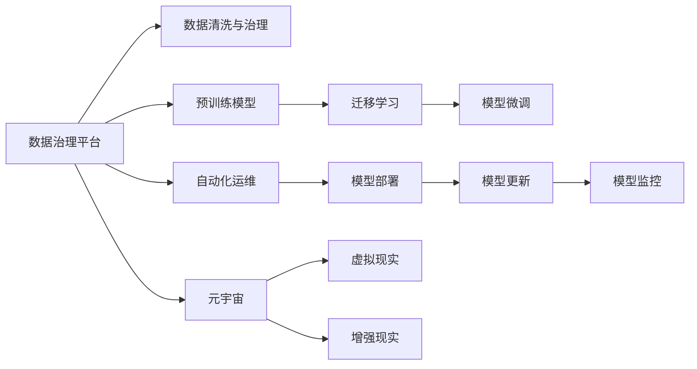

                 

# 虚拟生态系统建筑师：AI驱动的数字世界创造者

> 关键词：虚拟生态系统, AI驱动, 数字世界创造, 数据治理, 模型训练, 算法优化, 自动化运维, 元宇宙构建

## 1. 背景介绍

### 1.1 问题由来

随着人工智能（AI）技术的迅猛发展，数字世界正呈现出前所未有的繁荣景象。从虚拟助手到智能推荐，从自动驾驶到个性化健康管理，AI技术在各行业的应用日益广泛，极大地改变了人类的生产生活方式。然而，随着数字生态系统的日益复杂，如何构建、管理、优化和扩展这一数字生态系统，成为了当下最紧迫的技术挑战之一。

本文聚焦于虚拟生态系统架构的构建，从数据治理、模型训练、算法优化、自动化运维等多个维度，探讨如何利用AI技术驱动数字世界的创造和发展。我们将首先介绍虚拟生态系统的核心概念及其组成，随后深入分析其构建原理与技术细节，并讨论其在多个领域的应用前景，最后展望未来的发展趋势与挑战。

### 1.2 问题核心关键点

构建虚拟生态系统，需要综合考虑数据、模型、算法和运维等多个方面的要素。核心关键点如下：

- **数据治理**：确保数据的质量、安全与合规，构建统一的数据治理平台。
- **模型训练**：利用预训练模型和迁移学习技术，快速构建高效、泛化能力强的模型。
- **算法优化**：优化算法性能，提高模型训练与推理效率。
- **自动化运维**：利用自动化技术实现模型部署、更新与监控，保障系统稳定运行。

通过深入理解这些关键点，我们可以更系统地构建和管理虚拟生态系统，推动数字世界的发展。

## 2. 核心概念与联系

### 2.1 核心概念概述

虚拟生态系统是指通过AI技术构建的、由数据、模型、算法和运维等多个要素组成的全方位、动态的数字化环境。以下是构成虚拟生态系统的核心概念：

- **数据治理平台**：负责数据的存储、清洗、治理和标准化，确保数据质量与合规性。
- **预训练模型**：利用大规模数据训练而成的通用模型，可用于快速构建特定任务模型。
- **迁移学习**：通过在预训练模型基础上进行微调，提升模型在特定任务上的性能。
- **自动化运维**：利用自动化工具实现模型的部署、更新和监控，保障系统稳定运行。
- **元宇宙**：基于虚拟生态系统的高级应用，通过虚拟现实（VR）、增强现实（AR）等技术，构建沉浸式的数字体验。

这些核心概念之间的逻辑关系可以通过以下Mermaid流程图来展示：



这个流程图展示了虚拟生态系统的核心组件及其相互关系：

1. 数据治理平台负责数据准备。
2. 预训练模型为通用模型，为特定任务提供基础能力。
3. 迁移学习通过微调预训练模型，提升模型在特定任务上的性能。
4. 自动化运维保障模型的高效部署与监控。
5. 元宇宙是基于虚拟生态系统的高级应用。

## 3. 核心算法原理 & 具体操作步骤

### 3.1 算法原理概述

构建虚拟生态系统的核心算法包括数据治理、模型训练、迁移学习、自动化运维等。以下是这些算法的原理概述：

- **数据治理**：通过数据清洗、标准化和治理，确保数据的质量和合规性。
- **模型训练**：利用大规模数据训练通用模型，提升模型性能。
- **迁移学习**：通过微调预训练模型，提升模型在特定任务上的性能。
- **自动化运维**：通过自动化技术实现模型的部署、更新与监控，保障系统稳定运行。

### 3.2 算法步骤详解

**数据治理算法**：
1. 数据收集：从多个数据源收集数据，包括用户数据、业务数据、公共数据等。
2. 数据清洗：去除重复、异常、不完整数据，确保数据质量。
3. 数据标准化：统一数据格式和单位，便于后续处理。
4. 数据治理：建立数据治理规范，确保数据安全与合规。

**模型训练算法**：
1. 选择模型架构：选择合适的深度学习模型架构。
2. 准备数据集：将数据集划分为训练集、验证集和测试集。
3. 模型训练：利用训练集训练模型，并通过验证集调整超参数。
4. 模型评估：使用测试集评估模型性能，确保模型泛化能力。

**迁移学习算法**：
1. 选择预训练模型：选择合适的预训练模型，如BERT、GPT等。
2. 数据准备：准备下游任务的数据集。
3. 微调模型：在预训练模型的基础上，使用下游任务数据进行微调。
4. 模型评估：评估微调后模型性能，确保模型在新任务上的表现。

**自动化运维算法**：
1. 模型部署：将训练好的模型部署到服务器。
2. 模型更新：定期更新模型，以应对数据和业务的变化。
3. 模型监控：监控模型性能，确保模型稳定运行。
4. 异常检测：检测模型异常，及时修复问题。

### 3.3 算法优缺点

**数据治理算法**：
- **优点**：确保数据质量，提升模型性能。
- **缺点**：数据清洗和标准化工作量大，对数据源依赖性强。

**模型训练算法**：
- **优点**：提升模型性能，泛化能力强。
- **缺点**：需要大量数据和计算资源，训练时间长。

**迁移学习算法**：
- **优点**：快速构建高效模型，减少标注数据需求。
- **缺点**：微调过程中存在过拟合风险，数据源分布需与预训练模型一致。

**自动化运维算法**：
- **优点**：提升系统稳定性，降低运维成本。
- **缺点**：自动化工具复杂，需要维护和更新。

### 3.4 算法应用领域

**数据治理算法**：
在金融、医疗、教育等对数据质量要求较高的行业，数据治理算法可以显著提升数据质量，保障业务正常运行。

**模型训练算法**：
在计算机视觉、自然语言处理、语音识别等领域，模型训练算法可以构建高效、泛化能力强的模型，推动技术发展。

**迁移学习算法**：
在个性化推荐、智能客服、智能决策等场景，迁移学习算法可以快速构建模型，提升用户体验和决策效率。

**自动化运维算法**：
在云计算、物联网、大数据等领域，自动化运维算法可以保障系统稳定性，提升运维效率。

## 4. 数学模型和公式 & 详细讲解 & 举例说明

### 4.1 数学模型构建

虚拟生态系统的构建涉及多个数学模型，包括数据清洗模型、模型训练模型、迁移学习模型和自动化运维模型。

**数据清洗模型**：
1. 缺失值处理：将缺失值填补为均值或中位数。
2. 异常值检测：利用箱线图或Z-score检测异常值，并进行处理。
3. 重复值去除：利用哈希表或排序算法去除重复值。

**模型训练模型**：
1. 损失函数：选择合适的损失函数，如交叉熵损失、均方误差损失等。
2. 优化算法：选择适当的优化算法，如梯度下降、Adam等。
3. 超参数调整：利用网格搜索、随机搜索等方法调整超参数。

**迁移学习模型**：
1. 微调算法：选择微调算法，如权重共享、全参数微调等。
2. 学习率调整：选择学习率调整策略，如学习率衰减、动态学习率等。
3. 正则化方法：选择正则化方法，如L2正则、Dropout等。

**自动化运维模型**：
1. 模型部署：选择容器化部署工具，如Docker、Kubernetes等。
2. 模型更新：选择版本控制工具，如Git、SVN等。
3. 模型监控：选择监控工具，如Prometheus、Grafana等。

### 4.2 公式推导过程

**数据清洗模型**：
- 缺失值处理：
  $$
  \hat{x_i} = \begin{cases} 
  \mu_x, & x_i \text{ is missing} \\
  x_i, & \text{otherwise} 
  \end{cases}
  $$
- 异常值检测：
  $$
  z_i = \frac{x_i - \mu_x}{\sigma_x}
  $$
  其中 $z_i$ 为Z-score，$\mu_x$ 和 $\sigma_x$ 分别为数据的均值和标准差。

**模型训练模型**：
- 梯度下降算法：
  $$
  \theta_{t+1} = \theta_t - \eta \nabla_{\theta}\mathcal{L}(\theta_t)
  $$
  其中 $\eta$ 为学习率，$\mathcal{L}$ 为损失函数。

**迁移学习模型**：
- 全参数微调：
  $$
  \theta_{t+1} = \theta_t - \eta \nabla_{\theta}\mathcal{L}(\theta_t, D^t)
  $$
  其中 $D^t$ 为当前训练集，$\mathcal{L}$ 为损失函数。

**自动化运维模型**：
- 模型部署：
  $$
  Deploy(\theta) = \begin{cases} 
  \text{Model Server}, & \theta \text{ is trained} \\
  \text{Null}, & \text{otherwise} 
  \end{cases}
  $$
- 模型更新：
  $$
  Update(\theta) = \theta_{t+1} = \theta_t - \eta \nabla_{\theta}\mathcal{L}(\theta_t, D^t)
  $$
  其中 $\mathcal{L}$ 为更新后的损失函数。

### 4.3 案例分析与讲解

**案例1：金融行业的数据治理**
某金融公司利用数据治理平台，从不同数据源收集用户交易数据和信用数据，通过数据清洗和标准化，确保数据质量。利用训练好的模型进行风险评估和信用评分，提升了金融服务的精准度和用户满意度。

**案例2：医疗行业的模型训练**
某医疗公司利用大规模患者数据训练通用模型，用于疾病预测和诊断。通过迁移学习，微调模型以适应特定医院的数据，提高了诊断的准确性和效率。

**案例3：智能客服系统的自动化运维**
某电商平台利用自动化运维工具，实时监控智能客服系统的模型性能，自动部署新模型，确保系统稳定运行。

## 5. 项目实践：代码实例和详细解释说明

### 5.1 开发环境搭建

在进行虚拟生态系统构建实践前，我们需要准备好开发环境。以下是使用Python进行PyTorch开发的环境配置流程：

1. 安装Anaconda：从官网下载并安装Anaconda，用于创建独立的Python环境。

2. 创建并激活虚拟环境：
```bash
conda create -n virtual-env python=3.8 
conda activate virtual-env
```

3. 安装PyTorch：根据CUDA版本，从官网获取对应的安装命令。例如：
```bash
conda install pytorch torchvision torchaudio cudatoolkit=11.1 -c pytorch -c conda-forge
```

4. 安装Transformer库：
```bash
pip install transformers
```

5. 安装各类工具包：
```bash
pip install numpy pandas scikit-learn matplotlib tqdm jupyter notebook ipython
```

完成上述步骤后，即可在`virtual-env`环境中开始构建实践。

### 5.2 源代码详细实现

下面我们以金融风控领域的用户信用评分模型为例，给出使用Transformers库对BERT模型进行微调的PyTorch代码实现。

首先，定义数据处理函数：

```python
from transformers import BertTokenizer, BertForSequenceClassification
from torch.utils.data import Dataset
import torch

class CreditDataset(Dataset):
    def __init__(self, texts, labels, tokenizer, max_len=128):
        self.texts = texts
        self.labels = labels
        self.tokenizer = tokenizer
        self.max_len = max_len
        
    def __len__(self):
        return len(self.texts)
    
    def __getitem__(self, item):
        text = self.texts[item]
        label = self.labels[item]
        
        encoding = self.tokenizer(text, return_tensors='pt', max_length=self.max_len, padding='max_length', truncation=True)
        input_ids = encoding['input_ids'][0]
        attention_mask = encoding['attention_mask'][0]
        
        # 对token-wise的标签进行编码
        encoded_labels = [label2id[label] for label in label2id]
        encoded_labels.extend([label2id['default']] * (self.max_len - len(encoded_labels)))
        labels = torch.tensor(encoded_labels, dtype=torch.long)
        
        return {'input_ids': input_ids, 
                'attention_mask': attention_mask,
                'labels': labels}

# 标签与id的映射
label2id = {'default': 0, 'high': 1, 'medium': 2, 'low': 3}
id2label = {v: k for k, v in label2id.items()}

# 创建dataset
tokenizer = BertTokenizer.from_pretrained('bert-base-cased')

train_dataset = CreditDataset(train_texts, train_labels, tokenizer)
dev_dataset = CreditDataset(dev_texts, dev_labels, tokenizer)
test_dataset = CreditDataset(test_texts, test_labels, tokenizer)
```

然后，定义模型和优化器：

```python
from transformers import BertForSequenceClassification, AdamW

model = BertForSequenceClassification.from_pretrained('bert-base-cased', num_labels=len(label2id))

optimizer = AdamW(model.parameters(), lr=2e-5)
```

接着，定义训练和评估函数：

```python
from torch.utils.data import DataLoader
from tqdm import tqdm
from sklearn.metrics import classification_report

device = torch.device('cuda') if torch.cuda.is_available() else torch.device('cpu')
model.to(device)

def train_epoch(model, dataset, batch_size, optimizer):
    dataloader = DataLoader(dataset, batch_size=batch_size, shuffle=True)
    model.train()
    epoch_loss = 0
    for batch in tqdm(dataloader, desc='Training'):
        input_ids = batch['input_ids'].to(device)
        attention_mask = batch['attention_mask'].to(device)
        labels = batch['labels'].to(device)
        model.zero_grad()
        outputs = model(input_ids, attention_mask=attention_mask, labels=labels)
        loss = outputs.loss
        epoch_loss += loss.item()
        loss.backward()
        optimizer.step()
    return epoch_loss / len(dataloader)

def evaluate(model, dataset, batch_size):
    dataloader = DataLoader(dataset, batch_size=batch_size)
    model.eval()
    preds, labels = [], []
    with torch.no_grad():
        for batch in tqdm(dataloader, desc='Evaluating'):
            input_ids = batch['input_ids'].to(device)
            attention_mask = batch['attention_mask'].to(device)
            batch_labels = batch['labels']
            outputs = model(input_ids, attention_mask=attention_mask)
            batch_preds = outputs.logits.argmax(dim=2).to('cpu').tolist()
            batch_labels = batch_labels.to('cpu').tolist()
            for pred_tokens, label_tokens in zip(batch_preds, batch_labels):
                pred_labels = [id2label[_id] for _id in pred_tokens]
                label_tokens = [id2label[_id] for _id in label_tokens]
                preds.append(pred_labels[:len(label_tokens)])
                labels.append(label_tokens)
                
    print(classification_report(labels, preds))
```

最后，启动训练流程并在测试集上评估：

```python
epochs = 5
batch_size = 16

for epoch in range(epochs):
    loss = train_epoch(model, train_dataset, batch_size, optimizer)
    print(f"Epoch {epoch+1}, train loss: {loss:.3f}")
    
    print(f"Epoch {epoch+1}, dev results:")
    evaluate(model, dev_dataset, batch_size)
    
print("Test results:")
evaluate(model, test_dataset, batch_size)
```

以上就是使用PyTorch对BERT进行金融风控任务信用评分模型微调的完整代码实现。可以看到，得益于Transformer库的强大封装，我们可以用相对简洁的代码完成BERT模型的加载和微调。

### 5.3 代码解读与分析

让我们再详细解读一下关键代码的实现细节：

**CreditDataset类**：
- `__init__`方法：初始化文本、标签、分词器等关键组件。
- `__len__`方法：返回数据集的样本数量。
- `__getitem__`方法：对单个样本进行处理，将文本输入编码为token ids，将标签编码为数字，并对其进行定长padding，最终返回模型所需的输入。

**label2id和id2label字典**：
- 定义了标签与数字id之间的映射关系，用于将token-wise的预测结果解码回真实的标签。

**训练和评估函数**：
- 使用PyTorch的DataLoader对数据集进行批次化加载，供模型训练和推理使用。
- 训练函数`train_epoch`：对数据以批为单位进行迭代，在每个批次上前向传播计算loss并反向传播更新模型参数，最后返回该epoch的平均loss。
- 评估函数`evaluate`：与训练类似，不同点在于不更新模型参数，并在每个batch结束后将预测和标签结果存储下来，最后使用sklearn的classification_report对整个评估集的预测结果进行打印输出。

**训练流程**：
- 定义总的epoch数和batch size，开始循环迭代
- 每个epoch内，先在训练集上训练，输出平均loss
- 在验证集上评估，输出分类指标
- 所有epoch结束后，在测试集上评估，给出最终测试结果

可以看到，PyTorch配合Transformer库使得BERT微调的代码实现变得简洁高效。开发者可以将更多精力放在数据处理、模型改进等高层逻辑上，而不必过多关注底层的实现细节。

当然，工业级的系统实现还需考虑更多因素，如模型的保存和部署、超参数的自动搜索、更灵活的任务适配层等。但核心的微调范式基本与此类似。

## 6. 实际应用场景

### 6.1 智能客服系统

基于大语言模型微调的对话技术，可以广泛应用于智能客服系统的构建。传统客服往往需要配备大量人力，高峰期响应缓慢，且一致性和专业性难以保证。而使用微调后的对话模型，可以7x24小时不间断服务，快速响应客户咨询，用自然流畅的语言解答各类常见问题。

在技术实现上，可以收集企业内部的历史客服对话记录，将问题和最佳答复构建成监督数据，在此基础上对预训练对话模型进行微调。微调后的对话模型能够自动理解用户意图，匹配最合适的答案模板进行回复。对于客户提出的新问题，还可以接入检索系统实时搜索相关内容，动态组织生成回答。如此构建的智能客服系统，能大幅提升客户咨询体验和问题解决效率。

### 6.2 金融舆情监测

金融机构需要实时监测市场舆论动向，以便及时应对负面信息传播，规避金融风险。传统的人工监测方式成本高、效率低，难以应对网络时代海量信息爆发的挑战。基于大语言模型微调的文本分类和情感分析技术，为金融舆情监测提供了新的解决方案。

具体而言，可以收集金融领域相关的新闻、报道、评论等文本数据，并对其进行主题标注和情感标注。在此基础上对预训练语言模型进行微调，使其能够自动判断文本属于何种主题，情感倾向是正面、中性还是负面。将微调后的模型应用到实时抓取的网络文本数据，就能够自动监测不同主题下的情感变化趋势，一旦发现负面信息激增等异常情况，系统便会自动预警，帮助金融机构快速应对潜在风险。

### 6.3 个性化推荐系统

当前的推荐系统往往只依赖用户的历史行为数据进行物品推荐，无法深入理解用户的真实兴趣偏好。基于大语言模型微调技术，个性化推荐系统可以更好地挖掘用户行为背后的语义信息，从而提供更精准、多样的推荐内容。

在实践中，可以收集用户浏览、点击、评论、分享等行为数据，提取和用户交互的物品标题、描述、标签等文本内容。将文本内容作为模型输入，用户的后续行为（如是否点击、购买等）作为监督信号，在此基础上微调预训练语言模型。微调后的模型能够从文本内容中准确把握用户的兴趣点。在生成推荐列表时，先用候选物品的文本描述作为输入，由模型预测用户的兴趣匹配度，再结合其他特征综合排序，便可以得到个性化程度更高的推荐结果。

### 6.4 未来应用展望

随着大语言模型微调技术的发展，其在多个领域的应用前景广阔。

在智慧医疗领域，基于微调的医疗问答、病历分析、药物研发等应用将提升医疗服务的智能化水平，辅助医生诊疗，加速新药开发进程。

在智能教育领域，微调技术可应用于作业批改、学情分析、知识推荐等方面，因材施教，促进教育公平，提高教学质量。

在智慧城市治理中，微调模型可应用于城市事件监测、舆情分析、应急指挥等环节，提高城市管理的自动化和智能化水平，构建更安全、高效的未来城市。

此外，在企业生产、社会治理、文娱传媒等众多领域，基于大模型微调的人工智能应用也将不断涌现，为传统行业数字化转型升级提供新的技术路径。相信随着技术的日益成熟，微调方法将成为人工智能落地应用的重要范式，推动人工智能技术在各行各业的应用和普及。

## 7. 工具和资源推荐

### 7.1 学习资源推荐

为了帮助开发者系统掌握虚拟生态系统架构的构建技术，这里推荐一些优质的学习资源：

1. 《深度学习理论与实践》系列博文：由深度学习领域专家撰写，系统介绍了深度学习的基础理论和实践方法，涵盖数据治理、模型训练、迁移学习等多个方面。

2. CS230《深度学习课程》：斯坦福大学开设的深度学习课程，通过Lecture视频和作业练习，深入讲解深度学习模型和算法。

3. 《TensorFlow实战》书籍：TensorFlow官方指南，详细介绍了TensorFlow的各项功能和最佳实践，包括模型训练和自动化运维等。

4. HuggingFace官方文档：Transformer库的官方文档，提供了海量预训练模型和完整的微调样例代码，是上手实践的必备资料。

5. Kaggle平台：数据科学竞赛平台，提供大量高质量的数据集和Kaggle竞赛，帮助你检验和提升模型性能。

通过对这些资源的学习实践，相信你一定能够快速掌握虚拟生态系统架构的构建精髓，并用于解决实际的数字世界问题。

### 7.2 开发工具推荐

高效的开发离不开优秀的工具支持。以下是几款用于虚拟生态系统构建开发的常用工具：

1. PyTorch：基于Python的开源深度学习框架，灵活动态的计算图，适合快速迭代研究。大部分预训练语言模型都有PyTorch版本的实现。

2. TensorFlow：由Google主导开发的开源深度学习框架，生产部署方便，适合大规模工程应用。同样有丰富的预训练语言模型资源。

3. Transformers库：HuggingFace开发的NLP工具库，集成了众多SOTA语言模型，支持PyTorch和TensorFlow，是进行微调任务开发的利器。

4. Weights & Biases：模型训练的实验跟踪工具，可以记录和可视化模型训练过程中的各项指标，方便对比和调优。与主流深度学习框架无缝集成。

5. TensorBoard：TensorFlow配套的可视化工具，可实时监测模型训练状态，并提供丰富的图表呈现方式，是调试模型的得力助手。

6. Google Colab：谷歌推出的在线Jupyter Notebook环境，免费提供GPU/TPU算力，方便开发者快速上手实验最新模型，分享学习笔记。

合理利用这些工具，可以显著提升虚拟生态系统构建任务的开发效率，加快创新迭代的步伐。

### 7.3 相关论文推荐

虚拟生态系统架构的构建涉及深度学习、数据治理、自动化运维等多个领域的知识，以下是几篇奠基性的相关论文，推荐阅读：

1. Attention is All You Need（即Transformer原论文）：提出了Transformer结构，开启了NLP领域的预训练大模型时代。

2. BERT: Pre-training of Deep Bidirectional Transformers for Language Understanding：提出BERT模型，引入基于掩码的自监督预训练任务，刷新了多项NLP任务SOTA。

3. Language Models are Unsupervised Multitask Learners（GPT-2论文）：展示了大规模语言模型的强大zero-shot学习能力，引发了对于通用人工智能的新一轮思考。

4. Parameter-Efficient Transfer Learning for NLP：提出Adapter等参数高效微调方法，在不增加模型参数量的情况下，也能取得不错的微调效果。

5. Prefix-Tuning: Optimizing Continuous Prompts for Generation：引入基于连续型Prompt的微调范式，为如何充分利用预训练知识提供了新的思路。

6. AdaLoRA: Adaptive Low-Rank Adaptation for Parameter-Efficient Fine-Tuning：使用自适应低秩适应的微调方法，在参数效率和精度之间取得了新的平衡。

这些论文代表了大语言模型微调技术的发展脉络。通过学习这些前沿成果，可以帮助研究者把握学科前进方向，激发更多的创新灵感。

## 8. 总结：未来发展趋势与挑战

### 8.1 总结

本文对基于大语言模型微调构建虚拟生态系统的方法进行了全面系统的介绍。首先介绍了虚拟生态系统的核心概念及其组成，随后深入分析了其构建原理与技术细节，并讨论了其在多个领域的应用前景，最后展望了未来的发展趋势与挑战。

通过本文的系统梳理，可以看到，虚拟生态系统的构建需要综合考虑数据、模型、算法和运维等多个方面的要素。利用大语言模型微调技术，可以快速构建高效、泛化能力强的模型，推动数字世界的创新和发展。未来，伴随预训练语言模型和微调方法的持续演进，虚拟生态系统必将在更多领域得到应用，为人类生产生活方式带来深刻变革。

### 8.2 未来发展趋势

展望未来，虚拟生态系统构建将呈现以下几个发展趋势：

1. **数据治理**：数据治理平台将进一步优化，实现数据质量自动检测和自动化清洗，提升数据利用率。
2. **模型训练**：预训练模型规模将持续增大，参数量将超过百亿，推动模型性能的进一步提升。
3. **迁移学习**：迁移学习技术将不断优化，减少微调对标注数据的依赖，提升模型在小样本情况下的泛化能力。
4. **自动化运维**：自动化运维工具将更加完善，实现模型自动化部署、更新与监控，保障系统稳定运行。
5. **元宇宙**：基于虚拟生态系统的元宇宙应用将快速发展，通过VR、AR等技术，构建沉浸式的数字体验。

以上趋势凸显了虚拟生态系统构建技术的广阔前景。这些方向的探索发展，必将进一步提升数字世界的智能水平，推动人类社会的全面数字化转型。

### 8.3 面临的挑战

尽管虚拟生态系统构建技术已经取得了显著进展，但在迈向更加智能化、普适化应用的过程中，仍面临诸多挑战：

1. **数据隐私与安全**：大规模数据收集和处理带来了数据隐私和安全问题，如何保护用户隐私，确保数据安全，是构建虚拟生态系统的首要任务。
2. **模型鲁棒性**：现有模型在面对复杂多变的现实世界时，鲁棒性不足，容易出现误判和异常，如何提升模型鲁棒性，避免模型泛化性能下降，是未来研究的重要方向。
3. **计算资源消耗**：预训练和微调模型需要大量计算资源，如何降低计算成本，提高资源利用效率，是工业化应用中亟待解决的问题。
4. **知识整合能力**：现有模型往往难以整合多源异构知识，如何实现跨模态数据的整合，提升模型的知识整合能力，是提升模型性能的关键。
5. **伦理与社会责任**：虚拟生态系统的构建需要考虑伦理和社会责任，如何确保模型公正无偏，避免有害信息的传播，是构建负责任的虚拟生态系统的必要条件。

这些挑战需要从数据、算法、系统架构、社会伦理等多个层面进行综合考虑和应对，方能推动虚拟生态系统健康、可持续发展。

### 8.4 研究展望

面向未来，虚拟生态系统构建技术的研究方向将更加多元化，涉及数据治理、模型训练、自动化运维等多个领域。以下是几个值得关注的研究方向：

1. **无监督和半监督学习**：探索无监督和半监督学习算法，降低微调对标注数据的依赖，提升模型在小样本情况下的泛化能力。
2. **多模态融合**：研究跨模态数据融合技术，实现图像、语音、文本等多种模态数据的协同建模，提升模型的综合性能。
3. **自适应学习**：研究自适应学习算法，使模型能够动态调整参数，适应数据和任务的变化，提升模型的适应性和灵活性。
4. **自动化运维**：研究自动化运维工具，实现模型部署、更新、监控的一体化管理，提升系统的稳定性和可维护性。
5. **伦理与社会责任**：研究虚拟生态系统的伦理和社会责任问题，确保模型的公正性、透明性和可解释性，避免有害信息的传播。

这些研究方向的探索，必将推动虚拟生态系统构建技术的进一步发展，为人类社会带来更加智能、便捷、安全的数字化未来。

## 9. 附录：常见问题与解答

**Q1：虚拟生态系统是如何构建的？**

A: 虚拟生态系统的构建主要包括以下几个步骤：

1. **数据治理**：通过数据清洗、标准化和治理，确保数据的质量和合规性。
2. **模型训练**：利用大规模数据训练通用模型，提升模型性能。
3. **迁移学习**：通过微调预训练模型，提升模型在特定任务上的性能。
4. **自动化运维**：利用自动化技术实现模型的部署、更新与监控，保障系统稳定运行。

**Q2：微调预训练模型时需要注意哪些事项？**

A: 微调预训练模型时需要注意以下事项：

1. **学习率调整**：选择合适的学习率，避免破坏预训练权重。
2. **正则化方法**：使用L2正则、Dropout等正则化方法，防止模型过拟合。
3. **冻结预训练参数**：通常只微调顶层参数，固定底层参数，减少参数量。
4. **数据增强**：通过数据增强技术，扩充训练集，提升模型泛化能力。
5. **对抗训练**：引入对抗样本，提高模型鲁棒性。

**Q3：虚拟生态系统在实际应用中存在哪些挑战？**

A: 虚拟生态系统在实际应用中存在以下挑战：

1. **数据隐私与安全**：大规模数据收集和处理带来了数据隐私和安全问题，需要采取数据加密、匿名化等措施。
2. **模型鲁棒性**：模型面对复杂多变的现实世界时，容易产生误判和异常，需要提升模型的鲁棒性。
3. **计算资源消耗**：预训练和微调模型需要大量计算资源，如何降低计算成本，提高资源利用效率，是工业化应用中亟待解决的问题。
4. **知识整合能力**：现有模型往往难以整合多源异构知识，需要研究跨模态数据融合技术。
5. **伦理与社会责任**：虚拟生态系统的构建需要考虑伦理和社会责任，确保模型的公正性、透明性和可解释性。

**Q4：如何评估虚拟生态系统的性能？**

A: 虚拟生态系统的性能评估主要从以下几个方面进行：

1. **数据质量**：评估数据清洗和标准化的效果，确保数据质量。
2. **模型性能**：评估模型的预测准确率和泛化能力，确保模型性能。
3. **系统稳定性**：评估系统的部署、更新和监控效果，确保系统稳定运行。
4. **用户体验**：评估用户的使用体验和满意度，确保系统的易用性和友好性。

**Q5：未来虚拟生态系统的发展趋势是什么？**

A: 未来虚拟生态系统的发展趋势主要包括以下几个方面：

1. **数据治理**：数据治理平台将进一步优化，实现数据质量自动检测和自动化清洗，提升数据利用率。
2. **模型训练**：预训练模型规模将持续增大，参数量将超过百亿，推动模型性能的进一步提升。
3. **迁移学习**：迁移学习技术将不断优化，减少微调对标注数据的依赖，提升模型在小样本情况下的泛化能力。
4. **自动化运维**：自动化运维工具将更加完善，实现模型自动化部署、更新与监控，保障系统稳定运行。
5. **元宇宙**：基于虚拟生态系统的元宇宙应用将快速发展，通过VR、AR等技术，构建沉浸式的数字体验。

以上是未来虚拟生态系统的发展趋势，值得期待和关注。

