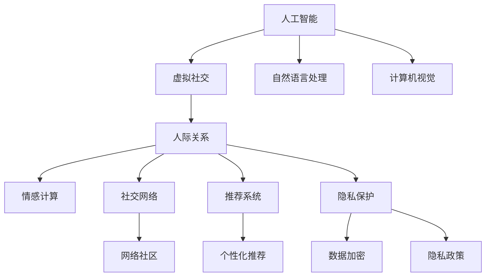

                 

# 虚拟社交：AI时代的人际关系

> 关键词：
    - 人工智能
    - 虚拟社交
    - 人际关系
    - 情感计算
    - 社交网络
    - 推荐系统
    - 隐私保护

## 1. 背景介绍

### 1.1 问题由来

随着信息技术的迅猛发展，互联网和社交媒体已经成为人们日常生活中的重要组成部分。虚拟社交平台如Facebook、微信、微博等，极大地丰富了人们的社交方式，拉近了人与人之间的距离。然而，随着社交网络用户基数的不断扩大，虚拟社交生态也呈现出新的特征和挑战。

首先，由于社交网络的内容过载和信息噪声，用户之间的交流变得更加表面化，缺乏深度互动和真实的情感交流。传统意义上的社交关系日益淡化，人们越来越依赖于虚拟世界的互动来满足社交需求。

其次，虚拟社交平台上的算法推荐，虽然显著提高了用户使用体验和粘性，但也加剧了信息茧房效应，导致用户更容易陷入单一的兴趣圈层，而难以接触和理解其他人群的视角和价值观。

此外，隐私保护也成为虚拟社交中亟待解决的问题。用户数据的滥用和泄露，不仅给个人隐私带来风险，也引发了社会信任危机。如何保护用户数据隐私，构建一个安全、公正、可持续发展的虚拟社交生态，成为当前面临的重大课题。

## 2. 核心概念与联系

### 2.1 核心概念概述

为更好地理解虚拟社交中人工智能的应用，本节将介绍几个关键概念及其相互关系：

- **人工智能（Artificial Intelligence, AI）**：利用计算机模拟人类智能行为的科学和技术，涵盖机器学习、深度学习、自然语言处理、计算机视觉等多个领域。
- **虚拟社交（Virtual Social）**：基于互联网技术，通过虚拟平台实现的社交行为，如社交网络、即时通讯、在线游戏等。
- **人际关系（Interpersonal Relationship）**：人与人之间的互动、情感交流和关系建立。
- **情感计算（Affective Computing）**：通过分析人类的情感信息，建立人机交互中情感的识别、理解与表达。
- **社交网络（Social Network）**：由多个节点（用户）和边（关系）组成的图结构，通过社交媒体、论坛等形式表现。
- **推荐系统（Recommendation System）**：通过分析用户行为数据，为用户推荐个性化内容，提升用户体验。
- **隐私保护（Privacy Protection）**：保护用户个人信息和数据安全，防止数据泄露和滥用。

这些概念之间的逻辑关系可以通过以下Mermaid流程图来展示：



这个流程图展示了大语言模型和虚拟社交系统中的关键概念及其相互联系：

1. 人工智能为大语言模型和虚拟社交平台提供技术和算法支撑。
2. 大语言模型可以用于情感计算和推荐系统，提升用户互动体验。
3. 虚拟社交平台促进人际关系的发展，通过社交网络进行用户连接和信息传播。
4. 推荐系统通过个性化推荐，满足用户需求，增加用户粘性。
5. 隐私保护技术保障用户数据安全，构建健康可持续的虚拟社交生态。

## 3. 核心算法原理 & 具体操作步骤
### 3.1 算法原理概述

基于人工智能的虚拟社交系统，其核心算法原理包括以下几个方面：

- **自然语言处理（NLP）**：通过大语言模型理解文本语义和情感，实现文本生成、对话生成、情感分析等。
- **计算机视觉（CV）**：通过图像识别和分析技术，实现人脸识别、图像搜索、视频处理等。
- **推荐系统（RS）**：通过用户行为数据和内容标签，生成个性化推荐结果，提升用户体验。
- **隐私保护（PD）**：通过数据加密、匿名化、访问控制等技术手段，保障用户隐私。

这些算法共同构成虚拟社交平台的技术支撑，通过融合各种技术和数据源，提供更加丰富、安全、高效的社交服务。

### 3.2 算法步骤详解

以下是虚拟社交平台中核心算法的操作步骤：

1. **用户注册与认证**：用户通过手机号、邮箱等注册账户，并进行身份验证。
2. **用户画像构建**：根据用户的行为数据（如浏览记录、点赞、评论等），构建用户画像，包括兴趣、偏好、社交关系等信息。
3. **内容生成与推荐**：使用大语言模型生成文本内容，通过推荐算法匹配用户画像，提供个性化推荐。
4. **社交网络构建**：根据用户之间的互动行为，构建社交网络图，进行关系推荐和连接。
5. **情感分析与互动**：通过情感计算技术，分析用户的情感状态，引导自然语言处理模型生成互动内容，提升互动体验。
6. **隐私保护与合规**：对用户数据进行加密处理，设计隐私保护机制，确保用户信息安全。

### 3.3 算法优缺点

基于人工智能的虚拟社交系统，其优点和缺点如下：

#### 优点：

1. **高效性**：人工智能技术可以快速处理大量数据，提供高效的个性化推荐和社交服务。
2. **用户体验**：通过自然语言处理和情感计算技术，提升用户互动体验，满足深度社交需求。
3. **数据驱动**：基于用户数据生成推荐内容，提高用户粘性，增强平台活跃度。
4. **隐私保护**：通过隐私保护技术，保护用户数据安全，增强用户信任。

#### 缺点：

1. **数据依赖性**：算法推荐和社交网络构建依赖于用户数据，数据质量直接影响算法效果。
2. **隐私风险**：用户数据的滥用和泄露可能带来隐私风险，引发信任危机。
3. **算法偏见**：推荐算法可能存在数据偏见，导致推荐结果不公正。
4. **技术复杂性**：系统设计和实现复杂，需要多学科技术融合。

### 3.4 算法应用领域

基于人工智能的虚拟社交系统，主要应用于以下几个领域：

1. **社交网络**：如Facebook、微信、微博等，通过算法推荐和社交网络构建，促进用户互动和关系发展。
2. **即时通讯**：如WhatsApp、QQ、Line等，通过自然语言处理和情感计算，提供即时互动和情感交流。
3. **在线游戏**：如《王者荣耀》、《绝地求生》等，通过计算机视觉和推荐算法，提升游戏体验和玩家粘性。
4. **内容平台**：如抖音、YouTube等，通过个性化推荐和情感分析，提供丰富内容服务。
5. **企业协作**：如Slack、Zoom等，通过自然语言处理和情感计算，提升团队沟通和协作效率。

## 4. 数学模型和公式 & 详细讲解  
### 4.1 数学模型构建

本节将使用数学语言对虚拟社交系统中的核心算法进行更加严格的刻画。

记用户数为 $U$，内容数为 $C$，社交关系数为 $R$，设用户-内容关系为 $C \times U$ 矩阵 $X$，用户-用户关系为 $U \times U$ 矩阵 $Y$。设推荐结果为 $R$，情感标签为 $E$，推荐算法为 $f$，隐私保护算法为 $p$。

定义推荐算法 $f$ 的损失函数为 $L(f)$，隐私保护算法 $p$ 的损失函数为 $L(p)$，则虚拟社交系统的整体损失函数为：

$$
L = L(f) + L(p)
$$

在实际应用中，推荐算法 $f$ 和隐私保护算法 $p$ 的具体实现形式多种多样，需要根据具体场景和需求进行设计和优化。

### 4.2 公式推导过程

以推荐系统为例，通过矩阵分解法，推荐算法可以表示为：

$$
R = XWX^T + Y
$$

其中 $W$ 为权重矩阵， $X$ 和 $Y$ 分别为用户-内容关系矩阵和用户-用户关系矩阵。通过矩阵分解，将推荐问题转化为求解权重矩阵 $W$ 的问题。

### 4.3 案例分析与讲解

假设用户A与用户B建立了社交关系，他们共同关注的内容为电影《流浪地球》。用户A发布了对《流浪地球》的评论，系统基于情感分析，识别出其情感标签为积极。系统将用户A对《流浪地球》的评论推荐给用户B，用户B也对该评论点赞并发布了自己的评论，系统进一步推荐给其他用户。

在这个案例中，系统通过情感计算和大语言模型，实现了用户之间的情感传递和互动，提升了社交互动体验。同时，系统根据用户兴趣和社交关系，提供个性化推荐，增强了用户粘性和平台活跃度。

## 5. 项目实践：代码实例和详细解释说明
### 5.1 开发环境搭建

在进行虚拟社交系统开发前，我们需要准备好开发环境。以下是使用Python进行Flask框架开发的Python虚拟环境配置流程：

1. 安装Anaconda：从官网下载并安装Anaconda，用于创建独立的Python环境。

2. 创建并激活虚拟环境：
```bash
conda create -n virtual-social python=3.8 
conda activate virtual-social
```

3. 安装Flask：
```bash
pip install flask
```

4. 安装各种库：
```bash
pip install pytorch torchvision torchaudio Flask pandas numpy scikit-learn gensim requests
```

完成上述步骤后，即可在`virtual-social`环境中开始虚拟社交系统的开发。

### 5.2 源代码详细实现

下面我们以情感分析系统为例，给出使用Flask框架和PyTorch实现情感分析的Python代码实现。

首先，定义情感分析模型：

```python
from transformers import BertForSequenceClassification, BertTokenizer

model = BertForSequenceClassification.from_pretrained('bert-base-cased', num_labels=3)
tokenizer = BertTokenizer.from_pretrained('bert-base-cased')
```

然后，定义API接口：

```python
from flask import Flask, request, jsonify

app = Flask(__name__)

@app.route('/analyze', methods=['POST'])
def analyze():
    data = request.json
    text = data['text']
    sentiment = model.predict([text])[0][0]
    return jsonify({'sentiment': sentiment})

if __name__ == '__main__':
    app.run(host='0.0.0.0', port=5000)
```

最后，启动Flask应用：

```bash
python app.py
```

完整的代码实现如下：

```python
from transformers import BertForSequenceClassification, BertTokenizer
from flask import Flask, request, jsonify

app = Flask(__name__)

model = BertForSequenceClassification.from_pretrained('bert-base-cased', num_labels=3)
tokenizer = BertTokenizer.from_pretrained('bert-base-cased')

@app.route('/analyze', methods=['POST'])
def analyze():
    data = request.json
    text = data['text']
    inputs = tokenizer([text], return_tensors='pt')
    with torch.no_grad():
        logits = model(**inputs).logits
    sentiment = logits[0][0].item()
    return jsonify({'sentiment': sentiment})

if __name__ == '__main__':
    app.run(host='0.0.0.0', port=5000)
```

### 5.3 代码解读与分析

让我们再详细解读一下关键代码的实现细节：

**情感分析模型**：
- `BertForSequenceClassification.from_pretrained`：加载预训练的Bert模型，并指定分类标签数为3，表示积极、消极、中性三种情感。
- `BertTokenizer.from_pretrained`：加载Bert模型的分词器，用于将输入文本转换为模型所需格式。

**API接口**：
- `@app.route`：定义API路由，当接收到的请求为POST请求时，触发`analyze`函数。
- `request.json`：从请求中获取JSON格式的数据。
- `text`：从请求中提取文本数据。
- `tokenizer([text], return_tensors='pt')`：将文本分词并进行编码，生成模型所需的输入。
- `model(**inputs).logits`：将输入数据输入模型，获取情感分类得分。
- `sentiment`：获取模型预测的情感得分，返回给客户端。

这个简单的情感分析API，展示了如何用Python和Flask框架构建一个基本的情感分析系统。开发者可以基于此框架，进一步拓展功能，如用户画像构建、个性化推荐等。

当然，工业级的系统实现还需考虑更多因素，如多用户并发处理、数据存储与检索、推荐系统优化等。但核心的情感分析范式基本与此类似。

## 6. 实际应用场景
### 6.1 智能客服

智能客服系统可以利用大语言模型和情感计算技术，实现自动化的客户服务和情感互动。用户可以通过文本或语音形式提出问题或情感需求，系统基于情感分析结果，自动匹配最佳回答或情感回应。

在技术实现上，可以收集企业内部的客服对话记录，将问题和最佳答复构建成监督数据，在此基础上对预训练语言模型进行微调。微调后的语言模型能够自动理解用户意图，匹配最合适的回答或情感回应。对于客户提出的新问题，还可以接入检索系统实时搜索相关内容，动态组织生成回答。如此构建的智能客服系统，能大幅提升客户咨询体验和问题解决效率。

### 6.2 在线教育

在线教育平台可以通过大语言模型和情感计算技术，实现智能化的教学和互动。教师可以根据学生的情感状态，调整教学内容和互动方式，提高教学效果。学生也可以通过系统反馈，获得个性化推荐的学习资源和练习。

在技术实现上，可以收集学生的学习行为数据，构建用户画像，分析其情感状态。教师可以根据学生的情感反馈，动态调整教学策略，如调整讲解难度、增加互动环节等。系统还可以根据学生的兴趣和学习进度，提供个性化的学习资源推荐，提升学习效率。

### 6.3 金融舆情监测

金融机构需要实时监测市场舆论动向，以便及时应对负面信息传播，规避金融风险。传统的人工监测方式成本高、效率低，难以应对网络时代海量信息爆发的挑战。基于大语言模型和情感计算的文本分类和情感分析技术，为金融舆情监测提供了新的解决方案。

具体而言，可以收集金融领域相关的新闻、报道、评论等文本数据，并对其进行主题标注和情感标注。在此基础上对预训练语言模型进行微调，使其能够自动判断文本属于何种主题，情感倾向是正面、中性还是负面。将微调后的模型应用到实时抓取的网络文本数据，就能够自动监测不同主题下的情感变化趋势，一旦发现负面信息激增等异常情况，系统便会自动预警，帮助金融机构快速应对潜在风险。

### 6.4 未来应用展望

随着大语言模型和情感计算技术的发展，基于人工智能的虚拟社交系统将在更多领域得到应用，为传统行业带来变革性影响。

在智慧医疗领域，基于情感计算的医疗问答、病历分析、心理咨询等应用将提升医疗服务的智能化水平，辅助医生诊疗，加速新药研发进程。

在智能教育领域，情感计算和个性化推荐技术将用于提升教学质量和学习效果，因材施教，促进教育公平，提高教学质量。

在智慧城市治理中，情感分析技术可用于舆情监测、应急指挥等环节，提高城市管理的自动化和智能化水平，构建更安全、高效的未来城市。

此外，在企业生产、社会治理、文娱传媒等众多领域，基于大模型和情感计算的人工智能应用也将不断涌现，为经济社会发展注入新的动力。相信随着技术的日益成熟，人工智能技术将成为社会各个领域的重要支撑，推动社会进步和文明发展。

## 7. 工具和资源推荐
### 7.1 学习资源推荐

为了帮助开发者系统掌握人工智能和虚拟社交的理论基础和实践技巧，这里推荐一些优质的学习资源：

1. **《人工智能基础》课程**：斯坦福大学开设的入门级课程，涵盖了人工智能的基本概念和算法，适合初学者学习。
2. **《自然语言处理综论》书籍**：系统讲解自然语言处理的基本原理和技术，包括情感分析、文本生成等。
3. **《情感计算》书籍**：详细介绍情感计算的原理、技术和应用场景，包括情感识别、情感生成等。
4. **HuggingFace官方文档**：提供大量预训练模型的代码和文档，帮助开发者快速上手实现各种算法。
5. **PyTorch官方文档**：详细介绍PyTorch框架的使用方法，包括深度学习模型的构建和优化。

通过对这些资源的学习实践，相信你一定能够快速掌握人工智能和虚拟社交的精髓，并用于解决实际的NLP问题。
###  7.2 开发工具推荐

高效的开发离不开优秀的工具支持。以下是几款用于大语言模型和虚拟社交系统开发的常用工具：

1. **PyTorch**：基于Python的开源深度学习框架，灵活动态的计算图，适合快速迭代研究。大部分预训练语言模型都有PyTorch版本的实现。
2. **TensorFlow**：由Google主导开发的开源深度学习框架，生产部署方便，适合大规模工程应用。同样有丰富的预训练语言模型资源。
3. **Flask**：轻量级的Web框架，适合快速搭建API接口，方便前后端开发。
4. **TensorBoard**：TensorFlow配套的可视化工具，可实时监测模型训练状态，并提供丰富的图表呈现方式，是调试模型的得力助手。
5. **Weights & Biases**：模型训练的实验跟踪工具，可以记录和可视化模型训练过程中的各项指标，方便对比和调优。

合理利用这些工具，可以显著提升人工智能和虚拟社交系统的开发效率，加快创新迭代的步伐。

### 7.3 相关论文推荐

人工智能和虚拟社交技术的发展源于学界的持续研究。以下是几篇奠基性的相关论文，推荐阅读：

1. **《深度学习》（Goodfellow et al.）**：详细介绍了深度学习的原理和算法，涵盖了神经网络、优化器、激活函数等基本概念。
2. **《情感分析综述》（Hu et al.）**：总结了情感分析技术的发展历程和主要方法，包括情感词典、情感分类器等。
3. **《自然语言处理综述》（Bird et al.）**：系统讲解了自然语言处理的基本技术和应用场景，包括文本分类、序列标注、机器翻译等。
4. **《情感计算综述》（Holler et al.）**：详细介绍了情感计算的原理和应用场景，包括情感识别、情感生成、情感交互等。
5. **《推荐系统综述》（Kowalczyk et al.）**：总结了推荐系统的原理和主要方法，包括协同过滤、基于内容的推荐、混合推荐等。

这些论文代表了大语言模型和虚拟社交技术的发展脉络。通过学习这些前沿成果，可以帮助研究者把握学科前进方向，激发更多的创新灵感。

## 8. 总结：未来发展趋势与挑战
### 8.1 总结

本文对基于人工智能的虚拟社交系统进行了全面系统的介绍。首先阐述了虚拟社交的背景和意义，明确了人工智能和情感计算在虚拟社交中的重要角色。其次，从原理到实践，详细讲解了情感计算和推荐系统的数学原理和关键步骤，给出了情感分析任务开发的完整代码实例。同时，本文还广泛探讨了情感计算和推荐系统在智能客服、在线教育、金融舆情等领域的实际应用前景，展示了人工智能技术在虚拟社交中的强大潜力。此外，本文精选了人工智能和虚拟社交技术的各类学习资源，力求为读者提供全方位的技术指引。

通过本文的系统梳理，可以看到，基于人工智能的虚拟社交系统正在成为社交领域的重大变革力量，极大地丰富了用户的社交方式，提高了社交体验和效率。未来，伴随技术的不断演进，人工智能和虚拟社交系统将在更多领域得到应用，为社会带来深远的变革。

### 8.2 未来发展趋势

展望未来，人工智能和虚拟社交技术将呈现以下几个发展趋势：

1. **智能化水平提升**：随着大语言模型和情感计算技术的发展，虚拟社交系统将具备更强的智能互动和情感理解能力，能够更好地满足用户需求。
2. **个性化推荐优化**：推荐算法将更加精准，能够根据用户的多维数据进行深度分析，提供更个性化的推荐内容。
3. **隐私保护加强**：隐私保护技术将更加先进，能够更好地保护用户数据，增强用户信任。
4. **多模态融合**：虚拟社交系统将更加注重多模态信息的融合，如文本、语音、图像、视频等，提升交互体验。
5. **跨领域应用拓展**：虚拟社交技术将在更多领域得到应用，如医疗、教育、金融等，推动各行业的智能化发展。

以上趋势凸显了人工智能和虚拟社交技术的广阔前景。这些方向的探索发展，必将进一步提升虚拟社交系统的性能和应用范围，为人类认知智能的进化带来深远影响。

### 8.3 面临的挑战

尽管人工智能和虚拟社交技术已经取得了瞩目成就，但在迈向更加智能化、普适化应用的过程中，它仍面临着诸多挑战：

1. **数据质量问题**：推荐系统和情感计算依赖于用户数据，数据质量直接影响算法效果。如何在数据稀缺、数据噪声等问题上取得突破，将是一大难题。
2. **隐私保护难题**：用户数据的滥用和泄露可能带来隐私风险，引发信任危机。如何设计安全的隐私保护机制，保障用户数据安全，将是重要的研究方向。
3. **算法偏见问题**：推荐算法可能存在数据偏见，导致推荐结果不公正。如何消除算法偏见，增强推荐系统的公平性，也将是重要的研究课题。
4. **技术复杂性问题**：系统设计和实现复杂，需要多学科技术融合。如何在保持技术先进性的同时，降低技术门槛，提升系统可扩展性，将是重要的优化方向。
5. **用户接受度问题**：用户对虚拟社交系统的接受度和信任度，将直接影响系统的应用效果。如何提升用户体验，增强用户粘性，将是重要的研究方向。

正视这些挑战，积极应对并寻求突破，将是大语言模型和虚拟社交系统走向成熟的必由之路。相信随着学界和产业界的共同努力，这些挑战终将一一被克服，人工智能和虚拟社交技术必将在构建安全、可靠、可解释、可控的智能系统铺平道路。

### 8.4 研究展望

面向未来，大语言模型和虚拟社交技术的研究和应用将在以下几个方向取得重要进展：

1. **情感计算的深度融合**：将情感计算技术与大语言模型深度融合，构建更加智能、自然的情感交互系统。
2. **推荐系统的多层次优化**：通过引入多层次推荐机制，提升推荐系统的多样性和个性化程度。
3. **隐私保护的新技术**：探索隐私保护的新技术，如差分隐私、联邦学习等，保障用户数据安全。
4. **多模态融合的智能系统**：构建多模态融合的智能系统，提升用户的综合体验。
5. **情感计算与知识图谱的结合**：将情感计算技术与知识图谱结合，提升系统在复杂场景下的理解和推理能力。
6. **跨领域应用的创新**：将虚拟社交技术应用于更多领域，如医疗、金融、教育等，推动各行业的智能化发展。

这些研究方向将引领人工智能和虚拟社交技术迈向新的高度，为构建安全、可靠、可解释、可控的智能系统铺平道路。面向未来，大语言模型和虚拟社交技术还需要与其他人工智能技术进行更深入的融合，如知识表示、因果推理、强化学习等，多路径协同发力，共同推动自然语言理解和智能交互系统的进步。只有勇于创新、敢于突破，才能不断拓展语言模型的边界，让智能技术更好地造福人类社会。

## 9. 附录：常见问题与解答

**Q1：虚拟社交系统的用户数据如何收集和存储？**

A: 虚拟社交系统的用户数据主要通过用户的浏览行为、互动行为等进行收集。数据存储一般采用分布式数据库系统，如Hadoop、Spark等，用于高效处理海量数据。

**Q2：虚拟社交系统如何实现隐私保护？**

A: 虚拟社交系统可以通过数据加密、匿名化、访问控制等手段实现隐私保护。数据加密技术可以对用户数据进行加密存储，防止数据泄露。匿名化技术可以将用户数据去标识化，保护用户隐私。访问控制技术可以通过身份验证、权限管理等方式，限制数据访问范围。

**Q3：推荐系统如何消除算法偏见？**

A: 推荐系统可以通过数据预处理、模型优化等手段消除算法偏见。数据预处理可以通过去除有害数据、平衡数据分布等方式，消除数据偏见。模型优化可以通过引入公平性约束、对抗训练等方式，提升推荐系统的公平性。

**Q4：如何提升虚拟社交系统的用户体验？**

A: 提升虚拟社交系统的用户体验，可以从以下几个方面入手：
1. 提升互动质量：通过情感计算和自然语言处理技术，提升系统对用户情感和需求的理解能力，提供更加贴合用户需求的互动内容。
2. 个性化推荐：通过多层次推荐机制，提升推荐系统的多样性和个性化程度，满足用户的多样化需求。
3. 数据可视化：通过图表、报表等形式，向用户展示其行为和推荐结果，增加用户参与感和满意度。

**Q5：虚拟社交系统如何应对突发事件和危机管理？**

A: 虚拟社交系统可以通过舆情监测和应急响应机制应对突发事件和危机管理。通过情感计算技术，实时监测用户情感变化，及时发现危机信号。应急响应机制可以根据危机情况，启动预警、告警、应对等措施，保障系统稳定运行。

综上所述，虚拟社交系统在人工智能和大语言模型的驱动下，已经成为社会生活中不可或缺的一部分。通过不断优化算法和提升用户体验，虚拟社交系统将在更多领域得到应用，为社会带来深远的变革。未来，伴随着技术的不断演进和创新，虚拟社交系统必将为人类社会的进步和文明发展做出更大的贡献。

