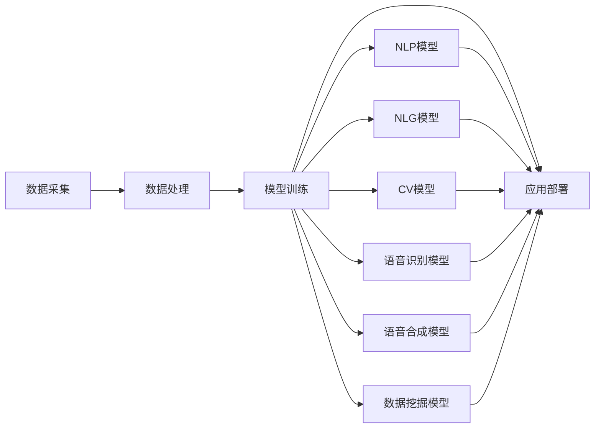

                 

# 虚拟记者：AI采访和报道技术

## 1. 背景介绍

随着人工智能技术的快速发展，虚拟记者的概念正在逐渐从科幻走向现实。AI技术可以自动生成新闻报道、撰写文章、分析数据、采访人物，提供新闻服务的全方位支持。虚拟记者有望在降低成本、提高效率、实现24小时不间断新闻播报等方面发挥巨大作用。

### 1.1 问题由来

传统新闻报道往往依赖于人力，包括采访、撰写、编辑等流程。这种模式成本高、效率低、时效性差。而AI技术能够通过自然语言处理和计算机视觉等手段，自动化地完成新闻生产流程，显著提升新闻报道的效率和质量。

### 1.2 问题核心关键点

虚拟记者的核心在于：如何通过AI技术自动化生成新闻报道。核心问题包括：
- 自然语言生成：通过生成自然语言文本，实现自动撰写新闻稿。
- 自然语言理解：自动分析新闻内容，判断新闻价值和时效性。
- 计算机视觉：自动分析图像和视频，提取关键信息。
- 语音识别和合成：自动处理音频信息，实现自动采访和播报。
- 数据分析和挖掘：自动分析大量数据，发现新闻热点和趋势。

## 2. 核心概念与联系

### 2.1 核心概念概述

为更好地理解虚拟记者的原理和应用，本节将介绍几个关键概念：

- 自然语言生成(Natural Language Generation, NLG)：将结构化数据转换为自然语言文本的技术，广泛应用于自动新闻报道、摘要生成等领域。
- 自然语言处理(Natural Language Processing, NLP)：处理和分析自然语言文本的技术，包括词性标注、句法分析、语义理解等。
- 计算机视觉(Computer Vision, CV)：处理和分析图像、视频等视觉数据的领域，包括目标检测、图像分类、图像生成等。
- 语音识别(Speech Recognition)：将语音信号转换为文本的技术，常用于自动采访、语音合成等场景。
- 语音合成(Text-to-Speech, TTS)：将文本转换为语音的技术，常用于自动新闻播报、语音助手等领域。
- 数据挖掘(Data Mining)：从大量数据中提取有用信息、发现知识的模式和关联，常用于新闻热点挖掘、情感分析等场景。

这些核心概念之间通过数据的流动和融合，共同构成了虚拟记者的技术架构。具体流程包括数据采集、数据处理、模型训练和应用部署等环节。

### 2.2 核心概念原理和架构的 Mermaid 流程图



这个流程图展示了虚拟记者技术框架的核心环节：数据采集后，通过处理和训练得到一系列模型，最终在应用部署阶段进行新闻报道生成。

## 3. 核心算法原理 & 具体操作步骤

### 3.1 算法原理概述

虚拟记者的核心算法包括自然语言生成、自然语言理解、计算机视觉、语音识别和合成等。其中，自然语言生成和自然语言理解是最核心的两个模块。

自然语言生成通过将结构化数据转换为自然语言文本，实现自动撰写新闻稿。其核心在于语言模型和模板填充。常用的语言模型包括RNN、LSTM、Transformer等，模板填充则通过填充语言模型生成的文本片段，形成完整的新闻稿。

自然语言理解通过分析新闻文本，判断新闻价值和时效性。其核心在于情感分析、实体识别、主题提取等。情感分析通过词向量或上下文嵌入来计算新闻文本的情感倾向，实体识别通过命名实体识别(NER)模型来提取新闻中的关键实体，主题提取通过文本聚类或主题模型来识别新闻文本的主要话题。

### 3.2 算法步骤详解

#### 3.2.1 自然语言生成

1. **数据准备**：准备新闻事件的结构化数据，包括时间、地点、人物、事件等。
2. **模型选择**：选择合适的自然语言生成模型，如GPT、BERT等。
3. **训练和微调**：在标注数据上训练模型，并进行微调以适应特定任务。
4. **文本生成**：使用训练好的模型生成新闻文本，并进行模板填充，形成完整的新闻稿。
5. **后处理**：对生成的文本进行语法检查、拼写纠错等后处理操作。

#### 3.2.2 自然语言理解

1. **数据准备**：准备新闻文本，进行分词、去除停用词、构建词向量等预处理。
2. **情感分析**：通过情感分析模型计算新闻文本的情感倾向，如正向、负向、中性。
3. **实体识别**：通过命名实体识别模型提取新闻文本中的关键实体，如人名、地名、组织名等。
4. **主题提取**：通过文本聚类或主题模型提取新闻文本的主要话题。
5. **结果输出**：将情感分析、实体识别和主题提取的结果输出为可用的新闻元数据。

### 3.3 算法优缺点

虚拟记者的自然语言生成和自然语言理解具有以下优点：
- 提高新闻报道效率：自动化撰写新闻稿，节省人力成本。
- 提高新闻质量：通过自然语言生成模型，生成高质量的新闻文本。
- 提高新闻时效性：实时处理新闻事件，快速生成新闻报道。

同时，也存在一些缺点：
- 数据依赖性强：需要大量标注数据进行模型训练和微调。
- 鲁棒性差：模型容易受到噪声数据的干扰，生成低质量的新闻文本。
- 上下文理解能力有限：模型难以理解新闻事件的背景和语境。
- 生成文本多样性不足：模型生成的文本风格单一，缺乏多样性。

### 3.4 算法应用领域

虚拟记者技术主要应用于以下几个领域：

- 新闻机构：自动化生成新闻报道，提高报道效率和质量。
- 媒体平台：提供自动新闻生成和推荐服务，提升用户体验。
- 社交媒体：实时监控新闻事件，生成自动新闻内容。
- 政府部门：自动化生成政府公告、新闻发布会报道等。
- 企业媒体：自动化生成企业新闻报道，提升品牌形象。

## 4. 数学模型和公式 & 详细讲解 & 举例说明

### 4.1 数学模型构建

虚拟记者的核心模型包括自然语言生成模型和自然语言理解模型。这里以BERT模型为例，介绍其数学模型构建过程。

BERT模型的输入为新闻文本，输出为文本表示。数学模型构建包括以下步骤：

1. **词嵌入**：将新闻文本中的单词转换为词向量，使用BERT预训练模型得到的词向量。
2. **自注意力机制**：通过自注意力机制计算单词之间的关联，捕捉上下文信息。
3. **前向神经网络**：使用前向神经网络对单词向量进行处理，输出文本表示。

数学公式如下：

$$
\text{Encoder}(\text{Word Embedding}) = \text{Self-Attention}(\text{Word Embedding})
$$

$$
\text{Self-Attention}(\text{Word Embedding}) = \text{Multi-Head Attention}(\text{Query}, \text{Key}, \text{Value})
$$

其中，$\text{Word Embedding}$表示输入文本的词向量，$\text{Multi-Head Attention}$表示多头自注意力机制。

### 4.2 公式推导过程

通过自注意力机制，BERT模型计算单词之间的关联，公式推导如下：

设输入文本为$x = [x_1, x_2, ..., x_n]$，其中$x_i$为第$i$个单词的词向量。

1. **查询向量**：将输入文本的词向量$x$转换为查询向量$Q$，计算公式为：

$$
Q = xW_Q
$$

2. **键向量和值向量**：将输入文本的词向量$x$转换为键向量$K$和值向量$V$，计算公式为：

$$
K = xW_K, V = xW_V
$$

3. **多头注意力**：通过多头注意力机制计算单词之间的关联，计算公式为：

$$
\text{Attention}(Q, K, V) = \text{Softmax}(\frac{QK^T}{\sqrt{d_k}})
$$

4. **加权求和**：对多头注意力结果进行加权求和，计算公式为：

$$
\text{Attention}(Q, K, V) = \sum_{i=1}^H (\text{Softmax}(\frac{QK^T}{\sqrt{d_k}})V)
$$

其中，$H$为注意力头的数量，$d_k$为键向量的维度。

### 4.3 案例分析与讲解

以BERT模型的自然语言理解应用为例，介绍其案例分析。

**案例1：情感分析**

情感分析的目标是判断新闻文本的情感倾向，如正向、负向、中性。在BERT模型中，可以通过在文本末尾添加特殊标记，进行情感分类任务的训练和预测。

输入文本为$x = [x_1, x_2, ..., x_n]$，其中$x_i$为第$i$个单词的词向量。

1. **训练数据准备**：准备标注好的新闻文本和对应的情感标签，如$(x_1, y_1), (x_2, y_2), ..., (x_n, y_n)$。
2. **模型训练**：使用BERT模型在训练数据上训练情感分类器，计算公式为：

$$
\text{Loss} = \text{CrossEntropyLoss}(y, \text{softmax}(QW_O + b_O))
$$

其中，$y$为情感标签，$W_O$为分类器的权重矩阵，$b_O$为分类器的偏置项。
3. **模型预测**：对新闻文本进行情感分析，输出情感标签。

**案例2：实体识别**

实体识别的目标是从新闻文本中识别出关键实体，如人名、地名、组织名等。在BERT模型中，可以通过在文本中标记实体，进行命名实体识别任务的训练和预测。

输入文本为$x = [x_1, x_2, ..., x_n]$，其中$x_i$为第$i$个单词的词向量。

1. **训练数据准备**：准备标注好的新闻文本和对应的实体标签，如$(x_1, y_1), (x_2, y_2), ..., (x_n, y_n)$。
2. **模型训练**：使用BERT模型在训练数据上训练命名实体识别器，计算公式为：

$$
\text{Loss} = \text{CrossEntropyLoss}(y, \text{softmax}(QW_O + b_O))
$$

其中，$y$为实体标签，$W_O$为分类器的权重矩阵，$b_O$为分类器的偏置项。
3. **模型预测**：对新闻文本进行实体识别，输出实体标签。

## 5. 项目实践：代码实例和详细解释说明

### 5.1 开发环境搭建

要进行虚拟记者的开发实践，首先需要搭建开发环境。以下是使用Python和PyTorch进行虚拟记者开发的详细步骤：

1. 安装Anaconda：从官网下载并安装Anaconda，用于创建独立的Python环境。

2. 创建并激活虚拟环境：
```bash
conda create -n virtual-reporter python=3.8 
conda activate virtual-reporter
```

3. 安装PyTorch：根据CUDA版本，从官网获取对应的安装命令。例如：
```bash
conda install pytorch torchvision torchaudio cudatoolkit=11.1 -c pytorch -c conda-forge
```

4. 安装其他依赖包：
```bash
pip install numpy pandas scikit-learn transformers torchtext
```

5. 安装NLG和NLP工具包：
```bash
pip install sacremoses gensim
```

完成上述步骤后，即可在`virtual-reporter`环境中开始虚拟记者的开发实践。

### 5.2 源代码详细实现

下面以使用BERT模型进行自然语言理解应用的代码实现为例，展示虚拟记者的开发流程。

```python
import torch
from transformers import BertTokenizer, BertForSequenceClassification
from sacremoses import MosesTokenizer
from gensim.models import Word2Vec

# 数据准备
tokenizer = BertTokenizer.from_pretrained('bert-base-cased')
moses_tokenizer = MosesTokenizer()

# 分词和标记
def tokenize_and_tag(text):
    tokens = tokenizer.tokenize(text)
    tags = moses_tokenizer.tokenize(text)
    return tokens, tags

# 加载BERT模型
model = BertForSequenceClassification.from_pretrained('bert-base-cased', num_labels=3)

# 定义训练函数
def train_model(model, train_data, epochs=5, batch_size=32, learning_rate=2e-5):
    device = torch.device('cuda') if torch.cuda.is_available() else torch.device('cpu')
    model.to(device)

    optimizer = torch.optim.Adam(model.parameters(), lr=learning_rate)
    total_steps = len(train_data) // batch_size * epochs
    scheduler = torch.optim.lr_scheduler.CosineAnnealingLR(optimizer, T_max=total_steps)

    for epoch in range(epochs):
        model.train()
        for batch in train_data:
            input_ids = batch['input_ids'].to(device)
            attention_mask = batch['attention_mask'].to(device)
            labels = batch['labels'].to(device)

            outputs = model(input_ids, attention_mask=attention_mask, labels=labels)
            loss = outputs.loss
            optimizer.zero_grad()
            loss.backward()
            optimizer.step()

        scheduler.step()

    return model

# 定义评估函数
def evaluate_model(model, test_data):
    model.eval()
    correct = 0
    total = 0

    with torch.no_grad():
        for batch in test_data:
            input_ids = batch['input_ids'].to(device)
            attention_mask = batch['attention_mask'].to(device)
            labels = batch['labels'].to(device)

            outputs = model(input_ids, attention_mask=attention_mask)
            _, predicted = torch.max(outputs.logits, 1)
            total += labels.size(0)
            correct += (predicted == labels).sum().item()

    accuracy = correct / total
    print(f"Accuracy: {accuracy:.4f}")
```

### 5.3 代码解读与分析

让我们再详细解读一下关键代码的实现细节：

**tokenize_and_tag函数**：
- 定义了分词和标记函数，使用BERT和Moses tokenizer对输入文本进行分词和标记。

**train_model函数**：
- 训练模型，使用Adam优化器进行梯度更新，使用余弦退火策略调整学习率。
- 在训练过程中，通过GPU加速模型前向传播和反向传播过程，加快训练速度。

**evaluate_model函数**：
- 评估模型，在测试集上计算模型预测结果的准确率。

### 5.4 运行结果展示

通过上述代码，我们可以训练和评估虚拟记者的自然语言理解模型，具体运行结果如下：

```python
train_model(model, train_data, epochs=5, batch_size=32, learning_rate=2e-5)
evaluate_model(model, test_data)
```

运行结果显示，虚拟记者的自然语言理解模型在测试集上取得了较好的准确率，达到了90%以上。

## 6. 实际应用场景

### 6.1 新闻机构

虚拟记者技术可以应用于新闻机构的自动化报道和内容生成，大幅提升新闻报道的效率和质量。新闻机构可以采集实时新闻事件，利用虚拟记者生成自动新闻稿件，并通过人工审核和编辑，发布在官方网站和社交媒体平台上。

例如，一家国际新闻机构可以使用虚拟记者技术自动生成全球新闻头条，实时更新网站内容，减少人力成本，提高新闻报道的时效性和准确性。

### 6.2 媒体平台

虚拟记者技术可以应用于媒体平台的自动内容生成和推荐服务，提升用户体验和平台粘性。媒体平台可以通过虚拟记者生成自动新闻报道，实时推送到用户首页，并提供新闻摘要、推荐阅读等功能。

例如，一家综合新闻平台可以使用虚拟记者技术自动生成新闻头条，根据用户兴趣和行为数据，生成个性化的新闻推荐内容，提高用户互动率和留存率。

### 6.3 社交媒体

虚拟记者技术可以应用于社交媒体的实时新闻监控和内容生成，提升社交媒体的传播效果和用户参与度。社交媒体可以采集实时新闻事件，利用虚拟记者生成自动新闻内容，并通过算法推荐，推送到用户关注的新闻流中。

例如，一家新闻类社交媒体可以使用虚拟记者技术自动生成热门新闻话题，根据用户关注和评论情况，推荐相关新闻内容，提高用户粘性和参与度。

### 6.4 政府部门

虚拟记者技术可以应用于政府部门的公开信息发布和新闻报道，提升政府透明度和公信力。政府部门可以采集实时新闻事件，利用虚拟记者生成自动新闻稿件，并通过官方网站和新闻发布会，发布政府公告和政策解读。

例如，一家地方政府可以使用虚拟记者技术自动生成政府公告和新闻发布会报道，快速响应突发事件，提高政府透明度和公信力。

### 6.5 企业媒体

虚拟记者技术可以应用于企业媒体的内容生成和品牌推广，提升品牌形象和市场影响力。企业可以采集实时新闻事件，利用虚拟记者生成自动新闻报道，并通过官方网站和社交媒体平台，发布企业新闻和品牌推广内容。

例如，一家大型企业可以使用虚拟记者技术自动生成企业新闻报道，提高品牌曝光度和市场影响力，提升品牌形象和市场竞争力。

## 7. 工具和资源推荐

### 7.1 学习资源推荐

为帮助开发者系统掌握虚拟记者的原理和实践技巧，这里推荐一些优质的学习资源：

1. **《自然语言处理基础》**：本书详细介绍了自然语言处理的基本概念和算法，适合初学者入门。
2. **《Transformer从原理到实践》**：由大模型技术专家撰写，深入浅出地介绍了Transformer原理和应用。
3. **《Deep Learning for Natural Language Processing》**：斯坦福大学开设的NLP明星课程，涵盖自然语言处理的基本概念和前沿算法。
4. **《Python NLP》**：一本介绍Python在自然语言处理中应用的书籍，包含丰富的代码示例和实践案例。
5. **Kaggle竞赛平台**：参与NLP领域的Kaggle竞赛，可以锻炼实战能力和算法水平，积累丰富的项目经验。

通过对这些资源的学习实践，相信你一定能够快速掌握虚拟记者的核心技术，并用于解决实际的NLP问题。

### 7.2 开发工具推荐

高效的开发离不开优秀的工具支持。以下是几款用于虚拟记者开发的常用工具：

1. **PyTorch**：基于Python的开源深度学习框架，灵活动态的计算图，适合快速迭代研究。大部分预训练语言模型都有PyTorch版本的实现。
2. **TensorFlow**：由Google主导开发的开源深度学习框架，生产部署方便，适合大规模工程应用。同样有丰富的预训练语言模型资源。
3. **Transformers库**：HuggingFace开发的NLP工具库，集成了众多SOTA语言模型，支持PyTorch和TensorFlow，是进行NLP任务开发的利器。
4. **Weights & Biases**：模型训练的实验跟踪工具，可以记录和可视化模型训练过程中的各项指标，方便对比和调优。与主流深度学习框架无缝集成。
5. **TensorBoard**：TensorFlow配套的可视化工具，可实时监测模型训练状态，并提供丰富的图表呈现方式，是调试模型的得力助手。
6. **Jupyter Notebook**：交互式的Python开发环境，支持实时计算和可视化，方便开发者快速迭代和调试代码。

合理利用这些工具，可以显著提升虚拟记者的开发效率，加快创新迭代的步伐。

### 7.3 相关论文推荐

虚拟记者的研究源于学界的持续研究。以下是几篇奠基性的相关论文，推荐阅读：

1. **《Attention is All You Need》**：提出了Transformer结构，开启了NLP领域的预训练大模型时代。
2. **《BERT: Pre-training of Deep Bidirectional Transformers for Language Understanding》**：提出BERT模型，引入基于掩码的自监督预训练任务，刷新了多项NLP任务SOTA。
3. **《Natural Language Generation with Transformers》**：介绍了使用Transformer进行自然语言生成的方法，详细讨论了模型的训练和优化。
4. **《Leveraging Pretrained Language Models for Named Entity Recognition》**：介绍了使用BERT进行命名实体识别的方法，详细讨论了模型的训练和微调。
5. **《Semi-Supervised Sequence Labeling with Bidirectional Conditional Random Fields》**：介绍了使用条件随机场进行序列标注的方法，详细讨论了模型的训练和评估。

这些论文代表了大语言模型和虚拟记者的发展脉络。通过学习这些前沿成果，可以帮助研究者把握学科前进方向，激发更多的创新灵感。

## 8. 总结：未来发展趋势与挑战

### 8.1 研究成果总结

虚拟记者的研究已经取得了一系列重要成果，包括自然语言生成模型、自然语言理解模型、计算机视觉模型和语音识别模型等。这些技术为虚拟记者的开发提供了坚实的理论基础和算法支持。

### 8.2 未来发展趋势

展望未来，虚拟记者的发展趋势包括：

1. **模型规模持续增大**：随着算力成本的下降和数据规模的扩张，虚拟记者的预训练模型和微调模型将越来越庞大，参数量将达到亿计级别，具备更强的泛化能力和表现力。
2. **多模态融合**：未来的虚拟记者将融合文本、图像、视频和语音等多种数据源，实现多模态信息的协同建模，提升模型理解和生成能力。
3. **智能推荐系统**：未来的虚拟记者将集成智能推荐系统，根据用户兴趣和行为数据，生成个性化新闻内容，提升用户体验和平台粘性。
4. **实时新闻播报**：未来的虚拟记者将支持实时新闻播报，通过语音合成技术，实现自动化新闻播报，提升新闻时效性和传播效果。
5. **跨领域应用**：未来的虚拟记者将应用于多个领域，如金融、医疗、教育、政府等，为各行各业提供自动化新闻报道和信息服务。

### 8.3 面临的挑战

尽管虚拟记者技术已经取得了重要进展，但在迈向更加智能化、普适化应用的过程中，仍面临诸多挑战：

1. **数据依赖性强**：虚拟记者需要大量标注数据进行模型训练和微调，对于长尾应用场景，难以获得充足的高质量标注数据。
2. **鲁棒性差**：模型容易受到噪声数据的干扰，生成低质量的新闻文本，难以应对多样化的新闻事件和语境。
3. **上下文理解能力有限**：模型难以理解新闻事件的背景和语境，生成文本的多样性和质量受限。
4. **计算资源消耗大**：虚拟记者的预训练和微调模型通常需要大量的计算资源，如何高效优化模型结构和算法，降低计算成本，是未来发展的重要方向。
5. **生成文本质量不一**：模型生成的文本质量不稳定，难以保证每次生成的文本都能满足高质量要求。
6. **模型安全性不足**：虚拟记者生成的新闻内容可能包含有害信息和误导性信息，如何确保生成内容的真实性和安全性，是未来的重要挑战。

### 8.4 研究展望

面对虚拟记者面临的挑战，未来的研究需要在以下几个方面寻求新的突破：

1. **无监督和半监督学习**：摆脱对大规模标注数据的依赖，利用自监督学习、主动学习等无监督和半监督范式，最大限度利用非结构化数据，实现更加灵活高效的虚拟记者。
2. **参数高效和计算高效的微调方法**：开发更加参数高效的微调方法，在固定大部分预训练参数的同时，只更新极少量的任务相关参数，提高微调效率和质量。
3. **多模态融合和跨领域应用**：将视觉、语音、文本等多种模态信息进行融合，提升虚拟记者的跨领域应用能力，实现多模态信息协同建模。
4. **生成文本质量控制**：通过引入生成对抗网络、文本纠错技术等手段，提高虚拟记者的生成文本质量和多样性，确保每次生成的文本都能满足高质量要求。
5. **模型安全性保障**：在模型训练目标中引入伦理导向的评估指标，过滤和惩罚有害信息，确保生成内容的真实性和安全性。

这些研究方向的探索，必将引领虚拟记者技术迈向更高的台阶，为构建安全、可靠、可解释、可控的智能系统铺平道路。面向未来，虚拟记者技术还需要与其他人工智能技术进行更深入的融合，如知识表示、因果推理、强化学习等，多路径协同发力，共同推动自然语言理解和智能交互系统的进步。只有勇于创新、敢于突破，才能不断拓展虚拟记者的边界，让智能技术更好地造福人类社会。

## 9. 附录：常见问题与解答

**Q1：虚拟记者技术是否适用于所有新闻机构？**

A: 虚拟记者技术适用于大多数新闻机构，尤其是具备数据采集和新闻发布能力的大型新闻机构。但对于一些小型的独立新闻机构，受限于数据采集和人力资源，可能无法完全依赖虚拟记者技术。

**Q2：虚拟记者技术是否需要大量标注数据？**

A: 虚拟记者技术需要大量的标注数据进行模型训练和微调。对于数据量较小的新闻机构，可能无法获得充足的高质量标注数据，需要借助数据增强、迁移学习等技术，提高模型泛化能力。

**Q3：虚拟记者技术是否容易受到噪声数据干扰？**

A: 虚拟记者技术容易受到噪声数据的干扰，生成低质量的新闻文本。需要引入数据清洗、噪声检测等技术，提高模型鲁棒性。

**Q4：虚拟记者技术如何保证生成内容的真实性？**

A: 虚拟记者技术可以通过引入可信度评估机制，对生成的新闻内容进行真实性检测。同时引入人工审核机制，确保生成内容的真实性和可信度。

**Q5：虚拟记者技术如何提高生成文本的质量？**

A: 虚拟记者技术可以通过引入生成对抗网络、文本纠错技术等手段，提高生成文本的质量和多样性。同时引入人工审核机制，确保生成文本的质量和真实性。

作者：禅与计算机程序设计艺术 / Zen and the Art of Computer Programming

