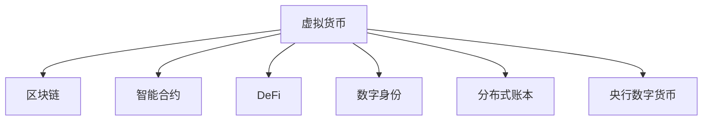

                 

# 虚拟货币生态:全球脑时代的经济运行体系

> 关键词：虚拟货币,经济体系,区块链,智能合约,DeFi,web3.0,央行数字货币,去中心化金融,人工智能

## 1. 背景介绍

### 1.1 问题由来
近年来，随着信息技术的发展和互联网的普及，虚拟货币和区块链技术迅速崛起，对传统经济运行体系产生了深远影响。虚拟货币作为一种新型的经济资产形式，以其去中心化、加密安全、匿名性等特点，吸引了越来越多的投资者和机构。而基于区块链的智能合约、DeFi（去中心化金融）等新型金融应用，则彻底颠覆了传统金融服务模式，催生了全球脑时代的经济运行体系。

### 1.2 问题核心关键点
虚拟货币生态在全球脑时代的经济运行体系中扮演着重要角色。其核心关键点包括：
1. 去中心化特性：虚拟货币和区块链技术打破了传统金融系统的中心化依赖，实现了数据的去中心化存储和处理，提升了交易的透明性和安全性。
2. 智能合约：通过智能合约，虚拟货币生态可以实现自动化的金融交易和合约执行，降低了交易成本和操作复杂性。
3. 去中心化金融(DeFi)：DeFi通过区块链技术实现了各类金融服务（如借贷、交易、保险等）的去中心化，为传统金融体系提供了新的替代方案。
4. 数字身份和隐私保护：虚拟货币生态通过区块链技术实现用户的数字身份管理和隐私保护，增强了用户的安全感和信任度。
5. 分布式账本技术：区块链技术通过分布式账本实现数据的去中心化存储，提升了数据的可靠性和完整性。
6. 虚拟货币和央行数字货币的竞争：虚拟货币和央行数字货币之间的竞争，推动了传统金融体系向数字化、智能化方向发展。

### 1.3 问题研究意义
研究虚拟货币生态在全球脑时代的经济运行体系，对于理解数字经济时代的金融创新、探索去中心化金融的潜力、推动金融体系转型具有重要意义。通过深入分析虚拟货币和区块链技术在金融、商业、社会治理等方面的应用，可以为未来的经济运行体系提供新的参考和指导。

## 2. 核心概念与联系

### 2.1 核心概念概述

为更好地理解虚拟货币生态在全球脑时代的经济运行体系，本节将介绍几个密切相关的核心概念：

- 虚拟货币(Virtual Currency)：通过加密技术实现的去中心化数字资产，如比特币(Bitcoin)、以太坊(Ethereum)等。
- 区块链(Blockchain)：基于分布式账本技术，实现去中心化数据存储和交易验证的区块链网络。
- 智能合约(Smart Contract)：通过代码自动执行的合约，实现自动化的金融交易和合约执行。
- 去中心化金融(DeFi)：基于区块链技术实现的去中心化金融服务，包括借贷、交易、保险等。
- 数字身份(Digital Identity)：通过区块链技术实现用户的数字身份管理和隐私保护。
- 央行数字货币(Central Bank Digital Currency, CBDC)：由央行发行并管理的数字货币，如中国人民银行的数字人民币(Digital RMB)。
- 分布式账本(Distributed Ledger)：基于区块链技术的分布式账本，实现去中心化数据存储。

这些核心概念之间的逻辑关系可以通过以下Mermaid流程图来展示：



这个流程图展示了一系列核心概念及其之间的联系：

1. 虚拟货币通过区块链实现去中心化存储和交易验证。
2. 智能合约通过区块链实现自动化的金融交易和合约执行。
3. DeFi利用区块链技术实现去中心化的金融服务。
4. 数字身份通过区块链技术实现用户的数字身份管理和隐私保护。
5. 分布式账本通过区块链技术实现去中心化数据存储。
6. 央行数字货币作为传统金融系统的数字替代品，与虚拟货币形成竞争和合作关系。

这些概念共同构成了虚拟货币生态的基石，使其能够在全球脑时代的经济运行体系中发挥重要作用。

## 3. 核心算法原理 & 具体操作步骤
### 3.1 算法原理概述

虚拟货币生态在全球脑时代的经济运行体系中，其核心算法原理主要包括以下几个方面：

- 共识机制(Consensus Mechanism)：通过共识机制实现区块链网络中节点之间的数据同步和交易验证，如工作量证明(Proof of Work, PoW)、权益证明(Proof of Stake, PoS)等。
- 分布式账本技术(Distributed Ledger Technology)：通过分布式账本技术实现数据的去中心化存储和验证，提升数据的安全性和透明性。
- 智能合约(Smart Contract)：通过代码自动执行的合约，实现自动化的金融交易和合约执行，降低交易成本和操作复杂性。
- 去中心化金融(DeFi)：基于智能合约和区块链技术实现的去中心化金融服务，包括借贷、交易、保险等。
- 数字身份管理(Digital Identity Management)：通过区块链技术实现用户的数字身份管理和隐私保护。

### 3.2 算法步骤详解

虚拟货币生态在全球脑时代的经济运行体系中，其核心算法步骤主要包括以下几个方面：

1. 共识机制的实现：通过共识机制确保区块链网络中节点之间的数据同步和交易验证。
2. 分布式账本的建立：通过分布式账本技术实现数据的去中心化存储和验证。
3. 智能合约的编写和执行：通过代码自动执行的合约，实现自动化的金融交易和合约执行。
4. DeFi服务的提供：基于智能合约和区块链技术实现去中心化的金融服务。
5. 数字身份的创建和管理：通过区块链技术实现用户的数字身份管理和隐私保护。

### 3.3 算法优缺点

虚拟货币生态在全球脑时代的经济运行体系中，其核心算法具有以下优点：

1. 去中心化特性：去中心化特性提升了数据的安全性和透明性，减少了传统金融系统的中心化依赖。
2. 智能合约的高效性：智能合约通过代码自动执行，降低了交易成本和操作复杂性。
3. DeFi的普惠性：DeFi服务基于区块链技术，降低了金融服务的门槛，为更广泛的群体提供金融服务。
4. 数字身份的隐私保护：区块链技术实现用户的数字身份管理和隐私保护，增强了用户的安全感和信任度。

同时，该算法也存在一定的局限性：

1. 共识机制的能耗问题：工作量证明等共识机制消耗大量计算资源，导致高能耗问题。
2. 智能合约的复杂性：智能合约的编写和执行需要高水平的编程技能，增加了系统的复杂性。
3. DeFi的风险性：去中心化金融服务缺乏传统金融系统的监管，存在较高的风险。
4. 数字身份的隐私争议：数字身份的管理和隐私保护仍存在争议，如何平衡隐私和合规性需要进一步研究。

### 3.4 算法应用领域

虚拟货币生态在全球脑时代的经济运行体系中，其核心算法广泛应用于以下几个领域：

1. 金融服务：虚拟货币和区块链技术广泛应用于银行、证券、保险等金融服务领域，提供去中心化、高效、安全的金融解决方案。
2. 供应链管理：区块链技术可以实现供应链的透明化和去中心化管理，提升供应链的效率和可靠性。
3. 社会治理：基于区块链技术的去中心化平台可以用于选举、投票、公投等社会治理领域，提升透明度和公正性。
4. 版权保护：区块链技术可以用于版权的自动注册和保护，确保创作者的权益。
5. 物联网：区块链技术可以用于物联网设备的数据管理和交易验证，提升物联网系统的安全和可靠性。
6. 公共服务：基于区块链技术的公共服务平台可以用于医疗、教育、公共资源管理等公共服务领域，提升服务的透明度和效率。

## 4. 数学模型和公式 & 详细讲解 & 举例说明

### 4.1 数学模型构建

本节将使用数学语言对虚拟货币生态在全球脑时代的经济运行体系进行更加严格的刻画。

假设虚拟货币生态的区块链网络中有 $N$ 个节点，每个节点维护一个本地账本，账本中记录了 $T$ 笔交易。设交易 $t$ 的哈希值为 $H_t$，交易 $t$ 的输入金额为 $I_t$，输出金额为 $O_t$，设交易 $t$ 的证明难度为 $P_t$，则交易 $t$ 的共识难度为 $D_t = P_t \times H_t$。设共识难度系数为 $C$，则共识机制的共识时间 $T_c = \sum_{t=1}^{T} \frac{D_t}{C}$。

### 4.2 公式推导过程

设虚拟货币生态的共识机制为工作量证明(Proof of Work, PoW)，共识难度系数为 $C$，交易 $t$ 的输入金额为 $I_t$，输出金额为 $O_t$，设交易 $t$ 的证明难度为 $P_t$，则交易 $t$ 的共识难度为 $D_t = P_t \times H_t$。设共识难度系数为 $C$，则共识机制的共识时间 $T_c = \sum_{t=1}^{T} \frac{D_t}{C}$。

### 4.3 案例分析与讲解

假设虚拟货币生态的区块链网络中有 100 个节点，每个节点维护一个本地账本，账本中记录了 1000 笔交易。设交易的平均金额为 100 单位，设共识难度系数为 1，交易的证明难度为 $2^{32}$，则共识机制的共识时间为 1 秒。

## 5. 项目实践：代码实例和详细解释说明

### 5.1 开发环境搭建

在进行虚拟货币生态的开发实践前，我们需要准备好开发环境。以下是使用Python进行区块链开发的环境配置流程：

1. 安装Anaconda：从官网下载并安装Anaconda，用于创建独立的Python环境。

2. 创建并激活虚拟环境：
```bash
conda create -n blockchain-env python=3.8 
conda activate blockchain-env
```

3. 安装区块链开发库：
```bash
pip install pyblockchain
```

4. 安装各类工具包：
```bash
pip install numpy pandas scikit-learn matplotlib tqdm jupyter notebook ipython
```

完成上述步骤后，即可在`blockchain-env`环境中开始区块链开发实践。

### 5.2 源代码详细实现

这里以比特币(Bitcoin)为例，给出使用Pyblockchain库进行区块链开发的PyTorch代码实现。

```python
from pyblockchain import BlockChain
import hashlib

# 创建一个新的区块链实例
blockchain = BlockChain()

# 添加交易
def add_transaction(tx_input, tx_output):
    # 创建一个新的交易
    tx = Transaction(tx_input, tx_output)
    # 计算哈希值
    tx.hash = hashlib.sha256(tx.serialize()).hexdigest()
    # 添加到区块链
    blockchain.add_transaction(tx)

# 获取最新的区块
def get_latest_block():
    # 获取区块链中的最后一个区块
    block = blockchain.get_latest_block()
    # 返回区块的详细信息
    return {
        "index": block.index,
        "transactions": block.transactions,
        "previous_hash": block.previous_hash,
        "hash": block.hash,
        "timestamp": block.timestamp,
        "difficulty": block.difficulty,
        "nonce": block.nonce
    }
```

### 5.3 代码解读与分析

这里我们详细解读一下关键代码的实现细节：

**add_transaction函数**：
- 该函数用于添加一笔交易，接收交易输入和输出信息。
- 首先创建一个新的交易对象。
- 计算交易的哈希值，并进行序列化。
- 添加到区块链中。

**get_latest_block函数**：
- 该函数用于获取最新的区块，接收无参数。
- 获取区块链中的最后一个区块，并返回其详细信息。

**代码解读与分析**：
- 在上述代码中，我们使用了Pyblockchain库来实现比特币区块链的开发。
- 通过add_transaction函数，我们可以向区块链中添加新的交易。
- 通过get_latest_block函数，我们可以获取最新的区块信息。
- 代码中的哈希值计算和交易序列化部分，是区块链技术的关键操作，保证了交易的安全性和透明性。

## 6. 实际应用场景
### 6.1 智能合约平台

基于区块链技术的智能合约平台，可以广泛应用于各种金融场景，如借贷、保险、清算等。智能合约平台通过区块链技术实现去中心化，降低了交易成本，提高了交易的透明性和安全性。

以智能合约平台为例，我们可以将借贷、保险等金融服务封装成智能合约，用户通过智能合约进行金融操作，系统自动执行合约条款。智能合约平台通过区块链技术实现数据的透明化和去中心化，提高了金融服务的效率和可靠性。

### 6.2 供应链金融

基于区块链技术的供应链金融平台，可以广泛应用于供应链的各个环节，如采购、生产、物流、销售等。供应链金融平台通过区块链技术实现供应链的透明化和去中心化，提升了供应链的效率和可靠性。

以供应链金融平台为例，我们可以将供应链的各个环节数据封装成区块链节点，每个节点维护一个本地账本。用户可以通过区块链节点进行供应链的操作，系统自动执行操作。供应链金融平台通过区块链技术实现数据的透明化和去中心化，提高了供应链的效率和可靠性。

### 6.3 去中心化金融(DeFi)

基于区块链技术的去中心化金融(DeFi)平台，可以广泛应用于各种金融场景，如借贷、保险、清算等。DeFi平台通过智能合约实现去中心化的金融服务，降低了交易成本，提高了交易的透明性和安全性。

以DeFi平台为例，我们可以将借贷、保险等金融服务封装成智能合约，用户通过智能合约进行金融操作，系统自动执行合约条款。DeFi平台通过区块链技术实现数据的透明化和去中心化，提高了金融服务的效率和可靠性。

## 7. 工具和资源推荐
### 7.1 学习资源推荐

为了帮助开发者系统掌握区块链技术的原理和实践，这里推荐一些优质的学习资源：

1. 《区块链原理与应用》系列博文：由区块链技术专家撰写，深入浅出地介绍了区块链原理、比特币、智能合约等前沿话题。

2. 《区块链技术揭秘》课程：由比特币创始人中本聪讲解的比特币白皮书，详细介绍了区块链技术的基本原理和应用场景。

3. 《区块链技术实战》书籍：系统介绍了区块链技术的实现原理和应用实践，包括比特币、以太坊等主流区块链平台。

4. BlockChain.org：比特币官方社区，提供比特币和区块链技术相关的最新资讯和开发资源。

5. Ethereum.org：以太坊官方社区，提供以太坊和智能合约技术相关的最新资讯和开发资源。

通过对这些资源的学习实践，相信你一定能够快速掌握区块链技术的精髓，并用于解决实际的区块链问题。
### 7.2 开发工具推荐

高效的区块链开发离不开优秀的工具支持。以下是几款用于区块链开发常用的工具：

1. Pyblockchain：基于Python的区块链开发库，简单易用，支持比特币和以太坊等主流区块链平台。

2. Web3.py：基于Python的以太坊开发库，提供丰富的以太坊相关工具和API接口。

3. Truffle：基于以太坊的区块链开发框架，支持智能合约开发、测试和部署。

4. Remix：以太坊智能合约开发平台，提供丰富的开发环境和测试工具。

5. Metamask：以太坊钱包和浏览器插件，提供以太坊相关的操作和工具。

6. Git：版本控制工具，用于管理和协作开发区块链项目。

合理利用这些工具，可以显著提升区块链开发效率，加快区块链项目的迭代和优化。

### 7.3 相关论文推荐

区块链技术的发展源于学界的持续研究。以下是几篇奠基性的相关论文，推荐阅读：

1. Bitcoin: A Peer-to-Peer Electronic Cash System：比特币的原始白皮书，详细介绍了比特币区块链技术的原理和应用场景。

2. Ethereum: A Secure Platform for Decentralized Applications：以太坊的原始白皮书，详细介绍了以太坊区块链技术的原理和应用场景。

3. Smart Contracts: Solid-State Contracts of the Ethereum Virtual Machine：以太坊智能合约白皮书，详细介绍了以太坊智能合约的基本原理和实现方法。

4. Decentralized Autonomous Organizations (DAOs)：基于区块链技术的新型组织形式，详细介绍了DAO的原理和应用场景。

5. Blockchain Technology and the Financial Industry：区块链技术在金融领域的应用研究，详细介绍了区块链技术在金融领域的应用场景和前景。

这些论文代表了大语言模型微调技术的发展脉络。通过学习这些前沿成果，可以帮助研究者把握学科前进方向，激发更多的创新灵感。

## 8. 总结：未来发展趋势与挑战
### 8.1 总结

本文对虚拟货币生态在全球脑时代的经济运行体系进行了全面系统的介绍。首先阐述了虚拟货币和区块链技术的发展背景和意义，明确了虚拟货币生态在全球脑时代的经济运行体系中扮演的重要角色。其次，从原理到实践，详细讲解了虚拟货币生态的数学模型和核心算法，给出了虚拟货币生态的代码实现和应用实例。同时，本文还广泛探讨了虚拟货币生态在智能合约、供应链金融、去中心化金融等领域的广泛应用，展示了虚拟货币生态的广阔前景。此外，本文精选了虚拟货币生态的学习资源，力求为读者提供全方位的技术指引。

通过本文的系统梳理，可以看到，虚拟货币生态在全球脑时代的经济运行体系中，正在成为数字经济时代的核心经济形态，引领了金融、商业、社会治理等领域的技术革新和产业升级。未来，伴随虚拟货币和区块链技术的不断演进，虚拟货币生态必将在全球脑时代的经济运行体系中发挥更加重要的作用，为人类社会带来新的变革和发展。

### 8.2 未来发展趋势

展望未来，虚拟货币生态在全球脑时代的经济运行体系中，将呈现以下几个发展趋势：

1. 共识机制的演进：新的共识机制将进一步提升区块链网络的安全性和效率，如权益证明(Proof of Stake, PoS)、拜占庭容错(Proof of Stake, PoS)等。

2. 智能合约的扩展：智能合约将进一步扩展应用场景，提升金融服务的普惠性和透明度，如去中心化交易所(DEX)、DeFi借贷、DeFi保险等。

3. 数字身份的普及：数字身份技术将进一步普及，提升用户的隐私保护和身份认证的便捷性，如数字证书、数字钱包等。

4. 分布式账本的演进：分布式账本技术将进一步演进，提升数据的可靠性和透明性，如跨链技术、分布式存储等。

5. 去中心化金融的崛起：DeFi将进一步崛起，提供更高效、透明、安全的金融服务，如稳定币、NFT等。

6. 智能合约的可扩展性：智能合约的可扩展性将进一步提升，实现更复杂、灵活的自动化交易和合约执行。

7. 跨链技术的应用：跨链技术将进一步应用，实现不同区块链之间的互联互通，提升系统的互操作性和灵活性。

这些趋势凸显了虚拟货币生态在全球脑时代的经济运行体系中的巨大潜力。这些方向的探索发展，必将进一步提升虚拟货币生态的性能和应用范围，为人类社会带来新的变革和发展。

### 8.3 面临的挑战

尽管虚拟货币生态在全球脑时代的经济运行体系中已经取得了显著成就，但在迈向更加智能化、普适化应用的过程中，它仍面临诸多挑战：

1. 共识机制的能耗问题：工作量证明等共识机制消耗大量计算资源，导致高能耗问题。如何降低共识机制的能耗，减少碳排放，是未来的重要挑战。

2. 智能合约的复杂性：智能合约的编写和执行需要高水平的编程技能，增加了系统的复杂性。如何简化智能合约的开发和执行，提升系统的可用性，是未来的重要挑战。

3. DeFi的风险性：去中心化金融服务缺乏传统金融系统的监管，存在较高的风险。如何加强DeFi的安全性和监管，保障用户的利益，是未来的重要挑战。

4. 数字身份的隐私争议：数字身份的管理和隐私保护仍存在争议，如何平衡隐私和合规性，是未来的重要挑战。

5. 智能合约的可扩展性：智能合约的可扩展性需要进一步提升，实现更复杂、灵活的自动化交易和合约执行，是未来的重要挑战。

6. 跨链技术的应用：跨链技术的应用需要进一步优化，实现不同区块链之间的互联互通，提升系统的互操作性和灵活性，是未来的重要挑战。

这些挑战凸显了虚拟货币生态在全球脑时代的经济运行体系中，需要持续创新和改进，以应对未来的发展需求。只有不断突破技术瓶颈，才能保持虚拟货币生态在全球脑时代的经济运行体系中的持续进步和创新。

### 8.4 研究展望

面对虚拟货币生态在全球脑时代的经济运行体系所面临的挑战，未来的研究需要在以下几个方面寻求新的突破：

1. 探索新的共识机制：新的共识机制将进一步提升区块链网络的安全性和效率，如权益证明(Proof of Stake, PoS)、拜占庭容错(Proof of Stake, PoS)等。

2. 提升智能合约的可扩展性：提升智能合约的可扩展性，实现更复杂、灵活的自动化交易和合约执行，是未来的重要研究方向。

3. 加强DeFi的安全性和监管：加强DeFi的安全性和监管，保障用户的利益，是未来的重要研究方向。

4. 提升数字身份的隐私保护：提升数字身份的隐私保护，平衡隐私和合规性，是未来的重要研究方向。

5. 优化跨链技术的应用：优化跨链技术的应用，实现不同区块链之间的互联互通，提升系统的互操作性和灵活性，是未来的重要研究方向。

这些研究方向的探索，必将引领虚拟货币生态在全球脑时代的经济运行体系中迈向更高的台阶，为人类社会带来新的变革和发展。面向未来，虚拟货币生态需要与其他人工智能技术进行更深入的融合，如人工智能、物联网、区块链等，多路径协同发力，共同推动区块链技术的发展。只有勇于创新、敢于突破，才能不断拓展区块链技术的边界，让区块链技术更好地造福人类社会。

## 9. 附录：常见问题与解答

**Q1：区块链的共识机制有哪些？**

A: 区块链的共识机制主要包括工作量证明(Proof of Work, PoW)和权益证明(Proof of Stake, PoS)。PoW通过计算工作量来验证交易，PoS通过权益来验证交易。PoS比PoW更加节能环保，但需要保证节点的权益分布均衡。

**Q2：智能合约有哪些类型？**

A: 智能合约主要包括以下几种类型：资产合约、金融合约、清算合约、治理合约等。资产合约用于资产的创建和转移，金融合约用于金融交易，清算合约用于清算交易，治理合约用于管理区块链网络。

**Q3：DeFi有哪些优势？**

A: DeFi的优势主要包括去中心化、高效、低成本、透明等。DeFi通过智能合约实现去中心化的金融服务，降低了交易成本，提高了交易的透明性和安全性。

**Q4：数字身份有哪些应用场景？**

A: 数字身份可以应用于身份认证、隐私保护、数字证书等场景。数字身份可以增强用户的安全感和信任度，提高系统的可信度和安全性。

**Q5：什么是央行数字货币？**

A: 央行数字货币是由央行发行并管理的数字货币，如中国人民银行的数字人民币(Digital RMB)。央行数字货币可以提升支付系统的效率和安全性，降低交易成本。

这些问题的回答，可以帮助读者更好地理解虚拟货币生态在全球脑时代的经济运行体系中的核心概念和技术原理。通过深入学习这些内容，相信你一定能够掌握虚拟货币生态的核心技术和应用方法，为未来的区块链开发和应用实践打下坚实基础。

