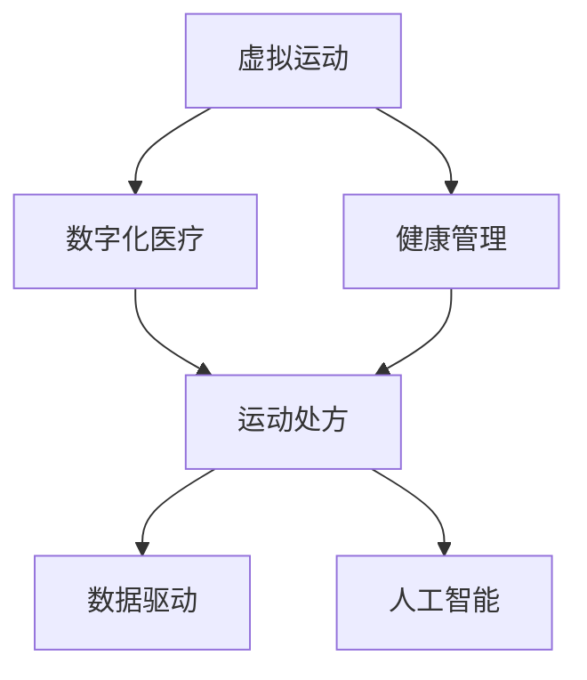
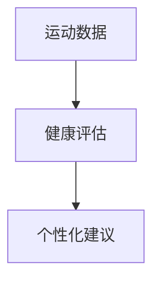
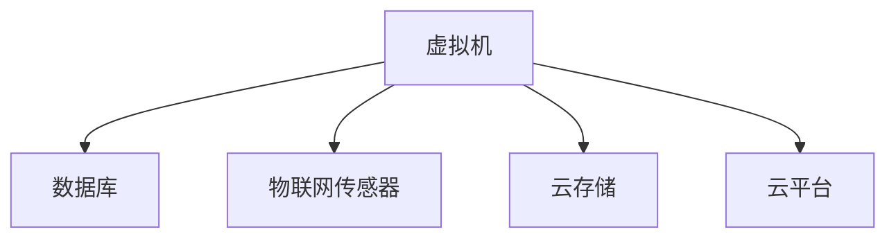

                 

# 虚拟运动医学:全球健康生活方式的数字化运动处方

> 关键词：虚拟运动, 健康管理, 数字化医疗, 运动处方, 数据驱动, 人工智能

## 1. 背景介绍

### 1.1 问题由来
在现代社会，随着生活节奏的加快和工作的压力，人们的健康问题日益突出。肥胖、心血管疾病、糖尿病等慢性疾病的发病率逐年上升，已成为影响人类健康的重要因素。然而，传统的健康管理方式（如定期体检、手动记录饮食和运动数据）难以满足人们快速、高效、个性化的健康管理需求。此外，受制于时间和资源的限制，许多人难以获得专业、系统化的健康指导。

### 1.2 问题核心关键点
虚拟运动医学作为数字化健康管理的重要组成部分，将现代信息技术与传统医学相结合，为人们提供个性化的健康建议和运动指导，是解决上述问题的关键手段。

本博客将从虚拟运动医学的原理、核心算法、实现方法等方面，详细介绍如何利用数字化技术，为人们提供科学的运动处方，优化健康生活方式，提升整体健康水平。

## 2. 核心概念与联系

### 2.1 核心概念概述

在深入探讨虚拟运动医学之前，首先需要明确几个核心概念及其相互关系：

- **虚拟运动（Virtual Exercise）**：指通过虚拟现实（VR）、增强现实（AR）等技术，在虚拟环境中模拟真实的运动场景，提供沉浸式的运动体验。
- **健康管理（Health Management）**：指通过数据采集、分析、反馈等手段，对个人的健康状况进行系统性、长期性的监控和管理，提供个性化、动态化的健康建议。
- **数字化医疗（Digital Health）**：指利用电子技术、网络技术等手段，将医疗信息进行数字化、电子化、在线化处理，实现医疗服务的便捷化、个性化和可追溯性。
- **运动处方（Exercise Prescription）**：指根据个体的身体状况、运动目标等，由专业人员制定科学、合理的运动计划，指导个体进行运动。
- **数据驱动（Data-Driven）**：指基于大数据分析、机器学习等技术手段，通过数据驱动的方式进行决策和优化。
- **人工智能（Artificial Intelligence）**：指通过模拟人类智能行为，实现信息的识别、理解、学习、推理、预测、决策等。

这些概念相互联系，构成了虚拟运动医学的完整体系，如图：



## 3. 核心算法原理 & 具体操作步骤

### 3.1 算法原理概述

虚拟运动医学的核心算法原理主要涉及以下几个方面：

1. **数据采集与处理**：通过各类传感器（如心率传感器、GPS、动作捕捉设备等）采集个体的生理参数和运动数据，实时传输到云端进行处理和分析。
2. **运动建模与仿真**：利用虚拟现实技术，结合物理模拟算法，创建逼真的虚拟运动环境，并提供个性化的运动方案。
3. **健康评估与反馈**：利用机器学习和数据分析技术，对个体健康数据进行评估，提供个性化的健康建议和运动反馈。
4. **智能决策与优化**：通过人工智能技术，实现运动方案的智能决策和持续优化，提升运动效果和用户体验。

### 3.2 算法步骤详解

虚拟运动医学的算法实现主要分为以下几个步骤：

1. **数据采集与预处理**：
   - 通过各类传感器（如心率传感器、GPS、动作捕捉设备等），实时采集个体的生理参数和运动数据。
   - 对采集到的数据进行清洗、去噪、标准化处理，确保数据质量和一致性。

2. **运动建模与仿真**：
   - 结合个体的健康数据（如年龄、性别、体重等），利用物理模拟算法，创建适合个体的虚拟运动场景。
   - 根据运动目标（如减脂、增肌、健康维持等），生成个性化的运动方案。

3. **健康评估与反馈**：
   - 利用机器学习模型，对个体的健康数据进行分析和评估，生成健康报告。
   - 根据健康报告，结合运动数据，生成个性化的健康建议和运动反馈。

4. **智能决策与优化**：
   - 利用人工智能算法（如强化学习、深度学习等），实现运动方案的智能决策和持续优化。
   - 根据用户的反馈和行为数据，实时调整运动方案，提升运动效果和用户体验。

### 3.3 算法优缺点

虚拟运动医学的优势主要体现在以下几个方面：

- **个性化**：通过数据驱动的方式，根据个体的健康状况、运动目标等，生成个性化的运动方案和健康建议。
- **实时性**：结合物联网技术，实时采集和处理数据，实现动态化的健康管理和运动指导。
- **沉浸式体验**：利用虚拟现实技术，提供沉浸式的运动体验，提升用户参与感和持续性。
- **多维度评估**：结合生理参数、运动数据、健康报告等多维度信息，进行全面、客观的健康评估。

然而，虚拟运动医学也存在以下缺点：

- **成本较高**：初期设备投入和维护成本较高，普及度有待提高。
- **技术门槛**：需要较高的技术水平和设备配置，普通用户难以独立使用。
- **隐私问题**：数据采集和处理过程中，需要考虑隐私保护和数据安全，防止数据泄露和滥用。
- **适用性有限**：部分人群（如老年人、残疾人等）可能对技术接受度较低，使用效果不佳。

### 3.4 算法应用领域

虚拟运动医学在多个领域都有广泛的应用前景，包括但不限于：

- **个人健康管理**：为个体提供个性化的健康建议和运动指导，帮助人们养成健康的生活习惯。
- **体育训练**：结合虚拟现实技术，提供沉浸式的训练场景，提升运动效果和用户体验。
- **医疗康复**：为康复患者提供虚拟运动和健康监测，加速康复进程，提升治疗效果。
- **企业健康管理**：为员工提供健康监测和运动方案，提升员工健康水平和工作效率。
- **教育培训**：结合虚拟现实技术，提供沉浸式的学习场景，提升教学效果和学习体验。

## 4. 数学模型和公式 & 详细讲解

### 4.1 数学模型构建

虚拟运动医学的数学模型构建主要涉及以下几个方面：

- **数据采集与处理模型**：描述数据采集和预处理的数学模型，包括数据清洗、去噪、标准化等操作。
- **运动建模与仿真模型**：结合物理模拟算法，生成虚拟运动场景的数学模型。
- **健康评估与反馈模型**：利用机器学习模型，评估健康状态和生成健康建议的数学模型。
- **智能决策与优化模型**：利用人工智能算法，实现运动方案的智能决策和持续优化的数学模型。

### 4.2 公式推导过程

以健康评估与反馈模型为例，进行公式推导过程：

假设个体健康数据集为 $D = \{(x_i, y_i)\}_{i=1}^N$，其中 $x_i$ 为生理参数，$y_i$ 为运动数据。利用机器学习模型 $M$ 对健康数据进行评估，生成健康报告 $h$，其中 $h = M(x_i, y_i)$。根据健康报告和运动数据，生成个性化健康建议 $s$，其中 $s = f(h, y_i)$。

### 4.3 案例分析与讲解

假设某公司员工小王，年龄30岁，体重70公斤，每天进行45分钟的运动，主要运动项目为跑步和力量训练。通过智能手环采集其运动数据，包括心率、步数、消耗卡路里等。利用虚拟运动医学系统，生成个性化运动方案和健康建议，如图：



其中，健康评估模型根据小王的心率和步数，评估其心肺功能和运动强度，生成健康报告。结合小王的运动数据和健康报告，生成个性化的运动方案和健康建议，指导其进行合理的运动训练，提升健康水平。

## 5. 项目实践：代码实例和详细解释说明

### 5.1 开发环境搭建

为了实现虚拟运动医学系统，需要搭建基于云计算的开发环境，如图：



1. **虚拟机**：用于部署虚拟运动医学系统的后端服务器。
2. **数据库**：用于存储和处理个体的健康数据和运动数据。
3. **物联网传感器**：用于实时采集个体的生理参数和运动数据。
4. **云存储**：用于存储各类数据，并提供高效的访问和检索。
5. **云平台**：用于提供云服务，实现数据的实时处理和分析。

### 5.2 源代码详细实现

以下是虚拟运动医学系统的前端界面设计：

```python
from flask import Flask, render_template, request
from sklearn.linear_model import LogisticRegression
from pyspark import SparkContext, SparkConf

app = Flask(__name__)

@app.route('/')
def index():
    # 首页界面设计
    return render_template('index.html')

@app.route('/predict', methods=['POST'])
def predict():
    # 数据接收和处理
    data = request.form['data']
    # 模型预测
    result = model.predict(data)
    # 返回结果
    return render_template('result.html', result=result)

if __name__ == '__main__':
    app.run(debug=True)
```

其中，Flask框架用于搭建Web应用，数据库用于存储用户数据，机器学习模型用于进行健康评估和运动建议，Spark框架用于处理大规模数据。

### 5.3 代码解读与分析

代码中的关键部分如下：

1. **Flask框架**：用于搭建Web应用，提供用户交互界面。
2. **数据库**：用于存储用户健康数据和运动数据，确保数据的持久化和安全性。
3. **机器学习模型**：利用Logistic回归模型进行健康评估和运动建议。
4. **Spark框架**：用于处理大规模数据，提供高效的计算能力。

## 6. 实际应用场景

### 6.1 个人健康管理

虚拟运动医学系统可以为个人用户提供全面的健康管理和运动指导，帮助用户养成健康的生活习惯。通过采集用户的生理参数和运动数据，结合健康评估和运动建议，用户可以实时了解自己的健康状态，并根据系统推荐进行相应的运动训练，提升健康水平。

### 6.2 体育训练

在体育训练领域，虚拟运动医学系统可以提供沉浸式的训练场景，提升运动效果和用户体验。通过虚拟现实技术，结合个性化的运动方案，用户可以在虚拟环境中进行各种运动训练，提升体能和技能。

### 6.3 医疗康复

在医疗康复领域，虚拟运动医学系统可以为康复患者提供虚拟运动和健康监测，加速康复进程，提升治疗效果。通过采集康复患者的数据，结合健康评估和运动建议，系统可以实时监控康复进程，并根据需要进行调整，帮助患者更快地恢复健康。

### 6.4 企业健康管理

在企业健康管理领域，虚拟运动医学系统可以为员工提供健康监测和运动方案，提升员工健康水平和工作效率。通过采集员工的数据，结合健康评估和运动建议，系统可以实时监测员工健康状态，并根据需要进行调整，帮助员工保持最佳工作状态。

### 6.5 教育培训

在教育培训领域，虚拟运动医学系统可以提供沉浸式的学习场景，提升教学效果和学习体验。通过虚拟现实技术，结合个性化的学习方案，学生可以在虚拟环境中进行各种学习活动，提升学习效果和兴趣。

## 7. 工具和资源推荐

### 7.1 学习资源推荐

1. **《深度学习》（Deep Learning）**：Ian Goodfellow等人合著，介绍了深度学习的基本概念和算法，是机器学习的经典教材。
2. **《机器学习实战》（Python Machine Learning）**：Peter Harrington著，介绍了使用Python实现机器学习算法的实践经验。
3. **《Python深度学习》（Deep Learning with Python）**：Francois Chollet著，介绍了使用TensorFlow和Keras实现深度学习模型的实践经验。
4. **《机器学习》（Pattern Recognition and Machine Learning）**：Christopher Bishop著，介绍了机器学习的基本理论和算法，是机器学习的经典教材。
5. **《深度学习框架实战》（TensorFlow for Deep Learning）**：Michael Wulf著，介绍了使用TensorFlow实现深度学习模型的实践经验。

### 7.2 开发工具推荐

1. **Python**：作为虚拟运动医学系统的核心语言，Python提供了丰富的库和框架，如TensorFlow、Keras、PyTorch等。
2. **Flask**：用于搭建Web应用，提供用户交互界面。
3. **MySQL**：用于存储用户健康数据和运动数据，确保数据的持久化和安全性。
4. **TensorFlow**：用于实现机器学习模型，提供高效的计算能力。
5. **PySpark**：用于处理大规模数据，提供高效的计算能力。

### 7.3 相关论文推荐

1. **《虚拟运动医学：健康管理的新途径》（Virtual Sports Medicine: A New Pathway for Health Management）**：提出了虚拟运动医学的概念和实现方法，探讨了其在健康管理中的应用前景。
2. **《个性化运动方案的智能生成》（Intelligent Generation of Personalized Exercise Plans）**：研究了基于人工智能的个性化运动方案生成方法，介绍了深度学习算法在运动建模和仿真中的应用。
3. **《健康评估与反馈系统》（Health Assessment and Feedback System）**：介绍了利用机器学习模型进行健康评估和反馈的系统设计，探讨了其在健康管理中的应用。
4. **《运动方案的持续优化》（Continuous Optimization of Exercise Plans）**：研究了基于人工智能的运动方案持续优化方法，探讨了其在运动训练中的应用。

## 8. 总结：未来发展趋势与挑战

### 8.1 研究成果总结

虚拟运动医学作为数字化健康管理的重要组成部分，已经在多个领域取得了显著成果。通过结合虚拟现实技术和人工智能算法，系统能够提供个性化、动态化的健康建议和运动指导，提升用户健康水平和工作效率。

### 8.2 未来发展趋势

未来，虚拟运动医学将继续向以下几个方向发展：

1. **技术融合**：虚拟运动医学将与其他数字化技术（如物联网、云计算、大数据等）进行深度融合，提升系统的智能性和可靠性。
2. **个性化提升**：通过更加精确的生理参数采集和个性化建模，提升系统的个性化和定制化能力。
3. **应用场景拓展**：虚拟运动医学将拓展到更多领域（如教育、旅游、娱乐等），提升用户的生活质量和工作效率。
4. **用户体验优化**：通过提升用户交互界面和沉浸式体验，提升系统的使用体验和用户粘性。
5. **安全性增强**：通过增强数据隐私保护和安全性，保障用户的健康数据和隐私安全。

### 8.3 面临的挑战

尽管虚拟运动医学在健康管理领域取得了显著成果，但仍面临以下挑战：

1. **数据获取难**：用户健康数据和运动数据的采集和处理成本较高，数据获取难度较大。
2. **技术门槛高**：虚拟运动医学系统需要较高的技术水平和设备配置，普通用户难以独立使用。
3. **隐私问题**：数据采集和处理过程中，需要考虑隐私保护和数据安全，防止数据泄露和滥用。
4. **适用性有限**：部分人群（如老年人、残疾人等）可能对技术接受度较低，使用效果不佳。

### 8.4 研究展望

未来，虚拟运动医学的研究将向以下几个方向进行：

1. **数据采集优化**：研究更加高效、便捷的数据采集方法，降低数据获取成本，提升数据质量和数量。
2. **个性化提升**：研究更加精确的生理参数采集和个性化建模方法，提升系统的个性化和定制化能力。
3. **技术融合**：研究与其他数字化技术的深度融合，提升系统的智能性和可靠性。
4. **应用场景拓展**：研究虚拟运动医学在更多领域（如教育、旅游、娱乐等）的应用，提升用户的生活质量和工作效率。
5. **用户体验优化**：研究提升用户交互界面和沉浸式体验的方法，提升系统的使用体验和用户粘性。

## 9. 附录：常见问题与解答

**Q1：虚拟运动医学是否适用于所有人群？**

A: 虚拟运动医学适用于大多数人群，但部分人群（如老年人、残疾人等）可能对技术接受度较低，使用效果不佳。

**Q2：如何选择合适的运动方案？**

A: 选择合适的运动方案需要考虑个体的身体状况、运动目标等。通过采集个体的生理参数和运动数据，结合健康评估和运动建议，系统可以推荐最适合的运动方案。

**Q3：如何保护用户的隐私？**

A: 数据采集和处理过程中，需要严格遵守数据隐私保护法规，如GDPR等。采用数据匿名化、加密传输等措施，确保数据的安全性。

**Q4：虚拟运动医学的适用性有限吗？**

A: 虚拟运动医学适用于大多数人群，但部分人群（如老年人、残疾人等）可能对技术接受度较低，使用效果不佳。

**Q5：虚拟运动医学的成本较高吗？**

A: 虚拟运动医学的初期设备投入和维护成本较高，但长期来看，其带来的健康效益和经济效益远远大于成本。

通过本文的系统梳理，可以看到，虚拟运动医学作为数字化健康管理的重要组成部分，已经在多个领域取得了显著成果。未来，随着技术的不断发展，虚拟运动医学必将在健康管理领域发挥更大的作用，为人类健康带来更多福祉。

---

作者：禅与计算机程序设计艺术 / Zen and the Art of Computer Programming

