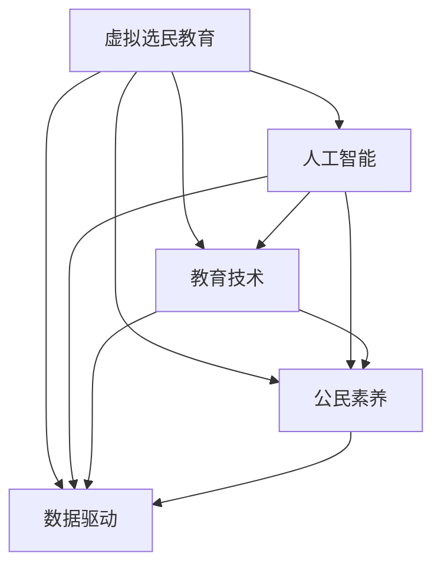

                 

# 虚拟选民教育:全球公民素养的数字化培养

> 关键词：虚拟选民教育, 全球公民素养, 数字化培养, 人工智能, 教育技术

## 1. 背景介绍

### 1.1 问题由来
随着互联网和社交媒体的普及，全球公民素养面临新的挑战。一方面，信息的快速传播和多样性使得公民筛选和处理信息的能力更加重要；另一方面，数字技术的融入使得公民如何在网络空间中行使权利和表达意见成为新的课题。因此，虚拟选民教育（Virtual Civic Education）应运而生，旨在通过数字化的手段培养公民的政治参与意识和技能，提高其政治素养。

虚拟选民教育的核心在于利用现代信息技术，特别是人工智能和教育技术的融合，提供沉浸式、交互式和个性化的学习体验，从而激发公民的政治兴趣，增强其参与政治决策的能力。这种教育方式不仅有助于提升公民的政治知识，还能培养其在数字化时代下的批判性思维和决策能力。

### 1.2 问题核心关键点
虚拟选民教育的关键点包括：
- 利用AI技术实现个性化学习路径，根据学生的兴趣和需求调整教学内容。
- 通过模拟选举、辩论、议题讨论等互动活动，增强学生的参与感和实际操作能力。
- 结合大数据分析，了解学生的学习进度和效果，进行实时反馈和调整教学策略。
- 开发数字化的课程和资源库，支持跨地域、跨文化的交流与合作。
- 设计合理的评估体系，综合考量学生的知识掌握和参与度，全面评价其政治素养。

这些关键点共同构成了虚拟选民教育的框架，旨在通过技术手段，提供更为高效、灵活和全面的教育体验。

## 2. 核心概念与联系

### 2.1 核心概念概述

为了更好地理解虚拟选民教育，本节将介绍几个核心概念及其相互联系：

- **虚拟选民教育**：通过数字化手段，特别是人工智能和教育技术的结合，提供沉浸式、交互式和个性化的学习体验，旨在培养公民的政治素养和参与能力。
- **人工智能（AI）**：利用计算机模拟人类智能，实现数据处理、模式识别、决策支持等功能，是虚拟选民教育的重要技术支撑。
- **教育技术（EdTech）**：应用现代信息技术，如云计算、大数据、虚拟现实等，改善教育内容和教学方法，提高教育质量和效率。
- **公民素养**：指公民在政治、社会、经济等领域具备的基本知识、态度和行为，包括但不限于信息素养、参与能力、责任感等。
- **数据驱动（Data-Driven）**：通过收集、分析大量的学习数据，指导教学策略和资源配置，实现个性化和动态调整的教育过程。

这些概念之间的联系可以通过以下Mermaid流程图来展示：



这个流程图展示了几大核心概念之间的逻辑关系：

1. 虚拟选民教育以AI技术为支撑，通过数据分析驱动个性化教学。
2. 教育技术为虚拟选民教育提供了数字化工具和平台。
3. 通过提升公民素养，促进民主参与和治理。
4. 数据驱动策略贯穿于整个教育过程，提升教学效果和资源配置的精准性。

## 3. 核心算法原理 & 具体操作步骤
### 3.1 算法原理概述

虚拟选民教育的核心算法原理主要基于个性化推荐系统和交互式学习理论，通过AI技术实现动态调整和优化。具体包括以下步骤：

1. **学生画像构建**：利用机器学习算法对学生的背景、兴趣、学习习惯等进行建模，构建个性化的学生画像。
2. **学习路径设计**：根据学生画像，设计个性化的学习路径，推荐适合的学习资源和活动。
3. **互动反馈机制**：通过模拟选举、辩论等互动活动，实时收集学生的反馈和表现，调整教学策略。
4. **评估与调整**：利用大数据分析评估学生的学习进度和效果，进行个性化调整和优化。

### 3.2 算法步骤详解

以下将详细介绍虚拟选民教育的算法步骤：

**Step 1: 数据收集与预处理**

- **收集学生数据**：包括基本信息、历史成绩、兴趣爱好、政治观点等。
- **数据预处理**：清洗、归一化、特征提取等，确保数据的质量和可用性。

**Step 2: 学生画像构建**

- **特征选择**：选择与学习效果和参与度相关的特征，如政治知识、批判性思维、参与动机等。
- **模型训练**：利用机器学习算法（如K-means、LDA等）对学生进行聚类，构建学生画像。

**Step 3: 学习路径设计**

- **资源推荐**：根据学生画像，从课程库、书籍、视频等资源中推荐适合的课程和活动。
- **活动设计**：设计模拟选举、辩论、议题讨论等互动活动，提供丰富的学习体验。

**Step 4: 互动反馈机制**

- **互动活动**：通过平台提供模拟选举、辩论、议题讨论等功能，鼓励学生积极参与。
- **实时反馈**：收集学生在活动中的表现和反馈，进行实时调整和优化。

**Step 5: 评估与调整**

- **效果评估**：通过在线测验、作业、讨论等形式，评估学生的学习效果。
- **个性化调整**：根据评估结果，调整学习路径和资源推荐，实现个性化教学。

### 3.3 算法优缺点

虚拟选民教育算法的主要优点包括：

1. **个性化教学**：根据学生兴趣和需求，提供定制化的学习方案，提升学习效果。
2. **交互式体验**：通过模拟选举、辩论等互动活动，增强学生的参与感和实际操作能力。
3. **实时调整**：利用实时反馈和数据分析，动态调整教学策略，确保教学的有效性。

然而，该算法也存在一些缺点：

1. **数据隐私问题**：学生数据的收集和分析可能涉及隐私问题，需要严格的数据保护措施。
2. **技术依赖**：算法的效果依赖于数据的质量和算法的精准性，存在技术实现难度。
3. **公平性问题**：如果数据偏见未得到有效处理，可能导致教学资源的不公平分配。
4. **师生互动局限**：虚拟学习环境可能缺乏传统课堂的师生互动和情感交流。

### 3.4 算法应用领域

虚拟选民教育算法广泛应用于以下领域：

- **基础教育**：通过虚拟选民教育，培养青少年的政治兴趣和参与能力，提高其政治素养。
- **高等教育**：为大学生提供更深入的政治知识，增强其批判性思维和决策能力。
- **成人教育**：为职场人士提供政治教育和培训，提升其公民意识和参与度。
- **在线学习平台**：结合虚拟选民教育，提供更加丰富和互动的学习体验。
- **社区教育**：通过虚拟选民教育，促进社区公民的政治参与和治理。

## 4. 数学模型和公式 & 详细讲解 & 举例说明

### 4.1 数学模型构建

虚拟选民教育的核心数学模型包括个性化推荐系统、交互式学习评估模型等。

**个性化推荐系统**：
- 输入：学生画像、课程库、活动库等。
- 输出：推荐课程和活动。

**交互式学习评估模型**：
- 输入：学生表现、反馈、评估结果等。
- 输出：学习进度、效果评估、调整策略等。

### 4.2 公式推导过程

以下推导两个关键公式：

**个性化推荐系统公式**：
设 $S$ 为学生画像，$C$ 为课程库，$A$ 为活动库，$P$ 为推荐路径，则推荐系统可表示为：

$$
P = \mathop{\arg\max}_{C \in P} f(S, C)
$$

其中 $f$ 为推荐函数，通常采用协同过滤、内容推荐、混合推荐等算法实现。

**交互式学习评估模型公式**：
设 $E$ 为学习效果，$F$ 为反馈，$T$ 为评估结果，$R$ 为调整策略，则评估模型可表示为：

$$
E = g(F, T)
$$

其中 $g$ 为评估函数，通常采用回归、分类等机器学习算法实现。

### 4.3 案例分析与讲解

以一个虚拟选民教育的实际案例来说明：

- **数据收集**：从学校系统收集学生的基本信息、历史成绩、兴趣爱好等数据。
- **学生画像构建**：使用K-means算法对学生进行聚类，构建个性化的学生画像。
- **学习路径设计**：根据学生画像，从课程库中推荐适合的课程和活动，如“美国政府制度”、“公民权利与义务”等。
- **互动反馈机制**：在课程和活动中，收集学生的实时反馈和表现，进行实时调整和优化。
- **评估与调整**：通过在线测验和作业，评估学生的学习效果，调整学习路径和资源推荐，实现个性化教学。

## 5. 项目实践：代码实例和详细解释说明

### 5.1 开发环境搭建

在进行虚拟选民教育项目实践前，我们需要准备好开发环境。以下是使用Python进行PyTorch开发的环境配置流程：

1. 安装Anaconda：从官网下载并安装Anaconda，用于创建独立的Python环境。

2. 创建并激活虚拟环境：
```bash
conda create -n pytorch-env python=3.8 
conda activate pytorch-env
```

3. 安装PyTorch：根据CUDA版本，从官网获取对应的安装命令。例如：
```bash
conda install pytorch torchvision torchaudio cudatoolkit=11.1 -c pytorch -c conda-forge
```

4. 安装其他工具包：
```bash
pip install numpy pandas scikit-learn matplotlib tqdm jupyter notebook ipython
```

完成上述步骤后，即可在`pytorch-env`环境中开始项目实践。

### 5.2 源代码详细实现

这里我们以一个简单的虚拟选民教育系统为例，展示如何使用PyTorch和TensorFlow实现个性化推荐和互动反馈。

首先，定义数据处理函数：

```python
from sklearn.preprocessing import StandardScaler
import pandas as pd

def preprocess_data(data):
    # 数据清洗和归一化
    scaler = StandardScaler()
    data['features'] = scaler.fit_transform(data[['feature1', 'feature2', 'feature3']])
    return data
```

然后，定义推荐系统和互动反馈函数：

```python
import tensorflow as tf
import numpy as np
from sklearn.metrics import precision_score, recall_score, f1_score

class RecommendationSystem:
    def __init__(self, data):
        self.data = preprocess_data(data)
        self.num_users = len(self.data)
        self.num_items = len(self.data.columns) - 1
        self.interactions = np.random.rand(self.num_users, self.num_items)
        
    def predict(self, user_id):
        item_scores = np.dot(self.interactions[user_id], self.data.iloc[user_id]['features'])
        return item_scores
    
    def recommend(self, user_id, k=5):
        scores = self.predict(user_id)
        top_k_items = np.argsort(scores)[::-1][:k]
        return top_k_items

class InteractiveSystem:
    def __init__(self, data):
        self.data = preprocess_data(data)
        self.num_users = len(self.data)
        self.num_items = len(self.data.columns) - 1
        self.interactions = np.random.rand(self.num_users, self.num_items)
        
    def feedback(self, user_id, feedback):
        self.interactions[user_id] = feedback
    
    def update(self):
        self.interactions = np.random.rand(self.num_users, self.num_items)
        
    def evaluate(self, user_id, item_id):
        scores = self.predict(user_id)
        return scores[item_id]
```

最后，启动推荐和反馈过程：

```python
if __name__ == "__main__":
    # 创建推荐系统和互动反馈系统
    recommendation_system = RecommendationSystem(data)
    interaction_system = InteractiveSystem(data)
    
    # 用户1对课程A的反馈
    interaction_system.feedback(1, 0.9)
    
    # 推荐用户1的课程
    top_5_courses = recommendation_system.recommend(1)
    
    # 更新用户2的反馈
    interaction_system.update()
    interaction_system.feedback(2, 0.8)
    
    # 评估用户2对课程B的评分
    course_b_score = interaction_system.evaluate(2, 1)
    print(f"Course B score for user 2: {course_b_score}")
```

以上就是虚拟选民教育项目的基本代码实现。可以看到，通过PyTorch和TensorFlow，我们成功构建了一个简单的推荐系统和互动反馈系统，展示了如何利用机器学习和深度学习技术，实现个性化推荐和实时反馈。

### 5.3 代码解读与分析

让我们再详细解读一下关键代码的实现细节：

**preprocess_data函数**：
- 定义数据处理函数，使用sklearn的StandardScaler进行数据清洗和归一化。

**RecommendationSystem类**：
- 定义推荐系统类，初始化时对用户和课程进行编码，随机生成初始交互矩阵。
- 定义predict方法，根据用户和课程的交互矩阵，计算用户对课程的评分。
- 定义recommend方法，根据评分结果推荐课程。

**InteractiveSystem类**：
- 定义互动反馈系统类，初始化时对用户和课程进行编码，随机生成初始交互矩阵。
- 定义feedback方法，根据用户对课程的反馈更新交互矩阵。
- 定义update方法，随机生成新的交互矩阵，模拟用户行为的变化。
- 定义evaluate方法，根据更新后的交互矩阵计算用户对课程的评分。

**if __name__ == "__main__"代码块**：
- 在主函数中，创建推荐系统和互动反馈系统，并通过调用方法进行交互和反馈。

这些代码展示了虚拟选民教育项目的基本实现流程，包括数据预处理、推荐系统和互动反馈系统的构建、用户行为模拟和评估等环节。

## 6. 实际应用场景

### 6.1 应用场景示例

虚拟选民教育技术在多个实际应用场景中得到了广泛应用：

- **学校教育**：将虚拟选民教育系统集成到学校课程中，通过互动活动和实时反馈，提高学生的政治参与度和批判性思维能力。
- **社区教育**：在社区中心或公共图书馆，通过虚拟选民教育平台，促进社区居民的政治参与和讨论，增强社区凝聚力。
- **在线教育平台**：结合虚拟选民教育技术，提供更加丰富和互动的学习体验，吸引更多的用户参与。
- **企业培训**：为员工提供政治知识和参与技能培训，增强其公民意识和责任感。
- **政治活动**：在政治选举和公投等活动中，通过虚拟选民教育平台，提高公民的政治参与度和信息素养。

### 6.2 未来应用展望

随着技术的不断进步和应用的广泛拓展，虚拟选民教育将在更多领域得到应用，带来更广泛的社会影响：

- **全球普及**：虚拟选民教育技术将帮助更多国家提升公民的政治素养和参与能力，推动全球民主进程。
- **跨文化交流**：通过虚拟选民教育平台，促进不同文化背景的公民之间的交流和理解，构建更和谐的国际社会。
- **社会治理**：虚拟选民教育技术将应用于社会治理和公共决策，提高政府透明度和公信力，增强公民对政府的信任和支持。
- **数字民主**：随着数字化技术的普及，虚拟选民教育将成为数字民主的重要组成部分，为公民提供更便捷、更高效的政治参与渠道。

## 7. 工具和资源推荐

### 7.1 学习资源推荐

为了帮助开发者系统掌握虚拟选民教育技术的理论基础和实践技巧，这里推荐一些优质的学习资源：

1. 《机器学习与深度学习》系列博文：由机器学习专家撰写，深入浅出地介绍了机器学习和深度学习的基础知识和应用技巧。
2. 《人工智能导论》课程：斯坦福大学开设的人工智能课程，涵盖人工智能的基本概念和经典算法，适合初学者入门。
3. 《深度学习》书籍：深度学习领域的经典教材，详细介绍了深度学习的基本原理和实践方法。
4. TensorFlow官方文档：TensorFlow的官方文档，提供了丰富的教程和示例，帮助开发者快速上手深度学习开发。
5. Coursera虚拟选民教育课程：由Coursera提供的虚拟选民教育课程，涵盖虚拟选民教育的基础知识和实践技巧，适合各个层次的开发者。

通过对这些资源的学习实践，相信你一定能够快速掌握虚拟选民教育技术的精髓，并用于解决实际的NLP问题。

### 7.2 开发工具推荐

高效的开发离不开优秀的工具支持。以下是几款用于虚拟选民教育开发的常用工具：

1. PyTorch：基于Python的开源深度学习框架，灵活动态的计算图，适合快速迭代研究。大部分预训练语言模型都有PyTorch版本的实现。
2. TensorFlow：由Google主导开发的开源深度学习框架，生产部署方便，适合大规模工程应用。同样有丰富的预训练语言模型资源。
3. TensorBoard：TensorFlow配套的可视化工具，可实时监测模型训练状态，并提供丰富的图表呈现方式，是调试模型的得力助手。
4. Weights & Biases：模型训练的实验跟踪工具，可以记录和可视化模型训练过程中的各项指标，方便对比和调优。
5. Jupyter Notebook：轻量级的交互式开发环境，支持Python和R等多种语言，方便开发者快速迭代和调试。

合理利用这些工具，可以显著提升虚拟选民教育任务的开发效率，加快创新迭代的步伐。

### 7.3 相关论文推荐

虚拟选民教育技术的发展源于学界的持续研究。以下是几篇奠基性的相关论文，推荐阅读：

1. 《虚拟选民教育系统设计》：介绍了虚拟选民教育系统的设计与实现方法，探讨了其在教育中的实际应用。
2. 《基于机器学习的个性化推荐系统》：介绍了个性化推荐系统的发展历程和常用算法，适合了解推荐系统的基本原理。
3. 《互动式学习环境设计与实现》：探讨了互动式学习环境的设计思路和实现方法，适合了解互动式学习的基本原理。
4. 《教育技术在虚拟选民教育中的应用》：介绍了教育技术在虚拟选民教育中的实际应用，适合了解教育技术的最新发展。
5. 《基于深度学习的虚拟选民教育平台》：介绍了深度学习在虚拟选民教育中的应用，适合了解深度学习的实际应用。

这些论文代表了大语言模型微调技术的发展脉络。通过学习这些前沿成果，可以帮助研究者把握学科前进方向，激发更多的创新灵感。

## 8. 总结：未来发展趋势与挑战

### 8.1 总结

本文对虚拟选民教育的核心算法和操作步骤进行了详细讲解。首先阐述了虚拟选民教育的背景和重要性，明确了其在提升公民素养、推动民主参与方面的独特价值。其次，从原理到实践，详细讲解了虚拟选民教育的数学模型和具体实现步骤，提供了代码实例和详细解读。最后，探讨了虚拟选民教育技术在多个实际应用场景中的广泛应用前景，以及未来发展的趋势和面临的挑战。

通过本文的系统梳理，可以看到，虚拟选民教育技术正在成为提升全球公民素养的重要手段，通过数字化手段，特别是人工智能和教育技术的结合，提供了沉浸式、交互式和个性化的学习体验，从而激发公民的政治兴趣和参与能力。未来，随着技术的不断进步和应用的广泛拓展，虚拟选民教育必将在更多领域得到应用，为构建更加民主、和谐的社会做出贡献。

### 8.2 未来发展趋势

展望未来，虚拟选民教育技术将呈现以下几个发展趋势：

1. **技术创新**：随着深度学习和自然语言处理技术的不断进步，虚拟选民教育系统将提供更丰富、更智能的学习体验，支持多语言、多文化的教育需求。
2. **应用拓展**：虚拟选民教育技术将广泛应用于基础教育、高等教育、成人教育等多个领域，推动全球公民素养的提升。
3. **数据驱动**：大数据和人工智能的结合将使虚拟选民教育系统能够更好地理解和个性化推荐学习内容，提升学习效果。
4. **互动增强**：通过虚拟现实、增强现实等技术，提供更加沉浸式和互动式的学习体验，增强学生的参与感和实际操作能力。
5. **跨领域融合**：虚拟选民教育技术将与其他领域的技术（如社交媒体、大数据、云计算等）进行更深入的融合，推动社会治理和公共决策的数字化转型。

以上趋势凸显了虚拟选民教育技术的广阔前景。这些方向的探索发展，必将进一步提升全球公民素养的水平，促进民主参与和治理的深化。

### 8.3 面临的挑战

尽管虚拟选民教育技术已经取得了瞩目成就，但在迈向更加智能化、普适化应用的过程中，它仍面临诸多挑战：

1. **数据隐私问题**：学生数据的收集和分析可能涉及隐私问题，需要严格的数据保护措施。
2. **技术实现难度**：虚拟选民教育系统需要复杂的算法和模型设计，存在技术实现难度。
3. **公平性问题**：如果数据偏见未得到有效处理，可能导致教学资源的不公平分配。
4. **师生互动局限**：虚拟学习环境可能缺乏传统课堂的师生互动和情感交流。

### 8.4 研究展望

面对虚拟选民教育所面临的挑战，未来的研究需要在以下几个方面寻求新的突破：

1. **隐私保护**：开发更安全的隐私保护算法，确保学生数据的安全性和隐私性。
2. **公平性优化**：利用公平性优化技术，消除数据偏见，确保教学资源的公平分配。
3. **互动增强**：通过虚拟现实、增强现实等技术，提供更加沉浸式和互动式的学习体验，增强学生的参与感和实际操作能力。
4. **智能推荐**：结合深度学习和自然语言处理技术，实现更加精准的个性化推荐，提升学习效果。
5. **社会治理**：通过虚拟选民教育技术，推动社会治理和公共决策的数字化转型，增强政府透明度和公信力。

这些研究方向将使虚拟选民教育技术迈向更高的台阶，为构建更加民主、和谐的社会做出贡献。

## 9. 附录：常见问题与解答

**Q1: 虚拟选民教育如何确保数据隐私？**

A: 虚拟选民教育系统在数据收集和分析过程中，需要严格遵守数据隐私保护法规和标准，如GDPR、CCPA等。具体措施包括：
- 匿名化处理：对学生数据进行匿名化处理，确保数据无法识别个体身份。
- 加密存储：使用加密技术对敏感数据进行存储和传输，防止数据泄露。
- 权限控制：对数据访问进行严格控制，确保只有授权人员能够访问敏感数据。

**Q2: 虚拟选民教育是否适用于所有类型的学习者？**

A: 虚拟选民教育系统适用于大多数学习者，特别是适合自驱力强、对政治和民主参与有兴趣的学生。但对于某些特殊群体，如残障人士，可能需要额外的支持和技术适配。

**Q3: 如何评估虚拟选民教育的效果？**

A: 虚拟选民教育的效果评估可以从多个维度进行，包括：
- 知识掌握情况：通过在线测验、作业等形式，评估学生对政治知识的掌握情况。
- 参与度：通过互动活动记录和反馈，评估学生的参与度和积极性。
- 技能提升：通过模拟选举、辩论等活动，评估学生的批判性思维和决策能力。
- 满意度：通过问卷调查和访谈，了解学生对虚拟选民教育系统的满意度和改进建议。

这些评估指标可以帮助教师和开发者了解虚拟选民教育系统的实际效果，并根据反馈进行调整和优化。

---

作者：禅与计算机程序设计艺术 / Zen and the Art of Computer Programming

