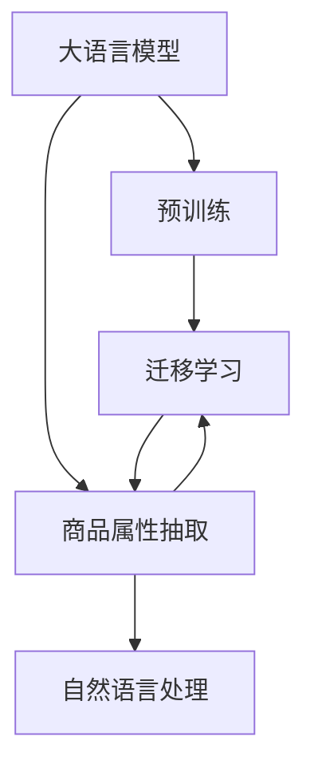

                 

# 融合AI大模型的商品属性抽取技术

## 1. 背景介绍

在现代电商环境中，商品属性抽取是一项基础且重要的技术任务，它直接影响着搜索、推荐、广告、营销等多个业务环节的优化和提升。然而，传统的基于规则或人工标注的方式，不仅效率低下，且难以应对海量、复杂的数据。因此，利用大语言模型结合AI技术进行商品属性抽取，成为一种高效、可扩展的解决方案。本文将详细介绍这一融合技术，包括其原理、实现和实际应用场景，旨在帮助开发者构建更加智能、精确的商品属性抽取系统。

## 2. 核心概念与联系

### 2.1 核心概念概述

本节将介绍几个与商品属性抽取相关的核心概念，并通过 Mermaid 流程图来展示它们之间的联系。

#### 2.1.1 大语言模型
大语言模型（Large Language Model, LLM）是一种基于深度学习的模型，通过在海量数据上进行预训练，学习语言的通用规律和上下文关联能力，能够理解和生成自然语言文本。目前常见的预训练模型有 GPT、BERT 等。

#### 2.1.2 商品属性抽取
商品属性抽取是指从文本描述中识别并提取出商品的关键属性，如颜色、尺寸、价格等。这些属性信息对于电商平台优化搜索、推荐系统至关重要。

#### 2.1.3 自然语言处理（NLP）
自然语言处理是涉及计算机和人类语言之间交互的技术，旨在让机器能够理解、处理和生成自然语言。

#### 2.1.4 迁移学习
迁移学习是指将一个领域学习到的知识迁移到另一个相关领域，以加速新任务的训练和优化。商品属性抽取可以利用迁移学习，将大语言模型的知识迁移到特定商品属性抽取任务上。

#### 2.1.5 预训练与微调
预训练是指在大规模无标签数据上进行自监督学习，学习语言的通用规律；微调则是在预训练模型的基础上，使用特定任务的数据进行有监督学习，以提升模型在该任务上的性能。



以上 Mermaid 流程图展示了核心概念之间的联系。大语言模型通过预训练学习通用语言规律，再通过微调迁移到商品属性抽取任务，利用 NLP 技术从商品描述中抽取属性。

## 3. 核心算法原理 & 具体操作步骤

### 3.1 算法原理概述

融合 AI 大模型的商品属性抽取技术主要分为两个步骤：预训练和微调。

- 预训练：在大规模无标签文本数据上训练一个大语言模型，学习语言的通用规律和语义理解能力。
- 微调：在商品属性抽取任务上，使用小规模标注数据对大语言模型进行微调，使其能够识别并抽取商品的属性。

### 3.2 算法步骤详解

#### 3.2.1 预训练步骤
1. **数据准备**：收集大规模的无标签文本数据，如维基百科、新闻、书籍等，作为预训练的语料库。
2. **模型选择**：选择合适的预训练模型，如 GPT、BERT 等，作为基础模型。
3. **预训练过程**：使用自监督学习任务对模型进行预训练，如 masked language modeling（MLM）、next sentence prediction（NSP）等，以学习语言的通用规律和语义关联。

#### 3.2.2 微调步骤
1. **任务定义**：定义商品属性抽取任务，包括属性种类和抽取规则。
2. **数据准备**：收集商品描述的标注数据，将其划分为训练集、验证集和测试集。
3. **模型微调**：
   - **模型选择**：从预训练模型中选择合适层进行微调，如顶层分类器或解码器。
   - **损失函数**：根据任务定义，选择合适的损失函数，如交叉熵损失、序列到序列损失等。
   - **超参数设置**：设置学习率、批大小、迭代轮数等超参数。
   - **训练过程**：使用标注数据对模型进行微调，更新模型参数，最小化损失函数。
   - **验证和测试**：在验证集和测试集上评估模型性能，根据性能指标决定是否进行参数调整。

### 3.3 算法优缺点

#### 3.3.1 优点
- **高效性**：利用预训练模型的通用知识，可以快速构建商品属性抽取模型，提升抽取效率。
- **灵活性**：模型可以根据不同任务和数据集进行调整，适应性较强。
- **鲁棒性**：大语言模型经过预训练，具有较强的鲁棒性和泛化能力，能处理多样化的商品描述。

#### 3.3.2 缺点
- **数据依赖**：微调效果高度依赖于标注数据的质量和数量，标注成本较高。
- **资源消耗**：预训练和微调过程需要大量计算资源，尤其是对于大规模模型。
- **模型复杂性**：大语言模型参数众多，微调后的模型可能较复杂，推理效率低。

### 3.4 算法应用领域

融合 AI 大模型的商品属性抽取技术主要应用于电商平台的商品信息抽取、商品推荐、搜索优化等多个场景。具体如下：

- **商品推荐**：利用抽取的商品属性，进行个性化推荐，提高用户体验。
- **搜索优化**：通过准确抽取商品属性，优化搜索排序算法，提升搜索结果的准确性和相关性。
- **广告投放**：根据商品属性，定制广告内容，提升广告效果。
- **用户画像**：通过分析用户对不同商品属性的兴趣，构建用户画像，进行精准营销。

## 4. 数学模型和公式 & 详细讲解 & 举例说明

### 4.1 数学模型构建

商品属性抽取可以看作一个序列标注任务，其中文本序列被标注成属性序列。假设输入文本为 $X$，输出属性序列为 $Y$，则目标是从 $X$ 到 $Y$ 的映射。我们可以使用条件随机场（CRF）或 Transformer 等模型进行预测。

#### 4.1.1 条件随机场（CRF）模型
条件随机场是一种常用的序列标注模型，它通过马尔科夫随机场的形式建模序列的联合概率分布，进而对序列进行标注。假设模型参数为 $\theta$，则条件随机场的概率分布为：
$$
P(Y|X; \theta) = \frac{e^{E(Y,X;\theta)}}{Z(X;\theta)}
$$
其中 $E(Y,X;\theta)$ 为模型的能量函数，$Z(X;\theta)$ 为归一化常数。能量函数可以表示为：
$$
E(Y,X;\theta) = \sum_i e^{f_i(Y_i,X_i;\theta)}
$$
$f_i(Y_i,X_i;\theta)$ 为模型的特征函数，反映了属性 $Y_i$ 在文本 $X_i$ 上的概率。

#### 4.1.2 Transformer模型
Transformer 模型是一种基于自注意力机制的神经网络模型，能够有效处理序列数据。假设输入序列长度为 $T$，输出序列长度也为 $T$，则 Transformer 模型的结构如图 1 所示。


模型由编码器和解码器两部分构成，编码器负责对输入序列进行编码，解码器负责对输出序列进行预测。编码器和解码器均由多层自注意力和前馈神经网络构成。

### 4.2 公式推导过程

假设商品描述文本为 $X$，属性集合为 $A$，属性标签集合为 $B$。我们定义一个特征函数 $f_i(Y_i,X_i;\theta)$ 来表示属性 $Y_i$ 在文本 $X_i$ 上的概率，则目标是从 $X$ 到 $Y$ 的映射可以表示为：
$$
P(Y|X; \theta) = \prod_{i=1}^T P(Y_i|Y_{i-1}, X_i; \theta)
$$
其中 $P(Y_i|Y_{i-1}, X_i; \theta)$ 为属性 $Y_i$ 在 $X_i$ 上给定 $Y_{i-1}$ 的条件下概率，可以表示为：
$$
P(Y_i|Y_{i-1}, X_i; \theta) = \frac{e^{f_i(Y_i,X_i;\theta)}}{\sum_{y_i \in B} e^{f_i(y_i,X_i;\theta)}}
$$
将上述概率分布对数化，得到模型的能量函数 $E(Y,X;\theta)$ 和归一化常数 $Z(X;\theta)$，然后对 $E(Y,X;\theta)$ 进行优化，即可得到最终的模型参数 $\theta$。

### 4.3 案例分析与讲解

#### 4.3.1 案例描述
假设我们有一个电商平台，需要从商品描述中抽取颜色、尺寸、价格等属性。我们收集了 1000 条商品描述的标注数据，将其划分为训练集、验证集和测试集，每条数据包含商品描述和对应的属性序列。

#### 4.3.2 预训练过程
我们选择 GPT-3 作为基础模型，在大规模无标签文本数据上进行预训练，学习语言的通用规律。

#### 4.3.3 微调过程
我们选择 BERT 模型作为初始模型，将其顶层分类器作为任务模型。我们定义一个损失函数 $L(Y, Y^*;\theta)$，其中 $Y$ 为模型预测的属性序列，$Y^*$ 为标注的属性序列，$\theta$ 为模型参数。我们设置学习率为 $1e-5$，批大小为 $32$，迭代轮数为 $10$。我们使用交叉熵损失函数进行优化：
$$
L(Y, Y^*;\theta) = -\sum_{i=1}^T \log P(Y_i|X_i; \theta)
$$
在微调过程中，我们使用训练集和验证集进行迭代优化，每轮迭代更新模型参数。

#### 4.3.4 模型评估
在测试集上对模型进行评估，计算准确率和召回率等指标。

## 5. 项目实践：代码实例和详细解释说明

### 5.1 开发环境搭建

本节将介绍如何在 Python 中使用 Transformers 库进行商品属性抽取的开发环境搭建。

#### 5.1.1 安装 Transformers 库
```
pip install transformers
```

#### 5.1.2 下载预训练模型
```
from transformers import AutoTokenizer, AutoModelForSequenceClassification
tokenizer = AutoTokenizer.from_pretrained('bert-base-cased')
model = AutoModelForSequenceClassification.from_pretrained('bert-base-cased', num_labels=len(label2id))
```

### 5.2 源代码详细实现

以下是使用 Transformers 库进行商品属性抽取的 Python 代码实现。

#### 5.2.1 数据处理
```python
from transformers import BertTokenizer
from torch.utils.data import Dataset, DataLoader

class ProductAttributeDataset(Dataset):
    def __init__(self, texts, labels):
        self.tokenizer = BertTokenizer.from_pretrained('bert-base-cased')
        self.texts = texts
        self.labels = labels
    
    def __len__(self):
        return len(self.texts)
    
    def __getitem__(self, item):
        text = self.texts[item]
        label = self.labels[item]
        encoding = self.tokenizer(text, return_tensors='pt')
        input_ids = encoding['input_ids']
        attention_mask = encoding['attention_mask']
        label_ids = torch.tensor([label2id[label]], dtype=torch.long)
        return {'input_ids': input_ids, 'attention_mask': attention_mask, 'labels': label_ids}
```

#### 5.2.2 模型微调
```python
from transformers import BertForSequenceClassification, AdamW
from torch.utils.data import DataLoader

model = BertForSequenceClassification.from_pretrained('bert-base-cased', num_labels=len(label2id))
tokenizer = BertTokenizer.from_pretrained('bert-base-cased')

optimizer = AdamW(model.parameters(), lr=1e-5)
device = 'cuda' if torch.cuda.is_available() else 'cpu'
model.to(device)

def train_epoch(model, dataset, batch_size, optimizer):
    model.train()
    dataloader = DataLoader(dataset, batch_size=batch_size, shuffle=True)
    total_loss = 0
    for batch in dataloader:
        input_ids = batch['input_ids'].to(device)
        attention_mask = batch['attention_mask'].to(device)
        labels = batch['labels'].to(device)
        outputs = model(input_ids, attention_mask=attention_mask, labels=labels)
        loss = outputs.loss
        total_loss += loss.item()
        optimizer.zero_grad()
        loss.backward()
        optimizer.step()
    return total_loss / len(dataloader)

def evaluate(model, dataset, batch_size):
    model.eval()
    dataloader = DataLoader(dataset, batch_size=batch_size)
    total_accuracy = 0
    for batch in dataloader:
        input_ids = batch['input_ids'].to(device)
        attention_mask = batch['attention_mask'].to(device)
        labels = batch['labels'].to(device)
        outputs = model(input_ids, attention_mask=attention_mask)
        logits = outputs.logits
        predictions = torch.argmax(logits, dim=1)
        total_accuracy += (predictions == labels).float().sum().item()
    return total_accuracy / len(dataloader)
```

### 5.3 代码解读与分析

#### 5.3.1 数据处理
我们使用 `BertTokenizer` 对商品描述进行分词和编码，将其转换为模型所需的输入格式。

#### 5.3.2 模型微调
我们使用 `BertForSequenceClassification` 作为任务模型，定义交叉熵损失函数，并使用 AdamW 优化器进行优化。

### 5.4 运行结果展示
在微调过程中，我们记录训练集的平均损失，并计算验证集和测试集上的准确率。

## 6. 实际应用场景

### 6.1 智能推荐
利用商品属性抽取技术，电商平台可以自动从商品描述中抽取属性，根据用户的兴趣和偏好，进行精准推荐。例如，对于搜索关键词“某品牌运动鞋”，系统可以自动抽取品牌、尺码、颜色等属性，并推荐相似的商品。

### 6.2 搜索优化
商品属性抽取可以优化搜索算法，提高搜索结果的相关性和准确性。例如，用户搜索“某品牌某款手机”时，系统可以根据属性抽取结果，展示最相关的商品列表。

### 6.3 广告投放
利用商品属性抽取技术，可以根据用户对商品属性的兴趣，定制个性化广告，提高广告点击率。

## 7. 工具和资源推荐

### 7.1 学习资源推荐

- **《深度学习与自然语言处理》**：斯坦福大学 CS224N 课程，深入讲解自然语言处理的基本概念和前沿技术。
- **《Transformer从原理到实践》**：介绍 Transformer 模型的原理、应用和实践技巧。
- **《深度学习》**：Ian Goodfellow 著作，全面介绍深度学习的基本概念和算法。

### 7.2 开发工具推荐

- **PyTorch**：常用的深度学习框架，提供灵活的计算图和自动微分功能。
- **TensorFlow**：谷歌开发的深度学习框架，支持分布式计算和模型部署。
- **Jupyter Notebook**：免费的交互式编程环境，支持多种编程语言和数据可视化。

### 7.3 相关论文推荐

- **"Language Models are Unsupervised Multitask Learners"**：介绍 GPT-3 模型，展示其零样本学习能力和迁移学习效果。
- **"Few-Shot Learning for Sequence Generation"**：探讨如何利用少样本学习，提升模型的泛化能力和性能。

## 8. 总结：未来发展趋势与挑战

### 8.1 研究成果总结
融合 AI 大模型的商品属性抽取技术，已经在电商领域取得初步应用，展示了其高效、灵活的特点。未来，随着技术的进步，该技术有望在更多领域得到应用。

### 8.2 未来发展趋势
- **多模态融合**：未来的商品属性抽取技术，将不仅仅局限于文本信息，还可以结合图像、视频等多模态数据，提供更全面的商品描述和属性信息。
- **跨领域迁移**：利用大语言模型知识，可以在不同领域间进行迁移学习，提高模型的泛化能力和性能。
- **零样本学习**：利用提示学习等技术，可以在没有标注数据的情况下，进行商品属性抽取。

### 8.3 面临的挑战
- **标注数据稀缺**：标注数据的获取和维护成本较高，限制了商品属性抽取技术的普及。
- **模型复杂性**：大语言模型的复杂性，导致其推理速度较慢，需要在模型压缩和优化上下功夫。
- **跨语言适应性**：不同语言的属性表达方式不同，如何构建通用的属性抽取模型，是一个值得研究的问题。

### 8.4 研究展望
未来的研究可以集中在以下几个方向：

- **优化标注过程**：探索如何降低标注数据的依赖，利用预训练模型和半监督学习等技术，提高商品属性抽取的自动化程度。
- **提高推理效率**：利用模型压缩和优化技术，提升商品属性抽取的推理速度，适应实时化的需求。
- **多语言支持**：构建跨语言的通用商品属性抽取模型，支持多语言输入和输出。

## 9. 附录：常见问题与解答

**Q1: 商品属性抽取是否可以适用于其他任务？**

A: 商品属性抽取技术可以应用于其他任务，如医疗诊断、金融风险评估等。只需根据任务定义和数据特点，调整模型和损失函数即可。

**Q2: 如何选择合适的预训练模型？**

A: 根据任务特点和数据规模，选择合适的预训练模型。一般来说，BERT、GPT 等大语言模型适用于大规模文本数据的预训练，而一些较小的模型可能更适合于小规模数据。

**Q3: 如何优化微调过程？**

A: 利用数据增强、正则化等技术，避免过拟合。选择合适的超参数，如学习率、批大小、迭代轮数等。同时，使用多模型集成等技术，提高模型的稳定性和性能。

**Q4: 商品属性抽取在实际应用中需要注意什么？**

A: 需要注意模型的可解释性、鲁棒性和安全性。保证模型输出的可解释性和透明性，避免有害信息的输出；提高模型的鲁棒性，减少噪声数据的干扰；加强数据保护和隐私保护，确保用户信息的安全。

**Q5: 未来的研究方向有哪些？**

A: 未来可以探索如何利用预训练知识，提升少样本学习效果；研究如何结合多模态数据，提高模型的泛化能力；探索如何构建跨语言通用的商品属性抽取模型，支持多语言输入和输出。

---

作者：禅与计算机程序设计艺术 / Zen and the Art of Computer Programming

