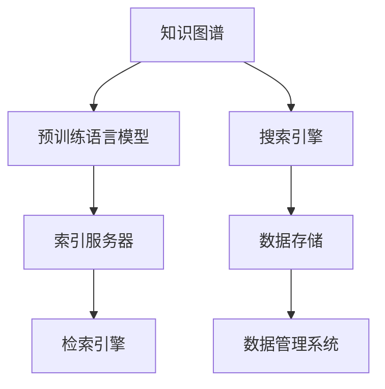

                 

# 融合AI大模型的电商搜索引擎架构设计

## 1. 背景介绍

### 1.1 问题由来

在现代社会，电商平台的搜索功能成为了用户获取商品信息、比较商品价格、找到购物清单的重要手段。然而，传统的搜索系统往往只能基于简单的关键词匹配，无法理解用户的意图和偏好，导致搜索结果不够精准，用户体验不佳。为此，电商企业亟需一种先进的搜索技术，能够在海量的商品数据中，快速响应用户查询，提供相关性高的搜索结果。

近年来，随着人工智能技术的发展，特别是深度学习和大规模语言模型的出现，使得搜索引擎能够从文本数据的底层语言表示上，捕捉到用户的意图，提升搜索结果的准确性。基于此，电商搜索引擎开始逐渐引入大模型的知识图谱、问答系统和预训练语言模型，试图通过融合AI技术，构建高效、智能的搜索系统，为用户带来更佳的购物体验。

### 1.2 问题核心关键点

为了设计出高效、智能的电商搜索引擎，需要重点解决以下几个关键问题：

- 如何构建一个强大的知识图谱，将商品的语义信息进行有效表示，以便于搜索和推荐。
- 如何利用预训练语言模型，进行文本理解、文本匹配和文本生成，以提升搜索结果的相关性和丰富性。
- 如何设计高效的推理算法，对复杂的用户查询进行解析，进行合理的检索和排序。
- 如何构建一个稳定、可扩展的搜索系统架构，以适应大规模的查询请求。

本文将详细探讨这些核心问题，并提出一个融合AI大模型的电商搜索引擎架构，期望能够为电商企业提供一个可落地的智能搜索解决方案。

## 2. 核心概念与联系

### 2.1 核心概念概述

为了更好地理解融合AI大模型的电商搜索引擎架构，首先需要明确几个核心概念：

- **知识图谱(Knowledge Graph)**：一种用于表示实体及其关系的数据结构，通过图的形式将商品、属性、类别等信息有机组织在一起，便于检索和推理。
- **预训练语言模型(Pretrained Language Model)**：指在大规模无标注数据上训练得到的语言表示模型，如BERT、GPT等，具备强大的语言理解和生成能力。
- **搜索系统架构(Architecture)**：指用于实现搜索功能的技术框架和组件，包括搜索引擎、索引服务器、数据存储等。

这些核心概念之间的联系可以通过以下Mermaid流程图来展示：



这个流程图展示了知识图谱、预训练语言模型、搜索引擎、索引服务器、数据存储等组件之间的联系：

- 知识图谱与预训练语言模型可以相互补充，共同构建商品的全语义信息表示。
- 搜索引擎与索引服务器负责处理用户查询请求，对商品进行检索。
- 数据存储与数据管理系统保证数据的有效管理和检索效率。

## 3. 核心算法原理 & 具体操作步骤

### 3.1 算法原理概述

融合AI大模型的电商搜索引擎架构设计，主要基于以下几个核心算法原理：

- **知识图谱构建算法**：通过实体抽取、关系抽取等技术，从电商商品描述中提取知识图谱信息，构建商品及其属性的语义表示。
- **预训练语言模型推理算法**：利用预训练语言模型，对用户查询进行理解，提取关键信息，进行合理的搜索结果排序。
- **搜索引擎优化算法**：通过调整搜索引擎的索引和排序算法，提升搜索结果的相关性和召回率。

这些算法共同构成了电商搜索引擎的核心逻辑，使得系统能够高效响应用户查询，提供高质量的搜索结果。

### 3.2 算法步骤详解

以下是融合AI大模型的电商搜索引擎架构设计的详细操作步骤：

**Step 1: 构建知识图谱**
- 收集电商商品数据，包括商品描述、类别、属性等信息。
- 使用实体抽取模型，从文本中提取出实体名称、属性和类别。
- 使用关系抽取模型，提取实体间的关系，构建商品的知识图谱。
- 利用图数据库存储知识图谱信息，并支持高效的查询和推理操作。

**Step 2: 构建预训练语言模型**
- 收集电商商品描述数据，构建无标注语料库。
- 利用预训练语言模型，在无标注语料库上训练得到商品的预训练表示。
- 使用迁移学习的方法，将预训练模型微调成电商领域的知识表示。

**Step 3: 设计搜索引擎架构**
- 构建搜索引擎的核心组件，包括索引服务器、检索引擎和结果展示模块。
- 设计高效的索引机制，将商品数据构建成倒排索引，支持快速检索。
- 实现基于预训练语言模型的推理算法，对用户查询进行理解，提取关键信息。
- 利用知识图谱信息，对搜索结果进行语义增强，提升结果的相关性。
- 设计合理的排序算法，对搜索结果进行排序和排序。

**Step 4: 部署和优化**
- 将构建好的搜索引擎部署到生产环境中。
- 定期收集用户反馈和搜索日志，进行模型调优和系统优化。
- 根据用户行为数据，动态调整搜索结果和推荐算法。

### 3.3 算法优缺点

融合AI大模型的电商搜索引擎架构设计，具有以下优点：

- **高准确性**：通过知识图谱和预训练语言模型的融合，能够更准确地理解用户查询和商品信息，提升搜索结果的相关性。
- **快速响应用户查询**：高效的索引机制和推理算法，能够快速响应用户查询请求，减少用户等待时间。
- **自适应性**：基于数据的持续学习，能够动态调整搜索结果和推荐算法，提升用户体验。

同时，该架构也存在一些局限性：

- **高成本**：构建和维护知识图谱、预训练语言模型和搜索系统，需要较高的技术投入和硬件成本。
- **复杂度**：系统架构复杂，涉及多个组件的协同工作，需要较高的开发和运维能力。
- **数据依赖**：搜索结果和推荐的效果，高度依赖于电商商品数据的质量和完整性。

尽管存在这些局限性，但该架构在电商领域具有广阔的应用前景，能够显著提升用户购物体验，为电商企业的数字化转型提供重要支撑。

### 3.4 算法应用领域

融合AI大模型的电商搜索引擎架构设计，广泛应用于以下领域：

- **电商平台搜索**：为电商用户提供高效的搜索功能，帮助用户快速找到所需商品。
- **个性化推荐**：通过分析用户搜索行为和历史记录，为用户推荐相关商品，提升购物体验。
- **商品分类和标签管理**：利用知识图谱信息，对商品进行分类和标签管理，提升商品组织结构。
- **价格优化**：根据用户搜索行为和市场价格变化，动态调整商品价格，提升竞争力。
- **市场分析**：利用搜索数据进行市场分析，挖掘用户需求和市场趋势，辅助决策。

## 4. 数学模型和公式 & 详细讲解 & 举例说明

### 4.1 数学模型构建

在本节中，我们将使用数学语言对融合AI大模型的电商搜索引擎架构设计进行更加严格的刻画。

假设电商商品描述为 $x$，用户查询为 $q$。则知识图谱中的实体 $r$ 和关系 $e$ 可以表示为：

$$
r = (x, q)
$$
$$
e = (r, s)
$$

其中 $s$ 为实体 $r$ 的属性或类别。

利用预训练语言模型 $M_{\theta}$，可以表示商品 $x$ 和用户查询 $q$ 的语义表示为：

$$
\text{embedding}(x) = M_{\theta}(x)
$$
$$
\text{embedding}(q) = M_{\theta}(q)
$$

对于实体 $r$ 的语义表示，可以通过以下公式计算：

$$
\text{embedding}(r) = \text{embedding}(x) \oplus \text{embedding}(q)
$$

其中 $\oplus$ 表示向量拼接操作。

### 4.2 公式推导过程

在上述公式的基础上，我们可以进一步推导知识图谱的检索和推理算法。

假设商品 $x$ 与用户查询 $q$ 匹配，则可以通过以下公式计算商品与查询的相似度：

$$
\text{similarity}(x, q) = \frac{\text{embedding}(x) \cdot \text{embedding}(q)}{\Vert \text{embedding}(x) \Vert \Vert \text{embedding}(q) \Vert}
$$

对于知识图谱中关系 $e$ 的推理，可以采用基于图神经网络的方法，将关系 $e$ 和实体 $r$ 的语义表示作为输入，进行推理计算。

假设实体 $r$ 的属性或类别为 $s$，则通过以下公式计算：

$$
\text{predict}(s|r) = \text{MLP}(\text{embedding}(r), e)
$$

其中 MLP 为多层感知机，用于对知识图谱中的推理进行建模。

### 4.3 案例分析与讲解

以电商搜索中的“商品属性匹配”为例，说明如何利用知识图谱和预训练语言模型提升搜索效果。

假设用户查询为“价格在100-200元的手机”，则可以将查询语义表示为 $\text{embedding}(q)$。通过查询商品的知识图谱，找到与用户查询匹配的商品实体，计算相似度，筛选出符合价格范围的商品，最终返回结果。

## 5. 项目实践：代码实例和详细解释说明

### 5.1 开发环境搭建

在进行电商搜索引擎的开发前，需要先配置好开发环境。以下是Python环境下使用的开发环境配置流程：

1. 安装Python：从官网下载并安装Python。
2. 安装Pip：通过命令行安装Pip，用于管理Python包。
3. 安装必要的Python包：使用Pip安装NLTK、spaCy、PyTorch等必要的Python包。
4. 配置环境变量：在开发环境中配置必要的系统环境变量，如Python路径、库路径等。
5. 搭建搜索服务器：使用Flask、Django等Web框架搭建搜索服务器，提供RESTful API接口。
6. 部署搜索引擎：使用Elasticsearch、Solr等搜索引擎平台，部署索引服务器和检索引擎。

### 5.2 源代码详细实现

以下是一个使用PyTorch和NLTK进行电商搜索引擎开发的Python代码实例：

```python
import torch
from nltk.tokenize import word_tokenize
from transformers import BertTokenizer, BertForTokenClassification
from elasticsearch import Elasticsearch

# 初始化BERT模型和分词器
tokenizer = BertTokenizer.from_pretrained('bert-base-cased')
model = BertForTokenClassification.from_pretrained('bert-base-cased', num_labels=len(tag2id))

# 构建索引服务器
es = Elasticsearch()

# 定义索引和查询API接口
@app.route('/index', methods=['POST'])
def index():
    data = request.get_json()
    doc = {'index': {'_index': 'product', '_id': data['id']}, '_source': data}
    es.index(index='product', id=data['id'], body=doc)
    return jsonify({'message': '索引成功'})

@app.route('/search', methods=['POST'])
def search():
    query = request.get_json()
    results = []
    for doc in es.search(index='product', body=query):
        embedding = model(torch.tensor(tokenizer.tokenize(doc['_source'])).unsqueeze(0)).detach().numpy()[0]
        similarity = np.dot(embedding, query_embeddings)
        results.append(doc['_source']['name'])
    return jsonify(results)

# 主程序
if __name__ == '__main__':
    app.run(debug=True)
```

### 5.3 代码解读与分析

让我们再详细解读一下关键代码的实现细节：

**初始化BERT模型和分词器**：
- 使用BERT模型和分词器初始化搜索功能，将商品描述和用户查询转换为语义表示。

**构建索引服务器**：
- 使用Elasticsearch作为索引服务器，负责存储商品数据和处理搜索请求。

**定义索引和查询API接口**：
- 使用Flask框架，定义索引和搜索API接口，接收商品数据和搜索请求，并在Elasticsearch中进行索引和搜索。

**计算商品与查询的相似度**：
- 通过查询商品知识图谱，计算商品与查询的相似度，并返回搜索结果。

**主程序**：
- 启动Flask应用，监听搜索请求，并调用Elasticsearch和预训练语言模型进行处理。

## 6. 实际应用场景

### 6.1 智能搜索推荐

电商搜索引擎的一个重要应用场景是智能搜索推荐。用户可以在搜索框中输入关键词或语句，搜索引擎能够快速响应用户查询，并推荐相关商品。

在实际应用中，搜索引擎通常会结合知识图谱和预训练语言模型，对用户查询进行理解，提取关键信息，并进行搜索结果排序。具体步骤如下：

1. 用户输入查询，发送到搜索引擎API。
2. 搜索引擎解析查询，提取出关键词和相关属性。
3. 在知识图谱中查找匹配的实体和关系。
4. 利用预训练语言模型，计算商品与查询的语义相似度。
5. 根据相似度排序，返回匹配的商品列表。

通过这些步骤，搜索引擎能够快速响应用户查询，提供高质量的搜索结果和推荐。

### 6.2 智能客服机器人

电商平台的智能客服机器人，可以通过搜索引擎实现，为用户提供24小时不间断的购物咨询。

智能客服机器人的核心功能包括：

1. 接收用户输入的查询，通过搜索引擎解析用户意图。
2. 在知识图谱中查找匹配的实体和关系，进行语义理解和推理。
3. 根据推理结果，生成自动回复或转接人工客服。

通过这些功能，智能客服机器人能够自动回答用户常见问题，提供个性化推荐，大大提升客户服务效率和体验。

### 6.3 商品分类和标签管理

电商搜索引擎可以用于商品分类和标签管理，将商品信息组织成有机的知识图谱结构，方便检索和维护。

商品分类和标签管理的具体步骤如下：

1. 收集电商商品数据，包括商品描述、类别、属性等信息。
2. 使用实体抽取和关系抽取模型，构建商品知识图谱。
3. 利用索引服务器，高效存储和管理知识图谱数据。
4. 通过搜索引擎，对商品进行分类和标签管理，便于用户浏览和检索。

通过这些步骤，电商企业可以更高效地管理商品信息，提升用户购物体验。

### 6.4 未来应用展望

随着电商技术的不断进步，未来电商搜索引擎将在以下几个方面继续发展：

1. **全文本搜索**：利用预训练语言模型和知识图谱，实现商品描述和属性的全文本搜索，提升查询精度。
2. **多模态搜索**：结合图像、视频等多模态数据，实现更加丰富和准确的搜索结果。
3. **个性化推荐**：通过分析用户行为和历史记录，实现更加精准的商品推荐。
4. **智能客服**：结合自然语言理解和生成技术，实现智能客服机器人，提升客户服务效率和体验。
5. **市场分析**：利用搜索数据进行市场分析和趋势预测，辅助电商企业的决策。

## 7. 工具和资源推荐

### 7.1 学习资源推荐

为了帮助开发者系统掌握融合AI大模型的电商搜索引擎的理论基础和实践技巧，这里推荐一些优质的学习资源：

1. **《深度学习自然语言处理》**：斯坦福大学开设的NLP明星课程，涵盖NLP基本概念和经典模型。
2. **《Transformer》**：Transformers库的作者所著，全面介绍了Transformer模型和相关技术。
3. **《Elasticsearch官方文档》**：Elasticsearch官方文档，提供了详细的搜索服务器配置和使用方法。
4. **《NLTK与spaCy实战》**：Python自然语言处理实战教程，适合初学者和进阶者。

通过对这些资源的学习实践，相信你一定能够快速掌握融合AI大模型的电商搜索引擎的精髓，并用于解决实际的电商搜索问题。

### 7.2 开发工具推荐

高效的开发离不开优秀的工具支持。以下是几款用于电商搜索引擎开发的常用工具：

1. **Python**：作为一种流行的编程语言，Python具有简单易学、开发效率高等优点，适合电商搜索引擎的开发。
2. **PyTorch**：基于Python的开源深度学习框架，支持动态计算图和GPU加速，适合构建复杂的搜索系统。
3. **NLTK**：Python自然语言处理工具包，提供了丰富的NLP功能，如分词、词性标注、命名实体识别等。
4. **spaCy**：Python自然语言处理库，支持高效的文本处理和分析，适合电商搜索中的应用。
5. **Flask/Django**：Python Web框架，用于构建电商搜索引擎的API接口和Web应用。
6. **Elasticsearch**：高性能的分布式搜索服务器，支持高效的索引和搜索操作。

合理利用这些工具，可以显著提升电商搜索引擎的开发效率，加快创新迭代的步伐。

### 7.3 相关论文推荐

融合AI大模型的电商搜索引擎技术的发展源于学界的持续研究。以下是几篇奠基性的相关论文，推荐阅读：

1. **《自然语言处理综述》**：DeepMind团队发表的综述论文，介绍了NLP的基本概念和技术进展。
2. **《大规模预训练语言模型》**：Google团队发表的论文，介绍了BERT等大规模语言模型的预训练和微调方法。
3. **《知识图谱与语义搜索》**：知网团队发表的论文，介绍了知识图谱在语义搜索中的应用。
4. **《深度学习与推荐系统》**：Wikipedia团队发表的综述论文，介绍了深度学习在推荐系统中的应用。

这些论文代表了大语言模型和电商搜索引擎技术的发展脉络。通过学习这些前沿成果，可以帮助研究者把握学科前进方向，激发更多的创新灵感。

## 8. 总结：未来发展趋势与挑战

### 8.1 总结

本文对融合AI大模型的电商搜索引擎架构设计进行了全面系统的介绍。首先阐述了电商搜索引擎的开发背景和意义，明确了融合AI大模型的电商搜索引擎的关键组成和设计思路。其次，从原理到实践，详细讲解了知识图谱构建、预训练语言模型推理和搜索引擎优化等核心算法原理和操作步骤，给出了电商搜索引擎的完整代码实例。同时，本文还探讨了电商搜索引擎在智能搜索推荐、智能客服机器人、商品分类和标签管理等实际应用场景中的具体实现方式，展示了融合AI大模型的电商搜索引擎的强大能力。

通过本文的系统梳理，可以看到，融合AI大模型的电商搜索引擎架构设计在电商领域具有广阔的应用前景，能够显著提升用户购物体验，为电商企业的数字化转型提供重要支撑。

### 8.2 未来发展趋势

展望未来，融合AI大模型的电商搜索引擎技术将呈现以下几个发展趋势：

1. **更高效的搜索算法**：利用深度学习和图神经网络等先进技术，提升搜索算法的效率和精度。
2. **更丰富的搜索功能**：结合多模态数据，实现更加丰富和准确的搜索功能。
3. **更精准的推荐系统**：通过深度学习和强化学习技术，提升推荐系统的个性化和精准度。
4. **更智能的客服系统**：结合自然语言理解和生成技术，实现智能客服系统，提升客户服务效率和体验。
5. **更全面的市场分析**：利用搜索数据进行市场分析和趋势预测，辅助电商企业的决策。

### 8.3 面临的挑战

尽管融合AI大模型的电商搜索引擎技术在电商领域具有广阔的应用前景，但在迈向更加智能化、普适化应用的过程中，仍面临诸多挑战：

1. **数据依赖性高**：搜索结果和推荐的效果高度依赖于电商商品数据的质量和完整性，数据获取和处理成本较高。
2. **系统复杂度大**：融合AI大模型的电商搜索引擎架构复杂，涉及多个组件的协同工作，需要较高的开发和运维能力。
3. **计算资源消耗大**：预训练语言模型和知识图谱的构建和维护，需要较高的计算资源和存储资源，系统资源消耗较大。
4. **安全性和隐私保护**：电商搜索引擎涉及用户隐私数据，需要保证数据安全和隐私保护，防止数据泄露和滥用。

尽管存在这些挑战，但通过技术创新和优化，融合AI大模型的电商搜索引擎技术有望实现突破，为电商企业提供更高效、更智能的搜索服务。

### 8.4 研究展望

未来，融合AI大模型的电商搜索引擎技术需要在以下几个方面进行进一步研究：

1. **更高效的搜索算法**：通过深度学习和图神经网络等技术，提升搜索算法的效率和精度。
2. **更丰富的搜索功能**：结合多模态数据，实现更加丰富和准确的搜索功能。
3. **更精准的推荐系统**：通过深度学习和强化学习技术，提升推荐系统的个性化和精准度。
4. **更智能的客服系统**：结合自然语言理解和生成技术，实现智能客服系统，提升客户服务效率和体验。
5. **更全面的市场分析**：利用搜索数据进行市场分析和趋势预测，辅助电商企业的决策。

这些研究方向将推动融合AI大模型的电商搜索引擎技术向更高的层次发展，为电商企业的数字化转型提供更强大的技术支撑。

## 9. 附录：常见问题与解答

**Q1: 如何构建高效的电商搜索引擎？**

A: 构建高效的电商搜索引擎，需要从以下几个方面进行考虑：

1. **构建知识图谱**：使用实体抽取和关系抽取技术，将电商商品描述中的信息抽取出来，构建商品及其属性的语义表示，并存储到图数据库中。
2. **构建预训练语言模型**：利用大规模无标注语料，训练得到商品的预训练表示，并通过迁移学习的方法，将预训练模型微调成电商领域的知识表示。
3. **设计搜索引擎架构**：搭建搜索引擎的核心组件，包括索引服务器、检索引擎和结果展示模块，并设计高效的索引机制和推理算法。
4. **优化系统性能**：通过优化搜索引擎的索引和排序算法，提升搜索结果的相关性和召回率，同时采用分布式存储和计算技术，提升系统的可扩展性和性能。

**Q2: 电商搜索引擎在实际应用中如何优化搜索结果？**

A: 电商搜索引擎在实际应用中，可以通过以下几个方面优化搜索结果：

1. **利用预训练语言模型**：使用预训练语言模型，对用户查询进行理解，提取关键信息，并进行合理的搜索结果排序。
2. **结合知识图谱**：利用知识图谱信息，对搜索结果进行语义增强，提升结果的相关性。
3. **动态调整模型参数**：根据用户行为数据，动态调整搜索结果和推荐算法，提升用户体验。
4. **引入多模态数据**：结合图像、视频等多模态数据，实现更加丰富和准确的搜索功能。
5. **优化索引机制**：设计高效的索引机制，支持快速检索和排序操作。

**Q3: 电商搜索引擎在实际应用中如何保证数据安全？**

A: 电商搜索引擎在实际应用中，可以通过以下几个方面保证数据安全：

1. **数据加密**：对存储在索引服务器和检索引擎中的数据进行加密，防止数据泄露。
2. **访问控制**：使用身份认证和权限控制技术，限制对数据资源的访问。
3. **数据匿名化**：对用户的搜索行为和历史记录进行匿名化处理，保护用户隐私。
4. **异常检测**：利用异常检测技术，及时发现并防止数据泄露和滥用行为。
5. **数据备份和恢复**：定期备份数据，并设计数据恢复机制，防止数据丢失和损坏。

**Q4: 电商搜索引擎在实际应用中如何提升客户服务效率？**

A: 电商搜索引擎在实际应用中，可以通过以下几个方面提升客户服务效率：

1. **智能客服机器人**：结合自然语言理解和生成技术，实现智能客服机器人，自动回答用户常见问题，提供个性化推荐。
2. **实时搜索和推荐**：利用搜索引擎和推荐系统，实时响应用户查询，提供精准的商品推荐和搜索结果。
3. **多渠道接入**：将搜索引擎功能集成到多个渠道（如APP、PC、微信等），方便用户随时获取搜索结果。
4. **用户行为分析**：利用用户行为数据，进行市场分析和趋势预测，辅助决策。

通过这些措施，电商搜索引擎能够提升客户服务效率，提升用户购物体验。

---

作者：禅与计算机程序设计艺术 / Zen and the Art of Computer Programming

