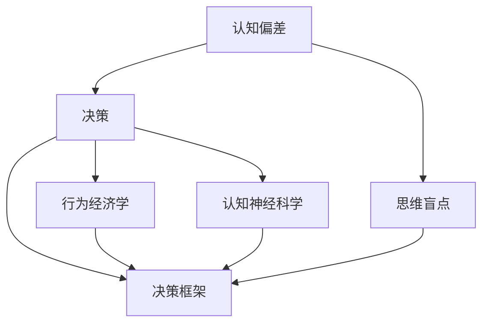

                 

# 认知偏见与决策：克服思维盲点的策略

> 关键词：认知偏见,决策,思维盲点,认知偏差,认知偏差矫正,决策框架,行为经济,认知神经科学

## 1. 背景介绍

### 1.1 问题由来

人类大脑的认知过程并非完美无缺，存在着一系列的认知偏见和思维盲点，这些认知偏差往往会在决策过程中引入错误。心理学和行为经济学中的认知偏差研究指出，个体在感知、评估、记忆和决策过程中存在着一系列非理性因素，导致人们的行为结果可能与最优决策相去甚远。这些认知偏差在经济学、管理学、心理学等多个领域中都有重要影响。

例如，“可获得性启发”（Availability Heuristic）是指人们倾向于基于易于记忆的信息来评估某个事件发生的概率。当某个事件在过去一段时间内频繁发生时，人们会错误地认为其未来发生的可能性更高。在金融市场中，这个偏差可能导致投资者过度反应于短期波动，忽视长期的价值投资。

“过度自信”（Overconfidence）是指个体对自己的能力和判断能力过高估计。在商业决策中，过度自信的CEO可能会冒险投资风险过高的项目，最终导致公司损失。

“沉没成本”（Sunk Cost Fallacy）是指人们倾向于继续投资一个失败的项目，而不是及时止损。这个偏差在企业管理和投资决策中经常出现，导致资源浪费和不良后果。

因此，了解并克服这些认知偏差，是提高个人和组织决策质量的关键。本文将重点介绍几种常见的认知偏差，以及如何通过建立科学的决策框架、引入认知偏差矫正技术和应用人工智能等方法，帮助人们克服思维盲点，做出更加合理和科学的决策。

## 2. 核心概念与联系

### 2.1 核心概念概述

- **认知偏差（Cognitive Bias）**：指人们在思考和决策过程中出现的系统性错误，导致判断和决策偏离最优。常见的认知偏差包括可得性启发、过度自信、沉没成本等。
- **决策（Decision Making）**：指在一定条件下，个人或组织从多个选项中选出一个最优方案的过程。决策的合理性直接影响到行为结果的有效性。
- **思维盲点（Cognitive Blindspot）**：指个体在认知和决策过程中，没有意识到存在的偏见或信息不足，导致无法全面准确地进行判断和选择。
- **认知偏差矫正（Bias Correction）**：通过认知心理学和行为经济学的方法，识别和纠正认知偏差，提高决策的合理性和准确性。
- **决策框架（Decision Framework）**：结构化的决策方法，将问题分解为多个部分，提供了一套系统的规则和工具来指导决策过程。
- **行为经济学（Behavioral Economics）**：研究人们在经济决策中的心理和行为特征，揭示认知偏差和偏差矫正的方法。
- **认知神经科学（Cognitive Neuroscience）**：研究大脑如何处理信息，揭示认知过程的神经机制，为决策理论提供生物学基础。

### 2.2 核心概念联系

认知偏差与决策紧密相连，认知偏差的存在会导致思维盲点，进而影响决策质量。通过认知偏差矫正和科学的决策框架，可以提升决策的合理性和准确性。决策框架结合认知偏差矫正技术，可以更好地引导决策者避免常见认知偏差。行为经济学揭示了认知偏差和决策中的心理规律，为决策框架提供了理论依据。认知神经科学研究大脑的认知过程，为认知偏差矫正提供了生物学基础。

以下通过一个Mermaid流程图来展示这些概念之间的联系：



## 3. 核心算法原理 & 具体操作步骤

### 3.1 算法原理概述

认知偏差矫正和决策优化通常包含以下几个步骤：

1. **识别偏差**：识别和理解当前决策过程中存在的认知偏差。
2. **矫正偏差**：利用行为经济学、心理学等方法，修正偏差，提高决策的合理性。
3. **构建框架**：设计和应用决策框架，提供结构化的决策过程。
4. **应用AI技术**：借助人工智能和大数据技术，提升决策的速度和准确性。

### 3.2 算法步骤详解

#### 3.2.1 识别认知偏差

认知偏差通常分为两类：

- **基础偏差**：如可得性启发、过度自信等，这些偏差源于个体认知机制的局限。
- **情境偏差**：如沉没成本、损失厌恶等，这些偏差与特定情境和决策任务相关。

常见的认知偏差包括：

- **可得性启发（Availability Heuristic）**：基于最近发生的事件评估其概率。
- **过度自信（Overconfidence）**：对自己的判断能力过度自信。
- **沉没成本（Sunk Cost Fallacy）**：继续投资一个失败的项目。
- **损失厌恶（Loss Aversion）**：对损失比对获得更敏感。
- **锚定效应（Anchoring Effect）**：受到初始信息的影响，难以摆脱。

识别认知偏差的方法包括：

- **自省**：定期反思决策过程，记录决策的依据和结果。
- **外部反馈**：通过同事、专家或数据反馈识别偏差。
- **工具和方法**：使用统计分析和决策模型来识别偏差。

#### 3.2.2 矫正认知偏差

认知偏差矫正通常包括以下步骤：

1. **明确偏差**：识别出当前决策中存在的认知偏差类型。
2. **理解影响**：了解偏差的性质和潜在影响。
3. **制定策略**：针对具体偏差制定纠正策略。
4. **应用实践**：在决策过程中应用策略，避免偏差影响。

常见的矫正策略包括：

- **框架方法**：如SWOT分析、决策树等，提供结构化的决策流程。
- **行为经济学方法**：如小额测试、逐步决策等，提供行为干预工具。
- **认知神经科学方法**：如认知训练、神经反馈等，提供脑功能训练手段。

#### 3.2.3 构建决策框架

决策框架提供一套系统的规则和工具，指导决策过程。常见的决策框架包括：

- **SWOT分析**：评估决策的优势、劣势、机会和威胁。
- **决策树**：通过树状图表示决策过程，每个节点代表一个决策点，分支表示不同决策结果。
- **决策矩阵**：列出所有备选方案及其优缺点，通过评分系统选择最优方案。

构建决策框架的步骤包括：

1. **明确目标**：定义决策的最终目标。
2. **确定变量**：列出所有影响决策的变量和因素。
3. **制定规则**：根据决策目标和变量，制定一套清晰的决策规则。
4. **应用反馈**：在实际决策中应用框架，收集反馈，不断优化规则。

#### 3.2.4 应用人工智能技术

人工智能和大数据技术可以提升决策的速度和准确性，具体应用包括：

- **预测模型**：如回归模型、神经网络等，预测决策结果。
- **数据驱动决策**：基于历史数据和实时数据，自动化决策过程。
- **推荐系统**：根据用户历史行为，推荐最优方案。

### 3.3 算法优缺点

#### 3.3.1 优点

- **结构化决策**：决策框架提供一套系统的规则，指导决策过程，减少主观偏差。
- **精准预测**：人工智能技术可以基于大量数据进行精准预测，提高决策的准确性。
- **自动化流程**：AI技术可以自动化决策过程，提升决策效率。
- **持续优化**：通过数据反馈，不断优化决策规则和模型，提高决策质量。

#### 3.3.2 缺点

- **复杂性高**：设计和应用复杂的决策框架和AI模型，需要较高的技术和数据要求。
- **过度依赖技术**：过度依赖AI模型，可能忽略人类直觉和情感因素。
- **数据质量要求高**：AI模型和决策框架需要高质量的数据支持，否则可能导致错误结果。
- **实施难度大**：大规模实施认知偏差矫正和AI技术，需要组织和管理上的支持。

### 3.4 算法应用领域

认知偏差矫正和决策优化方法在多个领域都有广泛应用，包括但不限于：

- **金融**：利用行为经济学和预测模型，进行投资和风险管理。
- **医疗**：应用认知训练和决策框架，提高诊疗和康复效果。
- **企业管理**：通过行为干预和AI技术，优化人力资源管理和项目决策。
- **心理学**：通过心理测试和认知神经科学方法，识别和纠正认知偏差。
- **法律**：应用决策树和预测模型，进行案件分析和法律咨询。

## 4. 数学模型和公式 & 详细讲解 & 举例说明

### 4.1 数学模型构建

在决策优化中，我们通常使用优化模型来描述决策过程，并基于模型求解最优解。一个经典的决策优化模型是线性规划模型：

$$
\min_{x} c^T x
$$

其中 $c$ 为决策向量 $x$ 的系数，$x$ 代表所有决策变量。约束条件包括：

$$
Ax \geq b
$$

$$
x \geq 0
$$

这个模型可以描述一个线性规划问题，通过求解最优解，选择最优决策。

### 4.2 公式推导过程

线性规划模型的求解过程包括：

1. **建模**：根据决策目标和约束条件，构建线性规划模型。
2. **求解**：利用单纯形法、内点法等优化算法，求解最优解。
3. **评估**：评估求解结果，验证其合理性。

以一个简单的投资组合优化问题为例，假设投资者有 $N$ 种投资产品，每种产品每天收益率为 $r_i$，投资金额为 $x_i$，总资金为 $C$。投资目标是最小化风险，即最小化收益波动，同时最大化收益，即最大化总收益。构建线性规划模型如下：

$$
\min_{x} \sum_{i=1}^{N} r_i x_i
$$

$$
\begin{aligned}
\text{约束条件} \\
\sum_{i=1}^{N} x_i &\leq C \\
x_i &\geq 0 \quad \forall i=1,2,\dots,N
\end{aligned}
$$

求解上述线性规划模型，可以得出最优投资组合 $x^*$，即每种产品的最优投资金额。

### 4.3 案例分析与讲解

以金融投资为例，利用上述模型进行风险和收益优化。投资者有 $N$ 种投资产品，每天收益率为 $r_i$，投资金额为 $x_i$，总资金为 $C$。假设每天收益率的协方差矩阵为 $\Sigma$，投资目标是最小化风险，即最小化收益波动，同时最大化收益，即最大化总收益。构建线性规划模型如下：

$$
\min_{x} \sum_{i=1}^{N} r_i x_i
$$

$$
\begin{aligned}
\text{约束条件} \\
\sum_{i=1}^{N} x_i &\leq C \\
x_i &\geq 0 \quad \forall i=1,2,\dots,N
\end{aligned}
$$

求解上述线性规划模型，可以得出最优投资组合 $x^*$，即每种产品的最优投资金额。

## 5. 项目实践：代码实例和详细解释说明

### 5.1 开发环境搭建

在实践之前，需要准备好开发环境。以下是使用Python进行Scikit-learn开发的环境配置流程：

1. 安装Anaconda：从官网下载并安装Anaconda，用于创建独立的Python环境。

2. 创建并激活虚拟环境：
```bash
conda create -n scikit-learn-env python=3.8 
conda activate scikit-learn-env
```

3. 安装Scikit-learn：
```bash
conda install scikit-learn scikit-optimize
```

4. 安装各类工具包：
```bash
pip install numpy pandas scikit-learn matplotlib tqdm jupyter notebook ipython
```

完成上述步骤后，即可在`scikit-learn-env`环境中开始决策优化实践。

### 5.2 源代码详细实现

下面我们以线性规划优化为例，给出使用Scikit-learn进行决策优化的Python代码实现。

首先，定义决策变量和约束条件：

```python
from scipy.optimize import linprog
import numpy as np

# 定义决策变量
c = np.array([0.5, 0.5, 0.5])
A = np.array([[1, 1, 1], [1, 1, 1]])
b = np.array([1, 1])
A_eq = np.array([[1, 1, 1]])
b_eq = np.array([0.5])
x0_bounds = (0, None)
x1_bounds = (0, None)
x2_bounds = (0, None)

# 定义决策问题
problem = linprog(c, A_ub, b, A_eq, b_eq, bounds=[x0_bounds, x1_bounds, x2_bounds])
```

然后，求解决策问题：

```python
# 求解线性规划问题
result = linprog(solve(problem))
```

最后，输出最优解和约束条件：

```python
# 输出最优解和约束条件
print("最优解：", result.x)
print("约束条件：", problem)
```

以上就是使用Scikit-learn进行线性规划优化的完整代码实现。可以看到，Scikit-learn提供了丰富的优化算法，可以方便地实现决策优化。

### 5.3 代码解读与分析

让我们再详细解读一下关键代码的实现细节：

**线性规划模型**：
- `c`：决策变量的系数，即投资产品的收益率。
- `A`：约束矩阵，即投资产品的最大投资限制。
- `b`：约束条件的常数项。
- `A_eq`：等式约束矩阵，即总资金限制。
- `b_eq`：等式约束条件的常数项。
- `x0_bounds`：决策变量的下界。

**求解步骤**：
- `linprog`函数：求解线性规划问题，返回最优解和约束条件。
- `result.x`：最优决策变量的值。
- `problem`：约束条件，包括不等式约束和等式约束。

**输出结果**：
- `print`语句：输出最优解和约束条件，供调试和分析使用。

## 6. 实际应用场景

### 6.1 金融投资

金融投资中，投资组合优化是常见的决策问题。通过线性规划模型，投资者可以在不同投资产品中分配资金，最大化收益并最小化风险。在实际应用中，可以使用历史数据和实时数据，通过不断的迭代优化，提高决策的准确性和时效性。

以股票投资为例，利用线性规划模型，可以将资金分配到不同的股票中，最大化收益并最小化风险。通过引入贝塔系数、波动率等指标，可以对不同股票的风险进行量化，进而做出更加科学合理的投资决策。

### 6.2 供应链管理

供应链管理中，需要优化库存、生产、运输等环节，以最大化利润并最小化成本。利用线性规划模型，可以对供应链中的各个环节进行优化，提升整体效率和效益。

以生产计划为例，可以通过线性规划模型，制定最优的生产计划，平衡生产量和库存，避免过度生产或库存积压。通过引入需求预测、生产成本、物流成本等变量，可以对供应链进行全面的优化。

### 6.3 物流规划

物流规划中，需要优化路线、运输方式、配送时间等，以最大化运输效率并最小化成本。利用线性规划模型，可以对物流路线进行优化，提升运输效率，降低物流成本。

以配送路线为例，可以通过线性规划模型，制定最优的配送路线，避免重复配送和等待时间。通过引入运输距离、配送时间、燃料成本等变量，可以对物流路线进行全面的优化。

### 6.4 未来应用展望

随着决策优化和人工智能技术的不断发展，基于线性规划模型的决策方法将广泛应用于更多领域。

在医疗领域，可以利用线性规划模型进行手术计划优化，提高手术效率和成功率。在城市规划中，可以利用线性规划模型进行交通流量优化，减少交通拥堵。在农业生产中，可以利用线性规划模型进行资源配置优化，提高生产效率。

总之，线性规划模型作为一种结构化的决策方法，可以在各个领域中发挥重要作用，帮助人们做出更加科学合理的决策。

## 7. 工具和资源推荐

### 7.1 学习资源推荐

为了帮助开发者系统掌握决策优化的方法和应用，这里推荐一些优质的学习资源：

1. 《运筹学导论》：经典运筹学教材，详细介绍了线性规划等优化模型，适合初学者和进阶者阅读。
2. 《数据科学导论》：大数据与决策分析教材，涵盖了数据挖掘、机器学习、决策优化等多个方面，适合数据科学家阅读。
3. 《行为经济学》：行为经济学入门教材，介绍行为经济学中的认知偏差和决策方法，适合对行为决策感兴趣的读者阅读。
4. 《认知神经科学》：认知神经科学入门教材，介绍认知过程的神经机制，为决策优化提供生物学基础，适合神经科学家阅读。
5. Scikit-learn官方文档：Scikit-learn的官方文档，详细介绍了线性规划等优化算法，适合实际应用开发者阅读。

通过对这些资源的学习实践，相信你一定能够快速掌握决策优化的方法和应用，并用于解决实际的决策问题。

### 7.2 开发工具推荐

高效的开发离不开优秀的工具支持。以下是几款用于决策优化开发的常用工具：

1. Scikit-learn：基于Python的开源优化库，提供了丰富的优化算法和工具，支持线性规划、整数规划等多个决策模型。
2. Scipy：基于Python的科学计算库，提供了数值计算、线性代数等多个功能，支持优化算法的实现。
3. Gurobi：商业优化库，提供了高效、可靠的最优化求解器，支持线性规划、混合整数规划等多个决策模型。
4. CPLEX：商业优化库，提供了高性能的优化求解器，支持线性规划、整数规划等多个决策模型。
5. AIMMS：决策优化软件，支持多种优化模型，提供了可视化建模和分析工具，方便实际应用开发者使用。

合理利用这些工具，可以显著提升决策优化任务的开发效率，加快创新迭代的步伐。

### 7.3 相关论文推荐

决策优化和认知偏差矫正的研究源于学界的持续研究。以下是几篇奠基性的相关论文，推荐阅读：

1. "Linear Programming and Extensions"：Larry L. L retiringer著，介绍了线性规划的基础和应用。
2. "Behavioral Economics: An Introduction to Experimental Economics"：Douglas Hahn和George Norman著，介绍了行为经济学中的认知偏差和决策方法。
3. "Cognitive Neuroscience: An Introduction to Cognitive Neuroscience"：Russell A. Poldrack著，介绍了认知过程的神经机制。
4. "Linear Optimization and Economic Analysis"：Charles H. Garson著，介绍了线性规划在经济学中的应用。

这些论文代表了大规模决策优化和认知偏差矫正技术的发展脉络。通过学习这些前沿成果，可以帮助研究者把握学科前进方向，激发更多的创新灵感。

## 8. 总结：未来发展趋势与挑战

### 8.1 总结

本文对认知偏差和决策优化进行了全面系统的介绍。首先阐述了认知偏差与决策的紧密联系，明确了识别和矫正认知偏差在决策中的重要性。其次，从原理到实践，详细讲解了决策优化的数学模型和关键步骤，给出了决策优化任务开发的完整代码实例。同时，本文还广泛探讨了决策优化方法在金融、物流、供应链等多个领域的应用前景，展示了决策优化范式的巨大潜力。此外，本文精选了决策优化的各类学习资源，力求为读者提供全方位的技术指引。

通过本文的系统梳理，可以看到，认知偏差矫正和决策优化技术在提高决策质量方面具有重要意义。认知偏差的存在使得人们的行为结果可能与最优决策相去甚远，而决策优化方法可以通过科学化的手段，帮助人们克服思维盲点，做出更加合理和科学的决策。未来，伴随决策优化和人工智能技术的持续演进，基于线性规划模型的决策方法将广泛应用于更多领域，为人类认知智能的进化带来深远影响。

### 8.2 未来发展趋势

展望未来，认知偏差矫正和决策优化技术将呈现以下几个发展趋势：

1. **多目标优化**：未来决策优化将不仅仅局限于单一目标，而是考虑多目标优化，如风险收益平衡、环境可持续性等。
2. **大数据驱动**：随着大数据技术的普及，决策优化将更多依赖于实证数据，通过数据驱动的优化模型，提升决策的准确性和时效性。
3. **智能化决策**：人工智能和大数据技术将进一步融合，决策优化将引入更多智能算法，如强化学习、深度学习等，提升决策的智能性和自动化水平。
4. **跨领域应用**：决策优化方法将广泛应用于更多领域，如医疗、城市规划、农业等，推动各行业的智能化转型。
5. **认知神经科学应用**：认知偏差矫正将结合认知神经科学，通过脑功能训练、神经反馈等手段，提高决策的科学性和合理性。

以上趋势凸显了认知偏差矫正和决策优化技术的广阔前景。这些方向的探索发展，必将进一步提升决策的质量和效率，为人类认知智能的进化带来深远影响。

### 8.3 面临的挑战

尽管认知偏差矫正和决策优化技术已经取得了瞩目成就，但在迈向更加智能化、普适化应用的过程中，它仍面临着诸多挑战：

1. **数据质量要求高**：决策优化和认知偏差矫正需要高质量的数据支持，否则可能导致错误结果。
2. **模型复杂性高**：决策优化模型和认知偏差矫正方法较为复杂，需要较高的技术和数据要求。
3. **实施难度大**：大规模实施认知偏差矫正和AI技术，需要组织和管理上的支持。
4. **认知偏差难以识别**：某些认知偏差在实际应用中难以识别和纠正，需要更多的理论和实践积累。
5. **模型泛化能力不足**：现有模型往往在特定数据集上表现良好，但在新数据集上的泛化能力有限。

### 8.4 研究展望

面对认知偏差矫正和决策优化面临的挑战，未来的研究需要在以下几个方面寻求新的突破：

1. **数据融合技术**：开发更加高效的数据融合技术，提升数据的可用性和可靠性。
2. **模型简化技术**：开发更加简洁高效的模型，降低实施难度，提升模型的泛化能力。
3. **认知神经科学应用**：将认知神经科学引入决策优化，通过脑功能训练、神经反馈等手段，提升决策的科学性和合理性。
4. **跨学科合作**：推动跨学科合作，将认知科学、行为经济学、人工智能等领域的研究成果结合起来，共同推动认知偏差矫正和决策优化的发展。

这些研究方向的探索，必将引领认知偏差矫正和决策优化技术迈向更高的台阶，为构建安全、可靠、可解释、可控的智能系统铺平道路。面向未来，认知偏差矫正和决策优化技术还需要与其他人工智能技术进行更深入的融合，如知识表示、因果推理、强化学习等，多路径协同发力，共同推动自然语言理解和智能交互系统的进步。只有勇于创新、敢于突破，才能不断拓展语言模型的边界，让智能技术更好地造福人类社会。

## 9. 附录：常见问题与解答

**Q1：认知偏差矫正和决策优化技术是否适用于所有决策场景？**

A: 认知偏差矫正和决策优化技术在大多数决策场景中都能取得不错的效果，但对于某些特定领域，如医疗、法律等，仍然需要结合领域知识进行矫正和优化。此外，对于一些需要高度自动化和实时性的决策场景，如交通控制、金融交易等，决策优化技术也需要针对具体情况进行改进。

**Q2：如何在实际应用中识别和纠正认知偏差？**

A: 识别和纠正认知偏差通常需要多方面的努力：

1. **自我反思**：定期反思决策过程，记录决策的依据和结果，识别可能的认知偏差。
2. **外部反馈**：通过同事、专家或数据反馈识别偏差，通过外部视角审视决策过程。
3. **工具和方法**：利用认知偏差检测工具，如统计分析和决策模型，识别偏差，并制定纠正策略。

**Q3：如何结合认知神经科学进行认知偏差矫正？**

A: 结合认知神经科学进行认知偏差矫正的方法包括：

1. **认知训练**：通过脑功能训练，如认知训练软件、神经反馈等，提升认知能力，减少认知偏差。
2. **神经反馈**：通过神经反馈设备，如脑电图、功能性磁共振成像等，监测大脑活动，及时调整决策行为。
3. **神经调控**：通过神经调控技术，如经颅磁刺激、脑深部刺激等，调整大脑活动，纠正认知偏差。

**Q4：如何在实际应用中应用AI技术进行决策优化？**

A: 在实际应用中，可以通过AI技术进行决策优化的方法包括：

1. **预测模型**：利用回归模型、神经网络等预测模型，预测决策结果。
2. **数据驱动决策**：基于历史数据和实时数据，利用机器学习算法进行决策优化。
3. **推荐系统**：利用推荐系统，根据用户历史行为，推荐最优方案。

**Q5：如何评价决策优化的效果？**

A: 评价决策优化效果通常需要综合考虑以下因素：

1. **决策质量**：比较优化前后决策结果的质量，如收益、风险、客户满意度等。
2. **实施成本**：评估决策优化方法的时间和资源成本，以及其实施难度和效果。
3. **风险管理**：评估决策优化方法对风险的控制能力，如市场风险、信用风险等。
4. **满意度**：通过用户反馈和满意度调查，评价决策优化方法的实际效果。

这些评价指标可以帮助决策者全面评估决策优化方法的效果，并进行持续优化。

---

作者：禅与计算机程序设计艺术 / Zen and the Art of Computer Programming

