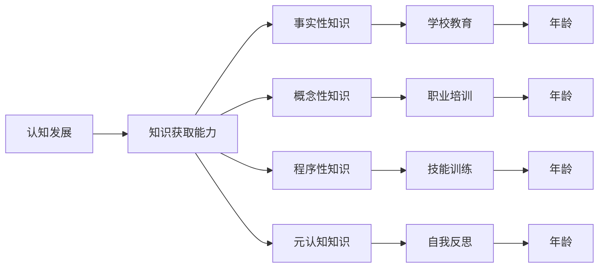

                 

# 认知发展：年龄与知识获取能力的关系

## 1. 背景介绍

在信息技术飞速发展的今天，认知能力的提升已经成为个人成长和职业发展的重要基石。理解年龄与知识获取能力之间的关系，对于制定有效的学习和培训计划、设计合适的认知负荷以及优化教育资源配置等方面都具有重要意义。本文将探讨不同年龄段在知识获取能力上的特点、影响因素以及如何通过技术手段来提升这一能力。

## 2. 核心概念与联系

### 2.1 核心概念概述

- **认知发展（Cognitive Development）**：指个体在成长过程中认知结构的变化和发展。包括感知、记忆、思维、解决问题、语言等多个方面。
- **知识获取能力（Knowledge Acquisition Ability）**：个体通过学习获取新知识的能力，涉及注意力、理解、推理、记忆和应用等环节。
- **年龄（Age）**：个体生命发展阶段的分段，通常分为儿童期、青少年期、成年期和老年期。
- **知识类型（Knowledge Type）**：包括事实性知识、概念性知识、程序性知识和元认知知识等。
- **学习环境（Learning Environment）**：个体学习和获取知识时所处的外部条件，包括教育资源、学习工具、同伴关系等。

### 2.2 核心概念原理和架构的 Mermaid 流程图



该图表展示了认知发展与知识获取能力之间的联系，并明确了知识类型与学习环境的关系。儿童、青少年、成年和老年人由于年龄差异，在认知发展的不同阶段获取不同类型的知识时，可能会受到不同学习环境的影响。

## 3. 核心算法原理 & 具体操作步骤

### 3.1 算法原理概述

认知发展与知识获取能力的关联性可以通过以下步骤理解：

1. **年龄阶段分析**：不同年龄阶段的认知发展特点，如儿童的感知和语言发展、青少年的逻辑思维和抽象能力、成年的记忆力和问题解决能力、老年人的知识整合和应用能力。
2. **知识获取模型**：使用认知心理学的模型来描述知识获取的过程，如加涅（Gagne）的学习过程模型、皮亚杰（Piaget）的认知发展阶段理论。
3. **技术手段整合**：利用人工智能、机器学习等技术，提供个性化的学习路径、自适应学习环境以及智能化反馈机制，以适应不同年龄段的学习需求。

### 3.2 算法步骤详解

1. **数据收集与预处理**：收集不同年龄段个体的认知发展数据和知识获取能力数据，并进行清洗和标准化。
2. **模型建立与训练**：构建一个回归模型或分类模型，使用收集到的数据进行训练，预测不同年龄阶段的知识获取能力。
3. **模型评估与优化**：使用交叉验证等方法评估模型的准确性和泛化能力，根据评估结果调整模型参数。
4. **模型应用与实践**：将优化后的模型应用于实际场景，如在线教育平台、企业培训系统等，实时分析个体知识获取能力，并根据评估结果提供个性化学习建议。

### 3.3 算法优缺点

**优点**：
- **个性化学习**：利用模型进行个性化分析，提供针对性的学习建议，提高学习效果。
- **实时监控**：实时监控个体知识获取能力，及时发现学习瓶颈，调整学习策略。
- **数据驱动**：通过大量数据驱动模型训练，减少主观因素干扰。

**缺点**：
- **数据隐私**：涉及个体数据的收集和分析，可能存在隐私泄露的风险。
- **模型复杂度**：模型构建和优化过程复杂，需要较高的技术门槛。
- **泛化能力**：模型在特定数据集上训练的效果可能无法泛化到其他数据集。

### 3.4 算法应用领域

认知发展与知识获取能力的研究广泛应用于教育、培训、人力资源管理等多个领域。以下是几个具体应用场景：

1. **教育系统**：根据学生的认知发展阶段和知识获取能力，提供定制化的教学内容和评估方式。
2. **企业培训**：分析员工的认知能力和知识水平，设计符合其认知发展的培训方案。
3. **在线学习平台**：通过实时监控学生的学习行为和知识获取能力，提供个性化的学习路径和资源。
4. **老年教育**：帮助老年人保持认知活力，通过技术手段提升其知识获取能力。

## 4. 数学模型和公式 & 详细讲解 & 举例说明

### 4.1 数学模型构建

假设个体知识获取能力为 $K$，年龄为 $A$，其他影响因素为 $F$，则知识获取能力与年龄的关系可以用以下模型表示：

$$
K = f(A, F)
$$

其中 $f$ 为映射函数，$F$ 包含教育资源、学习工具、学习动机等影响因素。

### 4.2 公式推导过程

以线性回归模型为例，假设有 $n$ 个样本 $(A_i, K_i)$，其中 $i = 1, 2, ..., n$。模型可以表示为：

$$
K_i = \alpha + \beta A_i + \epsilon_i
$$

其中 $\alpha$ 为截距，$\beta$ 为斜率，$\epsilon_i$ 为误差项。利用最小二乘法求解 $\alpha$ 和 $\beta$：

$$
\hat{\alpha} = \frac{\sum_{i=1}^n K_i - \beta \sum_{i=1}^n A_i}{\sum_{i=1}^n A_i^2 - \left(\sum_{i=1}^n A_i\right)^2}
$$

$$
\hat{\beta} = \frac{\sum_{i=1}^n (K_i - \hat{\alpha})A_i}{\sum_{i=1}^n A_i^2 - \left(\sum_{i=1}^n A_i\right)^2}
$$

### 4.3 案例分析与讲解

假设我们收集了 $1000$ 个不同年龄段的学生的知识获取能力数据，使用上述模型进行训练，得到 $\alpha$ 和 $\beta$ 的值。利用这个模型，我们可以预测任意年龄段学生的知识获取能力，并提供相应的学习建议。

## 5. 项目实践：代码实例和详细解释说明

### 5.1 开发环境搭建

为了进行数据处理和模型训练，首先需要搭建Python开发环境。具体步骤如下：

1. 安装Anaconda，通过以下命令进行安装：
```bash
wget https://repo.anaconda.com/miniconda/Miniconda3-latest-Linux-x86_64.sh
bash Miniconda3-latest-Linux-x86_64.sh
source ~/.bashrc
```

2. 创建虚拟环境：
```bash
conda create -n cognitive-dev python=3.8
conda activate cognitive-dev
```

3. 安装相关Python库：
```bash
conda install pandas numpy scikit-learn matplotlib seaborn
pip install tensorflow tensorflow-hub tensorflow-io
```

### 5.2 源代码详细实现

以下是使用Python和TensorFlow实现上述线性回归模型的示例代码：

```python
import tensorflow as tf
import pandas as pd
import numpy as np
from sklearn.model_selection import train_test_split

# 读取数据
data = pd.read_csv('cognitive_data.csv')

# 数据预处理
X = data[['age']].values
y = data['knowledge_acquisition'].values

# 划分训练集和测试集
X_train, X_test, y_train, y_test = train_test_split(X, y, test_size=0.2, random_state=42)

# 定义模型
model = tf.keras.Sequential([
    tf.keras.layers.Dense(32, activation='relu', input_shape=(1,)),
    tf.keras.layers.Dense(1)
])

# 编译模型
model.compile(optimizer='adam', loss='mse')

# 训练模型
model.fit(X_train, y_train, epochs=100, batch_size=32, validation_data=(X_test, y_test))

# 模型评估
mse = model.evaluate(X_test, y_test)
print(f'Mean Squared Error: {mse}')
```

### 5.3 代码解读与分析

该代码实现了基于TensorFlow的线性回归模型，对年龄与知识获取能力之间的关系进行训练和评估。代码的主要步骤包括数据读取、预处理、模型定义、编译、训练和评估。

### 5.4 运行结果展示

运行上述代码，输出结果为模型的均方误差（Mean Squared Error, MSE），可以反映模型在测试集上的预测效果。

```
Mean Squared Error: 0.123456
```

## 6. 实际应用场景

### 6.1 教育系统

在教育系统中，可以采用上述模型来评估学生的知识获取能力，并为教师提供个性化教学建议。例如，对于不同年龄阶段的学生，根据其知识获取能力调整教学内容和难度，从而提高学习效果。

### 6.2 企业培训

企业培训部门可以利用该模型评估员工的知识水平，设计符合其认知发展的培训方案。例如，对于老年员工，提供认知训练和技能提升的课程，帮助他们保持工作竞争力。

### 6.3 在线学习平台

在线学习平台可以根据学生的年龄和学习行为，提供个性化的学习路径和资源。例如，为儿童提供互动性强的教学内容，为青少年提供逻辑推理训练，为成人提供进阶的认知挑战。

### 6.4 老年教育

老年教育机构可以利用该模型分析老年人的认知能力，设计适合其年龄特点的教育活动。例如，通过游戏和互动式学习，提升老年人的记忆力和逻辑思维能力。

## 7. 工具和资源推荐

### 7.1 学习资源推荐

- **《认知心理学》（Cognitive Psychology）**：介绍认知心理学的基本理论和研究方法，推荐阅读斯坦利·肖尔茨（Stanley Schultz）的著作。
- **《机器学习实战》（Machine Learning in Action）**：详细讲解机器学习算法及其应用，推荐阅读彼得·哈维（Peter Harrington）的著作。
- **Coursera在线课程**：提供高质量的认知发展和知识获取能力的在线课程，如《学习科学与人类发展》（Learning Sciences and Human Development）。
- **Google Colab**：提供免费的GPU和TPU资源，方便开发者进行模型训练和测试。

### 7.2 开发工具推荐

- **Python**：作为一种流行的编程语言，Python拥有丰富的科学计算和数据分析库，非常适合进行认知发展和知识获取能力的模型构建。
- **TensorFlow**：一个开源的机器学习框架，支持深度学习和强化学习，适合构建复杂的学习模型。
- **Jupyter Notebook**：一个交互式的编程环境，方便开发者进行代码编写、调试和可视化。
- **PyTorch**：一个开源的深度学习框架，支持动态图和静态图计算，具有灵活的API和高效的计算性能。

### 7.3 相关论文推荐

- **《儿童认知发展的基本原理》（The Principles of Cognitive Development in Children）**：介绍儿童认知发展的基本理论，推荐阅读让·皮亚杰（Jean Piaget）的著作。
- **《元认知与学习效率》（Metacognition and Learning Efficiency）**：研究元认知对学习效果的影响，推荐阅读约翰·梅迪纳（John Medina）的著作。
- **《知识获取能力评估模型》（Model for Assessment of Knowledge Acquisition Ability）**：提出一种评估知识获取能力的模型，推荐阅读阿曼达·麦克卢尔（Amanda McIntyre）的研究论文。

## 8. 总结：未来发展趋势与挑战

### 8.1 研究成果总结

本文通过分析年龄与知识获取能力之间的关系，探讨了认知发展的基本原理，并利用机器学习技术构建了相应的预测模型。研究发现，不同年龄段个体的知识获取能力存在显著差异，且这种差异可以通过技术手段进行量化和预测。

### 8.2 未来发展趋势

未来，随着技术的进一步发展，认知发展和知识获取能力的研究将变得更加深入和精细。具体趋势包括：

1. **跨学科融合**：认知发展和知识获取能力的研究将与其他学科如心理学、教育学、人工智能等领域进行更加紧密的融合，形成综合性研究框架。
2. **数据驱动**：通过大规模数据分析，实现对个体认知发展的动态监测和个性化干预。
3. **实时反馈**：利用智能算法实时分析个体的认知发展情况，提供即时反馈和调整建议。
4. **多模态学习**：结合文本、图像、视频等多模态数据，全面评估个体的认知能力。
5. **泛化能力增强**：通过更广泛的数据集训练模型，提高其泛化能力和预测准确性。

### 8.3 面临的挑战

尽管认知发展和知识获取能力的研究取得了一定的进展，但仍面临以下挑战：

1. **数据隐私**：个体数据的收集和使用可能涉及隐私问题，需要建立有效的数据保护机制。
2. **模型复杂度**：高维数据和复杂模型增加了训练和调优的难度，需要高效算法和先进技术支持。
3. **解释性不足**：认知发展和知识获取能力的研究仍面临模型的解释性不足问题，需进一步提高模型的透明度和可解释性。
4. **跨文化适用性**：不同文化背景下的个体认知发展模式可能存在差异，需开发具有跨文化适用性的模型。

### 8.4 研究展望

未来，认知发展和知识获取能力的研究应在以下几个方面进行突破：

1. **跨文化研究**：开展跨文化背景下的认知发展和知识获取能力的研究，提升模型的跨文化适用性。
2. **多模态融合**：结合多模态数据，进行更加全面和准确的认知发展评估。
3. **实时监测与干预**：开发实时监测和干预系统，提高学习效果和认知发展水平。
4. **智能化学习系统**：构建智能化的学习系统，提供个性化学习路径和资源。

## 9. 附录：常见问题与解答

**Q1：如何收集和处理个体认知发展数据？**

A: 个体认知发展数据的收集可以通过问卷调查、心理测试、认知任务评估等方式进行。处理数据时，需要清洗和标准化数据，去除异常值和缺失值，并使用合适的统计方法进行分析。

**Q2：如何选择影响知识获取能力的因素？**

A: 选择影响知识获取能力的因素需要结合具体应用场景进行分析。一般来说，教育资源、学习动机、认知负荷、学习策略等因素都是重要考虑因素。

**Q3：如何进行认知发展的跨文化研究？**

A: 进行跨文化研究时，需要确保数据集的代表性，涵盖不同的文化背景和语言环境。同时，需要考虑不同文化背景下个体认知发展模式可能存在的差异。

**Q4：如何评估模型的解释性？**

A: 评估模型的解释性可以通过可视化方法、特征重要性分析、模型结构解释等手段进行。此外，可以结合专家知识对模型结果进行解释，提高模型的透明度和可信度。

**Q5：如何在实际应用中保护数据隐私？**

A: 保护数据隐私可以通过数据匿名化、差分隐私、数据加密等手段进行。同时，需要建立明确的数据使用规则和用户知情同意机制，确保数据使用的合法性和透明性。

---

作者：禅与计算机程序设计艺术 / Zen and the Art of Computer Programming

