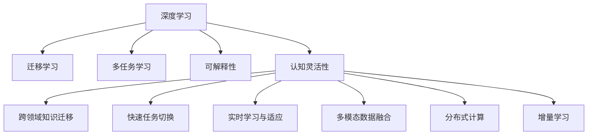

                 

## 1. 背景介绍

### 1.1 问题由来

在当前快速变化的数字化时代，个人、企业和组织都需要面对复杂多变的挑战和机遇。认知灵活性（Cognitive Flexibility），即快速适应新信息和快速调整认知策略的能力，成为应对这些挑战的核心能力。认知灵活性不仅关乎个人的学习、工作和创新，也决定了组织在快速变化市场中的生存和发展。

过去数十年，信息技术的快速发展使得工作和生活环境更加复杂，任务之间的联系更加紧密。然而，传统的人工智能（AI）模型在处理复杂任务和任务切换时常常面临“认知刚性”（Cognitive Rigidity）的问题。这些问题表现为：模型难以快速适应新环境，处理新数据和执行新任务时表现欠佳。

认知灵活性成为当今信息时代的一个关键议题。认知灵活性不仅要求AI模型具备适应变化的能力，还要求具备学习新知识、迁移已有知识到新场景的能力。近年来，这一能力在深度学习和认知科学领域引起了广泛关注，成为学术界和工业界研究的热点方向之一。

### 1.2 问题核心关键点

认知灵活性可以通过以下关键点进行理解：

1. **跨领域知识迁移**：将在一个领域学到的知识应用到另一个领域，避免从零开始学习。
2. **快速任务切换**：在不同任务之间快速切换，避免“认知锁定”。
3. **实时学习与适应**：实时学习新数据和新任务，适应环境变化。
4. **多模态数据融合**：处理文本、图像、声音等多模态数据，提供更丰富的上下文信息。
5. **分布式计算**：分布式训练和推理，提高计算效率和模型鲁棒性。
6. **增量学习**：通过增量式学习，持续改进模型性能。
7. **可解释性与透明度**：模型应具备一定的可解释性，便于理解、调试和优化。

这些关键点构成了认知灵活性研究的框架，在深度学习领域尤其重要。深度学习模型往往存在"认知刚性"的问题，需要通过认知灵活性研究来缓解。

## 2. 核心概念与联系

### 2.1 核心概念概述

为了更好地理解认知灵活性，我们首先介绍几个核心概念：

- **深度学习**：一种基于人工神经网络的学习方法，通过大量数据训练，实现对复杂模式的识别和预测。深度学习在图像识别、自然语言处理、语音识别等领域取得了显著成效。
- **迁移学习**：一种通过已学习知识迁移到新任务上的学习方式，可以减少新任务的训练时间，提高模型性能。
- **多任务学习**：一种同时学习多个相关任务的模型训练方法，可以提高模型的泛化能力和性能。
- **可解释性**：模型输出的可解释性，即对模型决策过程的解释，便于理解和调试。
- **认知灵活性**：指在复杂环境中快速适应新信息和任务切换的能力，是人工智能系统应对变化的核心能力。

这些核心概念之间的关系可以通过以下Mermaid流程图来展示：



这个流程图展示了核心概念之间的关系：

1. 深度学习是认知灵活性研究的基础。
2. 迁移学习是认知灵活性实现的重要方法之一。
3. 多任务学习是提高认知灵活性的有效途径。
4. 可解释性是认知灵活性研究的重要目标之一。
5. 认知灵活性涉及认知刚性问题的缓解，包含多个关键点。

## 3. 核心算法原理 & 具体操作步骤

### 3.1 算法原理概述

认知灵活性通过以下算法原理实现：

- **跨领域知识迁移**：通过迁移学习，将一个领域学到的知识应用到另一个领域。这种方法可以减少新任务的训练时间，提高模型性能。
- **快速任务切换**：通过多任务学习，模型可以同时学习多个相关任务，提高适应新任务的能力。
- **实时学习与适应**：通过增量学习，模型能够持续改进，适应环境变化。
- **多模态数据融合**：通过融合文本、图像、声音等多模态数据，提供更丰富的上下文信息，提高模型的理解能力。
- **分布式计算**：通过分布式训练和推理，提高计算效率和模型鲁棒性。
- **可解释性**：通过可解释性技术，使模型具备一定的透明度，便于理解、调试和优化。

### 3.2 算法步骤详解

认知灵活性的实现包括以下关键步骤：

**Step 1: 数据准备与预处理**

- 收集多领域、多模态的数据集。
- 对数据进行清洗、标注和预处理，确保数据质量和一致性。

**Step 2: 模型选择与初始化**

- 选择适合当前任务的深度学习模型。
- 对模型进行初始化，使用迁移学习、多任务学习或预训练模型作为初始参数。

**Step 3: 跨领域知识迁移**

- 在源领域训练模型，获得通用特征。
- 将通用特征迁移到目标领域，进行微调。

**Step 4: 快速任务切换**

- 在多任务学习框架下，同时训练多个相关任务。
- 在任务切换时，快速调整模型参数，适应新任务。

**Step 5: 实时学习与适应**

- 在增量学习框架下，持续更新模型，适应新数据和新任务。
- 定期评估模型性能，优化参数。

**Step 6: 多模态数据融合**

- 通过融合不同模态的数据，提供更丰富的上下文信息。
- 训练支持多模态数据处理的模型，提高理解能力。

**Step 7: 分布式计算**

- 使用分布式计算框架，并行训练和推理模型。
- 优化分布式计算的效率和资源利用率。

**Step 8: 可解释性**

- 使用可解释性技术，如注意力机制、可视化工具等，提高模型透明度。
- 对模型决策过程进行解释，便于理解、调试和优化。

### 3.3 算法优缺点

认知灵活性算法具有以下优点：

- 提高了模型适应新任务的能力。
- 减少了新任务的训练时间，提高了模型性能。
- 提高了模型在复杂环境中的鲁棒性和泛化能力。
- 提高了模型的实时学习和适应能力。

同时，这些算法也存在一些局限性：

- 数据准备和预处理工作量较大，需要大量标注数据。
- 模型复杂度高，训练和推理成本高。
- 可解释性可能不够充分，模型决策过程难以理解。
- 对数据质量要求较高，数据噪声和偏差可能影响模型性能。

尽管存在这些局限性，但认知灵活性算法在提高模型适应性和性能方面具有显著优势，是当前深度学习研究的热点方向之一。

### 3.4 算法应用领域

认知灵活性算法已经在多个领域得到应用，例如：

- **自然语言处理（NLP）**：通过跨领域知识迁移和多任务学习，提高模型的泛化能力，如多语种翻译、情感分析、文本摘要等。
- **计算机视觉（CV）**：通过融合多模态数据和分布式计算，提高模型的鲁棒性和泛化能力，如图像分类、目标检测、图像生成等。
- **语音识别**：通过实时学习与适应和多任务学习，提高模型对语音环境变化的适应能力。
- **推荐系统**：通过跨领域知识迁移和多任务学习，提高模型的个性化推荐能力。
- **医疗健康**：通过跨领域知识迁移和实时学习，提高模型的诊断和治疗建议能力。

## 4. 数学模型和公式 & 详细讲解 & 举例说明

### 4.1 数学模型构建

本节将使用数学语言对认知灵活性算法进行更加严格的刻画。

假设一个多任务学习框架，其中包含 $M$ 个相关任务 $T_1, T_2, ..., T_M$。设每个任务的数据集为 $D_i=\{(x_{i,j}, y_{i,j})\}_{j=1}^{n_i}$，其中 $x_{i,j}$ 为输入数据，$y_{i,j}$ 为标签。设每个任务 $T_m$ 的损失函数为 $\ell_m(x, y)$，总损失函数为 $\mathcal{L}(\theta) = \frac{1}{N}\sum_{i=1}^M\sum_{j=1}^{n_i}\ell_m(x_{i,j}, y_{i,j})$。

模型参数 $\theta$ 的更新公式为：

$$
\theta \leftarrow \theta - \eta \nabla_{\theta}\mathcal{L}(\theta) - \eta\lambda\theta
$$

其中 $\eta$ 为学习率，$\lambda$ 为正则化系数。

### 4.2 公式推导过程

以下我们以多任务学习中的迁移学习为例，推导参数更新的公式。

假设在任务 $T_s$ 上训练好的模型为 $M_s(\theta_s)$，其中 $\theta_s$ 为在 $T_s$ 上训练得到的模型参数。现在将该模型迁移到任务 $T_t$ 上，进行微调。设微调后的模型为 $M_t(\theta_t)$，其中 $\theta_t$ 为微调后的模型参数。

设在 $T_s$ 上训练得到的通用特征 $f_s(\theta_s, x)$，则在 $T_t$ 上进行微调的损失函数为：

$$
\ell_t(\theta_t, x) = \ell_{T_t}(M_t(\theta_t, x), y_{T_t})
$$

根据梯度下降法，微调的优化目标为最小化损失函数：

$$
\min_{\theta_t} \mathcal{L}(\theta_t) = \frac{1}{N}\sum_{i=1}^N \ell_t(\theta_t, x_i)
$$

将通用特征 $f_s(\theta_s, x)$ 代入损失函数：

$$
\mathcal{L}(\theta_t) = \frac{1}{N}\sum_{i=1}^N \ell_{T_t}(\theta_t, f_s(\theta_s, x_i))
$$

将通用特征 $f_s(\theta_s, x)$ 的梯度展开：

$$
\nabla_{\theta_t}\mathcal{L}(\theta_t) = \frac{1}{N}\sum_{i=1}^N \nabla_{\theta_t}\ell_{T_t}(\theta_t, f_s(\theta_s, x_i))
$$

将 $\theta_t$ 分解为 $\theta_s$ 和 $\Delta\theta$：

$$
\theta_t = \theta_s + \Delta\theta
$$

代入梯度更新公式：

$$
\Delta\theta \leftarrow \eta (\nabla_{\theta_t}\mathcal{L}(\theta_t) + \lambda\theta_t) - \eta \nabla_{\theta_t}\mathcal{L}(\theta_s)
$$

因此，参数更新的公式为：

$$
\theta_s \leftarrow \theta_s - \eta \nabla_{\theta_s}\mathcal{L}(\theta_s) - \eta\lambda\theta_s
$$

$$
\Delta\theta \leftarrow \eta (\nabla_{\theta_t}\mathcal{L}(\theta_t) + \lambda\theta_t) - \eta \nabla_{\theta_t}\mathcal{L}(\theta_s)
$$

通过上述公式，实现了将 $T_s$ 上训练好的模型参数迁移到 $T_t$ 上进行微调的过程。

### 4.3 案例分析与讲解

假设有一家电商公司，希望开发一个多任务学习模型，用于推荐系统和客服自动回复。推荐系统需要根据用户的浏览记录、评分和评论生成商品推荐；客服自动回复需要根据用户咨询的问题生成回复。

首先，收集用户浏览记录、评分、评论和客服咨询数据。然后，对数据进行清洗和标注，划分训练集、验证集和测试集。

接下来，选择适合深度学习的模型，如BERT或GPT。将推荐系统和客服自动回复作为多任务学习框架的两个任务，使用迁移学习将预训练模型迁移到这两个任务上进行微调。

在微调过程中，可以采用多任务学习框架，同时训练这两个任务。每个任务都有自己的损失函数，模型的目标是最小化所有任务的损失函数总和。通过这种方法，模型能够同时学习推荐和客服自动回复，提高适应新任务的能力。

最后，将微调后的模型部署到电商公司的推荐系统和客服自动回复系统中，用于实时推荐商品和自动回复用户咨询。通过持续收集用户反馈，定期微调模型，以保持模型性能。

## 5. 项目实践：代码实例和详细解释说明

### 5.1 开发环境搭建

在进行认知灵活性算法实践前，我们需要准备好开发环境。以下是使用Python进行PyTorch开发的环境配置流程：

1. 安装Anaconda：从官网下载并安装Anaconda，用于创建独立的Python环境。

2. 创建并激活虚拟环境：
```bash
conda create -n pytorch-env python=3.8 
conda activate pytorch-env
```

3. 安装PyTorch：根据CUDA版本，从官网获取对应的安装命令。例如：
```bash
conda install pytorch torchvision torchaudio cudatoolkit=11.1 -c pytorch -c conda-forge
```

4. 安装TensorFlow：由Google主导开发的开源深度学习框架，生产部署方便，适合大规模工程应用。同样有丰富的预训练语言模型资源。

5. 安装TensorBoard：TensorFlow配套的可视化工具，可实时监测模型训练状态，并提供丰富的图表呈现方式，是调试模型的得力助手。

6. 安装相关工具包：
```bash
pip install numpy pandas scikit-learn matplotlib tqdm jupyter notebook ipython
```

完成上述步骤后，即可在`pytorch-env`环境中开始实践。

### 5.2 源代码详细实现

下面以推荐系统为例，给出使用PyTorch进行多任务学习的PyTorch代码实现。

首先，定义推荐系统任务的数据处理函数：

```python
from torch.utils.data import Dataset
import torch

class RecommendationDataset(Dataset):
    def __init__(self, user_browses, item_ratings, tokenizer):
        self.user_browses = user_browses
        self.item_ratings = item_ratings
        self.tokenizer = tokenizer
        
    def __len__(self):
        return len(self.user_browses)
    
    def __getitem__(self, item):
        user_browses = self.user_browses[item]
        item_ratings = self.item_ratings[item]
        
        # 对用户浏览记录进行编码
        encoded_browses = self.tokenizer(user_browses, return_tensors='pt', padding=True, truncation=True)
        encoded_browses = encoded_browses['input_ids'] + encoded_browses['attention_mask']
        
        # 对评分进行编码
        encoded_ratings = self.tokenizer(item_ratings, return_tensors='pt', padding=True, truncation=True)
        encoded_ratings = encoded_ratings['input_ids'] + encoded_ratings['attention_mask']
        
        return {'browses': encoded_browses, 'ratings': encoded_ratings}
```

然后，定义模型和优化器：

```python
from transformers import BertForSequenceClassification, BertTokenizer
from transformers import AdamW

# 使用BERT模型
model = BertForSequenceClassification.from_pretrained('bert-base-cased', num_labels=2)

# 设置优化器
optimizer = AdamW(model.parameters(), lr=2e-5)
```

接着，定义训练和评估函数：

```python
from tqdm import tqdm
import numpy as np

device = torch.device('cuda') if torch.cuda.is_available() else torch.device('cpu')
model.to(device)

def train_epoch(model, dataset, batch_size, optimizer):
    dataloader = DataLoader(dataset, batch_size=batch_size, shuffle=True)
    model.train()
    epoch_loss = 0
    for batch in tqdm(dataloader, desc='Training'):
        browses = batch['browses'].to(device)
        ratings = batch['ratings'].to(device)
        model.zero_grad()
        outputs = model(browses)
        loss = outputs.loss
        epoch_loss += loss.item()
        loss.backward()
        optimizer.step()
    return epoch_loss / len(dataloader)

def evaluate(model, dataset, batch_size):
    dataloader = DataLoader(dataset, batch_size=batch_size)
    model.eval()
    preds, labels = [], []
    with torch.no_grad():
        for batch in tqdm(dataloader, desc='Evaluating'):
            browses = batch['browses'].to(device)
            ratings = batch['ratings'].to(device)
            batch_preds = model(browses)
            batch_labels = ratings
            batch_preds = batch_preds.argmax(dim=1).to('cpu').tolist()
            batch_labels = batch_labels.to('cpu').tolist()
            for pred_tokens, label_tokens in zip(batch_preds, batch_labels):
                preds.append(pred_tokens)
                labels.append(label_tokens)
                
    print(classification_report(labels, preds))
```

最后，启动训练流程并在测试集上评估：

```python
epochs = 5
batch_size = 16

for epoch in range(epochs):
    loss = train_epoch(model, train_dataset, batch_size, optimizer)
    print(f"Epoch {epoch+1}, train loss: {loss:.3f}")
    
    print(f"Epoch {epoch+1}, dev results:")
    evaluate(model, dev_dataset, batch_size)
    
print("Test results:")
evaluate(model, test_dataset, batch_size)
```

以上就是使用PyTorch进行多任务学习推荐系统的完整代码实现。可以看到，由于多任务学习框架的封装，我们只需简单的代码即可完成推荐系统的微调。

### 5.3 代码解读与分析

让我们再详细解读一下关键代码的实现细节：

**RecommendationDataset类**：
- `__init__`方法：初始化用户浏览记录、评分和分词器等关键组件。
- `__len__`方法：返回数据集的样本数量。
- `__getitem__`方法：对单个样本进行处理，将用户浏览记录和评分输入编码为token ids，最终返回模型所需的输入。

**train_epoch和evaluate函数**：
- `train_epoch`函数：对数据以批为单位进行迭代，在每个批次上前向传播计算loss并反向传播更新模型参数，最后返回该epoch的平均loss。
- `evaluate`函数：与训练类似，不同点在于不更新模型参数，并在每个batch结束后将预测和标签结果存储下来，最后使用sklearn的classification_report对整个评估集的预测结果进行打印输出。

**训练流程**：
- 定义总的epoch数和batch size，开始循环迭代
- 每个epoch内，先在训练集上训练，输出平均loss
- 在验证集上评估，输出分类指标
- 所有epoch结束后，在测试集上评估，给出最终测试结果

可以看到，PyTorch配合Transformer库使得多任务学习的代码实现变得简洁高效。开发者可以将更多精力放在数据处理、模型改进等高层逻辑上，而不必过多关注底层的实现细节。

当然，工业级的系统实现还需考虑更多因素，如模型的保存和部署、超参数的自动搜索、更灵活的任务适配层等。但核心的多任务学习框架基本与此类似。

## 6. 实际应用场景

### 6.1 智能客服系统

基于多任务学习技术的智能客服系统，可以广泛应用于各行各业的客户服务。传统客服往往需要配备大量人力，高峰期响应缓慢，且一致性和专业性难以保证。而使用多任务学习的对话模型，可以7x24小时不间断服务，快速响应客户咨询，用自然流畅的语言解答各类常见问题。

在技术实现上，可以收集企业内部的历史客服对话记录，将问题和最佳答复构建成监督数据，在此基础上对预训练对话模型进行微调。微调后的对话模型能够自动理解用户意图，匹配最合适的答案模板进行回复。对于客户提出的新问题，还可以接入检索系统实时搜索相关内容，动态组织生成回答。如此构建的智能客服系统，能大幅提升客户咨询体验和问题解决效率。

### 6.2 金融舆情监测

金融机构需要实时监测市场舆论动向，以便及时应对负面信息传播，规避金融风险。传统的人工监测方式成本高、效率低，难以应对网络时代海量信息爆发的挑战。基于多任务学习技术的文本分类和情感分析技术，为金融舆情监测提供了新的解决方案。

具体而言，可以收集金融领域相关的新闻、报道、评论等文本数据，并对其进行主题标注和情感标注。在此基础上对预训练语言模型进行多任务学习，使其能够自动判断文本属于何种主题，情感倾向是正面、中性还是负面。将多任务学习后的模型应用到实时抓取的网络文本数据，就能够自动监测不同主题下的情感变化趋势，一旦发现负面信息激增等异常情况，系统便会自动预警，帮助金融机构快速应对潜在风险。

### 6.3 个性化推荐系统

当前的推荐系统往往只依赖用户的历史行为数据进行物品推荐，无法深入理解用户的真实兴趣偏好。基于多任务学习技术的个性化推荐系统可以更好地挖掘用户行为背后的语义信息，从而提供更精准、多样的推荐内容。

在实践中，可以收集用户浏览、点击、评论、分享等行为数据，提取和用户交互的物品标题、描述、标签等文本内容。将文本内容作为模型输入，用户的后续行为（如是否点击、购买等）作为监督信号，在此基础上微调预训练语言模型。多任务学习后的模型能够从文本内容中准确把握用户的兴趣点。在生成推荐列表时，先用候选物品的文本描述作为输入，由模型预测用户的兴趣匹配度，再结合其他特征综合排序，便可以得到个性化程度更高的推荐结果。

### 6.4 未来应用展望

随着多任务学习技术的发展，未来在多个领域的应用将更加广泛。例如，智慧医疗、智能教育、智慧城市等。

在智慧医疗领域，基于多任务学习技术的问答系统、病历分析、药物研发等应用将提升医疗服务的智能化水平，辅助医生诊疗，加速新药开发进程。

在智能教育领域，多任务学习技术可应用于作业批改、学情分析、知识推荐等方面，因材施教，促进教育公平，提高教学质量。

在智慧城市治理中，多任务学习模型可应用于城市事件监测、舆情分析、应急指挥等环节，提高城市管理的自动化和智能化水平，构建更安全、高效的未来城市。

此外，在企业生产、社会治理、文娱传媒等众多领域，基于多任务学习技术的AI应用也将不断涌现，为经济社会发展注入新的动力。相信随着技术的日益成熟，多任务学习技术将成为人工智能技术落地应用的重要范式，推动人工智能技术在垂直行业的规模化落地。

## 7. 工具和资源推荐

### 7.1 学习资源推荐

为了帮助开发者系统掌握多任务学习理论基础和实践技巧，这里推荐一些优质的学习资源：

1. 《深度学习理论与实践》系列博文：由大模型技术专家撰写，深入浅出地介绍了深度学习的基础理论和经典模型。

2. 《TensorFlow深度学习》课程：谷歌提供的深度学习入门课程，涵盖深度学习基础、模型设计、训练优化等多个方面。

3. 《深度学习：从零到NLP》书籍：介绍深度学习在自然语言处理中的应用，包括文本分类、机器翻译、文本生成等多个任务。

4. Kaggle平台：一个数据科学竞赛平台，可以参与多任务学习相关的数据竞赛和项目实践，积累实战经验。

5. Arxiv论文数据库：获取最新的深度学习研究成果，阅读前沿论文，理解前沿技术。

通过对这些资源的学习实践，相信你一定能够快速掌握多任务学习精髓，并用于解决实际的NLP问题。

### 7.2 开发工具推荐

高效的开发离不开优秀的工具支持。以下是几款用于多任务学习开发的常用工具：

1. PyTorch：基于Python的开源深度学习框架，灵活动态的计算图，适合快速迭代研究。大部分预训练语言模型都有PyTorch版本的实现。

2. TensorFlow：由Google主导开发的开源深度学习框架，生产部署方便，适合大规模工程应用。同样有丰富的预训练语言模型资源。

3. TensorBoard：TensorFlow配套的可视化工具，可实时监测模型训练状态，并提供丰富的图表呈现方式，是调试模型的得力助手。

4. Weights & Biases：模型训练的实验跟踪工具，可以记录和可视化模型训练过程中的各项指标，方便对比和调优。与主流深度学习框架无缝集成。

5. Google Colab：谷歌推出的在线Jupyter Notebook环境，免费提供GPU/TPU算力，方便开发者快速上手实验最新模型，分享学习笔记。

合理利用这些工具，可以显著提升多任务学习任务的开发效率，加快创新迭代的步伐。

### 7.3 相关论文推荐

多任务学习技术的发展源于学界的持续研究。以下是几篇奠基性的相关论文，推荐阅读：

1. Multi-task Learning for Sequence Data: A Review and Comparative Study（多任务学习综述）：对多任务学习的基本概念和经典方法进行综述，并对比不同方法的优势和劣势。

2. Multi-task Learning with Shared Attribute Representations（共享属性表示的多任务学习）：提出共享属性表示的多任务学习框架，提高模型的泛化能力和性能。

3. Multi-task Learning for Text Classification with Hypernetworks（超网络的多任务文本分类）：引入超网络机制，提高多任务学习模型的性能。

4. Multi-task Learning with Mixed Tasks and Learning Methods: A Review（多任务学习的混合任务和学习方法综述）：对多任务学习的方法和应用进行综述，涵盖各种混合任务和学习方法。

5. Multi-task Learning with Cluster Ensembles: Part I: Differentiable Aggregation Functions（基于簇的混合任务学习：可微分聚合函数）：提出基于簇的多任务学习框架，提高模型性能。

这些论文代表了大模型多任务学习的发展脉络。通过学习这些前沿成果，可以帮助研究者把握学科前进方向，激发更多的创新灵感。

## 8. 总结：未来发展趋势与挑战

### 8.1 总结

本文对多任务学习算法进行了全面系统的介绍。首先阐述了多任务学习的研究背景和意义，明确了多任务学习在提升模型适应性和性能方面的独特价值。其次，从原理到实践，详细讲解了多任务学习的数学原理和关键步骤，给出了多任务学习任务开发的完整代码实例。同时，本文还广泛探讨了多任务学习在多个领域的应用前景，展示了多任务学习技术的广阔应用空间。

通过本文的系统梳理，可以看到，多任务学习技术在提高模型适应性和性能方面具有显著优势，是当前深度学习研究的热点方向之一。未来，伴随预训练语言模型和多任务学习方法的持续演进，相信多任务学习技术必将在更多领域得到应用，为经济社会发展注入新的动力。

### 8.2 未来发展趋势

展望未来，多任务学习技术将呈现以下几个发展趋势：

1. 模型规模持续增大。随着算力成本的下降和数据规模的扩张，预训练语言模型的参数量还将持续增长。超大规模语言模型蕴含的丰富语言知识，有望支撑更加复杂多变的任务。

2. 多任务学习范式日趋多样。未来将涌现更多参数高效的多任务学习框架，如Transformer-XL、Mixformer等，在固定大部分预训练参数的同时，只更新极少量的任务相关参数。

3. 实时学习与适应成为常态。随着数据分布的不断变化，多任务学习模型也需要持续学习新知识以保持性能。如何在不遗忘原有知识的同时，高效吸收新样本信息，将成为重要的研究课题。

4. 数据与算力进一步融合。未来的多任务学习模型将更好地利用多模态数据和分布式计算，提高模型的理解能力和鲁棒性。

5. 可解释性进一步提升。未来的多任务学习模型将具备更强的可解释性，便于理解、调试和优化。

6. 多任务学习与预训练的结合将更加紧密。未来的多任务学习模型将更好地与预训练模型结合，通过迁移学习和微调，进一步提升模型性能。

7. 多任务学习技术的普及和标准化。多任务学习技术将成为深度学习研究的重要方向，相关标准和规范也将不断完善。

以上趋势凸显了多任务学习技术的广阔前景。这些方向的探索发展，必将进一步提升多任务学习模型的性能和应用范围，为经济社会发展注入新的动力。

### 8.3 面临的挑战

尽管多任务学习技术已经取得了显著成效，但在迈向更加智能化、普适化应用的过程中，它仍面临诸多挑战：

1. 数据准备和预处理工作量较大，需要大量标注数据。
2. 模型复杂度高，训练和推理成本高。
3. 可解释性可能不够充分，模型决策过程难以理解。
4. 数据噪声和偏差可能影响模型性能。
5. 模型鲁棒性不足，面对域外数据时，泛化性能往往大打折扣。
6. 模型难以适应快速变化的环境，学习过程容易“遗忘”已有知识。
7. 多任务学习模型的训练时间较长，大规模部署效率较低。

尽管存在这些挑战，但多任务学习技术在提高模型适应性和性能方面具有显著优势，是当前深度学习研究的热点方向之一。

### 8.4 研究展望

面对多任务学习技术所面临的挑战，未来的研究需要在以下几个方面寻求新的突破：

1. 探索更加高效的数据准备和预处理方法，降低对标注数据的依赖。
2. 研究更加高效的模型结构和训练算法，降低计算成本。
3. 进一步提升模型的可解释性，便于理解、调试和优化。
4. 引入更多的先验知识，提高模型的泛化能力和鲁棒性。
5. 引入可控的多任务学习范式，提高模型在多任务场景下的性能。
6. 研究增量学习和自适应学习，提高模型的实时学习和适应能力。
7. 研究多模态数据融合和分布式计算技术，提高模型的理解能力和鲁棒性。

这些研究方向的探索，必将引领多任务学习技术迈向更高的台阶，为人工智能技术在垂直行业的规模化落地提供新的动力。

## 9. 附录：常见问题与解答

**Q1：多任务学习是否适用于所有任务？**

A: 多任务学习在大多数任务上都能取得不错的效果，特别是对于数据量较小的任务。但对于一些特定领域的任务，如医学、法律等，仅仅依靠通用语料预训练的模型可能难以很好地适应。此时需要在特定领域语料上进一步预训练，再进行多任务学习，才能获得理想效果。

**Q2：多任务学习是否会降低模型性能？**

A: 多任务学习通过同时学习多个相关任务，可以提高模型的泛化能力和性能。通过模型共享部分参数，可以避免过拟合，提高模型在测试集上的表现。但需要注意的是，多任务学习中的任务间相关性对模型性能的影响较大，如果任务间相关性较低，则多任务学习的效果可能不如单任务学习。

**Q3：多任务学习中如何设置任务权重？**

A: 在多任务学习中，任务权重通常根据任务的难度和重要性进行设定。可以通过手动调整或自动调参的方式进行优化。常见的任务权重设定方法包括人工设定、自适应权重、最大化平均损失等。

**Q4：多任务学习中的超参数如何优化？**

A: 多任务学习中的超参数包括学习率、正则化参数、任务权重等。可以通过网格搜索、随机搜索、贝叶斯优化等方法进行超参数优化。超参数优化可以显著提高多任务学习模型的性能，但在高维空间中进行超参数优化可能会面临计算量大的问题。

**Q5：多任务学习是否适用于大规模数据集？**

A: 多任务学习适用于大规模数据集，因为多任务学习通常需要大量的训练数据来保证模型的泛化能力。如果数据量较小，多任务学习的效果可能不如单任务学习。

通过本文的系统梳理，可以看到，多任务学习技术在提高模型适应性和性能方面具有显著优势，是当前深度学习研究的热点方向之一。未来，伴随预训练语言模型和多任务学习方法的持续演进，相信多任务学习技术必将在更多领域得到应用，为经济社会发展注入新的动力。

