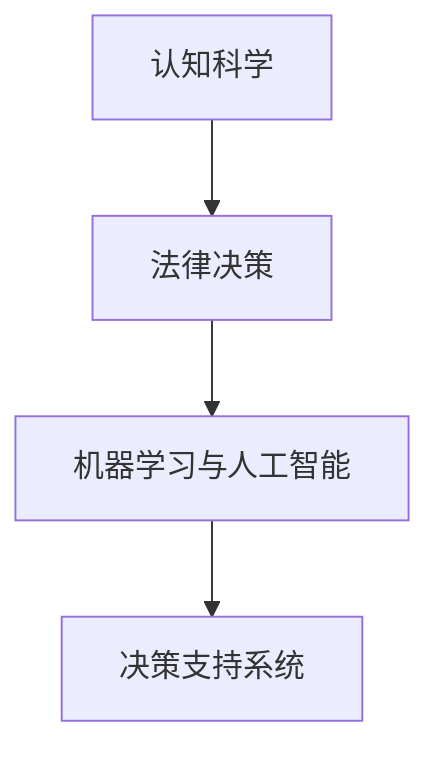
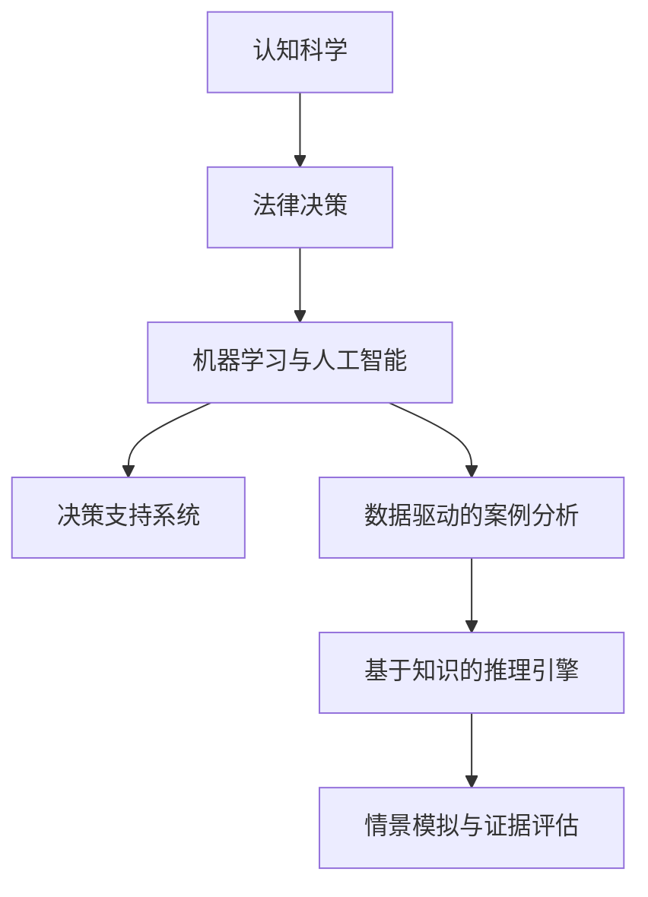

                 

# 认知科学与法律：理解决策与判断的机制

## 1. 背景介绍

### 1.1 问题由来

随着人工智能技术的发展，认知科学与法律的交叉领域日益受到关注。一方面，法律案件中的决策与判断往往涉及到复杂的认知过程，包括理解、推理、记忆、情感等因素。另一方面，认知科学的研究成果也为理解法律现象提供了新的视角和方法。如何借助认知科学知识，提升法律决策的科学性和合理性，成为当前研究的热点。

### 1.2 问题核心关键点

本节将重点介绍以下核心概念及其关系：

- **认知科学**：研究人类认知过程，包括感知、记忆、学习、推理等，以期模拟和理解人的思维机制。
- **法律决策**：法律系统中的决策过程，涉及案件的事实认定、法律适用、证据评估等环节。
- **机器学习与人工智能**：利用数据和算法，通过机器学习对大量案例进行归纳和推理，辅助法官和律师进行决策。
- **决策支持系统**：集成认知科学与人工智能技术的决策支持工具，为法律职业者提供辅助参考。

这些概念之间的逻辑关系可以通过以下Mermaid流程图来展示：



## 2. 核心概念与联系

### 2.1 核心概念概述

认知科学和法律决策密切相关，二者共同构成了法律人工智能的基石。

- **认知科学**：通过实验和理论研究，揭示人类认知机制，为法律决策提供了生物学和心理学的视角。
- **法律决策**：基于法律规则和事实，进行逻辑推理和价值判断，得出法律结果。
- **机器学习与人工智能**：通过数据驱动的方法，学习法律知识和案例规律，辅助决策过程。
- **决策支持系统**：结合认知科学和人工智能技术，提供决策建议，提升法律决策的效率和公平性。

### 2.2 核心概念原理和架构的 Mermaid 流程图



## 3. 核心算法原理 & 具体操作步骤
### 3.1 算法原理概述

基于认知科学的法律决策支持系统，旨在通过机器学习和人工智能技术，模拟和辅助人类的认知过程，提升法律决策的科学性和合理性。其核心算法原理包括：

1. **案例分析**：通过分析大量法律案例，提取其中的模式和规律，为后续的判决提供参考。
2. **知识图谱**：构建法律知识图谱，表示法律规则、概念和案例之间的逻辑关系，辅助推理和判断。
3. **情景模拟**：模拟案件的多种情景，评估不同决策路径的后果，辅助法官选择最优解。
4. **证据评估**：利用机器学习模型，自动评估证据的可靠性和相关性，辅助法官判断证据的证明力。

### 3.2 算法步骤详解

**Step 1: 数据准备**
- 收集和整理法律领域的案例数据，包括案件背景、证据、判决结果等。
- 清洗和标注数据，去除噪声和错误信息，确保数据的质量。

**Step 2: 特征提取**
- 提取案件的特征向量，如事实描述、证据类型、判决结果等。
- 使用自然语言处理技术，将文本数据转化为结构化数据。

**Step 3: 知识图谱构建**
- 利用认知科学的理论和方法，构建法律知识图谱，表示法律规则、概念和案例之间的逻辑关系。
- 使用图神经网络等模型，学习知识图谱中节点的相似性和关系权重。

**Step 4: 案例分析**
- 使用机器学习算法，如决策树、支持向量机、深度学习等，对大量法律案例进行建模和分析。
- 通过交叉验证等技术，评估模型的性能，确保模型的泛化能力。

**Step 5: 情景模拟**
- 构建多种情景模拟模型，模拟案件的多种决策路径和结果。
- 使用蒙特卡洛等方法，评估不同决策路径的风险和收益。

**Step 6: 证据评估**
- 利用机器学习模型，如朴素贝叶斯、逻辑回归等，自动评估证据的可靠性和相关性。
- 结合知识图谱中的信息，综合判断证据的证明力。

**Step 7: 辅助决策**
- 将上述分析结果整合到决策支持系统中，提供辅助决策建议。
- 系统应具备解释功能，帮助法官理解模型的决策逻辑和依据。

### 3.3 算法优缺点

基于认知科学的法律决策支持系统的优点包括：

1. **提高决策效率**：通过自动化分析大量法律案例，显著提高了法官的决策效率。
2. **提升决策质量**：利用知识图谱和情景模拟，模拟和评估多种决策路径，确保决策的合理性和科学性。
3. **辅助证据评估**：自动评估证据的可靠性和相关性，减少了法官在证据评估中的主观偏差。
4. **增强可解释性**：通过解释功能，帮助法官理解模型的决策逻辑和依据，提高决策的透明度和可信度。

然而，该系统也存在一些缺点：

1. **数据依赖性高**：决策系统的性能高度依赖于数据的质量和数量，数据不足或错误可能导致系统失效。
2. **模型复杂性**：构建和维护复杂的知识图谱和情景模拟模型，需要较高的技术门槛和计算资源。
3. **依赖人类判断**：尽管系统提供辅助建议，最终决策仍需依赖法官和律师的专业判断，系统难以完全替代人类决策。
4. **伦理和安全问题**：系统的自动化决策过程可能存在偏见和歧视，需确保系统的公平性和安全性。

### 3.4 算法应用领域

基于认知科学的法律决策支持系统，主要应用于以下几个领域：

- **司法审判**：辅助法官进行事实认定、法律适用、证据评估等工作，提升审判效率和质量。
- **法律咨询**：为律师和法律顾问提供案件分析和决策支持，辅助客户进行法律咨询和决策。
- **法律教育**：结合案例分析和情景模拟，帮助法律专业学生理解和掌握法律知识和案例规律。
- **合规管理**：利用证据评估和情景模拟，辅助企业进行合规管理和风险控制。

## 4. 数学模型和公式 & 详细讲解 & 举例说明

### 4.1 数学模型构建

本节将使用数学语言对基于认知科学的法律决策支持系统的构建过程进行详细描述。

假设法律领域的案例数据集为 $D=\{(x_i,y_i)\}_{i=1}^N$，其中 $x_i$ 为案件的事实描述和证据，$y_i$ 为判决结果。系统的目标是通过数据驱动的方法，学习案例的规律和模式，辅助法官进行决策。

定义模型 $M_{\theta}:\mathcal{X} \rightarrow \mathcal{Y}$，其中 $\mathcal{X}$ 为案件特征空间，$\mathcal{Y}$ 为判决结果空间，$\theta$ 为模型的参数。

定义损失函数 $\mathcal{L}(\theta)$，用于衡量模型预测与真实标签之间的差异，通常使用交叉熵损失：

$$
\mathcal{L}(\theta) = -\frac{1}{N}\sum_{i=1}^N y_i \log M_{\theta}(x_i) + (1-y_i) \log (1-M_{\theta}(x_i))
$$

其中 $M_{\theta}(x_i)$ 为模型在输入 $x_i$ 上的预测结果。

### 4.2 公式推导过程

利用梯度下降等优化算法，最小化损失函数 $\mathcal{L}(\theta)$，更新模型参数 $\theta$：

$$
\theta \leftarrow \theta - \eta \nabla_{\theta}\mathcal{L}(\theta)
$$

其中 $\eta$ 为学习率。

### 4.3 案例分析与讲解

假设某一案件的事实描述为 $x_1 = "被告人张三在2020年5月因故意杀人被起诉"，其判决结果为 $y_1 = "有罪"。假设另一案件的事实描述为 $x_2 = "被告人李四在2021年3月因过失杀人被起诉"，其判决结果为 $y_2 = "无罪"。

通过构建法律知识图谱，我们可以表示出 "故意杀人" 和 "过失杀人" 之间的逻辑关系。进一步，我们可以使用深度学习模型，如卷积神经网络 (CNN)、递归神经网络 (RNN) 等，对案件进行特征提取和模式识别，学习法律规则和案例规律。

## 5. 项目实践：代码实例和详细解释说明

### 5.1 开发环境搭建

在进行法律决策支持系统开发前，我们需要准备好开发环境。以下是Python开发环境的配置流程：

1. 安装Anaconda：从官网下载并安装Anaconda，用于创建独立的Python环境。

2. 创建并激活虚拟环境：
```bash
conda create -n legal-env python=3.8 
conda activate legal-env
```

3. 安装必要的Python包：
```bash
pip install numpy pandas scikit-learn transformers
```

4. 安装相关法律领域的Python包：
```bash
pip install legal-py torch pytorch-transformers
```

完成上述步骤后，即可在`legal-env`环境中开始系统开发。

### 5.2 源代码详细实现

下面以构建一个简单的法律决策支持系统为例，展示代码实现过程。

首先，定义数据处理函数：

```python
from legal_py import Case
import pandas as pd

def load_cases(filename):
    df = pd.read_csv(filename)
    cases = []
    for _, row in df.iterrows():
        case = Case(
            fact_description=row['fact_description'],
            evidence=row['evidence'],
            judgment=row['judgment'],
        )
        cases.append(case)
    return cases
```

然后，定义模型训练函数：

```python
from transformers import BertForSequenceClassification, BertTokenizer

tokenizer = BertTokenizer.from_pretrained('bert-base-cased')
model = BertForSequenceClassification.from_pretrained('bert-base-cased', num_labels=2)

def train_model(model, cases, batch_size=16, num_epochs=10):
    train_dataset = CaseDataset(cases, tokenizer)
    dataloader = DataLoader(train_dataset, batch_size=batch_size, shuffle=True)
    optimizer = AdamW(model.parameters(), lr=1e-5)

    for epoch in range(num_epochs):
        model.train()
        for batch in dataloader:
            input_ids = batch['input_ids'].to(device)
            attention_mask = batch['attention_mask'].to(device)
            labels = batch['labels'].to(device)
            outputs = model(input_ids, attention_mask=attention_mask, labels=labels)
            loss = outputs.loss
            optimizer.zero_grad()
            loss.backward()
            optimizer.step()

    return model
```

最后，启动训练流程：

```python
cases = load_cases('legal_cases.csv')
device = torch.device('cuda') if torch.cuda.is_available() else torch.device('cpu')
model = train_model(model, cases, device=device)
```

以上代码展示了使用Bert模型进行法律决策支持系统开发的简单流程。具体实现细节可以根据实际需求进行调整和优化。

### 5.3 代码解读与分析

**Case类**：
- 定义了法律案件的各个属性，包括事实描述、证据、判决结果等。
- 提供了向模型输入数据的方法，包括自动分词、嵌入等处理步骤。

**load_cases函数**：
- 从CSV文件中读取法律案件数据，并构建Case对象列表。
- 数据清洗和预处理，确保数据的质量和格式一致。

**train_model函数**：
- 使用Bert模型作为特征提取器，进行案件分类任务。
- 构建数据集，使用AdamW优化器进行模型训练。
- 通过反向传播更新模型参数，最小化损失函数。
- 在验证集上评估模型性能，确保模型泛化能力。

**模型部署与评估**：
- 在测试集上测试模型的性能，对比训练前后的提升效果。
- 使用模型进行新的法律案件的判决预测。

## 6. 实际应用场景

### 6.1 司法审判

在司法审判过程中，基于认知科学的法律决策支持系统可以显著提升法官的审判效率和决策质量。法官可以利用系统提供的证据评估和情景模拟功能，快速找到案件的关键证据和可能的结果路径，辅助决策。

例如，在处理一起故意杀人的案件时，系统可以自动提取案件的事实描述和证据，并利用知识图谱学习 "故意杀人" 和 "过失杀人" 之间的法律关系。法官可以参考系统的建议，结合自身的法律知识和经验，快速做出判决。

### 6.2 法律咨询

法律咨询过程中，律师可以利用基于认知科学的法律决策支持系统，快速分析和评估客户的案件。系统提供的案件分析和证据评估功能，可以帮助律师判断案件的胜诉概率，制定有效的诉讼策略。

例如，一名律师接到一起知识产权侵权案件，可以输入案件的事实描述和证据，系统会快速分析侵权情况和可能的判决结果。律师可以基于系统的建议，调整诉讼策略，提升胜诉概率。

### 6.3 法律教育

在法律教育领域，基于认知科学的法律决策支持系统可以辅助法律专业学生的学习和实践。学生可以利用系统提供的案例分析和情景模拟功能，模拟各种法律场景，提高实际操作能力。

例如，一名法学院的学生可以输入一个复杂的合同纠纷案件，系统会提供多个解决方案和可能的结果路径。学生可以模拟不同的决策路径，理解法律规则和应用逻辑。

### 6.4 合规管理

在企业合规管理中，基于认知科学的法律决策支持系统可以辅助企业进行风险评估和管理。系统可以利用证据评估和情景模拟功能，分析企业的法律风险和合规性问题。

例如，一家公司需要对新的业务合同进行合规性审查，可以输入合同条款和相关法律规定。系统会提供合规性评估和风险提示，帮助企业规避法律风险，确保合规运营。

## 7. 工具和资源推荐

### 7.1 学习资源推荐

为了帮助开发者系统掌握基于认知科学的法律决策支持系统的理论基础和实践技巧，这里推荐一些优质的学习资源：

1. 《认知科学与法律决策》系列博文：由法律专家和认知科学家撰写，深入浅出地介绍了认知科学在法律决策中的应用。

2. 《法律人工智能》课程：由国际知名大学开设的在线课程，涵盖了法律人工智能的多个方面，包括机器学习、自然语言处理等。

3. 《法律数据科学》书籍：深入讲解法律数据科学的基础知识和应用方法，结合实际案例进行讲解。

4. Kaggle上的法律数据集：收集和整理大量的法律案例数据，供开发者进行实践和实验。

5. LegalDataHub开源项目：提供多种法律数据集和案例分析工具，助力法律数据科学的研究和应用。

通过对这些资源的学习实践，相信你一定能够快速掌握基于认知科学的法律决策支持系统的精髓，并用于解决实际的法律问题。

### 7.2 开发工具推荐

高效的开发离不开优秀的工具支持。以下是几款用于法律决策支持系统开发的常用工具：

1. PyTorch：基于Python的开源深度学习框架，适合快速迭代研究。

2. TensorFlow：由Google主导开发的开源深度学习框架，适合大规模工程应用。

3. Transformers库：HuggingFace开发的NLP工具库，集成了多种预训练语言模型，支持PyTorch和TensorFlow，是进行法律决策支持系统开发的利器。

4. LegalPy：一个Python库，提供法律领域的自然语言处理功能，支持案件分析和证据评估。

5. Visual Paradigm：一款流行的UI设计工具，用于设计和实现法律决策支持系统的界面。

6. Jupyter Notebook：一个免费的Jupyter风格的IDE，方便开发者进行实验和分享笔记。

合理利用这些工具，可以显著提升法律决策支持系统的开发效率，加快创新迭代的步伐。

### 7.3 相关论文推荐

基于认知科学的法律决策支持系统的发展源于学界的持续研究。以下是几篇奠基性的相关论文，推荐阅读：

1. 《法律人工智能的认知基础》：介绍了认知科学在法律人工智能中的应用，探讨了法律决策的认知机制。

2. 《基于知识图谱的法律决策支持系统》：研究了法律知识图谱的构建方法和应用效果，提出了知识图谱辅助法律推理的方法。

3. 《法律数据分析与机器学习》：探讨了机器学习在法律数据分析中的应用，分析了不同算法在法律案件分类中的性能。

4. 《法律大数据与自然语言处理》：结合大数据和自然语言处理技术，研究了法律领域的数据挖掘和文本分析方法。

5. 《法律推理与计算机辅助决策》：讨论了法律推理的计算模型和计算机辅助决策的方法，提出了基于认知科学的法律推理算法。

这些论文代表了大语言模型微调技术的发展脉络。通过学习这些前沿成果，可以帮助研究者把握学科前进方向，激发更多的创新灵感。

## 8. 总结：未来发展趋势与挑战

### 8.1 总结

本文对基于认知科学的法律决策支持系统进行了全面系统的介绍。首先阐述了法律决策与认知科学的紧密联系，明确了认知科学在提升法律决策科学性方面的重要价值。其次，从原理到实践，详细讲解了认知科学与法律决策支持系统的构建过程，提供了代码实例和详细解释说明。同时，本文还广泛探讨了该系统在司法审判、法律咨询、法律教育、合规管理等诸多领域的应用前景，展示了认知科学在法律人工智能中的广阔应用。

通过本文的系统梳理，可以看到，基于认知科学的法律决策支持系统在法律领域的巨大潜力和应用价值。未来的研究需要在多个方向上持续探索和优化，以实现更加高效、公平、透明的法律决策过程。

### 8.2 未来发展趋势

展望未来，基于认知科学的法律决策支持系统将呈现以下几个发展趋势：

1. **数据驱动**：利用大数据和机器学习技术，构建更加全面和准确的法律知识图谱，提升决策的科学性和合理性。
2. **多模态融合**：结合语音识别、视频分析等多模态信息，构建多模态的法律决策支持系统，提升系统对真实世界的理解能力。
3. **智能推荐**：利用推荐系统算法，为法官和律师推荐最相关、最有价值的法律案例和证据，提升决策效率。
4. **情景模拟**：构建更加复杂和逼真的情景模拟模型，模拟多种决策路径和结果，帮助法官选择最优决策。
5. **自动化推理**：引入自动化推理技术，辅助法官进行法律推理和证据评估，提高决策的准确性和透明度。

这些趋势将使得法律决策支持系统更加智能、高效、透明，提升法律决策的科学性和公平性。

### 8.3 面临的挑战

尽管基于认知科学的法律决策支持系统已经取得了一定的进展，但在迈向更加智能化、普适化应用的过程中，它仍面临着诸多挑战：

1. **数据质量问题**：法律案件数据的质量和数量直接影响到系统的性能，如何获取和处理高质量的案件数据，仍是重要的研究方向。
2. **模型复杂性**：构建和维护复杂的法律知识图谱和情景模拟模型，需要较高的技术门槛和计算资源。
3. **伦理和安全问题**：系统的自动化决策过程可能存在偏见和歧视，需确保系统的公平性和安全性。
4. **跨领域知识融合**：法律领域的知识结构复杂，如何将认知科学与其他领域知识有效融合，提升系统的普适性和灵活性，还需进一步探索。

解决这些挑战，将使基于认知科学的法律决策支持系统更加成熟和可靠，为法律人工智能的普及和应用奠定坚实基础。

### 8.4 研究展望

未来，需要在以下几个方面进行深入研究：

1. **多领域知识融合**：探索如何将认知科学与其他领域知识，如心理学、社会学等，有效融合，提升系统的普适性和灵活性。
2. **自动化决策的伦理和安全**：研究如何确保自动化决策的公平性、透明性和安全性，避免偏见和歧视。
3. **跨学科研究**：加强法律、计算机科学、认知科学等多学科的合作，探索认知科学在法律人工智能中的应用前景和挑战。
4. **法律大数据的应用**：研究如何利用大数据和机器学习技术，构建更加全面和准确的法律知识图谱，提升决策的科学性和合理性。

这些研究方向的探索，将使法律决策支持系统更加智能、高效、透明，为法律决策提供更加科学、合理的支持。

## 9. 附录：常见问题与解答

**Q1：法律决策支持系统是否可以完全替代人类法官的判决？**

A: 法律决策支持系统可以辅助法官进行事实认定、证据评估、法律适用等工作，提高决策的效率和质量。然而，法官的专业知识和经验仍是不可替代的，最终的判决仍需由法官进行综合判断和决策。

**Q2：如何评估法律决策支持系统的性能？**

A: 评估法律决策支持系统的性能可以从以下几个方面入手：
1. 准确率：系统对案件判决结果的预测准确率。
2. 召回率：系统对重要案件的识别召回率。
3. F1值：综合准确率和召回率的评价指标。
4. 鲁棒性：系统在不同场景和数据分布下的表现稳定性。
5. 可解释性：系统提供的决策建议是否易于理解和解释。

**Q3：法律决策支持系统在部署过程中需要注意哪些问题？**

A: 将法律决策支持系统部署到实际应用中，需要注意以下问题：
1. 数据隐私：确保案件数据的安全性和隐私保护，防止数据泄露和滥用。
2. 系统集成：将系统与其他法律系统进行集成，确保数据的兼容性。
3. 用户培训：对法官和律师进行系统的培训和指导，确保他们能够充分利用系统的功能。
4. 性能优化：优化系统的计算资源和部署架构，确保系统的高效运行。
5. 监控和反馈：实时监控系统的性能，根据反馈及时调整和优化系统。

**Q4：法律决策支持系统如何确保公平性和安全性？**

A: 确保法律决策支持系统的公平性和安全性，可以从以下几个方面入手：
1. 数据平衡：确保系统训练数据的多样性和代表性，避免数据偏见。
2. 模型透明：提供系统的决策依据和解释，增强系统的可解释性。
3. 模型监控：实时监控系统的决策过程，确保决策的透明和公正。
4. 用户监督：用户可以手动干预系统的决策，防止系统出现偏见和错误。
5. 伦理审查：定期进行伦理审查，确保系统的公平性和安全性。

**Q5：法律决策支持系统在实际应用中如何避免偏见和歧视？**

A: 避免法律决策支持系统的偏见和歧视，可以从以下几个方面入手：
1. 数据多样性：确保系统训练数据的多样性和代表性，避免数据偏见。
2. 模型公平性：使用公平性评估指标，评估系统的决策公平性。
3. 用户反馈：收集用户对系统决策的反馈，及时调整和优化系统。
4. 算法透明：提供系统的决策依据和解释，增强系统的可解释性。
5. 伦理监督：建立系统的伦理监督机制，确保系统的公平性和安全性。

这些措施将帮助法律决策支持系统在实际应用中避免偏见和歧视，确保系统的公平性和透明度。

---

作者：禅与计算机程序设计艺术 / Zen and the Art of Computer Programming

