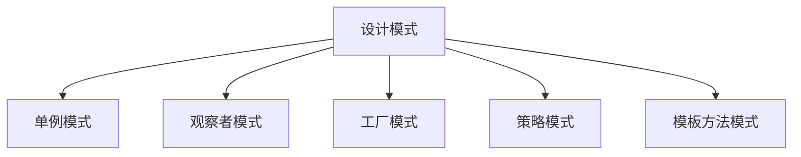

                 

## 1. 背景介绍

### 1.1 问题由来
软件设计是软件开发过程中极为重要的一环。良好的设计可以使得软件结构清晰、易于维护、扩展性强，而糟糕的设计则会带来种种问题，如代码难以理解、维护成本高、扩展性差等。因此，如何有效地进行软件设计成为了软件工程师必须掌握的核心技能。

### 1.2 问题核心关键点
软件设计中常见的问题主要集中在代码可读性、可维护性、可扩展性等方面。设计师需要考虑如何设计出既能够满足需求，又能够适应未来变化的软件架构。

## 2. 核心概念与联系

### 2.1 核心概念概述

为更好地理解设计模式，本节将介绍几个密切相关的核心概念：

- 设计模式(Design Patterns)：指在软件设计中反复出现的问题和解决方案，这些解决方案具有一定的通用性，可被多个软件系统所借鉴和复用。
- 单例模式(Singleton)：保证一个类只有一个实例，并提供全局访问点。
- 观察者模式(Observer)：定义对象间一对多的依赖关系，当一个对象的状态发生改变时，所有依赖于它的对象都得到通知并自动更新。
- 工厂模式(Factory)：定义一个用于创建对象的接口，让子类决定实例化哪一个类。工厂模式可以将对象的创建和使用分离开来，提高代码的可扩展性和可维护性。
- 策略模式(Strategy)：定义一系列算法，将它们封装起来，并使它们可以相互替换。策略模式允许算法独立于使用它们的客户而变化。
- 模板方法模式(Template Method)：定义一个操作中的算法骨架，而将算法的一些步骤延迟到子类中。模板方法使得子类可以不改变一个算法的结构即可重新定义该算法的某些特定步骤。

这些核心概念之间的逻辑关系可以通过以下Mermaid流程图来展示：



这个流程图展示了大设计模式的设计框架：

1. 设计模式解决的是软件设计中常见的问题。
2. 具体的实现包括单例模式、观察者模式、工厂模式、策略模式和模板方法模式等。

## 3. 核心算法原理 & 具体操作步骤

### 3.1 算法原理概述

设计模式的核心原理是面向对象编程中的抽象和封装思想。通过将共性的问题抽象成设计模式，将问题的解决封装在类和接口中，使得代码更具可读性、可维护性和可扩展性。

具体来说，设计模式通过将问题分解为多个子问题，定义通用的解决方案，使得开发人员可以在不重复造轮子的情况下，快速构建复杂系统。设计模式还可以提高代码的可复用性，减少代码冗余，降低开发和维护成本。

### 3.2 算法步骤详解

设计模式的应用可以分为以下几个关键步骤：

**Step 1: 确定问题**
- 分析当前软件系统面临的设计问题，如代码耦合度高、维护成本高、扩展性差等。
- 确定需要解决的具体问题，如日志记录、事件驱动、对象池化等。

**Step 2: 选择合适的设计模式**
- 根据问题类型，选择相应的设计模式。常见的设计模式包括单例模式、观察者模式、工厂模式、策略模式和模板方法模式等。
- 理解设计模式的原理和实现细节，确保能够正确应用设计模式。

**Step 3: 实现设计模式**
- 根据设计模式定义类和接口，实现相应的行为。
- 通过代码示例和注释，说明设计模式的用法和注意事项。

**Step 4: 应用设计模式**
- 将设计模式应用到软件系统中，根据实际情况进行微调。
- 定期检查和维护设计模式的使用情况，确保其仍然有效。

**Step 5: 持续改进**
- 根据需求变化和新技术的出现，不断优化设计模式的使用。
- 通过回顾和迭代，提升系统的性能和可维护性。

### 3.3 算法优缺点

设计模式的优点包括：
1. 代码可读性高。设计模式封装了复杂的问题解决方案，使得代码更具可读性和可理解性。
2. 代码可维护性好。设计模式通过解耦和抽象，减少了代码的耦合度，使得代码更易于维护。
3. 代码可扩展性强。设计模式定义了通用的解决方案，使得代码可以更灵活地扩展和复用。
4. 提高开发效率。设计模式提供了一种通用的问题解决方案，减少了开发人员的工作量。

同时，设计模式也存在一定的局限性：
1. 过度使用可能导致代码复杂。设计模式的应用需要根据具体情况，过度使用可能导致代码变得复杂，不易理解。
2. 设计模式的性能问题。某些设计模式，如观察者模式，可能带来额外的性能开销。
3. 设计模式的灵活性。设计模式的灵活性不够，在实际应用中可能无法满足所有场景需求。

尽管如此，设计模式仍然是软件开发中不可或缺的重要工具，通过合理应用设计模式，可以大大提升软件系统的质量和效率。

### 3.4 算法应用领域

设计模式在软件开发中有着广泛的应用，几乎涵盖所有类型的软件系统。以下是几个典型的应用场景：

- 游戏开发：设计模式可以用于游戏状态的封装、游戏对象的创建和管理等。
- 数据库开发：设计模式可以用于数据库连接管理、事务处理等。
- 网络应用：设计模式可以用于网络请求的封装、事件驱动等。
- 云计算应用：设计模式可以用于云资源的封装和管理、服务间的通信等。
- 物联网应用：设计模式可以用于设备的封装和管理、数据的传输和处理等。

## 4. 数学模型和公式 & 详细讲解  
### 4.1 数学模型构建

设计模式的应用一般不涉及复杂的数学模型，但在某些场景下，设计模式的实现可能需要使用数学公式进行辅助计算。例如，观察者模式中的订阅关系、单例模式中的全局唯一标识等，都可以通过数学公式来解释。

### 4.2 公式推导过程

以观察者模式为例，其订阅关系可以表示为一个图，其中订阅者节点和被观察者节点通过边连接。设订阅者集合为 $S$，被观察者集合为 $O$，则订阅关系可以表示为：

$$ G(S, O) = (S \times O) \cup (O \times S) $$

其中，$(S \times O)$ 表示订阅者节点和被观察者节点之间的连接，$(O \times S)$ 表示被观察者节点和订阅者节点之间的连接。

### 4.3 案例分析与讲解

以工厂模式为例，其核心思想是通过抽象出一个工厂接口，由具体工厂类实现不同的产品创建。假设有一个工厂接口 `IFactory` 和一个具体工厂 `CarFactory`，其中 `IFactory` 接口定义了 `create` 方法用于创建产品，`CarFactory` 实现了该接口并创建汽车对象。则工厂模式的代码示例如下：

```python
class IFactory:
    def create(self):
        pass

class CarFactory(IFactory):
    def create(self):
        return Car()

class Product:
    def __init__(self):
        pass

class Car(Product):
    def __init__(self):
        pass

if __name__ == '__main__':
    factory = CarFactory()
    product = factory.create()
    assert isinstance(product, Car)
```

这个示例展示了如何使用工厂模式创建产品。通过将创建产品的逻辑封装在工厂类中，可以方便地替换不同的工厂，实现产品的灵活创建。

## 5. 项目实践：代码实例和详细解释说明

### 5.1 开发环境搭建

在进行设计模式实践前，我们需要准备好开发环境。以下是使用Python进行Java开发的环境配置流程：

1. 安装JDK：从官网下载并安装JDK，确保JDK版本与编译器兼容。

2. 配置IDE：选择如IntelliJ IDEA、Eclipse等Java IDE，并配置好相关的编译器和源码路径。

3. 安装Maven：通过命令 `mvn install:install` 安装Maven，并配置好本地仓库。

4. 引入设计模式依赖：通过Maven引入相应的设计模式依赖，如Apache Commons Lang、Spring Framework等。

5. 创建测试项目：创建Java项目，定义测试用例，并使用JUnit等测试框架进行测试。

完成上述步骤后，即可在开发环境中开始设计模式实践。

### 5.2 源代码详细实现

这里我们以单例模式为例，展示如何使用Java实现一个简单的日志记录器。

首先，定义日志记录器接口 `ILogger`：

```java
public interface ILogger {
    void log(String message);
}
```

然后，定义单例类 `Logger`，实现 `ILogger` 接口：

```java
public class Logger implements ILogger {
    private static final Logger instance = new Logger();
    private Logger() {}
    public static Logger getInstance() {
        return instance;
    }
    @Override
    public void log(String message) {
        System.out.println(message);
    }
}
```

最后，测试单例模式的使用：

```java
if (Main.class.isInstance(ILogger.class)) {
    ILogger logger = Logger.getInstance();
    logger.log("Hello, world!");
}
```

以上就是一个简单的单例模式实现。可以看到，通过将日志记录器的创建和管理封装在单例类中，可以方便地在整个应用中共享单例实例，避免多个日志记录器之间的耦合。

### 5.3 代码解读与分析

让我们再详细解读一下关键代码的实现细节：

**ILogger接口**：
- 定义日志记录器接口，包含 `log` 方法用于记录日志信息。

**Logger类**：
- 实现单例模式，包含一个私有构造函数，通过静态工厂方法获取单例实例。
- `log` 方法用于记录日志信息，并在控制台上输出。

**测试代码**：
- 通过接口判断当前类是否为单例模式实现。
- 获取单例实例并调用其 `log` 方法。

可以看到，单例模式通过将日志记录器的创建和管理封装在单例类中，实现了全局唯一性和懒加载，使得代码更简洁、更易维护。

当然，工业级的系统实现还需考虑更多因素，如线程安全、内存管理等。但核心的设计模式基本与此类似。

## 6. 实际应用场景

### 6.1 游戏开发

设计模式在游戏开发中有着广泛的应用，如状态模式、策略模式、观察者模式等。以状态模式为例，游戏中的角色可能有不同的状态，如 idle、walking、fighting 等。通过定义一个状态抽象类 `State` 和具体的 `IdleState`、`WalkingState`、`FightingState` 类，可以在运行时动态地切换角色状态，从而实现复杂的游戏行为。

### 6.2 数据库开发

设计模式在数据库开发中也有重要应用，如工厂模式、单例模式等。以工厂模式为例，可以定义一个数据库连接工厂类，封装数据库连接的创建和管理，使得代码更加灵活和可维护。

### 6.3 网络应用

设计模式在网络应用中也有广泛应用，如观察者模式、策略模式等。以观察者模式为例，可以定义一个事件订阅器，当某个事件发生时，通知所有订阅者进行处理。这种机制可以用于事件驱动的网络应用，如消息队列、订阅-发布系统等。

### 6.4 云计算应用

设计模式在云计算应用中也有重要应用，如工厂模式、观察者模式等。以工厂模式为例，可以定义一个云服务工厂类，封装云服务的创建和管理，使得云服务的使用更加灵活和可维护。

## 7. 工具和资源推荐

### 7.1 学习资源推荐

为了帮助开发者系统掌握设计模式的理论基础和实践技巧，这里推荐一些优质的学习资源：

1. 《设计模式：原则与实践》：GoF的经典著作，详细讲解了23种设计模式及其应用场景。

2. 《深入理解设计模式》：UML大师Ernst Wassermann的著作，深入浅出地讲解了设计模式的原理和应用。

3. 《Clean Code》：Robert C. Martin的经典著作，介绍了代码整洁、易于维护的设计原则。

4. 《Spring设计模式》：Spring框架的设计模式总结，涵盖Spring应用中的常见设计模式。

5. 《Effective Java》：Java编程规范手册，详细讲解了Java中的设计模式和编程技巧。

通过这些资源的学习实践，相信你一定能够快速掌握设计模式的精髓，并用于解决实际的系统问题。

### 7.2 开发工具推荐

高效的设计模式开发离不开优秀的工具支持。以下是几款用于设计模式开发常用的工具：

1. IntelliJ IDEA：一款功能强大的Java IDE，支持设计模式可视化、自动生成代码等功能。

2. Eclipse：另一款流行的Java IDE，支持插件扩展，可以方便地引入设计模式相关的插件。

3. JUnit：一个广泛使用的Java测试框架，支持测试驱动开发，方便进行单元测试。

4. Maven：一个Java项目构建工具，支持依赖管理、版本控制、发布等功能。

5. Gradle：一个基于Groovy语言的构建工具，支持更灵活的配置和扩展。

合理利用这些工具，可以显著提升设计模式开发和维护的效率，加快创新迭代的步伐。

### 7.3 相关论文推荐

设计模式的研究源于学界的持续探索。以下是几篇奠基性的相关论文，推荐阅读：

1. "The Reuse-Oriented Design: Fundations and Implications"（重用导向设计：基础与启示）：GoF的论文，阐述了设计模式的重用性和应用场景。

2. "How to Design Programs"（如何设计程序）：Ronald L. Rivest的经典著作，介绍了设计模式的编程方法论。

3. "Pattern-Oriented Analysis of Object-Oriented Systems"（面向对象系统模式分析）：Vladimir Yaroslavskiy的论文，介绍了如何使用模式分析面向对象系统的设计。

4. "Architecture in Motion: On the Nature of Architecture"（动态架构：关于架构的本质）：Martin Fowler的论文，探讨了架构设计中的模式与实践。

5. "Evolving Software Architecture: From Requirements to Design to Architecture"（演化软件架构：从需求到设计到架构）：William R. Already博士的论文，介绍了软件架构的演化过程。

这些论文代表了大设计模式的研究方向，通过学习这些前沿成果，可以帮助研究者把握学科前进方向，激发更多的创新灵感。

## 8. 总结：未来发展趋势与挑战

### 8.1 总结

本文对设计模式进行了全面系统的介绍。首先阐述了设计模式的研究背景和意义，明确了设计模式在提升软件系统质量和效率方面的独特价值。其次，从原理到实践，详细讲解了设计模式的基本原理和应用步骤，给出了设计模式任务开发的完整代码实例。同时，本文还广泛探讨了设计模式在各种场景中的应用前景，展示了设计模式范式的巨大潜力。此外，本文精选了设计模式学习的各类资源，力求为读者提供全方位的技术指引。

通过本文的系统梳理，可以看到，设计模式在软件开发中具有广泛的应用价值。设计模式通过封装共性问题、解耦对象、抽象和封装，提升了代码的可读性、可维护性和可扩展性。未来，伴随设计模式的不断演进，相信将会有更多优秀的模式涌现，为软件系统的构建和维护提供新的思路和工具。

### 8.2 未来发展趋势

展望未来，设计模式的应用将呈现以下几个发展趋势：

1. 设计模式的演化：随着技术的发展，新的设计模式将不断涌现，优化现有模式，提出更适合新的编程范式和技术栈的模式。

2. 设计模式的混合应用：设计模式将与其他编程范式和技术相结合，形成更加灵活和高效的解决方案。

3. 设计模式的自动化：通过自动化工具，实现设计模式的自动生成和优化，减少人工操作和错误，提升开发效率。

4. 设计模式的工程化：设计模式将与DevOps等工程实践相结合，形成自动化、可追溯的工程实践体系，提升软件的生产力和质量。

5. 设计模式的领域特定化：针对不同领域的应用，设计模式将进行细化，提出更适合特定领域的模式。

这些趋势将推动设计模式的发展和应用，为软件系统的构建和维护带来新的机遇和挑战。

### 8.3 面临的挑战

尽管设计模式已经取得了丰硕的成果，但在迈向更加智能化、普适化应用的过程中，它仍面临着诸多挑战：

1. 设计模式的多样性：设计模式种类繁多，难以全面掌握。同时，不同模式之间的应用也需要考虑相互之间的协调和兼容。

2. 设计模式的应用复杂性：设计模式的实现和应用需要考虑多方面的因素，如性能、可扩展性、可维护性等，增加了开发难度。

3. 设计模式的灵活性不足：设计模式往往需要根据具体场景进行调整和优化，灵活性不够。

4. 设计模式的可复用性问题：设计模式需要满足跨项目、跨语言、跨框架的可复用性，这在实际应用中难以实现。

5. 设计模式的教育问题：设计模式的教育需要面向实际应用，覆盖更多的场景和案例，培养学生的实践能力。

这些挑战需要研究者不断探索和创新，通过理论研究和技术实践，不断完善设计模式的体系和方法，推动其应用范围和质量的提升。

### 8.4 研究展望

面向未来，设计模式的研究需要在以下几个方面寻求新的突破：

1. 设计模式的理论化：通过理论研究，完善设计模式的定义和分类，提出更具普适性的模式框架。

2. 设计模式的工程化：通过工程实践，探索设计模式的自动化、可追溯性，提升设计模式的开发效率和质量。

3. 设计模式的跨领域应用：将设计模式应用到更多的领域，如云计算、物联网、区块链等，推动设计模式在更多场景中的应用。

4. 设计模式与新兴技术的融合：将设计模式与新兴技术如大数据、人工智能、区块链等进行融合，提出更具创新性的解决方案。

5. 设计模式的教育和普及：通过教育资源和方法，普及设计模式的应用和实践，培养更多的设计模式应用人才。

这些研究方向将推动设计模式的发展和应用，为构建高质量的软件系统提供新的思路和工具。总之，设计模式需要在不断创新和实践中不断演进，推动软件工程领域的进步。

## 9. 附录：常见问题与解答

**Q1：什么是设计模式？**

A: 设计模式是在软件设计中反复出现的问题和解决方案，这些解决方案具有一定的通用性，可被多个软件系统所借鉴和复用。设计模式封装了共性问题，提供了解决方案，使得代码更简洁、更易维护。

**Q2：如何选择合适的设计模式？**

A: 选择合适的设计模式需要考虑以下几个因素：
1. 问题类型：不同类型的问题可能需要不同的设计模式。
2. 代码复杂度：设计模式会增加代码的复杂度，需要权衡利弊。
3. 可扩展性：设计模式需要考虑代码的可扩展性，避免未来的变化影响现有的代码。

**Q3：设计模式有哪些分类？**

A: 设计模式主要分为三大类：创建型模式、结构型模式和行为型模式。其中，创建型模式关注对象的创建方式，结构型模式关注对象之间的结构关系，行为型模式关注对象之间的交互方式。

**Q4：如何验证设计模式的效果？**

A: 验证设计模式的效果通常需要考虑以下几个方面：
1. 代码可读性：设计模式能否使代码更简洁、更易于理解。
2. 代码可维护性：设计模式能否减少代码的耦合度，便于维护。
3. 代码可扩展性：设计模式能否使代码更灵活、更易于扩展。

**Q5：设计模式有哪些应用场景？**

A: 设计模式在软件开发中有着广泛的应用场景，如游戏开发、数据库开发、网络应用、云计算应用、物联网应用等。通过合理应用设计模式，可以提升系统的质量和效率。

---

作者：禅与计算机程序设计艺术 / Zen and the Art of Computer Programming

