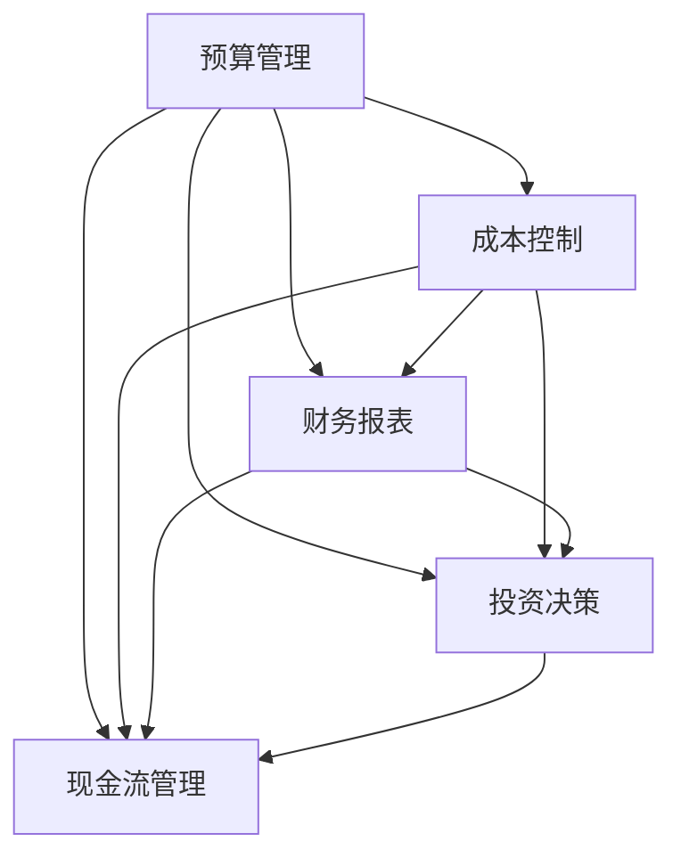

                 

# 财务管理：非财务经理也需要了解的知识

> 关键词：财务管理, 预算管理, 成本控制, 财务报表, 投资决策, 现金流管理

## 1. 背景介绍

### 1.1 问题由来

在当今的商业环境中，财务管理已经成为企业运营的核心部分。许多企业的高层管理者，无论其专业背景如何，都需要对财务基础知识有一定的了解，以便做出更好的商业决策。财务问题不仅仅局限于财务部门，而是涉及到企业战略规划、资源分配、成本控制和绩效评估等多个方面。因此，即使非财务经理也需要掌握一定的财务管理知识，以便在复杂多变的商业环境中做出明智的决策。

### 1.2 问题核心关键点

财务管理涉及多个核心概念，包括预算管理、成本控制、财务报表分析、投资决策和现金流管理等。这些概念之间相互关联，共同构成了企业财务管理的整体框架。本文将逐一介绍这些概念，帮助非财务经理更好地理解财务管理的核心知识。

## 2. 核心概念与联系

### 2.1 核心概念概述

为更好地理解财务管理，本节将介绍几个密切相关的核心概念：

- **预算管理**：指根据企业的战略目标和业务计划，合理分配资源，制定可执行的预算计划，以实现资源的有效利用和企业的可持续发展。

- **成本控制**：指通过科学的管理手段，合理控制企业的各项成本支出，确保企业盈利能力的持续提升。

- **财务报表**：包括资产负债表、利润表和现金流量表等，是企业财务状况、经营成果和现金流量的重要反映。

- **投资决策**：指企业根据自身的财务状况和市场环境，做出合理的投资选择，以实现资本增值和利润最大化。

- **现金流管理**：指对企业现金流入和流出的管理，确保企业有足够的现金流支持日常运营和投资活动。

这些核心概念之间的逻辑关系可以通过以下Mermaid流程图来展示：



这个流程图展示了一些核心概念之间的相互关系：

1. 预算管理是成本控制的基础，有助于资源的合理分配。
2. 财务报表是预算和成本控制的反馈工具，反映企业财务状况。
3. 投资决策需要参考财务报表和现金流管理情况，以做出合理的投资选择。
4. 现金流管理是企业财务状况和投资决策的重要考量因素。

## 3. 核心算法原理 & 具体操作步骤
### 3.1 算法原理概述

财务管理的核心算法原理主要包括预算编制、成本分配、财务报表分析、投资评估和现金流预测等。这些算法旨在帮助企业实现资源的最优配置和利润的最大化。

### 3.2 算法步骤详解

#### 预算管理

1. **确定预算目标**：根据企业的战略目标和市场环境，设定预算的总目标。
2. **分配预算资源**：将总预算按照不同的业务单元和项目进行分配，确保资源的合理利用。
3. **执行预算监控**：在预算执行过程中，实时监控预算的执行情况，及时调整偏差。

#### 成本控制

1. **识别成本来源**：通过分析企业的各项成本支出，识别出可控和不可控的成本。
2. **设定成本控制目标**：根据企业的财务状况和市场环境，设定合理的成本控制目标。
3. **实施成本控制措施**：采用成本控制策略，如材料采购的谈判、生产流程的优化、固定成本的节约等。

#### 财务报表分析

1. **收集财务数据**：收集企业的资产负债表、利润表和现金流量表等财务报表数据。
2. **进行财务比率分析**：计算各项财务比率，如流动比率、资产负债率等，评估企业的财务状况。
3. **进行趋势分析**：对企业的财务数据进行时间序列分析，预测未来的财务状况。

#### 投资决策

1. **评估投资机会**：通过分析市场环境和行业趋势，评估投资机会的可行性。
2. **进行投资评估**：使用财务模型，如净现值法、内部收益率法等，评估投资项目的财务效益。
3. **做出投资决策**：根据投资评估结果，做出合理的投资选择。

#### 现金流管理

1. **预测现金流量**：根据企业的财务计划和市场环境，预测未来的现金流量。
2. **监控现金流量**：实时监控企业的现金流量状况，确保现金流的稳定性和流动性。
3. **优化现金管理**：采用现金管理策略，如提前收款、延迟付款等，优化企业的现金流。

### 3.3 算法优缺点

财务管理算法的优点包括：

- **提高资源利用效率**：通过预算管理和成本控制，企业可以更有效地利用资源，提高盈利能力。
- **优化财务结构**：通过财务报表分析和现金流管理，企业可以优化财务结构，降低财务风险。
- **支持投资决策**：通过投资评估，企业可以做出更合理的投资选择，实现资本增值。

同时，财务管理算法也存在一些缺点：

- **数据依赖性强**：算法的准确性依赖于数据的完整性和准确性，如果数据不充分或不准确，会影响分析结果。
- **复杂度高**：算法的实现和应用需要一定的专业知识，对于非财务经理来说可能较为复杂。
- **调整灵活性差**：算法一旦制定，调整起来较为困难，需要耗费大量时间和精力。

### 3.4 算法应用领域

财务管理算法广泛应用于多个领域，例如：

- **制造企业**：通过预算管理和成本控制，优化生产流程，提高生产效率。
- **服务企业**：通过财务报表分析，优化资源配置，提升服务质量。
- **金融企业**：通过投资评估和现金流管理，优化资本结构，提升盈利能力。
- **零售企业**：通过预算管理，控制库存成本，提高资金周转率。
- **政府机构**：通过预算管理和财务报表分析，优化资源分配，提高公共服务水平。

## 4. 数学模型和公式 & 详细讲解 & 举例说明

### 4.1 数学模型构建

财务管理中的数学模型主要涉及预算、成本、投资和现金流等方面的计算。

#### 预算管理

预算管理模型主要关注资源分配和预算监控。常用的模型包括零基预算模型和增量预算模型。

- **零基预算模型**：假设预算的每个项目都需要重新评估，不受历史预算的约束。模型公式为：

$$
B_i = R_i \times F_i
$$

其中，$B_i$ 表示第 $i$ 个项目的预算，$R_i$ 表示第 $i$ 个项目的资源需求，$F_i$ 表示第 $i$ 个项目的优先级系数。

- **增量预算模型**：基于历史预算，进行增量调整。模型公式为：

$$
B_i = B_{i-1} + \Delta B_i
$$

其中，$B_i$ 表示第 $i$ 个项目的预算，$B_{i-1}$ 表示第 $i-1$ 个项目的预算，$\Delta B_i$ 表示第 $i$ 个项目的预算增量。

#### 成本控制

成本控制模型主要关注成本的识别和控制。常用的模型包括标准成本模型和变动成本模型。

- **标准成本模型**：设定标准成本，与实际成本进行比较，计算成本差异。模型公式为：

$$
V_i = A_i - S_i
$$

其中，$V_i$ 表示第 $i$ 个项目的成本差异，$A_i$ 表示第 $i$ 个项目的实际成本，$S_i$ 表示第 $i$ 个项目的标准成本。

- **变动成本模型**：区分固定成本和变动成本，进行分类控制。模型公式为：

$$
C = F + V
$$

其中，$C$ 表示总成本，$F$ 表示固定成本，$V$ 表示变动成本。

#### 财务报表分析

财务报表分析模型主要关注财务比率和趋势分析。常用的模型包括流动比率模型和资产负债率模型。

- **流动比率模型**：衡量企业的短期偿债能力。模型公式为：

$$
L = \frac{C}{A}
$$

其中，$L$ 表示流动比率，$C$ 表示流动资产，$A$ 表示流动负债。

- **资产负债率模型**：衡量企业的长期偿债能力。模型公式为：

$$
L = \frac{D}{E}
$$

其中，$L$ 表示资产负债率，$D$ 表示负债总额，$E$ 表示资产总额。

#### 投资决策

投资决策模型主要关注投资项目的评估。常用的模型包括净现值模型和内部收益率模型。

- **净现值模型**：计算投资项目的净现值。模型公式为：

$$
NPV = \sum_{t=1}^{n} \frac{C_t}{(1+r)^t}
$$

其中，$NPV$ 表示净现值，$C_t$ 表示第 $t$ 期的现金流，$r$ 表示折现率，$n$ 表示投资期限。

- **内部收益率模型**：计算投资项目的内部收益率。模型公式为：

$$
IRR = \frac{NPV}{C_0}
$$

其中，$IRR$ 表示内部收益率，$NPV$ 表示净现值，$C_0$ 表示投资总额。

#### 现金流管理

现金流管理模型主要关注现金流量的预测和监控。常用的模型包括现金流量预测模型和现金流平衡模型。

- **现金流量预测模型**：预测未来的现金流量。模型公式为：

$$
CF = CF_{in} - CF_{out}
$$

其中，$CF$ 表示现金流量，$CF_{in}$ 表示现金流入，$CF_{out}$ 表示现金流出。

- **现金流平衡模型**：确保现金流的稳定性和流动性。模型公式为：

$$
CF_{bal} = CF_{in} + CF_{gen} - CF_{out}
$$

其中，$CF_{bal}$ 表示现金流平衡，$CF_{in}$ 表示现金流入，$CF_{gen}$ 表示现金生成，$CF_{out}$ 表示现金流出。

### 4.2 公式推导过程

#### 预算管理

假设企业有 $n$ 个项目，每个项目的资源需求和优先级系数如下表所示：

| 项目 | 资源需求 | 优先级系数 |
|------|----------|------------|
| A    | 100      | 0.6        |
| B    | 200      | 0.4        |
| C    | 150      | 0.7        |

设总预算为 $B$，则零基预算和增量预算的预算分配结果如下：

- **零基预算**：

$$
B_A = 100 \times 0.6 = 60
$$
$$
B_B = 200 \times 0.4 = 80
$$
$$
B_C = 150 \times 0.7 = 105
$$
$$
B = B_A + B_B + B_C = 245
$$

- **增量预算**：

$$
B_A = 100 + \Delta B_A = 100 + 30 = 130
$$
$$
B_B = 200 + \Delta B_B = 200 + 10 = 210
$$
$$
B_C = 150 + \Delta B_C = 150 + 20 = 170
$$
$$
B = B_A + B_B + B_C = 510
$$

#### 成本控制

假设企业生产产品 $X$，每件产品需要的材料成本和人工成本如下表所示：

| 产品 | 材料成本 | 人工成本 |
|------|----------|----------|
| X    | 10       | 5        |

设每件产品的标准成本为 $S$，则：

$$
S = 10 + 5 = 15
$$

某月生产 $100$ 件产品 $X$，实际材料成本为 $A$，实际人工成本为 $B$，则成本差异计算如下：

$$
V_A = A - S \times 100 = A - 1500
$$
$$
V_B = B - S \times 100 = B - 1500
$$

#### 财务报表分析

假设企业资产总额为 $E$，负债总额为 $D$，流动资产为 $C$，流动负债为 $A$，则：

$$
L_{liq} = \frac{C}{A}
$$
$$
L_{cap} = \frac{D}{E}
$$

设某月企业实现利润 $P$，则：

$$
P = R - C
$$

其中，$R$ 表示总收益，$C$ 表示总成本。

#### 投资决策

假设企业有投资项目 $A$，项目初期投资额为 $C_0$，每年产生的现金流为 $C_t$，折现率为 $r$，项目期限为 $n$，则：

$$
NPV = \sum_{t=1}^{n} \frac{C_t}{(1+r)^t} - C_0
$$

设投资项目 $A$ 的内部收益率为 $IRR$，则：

$$
IRR = \frac{NPV}{C_0}
$$

#### 现金流管理

假设企业某月预计收入为 $C_{in}$，支出为 $C_{out}$，则：

$$
CF = C_{in} - C_{out}
$$

设企业希望现金流平衡，预计现金生成为 $C_{gen}$，则：

$$
CF_{bal} = C_{in} + C_{gen} - C_{out}
$$

### 4.3 案例分析与讲解

#### 案例一：零基预算

某公司有 $n$ 个项目，每个项目的资源需求和优先级系数如下表所示：

| 项目 | 资源需求 | 优先级系数 |
|------|----------|------------|
| A    | 100      | 0.6        |
| B    | 200      | 0.4        |
| C    | 150      | 0.7        |

设总预算为 $B$，采用零基预算模型分配资源：

1. **确定预算目标**：公司总预算为 $B$。
2. **分配预算资源**：

$$
B_A = 100 \times 0.6 = 60
$$
$$
B_B = 200 \times 0.4 = 80
$$
$$
B_C = 150 \times 0.7 = 105
$$
$$
B = B_A + B_B + B_C = 245
$$

3. **执行预算监控**：实时监控各项目的预算执行情况，确保预算目标的实现。

#### 案例二：变动成本控制

某公司生产产品 $X$，每件产品需要的材料成本和人工成本如下表所示：

| 产品 | 材料成本 | 人工成本 |
|------|----------|----------|
| X    | 10       | 5        |

设每件产品的标准成本为 $S$，某月生产 $100$ 件产品 $X$，实际材料成本为 $A$，实际人工成本为 $B$，则：

1. **识别成本来源**：识别出材料成本和人工成本。
2. **设定成本控制目标**：设定每件产品的标准成本 $S$。
3. **实施成本控制措施**：

$$
S = 10 + 5 = 15
$$
$$
V_A = A - S \times 100 = A - 1500
$$
$$
V_B = B - S \times 100 = B - 1500
$$

通过监控成本差异，及时调整生产流程，控制成本支出。

## 5. 项目实践：代码实例和详细解释说明

### 5.1 开发环境搭建

在进行财务管理实践前，我们需要准备好开发环境。以下是使用Python进行财务数据分析的环境配置流程：

1. 安装Anaconda：从官网下载并安装Anaconda，用于创建独立的Python环境。

2. 创建并激活虚拟环境：
```bash
conda create -n finance-env python=3.8 
conda activate finance-env
```

3. 安装必要的库：
```bash
conda install pandas numpy matplotlib jupyter notebook sympy statsmodels
```

完成上述步骤后，即可在`finance-env`环境中开始财务管理实践。

### 5.2 源代码详细实现

下面我们以预算管理为例，给出使用Python进行财务预算分析的代码实现。

```python
import pandas as pd

# 定义预算数据
budget = {'Project': ['A', 'B', 'C'], 'Resource': [100, 200, 150], 'Priority': [0.6, 0.4, 0.7], 'Total_Budget': 245}

# 创建预算数据框
df = pd.DataFrame(budget)

# 计算预算分配
df['Allocation'] = df['Resource'] * df['Priority']
total_allocation = df['Allocation'].sum()

# 输出预算分配结果
print("Allocation Results:")
print(df)
print(f"Total Allocation: {total_allocation}")
```

### 5.3 代码解读与分析

让我们再详细解读一下关键代码的实现细节：

**数据准备**：
- `budget` 字典定义了项目的资源需求和优先级系数。
- `df` 创建预算数据框，便于后续计算和分析。

**预算分配计算**：
- `df['Allocation']` 计算每个项目的预算分配。
- `total_allocation` 计算总预算分配。

**输出结果**：
- `print` 输出预算分配结果和总预算分配。

可以看到，通过Python和Pandas库，我们能够高效地进行预算分配的计算和分析。对于更复杂的财务管理问题，还可以利用NumPy、Sympy和Statsmodels等库，进行数据处理和统计分析。

## 6. 实际应用场景

### 6.1 智能投融资

财务管理在智能投融资领域有着广泛的应用。例如，通过财务报表分析和投资评估模型，可以评估企业的财务状况和投资潜力，辅助投资者做出更明智的投资决策。

在实际应用中，可以使用财务模型对企业的财务数据进行多维度分析，识别出高风险和高回报的投资机会，同时进行投资项目的风险评估，确保资本的稳健增值。

### 6.2 财务风险管理

财务管理在财务风险管理中同样发挥着重要作用。通过财务报表分析和现金流管理，可以及时识别企业的财务风险点，采取有效的风险控制措施，避免财务危机的发生。

例如，通过流动比率和资产负债率模型，可以评估企业的短期和长期偿债能力，发现潜在的财务风险。在发现风险后，可以采取预算调整、成本控制和现金流优化等措施，降低企业的财务风险。

### 6.3 企业绩效评估

财务管理在企业绩效评估中也是不可或缺的一部分。通过财务报表分析和业绩指标计算，可以评估企业的运营效率和盈利能力，为企业管理者和股东提供决策依据。

例如，通过计算每股收益、资产回报率等指标，可以全面评估企业的经营绩效，识别出运营中的薄弱环节，采取改进措施，提升企业盈利能力。

### 6.4 未来应用展望

随着大数据和人工智能技术的发展，财务管理的未来应用前景广阔。以下是几个值得关注的未来趋势：

1. **大数据分析**：利用大数据技术，对企业的海量财务数据进行深度分析，发现隐藏的财务规律，优化财务决策。

2. **人工智能**：结合人工智能技术，如机器学习和深度学习，进行财务预测和风险管理，提升财务分析的精准度。

3. **区块链技术**：利用区块链技术，实现财务数据的透明化和安全性，降低财务风险。

4. **自动化财务**：通过自动化技术，实现财务报表的自动生成和分析，提高财务工作效率。

5. **多维财务分析**：结合时间序列分析和维度分析，进行多维度的财务分析，提升财务决策的科学性。

## 7. 工具和资源推荐

### 7.1 学习资源推荐

为了帮助开发者系统掌握财务管理知识，这里推荐一些优质的学习资源：

1. **《财务管理基础》课程**：由知名大学开设的财务管理基础课程，涵盖财务管理的基本概念和核心方法。

2. **《财务报表分析》书籍**：详细讲解财务报表的构成和分析方法，帮助理解企业的财务状况。

3. **《预算管理与控制》课程**：讲解预算管理的原理和实践，提供实际案例分析。

4. **《财务风险管理》书籍**：介绍财务风险管理的策略和工具，帮助防范财务危机。

5. **《财务决策与分析》书籍**：讲解财务决策的基本原则和分析方法，提升决策能力。

通过这些资源的学习实践，相信你一定能够全面掌握财务管理的核心知识，并在实际工作中做出明智的财务决策。

### 7.2 开发工具推荐

高效的开发离不开优秀的工具支持。以下是几款用于财务管理开发的常用工具：

1. **Python**：Python语言具有强大的数据分析和处理能力，是财务管理分析的首选语言。

2. **Pandas**：Python的Pandas库提供了强大的数据处理和分析功能，适用于财务数据的多维度分析。

3. **Excel**：Microsoft Excel是最常用的财务数据分析工具之一，支持多维度分析和数据可视化。

4. **Tableau**：Tableau是一款强大的数据可视化工具，支持复杂的数据分析和报表展示。

5. **Power BI**：Microsoft Power BI提供了强大的报表和仪表盘功能，适用于企业级财务分析。

合理利用这些工具，可以显著提升财务管理的开发效率，降低分析的复杂度，提高决策的准确性。

### 7.3 相关论文推荐

财务管理领域的研究论文众多，以下是几篇具有代表性的论文，推荐阅读：

1. **《财务报表分析与决策》**：介绍了财务报表的构成和分析方法，是财务管理的基础读物。

2. **《企业财务风险管理》**：讲解了财务风险管理的理论和方法，提供丰富的案例分析。

3. **《预算管理的理论和方法》**：详细讨论了预算管理的原理和实践，提供了实际案例。

4. **《基于大数据的财务预测模型》**：利用大数据技术，进行财务预测和风险管理，是财务管理的新方向。

5. **《财务绩效评估的理论与实践》**：讲解了财务绩效评估的方法和工具，提升财务决策的科学性。

这些论文代表了大财务管理理论的发展脉络，通过学习这些前沿成果，可以帮助研究者把握学科前进方向，激发更多的创新灵感。

## 8. 总结：未来发展趋势与挑战

### 8.1 总结

本文对财务管理的基本概念和核心算法进行了详细讲解，帮助非财务经理了解财务管理的核心知识。财务管理不仅涉及预算管理和成本控制，还包括财务报表分析、投资决策和现金流管理等多个方面。通过系统的学习，非财务经理也能够做出明智的财务决策。

### 8.2 未来发展趋势

展望未来，财务管理将面临以下发展趋势：

1. **数字化转型**：大数据和人工智能技术的发展，将推动财务管理的数字化转型，提高财务分析的精准度和效率。

2. **智能化管理**：利用AI技术，进行财务预测和风险管理，提升财务决策的科学性和准确性。

3. **透明化管理**：区块链技术的应用，将提高财务数据的透明性和安全性，降低财务风险。

4. **多维分析**：结合时间序列分析和维度分析，进行多维度的财务分析，提升财务决策的科学性。

5. **自动化管理**：通过自动化技术，实现财务报表的自动生成和分析，提高财务工作效率。

### 8.3 面临的挑战

尽管财务管理在企业运营中具有重要作用，但在实际应用中也面临一些挑战：

1. **数据质量问题**：财务数据的准确性和完整性对财务管理分析至关重要，如果数据存在问题，将直接影响分析结果的准确性。

2. **复杂度高**：财务管理涉及多维数据分析和复杂模型构建，对于非财务经理来说，需要具备一定的专业知识和技能。

3. **变化频繁**：企业的经营环境和市场条件不断变化，财务管理的策略和方法也需要不断调整，增加了管理难度。

### 8.4 研究展望

面对财务管理面临的挑战，未来的研究需要在以下几个方面寻求新的突破：

1. **数据管理**：建立标准化的财务数据管理体系，确保数据的质量和完整性，提高财务分析的精准度。

2. **智能化工具**：开发更加智能化、自动化的财务管理工具，降低管理难度，提高工作效率。

3. **多学科融合**：结合财务管理、会计学、经济学等多学科知识，进行综合分析，提升财务管理决策的科学性。

4. **跨部门协作**：加强企业内部的跨部门协作，形成统一的财务管理体系，提升企业的整体财务效率。

这些研究方向的探索，必将引领财务管理技术的进步，为企业的可持续发展提供坚实的财务保障。

## 9. 附录：常见问题与解答

**Q1：财务管理的核心概念有哪些？**

A: 财务管理的核心概念包括预算管理、成本控制、财务报表分析、投资决策和现金流管理等。这些概念共同构成了企业财务管理的整体框架，是财务管理的基础。

**Q2：如何进行财务风险管理？**

A: 财务风险管理主要通过财务报表分析和现金流管理来实现。具体步骤如下：
1. 收集和分析财务报表数据，识别潜在的财务风险点。
2. 采用现金流平衡模型，确保现金流的稳定性和流动性。
3. 进行财务比率分析，评估企业的偿债能力和运营效率。
4. 采取预算调整、成本控制和现金流优化等措施，降低财务风险。

**Q3：如何评估企业的投资机会？**

A: 评估企业的投资机会主要通过投资决策模型来实现。具体步骤如下：
1. 收集投资项目的各项数据，如投资总额、每年产生的现金流等。
2. 使用净现值模型或内部收益率模型进行投资评估。
3. 根据评估结果，选择高回报、低风险的投资项目。

**Q4：如何使用大数据进行财务管理？**

A: 使用大数据进行财务管理主要通过数据挖掘和机器学习来实现。具体步骤如下：
1. 收集企业的海量财务数据，进行数据清洗和预处理。
2. 利用数据挖掘技术，发现隐藏的财务规律和趋势。
3. 结合机器学习模型，进行财务预测和风险管理。

**Q5：如何进行财务报表分析？**

A: 财务报表分析主要通过财务比率和趋势分析来实现。具体步骤如下：
1. 收集企业的财务报表数据，如资产负债表、利润表和现金流量表。
2. 计算各项财务比率，如流动比率、资产负债率等。
3. 进行趋势分析，评估企业的财务状况和经营成果。

通过本文的系统梳理，可以看到，财务管理在企业运营中具有重要地位，掌握财务管理的核心概念和核心算法，对于非财务经理来说同样重要。只有全面理解财务管理的核心知识，才能在复杂多变的商业环境中做出明智的财务决策，确保企业的可持续发展。

