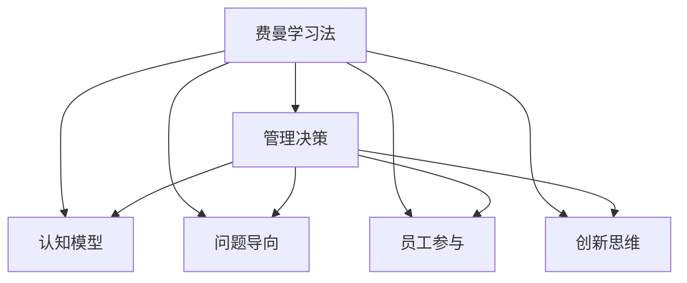

                 

# 费曼提问法激发管理者思考深度

> 关键词：费曼学习法,管理决策,认知模型,问题导向,员工参与,创新思维

## 1. 背景介绍

### 1.1 问题由来

费曼学习法（Feynman Technique）由诺贝尔物理学奖得主理查德·费曼提出，是一种通过自问自答，深入理解复杂概念的方法。尽管这种方法原本是为科学研究而设计，但其核心思想——通过不断深入提问以探索问题的本质，同样适用于管理决策和组织运营。

在快速变化的市场环境中，企业面临的挑战和机遇日益复杂。管理者需要不断提升自身思维深度和问题解决能力，才能引导企业顺利应对各类突发情况。费曼学习法在这一过程中扮演了重要角色。通过深入挖掘问题，细化思考步骤，管理决策将更加科学和有依据，从而提升企业整体竞争力。

### 1.2 问题核心关键点

费曼提问法的关键点在于通过“为何”、“如何”、“什么”、“为什么”等核心问题，从不同角度深入挖掘问题，引导管理者进行系统性、深度性思考，从而更准确地理解和把握问题的本质，做出更合理、更有效的决策。

这种方法有助于提高管理者的认知模型，使其从信息收集、数据分析到决策制定各个环节都能进行精细化管理，避免因为信息不完整、逻辑不清晰而导致决策失误。此外，费曼提问法还鼓励管理者主动与员工互动，激发团队参与和创新，从而形成更为协同的组织文化。

### 1.3 问题研究意义

费曼提问法对管理决策的提升具有重要意义：

1. **提升决策科学性**：帮助管理者系统化分析问题，避免依赖直觉或片面信息进行决策。
2. **促进创新思维**：通过多角度挖掘问题，激发管理者从不同维度寻找解决方案，增加创新可能性。
3. **加强团队协作**：鼓励员工参与问题探索，提升团队协作效率和凝聚力。
4. **提升执行效率**：明确问题导向，确保资源和精力聚焦于核心问题解决，提高执行效率。
5. **强化知识传承**：在提问过程中，管理者能够梳理和总结关键经验，形成知识库，方便后续复用。

## 2. 核心概念与联系

### 2.1 核心概念概述

费曼提问法涉及多个核心概念，包括费曼学习法、管理决策、认知模型、问题导向、员工参与、创新思维等。这些概念之间的关系紧密，相互支持，共同构成了费曼提问法的基本框架。

- **费曼学习法**：以科学家费曼为代表的学习方法，通过自问自答深入理解概念。
- **管理决策**：管理者为达到组织目标，根据环境条件和个人价值观，从多个备选方案中选择并实施的过程。
- **认知模型**：对知识获取、存储和应用的过程建模，用于描述和管理思维过程。
- **问题导向**：在管理决策中，以问题为核心，以问题为导向，明确目标和方向。
- **员工参与**：鼓励员工主动参与问题探索和解决方案提出，增强团队凝聚力和创新活力。
- **创新思维**：通过创造性思考，发现新的可能性，并应用于管理决策中。

这些概念之间的关系可以通过以下Mermaid流程图来展示：

这个流程图展示了一个从费曼学习法到管理决策的全过程，每一个环节都有对应的核心概念，相互支撑，最终推动决策制定和执行。

## 3. 核心算法原理 & 具体操作步骤
### 3.1 算法原理概述

费曼提问法基于费曼学习法的原理，通过不断提问和回答，引导管理者深入理解问题，提升决策的科学性和有效性。其核心思想是：

1. **深入理解**：通过问题挖掘，帮助管理者全面掌握问题的来龙去脉，避免浅尝辄止。
2. **系统思考**：将问题分解成多个子问题，逐步分析，确保每一个细节都得到充分考量。
3. **创新探索**：鼓励管理者从不同角度提出解决方案，增加创新可能性。
4. **协作互动**：促进员工参与问题探索，增强团队协作和创新能力。

### 3.2 算法步骤详解

费曼提问法的具体步骤如下：

**Step 1: 准备问题**

管理者首先需要明确问题的核心要素，将其分解成若干子问题。例如，对于提升产品销售的问题，可以分解为：

- 目标客户群体是谁？
- 他们的需求和痛点是什么？
- 当前市场竞争状况如何？
- 我们的产品相比竞品有哪些优势？
- 我们目前有哪些销售渠道？

**Step 2: 自问自答**

对于每一个子问题，管理者需要逐一深入分析，直到能够全面理解问题的本质。例如，对于“目标客户群体是谁”的问题，可以进一步提问：

- 他们的年龄、性别、职业是什么？
- 他们的购买行为和消费习惯有哪些特点？
- 他们对当前市场有哪些期望和需求？
- 我们如何进一步细分这些客户群体？

通过不断提问和回答，逐步构建出问题的详细画像。

**Step 3: 寻找创新解决方案**

在全面理解问题后，管理者需要进一步思考如何解决问题。例如，对于“当前市场竞争状况如何”的问题，可以提出以下解决方案：

- 分析竞品的市场份额和优劣势。
- 评估自身的市场定位和产品差异化。
- 制定市场进入策略和价格策略。
- 考虑通过广告、促销等方式提升品牌知名度。

**Step 4: 实施和评估**

制定好解决方案后，管理者需要将其转化为具体的执行计划，并评估其效果。例如，对于“我们如何进一步细分这些客户群体”的问题，可以制定以下实施方案：

- 通过市场调研获取更详细的数据。
- 采用数据分析工具，如客户细分模型，进行客户群体划分。
- 根据细分结果，制定不同的营销策略和产品策略。
- 定期评估策略效果，并根据反馈进行调整。

通过以上步骤，费曼提问法可以系统性地帮助管理者提升决策能力，确保决策过程的科学性和有效性。

### 3.3 算法优缺点

费曼提问法具有以下优点：

1. **深度挖掘**：通过系统化提问，帮助管理者深入理解问题，避免浅层次思考。
2. **创新思维**：鼓励多角度思考，激发创新解决方案。
3. **协作互动**：促进团队协作，提升团队凝聚力。
4. **系统分析**：帮助管理者从多个维度进行问题分析，确保决策全面性。

同时，费曼提问法也存在一些局限性：

1. **时间成本高**：系统化提问和回答过程可能需要较长时间，不适用于紧急情况。
2. **依赖管理者的深度思考能力**：费曼提问法的效果很大程度上取决于管理者的认知水平和问题理解能力。
3. **可能陷入细节**：在问题分解和分析过程中，容易陷入细节，忽略整体战略方向。
4. **复杂问题难度大**：对于过于复杂的问题，可能难以通过简单提问完全掌握。

尽管有这些局限性，费曼提问法依然是一种非常有效的问题导向决策方法，特别适合于战略规划、产品开发、流程改进等需要深度思考和系统分析的决策场景。

### 3.4 算法应用领域

费曼提问法在多个领域有广泛应用，包括但不限于：

1. **企业战略规划**：帮助企业制定长期和短期战略目标，从多个维度分析市场环境、内部资源、外部威胁等。
2. **产品开发**：通过深入问题，确保产品设计和开发的全面性和前瞻性。
3. **流程改进**：通过系统分析流程中的瓶颈和问题，提出优化方案。
4. **市场分析**：通过多角度分析市场数据，制定有效的市场进入和推广策略。
5. **员工培训**：帮助员工深入理解岗位职责和工作目标，提升工作绩效。
6. **客户服务**：通过深入分析客户反馈和需求，提升客户满意度和忠诚度。

## 4. 数学模型和公式 & 详细讲解 & 举例说明

### 4.1 数学模型构建

费曼提问法主要依赖于问题导向，通过不断提问和回答，构建问题的详细画像，并提出解决方案。其核心思想是通过系统化的方法，深入理解问题，寻找最优解决方案。

### 4.2 公式推导过程

费曼提问法虽然不涉及复杂的数学模型和公式，但可以通过一个简单的模型来描述其基本流程：

1. **问题定义**：将问题拆分为若干子问题，每个子问题对应一个变量 $x_i$。
2. **问题求解**：对于每个子问题 $x_i$，提出一系列深入问题 $q_j$，进行求解。
3. **综合分析**：将求解结果 $a_j$ 综合起来，形成最终解决方案 $y$。

通过这一模型，可以系统地理解费曼提问法的核心思想和操作步骤。

### 4.3 案例分析与讲解

以提升产品销售为例，分析如何应用费曼提问法进行决策。

1. **目标客户群体**：
   - **问题**：目标客户群体是谁？
   - **深入问题**：他们的年龄、性别、职业是什么？他们的购买行为和消费习惯有哪些特点？

2. **市场需求分析**：
   - **问题**：他们的需求和痛点是什么？
   - **深入问题**：他们最关注产品的哪些特性？当前市场上有没有满足这些需求的产品？

3. **市场竞争状况**：
   - **问题**：当前市场竞争状况如何？
   - **深入问题**：竞品的市场份额和优劣势是什么？我们的产品相比竞品有哪些优势？

4. **销售渠道分析**：
   - **问题**：我们目前有哪些销售渠道？
   - **深入问题**：这些渠道的覆盖范围和销售效果如何？有哪些潜力更大的渠道？

5. **市场进入策略**：
   - **问题**：我们如何进一步细分这些客户群体？
   - **深入问题**：如何利用数据分析工具进行客户细分？哪些细分客户群体的营销策略最有效？

通过以上问题，管理者可以全面了解产品的市场环境和客户需求，制定科学合理的销售策略，提升产品销售业绩。

## 5. 项目实践：代码实例和详细解释说明

### 5.1 开发环境搭建

费曼提问法主要用于管理决策，不涉及代码实现。但在实际应用中，可以通过一些工具和技术进行辅助，提升管理决策的科学性和系统性。

### 5.2 源代码详细实现

费曼提问法的实现主要依赖于问题定义和系统化分析，不需要编写复杂的代码。但为了便于演示，可以使用一些协作工具进行问题管理。

### 5.3 代码解读与分析

由于费曼提问法不涉及代码实现，这里仅提供一些工具和技术建议，帮助管理者系统化管理问题。

1. **Trello**：一个流程管理工具，可以帮助管理者创建和跟踪问题。
2. **MindMeister**：一个思维导图工具，可以系统化展示问题树和解决方案。
3. **Google Docs**：一个协作文档工具，可以方便团队共同编辑和讨论问题。
4. **Slack**：一个即时通讯工具，可以实时沟通和交流问题解决进展。

通过这些工具和技术，管理者可以更好地系统化管理和解决复杂问题，提升决策效率和质量。

### 5.4 运行结果展示

费曼提问法的效果主要体现在管理决策的科学性和系统性上，不涉及具体的运行结果展示。但在实际应用中，可以通过以下指标来评估费曼提问法的效果：

1. **决策质量**：通过对比不同决策方案的优劣，评估决策的科学性和合理性。
2. **团队协作**：通过团队参与问题的讨论和解决，评估团队的凝聚力和创新能力。
3. **执行效果**：通过对比不同决策方案的执行效果，评估决策的实施效果。

通过这些指标，管理者可以全面评估费曼提问法的效果，进一步优化问题解决过程。

## 6. 实际应用场景

### 6.1 企业战略规划

费曼提问法在企业战略规划中具有重要应用价值。管理者可以通过系统化提问，全面理解市场需求、竞争环境、内部资源等关键要素，制定科学合理的战略规划。

### 6.2 产品开发

在产品开发过程中，费曼提问法可以帮助团队深入理解用户需求，探索创新解决方案，提升产品的市场竞争力。

### 6.3 流程改进

通过费曼提问法，管理者可以系统分析流程中的瓶颈和问题，提出优化方案，提升流程效率和质量。

### 6.4 未来应用展望

随着人工智能和大数据分析技术的发展，费曼提问法在管理决策中的应用将更加广泛和深入。例如：

1. **大数据分析**：通过大数据分析工具，管理者可以更加全面地理解问题，做出科学决策。
2. **AI辅助**：利用AI技术，自动生成深入问题和解决方案，提升决策效率。
3. **实时监测**：通过实时监测工具，管理者可以及时发现问题并采取措施，提升应对突发情况的能力。

## 7. 工具和资源推荐

### 7.1 学习资源推荐

1. **《费曼学习法：如何通过自我提问和解答提升学习效率》**：一本介绍费曼学习法原理和实践的书，帮助你深入理解费曼提问法的核心思想。
2. **Coursera《如何高效学习》课程**：一门由MIT教授讲授的课程，系统介绍了费曼学习法的应用和实践。
3. **TED演讲《费曼学习法》**：一些专家关于费曼学习法的应用和思考，值得借鉴和学习。

### 7.2 开发工具推荐

1. **Trello**：一个流程管理工具，可以帮助管理者创建和跟踪问题。
2. **MindMeister**：一个思维导图工具，可以系统化展示问题树和解决方案。
3. **Google Docs**：一个协作文档工具，可以方便团队共同编辑和讨论问题。
4. **Slack**：一个即时通讯工具，可以实时沟通和交流问题解决进展。

### 7.3 相关论文推荐

1. **《费曼学习法：一种提升学习效率的方法》**：一篇关于费曼学习法的理论研究和应用实践的论文。
2. **《费曼学习法在项目管理中的应用》**：一篇讨论如何应用费曼学习法提升项目管理效率的论文。
3. **《费曼学习法在团队建设中的应用》**：一篇讨论如何通过费曼学习法提升团队协作和创新能力的论文。

## 8. 总结：未来发展趋势与挑战

### 8.1 总结

费曼提问法通过系统化提问和深入分析，帮助管理者提升决策科学性和系统性。其核心思想是深入理解问题，通过多角度挖掘问题，激发创新思维，促进团队协作，从而提升管理决策的效率和质量。

### 8.2 未来发展趋势

未来，费曼提问法将在以下方面不断发展：

1. **AI辅助**：利用AI技术，自动生成深入问题和解决方案，提升决策效率。
2. **大数据分析**：通过大数据分析工具，管理者可以更加全面地理解问题，做出科学决策。
3. **实时监测**：通过实时监测工具，管理者可以及时发现问题并采取措施，提升应对突发情况的能力。

### 8.3 面临的挑战

尽管费曼提问法在管理决策中具有重要应用价值，但也面临一些挑战：

1. **时间成本高**：系统化提问和回答过程可能需要较长时间，不适用于紧急情况。
2. **依赖管理者的深度思考能力**：费曼提问法的效果很大程度上取决于管理者的认知水平和问题理解能力。
3. **可能陷入细节**：在问题分解和分析过程中，容易陷入细节，忽略整体战略方向。
4. **复杂问题难度大**：对于过于复杂的问题，可能难以通过简单提问完全掌握。

### 8.4 研究展望

未来，费曼提问法的应用将更加广泛和深入。如何在保持系统化提问的同时，提高效率和可操作性，将是重要的研究方向。

1. **简化流程**：探索简化问题提问和回答流程的方法，提升决策效率。
2. **增强互动**：通过更多互动工具和技术，增强团队协作和参与度。
3. **提升自动化**：利用AI和大数据分析技术，自动化生成问题和方法，提升决策过程的科学性和系统性。

## 9. 附录：常见问题与解答

### Q1: 费曼提问法是否适用于所有管理场景？

A: 费曼提问法适用于需要系统化分析和深度思考的管理场景。对于紧急情况和复杂问题，可能需要结合其他决策方法，以提高决策效率和可行性。

### Q2: 如何提高费曼提问法的效率？

A: 可以通过以下方法提高费曼提问法的效率：

1. **简化问题**：将复杂问题分解为多个小问题，逐步解决。
2. **使用模板**：创建常用问题的提问模板，快速生成深入问题。
3. **团队协作**：通过团队协作，分担问题分析和解答，提升效率。
4. **使用工具**：利用协作工具和分析工具，辅助问题管理。

### Q3: 如何避免费曼提问法中的细节陷阱？

A: 可以通过以下方法避免细节陷阱：

1. **系统化分析**：将问题分解为多个维度，确保每个维度都得到充分考虑。
2. **定期总结**：定期总结和回顾问题解决过程，避免陷入细节。
3. **整体战略**：在分析问题时，始终关注整体战略方向，避免细节问题影响全局。

### Q4: 费曼提问法如何结合AI技术？

A: 可以通过以下方法结合AI技术：

1. **自动生成问题**：利用AI技术，自动生成深入问题，提升提问效率。
2. **数据分析**：利用大数据分析工具，全面理解问题和数据，提供科学决策依据。
3. **模型预测**：利用AI模型，预测问题解决效果，优化决策方案。

---

作者：禅与计算机程序设计艺术 / Zen and the Art of Computer Programming

