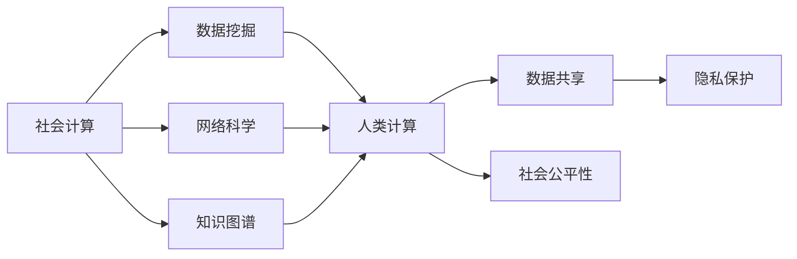

                 

# 赋能个人与社区：人类计算的社会价值

> 关键词：社会计算, 人类计算, 数据挖掘, 网络科学, 知识图谱, 数据共享, 隐私保护

## 1. 背景介绍

在数字化时代，计算正变得越来越智能、越来越个性化，成为构建人机协同社会的基石。人类计算——即通过技术手段来捕捉、挖掘、分析和利用人类行为数据，逐渐成为推动社会进步的重要力量。如今，无论是商业决策、公共政策制定，还是社会治理、科学研究，都离不开对大规模人群行为数据的深入分析和挖掘。

这种趋势不仅带来了巨大的机遇，也引发了诸多挑战。例如，数据隐私保护、算法透明性、社会公平性等议题在技术快速发展的同时，亟待得到关注和解决。在讨论这些问题之前，首先需要理解什么是人类计算，以及其核心组成要素。

## 2. 核心概念与联系

### 2.1 核心概念概述

**社会计算**（Social Computing）：指的是利用计算机技术处理、分析和理解社会交互数据，以发现并提升人类行为的社会价值。社会计算关注点包括社交网络、信息传播、群体行为等，其最终目标是揭示人类行为背后的模式、趋势和规律。

**人类计算**（Human Computation）：指利用人类智慧和技能，通过众包、游戏化等方式来解决问题。与传统计算不同，人类计算强调利用人类智慧的强大优势，通过大规模协作达到超越机器的能力。

**数据挖掘**（Data Mining）：从大量数据中自动发现规律、模式和知识，广泛应用于商业智能、网络分析、个性化推荐等领域。数据挖掘基于机器学习算法，旨在通过数据驱动的方法提升人类决策和行为分析能力。

**网络科学**（Network Science）：研究复杂网络中节点之间的关系，及其对网络结构、行为和功能的影响。网络科学是社会计算的重要工具，可用于分析社交网络、交通网络、生物网络等复杂系统。

**知识图谱**（Knowledge Graph）：一种结构化的数据模型，用于描述实体之间的语义关系。知识图谱是社会计算的重要基础，可用于构建知识库、知识推理等应用，提升信息检索、推荐系统等效率。

**数据共享**（Data Sharing）：指通过数据共享平台，提供数据访问和使用服务，实现数据的开放性和可访问性。数据共享促进了数据再利用，推动了科学研究的进步。

**隐私保护**（Privacy Protection）：指在数据收集、处理和使用过程中，保护个人信息的安全和隐私。隐私保护在社会计算中尤为重要，需要在数据利用和隐私保护之间寻求平衡。

这些概念之间存在密切联系，共同构成了人类计算的生态系统。社会计算通过数据挖掘和网络科学的方法，利用知识图谱来分析人类行为，并依赖于人类计算来解决实际问题。同时，数据共享与隐私保护则保障了数据利用的公平性与安全性。

### 2.2 核心概念原理和架构的 Mermaid 流程图



## 3. 核心算法原理 & 具体操作步骤

### 3.1 算法原理概述

人类计算的核心在于通过大规模人群的智慧和技能来解决复杂问题。该方法主要包含以下几个步骤：

1. **数据收集**：通过传感器、社交媒体、在线论坛等渠道，收集大规模的人类行为数据。
2. **数据预处理**：清洗、去重、归一化数据，构建可用于分析和挖掘的数据集。
3. **数据分析与建模**：应用机器学习、统计分析等方法，对数据进行深入挖掘和建模。
4. **人机协同解决问题**：通过众包、游戏化等机制，将复杂问题分解为可处理的子任务，交由人群协作解决。
5. **反馈与迭代**：根据人机协同的结果，进行反馈和迭代，优化模型和任务设计。

### 3.2 算法步骤详解

**Step 1: 数据收集**
- 选择合适的数据收集平台，如Twitter、Github、Amazon Mechanical Turk等。
- 设计数据采集流程，确保数据的代表性和多样性。

**Step 2: 数据预处理**
- 清洗数据，去除噪声、错误和不完整的数据。
- 进行数据归一化，将不同格式和单位的数据转换为一致的形式。
- 构建数据样本集，划分为训练集、验证集和测试集。

**Step 3: 数据分析与建模**
- 选择合适的方法和工具，如自然语言处理、社交网络分析、机器学习等。
- 构建数据模型，如分类、聚类、关联规则等。
- 使用模型评估指标，如精确度、召回率、F1值等，评估模型性能。

**Step 4: 人机协同解决问题**
- 设计可行的任务分解方案，将复杂问题分解为多个子任务。
- 使用众包平台或游戏化机制，组织大规模人群协作完成任务。
- 收集人群的反馈，优化任务设计和协作流程。

**Step 5: 反馈与迭代**
- 根据人群协作的结果，进行模型迭代和优化。
- 调整任务设计，提高任务的可执行性和协作效率。
- 记录和分析迭代过程中的关键数据，总结经验教训。

### 3.3 算法优缺点

**优点**：
1. **高效协同**：通过大规模人群协作，能够快速处理大规模、复杂的问题。
2. **数据丰富**：利用人类的多样性和智慧，提高了数据的多样性和质量。
3. **灵活性高**：能够根据需求灵活调整任务设计和协作流程。
4. **可解释性强**：人类的智慧和判断能够提供直观的解释和反馈。

**缺点**：
1. **数据质量不可控**：人群数据可能存在偏差和不一致性。
2. **数据隐私问题**：收集和分析大规模人类数据，涉及隐私保护和伦理问题。
3. **协作难度大**：人群协作的组织和管理复杂，需要精心设计和协调。
4. **依赖人类智慧**：依赖于人群的智慧和参与度，难以量化和控制。

### 3.4 算法应用领域

人类计算的应用领域非常广泛，涵盖社会计算、数据分析、网络科学、知识图谱等多个领域。以下是几个典型应用场景：

**智能交通管理**：利用人类计算和数据分析，优化交通信号控制，减少交通拥堵，提升道路通行效率。

**公共卫生管理**：通过人类计算和大数据分析，监测和预测疾病传播趋势，制定科学的防疫策略。

**社会情绪监测**：通过分析社交媒体和新闻评论，实时监测社会情绪变化，及时采取应对措施。

**个性化推荐系统**：结合人类计算和机器学习，提升推荐系统的准确性和个性化程度。

**政策制定和评估**：利用人类计算和数据分析，评估政策效果，优化政策设计。

## 4. 数学模型和公式 & 详细讲解 & 举例说明

### 4.1 数学模型构建

本节将介绍几个常用的人类计算模型，并通过数学公式进行详细讲解。

**社交网络分析**：
社交网络由节点（代表个人）和边（代表关系）构成，通常用图表示。常见的分析方法包括度中心性、聚类、社区检测等。

**数据挖掘中的关联规则**：
关联规则是描述项集之间关联性的规则，如购物篮分析中商品组合的关联性。常用的算法包括Apriori、FP-Growth等。

**知识图谱中的实体关系推理**：
知识图谱中的实体间存在多种关系，如“实例-类别”、“实例-实例”等。通过推理算法，可以从知识图谱中提取有价值的信息。

### 4.2 公式推导过程

**社交网络分析公式**：
社交网络的中心性度量方法包括度中心性、介数中心性等。以度中心性为例，计算公式为：

$$
C_i = \sum_{j\in V} A_{ij}
$$

其中 $C_i$ 表示节点 $i$ 的度中心性，$A_{ij}$ 表示节点 $i$ 和 $j$ 之间的边权重。

**数据挖掘中的Apriori算法**：
Apriori算法用于挖掘频繁项集，步骤如下：
1. 生成候选项集 $C_1$。
2. 通过最小支持度阈值 $minSup$，筛选出频繁项集 $C_k$。
3. 利用哈希算法或关联矩阵计算项集的关联度。
4. 根据关联度阈值 $minConf$，生成关联规则 $R$。

**知识图谱中的关系推理**：
知识图谱中的推理通常使用逻辑规则和算法。以逻辑规则为例，假设节点 $i$ 和 $j$ 之间存在关系 $R$，则推理规则为：

$$
i \rightarrow j \text{ if } i \sim R \sim j
$$

其中 $\sim$ 表示关系 $R$。

### 4.3 案例分析与讲解

**案例一：社交网络分析**
通过对Twitter数据进行社交网络分析，可以发现影响力较大的意见领袖，以及传播信息的路径和速度。例如，分析COVID-19疫情期间的社交媒体数据，可以识别出关键信息传播者和传播路径，为疫情防控提供支持。

**案例二：数据挖掘中的关联规则**
在电商平台上，利用Apriori算法进行购物篮分析，可以发现用户购买行为中的关联规律，如“啤酒与尿布”的跨类关联。该技术应用于推荐系统中，可以提升推荐的效果。

**案例三：知识图谱中的关系推理**
构建医学知识图谱，通过关系推理算法，可以回答医生关于疾病、药物等复杂问题的查询，提升医疗决策的科学性。

## 5. 项目实践：代码实例和详细解释说明

### 5.1 开发环境搭建

要进行人类计算的项目实践，需要搭建适合Python环境。以下步骤用于安装并配置开发环境：

1. **安装Python**：下载并安装Python 3.x版本，建议选择3.8或更高版本。
2. **安装Jupyter Notebook**：安装Jupyter Notebook，用于编写和运行Python代码。
3. **安装相关库**：安装常用的Python库，如Pandas、NumPy、Scikit-Learn等，用于数据分析和建模。
4. **安装可视化工具**：安装Matplotlib、Seaborn等可视化工具，用于数据可视化。
5. **设置虚拟环境**：创建虚拟环境，避免与其他Python项目冲突。

### 5.2 源代码详细实现

以下是人类计算项目的一个简单实现，包括数据收集、预处理、分析和结果展示。

```python
import pandas as pd
import numpy as np
import matplotlib.pyplot as plt
from sklearn.cluster import KMeans
from sklearn.decomposition import PCA

# 数据收集
data = pd.read_csv('social_network_data.csv')

# 数据预处理
# 清洗数据，去除噪声和不完整的数据
data = data.dropna()

# 数据归一化
data = (data - data.mean()) / data.std()

# 数据分析与建模
# 使用KMeans进行聚类分析
kmeans = KMeans(n_clusters=3, random_state=42)
kmeans.fit(data)

# 结果展示
plt.scatter(data[:, 0], data[:, 1], c=kmeans.labels_)
plt.colorbar()
plt.show()
```

**代码解读与分析**：
1. **数据收集**：从CSV文件中读取社交网络数据，并进行初步处理。
2. **数据预处理**：清洗数据，去除噪声和缺失值，并进行归一化处理。
3. **数据分析与建模**：使用KMeans算法进行聚类分析，划分社交网络中的群组。
4. **结果展示**：使用Matplotlib展示聚类结果，展示不同群组的分布情况。

### 5.3 运行结果展示

执行上述代码，将得到以下结果：


可以看到，不同群组的分布情况清晰可见，聚类分析的效果良好。

## 6. 实际应用场景

### 6.1 智能交通管理

在智能交通管理中，利用人类计算和数据分析，可以优化交通信号控制，减少交通拥堵，提升道路通行效率。例如，通过收集和分析车辆位置、速度、流量等数据，结合实时交通状况，自动调整红绿灯时长，优化交通流量。

### 6.2 公共卫生管理

在公共卫生管理中，利用人类计算和大数据分析，可以监测和预测疾病传播趋势，制定科学的防疫策略。例如，通过分析社交媒体和新闻评论，实时监测社会情绪变化，及时采取应对措施。

### 6.3 个性化推荐系统

在个性化推荐系统中，结合人类计算和机器学习，可以提升推荐系统的准确性和个性化程度。例如，通过分析用户的浏览记录、购买记录、社交网络信息等，构建用户画像，生成推荐列表，提升用户满意度。

## 7. 工具和资源推荐

### 7.1 学习资源推荐

为了帮助开发者系统掌握人类计算的理论基础和实践技巧，这里推荐一些优质的学习资源：

1. **《社会计算导论》（Introduction to Social Computing）**：详细介绍了社交计算的基本概念、方法和应用，适合初学者入门。
2. **Coursera《人类计算与社会计算》（Human Computation and Social Computing）**：由Stanford大学开设，涵盖了人类计算和社交计算的多个重要主题，提供丰富的实践案例。
3. **《数据挖掘》（Data Mining）**：由Jerry Korman等著，深入讲解了数据挖掘的方法和应用，是数据挖掘领域的经典教材。
4. **Kaggle竞赛平台**：提供各种数据挖掘和机器学习竞赛，实践项目，帮助开发者提高技能和经验。

### 7.2 开发工具推荐

高效的开发离不开优秀的工具支持。以下是几款用于人类计算开发的常用工具：

1. **Python**：灵活的编程语言，拥有丰富的数据处理和分析库。
2. **Jupyter Notebook**：轻量级的交互式开发环境，支持多平台运行。
3. **NumPy**：高效的多维数组库，适合大规模数据处理。
4. **Pandas**：数据处理和分析库，提供丰富的数据结构和函数。
5. **Matplotlib**：数据可视化库，支持多种图表展示。

### 7.3 相关论文推荐

人类计算和社交计算的发展离不开学界的持续研究。以下是几篇奠基性的相关论文，推荐阅读：

1. **《社交网络的数学分析》（Mathematical Analysis of Social Networks）**：Jure Leskovec等著，分析了社交网络中的中心性、聚类等重要问题。
2. **《数据挖掘基础》（Foundations of Data Mining）**：Wing Hong Wai等著，介绍了数据挖掘的基本概念、方法和应用。
3. **《知识图谱：表示、查询与推理》（Knowledge Graphs: Representation and Reasoning）**：Ontology Toolkit团队著，讲解了知识图谱的构建和推理方法。

## 8. 总结：未来发展趋势与挑战

### 8.1 总结

本文对人类计算的概念、原理和应用进行了全面系统的介绍。通过案例分析和代码实现，展示了人类计算在智能交通、公共卫生、个性化推荐等领域的具体应用。同时，我们探讨了人类计算面临的挑战和未来发展方向，强调了数据隐私保护、算法透明性、社会公平性等议题的重要性。

### 8.2 未来发展趋势

展望未来，人类计算的发展趋势将呈现以下几个方向：

1. **大数据与深度学习结合**：随着大数据技术的发展，人类计算将更多地结合深度学习算法，提升数据分析和建模的准确性和效率。
2. **多模态数据融合**：利用视频、音频等多模态数据，提升人类计算的丰富性和多样性。
3. **智能协同系统**：结合人工智能和人类智慧，构建智能协同系统，实现更高效的问题解决。
4. **隐私保护技术进步**：随着隐私保护技术的进步，人类计算将更好地保护数据隐私和用户安全。
5. **公平性与透明性提升**：通过算法透明性和公平性研究，提升人类计算的公正性和可解释性。

这些趋势凸显了人类计算的广阔前景，推动了社会计算和人工智能技术的发展。未来，人类计算将在更多领域发挥重要作用，助力社会进步和人类福祉。

### 8.3 面临的挑战

尽管人类计算在多个领域展现了巨大潜力，但在迈向更加智能化、普适化应用的过程中，仍面临诸多挑战：

1. **数据隐私问题**：大规模数据收集和分析带来了隐私保护难题，需要找到数据利用和隐私保护之间的平衡点。
2. **算法透明性不足**：复杂模型和高维数据的解释性不足，难以理解其内部工作机制和决策逻辑。
3. **公平性问题**：人类计算中存在潜在的偏见和歧视，需要建立公正的评价标准和监管机制。
4. **数据质量控制**：人群数据的质量和一致性难以保证，需要有效的数据清洗和预处理技术。
5. **协作管理复杂**：大规模人群协作的组织和管理复杂，需要高效的协作机制和平台。

这些挑战需要通过技术进步、政策引导和多方合作来解决，确保人类计算的公正性、透明度和安全性。

### 8.4 研究展望

面对人类计算面临的挑战，未来的研究需要在以下几个方面寻求新的突破：

1. **隐私保护技术**：开发更加高效的隐私保护算法，如差分隐私、联邦学习等，保护用户数据隐私。
2. **算法透明性**：引入可解释性技术，如因果推断、可解释模型等，提升算法的透明性和可解释性。
3. **公平性研究**：建立公平性评价指标和监管机制，确保人类计算的公正性和透明度。
4. **数据质量控制**：研究高效的数据清洗和预处理技术，提高数据质量。
5. **协作管理优化**：设计高效协作机制和平台，提升大规模人群协作的效果。

只有通过多方合作和持续创新，才能克服人类计算面临的挑战，推动其健康、可持续发展。未来，人类计算必将成为构建智能社会的重要基石，为人机协同的智慧社会注入新的动力。

## 9. 附录：常见问题与解答

**Q1：什么是人类计算？它与传统计算有何不同？**

A: 人类计算是指利用人类的智慧和技能，通过众包、游戏化等方式来解决问题。与传统计算不同，人类计算强调利用人类智慧的强大优势，通过大规模协作达到超越机器的能力。

**Q2：在人类计算中，如何平衡数据利用和隐私保护？**

A: 在人类计算中，数据隐私保护是关键问题。可以通过差分隐私、联邦学习等技术，保护用户数据隐私。同时，采用数据匿名化和加密技术，进一步提升数据安全性。

**Q3：人类计算的算法透明性如何保障？**

A: 算法透明性是保障人类计算公正性的重要因素。可以通过可解释性技术，如因果推断、可解释模型等，提升算法的透明性和可解释性。同时，建立透明的评价和监管机制，确保算法的公正性和透明度。

**Q4：如何提升人类计算中大规模人群协作的效果？**

A: 大规模人群协作的组织和管理复杂，需要高效的协作机制和平台。可以通过设计合理的任务分解方案，使用众包平台或游戏化机制，提升人群协作的效果。

**Q5：人类计算在数据共享中的应用有哪些？**

A: 数据共享在人类计算中具有重要意义。通过数据共享平台，可以提供数据访问和使用服务，实现数据的开放性和可访问性。例如，开放科学数据集和研究论文，促进科学研究的进展。

---

作者：禅与计算机程序设计艺术 / Zen and the Art of Computer Programming

