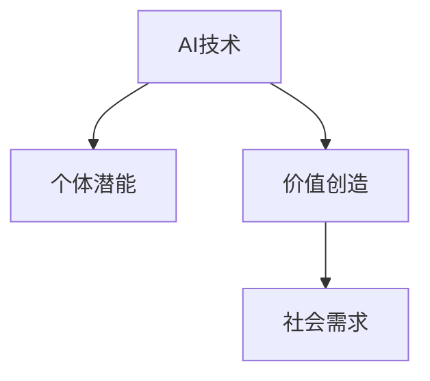

                 

# 赋能人类：释放个体潜能，创造无限可能

## 1. 背景介绍

在科技迅猛发展的今天，人工智能（AI）技术已经渗透到各行各业，深刻改变了我们的生活和工作方式。从自动驾驶汽车到智能客服，从精准医疗到智能制造，AI正在为各行各业赋能，释放个体潜能，创造无限可能。在这场技术革命中，个体不再是被动的接受者，而是成为AI技术的共同创造者。

### 1.1 问题由来

AI技术的进步，离不开庞大的数据、强大的计算能力和精妙的算法。然而，这些技术并非孤立存在，而是通过深度融合，共同构建起一个强大的技术生态。AI技术不仅改变了商业模式，还重塑了社会结构，引发了对个体潜能的重新认识和激发。

在过去，个体往往被视为知识技能的接受者，缺乏对技术创新的主动权。而随着AI技术的普及，个体开始成为技术创新的主体，能够通过学习和掌握AI技术，实现自我赋能，释放潜能，创造新的价值。

### 1.2 问题核心关键点

AI技术对个体潜能的释放，主要体现在以下几个方面：

- **自我提升**：个体通过学习AI技术，提升自身的专业技能和创新能力，成为AI技术的应用者。
- **价值创造**：个体结合AI技术，在各领域进行价值创新，创造新的商业模式和服务形态。
- **社会贡献**：个体通过AI技术解决社会问题，推动社会进步，实现个人价值与社会价值的统一。
- **跨界融合**：AI技术打破了各领域间的界限，促进个体跨学科学习，拓宽职业发展的可能性。

## 2. 核心概念与联系

### 2.1 核心概念概述

要理解AI技术如何赋能个体，首先需要了解几个核心概念：

- **AI技术**：指通过算法和计算能力，使计算机系统具备类似人类智能处理信息的能力。AI技术涵盖机器学习、深度学习、自然语言处理等多个领域。
- **个体潜能**：指个体在特定领域内的知识、技能和创造力的总和。潜能可以通过学习、实践等方式被激发和提升。
- **价值创造**：指个体利用自身能力，结合技术手段，创造出新的价值和服务，满足社会需求。

这些概念之间的联系如下图所示：



AI技术通过赋能个体，激发潜能，创造价值，满足社会需求，形成一个闭环。

## 3. 核心算法原理 & 具体操作步骤

### 3.1 算法原理概述

AI技术的赋能机制，主要通过以下几个算法原理实现：

- **强化学习（Reinforcement Learning, RL）**：通过奖励机制，使个体不断调整行为策略，优化决策过程。
- **迁移学习（Transfer Learning）**：通过已有知识，快速学习新领域任务，提升学习效率。
- **自适应学习（Adaptive Learning）**：根据个体学习状态，动态调整学习内容和难度，实现个性化学习。
- **协同学习（Collaborative Learning）**：通过多个体之间的互动合作，共同学习、共同进步。

这些算法原理，构成了AI技术赋能个体的基础。

### 3.2 算法步骤详解

AI技术的赋能流程，主要包括以下几个步骤：

**Step 1: 准备学习资源**

- 收集各类AI学习资源，包括在线课程、开源项目、论文等。
- 选择合适的学习平台，如Coursera、Udacity等，注册账号。

**Step 2: 制定学习计划**

- 确定学习目标和时间安排，制定详细的学习计划。
- 选择适合自己的学习方式，如自主学习、线上线下结合等。

**Step 3: 实施学习活动**

- 根据学习计划，逐步学习AI基础知识和技能。
- 通过实践项目，巩固所学知识，提升应用能力。

**Step 4: 获取反馈与改进**

- 参与线上线下讨论，获取反馈，了解自身不足之处。
- 调整学习策略，持续改进，提高学习效果。

**Step 5: 实现价值创造**

- 结合自身特长和AI技能，进行价值创新。
- 结合市场需求，开发应用，创造实际价值。

通过这些步骤，个体能够有效地学习和掌握AI技术，实现自我赋能，释放潜能。

### 3.3 算法优缺点

AI技术赋能个体，具有以下优点：

- **高效学习**：通过AI技术，个体可以高效地获取知识和技能。
- **个性化提升**：根据个体差异，提供定制化学习方案，实现个性化提升。
- **跨界融合**：AI技术打破了学科之间的界限，拓宽了职业发展的可能性。

同时，也存在以下缺点：

- **依赖资源**：AI学习需要大量的数据和计算资源，对个体的资源条件提出了较高要求。
- **高门槛**：AI技术复杂度高，对个体学习能力提出了挑战。
- **伦理风险**：AI技术在应用过程中可能存在伦理风险，如隐私保护、算法偏见等。

## 4. 数学模型和公式 & 详细讲解

### 4.1 数学模型构建

在AI技术的赋能机制中，强化学习是一个重要的组成部分。强化学习通过奖励机制，使个体不断调整行为策略，实现最优决策。

假设环境状态为 $s$，个体采取的动作为 $a$，环境反馈为 $r$，奖励机制为 $Q(s,a)$，目标为最大化累积奖励。强化学习的数学模型可以表示为：

$$
\max \sum_{t=0}^{\infty} \gamma^t Q(s_t, a_t)
$$

其中 $\gamma$ 为折扣因子，控制长期奖励的权重。

### 4.2 公式推导过程

强化学习的核心算法Q-Learning，通过迭代更新Q值，逐步逼近最优策略。假设环境状态数为 $N$，动作数为 $A$，学习率为 $\alpha$，折扣因子为 $\gamma$，Q-Learning的更新公式为：

$$
Q(s,a) \leftarrow Q(s,a) + \alpha [r + \gamma \max_{a'} Q(s',a') - Q(s,a)]
$$

其中 $Q(s,a)$ 为状态-动作对 $(s,a)$ 的Q值，$r$ 为即时奖励，$s'$ 为环境状态，$a'$ 为动作。

### 4.3 案例分析与讲解

以机器学习工程师为例，通过强化学习，可以实现职业晋升的路径优化。机器学习工程师在职业发展中，需要不断学习新的技能，提升自身能力。通过强化学习，机器学习工程师可以动态调整学习内容和难度，实现最大化职业价值。

假设机器学习工程师处于不同的学习阶段，每个阶段的Q值（即学习效果）为 $Q_0, Q_1, Q_2, \cdots$，即时奖励为 $r_0, r_1, r_2, \cdots$，目标为最大化职业价值。通过强化学习算法，可以找到最优的学习路径，实现职业价值最大化。

## 5. 项目实践：代码实例和详细解释说明

### 5.1 开发环境搭建

在开始项目实践前，需要先搭建好开发环境。以下是Python环境搭建的详细步骤：

1. 安装Python：从官网下载Python安装程序，按照向导完成安装。
2. 安装虚拟环境：
```bash
pip install virtualenv
```
3. 创建虚拟环境：
```bash
virtualenv myenv
```
4. 激活虚拟环境：
```bash
source myenv/bin/activate
```

### 5.2 源代码详细实现

下面以强化学习为例，给出基于Q-Learning算法的Python代码实现：

```python
import numpy as np

class QLearning:
    def __init__(self, N, A, alpha=0.1, gamma=0.9):
        self.N = N
        self.A = A
        self.alpha = alpha
        self.gamma = gamma
        self.Q = np.zeros((N, A))

    def choose_action(self, s):
        return np.random.choice(range(self.A), p=self.Q[s, :])

    def update_Q(self, s, a, r, s_next):
        self.Q[s, a] += self.alpha * (r + self.gamma * np.max(self.Q[s_next, :]) - self.Q[s, a])

# 示例使用
env = QLearning(N=2, A=2)
for episode in range(100):
    s = 0
    while True:
        a = env.choose_action(s)
        r = np.random.rand()
        s_next = np.random.randint(0, 2)
        env.update_Q(s, a, r, s_next)
        if s_next == 1:
            break
        s = s_next
```

### 5.3 代码解读与分析

**QLearning类**：
- `__init__`方法：初始化Q值矩阵，学习率 $\alpha$ 和折扣因子 $\gamma$。
- `choose_action`方法：根据当前状态 $s$ 随机选择一个动作 $a$。
- `update_Q`方法：根据即时奖励 $r$ 和下一个状态 $s_{next}$，更新状态-动作对 $(s,a)$ 的Q值。

**示例使用**：
- 初始化QLearning对象，设置环境状态数 $N$ 和动作数 $A$。
- 通过 `while` 循环，模拟强化学习过程，不断调整动作选择策略，更新Q值。

## 6. 实际应用场景

### 6.1 教育行业

AI技术在教育行业的应用，可以显著提升教学效果和学习效率。通过个性化学习平台，学生可以根据自身水平和兴趣，自主选择学习内容和进度。AI技术还可以根据学生的学习情况，动态调整教学策略，实现因材施教。

例如，智能化的教育平台可以通过分析学生的学习数据，推荐适合的练习题目和学习资源。同时，平台还可以通过强化学习算法，不断优化推荐策略，提高学习效果。

### 6.2 医疗健康

AI技术在医疗健康领域的应用，可以显著提升医疗服务质量和效率。通过AI诊断工具，医生可以更准确地识别疾病，提高诊断效率。AI技术还可以帮助医生进行个性化治疗方案设计，提高治疗效果。

例如，AI系统可以通过分析患者的医疗记录和基因数据，提供个性化的治疗建议。医生可以根据AI系统的推荐，制定更加精准的治疗方案，提高治疗成功率。

### 6.3 企业人力资源管理

AI技术在人力资源管理中的应用，可以提高招聘、培训、绩效评估等环节的效率和精度。通过AI系统，企业可以更精准地识别和选拔人才，优化员工培训计划，提升员工绩效。

例如，AI招聘系统可以通过分析候选人的简历和面试数据，预测候选人的工作表现，提高招聘效率。同时，AI培训系统可以根据员工的职业发展需求，推荐适合的培训课程，提升员工技能。

### 6.4 未来应用展望

随着AI技术的不断进步，未来将在更多领域得到应用，为个体赋能带来更多可能性。

- **智能家居**：AI技术可以构建智能家居系统，提升生活品质。通过语音识别、图像识别等技术，AI系统可以自动控制家居设备，实现智能家居。
- **智能交通**：AI技术可以优化交通流量，提高交通效率。通过智能交通管理系统，AI系统可以实时监测交通状况，优化交通信号灯和路线规划，缓解交通拥堵。
- **智能农业**：AI技术可以提升农业生产效率。通过智能农业系统，AI系统可以实时监测农作物生长状况，提供精准的种植建议，提高产量和质量。

## 7. 工具和资源推荐

### 7.1 学习资源推荐

为了帮助开发者掌握AI技术，这里推荐一些优质的学习资源：

1. **Coursera**：提供来自世界顶尖大学的在线课程，涵盖AI基础和高级内容。
2. **Udacity**：提供AI和机器学习方向的纳米学位课程，注重实践和项目实践。
3. **Kaggle**：提供各类AI竞赛和数据集，帮助开发者提升实战能力。
4. **Google AI Blog**：Google AI团队定期发布的最新研究和技术文章，涵盖AI领域的最新进展。
5. **OpenAI Blog**：OpenAI团队发布的最新研究和技术文章，涵盖AI领域的最新进展。

通过学习这些资源，相信你一定能够掌握AI技术的精髓，并应用于实际项目中。

### 7.2 开发工具推荐

高效的开发离不开优秀的工具支持。以下是几款用于AI技术开发的常用工具：

1. **PyTorch**：基于Python的开源深度学习框架，灵活易用，适合快速迭代研究。
2. **TensorFlow**：由Google主导开发的深度学习框架，生产部署方便，适合大规模工程应用。
3. **Jupyter Notebook**：免费的交互式笔记本环境，支持代码编写、数据可视化等功能，适合学习和开发。
4. **GitHub**：全球最大的开源社区，提供丰富的开源项目和协作工具，适合代码管理和版本控制。
5. **Google Colab**：谷歌推出的在线Jupyter Notebook环境，免费提供GPU/TPU算力，适合学习和实验最新模型。

合理利用这些工具，可以显著提升AI技术开发的效率，加速创新迭代的步伐。

### 7.3 相关论文推荐

AI技术的发展离不开学界的持续研究。以下是几篇奠基性的相关论文，推荐阅读：

1. **Deep Learning**：Ian Goodfellow等著，全面介绍了深度学习的基础理论和算法。
2. **Reinforcement Learning: An Introduction**：Richard S. Sutton和Andrew G. Barto著，介绍了强化学习的原理和算法。
3. **Natural Language Processing with Transformers**：Jacob Devlin等著，介绍了Transformer模型及其在NLP任务中的应用。
4. **Human Compatible AI**：Stuart Russell著，探讨了AI技术的伦理和安全问题，提出了构建人类友好型AI的思路。

这些论文代表了大数据、机器学习、强化学习等领域的研究进展，通过学习这些前沿成果，可以帮助研究者把握学科前进方向，激发更多的创新灵感。

## 8. 总结：未来发展趋势与挑战

### 8.1 总结

本文对AI技术如何赋能个体进行了全面系统的介绍。首先阐述了AI技术的背景和意义，明确了AI技术在个体潜能释放中的独特价值。其次，从原理到实践，详细讲解了强化学习等核心算法原理和具体操作步骤，给出了AI技术赋能的完整代码实例。同时，本文还广泛探讨了AI技术在教育、医疗、企业等各个领域的应用前景，展示了AI技术赋能的广阔前景。

通过本文的系统梳理，可以看到，AI技术正在成为个体赋能的重要手段，极大地拓展了个体的潜能，创造了更多的价值。未来，伴随AI技术的持续演进，相信AI技术将进一步赋能个体，释放更大潜能，推动社会进步。

### 8.2 未来发展趋势

展望未来，AI技术赋能个体的趋势将呈现以下几个方向：

1. **深度融合**：AI技术与各领域深度融合，进一步拓展应用场景，实现更广泛的价值创造。
2. **智能化提升**：AI技术通过智能化工具和平台，提升个体学习、工作和生活效率，实现自动化和智能化。
3. **个性化定制**：AI技术通过数据分析和算法优化，实现个性化服务和定制化解决方案，满足个体多样化需求。
4. **普惠普及**：AI技术通过降低学习成本和资源门槛，实现普惠普及，使更多人能够受益。
5. **伦理道德**：AI技术在赋能个体的同时，注重伦理道德建设，确保技术应用的安全性和可控性。

这些趋势凸显了AI技术赋能个体的广阔前景，为构建智能社会奠定了坚实基础。

### 8.3 面临的挑战

尽管AI技术赋能个体取得了显著成效，但在迈向更加智能化、普惠化应用的过程中，仍面临诸多挑战：

1. **数据隐私和安全**：AI技术在应用过程中，需要大量数据支持，如何保护数据隐私和安全，成为重要课题。
2. **算法偏见和公平性**：AI系统可能存在算法偏见，对某些群体造成不公平待遇，如何消除偏见，确保公平性，仍需努力。
3. **技术门槛**：AI技术复杂度高，对个体学习能力提出了挑战，如何降低学习门槛，实现普惠普及，成为重要课题。
4. **伦理和社会责任**：AI技术在赋能个体的同时，需要考虑伦理和社会责任，确保技术应用的社会影响。
5. **资源和环境**：AI技术的广泛应用，对资源和环境提出了更高要求，如何实现可持续发展的AI技术，成为重要课题。

这些挑战需要学界和产业界共同努力，才能克服障碍，实现AI技术赋能个体的理想目标。

### 8.4 研究展望

面对AI技术赋能个体所面临的挑战，未来的研究需要在以下几个方面寻求新的突破：

1. **数据隐私和安全保护**：开发更加安全可靠的数据保护技术，确保数据隐私和安全。
2. **公平性和透明性**：开发公平性和透明性强的AI算法，消除算法偏见，确保算法公平性。
3. **降低技术门槛**：开发易于理解和操作的AI工具，降低技术门槛，实现普惠普及。
4. **可持续发展的AI**：开发节能环保的AI技术，降低资源和环境成本，实现可持续发展。
5. **伦理和社会责任**：建立AI技术伦理和社会责任规范，确保AI技术应用符合社会价值。

这些研究方向的探索，必将引领AI技术赋能个体迈向更高的台阶，为构建智能社会做出更大贡献。面向未来，AI技术还需要与其他技术进行更深入的融合，如知识表示、因果推理、强化学习等，协同发力，推动AI技术在各个领域的应用和发展。只有勇于创新、敢于突破，才能不断拓展AI技术的边界，让技术更好地服务于人类社会。

## 9. 附录：常见问题与解答

**Q1: 如何理解AI技术赋能个体的过程？**

A: AI技术赋能个体，主要通过以下几个步骤实现：

1. **学习资源准备**：收集各类AI学习资源，选择合适的学习平台。
2. **制定学习计划**：确定学习目标和时间安排，制定详细的学习计划。
3. **实施学习活动**：逐步学习AI基础知识和技能，通过实践项目巩固知识。
4. **获取反馈与改进**：参与讨论，获取反馈，调整学习策略，持续改进。
5. **实现价值创造**：结合AI技术，开发应用，实现价值创造，满足社会需求。

通过这些步骤，个体能够有效地学习和掌握AI技术，实现自我赋能，释放潜能。

**Q2: 强化学习在个体赋能中的应用有哪些？**

A: 强化学习在个体赋能中的应用主要有以下几个方面：

1. **职业规划**：通过强化学习，个体可以优化职业路径，实现最大化职业价值。
2. **技能提升**：通过强化学习，个体可以动态调整学习内容和难度，实现个性化提升。
3. **游戏设计**：在游戏设计中，强化学习可以优化玩家行为策略，提升游戏体验。
4. **机器人控制**：在机器人控制中，强化学习可以优化动作策略，提高机器人性能。
5. **金融交易**：在金融交易中，强化学习可以优化交易策略，提高交易收益。

这些应用展示了强化学习在个体赋能中的广泛价值。

**Q3: 如何评估AI技术赋能个体的效果？**

A: 评估AI技术赋能个体的效果，可以从以下几个方面进行：

1. **学习效果**：评估个体通过AI学习获得的知识和技能。
2. **价值创造**：评估个体通过AI技术创造的实际价值和收益。
3. **技能提升**：评估个体通过AI技术提升的专业技能和创新能力。
4. **社会贡献**：评估个体通过AI技术解决的社会问题和贡献。
5. **技术门槛**：评估个体通过AI技术降低的技术门槛和资源条件。

通过这些评估指标，可以全面了解AI技术赋能个体的效果和潜力。

**Q4: 如何构建智能家居系统？**

A: 构建智能家居系统，需要以下几个步骤：

1. **传感器部署**：部署各类传感器，监测家居环境。
2. **数据采集**：通过传感器采集家居环境数据，如温度、湿度、光照等。
3. **数据分析**：利用AI技术，对采集数据进行分析，提取有用信息。
4. **智能控制**：根据分析结果，智能控制家居设备，如空调、灯等。
5. **用户体验优化**：不断优化用户体验，提高智能家居系统的实用性和舒适性。

通过这些步骤，可以构建一个智能化的家居系统，提升生活品质。

---

作者：禅与计算机程序设计艺术 / Zen and the Art of Computer Programming

