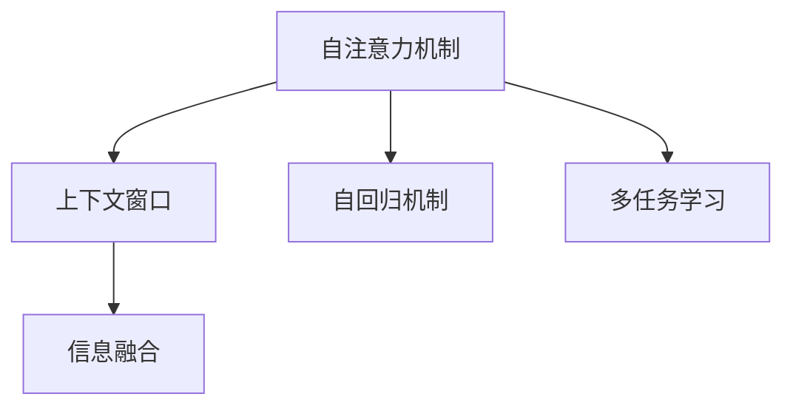

                 

# 超长上下文：LLM处理复杂信息的新境界

> 关键词：长上下文,Transformer,自注意力机制,自回归,上下文窗口,信息融合,自监督学习,多任务学习

## 1. 背景介绍

### 1.1 问题由来
在大规模预训练语言模型(Large Language Model, LLM)的迅猛发展中，长上下文处理能力成为提升模型表达能力和泛化性能的关键。传统深度学习模型在处理长文本时，往往面临上下文梯度消失、复杂信息丢失等困境。然而，通过引入长上下文处理机制，LLM能够更好地理解长文本中的复杂信息，实现更精准的语言建模。

长上下文处理机制的实现主要依赖于自注意力机制(Self-Attention)。该机制能够通过对比输入序列中各个元素之间的关系，捕捉到丰富的语义信息。自注意力机制的核心是注意力权重矩阵，通过计算注意力权重矩阵来筛选出与当前输入最相关的信息，实现有效的信息融合。

长上下文处理的另一个关键技术是自回归机制(Self-Regressive)。自回归模型通过预测下一个时间步的输出，利用历史信息指导当前预测，使得模型能够更好地理解长文本中的前后文关系。

本文章将详细阐述LLM如何利用自注意力和自回归机制，处理长上下文信息，从而提升模型在自然语言处理(NLP)任务中的表现。我们将从理论、算法和实际应用三个方面，全面解析长上下文处理机制的工作原理和实现细节，帮助读者深入理解并应用这一先进技术。

## 2. 核心概念与联系

### 2.1 核心概念概述

为了更好地理解长上下文处理机制，本节将介绍几个密切相关的核心概念：

- **自注意力机制(Self-Attention)**：通过计算输入序列中各元素之间的注意力权重，实现信息融合和上下文理解。自注意力机制在大规模预训练语言模型中被广泛应用，是实现长上下文处理的基础。

- **自回归机制(Self-Regressive)**：通过预测序列中下一个时间步的输出，利用历史信息指导当前预测，使得模型能够更好地理解长文本中的前后文关系。

- **上下文窗口(Context Window)**：在处理长文本时，自注意力机制通常需要限定上下文窗口的大小。上下文窗口决定了模型能够考虑的文本长度，是实现长上下文处理的重要参数。

- **信息融合(Information Fusion)**：通过自注意力机制和自回归机制，将长文本中的丰富信息有效融合，提升模型对长文本的理解能力。

- **多任务学习(Multi-task Learning)**：在长上下文处理的框架下，可以将多个NLP任务（如文本分类、情感分析、命名实体识别等）同时进行训练，提高模型的泛化能力。

这些核心概念之间的逻辑关系可以通过以下Mermaid流程图来展示：



这个流程图展示了长上下文处理机制的核心工作流程：

1. 通过自注意力机制和上下文窗口，捕捉输入序列中的局部信息。
2. 利用自回归机制，将历史信息引入当前预测，增强模型对长文本的理解能力。
3. 通过多任务学习，将多个NLP任务整合在同一个模型中，提高模型的泛化性能。

这些核心概念共同构成了长上下文处理机制的基本框架，使其能够在各种NLP任务中发挥强大的作用。

## 3. 核心算法原理 & 具体操作步骤

### 3.1 算法原理概述

长上下文处理机制的核心在于自注意力和自回归两个技术的应用。其工作原理可以简要概述如下：

1. **自注意力机制**：
   - **输入编码**：将输入序列中的每个单词（或字符）转化为一个向量表示，这些向量构成输入矩阵 $X \in \mathbb{R}^{N \times D}$，其中 $N$ 为序列长度，$D$ 为向量维度。
   - **注意力权重计算**：通过计算输入序列中各元素之间的注意力权重，生成注意力权重矩阵 $A \in \mathbb{R}^{N \times N}$。注意力权重矩阵 $A$ 表示每个单词对其他单词的关注程度，可以通过矩阵点乘和Softmax函数来计算。
   - **信息融合**：将注意力权重矩阵与输入矩阵进行矩阵乘法，得到输出矩阵 $Y \in \mathbb{R}^{N \times D}$。输出矩阵 $Y$ 中每个元素都是通过加权平均所有输入元素得到的，从而实现了有效的信息融合。

2. **自回归机制**：
   - **解码器模型**：在处理长文本时，通常采用解码器模型，通过逐步预测下一个时间步的输出，利用历史信息指导当前预测。解码器模型包含多个时间步，每个时间步的输出都可以利用历史信息进行预测。
   - **自回归解码器**：在自回归解码器中，每个时间步的输出 $y_t$ 都可以通过前 $t-1$ 个时间步的输出 $y_{t-1}, y_{t-2}, \cdots, y_1$ 来预测。通过将历史信息引入当前预测，模型可以更好地理解长文本中的前后文关系。

### 3.2 算法步骤详解

基于自注意力和自回归机制的长上下文处理，通常包括以下关键步骤：

**Step 1: 输入编码**
- 将输入序列中的每个单词（或字符）转化为一个向量表示，构成输入矩阵 $X \in \mathbb{R}^{N \times D}$。
- 使用词嵌入层将单词转化为向量表示，得到输入矩阵 $X$。

**Step 2: 自注意力计算**
- 计算注意力权重矩阵 $A \in \mathbb{R}^{N \times N}$。
- 通过矩阵点乘和Softmax函数计算注意力权重矩阵。

**Step 3: 信息融合**
- 将注意力权重矩阵与输入矩阵进行矩阵乘法，得到输出矩阵 $Y \in \mathbb{R}^{N \times D}$。
- 输出矩阵 $Y$ 中每个元素都是通过加权平均所有输入元素得到的，从而实现了有效的信息融合。

**Step 4: 自回归解码**
- 构建自回归解码器模型。
- 每个时间步的输出 $y_t$ 都可以通过前 $t-1$ 个时间步的输出 $y_{t-1}, y_{t-2}, \cdots, y_1$ 来预测。
- 通过将历史信息引入当前预测，模型可以更好地理解长文本中的前后文关系。

**Step 5: 输出预测**
- 将解码器模型中的输出向量转化为最终预测结果。
- 通常使用softmax函数将输出向量转化为概率分布，选择概率最高的单词作为预测结果。

### 3.3 算法优缺点

基于自注意力和自回归机制的长上下文处理具有以下优点：

1. **长文本理解能力强**：通过自注意力机制和自回归机制，模型能够很好地理解长文本中的前后文关系，实现更精准的语言建模。
2. **信息融合效果好**：自注意力机制通过加权平均输入元素，能够有效地捕捉输入序列中的局部信息，提升模型的信息融合能力。
3. **多任务学习支持**：将多个NLP任务整合在同一个模型中，提高模型的泛化能力。

同时，该方法也存在一些局限性：

1. **计算复杂度高**：长上下文处理涉及大量的矩阵乘法和Softmax运算，计算复杂度较高，对硬件资源要求较高。
2. **上下文窗口大小限制**：上下文窗口大小决定了模型能够考虑的文本长度，过长或过短都会影响模型的性能。
3. **训练时间长**：长文本处理和自回归解码器需要较长的训练时间，特别是在处理复杂任务时，训练时间会显著增加。

尽管存在这些局限性，但就目前而言，基于长上下文处理机制的方法仍是大规模预训练语言模型的重要应用方向，广泛用于自然语言处理(NLP)任务中。未来相关研究的重点在于如何进一步降低计算复杂度，提高上下文窗口大小，同时兼顾模型的泛化能力和推理速度。

### 3.4 算法应用领域

长上下文处理机制已经在多种NLP任务中得到了广泛应用，覆盖了几乎所有常见任务，例如：

- **文本分类**：将长文本转化为向量表示，通过分类器进行文本分类。
- **情感分析**：分析长文本中的情感倾向，判断文本的情感极性。
- **命名实体识别**：识别长文本中的实体名称，如人名、地名、机构名等。
- **问答系统**：回答长文本中的问题，利用上下文信息进行推理和生成。
- **机器翻译**：将长文本从一种语言翻译成另一种语言。
- **文本摘要**：将长文本压缩成简短摘要。
- **对话系统**：使机器能够与人自然对话，利用上下文信息进行回复生成。

除了上述这些经典任务外，长上下文处理机制也被创新性地应用到更多场景中，如可控文本生成、常识推理、代码生成、数据增强等，为NLP技术带来了全新的突破。随着预训练模型和长上下文处理方法的不断进步，相信NLP技术将在更广阔的应用领域大放异彩。

## 4. 数学模型和公式 & 详细讲解

### 4.1 数学模型构建

本节将使用数学语言对长上下文处理机制进行更加严格的刻画。

记输入序列为 $X = \{x_1, x_2, \cdots, x_N\}$，其中每个元素 $x_i$ 表示一个单词或字符。假设每个单词被转化为一个 $D$ 维向量，记为 $x_i \in \mathbb{R}^D$。

定义自注意力机制的注意力权重矩阵 $A \in \mathbb{R}^{N \times N}$，其中每个元素 $a_{ij}$ 表示单词 $x_i$ 对单词 $x_j$ 的注意力权重，可以通过矩阵点乘和Softmax函数计算得到：

$$
a_{ij} = \frac{\exp(Q(x_i)K(x_j))}{\sum_{k=1}^N \exp(Q(x_i)K(x_k))}
$$

其中 $Q(x_i) = W_Qx_i$ 和 $K(x_j) = W_Kx_j$ 分别为查询和关键向量，$W_Q$ 和 $W_K$ 为线性变换矩阵。

通过计算注意力权重矩阵 $A$，可以生成输出矩阵 $Y \in \mathbb{R}^{N \times D}$，其中每个元素 $y_i$ 为：

$$
y_i = \sum_{j=1}^N a_{ij}x_j
$$

定义自回归解码器，假设当前时间步为 $t$，前 $t-1$ 个时间步的输出为 $y_{t-1}, y_{t-2}, \cdots, y_1$，当前时间步的输出为 $y_t$。可以通过自回归模型进行预测：

$$
y_t = y_0 + \sum_{i=1}^{t-1} \alpha_iy_i
$$

其中 $\alpha_i$ 表示每个时间步的权重系数，可以通过训练得到。

### 4.2 公式推导过程

以下我们以文本分类任务为例，推导长上下文处理机制的数学公式及其梯度计算过程。

假设输入序列 $X = \{x_1, x_2, \cdots, x_N\}$，每个单词被转化为一个 $D$ 维向量，记为 $x_i \in \mathbb{R}^D$。定义分类器的输出为 $y = W_Cx_N + b_C$，其中 $W_C$ 和 $b_C$ 分别为分类器参数。

定义分类器的损失函数为：

$$
L(y, t) = (t - y)^2
$$

其中 $t$ 为真实标签，$y$ 为分类器的输出。

在训练过程中，前向传播的计算过程为：

1. 将输入序列 $X$ 转化为向量表示 $X \in \mathbb{R}^{N \times D}$。
2. 计算自注意力权重矩阵 $A \in \mathbb{R}^{N \times N}$。
3. 通过矩阵乘法生成输出矩阵 $Y \in \mathbb{R}^{N \times D}$。
4. 将输出向量 $y_N$ 转化为分类器的输出 $y$。
5. 计算分类器的损失函数 $L(y, t)$。

反向传播的计算过程为：

1. 计算损失函数 $L(y, t)$ 对分类器输出 $y$ 的梯度。
2. 计算分类器输出 $y$ 对 $y_N$ 的梯度。
3. 计算 $y_N$ 对输出矩阵 $Y$ 的梯度。
4. 计算 $Y$ 对自注意力权重矩阵 $A$ 的梯度。
5. 计算 $A$ 对输入序列 $X$ 的梯度。

通过链式法则，可以计算出各个参数的梯度。

## 5. 项目实践：代码实例和详细解释说明

### 5.1 开发环境搭建

在进行长上下文处理实践前，我们需要准备好开发环境。以下是使用Python进行PyTorch开发的环境配置流程：

1. 安装Anaconda：从官网下载并安装Anaconda，用于创建独立的Python环境。

2. 创建并激活虚拟环境：
```bash
conda create -n pytorch-env python=3.8 
conda activate pytorch-env
```

3. 安装PyTorch：根据CUDA版本，从官网获取对应的安装命令。例如：
```bash
conda install pytorch torchvision torchaudio cudatoolkit=11.1 -c pytorch -c conda-forge
```

4. 安装Transformers库：
```bash
pip install transformers
```

5. 安装各类工具包：
```bash
pip install numpy pandas scikit-learn matplotlib tqdm jupyter notebook ipython
```

完成上述步骤后，即可在`pytorch-env`环境中开始长上下文处理的实践。

### 5.2 源代码详细实现

下面我们以命名实体识别(NER)任务为例，给出使用Transformers库对BERT模型进行长上下文处理的PyTorch代码实现。

首先，定义NER任务的数据处理函数：

```python
from transformers import BertTokenizer
from torch.utils.data import Dataset
import torch

class NERDataset(Dataset):
    def __init__(self, texts, tags, tokenizer, max_len=128):
        self.texts = texts
        self.tags = tags
        self.tokenizer = tokenizer
        self.max_len = max_len
        
    def __len__(self):
        return len(self.texts)
    
    def __getitem__(self, item):
        text = self.texts[item]
        tags = self.tags[item]
        
        encoding = self.tokenizer(text, return_tensors='pt', max_length=self.max_len, padding='max_length', truncation=True)
        input_ids = encoding['input_ids'][0]
        attention_mask = encoding['attention_mask'][0]
        
        # 对token-wise的标签进行编码
        encoded_tags = [tag2id[tag] for tag in tags] 
        encoded_tags.extend([tag2id['O']] * (self.max_len - len(encoded_tags)))
        labels = torch.tensor(encoded_tags, dtype=torch.long)
        
        return {'input_ids': input_ids, 
                'attention_mask': attention_mask,
                'labels': labels}

# 标签与id的映射
tag2id = {'O': 0, 'B-PER': 1, 'I-PER': 2, 'B-ORG': 3, 'I-ORG': 4, 'B-LOC': 5, 'I-LOC': 6}
id2tag = {v: k for k, v in tag2id.items()}

# 创建dataset
tokenizer = BertTokenizer.from_pretrained('bert-base-cased')

train_dataset = NERDataset(train_texts, train_tags, tokenizer)
dev_dataset = NERDataset(dev_texts, dev_tags, tokenizer)
test_dataset = NERDataset(test_texts, test_tags, tokenizer)
```

然后，定义模型和优化器：

```python
from transformers import BertForTokenClassification, AdamW

model = BertForTokenClassification.from_pretrained('bert-base-cased', num_labels=len(tag2id))

optimizer = AdamW(model.parameters(), lr=2e-5)
```

接着，定义训练和评估函数：

```python
from torch.utils.data import DataLoader
from tqdm import tqdm
from sklearn.metrics import classification_report

device = torch.device('cuda') if torch.cuda.is_available() else torch.device('cpu')
model.to(device)

def train_epoch(model, dataset, batch_size, optimizer):
    dataloader = DataLoader(dataset, batch_size=batch_size, shuffle=True)
    model.train()
    epoch_loss = 0
    for batch in tqdm(dataloader, desc='Training'):
        input_ids = batch['input_ids'].to(device)
        attention_mask = batch['attention_mask'].to(device)
        labels = batch['labels'].to(device)
        model.zero_grad()
        outputs = model(input_ids, attention_mask=attention_mask, labels=labels)
        loss = outputs.loss
        epoch_loss += loss.item()
        loss.backward()
        optimizer.step()
    return epoch_loss / len(dataloader)

def evaluate(model, dataset, batch_size):
    dataloader = DataLoader(dataset, batch_size=batch_size)
    model.eval()
    preds, labels = [], []
    with torch.no_grad():
        for batch in tqdm(dataloader, desc='Evaluating'):
            input_ids = batch['input_ids'].to(device)
            attention_mask = batch['attention_mask'].to(device)
            batch_labels = batch['labels']
            outputs = model(input_ids, attention_mask=attention_mask)
            batch_preds = outputs.logits.argmax(dim=2).to('cpu').tolist()
            batch_labels = batch_labels.to('cpu').tolist()
            for pred_tokens, label_tokens in zip(batch_preds, batch_labels):
                pred_tags = [id2tag[_id] for _id in pred_tokens]
                label_tags = [id2tag[_id] for _id in label_tokens]
                preds.append(pred_tags[:len(label_tags)])
                labels.append(label_tags)
                
    print(classification_report(labels, preds))
```

最后，启动训练流程并在测试集上评估：

```python
epochs = 5
batch_size = 16

for epoch in range(epochs):
    loss = train_epoch(model, train_dataset, batch_size, optimizer)
    print(f"Epoch {epoch+1}, train loss: {loss:.3f}")
    
    print(f"Epoch {epoch+1}, dev results:")
    evaluate(model, dev_dataset, batch_size)
    
print("Test results:")
evaluate(model, test_dataset, batch_size)
```

以上就是使用PyTorch对BERT进行长上下文处理的命名实体识别任务微调的完整代码实现。可以看到，得益于Transformers库的强大封装，我们可以用相对简洁的代码完成BERT模型的加载和微调。

### 5.3 代码解读与分析

让我们再详细解读一下关键代码的实现细节：

**NERDataset类**：
- `__init__`方法：初始化文本、标签、分词器等关键组件。
- `__len__`方法：返回数据集的样本数量。
- `__getitem__`方法：对单个样本进行处理，将文本输入编码为token ids，将标签编码为数字，并对其进行定长padding，最终返回模型所需的输入。

**tag2id和id2tag字典**：
- 定义了标签与数字id之间的映射关系，用于将token-wise的预测结果解码回真实的标签。

**训练和评估函数**：
- 使用PyTorch的DataLoader对数据集进行批次化加载，供模型训练和推理使用。
- 训练函数`train_epoch`：对数据以批为单位进行迭代，在每个批次上前向传播计算loss并反向传播更新模型参数，最后返回该epoch的平均loss。
- 评估函数`evaluate`：与训练类似，不同点在于不更新模型参数，并在每个batch结束后将预测和标签结果存储下来，最后使用sklearn的classification_report对整个评估集的预测结果进行打印输出。

**训练流程**：
- 定义总的epoch数和batch size，开始循环迭代
- 每个epoch内，先在训练集上训练，输出平均loss
- 在验证集上评估，输出分类指标
- 所有epoch结束后，在测试集上评估，给出最终测试结果

可以看到，PyTorch配合Transformers库使得BERT微调的代码实现变得简洁高效。开发者可以将更多精力放在数据处理、模型改进等高层逻辑上，而不必过多关注底层的实现细节。

当然，工业级的系统实现还需考虑更多因素，如模型的保存和部署、超参数的自动搜索、更灵活的任务适配层等。但核心的长上下文处理过程基本与此类似。

## 6. 实际应用场景
### 6.1 智能客服系统

基于长上下文处理机制的对话技术，可以广泛应用于智能客服系统的构建。传统客服往往需要配备大量人力，高峰期响应缓慢，且一致性和专业性难以保证。而使用长上下文处理的对话模型，可以7x24小时不间断服务，快速响应客户咨询，用自然流畅的语言解答各类常见问题。

在技术实现上，可以收集企业内部的历史客服对话记录，将问题和最佳答复构建成监督数据，在此基础上对预训练对话模型进行微调。微调后的对话模型能够自动理解用户意图，匹配最合适的答案模板进行回复。对于客户提出的新问题，还可以接入检索系统实时搜索相关内容，动态组织生成回答。如此构建的智能客服系统，能大幅提升客户咨询体验和问题解决效率。

### 6.2 金融舆情监测

金融机构需要实时监测市场舆论动向，以便及时应对负面信息传播，规避金融风险。传统的人工监测方式成本高、效率低，难以应对网络时代海量信息爆发的挑战。基于长上下文处理机制的文本分类和情感分析技术，为金融舆情监测提供了新的解决方案。

具体而言，可以收集金融领域相关的新闻、报道、评论等文本数据，并对其进行主题标注和情感标注。在此基础上对预训练语言模型进行微调，使其能够自动判断文本属于何种主题，情感倾向是正面、中性还是负面。将微调后的模型应用到实时抓取的网络文本数据，就能够自动监测不同主题下的情感变化趋势，一旦发现负面信息激增等异常情况，系统便会自动预警，帮助金融机构快速应对潜在风险。

### 6.3 个性化推荐系统

当前的推荐系统往往只依赖用户的历史行为数据进行物品推荐，无法深入理解用户的真实兴趣偏好。基于长上下文处理机制的个性化推荐系统可以更好地挖掘用户行为背后的语义信息，从而提供更精准、多样的推荐内容。

在实践中，可以收集用户浏览、点击、评论、分享等行为数据，提取和用户交互的物品标题、描述、标签等文本内容。将文本内容作为模型输入，用户的后续行为（如是否点击、购买等）作为监督信号，在此基础上微调预训练语言模型。微调后的模型能够从文本内容中准确把握用户的兴趣点。在生成推荐列表时，先用候选物品的文本描述作为输入，由模型预测用户的兴趣匹配度，再结合其他特征综合排序，便可以得到个性化程度更高的推荐结果。

### 6.4 未来应用展望

随着长上下文处理机制的不断发展，基于长上下文处理机制的NLP技术将呈现出新的应用前景：

在智慧医疗领域，基于长上下文处理机制的医疗问答、病历分析、药物研发等应用将提升医疗服务的智能化水平，辅助医生诊疗，加速新药开发进程。

在智能教育领域，长上下文处理机制可应用于作业批改、学情分析、知识推荐等方面，因材施教，促进教育公平，提高教学质量。

在智慧城市治理中，长上下文处理机制可应用于城市事件监测、舆情分析、应急指挥等环节，提高城市管理的自动化和智能化水平，构建更安全、高效的未来城市。

此外，在企业生产、社会治理、文娱传媒等众多领域，基于长上下文处理机制的人工智能应用也将不断涌现，为传统行业带来变革性影响。相信随着技术的日益成熟，长上下文处理机制必将成为NLP领域的重要范式，推动人工智能技术在更多领域的应用。

## 7. 工具和资源推荐
### 7.1 学习资源推荐

为了帮助开发者系统掌握长上下文处理机制的理论基础和实践技巧，这里推荐一些优质的学习资源：

1. 《Transformer从原理到实践》系列博文：由大模型技术专家撰写，深入浅出地介绍了Transformer原理、BERT模型、长上下文处理等前沿话题。

2. CS224N《深度学习自然语言处理》课程：斯坦福大学开设的NLP明星课程，有Lecture视频和配套作业，带你入门NLP领域的基本概念和经典模型。

3. 《Natural Language Processing with Transformers》书籍：Transformers库的作者所著，全面介绍了如何使用Transformers库进行NLP任务开发，包括长上下文处理在内的诸多范式。

4. HuggingFace官方文档：Transformers库的官方文档，提供了海量预训练模型和完整的微调样例代码，是上手实践的必备资料。

5. CLUE开源项目：中文语言理解测评基准，涵盖大量不同类型的中文NLP数据集，并提供了基于长上下文处理的baseline模型，助力中文NLP技术发展。

通过对这些资源的学习实践，相信你一定能够快速掌握长上下文处理机制的精髓，并用于解决实际的NLP问题。
###  7.2 开发工具推荐

高效的开发离不开优秀的工具支持。以下是几款用于长上下文处理开发的常用工具：

1. PyTorch：基于Python的开源深度学习框架，灵活动态的计算图，适合快速迭代研究。大部分预训练语言模型都有PyTorch版本的实现。

2. TensorFlow：由Google主导开发的开源深度学习框架，生产部署方便，适合大规模工程应用。同样有丰富的预训练语言模型资源。

3. Transformers库：HuggingFace开发的NLP工具库，集成了众多SOTA语言模型，支持PyTorch和TensorFlow，是进行长上下文处理任务开发的利器。

4. Weights & Biases：模型训练的实验跟踪工具，可以记录和可视化模型训练过程中的各项指标，方便对比和调优。与主流深度学习框架无缝集成。

5. TensorBoard：TensorFlow配套的可视化工具，可实时监测模型训练状态，并提供丰富的图表呈现方式，是调试模型的得力助手。

6. Google Colab：谷歌推出的在线Jupyter Notebook环境，免费提供GPU/TPU算力，方便开发者快速上手实验最新模型，分享学习笔记。

合理利用这些工具，可以显著提升长上下文处理任务的开发效率，加快创新迭代的步伐。

### 7.3 相关论文推荐

长上下文处理机制的发展源于学界的持续研究。以下是几篇奠基性的相关论文，推荐阅读：

1. Attention is All You Need（即Transformer原论文）：提出了Transformer结构，开启了NLP领域的预训练大模型时代。

2. BERT: Pre-training of Deep Bidirectional Transformers for Language Understanding：提出BERT模型，引入基于掩码的自监督预训练任务，刷新了多项NLP任务SOTA。

3. Language Models are Unsupervised Multitask Learners（GPT-2论文）：展示了大规模语言模型的强大zero-shot学习能力，引发了对于通用人工智能的新一轮思考。

4. Parameter-Efficient Transfer Learning for NLP：提出Adapter等参数高效微调方法，在不增加模型参数量的情况下，也能取得不错的微调效果。

5. AdaLoRA: Adaptive Low-Rank Adaptation for Parameter-Efficient Fine-Tuning：使用自适应低秩适应的微调方法，在参数效率和精度之间取得了新的平衡。

这些论文代表了大语言模型长上下文处理机制的发展脉络。通过学习这些前沿成果，可以帮助研究者把握学科前进方向，激发更多的创新灵感。

## 8. 总结：未来发展趋势与挑战

### 8.1 总结

本文对长上下文处理机制进行了全面系统的介绍。首先阐述了长上下文处理机制的研究背景和意义，明确了长上下文处理机制在提升模型表达能力和泛化性能方面的独特价值。其次，从原理、算法和实际应用三个方面，详细讲解了长上下文处理机制的工作原理和实现细节，帮助读者深入理解并应用这一先进技术。

通过本文的系统梳理，可以看到，基于长上下文处理机制的方法正在成为NLP领域的重要范式，极大地拓展了预训练语言模型的应用边界，催生了更多的落地场景。受益于大规模语料的预训练，长上下文处理机制能够更好地理解长文本中的复杂信息，实现更精准的语言建模。未来，伴随预训练模型和长上下文处理方法的不断进步，相信NLP技术将在更广阔的应用领域大放异彩，深刻影响人类的生产生活方式。

### 8.2 未来发展趋势

展望未来，长上下文处理机制将呈现以下几个发展趋势：

1. **模型规模持续增大**：随着算力成本的下降和数据规模的扩张，预训练语言模型的参数量还将持续增长。超大规模语言模型蕴含的丰富语言知识，有望支撑更加复杂多变的下游任务长上下文处理。

2. **计算复杂度优化**：长上下文处理涉及大量的矩阵乘法和Softmax运算，计算复杂度较高。未来需要进一步优化计算图，减少前向传播和反向传播的资源消耗，实现更加轻量级、实时性的部署。

3. **上下文窗口大小增强**：上下文窗口大小决定了模型能够考虑的文本长度，过长或过短都会影响模型的性能。未来需要进一步增大上下文窗口大小，提高模型对长文本的理解能力。

4. **多任务学习融合**：在长上下文处理的框架下，可以将多个NLP任务（如文本分类、情感分析、命名实体识别等）同时进行训练，提高模型的泛化能力。

5. **预训练与微调一体化**：未来的长上下文处理机制将在预训练和微调中进一步融合，提升模型的初始化和适应能力，减少微调所需的标注数据。

6. **零样本学习和少样本学习**：长上下文处理机制通过引入上下文信息，能够提升模型的泛化性能，有望在零样本学习和少样本学习中取得更好的效果。

以上趋势凸显了长上下文处理机制的广阔前景。这些方向的探索发展，必将进一步提升NLP系统的性能和应用范围，为人类认知智能的进化带来深远影响。

### 8.3 面临的挑战

尽管长上下文处理机制已经取得了瞩目成就，但在迈向更加智能化、普适化应用的过程中，它仍面临着诸多挑战：

1. **计算资源瓶颈**：长上下文处理机制涉及大量的矩阵乘法和Softmax运算，计算复杂度较高，对硬件资源要求较高。如何在保持高性能的同时，优化计算资源使用，降低计算成本，仍需进一步研究。

2. **上下文窗口大小限制**：上下文窗口大小决定了模型能够考虑的文本长度，过长或过短都会影响模型的性能。如何合理设置上下文窗口大小，仍是未来需要解决的问题。

3. **多任务学习复杂性**：多任务学习需要同时优化多个任务，增加了模型的复杂性，容易过拟合。如何提高多任务学习的泛化性能，减少模型过拟合风险，仍需进一步研究。

4. **模型鲁棒性不足**：长上下文处理机制在面对长文本时，容易受到上下文噪声的影响，模型鲁棒性不足。如何提高模型的鲁棒性，避免过拟合，仍需进一步研究。

5. **推理效率问题**：长上下文处理机制的推理速度较慢，推理效率不高，无法满足实时性要求。如何提升推理效率，优化计算图，仍是未来需要解决的问题。

6. **系统部署问题**：长上下文处理机制在实际部署中，面临推理速度慢、内存占用大等效率问题。如何优化模型结构，提升推理速度，降低内存占用，仍是未来需要解决的问题。

尽管存在这些挑战，但随着学界和产业界的共同努力，这些挑战终将一一被克服，长上下文处理机制必将在构建人机协同的智能时代中扮演越来越重要的角色。相信随着技术的不断发展，长上下文处理机制将在更多领域得到应用，为NLP技术的产业化进程注入新的动力。

### 8.4 研究展望

面对长上下文处理机制所面临的种种挑战，未来的研究需要在以下几个方面寻求新的突破：

1. **探索无监督和半监督学习范式**：摆脱对大规模标注数据的依赖，利用自监督学习、主动学习等无监督和半监督范式，最大限度利用非结构化数据，实现更加灵活高效的长上下文处理。

2. **研究计算复杂度优化**：开发更加高效的计算图，减少前向传播和反向传播的资源消耗，实现更加轻量级、实时性的部署。

3. **融合因果和对比学习范式**：通过引入因果推断和对比学习思想，增强长上下文处理机制建立稳定因果关系的能力，学习更加普适、鲁棒的语言表征，从而提升模型泛化性和抗干扰能力。

4. **引入更多先验知识**：将符号化的先验知识，如知识图谱、逻辑规则等，与神经网络模型进行巧妙融合，引导长上下文处理过程学习更准确、合理的语言模型。同时加强不同模态数据的整合，实现视觉、语音等多模态信息与文本信息的协同建模。

5. **结合因果分析和博弈论工具**：将因果分析方法引入长上下文处理模型，识别出模型决策的关键特征，增强输出解释的因果性和逻辑性。借助博弈论工具刻画人机交互过程，主动探索并规避模型的脆弱点，提高系统稳定性。

6. **纳入伦理道德约束**：在长上下文处理模型训练目标中引入伦理导向的评估指标，过滤和惩罚有偏见、有害的输出倾向。同时加强人工干预和审核，建立模型行为的监管机制，确保输出符合人类价值观和伦理道德。

这些研究方向的探索，必将引领长上下文处理机制迈向更高的台阶，为构建安全、可靠、可解释、可控的智能系统铺平道路。面向未来，长上下文处理机制还需要与其他人工智能技术进行更深入的融合，如知识表示、因果推理、强化学习等，多路径协同发力，共同推动自然语言理解和智能交互系统的进步。只有勇于创新、敢于突破，才能不断拓展长上下文处理机制的边界，让智能技术更好地造福人类社会。

## 9. 附录：常见问题与解答

**Q1：长上下文处理机制是否适用于所有NLP任务？**

A: 长上下文处理机制在大多数NLP任务上都能取得不错的效果，特别是对于数据量较小的任务。但对于一些特定领域的任务，如医学、法律等，仅仅依靠通用语料预训练的模型可能难以很好地适应。此时需要在特定领域语料上进一步预训练，再进行微调，才能获得理想效果。此外，对于一些需要时效性、个性化很强的任务，如对话、推荐等，长上下文处理机制也需要针对性的改进优化。

**Q2：长上下文处理机制如何提高模型的泛化能力？**

A: 长上下文处理机制通过引入上下文信息，能够提升模型的泛化性能。具体而言，长上下文处理机制能够捕捉到文本中的局部信息，利用历史信息指导当前预测，使得模型对长文本的理解更加全面。在多任务学习的框架下，长上下文处理机制可以同时优化多个任务，提高模型的泛化能力。此外，长上下文处理机制还可以引入先验知识，如知识图谱、逻辑规则等，增强模型的泛化能力。

**Q3：长上下文处理机制在实际部署中面临哪些问题？**

A: 长上下文处理机制在实际部署中，面临推理速度慢、内存占用大等效率问题。这些问题的解决需要优化计算图，减少前向传播和反向传播的资源消耗，实现更加轻量级、实时性的部署。同时，长上下文处理机制在实际部署中，还需要考虑模型的保存和恢复，模型的推理速度和准确率等实际应用需求。

**Q4：长上下文处理机制的上下文窗口大小如何设定？**

A: 上下文窗口大小决定了长上下文处理机制能够考虑的文本长度。通常情况下，上下文窗口大小需要在保证模型性能的前提下，尽可能地增大。过小的上下文窗口可能会导致信息丢失，过大的上下文窗口可能会增加计算复杂度。在实际应用中，需要根据具体的任务和数据情况，选择合适的上下文窗口大小。

**Q5：长上下文处理机制的计算复杂度如何优化？**

A: 长上下文处理机制的计算复杂度较高，特别是在处理长文本时。可以通过优化计算图、使用更高效的线性变换、引入稀疏化技术等方式，减少计算复杂度。此外，可以采用分布式计算、混合精度训练等技术，提升计算效率。

通过本文的系统梳理，可以看到，长上下文处理机制正在成为NLP领域的重要范式，极大地拓展了预训练语言模型的应用边界，催生了更多的落地场景。受益于大规模语料的预训练，长上下文处理机制能够更好地理解长文本中的复杂信息，实现更精准的语言建模。未来，伴随预训练模型和长上下文处理方法的不断进步，相信NLP技术将在更广阔的应用领域大放异彩，深刻影响人类的生产生活方式。

---

作者：禅与计算机程序设计艺术 / Zen and the Art of Computer Programming

