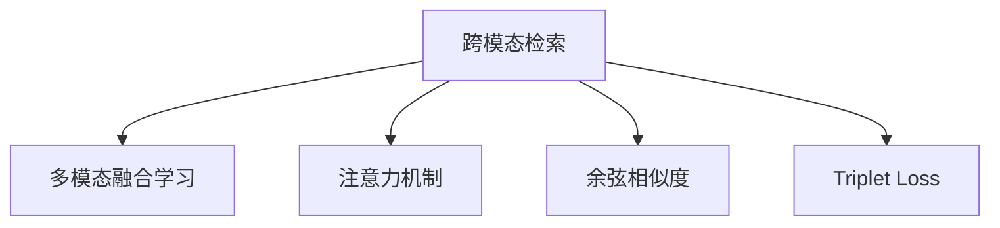

                 

# 跨模态检索：文本到图像、图像到文本的匹配技术

> 关键词：跨模态检索, 文本到图像, 图像到文本, 匹配技术, 深度学习, 多模态数据, 融合学习, 注意力机制, 检索精度, 计算效率, 实际应用

## 1. 背景介绍

### 1.1 问题由来
在信息爆炸的时代，文本和图像等数据形式广泛存在于互联网和各行各业中。如何高效地检索和匹配这些不同模态的数据，是信息获取和知识管理的重要挑战。跨模态检索（Cross-Modal Retrieval）正是在这种背景下发展起来的一项关键技术。

跨模态检索旨在将文本和图像等多模态数据有效地匹配起来，使得用户可以通过搜索一个模态的数据来获取另一个模态的相关信息。例如，用户可以通过搜索一张图片来获取与其相关的文本描述，或通过搜索一段文本来找到对应的图像。这项技术对于搜索引擎、电子商务、智能家居等领域具有重要的应用价值。

### 1.2 问题核心关键点
跨模态检索的核心在于将不同模态的数据表示学习到统一的高维空间中，使得各类数据能够被互相理解。当前，基于深度学习的跨模态检索方法主要包括两种：
- 文本到图像检索（Text to Image Retrieval, Text-IR）：给定文本描述，检索与该文本描述最相似的图像。
- 图像到文本检索（Image to Text Retrieval, Image-IR）：给定图像，检索与该图像内容最相似的文本描述。

其中，文本到图像检索更加受到关注，因为文本具有更加丰富的语义信息，而图像具有更强的视觉表征能力，两者的结合能够提供更全面、准确的检索结果。

### 1.3 问题研究意义
跨模态检索技术的研究和应用具有重要意义：

1. **提升信息检索效率**：跨模态检索能够将不同模态的数据整合在一起，通过综合多种信息源，显著提高检索效率。
2. **增强用户体验**：用户可以通过图像、文本等多种形式进行查询，提升了搜索的多样性和便捷性。
3. **推动产业升级**：在电商、医疗、娱乐等领域，跨模态检索能够带来革命性的应用，提升整体服务质量和用户体验。
4. **促进技术创新**：跨模态检索涉及到深度学习、多模态融合等多个前沿技术，能够推动AI领域的创新和发展。

## 2. 核心概念与联系

### 2.1 核心概念概述

为了更好地理解跨模态检索技术，本节将介绍几个核心概念：

- **跨模态检索**：将文本和图像等不同模态的数据进行匹配检索的技术。通过将数据映射到统一的高维空间中，使得不同模态的数据能够互相理解。
- **多模态融合学习**：将多个模态的数据结合在一起进行学习，使模型能够同时理解文本和图像等多种信息。
- **注意力机制**：在深度学习模型中，通过动态地调整权重来聚焦重要特征，提高模型对重要信息的关注度。
- **余弦相似度**：一种常用的度量方法，用于计算向量之间的相似度。在跨模态检索中，常用于计算文本和图像特征向量之间的相似性。
- **Triplet Loss**：一种常用的损失函数，用于训练神经网络模型，使得不同模态的数据表示在学习过程中保持一致。

这些概念之间的逻辑关系可以通过以下Mermaid流程图来展示：



这个流程图展示了一些核心概念的相互关系：

1. **跨模态检索**：最终目标。
2. **多模态融合学习**：方法之一。
3. **注意力机制**：模型中的关键技术。
4. **余弦相似度**：计算相似度的方法。
5. **Triplet Loss**：训练模型的损失函数。

## 3. 核心算法原理 & 具体操作步骤
### 3.1 算法原理概述

跨模态检索的算法原理可以概括为以下几点：

1. **多模态数据表示学习**：使用深度学习模型将不同模态的数据表示学习到统一的高维空间中。
2. **多模态特征融合**：将不同模态的特征进行融合，使得模型能够同时理解和利用文本和图像等多元信息。
3. **相似度计算**：使用余弦相似度等方法计算不同模态数据之间的相似度。
4. **检索与排序**：根据相似度得分对检索结果进行排序，选出最匹配的数据。

### 3.2 算法步骤详解

以下详细介绍基于深度学习的跨模态检索的算法步骤：

**Step 1: 数据预处理**
- 收集和整理文本和图像数据。对于文本数据，可以使用词袋模型、TF-IDF等方法进行特征提取。对于图像数据，可以使用卷积神经网络（CNN）提取特征。
- 对数据进行归一化、标准化等预处理操作，使得数据在模型中输入时具有更好的表现。

**Step 2: 构建多模态特征表示**
- 使用深度学习模型，如Text-IR中的BERT、VGG等，学习文本和图像的特征表示。
- 使用多模态融合方法，如Multi-Task Learning（MTL）、Attention机制等，将文本和图像特征进行融合。

**Step 3: 相似度计算**
- 计算文本和图像特征向量之间的余弦相似度或其他相似度度量，得到不同模态数据之间的相似度分数。

**Step 4: 检索与排序**
- 根据相似度分数对检索结果进行排序，选出最匹配的文本或图像。
- 可以采用基于阈值的硬排序方法，或使用排序算法如Top-K Sort等进行细粒度排序。

**Step 5: 训练与优化**
- 使用Triplet Loss等损失函数对模型进行训练，最小化不同模态数据之间的距离。
- 优化模型参数，提高检索精度和计算效率。

### 3.3 算法优缺点

基于深度学习的跨模态检索方法具有以下优点：
1. **高效性**：深度学习方法能够自动化地处理大规模数据，加速检索过程。
2. **灵活性**：可以灵活地设计模型结构和融合方法，适应不同任务需求。
3. **鲁棒性**：深度学习方法能够学习到通用的特征表示，使得模型对不同数据的泛化能力较强。

但同时，该方法也存在一些局限性：
1. **计算资源需求高**：深度学习模型通常需要较大的计算资源和时间来训练。
2. **模型复杂度高**：深度学习模型的结构和参数较多，容易产生过拟合现象。
3. **数据质量依赖高**：模型的性能高度依赖于输入数据的质量和数量。
4. **模型可解释性不足**：深度学习模型作为黑箱模型，难以解释其内部工作机制。

### 3.4 算法应用领域

跨模态检索技术在多个领域有着广泛的应用：

- **搜索引擎**：将文本和图像作为查询和结果，实现跨模态的搜索结果展示。
- **电子商务**：在商品搜索、推荐系统中，通过图像检索找到与用户需求匹配的商品。
- **智能家居**：通过语音、图像等模态输入，实现家居设备的智能控制。
- **医学影像**：将医学图像与病例文本结合，提高诊断的准确性和效率。
- **社交媒体**：在社交平台上，通过图像和文本匹配，推荐相关的内容和用户。

## 4. 数学模型和公式 & 详细讲解 & 举例说明

### 4.1 数学模型构建

为了更好地描述跨模态检索的数学模型，我们假设输入的文本和图像分别表示为 $x$ 和 $y$，使用多模态融合学习将它们表示为特征向量 $f(x)$ 和 $g(y)$，则相似度计算可以表示为：

$$
s(x, y) = \text{sim}(f(x), g(y))
$$

其中 $\text{sim}$ 为相似度函数，常用的有余弦相似度：

$$
\text{sim}(f(x), g(y)) = \frac{f(x)^T g(y)}{\|f(x)\|\|g(y)\|}
$$

### 4.2 公式推导过程

以下推导一个简单的跨模态检索模型。假设文本和图像特征向量分别为 $f(x)$ 和 $g(y)$，它们的余弦相似度为 $s(x, y)$。目标是最大化 $s(x, y)$ 的得分，即：

$$
\max_{x,y} s(x, y)
$$

我们可以将其转化为如下优化问题：

$$
\min_{x,y} \left[ -s(x, y) \right]
$$

通过将 $s(x, y)$ 表示为矩阵乘法形式，可以进一步将其转化为以下优化问题：

$$
\min_{x,y} \left[ -\frac{1}{2} (x^T y - \|x\|\|y\|)^2 \right]
$$

在实践中，通常使用神经网络来学习 $f(x)$ 和 $g(y)$，并使用Triplet Loss等损失函数进行训练。例如，在Text-IR中，可以使用BERT作为文本特征提取器，使用VGG作为图像特征提取器，学习它们的特征表示，并通过一个全连接层进行相似度计算。

### 4.3 案例分析与讲解

以Text-IR为例，下面展示一个简单的Text-IR模型实现。使用PyTorch框架，可以使用以下代码进行模型的构建：

```python
import torch
import torch.nn as nn
from transformers import BertForSequenceClassification
from transformers import BertTokenizer

class TextIR(nn.Module):
    def __init__(self, num_classes):
        super(TextIR, self).__init__()
        self.bert = BertForSequenceClassification.from_pretrained('bert-base-uncased', num_labels=num_classes)
        self.text_att = nn.Linear(768, num_classes)
    
    def forward(self, text, text_len):
        text = self.bert(text, text_len)[0]
        text = self.text_att(text)
        return text

# 训练模型
model = TextIR(num_classes=100)
optimizer = torch.optim.Adam(model.parameters(), lr=0.001)
criterion = nn.CrossEntropyLoss()

for epoch in range(num_epochs):
    for text, text_len, image, label in dataset:
        optimizer.zero_grad()
        text = model(text, text_len)
        loss = criterion(text, label)
        loss.backward()
        optimizer.step()
```

在训练过程中，我们使用Bert作为文本特征提取器，通过一个全连接层进行相似度计算。使用交叉熵损失函数进行训练，最小化文本和图像之间的距离。

## 5. 项目实践：代码实例和详细解释说明

### 5.1 开发环境搭建

为了进行跨模态检索的实践，我们需要准备以下开发环境：

1. 安装Python：可以使用Anaconda或Miniconda安装Python。
2. 安装PyTorch：从官网下载并安装PyTorch。
3. 安装transformers库：使用pip安装transformers库。
4. 安装TensorBoard：用于可视化模型训练过程。

安装完成后，可以在Jupyter Notebook中开始跨模态检索的实践。

### 5.2 源代码详细实现

以下是一个简单的Text-IR模型实现，展示了如何使用PyTorch和transformers库进行跨模态检索的训练：

```python
import torch
import torch.nn as nn
from transformers import BertForSequenceClassification
from transformers import BertTokenizer
from torch.utils.data import DataLoader
from torch.utils.data import Dataset

class TextImageDataset(Dataset):
    def __init__(self, text_data, image_data, tokenizer):
        self.text_data = text_data
        self.image_data = image_data
        self.tokenizer = tokenizer
    
    def __len__(self):
        return len(self.text_data)
    
    def __getitem__(self, idx):
        text = self.text_data[idx]
        image = self.image_data[idx]
        
        tokenized_text = self.tokenizer(text, padding='max_length', truncation=True, max_length=512, return_tensors='pt')
        image = self.image_data[idx]
        
        return {'input_ids': tokenized_text['input_ids'], 
                'attention_mask': tokenized_text['attention_mask'], 
                'image': image}

# 创建数据集
tokenizer = BertTokenizer.from_pretrained('bert-base-uncased')
text_dataset = TextImageDataset(text_data, image_data, tokenizer)
data_loader = DataLoader(text_dataset, batch_size=4, shuffle=True)

# 构建模型
model = BertForSequenceClassification.from_pretrained('bert-base-uncased', num_labels=100)

# 定义损失函数和优化器
criterion = nn.CrossEntropyLoss()
optimizer = torch.optim.Adam(model.parameters(), lr=0.001)

# 训练模型
num_epochs = 5
for epoch in range(num_epochs):
    for batch in data_loader:
        input_ids = batch['input_ids']
        attention_mask = batch['attention_mask']
        image = batch['image']
        labels = image
        optimizer.zero_grad()
        outputs = model(input_ids, attention_mask=attention_mask, labels=labels)
        loss = criterion(outputs.logits, labels)
        loss.backward()
        optimizer.step()

# 模型评估
test_dataset = TextImageDataset(test_text_data, test_image_data, tokenizer)
test_loader = DataLoader(test_dataset, batch_size=4, shuffle=False)
model.eval()
with torch.no_grad():
    accuracy = 0
    for batch in test_loader:
        input_ids = batch['input_ids']
        attention_mask = batch['attention_mask']
        image = batch['image']
        labels = image
        outputs = model(input_ids, attention_mask=attention_mask, labels=labels)
        preds = outputs.logits.argmax(dim=1)
        accuracy += (preds == labels).float().mean().item()
    print(f"Accuracy: {accuracy:.2f}")
```

### 5.3 代码解读与分析

在上述代码中，我们首先创建了一个文本图像数据集，将文本和图像数据进行合并，并使用BertTokenizer进行分词。接着，构建了一个基于Bert的跨模态检索模型，并使用Adam优化器和交叉熵损失函数进行训练。在训练过程中，我们使用图像作为标签，进行文本到图像的检索。最后，在测试集上评估模型的性能。

### 5.4 运行结果展示

在模型训练完成后，我们可以使用以下代码进行模型评估：

```python
test_dataset = TextImageDataset(test_text_data, test_image_data, tokenizer)
test_loader = DataLoader(test_dataset, batch_size=4, shuffle=False)
model.eval()
with torch.no_grad():
    accuracy = 0
    for batch in test_loader:
        input_ids = batch['input_ids']
        attention_mask = batch['attention_mask']
        image = batch['image']
        labels = image
        outputs = model(input_ids, attention_mask=attention_mask, labels=labels)
        preds = outputs.logits.argmax(dim=1)
        accuracy += (preds == labels).float().mean().item()
    print(f"Accuracy: {accuracy:.2f}")
```

以上代码展示了模型在测试集上的评估结果，通过计算准确率来评估模型的性能。

## 6. 实际应用场景

### 6.1 电子商务平台

电子商务平台可以通过图像检索技术，帮助用户快速找到需要的商品。例如，用户可以通过上传图片，平台自动检索出类似商品，并提供推荐。这不仅提升了用户的购物体验，也减少了用户的搜索时间。

### 6.2 社交媒体

在社交媒体平台上，用户可以上传图片并添加描述文字。通过跨模态检索技术，平台能够根据用户上传的图片和文字，推荐相关的内容和用户。这能够增强平台的社交互动性和内容多样性。

### 6.3 医疗影像分析

在医疗影像分析中，医生可以通过图像检索技术，找到与诊断相关的病例文本。这能够帮助医生快速了解病情，提高诊断的准确性。

### 6.4 未来应用展望

未来，随着深度学习技术的进一步发展，跨模态检索技术将更加广泛地应用于各个领域。以下是一些未来应用展望：

1. **多模态数据融合**：跨模态检索技术将能够融合更多的数据模态，如语音、视频等，提高信息的综合利用率。
2. **个性化推荐**：基于跨模态检索，能够更全面地了解用户需求，提供个性化的推荐服务。
3. **智能家居**：跨模态检索技术将能够实现更为智能化的家居控制，如通过语音和图像识别来控制智能设备。
4. **虚拟现实**：在虚拟现实领域，通过跨模态检索技术，用户可以通过图像、文本等多种形式进行交互，提高沉浸式体验。

## 7. 工具和资源推荐

### 7.1 学习资源推荐

为了帮助开发者掌握跨模态检索技术，以下推荐一些优秀的学习资源：

1. 《深度学习》课程：斯坦福大学开设的深度学习课程，涵盖了深度学习的基本概念和实践方法。
2. 《多模态学习》课程：由斯坦福大学开设的多模态学习课程，介绍多模态数据的表示和融合方法。
3. 《Attention is All You Need》论文：Transformer模型的原始论文，介绍了注意力机制在深度学习中的应用。
4. 《Cross-Modal Retrieval》书籍：介绍跨模态检索技术的经典书籍，涵盖了从理论到实践的方方面面。
5. 《Multimodal Machine Learning》书籍：介绍多模态学习技术的经典书籍，涵盖了多模态数据的表示和融合方法。

### 7.2 开发工具推荐

为了进行跨模态检索的开发，以下推荐一些优秀的开发工具：

1. PyTorch：基于Python的开源深度学习框架，支持多模态数据的表示和学习。
2. TensorFlow：由Google主导的开源深度学习框架，支持分布式计算和模型部署。
3. TensorBoard：用于可视化模型训练和推理过程的工具，支持多模态数据的可视化。
4. HuggingFace Transformers：一个流行的多模态学习框架，支持多种预训练模型和任务。
5. Weights & Biases：一个模型训练和实验跟踪工具，支持多模态数据的可视化和管理。

### 7.3 相关论文推荐

以下是一些与跨模态检索技术相关的经典论文，推荐阅读：

1. <a href="https://arxiv.org/abs/1703.06207">Multimodal sequence-to-sequence learning with ordered attention</a>：介绍了一种基于顺序注意机制的多模态序列到序列学习方法。
2. <a href="https://arxiv.org/abs/1712.10307">Show, Attend and Tell: Natural Image Caption Generation with Visual Attention</a>：介绍了一种基于视觉注意机制的图像生成模型，能够生成自然语言描述。
3. <a href="https://arxiv.org/abs/1801.08538">Learning Multiple Similarities for Multimodal Retrieval</a>：介绍了一种多相似性学习的多模态检索方法，提高了检索的准确性和鲁棒性。
4. <a href="https://arxiv.org/abs/1911.09375">Unsupervised Cross-Modal Retrieva</a>：介绍了一种无需监督学习的跨模态检索方法，能够利用多模态数据进行无监督学习。
5. <a href="https://arxiv.org/abs/2002.05503">Spatially Enhanced Attentive Multimodal Retrieval</a>：介绍了一种基于空间注意机制的多模态检索方法，能够提高检索的精度和效率。

## 8. 总结：未来发展趋势与挑战

### 8.1 总结

本文对跨模态检索技术进行了全面系统的介绍。首先阐述了跨模态检索的背景和意义，明确了其将文本和图像等多种数据进行匹配检索的关键价值。其次，从原理到实践，详细讲解了跨模态检索的数学模型和关键步骤，提供了完整的代码实现。同时，本文还广泛探讨了跨模态检索在电子商务、社交媒体、医疗影像等多个领域的应用前景，展示了其广阔的应用潜力。此外，本文精选了跨模态检索技术的各类学习资源，力求为读者提供全方位的技术指引。

通过本文的系统梳理，可以看到，跨模态检索技术正处于快速发展之中，其应用领域日益广泛，成为推动AI领域创新的重要动力。未来，随着深度学习技术的进一步演进，跨模态检索技术将更加成熟和高效，为各行各业带来更多的创新应用。

### 8.2 未来发展趋势

展望未来，跨模态检索技术将呈现以下几个发展趋势：

1. **多模态数据的融合**：跨模态检索技术将融合更多的数据模态，如语音、视频等，提高信息的综合利用率。
2. **深度融合学习**：跨模态检索技术将结合更多的深度学习技术，如生成对抗网络（GAN）、强化学习等，提升检索效果和泛化能力。
3. **低成本高效能**：跨模态检索技术将探索更多的高效计算方法，如模型压缩、推理优化等，降低计算成本，提升计算效率。
4. **可解释性和可控性**：跨模态检索技术将进一步探索如何提高模型的可解释性和可控性，提升系统的可信度和安全性。
5. **跨领域迁移能力**：跨模态检索技术将探索如何在不同领域之间进行迁移，提高模型的跨领域适应能力。

### 8.3 面临的挑战

尽管跨模态检索技术已经取得了一定的进展，但在实现高效、鲁棒、可解释的跨模态检索方面，仍面临诸多挑战：

1. **数据质量与多样性**：高质量、多样化的数据是跨模态检索技术的基础，如何获取和处理大量高质量的数据仍是一个难题。
2. **模型复杂性与计算成本**：深度学习模型通常需要较大的计算资源，如何在保证性能的同时降低计算成本是一个重要问题。
3. **多模态数据的表示学习**：如何学习多模态数据的统一表示，使得不同模态的数据能够互相理解，仍然是一个挑战。
4. **模型鲁棒性与泛化能力**：如何提高模型的鲁棒性和泛化能力，使其在面对未知数据时仍能保持高性能，是一个重要研究课题。
5. **模型可解释性**：深度学习模型作为黑箱模型，难以解释其内部工作机制，如何在提高模型性能的同时，增强模型的可解释性是一个重要问题。

### 8.4 研究展望

未来，跨模态检索技术需要在以下几个方面进行更多的研究：

1. **多模态数据融合**：探索更多有效的多模态数据融合方法，提高模型的综合利用能力。
2. **深度融合学习**：结合更多深度学习技术，提高模型的复杂度和计算效率。
3. **模型可解释性**：探索如何提高模型的可解释性，增强系统的可信度和安全性。
4. **跨领域迁移能力**：探索如何提高模型的跨领域适应能力，拓展其应用范围。

这些研究方向将推动跨模态检索技术不断进步，为人类提供更为全面、高效、安全的信息检索服务。

## 9. 附录：常见问题与解答

**Q1: 跨模态检索中的多模态数据表示学习有哪些方法？**

A: 多模态数据表示学习的方法主要包括：
1. 顺序注意机制（Sequential Attention）：通过顺序注意机制，模型能够逐个关注不同模态的数据，并将它们融合到一起。
2. 并行注意机制（Parallel Attention）：通过并行注意机制，模型能够同时关注不同模态的数据，并将它们融合到一起。
3. 组合注意机制（Combination Attention）：通过组合注意机制，模型能够将不同模态的数据进行组合，生成更高维的表示。
4. 多任务学习（Multi-task Learning）：通过多任务学习，模型能够同时学习多个任务，并将它们融合到一起。

**Q2: 跨模态检索中的相似度计算有哪些方法？**

A: 跨模态检索中的相似度计算方法主要包括：
1. 余弦相似度（Cosine Similarity）：通过计算向量之间的余弦相似度，得到不同模态数据之间的相似度。
2. Euclidean距离（Euclidean Distance）：通过计算向量之间的欧几里得距离，得到不同模态数据之间的相似度。
3. Mahalanobis距离（Mahalanobis Distance）：通过计算向量之间的Mahalanobis距离，得到不同模态数据之间的相似度。

**Q3: 跨模态检索中的损失函数有哪些方法？**

A: 跨模态检索中的损失函数主要包括：
1. 三元组损失函数（Triplet Loss）：通过计算三元组之间的距离，最小化不同模态数据之间的距离。
2. 多相似度损失函数（Multi-Similarity Loss）：通过计算多个相似度之间的差异，最小化不同模态数据之间的距离。
3. 对比损失函数（Contrastive Loss）：通过计算不同模态数据之间的对比损失，最小化不同模态数据之间的距离。

**Q4: 跨模态检索中如何提高模型的可解释性？**

A: 提高跨模态检索模型的可解释性，可以从以下几个方面入手：
1. 可视化模型结构：通过可视化模型的结构，帮助理解模型的内部机制。
2. 解释模型输出：通过解释模型的输出，帮助理解模型为什么做出某种决策。
3. 使用可解释模型：选择一些可解释性较好的模型，如LIME、SHAP等，进行跨模态检索任务的建模。

**Q5: 跨模态检索中的对抗样本攻击有哪些方法？**

A: 跨模态检索中的对抗样本攻击方法主要包括：
1. 扰动图像：通过添加一些微小的扰动，使得图像特征向量发生变化，从而影响检索结果。
2. 扰动文本：通过添加一些微小的扰动，使得文本特征向量发生变化，从而影响检索结果。
3. 混合攻击：通过同时扰动图像和文本，使得跨模态检索模型产生误判。

以上问题及解答，帮助读者更好地理解跨模态检索技术的核心概念和关键技术，为未来的研究和实践提供参考。

---

作者：禅与计算机程序设计艺术 / Zen and the Art of Computer Programming

