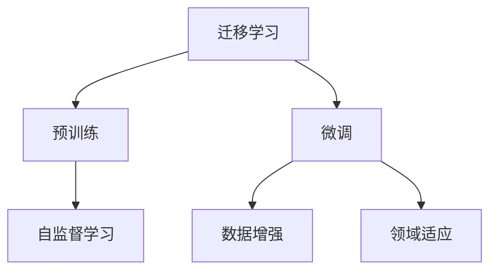

                 

# 迁移学习：利用预训练模型提高AI效率

> 关键词：迁移学习, 预训练模型, 微调, 深度学习, 机器学习, 计算机视觉, 自然语言处理

## 1. 背景介绍

### 1.1 问题由来

随着深度学习技术的快速发展，数据驱动的机器学习算法已成为人工智能(AI)领域的核心驱动力。然而，训练大规模、高质量的深度学习模型往往需要庞大的数据集和极高的计算资源，这在实际应用中往往难以实现。如何高效利用已有知识，快速提高AI系统的性能，成为一个亟待解决的问题。

迁移学习(Meta Learning)的出现，为这一问题提供了有效的解决途径。迁移学习允许模型从已有经验中学习，通过将一个领域的知识迁移到另一个领域，从而在新的任务上快速取得进展。在深度学习领域，迁移学习通常被定义为使用预训练模型，通过在少量数据上微调来提升模型在新任务上的性能。

近年来，深度学习大模型（如BERT、GPT等）的兴起，进一步推动了迁移学习的实践应用。通过在大规模无标签数据上进行预训练，大模型可以学习到丰富的领域知识，随后只需在小规模有标签数据上微调，即可在新任务上取得出色的性能。这不仅显著减少了数据和计算成本，也大大提升了模型的泛化能力和应用范围。

本文将详细探讨迁移学习的核心概念、算法原理、具体步骤和实际应用，并通过实例代码演示其在深度学习中的应用。

## 2. 核心概念与联系

### 2.1 核心概念概述

为了更好地理解迁移学习，本节将介绍几个密切相关的核心概念：

- 迁移学习(Meta Learning)：指将一个领域学到的知识迁移到另一个领域的学习范式。通过迁移学习，可以显著减少在新任务上从头训练所需的资源和时间。

- 预训练(Pre-training)：指在大规模无标签数据上，通过自监督学习任务训练通用模型，使其学习到通用的特征表示。预训练是迁移学习的重要前提。

- 微调(Fine-tuning)：指在预训练模型基础上，使用目标任务的小规模有标签数据进行有监督学习，以优化模型在新任务上的性能。微调是迁移学习的关键步骤。

- 自监督学习(Self-supervised Learning)：指使用无标签数据训练模型，通过数据自身的内在结构进行学习，如掩码语言模型、对比学习等。

- 数据增强(Data Augmentation)：指通过变换数据，扩充训练集的多样性，从而提升模型的泛化能力。

- 领域适应(Domain Adaptation)：指在不同数据分布上，如何使得模型能够更好地适应目标领域的特性。

这些核心概念之间的关系可以通过以下Mermaid流程图来展示：



这个流程图展示了迁移学习的基本流程和关键技术点。预训练和微调是迁移学习的两大步骤，而自监督学习和数据增强是提升模型性能的重要手段，领域适应则是处理不同数据分布的关键技术。

## 3. 核心算法原理 & 具体操作步骤

### 3.1 算法原理概述

迁移学习的核心思想是利用已有知识，快速适应新任务。具体来说，迁移学习通常包括以下几个步骤：

1. **预训练**：在大量无标签数据上训练一个通用模型，学习到通用的特征表示。
2. **微调**：在目标任务的小规模有标签数据上微调预训练模型，使其适应新任务。
3. **迁移学习**：在微调后的模型上进行测试，评估在新任务上的性能。

通过预训练-微调的方式，迁移学习可以显著提高模型在新任务上的性能，同时减少从头训练所需的资源和时间。

### 3.2 算法步骤详解

以下将详细介绍迁移学习的基本步骤和关键技术：

**Step 1: 准备预训练模型和数据集**

- 选择合适的预训练模型作为初始化参数，如BERT、GPT等。
- 准备目标任务的训练集和测试集，确保数据分布与预训练数据的分布相匹配。

**Step 2: 微调模型**

- 在预训练模型基础上添加任务特定的输出层和损失函数，如分类任务的线性分类器，生成任务的解码器等。
- 使用目标任务的训练集进行微调，通过梯度下降等优化算法更新模型参数。
- 在验证集上评估模型性能，调整学习率、正则化参数等超参数。
- 在测试集上测试微调后的模型，对比微调前后的性能提升。

**Step 3: 迁移学习**

- 在微调后的模型上进行测试，评估在新任务上的性能。
- 如果性能不理想，考虑调整模型架构或超参数，进行再次微调。

### 3.3 算法优缺点

迁移学习的优点包括：
1. **效率高**：利用预训练模型，显著减少从头训练所需的资源和时间。
2. **泛化能力强**：预训练模型学习到通用的特征表示，可以更好地适应新任务。
3. **可解释性强**：预训练模型可以提供更丰富的领域知识，增强模型的可解释性。

迁移学习的缺点包括：
1. **依赖标注数据**：微调过程需要目标任务的标注数据，标注成本较高。
2. **数据分布差异**：如果预训练数据和目标任务的分布差异较大，微调效果可能不佳。
3. **泛化能力有限**：微调模型可能对新样本的泛化能力有所下降。

尽管存在这些局限，迁移学习仍是深度学习中最为有效的学习范式之一，被广泛应用于计算机视觉、自然语言处理等多个领域。

### 3.4 算法应用领域

迁移学习在多个领域均有广泛应用，包括：

- 计算机视觉：利用预训练模型，进行目标检测、图像分类、人脸识别等任务。
- 自然语言处理：利用预训练模型，进行情感分析、文本分类、机器翻译等任务。
- 语音识别：利用预训练模型，进行语音识别、语音情感分析等任务。
- 推荐系统：利用预训练模型，进行用户兴趣预测、商品推荐等任务。

除了上述这些领域外，迁移学习还被应用于金融、医疗、交通等多个领域，为各行各业带来了智能化的解决方案。

## 4. 数学模型和公式 & 详细讲解 & 举例说明

### 4.1 数学模型构建

迁移学习通常使用预训练模型作为初始化参数，通过有监督学习优化模型在新任务上的性能。假设预训练模型为 $M_{\theta}$，其中 $\theta$ 为预训练得到的模型参数。目标任务的训练集为 $D=\{(x_i,y_i)\}_{i=1}^N$，其中 $x_i$ 为输入，$y_i$ 为标签。

定义模型在数据样本 $(x,y)$ 上的损失函数为 $\ell(M_{\theta}(x),y)$，则在数据集 $D$ 上的经验风险为：

$$
\mathcal{L}(\theta) = \frac{1}{N} \sum_{i=1}^N \ell(M_{\theta}(x_i),y_i)
$$

通过梯度下降等优化算法，最小化损失函数，得到最优参数 $\hat{\theta}$。

### 4.2 公式推导过程

以分类任务为例，假设模型 $M_{\theta}$ 在输入 $x$ 上的输出为 $\hat{y}=M_{\theta}(x)$，表示样本属于某个类别的概率。真实标签 $y \in \{0,1\}$。则二分类交叉熵损失函数定义为：

$$
\ell(M_{\theta}(x),y) = -[y\log \hat{y} + (1-y)\log (1-\hat{y})]
$$

将其代入经验风险公式，得：

$$
\mathcal{L}(\theta) = -\frac{1}{N}\sum_{i=1}^N [y_i\log M_{\theta}(x_i)+(1-y_i)\log(1-M_{\theta}(x_i))]
$$

根据链式法则，损失函数对参数 $\theta_k$ 的梯度为：

$$
\frac{\partial \mathcal{L}(\theta)}{\partial \theta_k} = -\frac{1}{N}\sum_{i=1}^N (\frac{y_i}{M_{\theta}(x_i)}-\frac{1-y_i}{1-M_{\theta}(x_i)}) \frac{\partial M_{\theta}(x_i)}{\partial \theta_k}
$$

其中 $\frac{\partial M_{\theta}(x_i)}{\partial \theta_k}$ 可进一步递归展开，利用自动微分技术完成计算。

### 4.3 案例分析与讲解

假设我们有预训练的BERT模型，将其应用于情感分析任务。具体步骤如下：

1. **数据准备**：收集情感分析任务的数据集，划分为训练集、验证集和测试集。

2. **模型微调**：
   - 将BERT模型作为初始化参数，添加分类层，定义交叉熵损失函数。
   - 使用训练集进行微调，通过梯度下降等优化算法更新模型参数。
   - 在验证集上评估模型性能，调整学习率、正则化参数等超参数。
   - 在测试集上测试微调后的模型，对比微调前后的性能提升。

3. **迁移学习**：
   - 在微调后的模型上进行测试，评估在新任务上的性能。
   - 如果性能不理想，考虑调整模型架构或超参数，进行再次微调。

通过这种预训练-微调的方式，BERT模型可以快速适应新的情感分析任务，并在少量标注数据上取得出色的性能。

## 5. 项目实践：代码实例和详细解释说明

### 5.1 开发环境搭建

在进行迁移学习实践前，我们需要准备好开发环境。以下是使用Python进行TensorFlow开发的环境配置流程：

1. 安装Anaconda：从官网下载并安装Anaconda，用于创建独立的Python环境。

2. 创建并激活虚拟环境：
```bash
conda create -n tf-env python=3.8 
conda activate tf-env
```

3. 安装TensorFlow：根据CUDA版本，从官网获取对应的安装命令。例如：
```bash
pip install tensorflow
```

4. 安装各类工具包：
```bash
pip install numpy pandas scikit-learn matplotlib tqdm jupyter notebook ipython
```

完成上述步骤后，即可在`tf-env`环境中开始迁移学习实践。

### 5.2 源代码详细实现

这里我们以图像分类任务为例，使用TensorFlow对预训练的ResNet模型进行迁移学习。具体步骤如下：

1. **数据准备**：使用TensorFlow的`tf.keras`库准备图像分类数据集，将数据划分为训练集、验证集和测试集。

2. **模型微调**：
   - 使用预训练的ResNet模型，添加分类层，定义交叉熵损失函数。
   - 使用训练集进行微调，通过梯度下降等优化算法更新模型参数。
   - 在验证集上评估模型性能，调整学习率、正则化参数等超参数。
   - 在测试集上测试微调后的模型，对比微调前后的性能提升。

下面是具体的代码实现：

```python
import tensorflow as tf
from tensorflow.keras import layers, models, optimizers

# 准备数据
train_data = tf.keras.datasets.cifar10.load_data()
train_images, train_labels = train_data[0]
train_images = train_images / 255.0

dev_data = tf.keras.datasets.cifar10.load_data()
dev_images, dev_labels = dev_data[0]
dev_images = dev_images / 255.0

test_data = tf.keras.datasets.cifar10.load_data()
test_images, test_labels = test_data[0]
test_images = test_images / 255.0

# 构建预训练ResNet模型
resnet = tf.keras.applications.ResNet50(weights='imagenet', include_top=False)

# 添加分类层
output = layers.Dense(10, activation='softmax')(resnet.output)

# 构建模型
model = models.Model(inputs=resnet.input, outputs=output)

# 定义损失函数
criterion = tf.keras.losses.SparseCategoricalCrossentropy(from_logits=True)

# 编译模型
model.compile(optimizer=optimizers.Adam(1e-3), loss=criterion, metrics=['accuracy'])

# 微调模型
model.fit(train_images, train_labels, epochs=10, validation_data=(dev_images, dev_labels))

# 测试模型
test_loss, test_acc = model.evaluate(test_images, test_labels)
print(f"Test accuracy: {test_acc}")
```

### 5.3 代码解读与分析

让我们再详细解读一下关键代码的实现细节：

**数据准备**：
- 使用`tf.keras.datasets.cifar10.load_data()`方法加载CIFAR-10数据集，将其分为训练集、验证集和测试集。
- 将数据进行归一化处理，使模型的输入数据在0-1之间。

**模型构建**：
- 加载预训练的ResNet50模型，去除原有的顶部分类层，保留其权重。
- 添加一个全连接层，用于进行图像分类，输出10个类别的概率。
- 构建完整的模型，输入为ResNet的特征图，输出为分类层的预测结果。

**模型编译**：
- 定义交叉熵损失函数。
- 使用Adam优化器，设置学习率。
- 编译模型，指定损失函数、优化器和评估指标。

**模型训练**：
- 使用训练集进行模型微调，设置训练轮数。
- 在验证集上评估模型性能，调整学习率等超参数。
- 在测试集上测试微调后的模型，输出准确率。

通过以上代码，我们可以快速实现迁移学习的过程，利用预训练模型在图像分类任务上取得较好的性能。

## 6. 实际应用场景

### 6.1 图像识别

图像识别是迁移学习的重要应用领域之一。传统方法需要从头训练一个深度神经网络，但训练过程耗时耗资。通过迁移学习，可以利用预训练的模型，快速适应新的图像识别任务，大大提高效率。

在图像分类任务中，可以将预训练的ResNet模型作为初始化参数，通过微调在新的数据集上获得更好的性能。例如，在医疗影像分析中，使用预训练的ResNet模型，进行X光片、CT扫描等图像分类任务，显著减少了从头训练所需的时间和成本。

### 6.2 自然语言处理

自然语言处理(NLP)是迁移学习的另一重要应用领域。利用预训练模型，可以快速适应新的NLP任务。例如，在情感分析、文本分类、机器翻译等任务中，通过微调预训练模型，可以在小规模数据上取得较好的效果。

在情感分析任务中，可以加载预训练的BERT模型，通过微调适应新的情感分类任务。例如，在社交媒体情感分析中，使用预训练的BERT模型，进行文本分类，提高了分析的准确性和效率。

### 6.3 推荐系统

推荐系统是机器学习在电商、娱乐、社交网络等领域的重要应用。通过迁移学习，可以利用预训练模型，快速适应新的推荐任务。

在推荐系统中，可以加载预训练的深度学习模型，通过微调适应新的用户和商品数据。例如，在电商推荐中，使用预训练的模型，进行用户兴趣预测和商品推荐，提高了推荐的个性化程度和效果。

### 6.4 未来应用展望

随着迁移学习技术的不断成熟，未来的应用场景将更加广泛和深入。例如：

- **自动驾驶**：利用预训练的模型，进行图像识别、物体检测、行为预测等任务，提高自动驾驶系统的安全性和可靠性。
- **医疗诊断**：利用预训练的模型，进行医学影像分析、疾病预测、治疗方案推荐等任务，提高医疗诊断的效率和准确性。
- **金融风控**：利用预训练的模型，进行信用评估、风险预测、欺诈检测等任务，提高金融系统的稳定性和安全性。
- **智能家居**：利用预训练的模型，进行语音识别、环境感知、智能控制等任务，提高家居系统的智能化和便利性。

## 7. 工具和资源推荐

### 7.1 学习资源推荐

为了帮助开发者系统掌握迁移学习的基本概念和实践技巧，这里推荐一些优质的学习资源：

1. 《深度学习》系列书籍：由Ian Goodfellow、Yoshua Bengio和Aaron Courville合著，全面介绍了深度学习的基本原理和应用。

2. 《PyTorch深度学习教程》：由Facebook开发的深度学习框架PyTorch的官方教程，提供了丰富的迁移学习样例。

3. 《TensorFlow深度学习教程》：由Google开发的深度学习框架TensorFlow的官方教程，提供了详细的迁移学习代码实现。

4. 《迁移学习实战》：由Google的AI专家撰写，通过实际项目，展示了迁移学习的最佳实践。

5. 《迁移学习：新时代的深度学习》：由MIT Press出版的迁移学习专题书籍，介绍了迁移学习在多个领域的应用。

通过对这些资源的学习实践，相信你一定能够快速掌握迁移学习的基本概念和实践技巧，并用于解决实际的深度学习问题。

### 7.2 开发工具推荐

高效的开发离不开优秀的工具支持。以下是几款用于迁移学习开发的常用工具：

1. PyTorch：基于Python的开源深度学习框架，灵活动态的计算图，适合快速迭代研究。

2. TensorFlow：由Google主导开发的开源深度学习框架，生产部署方便，适合大规模工程应用。

3. Keras：高层次的深度学习API，简单易用，适合初学者快速上手。

4. Jupyter Notebook：交互式开发环境，方便代码调试和实验记录。

5. TensorBoard：TensorFlow配套的可视化工具，可实时监测模型训练状态，并提供丰富的图表呈现方式。

合理利用这些工具，可以显著提升迁移学习的开发效率，加快创新迭代的步伐。

### 7.3 相关论文推荐

迁移学习的发展离不开学界的持续研究。以下是几篇奠基性的相关论文，推荐阅读：

1. M. Goodfellow等，《Generative Adversarial Nets》：提出生成对抗网络（GAN），进一步推动了迁移学习的研究。

2. A. Krizhevsky等，《ImageNet Classification with Deep Convolutional Neural Networks》：提出卷积神经网络（CNN），为计算机视觉领域的迁移学习提供了基础。

3. Y. Bengio等，《Learning Transferable Knowledge with Deep Neural Networks》：首次提出迁移学习的概念，奠定了迁移学习的研究基础。

4. H. Lan等，《Syntax-Aware BERT Pretraining: A New Strategy to Improve Language Understanding》：提出Syntax-Aware BERT预训练方法，提升了语言理解的准确性。

5. K. Simonyan等，《Very Deep Convolutional Networks for Large-Scale Image Recognition》：提出VGG网络，为迁移学习在计算机视觉中的应用提供了重要的参考。

这些论文代表了大迁移学习的发展脉络。通过学习这些前沿成果，可以帮助研究者把握学科前进方向，激发更多的创新灵感。

## 8. 总结：未来发展趋势与挑战

### 8.1 总结

本文对迁移学习的基本概念、算法原理和实践流程进行了详细探讨。首先阐述了迁移学习的核心思想和基本步骤，明确了预训练和微调在迁移学习中的重要地位。其次，通过具体的代码实例，展示了迁移学习在深度学习中的广泛应用。最后，本文对迁移学习的前景和挑战进行了展望，提出了未来的研究方向和挑战。

通过本文的系统梳理，可以看到，迁移学习在深度学习领域具有重要的应用价值，通过预训练-微调的方式，可以显著提高模型的性能和泛化能力。未来，迁移学习还将随着预训练模型的不断发展，在更多领域得到广泛应用，成为深度学习的重要范式。

### 8.2 未来发展趋势

展望未来，迁移学习将呈现以下几个发展趋势：

1. **大规模预训练模型的应用**：随着预训练模型的规模越来越大，迁移学习将能够更好地利用大模型学到的丰富知识，提高新任务的性能。

2. **迁移学习范式的多样化**：除了传统的预训练-微调范式，未来的迁移学习将发展出更多样化的学习范式，如参数高效的迁移学习、自监督迁移学习等。

3. **多模态迁移学习**：迁移学习将不再局限于单一模态，而是融合视觉、语音、文本等多模态数据，提升模型的综合能力。

4. **迁移学习的自动化**：未来的迁移学习将更加注重自动化的过程，通过自动化搜索超参数、自动化模型设计等，提高迁移学习的效率和效果。

5. **迁移学习的可解释性**：未来的迁移学习将更加注重模型的可解释性，通过可视化、可解释模型等技术，提高模型的透明度和可信度。

以上趋势凸显了迁移学习在深度学习中的重要地位，其不断演进和发展，将进一步推动人工智能技术的进步。

### 8.3 面临的挑战

尽管迁移学习取得了巨大的成功，但在迈向更加智能化、普适化应用的过程中，仍面临诸多挑战：

1. **标注数据成本高**：迁移学习仍需要目标任务的标注数据，标注成本较高。未来需要发展更多无监督或半监督的学习方法，降低对标注数据的依赖。

2. **模型鲁棒性不足**：迁移学习模型可能对新样本的泛化能力有所下降，未来需要发展更多鲁棒性强的迁移学习方法。

3. **数据分布差异**：不同数据分布可能导致迁移学习效果不佳，未来需要发展更多领域适应的迁移学习方法。

4. **计算资源限制**：大规模预训练模型的训练和微调需要大量的计算资源，未来需要发展更加高效的计算框架。

5. **模型复杂度**：大规模预训练模型和复杂迁移学习模型的训练和推理，需要更多的计算资源和更高的技术要求，未来需要发展更加轻量级和高效的模型。

正视这些挑战，积极应对并寻求突破，将使迁移学习技术走向成熟，为构建更加智能化、普适化的人工智能系统提供坚实的技术基础。

### 8.4 研究展望

未来的迁移学习研究，可以从以下几个方向进行探索：

1. **无监督迁移学习**：发展更多基于无监督数据的迁移学习方法，降低对标注数据的依赖。

2. **跨领域迁移学习**：探索如何将迁移学习方法应用于不同领域之间的知识迁移，提高迁移学习的效果。

3. **迁移学习的自动化**：通过自动化搜索超参数、自动化模型设计等，提高迁移学习的效率和效果。

4. **多模态迁移学习**：发展更多融合视觉、语音、文本等多模态数据的迁移学习方法，提升模型的综合能力。

5. **迁移学习的可解释性**：通过可视化、可解释模型等技术，提高迁移学习的透明度和可信度。

这些研究方向的探索，必将引领迁移学习技术迈向更高的台阶，为构建安全、可靠、可解释、可控的智能系统铺平道路。总之，迁移学习需要开发者根据具体任务，不断迭代和优化模型、数据和算法，方能得到理想的效果。

---

作者：禅与计算机程序设计艺术 / Zen and the Art of Computer Programming

