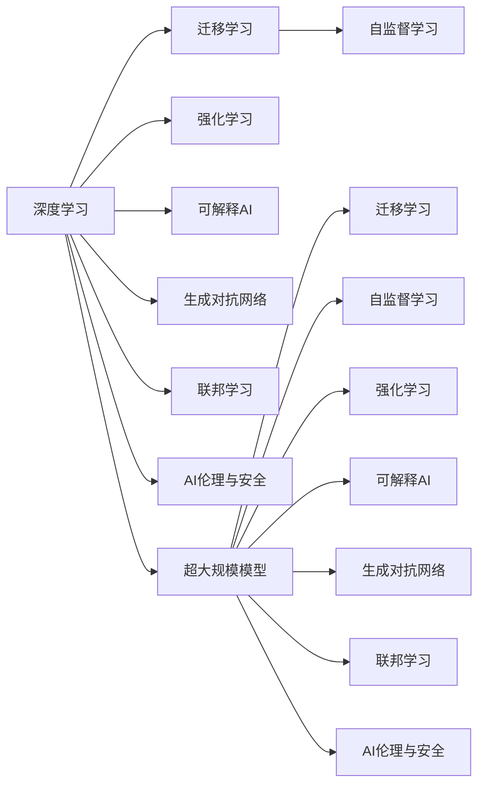

                 

# 进化时代：人工智能的未来

## 1. 背景介绍

### 1.1 问题由来

人工智能（AI），自上世纪50年代诞生以来，经历了几十年的起伏发展。从最初的专家系统到机器学习，再到深度学习的兴起，AI技术在理论和实践上均取得了显著进步。尤其是深度学习技术的突破，使得AI在图像识别、自然语言处理、智能推荐等多个领域实现了超越人类水平的性能。

然而，随着时间的推移，AI技术在实用化、智能化、人性化方面的瓶颈逐渐显现。从计算资源的限制、模型复杂度的控制，到数据隐私保护、算法透明度的提升，AI的发展面临着前所未有的挑战。在这样一个充满不确定性的时代，如何定义人工智能的未来，是摆在学术界、产业界乃至全社会面前的重要课题。

### 1.2 问题核心关键点

人工智能的未来，可以从多个维度进行探讨。以下是几个核心关键点：

- **模型与数据**：未来AI将更加依赖数据，通过从海量数据中学习，不断提升模型性能。同时，模型结构和参数的优化也将成为研究的重点。

- **跨领域融合**：AI将突破传统学科的界限，与更多领域实现深度融合，如医学、教育、金融等。跨领域应用的AI模型将成为推动各行业进步的重要力量。

- **伦理与安全**：随着AI技术的广泛应用，确保其决策的透明性、可解释性，防范潜在风险，将变得尤为重要。AI伦理与安全成为未来研究的重要课题。

- **普适性与人性化**：AI技术应以用户为中心，兼顾普适性和人性化，以满足不同用户群体的需求，提升用户体验。

- **进化与迭代**：AI应具备自我学习、自我进化的能力，以应对快速变化的现实世界，持续迭代优化。

## 2. 核心概念与联系

### 2.1 核心概念概述

为更好地理解AI的未来发展方向，本节将介绍几个关键概念：

- **深度学习**：一种基于神经网络的机器学习方法，通过多层次的特征提取与抽象，实现对复杂数据结构的建模。

- **迁移学习**：通过已有模型的知识，迁移到新的领域，减少新任务上的学习量。

- **自监督学习**：利用无标签数据，通过数据的自身特征进行学习，提升模型的泛化能力。

- **强化学习**：通过与环境互动，通过奖惩机制进行模型优化，实现智能决策。

- **可解释AI**：使AI模型的决策过程透明、可理解，提升用户信任度。

- **生成对抗网络（GAN）**：一种生成模型，通过对抗训练生成高质量的样本数据。

- **联邦学习**：分布式训练技术，使多个设备或节点协同训练模型，保护隐私数据。

- **AI伦理与安全**：确保AI系统在伦理和安全方面符合道德规范，避免潜在风险。

- **超大规模模型**：指参数量超过亿级的模型，如BERT、GPT等，代表了当前AI技术的巅峰。

这些概念之间的关系可以通过以下Mermaid流程图来展示：



这个流程图展示了大语言模型核心概念及其之间的联系：

1. 深度学习作为AI的基础，通过迁移学习、自监督学习、强化学习等方法，不断提升模型能力。
2. 生成对抗网络、可解释AI、联邦学习等技术，进一步丰富了AI的应用和研究手段。
3. 超大规模模型代表了当前AI技术的高度，也是AI未来发展的重要方向。
4. AI伦理与安全问题，是大规模应用AI时需要特别注意的领域。

## 3. 核心算法原理 & 具体操作步骤

### 3.1 算法原理概述

未来AI算法将更加注重模型的泛化能力、鲁棒性和实时性。同时，跨领域的融合应用将成为研究的重点。

**泛化能力**：未来AI将更加依赖于跨领域数据融合和知识迁移，提升模型的泛化能力。这意味着AI模型需要具备跨领域知识整合的能力，同时能够快速适应新领域的数据分布。

**鲁棒性**：未来AI模型需要具备更好的鲁棒性，即在面对复杂、未知的数据时，仍能稳定输出。这需要模型对噪声和不确定性的鲁棒性，以及对不同分布的适应性。

**实时性**：实时性是未来AI模型的一大需求。随着应用场景的多样化，如自动驾驶、实时翻译等，对AI模型的响应速度和计算效率提出了更高要求。

### 3.2 算法步骤详解

未来AI算法的设计和优化将遵循以下步骤：

**Step 1: 数据融合与预处理**  
- 收集来自不同领域的原始数据，进行预处理，包括数据清洗、特征提取、数据增强等。

**Step 2: 模型构建与优化**  
- 选择合适的深度学习模型架构，如卷积神经网络、Transformer等，并根据需求进行微调。
- 引入自监督学习、迁移学习等方法，提升模型的泛化能力。

**Step 3: 训练与验证**  
- 使用多领域数据集进行训练，确保模型在不同数据分布下的鲁棒性。
- 使用验证集对模型进行迭代优化，提高模型性能。

**Step 4: 部署与测试**  
- 将训练好的模型部署到实际应用场景中。
- 进行实时测试和评估，确保模型在实际环境下的表现。

### 3.3 算法优缺点

未来AI算法的设计，需要在泛化能力、鲁棒性、实时性之间找到平衡。具体优缺点如下：

**优点**：  
- 泛化能力强：通过跨领域数据融合和知识迁移，模型能够更好地适应新领域的数据分布。
- 鲁棒性好：引入自监督学习、迁移学习等方法，提升模型的鲁棒性。
- 实时性强：通过模型优化和计算优化，提高模型的计算效率，满足实时应用需求。

**缺点**：  
- 数据需求量大：需要收集和处理大规模跨领域数据，数据获取和预处理成本较高。
- 计算资源需求高：模型复杂度和参数量增加，需要更多计算资源。
- 模型解释性差：深度学习模型的黑盒特性，使得模型的解释性较差，难以理解模型的内部机制。

### 3.4 算法应用领域

未来AI算法将在多个领域实现广泛应用，涵盖自动驾驶、医疗健康、智能家居、金融科技等。具体如下：

- **自动驾驶**：通过AI算法实现对复杂交通环境的理解和判断，提高驾驶安全性和效率。
- **医疗健康**：利用AI进行疾病预测、个性化医疗、影像识别等，提升医疗服务质量和效率。
- **智能家居**：通过AI实现对家庭环境的智能化管理，如智能控制、语音助手等。
- **金融科技**：利用AI进行风险评估、智能投顾、反欺诈等，提升金融服务的智能化水平。

## 4. 数学模型和公式 & 详细讲解 & 举例说明

### 4.1 数学模型构建

未来AI模型将更加依赖于跨领域数据的融合与整合。假设存在 $n$ 个领域的原始数据集 $D_1, D_2, ..., D_n$，每个数据集包含样本 $(x_i, y_i)$，其中 $x_i$ 为特征，$y_i$ 为标签。

**Step 1: 特征融合**  
- 对每个领域的数据集进行特征提取，得到特征矩阵 $X_1, X_2, ..., X_n$。
- 将所有领域的特征矩阵进行拼接，得到综合特征矩阵 $X$。

**Step 2: 模型训练**  
- 选择合适的深度学习模型，如Transformer，并引入自监督学习等方法进行训练。
- 训练目标为最大化对所有领域的预测准确率，即 $\max_{\theta} \frac{1}{N} \sum_{i=1}^N \mathbb{1}(\hat{y_i}=y_i)$。

**Step 3: 模型评估与优化**  
- 使用验证集对模型进行评估，计算模型的准确率、F1分数等指标。
- 根据评估结果进行模型优化，调整模型参数。

### 4.2 公式推导过程

以自监督学习的预训练为例，假设原始数据集 $D$ 包含 $N$ 个样本 $(x_i, y_i)$，其中 $x_i$ 为文本数据，$y_i$ 为标签。

定义自监督任务的损失函数为：

$$
\mathcal{L} = -\frac{1}{N} \sum_{i=1}^N \log p(y_i|x_i)
$$

其中 $p(y_i|x_i)$ 为模型对样本 $x_i$ 的预测概率。

通过最大化 $\mathcal{L}$ 进行自监督预训练，得到模型参数 $\theta$。

### 4.3 案例分析与讲解

以医疗影像分类为例，利用自监督学习的预训练模型进行微调。

假设有一个包含 $m$ 张医疗影像的原始数据集 $D$，每个影像的标签 $y_i$ 为正常或病变。通过自监督学习对影像进行预训练，得到模型参数 $\theta$。

在微调阶段，使用医疗影像标注数据集 $D_{train}$ 进行训练，模型输出为影像分类的概率分布 $p(y|x)$。定义微调的损失函数为：

$$
\mathcal{L}_{fine-tuning} = -\frac{1}{N_{train}} \sum_{i=1}^{N_{train}} \log p(y_i|x_i)
$$

通过最小化 $\mathcal{L}_{fine-tuning}$ 进行微调，得到微调后的模型参数 $\theta_{fine-tuning}$。

## 5. 项目实践：代码实例和详细解释说明

### 5.1 开发环境搭建

在未来AI项目开发中，开发环境搭建尤为重要。以下是使用Python和PyTorch进行深度学习项目开发的流程：

1. 安装Anaconda：从官网下载并安装Anaconda，用于创建独立的Python环境。

2. 创建并激活虚拟环境：
```bash
conda create -n pytorch-env python=3.8 
conda activate pytorch-env
```

3. 安装PyTorch：根据CUDA版本，从官网获取对应的安装命令。例如：
```bash
conda install pytorch torchvision torchaudio cudatoolkit=11.1 -c pytorch -c conda-forge
```

4. 安装TensorFlow：
```bash
conda install tensorflow
```

5. 安装TensorBoard：
```bash
conda install tensorboard
```

6. 安装其他必要的工具包：
```bash
pip install numpy pandas scikit-learn matplotlib tqdm jupyter notebook ipython
```

完成上述步骤后，即可在`pytorch-env`环境中开始AI项目开发。

### 5.2 源代码详细实现

下面以医疗影像分类为例，给出使用PyTorch进行自监督学习预训练和微调的过程。

首先，定义预训练和微调的代码：

```python
import torch
from torch import nn
from torch.nn import functional as F
from torch.utils.data import DataLoader
from torchvision import datasets, transforms
from transformers import AutoModelForSequenceClassification, AdamW

# 预训练模型选择，这里以BERT为例
model = AutoModelForSequenceClassification.from_pretrained('bert-base-uncased', num_labels=2)

# 定义数据处理函数
transform = transforms.Compose([
    transforms.ToTensor(),
    transforms.Normalize([0.5], [0.5])
])

# 加载医疗影像数据集
train_dataset = datasets.MNIST('mnist_data/', train=True, download=True, transform=transform)
test_dataset = datasets.MNIST('mnist_data/', train=False, download=True, transform=transform)

# 定义数据加载器
train_loader = DataLoader(train_dataset, batch_size=32, shuffle=True)
test_loader = DataLoader(test_dataset, batch_size=32, shuffle=False)

# 定义模型优化器
optimizer = AdamW(model.parameters(), lr=2e-5)
```

然后，定义预训练和微调的训练函数：

```python
def train_epoch(model, loader, optimizer):
    model.train()
    for batch in loader:
        inputs, labels = batch
        optimizer.zero_grad()
        outputs = model(inputs)
        loss = F.cross_entropy(outputs, labels)
        loss.backward()
        optimizer.step()
        yield loss.item()

# 预训练
pretrain_epochs = 10
pretrain_lr = 2e-5

for epoch in range(pretrain_epochs):
    loss = train_epoch(model, train_loader, optimizer)
    print(f"Epoch {epoch+1}, pretrain loss: {loss:.3f}")

# 微调
fine_tune_epochs = 10
fine_tune_lr = 1e-5

for epoch in range(fine_tune_epochs):
    loss = train_epoch(model, train_loader, optimizer)
    print(f"Epoch {epoch+1}, fine-tune loss: {loss:.3f}")
```

最后，在测试集上评估微调后的模型：

```python
# 定义评估函数
def evaluate(model, loader):
    model.eval()
    correct = 0
    total = 0
    with torch.no_grad():
        for batch in loader:
            inputs, labels = batch
            outputs = model(inputs)
            _, predicted = torch.max(outputs.data, 1)
            total += labels.size(0)
            correct += (predicted == labels).sum().item()
    accuracy = 100 * correct / total
    print(f"Accuracy: {accuracy:.2f}%")

# 在测试集上评估微调后的模型
evaluate(model, test_loader)
```

以上就是使用PyTorch进行医疗影像分类任务的自监督学习预训练和微调的完整代码实现。可以看到，借助TensorFlow等工具，AI项目开发变得更加简便高效。

### 5.3 代码解读与分析

让我们再详细解读一下关键代码的实现细节：

**医疗影像数据集处理**：
- 使用PyTorch的数据集加载器，加载MNIST数据集，并应用数据增强和标准化处理。

**预训练过程**：
- 定义预训练模型的优化器和学习率。
- 通过循环迭代，在训练集上对模型进行前向传播和反向传播，更新模型参数。

**微调过程**：
- 定义微调的学习率和优化器。
- 通过循环迭代，在训练集上对模型进行前向传播和反向传播，更新模型参数。

**评估过程**：
- 使用测试集对模型进行评估，计算模型的准确率。

## 6. 实际应用场景

### 6.1 智能医疗

智能医疗是未来AI应用的重要领域。通过AI技术，可以实现对病历数据的智能化分析，提高医疗诊断的准确性和效率。例如，利用AI对医学影像进行分类，能够快速识别出病变区域，帮助医生进行精准诊断。

### 6.2 智能制造

在智能制造领域，AI技术可以实现对生产过程的智能化监控和管理。通过AI模型对传感器数据进行分析和预测，能够及时发现生产异常，提高生产效率和产品质量。

### 6.3 智能交通

智能交通是未来AI应用的另一个重要方向。通过AI技术，可以实现对交通流量的智能化管理和优化。例如，利用AI对交通数据进行实时分析和预测，能够优化交通信号灯的控制，减少交通拥堵。

### 6.4 未来应用展望

未来AI技术将更加广泛地应用于各个领域，带来深远的影响。以下是几个可能的发展方向：

- **跨领域应用**：AI技术将不断突破传统学科的界限，与更多领域实现深度融合，提升各行业的智能化水平。

- **人机协作**：AI技术将更好地与人类协作，辅助人类完成复杂任务，提高工作效率和质量。

- **个性化服务**：AI技术将更好地理解用户需求，提供个性化服务和推荐，提升用户体验。

- **可持续发展**：AI技术将更多地关注环境和社会问题，推动可持续发展。

## 7. 工具和资源推荐

### 7.1 学习资源推荐

为了帮助开发者系统掌握AI的未来发展方向，这里推荐一些优质的学习资源：

1. 《深度学习》系列书籍：由多位学术界和产业界的专家共同撰写，全面介绍深度学习的理论和实践。

2. 《人工智能导论》：全面介绍AI的基本概念和关键技术，适合初学者入门。

3. 《TensorFlow官方文档》：详细讲解TensorFlow的各个组件和使用方法，是TensorFlow开发的重要资源。

4. 《PyTorch官方文档》：详细介绍PyTorch的深度学习框架和模型构建方法，是PyTorch开发的重要资源。

5. 《自然语言处理综述》：全面介绍自然语言处理的基本概念和前沿技术，适合NLP领域的开发者。

通过对这些资源的学习实践，相信你一定能够快速掌握AI的未来发展方向，并用于解决实际的AI问题。

### 7.2 开发工具推荐

高效的开发离不开优秀的工具支持。以下是几款用于AI开发常用的工具：

1. Jupyter Notebook：适用于深度学习模型的实验和开发，支持多种语言和框架。

2. TensorBoard：用于可视化模型训练过程中的各项指标，如损失函数、准确率等，帮助开发者调试和优化模型。

3. Weights & Biases：用于实验跟踪和结果可视化，记录和比较不同实验的表现。

4. PyTorch Lightning：基于PyTorch的轻量级框架，简化模型构建和训练过程。

5. Amazon SageMaker：提供云端AI开发环境，支持模型训练、部署和调优。

6. Google Colab：提供免费GPU算力，支持深度学习模型的实验和开发。

合理利用这些工具，可以显著提升AI项目的开发效率，加快创新迭代的步伐。

### 7.3 相关论文推荐

AI技术的发展源于学界的持续研究。以下是几篇奠基性的相关论文，推荐阅读：

1. AlexNet：卷积神经网络在图像识别任务上的突破性成果。

2. AlphaGo：利用深度强化学习实现对围棋的高水平对弈，推动AI在博弈领域的进展。

3. GPT系列：基于语言模型的预训练技术，提升了自然语言处理的性能。

4. BERT：利用自监督学习提升语言模型的泛化能力，刷新了多项NLP任务SOTA。

5. Transformer：引入了自注意力机制，提升了深度学习模型的性能和效率。

6. ADAM：自适应学习率的优化算法，提高了深度学习模型的训练效率。

这些论文代表了大语言模型和AI技术的发展脉络。通过学习这些前沿成果，可以帮助研究者把握学科前进方向，激发更多的创新灵感。

## 8. 总结：未来发展趋势与挑战

### 8.1 总结

本文对未来AI技术的趋势和应用进行了全面系统的探讨。首先阐述了AI未来发展的方向，明确了未来AI需要具备的泛化能力、鲁棒性和实时性等核心能力。其次，从数据融合、模型优化、训练与验证、部署与测试等关键步骤，详细讲解了AI技术的应用流程。同时，本文还探讨了AI技术在智能医疗、智能制造、智能交通等多个领域的潜在应用，展示了AI技术的广阔前景。

通过本文的系统梳理，可以看到，未来AI技术将不断突破传统学科的界限，与更多领域实现深度融合，推动各行各业向智能化方向发展。未来AI将更加注重模型的泛化能力、鲁棒性和实时性，以适应快速变化和多样化的应用场景。

### 8.2 未来发展趋势

展望未来，AI技术将呈现以下几个发展趋势：

1. **跨领域融合**：AI技术将不断突破传统学科的界限，与更多领域实现深度融合，提升各行业的智能化水平。

2. **人机协作**：AI技术将更好地与人类协作，辅助人类完成复杂任务，提高工作效率和质量。

3. **个性化服务**：AI技术将更好地理解用户需求，提供个性化服务和推荐，提升用户体验。

4. **可持续发展**：AI技术将更多地关注环境和社会问题，推动可持续发展。

5. **大规模预训练模型**：超大规模预训练模型的发展将进一步提升AI模型的性能和泛化能力。

6. **伦理与安全**：AI技术将更多地关注伦理与安全问题，确保AI系统的决策透明性和安全性。

### 8.3 面临的挑战

尽管AI技术已经取得了显著进展，但在迈向更加智能化、普适化应用的过程中，仍面临诸多挑战：

1. **数据需求量大**：AI模型需要大量的数据进行训练和微调，数据获取和预处理成本较高。

2. **计算资源需求高**：AI模型的复杂度和参数量增加，需要更多计算资源支持。

3. **模型解释性差**：深度学习模型的黑盒特性，使得模型的解释性较差，难以理解模型的内部机制。

4. **伦理与安全问题**：AI系统的决策透明性和安全性问题，需要更多关注。

5. **模型泛化能力不足**：当前AI模型在面对复杂、未知的数据时，泛化能力有待提高。

6. **数据隐私保护**：AI系统需要确保用户数据隐私保护，避免数据泄露和滥用。

### 8.4 研究展望

未来的AI研究需要在以下几个方面寻求新的突破：

1. **跨领域融合**：AI技术需要更好地跨领域融合，提升各行业的智能化水平。

2. **人机协作**：AI技术需要更好地与人类协作，辅助人类完成复杂任务，提高工作效率和质量。

3. **个性化服务**：AI技术需要更好地理解用户需求，提供个性化服务和推荐，提升用户体验。

4. **可持续发展**：AI技术需要更多地关注环境和社会问题，推动可持续发展。

5. **大规模预训练模型**：超大规模预训练模型的发展将进一步提升AI模型的性能和泛化能力。

6. **伦理与安全**：AI技术需要更多地关注伦理与安全问题，确保AI系统的决策透明性和安全性。

这些研究方向将引领AI技术迈向更高的台阶，为构建安全、可靠、可解释、可控的智能系统铺平道路。未来AI技术还需要与其他AI技术进行更深入的融合，如知识表示、因果推理、强化学习等，多路径协同发力，共同推动自然语言理解和智能交互系统的进步。只有勇于创新、敢于突破，才能不断拓展AI模型的边界，让智能技术更好地造福人类社会。

## 9. 附录：常见问题与解答

**Q1：未来AI技术的主要发展方向是什么？**

A: 未来AI技术的主要发展方向包括跨领域融合、人机协作、个性化服务、可持续发展、大规模预训练模型、伦理与安全等。这些方向将推动AI技术在更多领域的应用和落地。

**Q2：AI技术的优势和劣势是什么？**

A: AI技术的优势在于其强大的数据处理和模型学习能力，能够处理大规模复杂数据，提升模型的泛化能力。劣势在于模型的黑盒特性，使得模型的解释性较差，难以理解模型的内部机制。

**Q3：AI技术在实际应用中面临哪些挑战？**

A: AI技术在实际应用中面临数据需求量大、计算资源需求高、模型解释性差、伦理与安全问题、模型泛化能力不足、数据隐私保护等挑战。解决这些问题将是未来AI研究的重要方向。

**Q4：未来AI技术的主要挑战是什么？**

A: 未来AI技术的主要挑战包括数据需求量大、计算资源需求高、模型解释性差、伦理与安全问题、模型泛化能力不足、数据隐私保护等。解决这些问题将是未来AI研究的重要方向。

**Q5：未来AI技术的突破点是什么？**

A: 未来AI技术的突破点包括跨领域融合、人机协作、个性化服务、可持续发展、大规模预训练模型、伦理与安全等方向的研究。这些研究方向将引领AI技术迈向更高的台阶，为构建安全、可靠、可解释、可控的智能系统铺平道路。

---

作者：禅与计算机程序设计艺术 / Zen and the Art of Computer Programming

