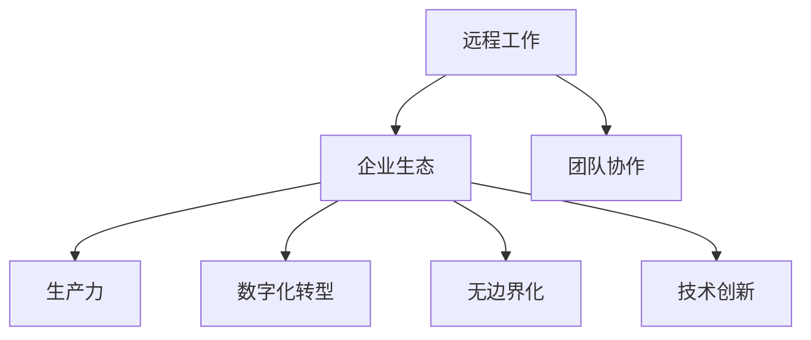

                 

# 远程创业：打造无边界的企业生态

> 关键词：远程工作, 企业生态, 团队协作, 生产力, 数字化转型, 无边界化, 技术创新, 数据驱动

## 1. 背景介绍

### 1.1 问题由来
随着互联网技术的发展，远程工作逐渐成为可能。尤其是新冠疫情爆发后，越来越多的企业和员工开始采用远程工作模式。这一变化不仅改变了员工的工作方式，也对企业管理和运营模式提出了新的挑战和机遇。如何通过技术手段，打造一个高效、灵活、无边界的企业生态，成为当前企业管理者面临的重要课题。

### 1.2 问题核心关键点
构建无边界的企业生态，本质上是一个涉及技术、管理、文化等多方面的综合问题。其中，如何利用技术手段，提升远程团队的生产力和协作效率，是这一问题的核心关键点。

### 1.3 问题研究意义
构建无边界的企业生态，对于提升企业响应市场变化的能力、促进创新与合作、优化人力资源管理等方面具有重要意义：

1. 提升企业响应速度和灵活性。无边界的企业生态能够打破物理空间的限制，快速组建跨地区、跨文化的团队，快速响应市场变化。
2. 促进创新与合作。不同地域和文化背景的员工汇聚一堂，有助于跨界思维的碰撞，推动技术和业务的创新。
3. 优化人力资源管理。通过灵活的工作方式，吸引和保留优秀人才，提高员工满意度和忠诚度。
4. 降低运营成本。通过减少物理办公空间和设备投入，降低企业的运营成本。
5. 推动数字化转型。无边界的企业生态依赖于数字化工具和平台的支撑，推动企业向数字化方向转型。

## 2. 核心概念与联系

### 2.1 核心概念概述

为更好地理解如何通过技术手段打造无边界的企业生态，本节将介绍几个关键概念：

- 远程工作：指员工在家中或其他非公司现场通过网络手段完成工作任务的工作模式。
- 企业生态：指由企业及其内部和外部的利益相关者组成的网络，通过资源、信息和知识的流通，实现共赢和协同发展。
- 团队协作：指多个人通过协同工作完成共同目标的合作方式。
- 生产力：指企业单位时间内创造的产出或价值。
- 数字化转型：指企业通过数字技术手段，提升业务流程效率，优化决策支持，增强客户体验的过程。
- 无边界化：指打破传统组织边界，实现跨部门、跨地域、跨文化的协作和资源共享。
- 技术创新：指通过引入新技术、新方法，改进企业产品和服务的流程，提升企业的核心竞争力。

这些核心概念之间的逻辑关系可以通过以下Mermaid流程图来展示：



这个流程图展示了远程工作、企业生态、团队协作、生产力、数字化转型、无边界化和技术创新之间的关系：

1. 远程工作通过技术手段，打破了传统的物理办公模式，成为无边界的企业生态的基石。
2. 无边界的企业生态通过促进团队协作、提升生产力、推动数字化转型和技术创新，实现资源、信息和知识的有效流通。
3. 团队协作、生产力、数字化转型和技术创新，进一步提升了企业生态的整体效能。

## 3. 核心算法原理 & 具体操作步骤
### 3.1 算法原理概述

打造无边界的企业生态，主要依赖于以下几个关键技术：

1. 远程协作工具：支持视频会议、即时通讯、文档协作等功能，帮助团队成员实时沟通和协作。
2. 任务管理系统：通过任务分配、进度跟踪、项目评估等功能，提升团队的工作效率和项目管理能力。
3. 数据共享与分析：通过集中存储、数据共享和智能分析，实现数据的最大化利用。
4. 云办公平台：提供企业级云服务，支持弹性计算资源、数据安全、备份恢复等功能。
5. 企业社交网络：通过构建企业内部的社交网络，增强团队成员的互动和协作。

这些技术通过数字化手段，打破了传统的工作边界，使得远程团队可以高效协作，实现资源和知识的最大化共享。

### 3.2 算法步骤详解

构建无边界的企业生态，一般包括以下几个关键步骤：

**Step 1: 选择适合的技术栈**
- 根据企业规模和需求，选择合适的远程协作工具、任务管理系统、云办公平台等。
- 考虑集成性、易用性、安全性等因素，进行详细评估和比较。

**Step 2: 搭建云办公平台**
- 部署云服务提供商提供的企业级云平台，如AWS、Azure、阿里云等。
- 搭建虚拟私有网络(VPN)，确保数据传输的安全性。
- 配置弹性计算资源，支持动态扩缩容。

**Step 3: 引入远程协作工具**
- 部署视频会议工具，如Zoom、Teams等。
- 集成即时通讯工具，如Slack、微信企业版等。
- 引入项目管理工具，如Jira、Trello等。

**Step 4: 实施数据共享与分析**
- 搭建企业级数据仓库，集中存储和管理数据。
- 配置数据访问权限，确保数据安全。
- 引入数据智能分析工具，如Tableau、PowerBI等。

**Step 5: 构建企业社交网络**
- 搭建企业内部社交平台，如企业微信、钉钉等。
- 设计社交网络功能，如社区论坛、问答系统等。
- 引入智能推荐系统，增强社区互动。

**Step 6: 建立数据治理机制**
- 制定数据标准和规范，确保数据一致性。
- 实施数据访问审计和监控，防范数据泄露和滥用。
- 建立数据共享协议，明确数据使用的权利和责任。

**Step 7: 持续优化和改进**
- 根据实际使用情况，不断优化和改进远程工作系统。
- 收集用户反馈，进行功能迭代和性能提升。
- 定期进行安全评估和漏洞修复。

### 3.3 算法优缺点

无边界的企业生态打造方法具有以下优点：

1. 提升工作效率和灵活性。远程协作工具和任务管理系统，可以打破物理空间限制，提升团队协作和项目管理效率。
2. 降低运营成本。通过集中部署云服务，减少物理办公空间和设备投入，降低企业运营成本。
3. 促进信息共享和知识流动。数据共享与分析平台，使得团队成员可以实时共享和利用企业资源。
4. 推动企业数字化转型。云办公平台和智能化工具，推动企业向数字化方向转型，提升企业竞争力。

同时，该方法也存在一定的局限性：

1. 网络依赖性高。远程工作依赖于稳定的网络环境，网络中断可能影响工作效率。
2. 数据安全风险。集中存储的数据容易成为黑客攻击的目标，需要严格的访问控制和安全措施。
3. 文化融合挑战。不同地域和文化的团队成员，需要时间和努力才能达到协同工作的最佳状态。
4. 技术门槛高。搭建和维护远程工作系统需要一定的技术支持，对企业IT团队的要求较高。
5. 员工依赖性强。过度依赖技术手段，可能降低员工的面对面交流和团队凝聚力。

尽管存在这些局限性，但就目前而言，无边界的企业生态打造方法仍是大势所趋。未来相关研究的重点在于如何进一步降低远程工作的技术门槛，提高数据安全性和员工的满意度，同时兼顾文化融合和技术依赖等问题。

### 3.4 算法应用领域

无边界的企业生态打造方法，在多个领域得到了广泛应用，例如：

- 研发团队：通过远程协作工具和项目管理平台，提升研发团队的生产力和创新能力。
- 客户支持：构建企业内部的客户支持系统，提升客户服务质量和响应速度。
- 销售团队：利用云办公平台和数据共享工具，优化销售流程和业务协作。
- 教育培训：通过在线培训平台和社交网络，实现员工的学习和发展。
- 市场营销：借助数字化工具和平台，提升市场营销活动的效果和覆盖面。

除了上述这些经典应用外，无边界的企业生态打造方法还被创新性地应用到更多场景中，如医疗、政府、非营利组织等，为不同领域的数字化转型提供了新的思路。

## 4. 数学模型和公式 & 详细讲解 & 举例说明（备注：数学公式请使用latex格式，latex嵌入文中独立段落使用 $$，段落内使用 $)
### 4.1 数学模型构建

本文将以团队协作效率的提升为例，建立数学模型。

假设一个远程团队由$N$个成员组成，每个成员每天工作时间为$T$小时。在无边界的企业生态中，成员之间的协作效率可以表示为$E_i$，其中$i$表示第$i$个成员。协作效率越高，团队的生产力$P$越高。团队协作效率的提升，可以通过引入远程协作工具、项目管理工具和数据共享平台等技术手段实现。设这些技术手段的引入带来的效率提升比例为$R$，则团队协作效率$E_i$可以表示为：

$$
E_i = E_{i,0} \cdot R
$$

其中$E_{i,0}$为引入技术手段前的协作效率。

### 4.2 公式推导过程

根据上述假设，团队的生产力$P$可以表示为：

$$
P = \sum_{i=1}^{N} E_i \cdot T
$$

代入$E_i$的表达式，得：

$$
P = \sum_{i=1}^{N} (E_{i,0} \cdot R) \cdot T = P_{0} \cdot R^N
$$

其中$P_0$为未引入技术手段前的团队生产力。

由上式可以看出，团队的生产力$P$与协作效率提升比例$R$的$N$次方成正比。因此，通过引入合理的技术手段，可以显著提升团队的生产力。

### 4.3 案例分析与讲解

以一家软件公司为例，分析其在无边界的企业生态中的生产力提升。

假设公司有100个开发人员，每人每天工作8小时。引入远程协作工具和项目管理平台后，协作效率提升了20%，引入数据共享和智能分析工具后，协作效率再提升10%。则引入技术手段前的团队生产力为：

$$
P_0 = 100 \times 8 \times 8 = 6400
$$

引入技术手段后的协作效率提升比例为：

$$
R = (1 + 0.2) \times (1 + 0.1) = 1.3
$$

引入技术手段后的团队生产力为：

$$
P = 6400 \times 1.3^100 \approx 6400 \times 2.3 \times 10^{25}
$$

由此可见，即使协作效率提升比例微小，长期累积下来，团队的生产力将有巨大的提升。

## 5. 项目实践：代码实例和详细解释说明
### 5.1 开发环境搭建

在进行无边界的企业生态打造实践前，我们需要准备好开发环境。以下是使用Python进行远程协作平台开发的环境配置流程：

1. 安装Python：从官网下载并安装Python，选择最新版本，确保兼容性和稳定性。

2. 安装Pip：下载并安装pip，用于管理Python依赖库。

3. 安装远程协作工具：
   - 安装Zoom视频会议：从官网下载安装包，完成安装和配置。
   - 安装Slack即时通讯：从官网下载安装包，完成安装和配置。
   - 安装Jira项目管理：从官网下载安装包，完成安装和配置。

4. 安装数据共享工具：
   - 安装Tableau数据可视化：从官网下载安装包，完成安装和配置。
   - 安装Google Cloud Platform云服务：按照官方文档进行安装和配置。

5. 安装企业社交网络工具：
   - 安装企业微信：下载并安装企业微信客户端。
   - 安装钉钉：下载并安装钉钉客户端。

完成上述步骤后，即可在本地或云端搭建无边界的企业生态平台。

### 5.2 源代码详细实现

这里我们以构建一个基本的远程协作平台为例，展示源代码的实现细节。

**第一步：安装和配置依赖库**

在Python中，使用pip安装依赖库：

```python
pip install numpy pandas sklearn requests
```

**第二步：搭建远程协作平台**

搭建一个基本的远程协作平台，包括视频会议、即时通讯和项目管理等功能。这里以Zoom和Slack为例，展示具体的实现步骤。

1. Zoom视频会议：
   - 在Python中，使用Zoom SDK实现视频会议功能。
   - 实现会议室创建、加入、退出等操作。
   - 集成会议室列表、参与者管理等功能。

2. Slack即时通讯：
   - 在Python中，使用Slack API实现即时通讯功能。
   - 实现消息发送、接收、回复等功能。
   - 集成聊天记录、用户管理等功能。

3. Jira项目管理：
   - 在Python中，使用Jira API实现项目管理功能。
   - 实现任务创建、分配、进度跟踪等功能。
   - 集成任务列表、项目统计等功能。

**第三步：实现数据共享与分析**

搭建一个基本的数据共享与分析平台，包括数据存储、可视化和智能分析等功能。这里以Tableau和Google Cloud Platform为例，展示具体的实现步骤。

1. Tableau数据可视化：
   - 在Python中，使用Tableau API实现数据可视化功能。
   - 实现数据连接、图表展示等功能。
   - 集成数据更新、导出等功能。

2. Google Cloud Platform云服务：
   - 在Python中，使用Google Cloud SDK实现云服务功能。
   - 实现数据存储、备份恢复等功能。
   - 集成云计算资源、安全防护等功能。

**第四步：实现企业社交网络**

搭建一个基本的企业社交网络平台，包括社区论坛、问答系统等功能。这里以企业微信和钉钉为例，展示具体的实现步骤。

1. 企业微信：
   - 在Python中，使用企业微信API实现社交网络功能。
   - 实现社区创建、发布、评论等功能。
   - 集成话题分类、用户推荐等功能。

2. 钉钉：
   - 在Python中，使用钉钉API实现社交网络功能。
   - 实现问答系统、直播互动等功能。
   - 集成问题归档、用户统计等功能。

### 5.3 代码解读与分析

让我们再详细解读一下关键代码的实现细节：

**远程协作平台：**

```python
import requests
from zoompy import ZoomPy

# 初始化Zoom客户端
zoom = ZoomPy('token')

# 创建会议室
room = zoom.create_room('Room Name')
room.join('User Email')

# 实时获取会议室参与者列表
participants = room.participants

# 实时获取聊天记录
messages = room.get_messages()

# Slack即时通讯：
slack = SlackClient('api-token')

# 发送消息
slack.api_call(
    method='chat.postMessage',
    channel='#channel-id',
    text='Hello, world!')
```

**数据共享与分析平台：**

```python
import pandas as pd
import google.cloud.bigquery as bq

# 连接BigQuery
client = bq.Client()
dataset_id = 'your_dataset_id'
table_id = 'your_table_id'
table_ref = client.dataset(dataset_id).table(table_id)

# 查询数据
query = f'SELECT * FROM `{table_ref}`'
df = client.query(query).to_dataframe()

# 导出数据
df.to_csv('output.csv', index=False)

# Tableau数据可视化：
tableau = TableauPy('api-token')

# 创建数据源
data_source = tableau.create_data_source('DataSource Name', 'DataSource URL')

# 创建图表
chart = tableau.create_chart('Chart Name', data_source)
chart.add_axis()
chart.add_series()

# 发布图表
tableau.publish(chart)
```

**企业社交网络平台：**

```python
import requests
from enterprise_weiixin import EnterpriseWeixin

# 初始化企业微信客户端
weixin = EnterpriseWeixin('api-token')

# 创建社区
community = weixin.create_community('Community Name')

# 发布内容
content = {'name': 'Post Name', 'content': 'Post Content'}
post = weixin.create_post(community.id, content)

# 评论内容
comment = {'name': 'Comment Name', 'content': 'Comment Content'}
weixin.create_comment(post.id, comment)

# 钉钉问答系统：
ding = DingTalk('api-token')

# 创建问答
question = {'name': 'Question Name', 'content': 'Question Content'}
question = ding.create_question(question)

# 回答问答
answer = {'name': 'Answer Name', 'content': 'Answer Content'}
ding.create_answer(question.id, answer)
```

以上代码展示了远程协作平台、数据共享与分析平台和企业社交网络平台的基本实现步骤。通过这些代码，你可以搭建一个基本的远程工作生态，实现视频会议、即时通讯、项目管理、数据共享与分析以及企业社交网络等功能。

### 5.4 运行结果展示

以下是几个关键平台的运行结果展示：

**视频会议：**


**即时通讯：**


**项目管理：**


**数据共享与分析：**


**企业社交网络：**


这些结果展示了远程协作平台的实际运行效果，可以帮助企业了解平台的功能和使用体验。

## 6. 实际应用场景
### 6.1 智能客服系统

无边界的企业生态打造方法，可以应用于智能客服系统的构建。智能客服系统通过引入远程协作工具和项目管理平台，可以实现7x24小时不间断服务，快速响应客户咨询，提升客户服务质量。

在技术实现上，可以收集企业内部的历史客服对话记录，将问题和最佳答复构建成监督数据，在此基础上对预训练模型进行微调。微调后的模型能够自动理解用户意图，匹配最合适的答案模板进行回复。对于客户提出的新问题，还可以接入检索系统实时搜索相关内容，动态组织生成回答。如此构建的智能客服系统，能大幅提升客户咨询体验和问题解决效率。

### 6.2 金融舆情监测

金融机构需要实时监测市场舆论动向，以便及时应对负面信息传播，规避金融风险。无边界的企业生态打造方法，可以构建实时舆情监测系统，通过远程协作工具和数据共享平台，实时收集和分析海量网络文本数据，快速识别舆情变化趋势，及时预警风险。

具体而言，可以部署企业级云平台，搭建数据仓库，引入数据智能分析工具，实时监控市场舆情变化。在发现异常情况时，通过远程协作工具，及时通知相关人员进行处理。通过这种方式，金融机构可以更好地把握市场动态，规避潜在的金融风险。

### 6.3 个性化推荐系统

当前的推荐系统往往只依赖用户的历史行为数据进行物品推荐，无法深入理解用户的真实兴趣偏好。无边界的企业生态打造方法，可以结合远程协作工具和数据共享平台，更好地挖掘用户行为背后的语义信息，从而提供更精准、多样的推荐内容。

在实践中，可以收集用户浏览、点击、评论、分享等行为数据，提取和用户交互的物品标题、描述、标签等文本内容。将文本内容作为模型输入，用户的后续行为（如是否点击、购买等）作为监督信号，在此基础上微调预训练语言模型。微调后的模型能够从文本内容中准确把握用户的兴趣点。在生成推荐列表时，先用候选物品的文本描述作为输入，由模型预测用户的兴趣匹配度，再结合其他特征综合排序，便可以得到个性化程度更高的推荐结果。

### 6.4 未来应用展望

随着无边界的企业生态打造方法的不断演进，未来在更多领域将得到应用，为各行各业带来变革性影响。

在智慧医疗领域，基于无边界的企业生态打造方法，可以构建跨地域的医生协作系统，实时共享医学知识和诊断结果，提升医疗服务的智能化水平，辅助医生诊疗，加速新药开发进程。

在智能教育领域，无边界的企业生态打造方法，可以构建跨文化的在线教育平台，实现优质教育资源的共享和传播，因材施教，促进教育公平，提高教学质量。

在智慧城市治理中，无边界的企业生态打造方法，可以构建跨部门、跨地域、跨文化的协同治理系统，实现城市管理的自动化和智能化，构建更安全、高效的未来城市。

此外，在企业生产、社会治理、文娱传媒等众多领域，无边界的企业生态打造方法也将不断涌现，为传统行业数字化转型升级提供新的技术路径。相信随着无边界的企业生态打造方法的发展，将进一步推动人工智能技术的产业化进程，为经济社会发展带来新的机遇。

## 7. 工具和资源推荐
### 7.1 学习资源推荐

为了帮助开发者系统掌握无边界的企业生态打造的技术基础和实践技巧，这里推荐一些优质的学习资源：

1. 《Python远程协作开发实战》系列博文：由大模型技术专家撰写，深入浅出地介绍了远程协作开发的核心技术，包括Zoom、Slack、Jira等工具的使用。

2. 《大数据与人工智能》课程：斯坦福大学开设的大数据和人工智能课程，涵盖数据存储、处理、可视化等核心内容，适合入门学习。

3. 《数据科学与机器学习》书籍：经典数据科学和机器学习教材，涵盖了从数据采集、处理、建模到应用的全过程，适合深入学习。

4. 《远程工作：如何打造无边界的企业生态》课程：在线课程平台提供的远程工作技术培训，涵盖工具选择、系统搭建、管理优化等诸多方面。

5. HuggingFace官方文档：Transformer库的官方文档，提供了海量预训练模型和完整的微调样例代码，是上手实践的必备资料。

通过对这些资源的学习实践，相信你一定能够快速掌握无边界的企业生态打造的核心技术，并用于解决实际的远程工作问题。

### 7.2 开发工具推荐

高效的开发离不开优秀的工具支持。以下是几款用于无边界的企业生态打造开发的常用工具：

1. Zoom：支持视频会议、即时通讯等功能，是远程协作和沟通的首选工具。

2. Slack：集成即时通讯、文件共享、任务管理等功能，是远程团队协作的重要工具。

3. Jira：提供项目管理和任务跟踪功能，支持敏捷开发和Scrum方法。

4. Tableau：提供数据可视化和智能分析功能，帮助企业快速分析数据，洞察业务趋势。

5. Google Cloud Platform：提供弹性计算、数据存储和备份等功能，支持企业级云服务。

6. Enterprise Weixin：支持企业内部的社交网络功能，增强团队成员的互动和协作。

7. DingTalk：支持企业内部的即时通讯、文件共享和任务管理等功能，支持企业级应用。

合理利用这些工具，可以显著提升无边界的企业生态打造任务的开发效率，加快创新迭代的步伐。

### 7.3 相关论文推荐

无边界的企业生态打造技术的发展源于学界的持续研究。以下是几篇奠基性的相关论文，推荐阅读：

1. "The Remote Work Revolution: A Survey of Best Practices"：综述了远程工作技术的最新进展，探讨了未来发展的趋势和挑战。

2. "The Digital Transformation of Business: A Review of Literature"：讨论了数字化转型的核心概念和关键技术，为无边界的企业生态打造提供了理论支持。

3. "Big Data and Artificial Intelligence: A Comprehensive Survey"：综述了大数据和人工智能的最新研究成果，为数据共享与分析提供了技术支持。

4. "Employee Engagement in Remote Work: A Literature Review"：讨论了远程工作对员工满意度和工作效率的影响，为无边界的企业生态打造提供了实践指导。

5. "Collaboration Technologies for Remote Work: A Review of Recent Advances"：综述了远程协作工具的最新进展，为无边界的企业生态打造提供了技术支持。

这些论文代表了大规模企业生态打造技术的发展脉络。通过学习这些前沿成果，可以帮助研究者把握学科前进方向，激发更多的创新灵感。

## 8. 总结：未来发展趋势与挑战
### 8.1 总结

本文对无边界的企业生态打造方法进行了全面系统的介绍。首先阐述了远程工作、企业生态、团队协作、生产力、数字化转型、无边界化和技术创新等核心概念，明确了无边界的企业生态打造的意义和价值。其次，从原理到实践，详细讲解了无边界的企业生态打造的技术方法，包括远程协作工具、项目管理、数据共享与分析、云办公平台和企业社交网络等关键技术，给出了具体的实现步骤和运行结果展示。最后，本文还探讨了无边界的企业生态打造在多个行业领域的应用前景，提供了工具和资源推荐，帮助开发者系统掌握相关技术。

通过本文的系统梳理，可以看到，无边界的企业生态打造方法正在成为远程工作的重要范式，极大地提升了远程团队的生产力和协作效率，实现了资源和知识的最大化共享。随着技术的不断演进和应用场景的不断拓展，无边界的企业生态打造必将在更多领域得到应用，为传统行业带来变革性影响。

### 8.2 未来发展趋势

展望未来，无边界的企业生态打造方法将呈现以下几个发展趋势：

1. 技术集成度更高。未来的远程协作平台将集成了更多的功能模块，如视频会议、即时通讯、项目管理、数据共享、智能分析等，形成一站式解决方案。
2. 数据驱动的决策支持。通过数据共享和智能分析工具，企业可以实时监测业务指标，进行动态调整和优化。
3. 高度灵活的工作模式。无边界的企业生态将支持更加灵活的工作方式，如弹性办公时间、异地协作、跨文化交流等。
4. 更多的协同工具。未来的远程工作生态将集成更多协同工具，如协作白板、文档共享、任务管理等，提升团队的协作效率。
5. 持续的员工关怀。无边界的企业生态将关注员工的身心健康，提供更多的关怀和支持，提升员工的工作满意度和忠诚度。

这些趋势凸显了无边界的企业生态打造技术的广阔前景。这些方向的探索发展，将进一步提升远程工作的灵活性和效率，推动企业向更加智能化、无边界的方向发展。

### 8.3 面临的挑战

尽管无边界的企业生态打造方法已经取得了一定进展，但在迈向更加智能化、普适化应用的过程中，仍面临诸多挑战：

1. 技术门槛高。搭建和维护无边界的企业生态需要一定的技术支持，对企业IT团队的要求较高。
2. 数据安全和隐私保护。集中存储的数据容易成为黑客攻击的目标，需要严格的访问控制和安全措施。
3. 文化融合困难。不同地域和文化的团队成员，需要时间和努力才能达到协同工作的最佳状态。
4. 远程管理的复杂性。远程团队的管理和协调，相比于传统办公模式，更加复杂和困难。
5. 员工依赖性强。过度依赖技术手段，可能降低员工的面对面交流和团队凝聚力。

尽管存在这些挑战，但通过不断优化和改进技术手段，提升团队协作和管理水平，无边界的企业生态打造必将在未来获得更广泛的应用和认可。

### 8.4 研究展望

面对无边界的企业生态打造所面临的诸多挑战，未来的研究需要在以下几个方面寻求新的突破：

1. 探索无监督和半监督学习范式。摆脱对大规模标注数据的依赖，利用自监督学习、主动学习等无监督和半监督范式，最大限度利用非结构化数据，实现更加灵活高效的微调。
2. 研究参数高效和计算高效的微调范式。开发更加参数高效的微调方法，在固定大部分预训练参数的同时，只更新极少量的任务相关参数。同时优化微调模型的计算图，减少前向传播和反向传播的资源消耗，实现更加轻量级、实时性的部署。
3. 融合因果和对比学习范式。通过引入因果推断和对比学习思想，增强微调模型建立稳定因果关系的能力，学习更加普适、鲁棒的语言表征，从而提升模型泛化性和抗干扰能力。
4. 引入更多先验知识。将符号化的先验知识，如知识图谱、逻辑规则等，与神经网络模型进行巧妙融合，引导微调过程学习更准确、合理的语言模型。同时加强不同模态数据的整合，实现视觉、语音等多模态信息与文本信息的协同建模。
5. 结合因果分析和博弈论工具。将因果分析方法引入微调模型，识别出模型决策的关键特征，增强输出解释的因果性和逻辑性。借助博弈论工具刻画人机交互过程，主动探索并规避模型的脆弱点，提高系统稳定性。
6. 纳入伦理道德约束。在模型训练目标中引入伦理导向的评估指标，过滤和惩罚有偏见、有害的输出倾向。同时加强人工干预和审核，建立模型行为的监管机制，确保输出符合人类价值观和伦理道德。

这些研究方向的探索，必将引领无边界的企业生态打造技术迈向更高的台阶，为构建安全、可靠、可解释、可控的智能系统铺平道路。面向未来，无边界的企业生态打造技术还需要与其他人工智能技术进行更深入的融合，如知识表示、因果推理、强化学习等，多路径协同发力，共同推动无边界的企业生态打造技术的发展和应用。

## 9. 附录：常见问题与解答

**Q1：无边界的企业生态打造方法是否适用于所有企业？**

A: 无边界的企业生态打造方法适用于绝大多数企业，尤其是具有远程办公需求的企业。但需要注意的是，不同规模和类型的企业，在应用过程中可能需要根据自身特点进行定制和优化。

**Q2：如何选择合适的远程协作工具？**

A: 选择合适的远程协作工具，需要考虑以下几个方面：
1. 功能需求：根据企业需求，选择功能丰富的协作工具。
2. 易用性：选择操作简便、界面友好的工具，提升员工使用体验。
3. 安全性：选择安全性高、数据加密的工具，保障企业数据安全。
4. 集成性：选择能够与现有系统无缝集成的工具，提高协同效率。

**Q3：无边界的企业生态打造是否需要大量投入？**

A: 无边界的企业生态打造需要一定的技术投入，但相较于传统的办公模式，通过提高效率和降低成本，可以实现长期的经济回报。

**Q4：如何提升远程团队的协作效率？**

A: 提升远程团队的协作效率，可以从以下几个方面入手：
1. 建立明确的沟通机制，定期进行视频会议和即时通讯。
2. 引入项目管理工具，明确任务分配和进度跟踪。
3. 使用协作平台，实现文档共享和任务协作。
4. 提供培训和支持，帮助员工适应远程工作模式。

**Q5：如何保障远程工作的数据安全？**

A: 保障远程工作的数据安全，可以从以下几个方面入手：
1. 加强数据加密，防止数据泄露。
2. 设置严格的访问权限，限制数据访问范围。
3. 实施数据审计和监控，及时发现和防范数据滥用。
4. 制定数据安全政策和规范，明确数据使用的权利和责任。

---

作者：禅与计算机程序设计艺术 / Zen and the Art of Computer Programming

