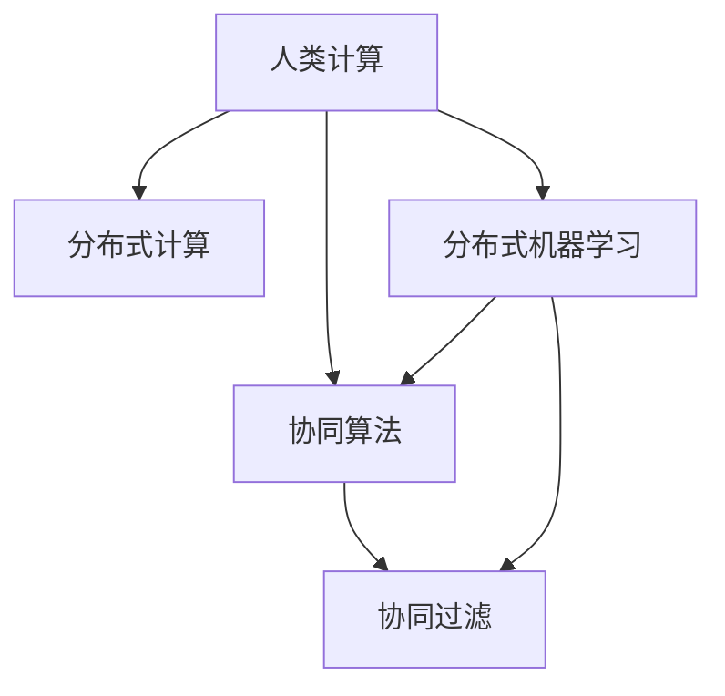

                 

# 连接人类智慧的纽带：人类计算的协作精神

> 关键词：人类计算,协作精神,算法优化,人工智能,数据处理,协同算法

## 1. 背景介绍

### 1.1 问题由来

随着技术的飞速发展，人类计算的概念已经从传统的计算机扩展到更广泛的计算领域，涵盖了云计算、数据中心、边缘计算等新型基础设施。与此同时，协作精神成为人类计算的核心。如何通过协同算法和大数据处理，将人类智慧与计算能力结合起来，成为了一个重要的话题。

人类计算（Human-Computer Interaction, HCI）的初衷在于提升用户体验，使计算机系统能够更好地理解人类的行为和需求。然而，在实际应用中，系统往往需要处理海量的数据，这使得传统的集中式计算方法难以适应，限制了计算能力的发挥。

### 1.2 问题核心关键点

在现代计算中，协作精神至关重要。它不仅涉及人与机器的协同，还包括人与人之间的协作，甚至跨系统、跨组织的协作。这种协作机制通过分布式计算和协同算法来实现。

协作机制的核心在于信息的共享和协同，通过数据共享、任务分派、负载均衡等手段，实现计算资源的优化配置，提升整体计算效率。协同算法在算法优化、任务调度、资源管理等方面发挥着重要作用，推动了现代计算的发展。

## 2. 核心概念与联系

### 2.1 核心概念概述

为了更好地理解人类计算中的协作精神，本节将介绍几个关键概念：

- 人类计算（Human-Computer Interaction, HCI）：涉及人机交互的各个方面，包括用户界面设计、用户行为分析、系统响应速度等。
- 协同算法（Collaborative Algorithms）：通过信息共享和任务协同，优化计算资源分配，提高计算效率和系统性能的算法。
- 分布式计算（Distributed Computing）：将计算任务分配给多台计算机进行并行处理，提升计算能力。
- 协同过滤（Collaborative Filtering）：基于用户行为和物品属性的相似性，推荐系统推荐个性化的物品或内容。
- 分布式机器学习（Distributed Machine Learning）：在大规模数据上训练机器学习模型，通过分布式计算实现模型优化。

这些核心概念之间的逻辑关系可以通过以下Mermaid流程图来展示：



这个流程图展示了一系列关键概念及其之间的联系：

1. 人类计算涉及多方面的协同，包括人与机器的协同和人与人之间的协作。
2. 分布式计算通过将任务分配给多台计算机进行并行处理，提升计算能力。
3. 协同算法通过信息共享和任务协同，优化计算资源分配。
4. 协同过滤基于用户行为和物品属性的相似性，推荐个性化物品。
5. 分布式机器学习在大规模数据上训练模型，通过分布式计算实现模型优化。

这些概念共同构成了人类计算的核心机制，使得计算能力能够更好地服务于人类智慧。

## 3. 核心算法原理 & 具体操作步骤
### 3.1 算法原理概述

协作算法是人类计算中的重要组成部分，其核心思想是通过信息共享和任务协同，优化计算资源的分配，提高整体计算效率和系统性能。协同算法的优化通常通过以下几个步骤实现：

1. **数据共享**：通过共享数据，使计算节点能够互相协作，共享计算任务。
2. **任务分派**：根据节点性能和任务需求，合理分派任务，确保任务均衡和资源优化。
3. **信息同步**：实时同步各节点的计算状态和结果，保证信息的一致性和计算的连续性。
4. **负载均衡**：动态调整任务分派策略，平衡节点负载，提升计算效率。
5. **故障容错**：设计容错机制，确保系统在节点故障时仍能正常运行。

协同算法的基本目标是通过以上手段，实现计算资源的合理分配和优化配置，最大化计算能力。

### 3.2 算法步骤详解

协同算法的具体实现过程通常包括以下几个关键步骤：

1. **初始化数据集**：将原始数据集划分为多个子集，并分配给不同的计算节点。
2. **任务分派**：根据节点性能和数据分布，动态分派任务。一般使用贪心算法或启发式算法进行任务分派。
3. **信息同步**：通过消息传递机制，实时同步各节点的计算结果和状态。消息传递可以通过消息队列、共享内存等机制实现。
4. **负载均衡**：监测节点负载，动态调整任务分派策略，确保节点负载均衡。
5. **计算执行**：各节点根据分派的任务进行计算，并将结果返回中央节点。
6. **结果汇总**：将各节点的计算结果汇总，得出最终结果。

下面以MapReduce算法为例，展示一个典型的协同算法实现过程：

#### 3.2.1 MapReduce算法

MapReduce是一种经典的分布式计算模型，广泛应用于大数据处理中。MapReduce算法的基本思想是将计算任务分解为Map和Reduce两个阶段：

1. **Map阶段**：将输入数据分解为多个子集，分配给不同的计算节点进行处理。每个节点对子集数据进行局部处理，生成中间结果。
2. **Reduce阶段**：将各节点的中间结果进行合并和汇总，生成最终结果。

MapReduce算法主要包括以下步骤：

1. **分片（Sharding）**：将输入数据划分为多个分片，每个分片分配给一个计算节点处理。
2. **Map操作**：每个计算节点对分配到的分片数据进行Map操作，生成中间结果。
3. **Shuffle操作**：将各节点的中间结果进行排序和分组，形成新的分片，发送到Reduce节点。
4. **Reduce操作**：每个Reduce节点对分配到的分片进行Reduce操作，生成最终结果。

#### 3.2.2 优点与缺点

MapReduce算法的优点包括：

1. **可扩展性**：通过水平扩展计算节点，可以处理大规模数据。
2. **容错性**：单个节点故障不会影响整个计算过程。
3. **并行性**：通过并行计算，显著提升计算速度。

MapReduce算法的主要缺点包括：

1. **延迟较高**：Map和Shuffle操作需要大量网络传输，导致延迟较高。
2. **数据局部性差**：数据分布在不同节点上，需要频繁跨节点通信，降低了计算效率。
3. **资源浪费**：节点之间通信和数据传输需要占用大量资源，导致资源浪费。

### 3.3 算法优缺点

协同算法的优点包括：

1. **高效性**：通过分布式计算，充分利用多台计算资源，提升计算效率。
2. **可扩展性**：通过增加计算节点，可以轻松扩展计算能力。
3. **容错性**：节点故障不会影响整个计算过程，保证系统的可靠性和鲁棒性。

协同算法的主要缺点包括：

1. **通信开销大**：节点之间的通信和数据传输需要占用大量网络资源，导致通信开销较大。
2. **负载均衡困难**：如何平衡各节点的负载，仍然是一个难题。
3. **算法复杂度**：协同算法设计复杂，需要考虑节点性能、数据分布、任务分派等多个因素，实现难度较高。

### 3.4 算法应用领域

协同算法在多个领域得到了广泛应用，包括：

- 大数据处理：如Hadoop、Spark等，通过分布式计算处理大规模数据。
- 协同过滤推荐系统：如Amazon推荐系统、Netflix推荐系统，基于用户行为和物品属性的相似性，推荐个性化物品。
- 分布式机器学习：如TensorFlow、PyTorch等，通过分布式计算训练大规模机器学习模型。
- 云计算资源管理：如Google Cloud、AWS等，通过分布式协同算法管理云计算资源。
- 网络路由和流量控制：如ISIS路由协议、OFDM网络，通过协同算法优化网络流量和路由。

这些领域都是协同算法的重要应用场景，展示了其在提升计算效率和系统性能方面的巨大潜力。

## 4. 数学模型和公式 & 详细讲解 & 举例说明

### 4.1 数学模型构建

协同算法的基本数学模型可以表示为：

$$
\begin{aligned}
&\min_{\mathbf{x}} \sum_{i=1}^n f_i(\mathbf{x}) \\
&\text{s.t.} \quad g_i(\mathbf{x}) = 0 \quad (i=1,2,\ldots,m) \\
&\quad \mathbf{x} \in \mathcal{X}
\end{aligned}
$$

其中，$\mathbf{x}$ 表示优化变量，$f_i(\mathbf{x})$ 表示节点$i$的目标函数，$g_i(\mathbf{x})$ 表示节点$i$的约束条件，$\mathcal{X}$ 表示优化变量的可行域。

### 4.2 公式推导过程

协同算法的目标是通过分布式计算，使各节点同时求解目标函数，并满足约束条件。在推导过程中，可以采用以下两种方法：

1. **拉格朗日乘子法**：将约束条件转换为优化目标的一部分，通过求解拉格朗日乘子，实现全局优化。
2. **对偶理论**：将原问题转换为对偶问题，通过求解对偶变量，实现全局优化。

#### 4.2.1 拉格朗日乘子法

拉格朗日乘子法的基本思路是将约束条件转换为目标函数的增广项，通过求解增广目标函数的极值点，实现全局优化。

拉格朗日乘子法的主要步骤如下：

1. **定义拉格朗日函数**：引入拉格朗日乘子$\lambda$，将约束条件转换为目标函数的增广项。
2. **求偏导数**：对拉格朗日函数求偏导数，得到优化问题的一阶最优条件。
3. **求解优化问题**：通过求解优化问题的一阶最优条件，得到优化变量的解。

拉格朗日乘子法的具体公式如下：

$$
\begin{aligned}
&\mathcal{L}(\mathbf{x},\lambda) = \sum_{i=1}^n f_i(\mathbf{x}) + \sum_{i=1}^m \lambda_i g_i(\mathbf{x}) \\
&\frac{\partial \mathcal{L}}{\partial \mathbf{x}} = 0 \quad \Rightarrow \quad \mathbf{x} = \mathbf{x}^* \\
&\frac{\partial \mathcal{L}}{\partial \lambda_i} = 0 \quad \Rightarrow \quad \lambda_i = \lambda_i^*
\end{aligned}
$$

#### 4.2.2 对偶理论

对偶理论的基本思路是将原问题转换为对偶问题，通过求解对偶变量，实现全局优化。

对偶理论的主要步骤如下：

1. **定义对偶问题**：将原始优化问题的约束条件转换为对偶问题中的对偶变量。
2.**求对偶问题**：求解对偶问题的最优解。
3.**转换原始问题**：通过求解对偶问题的最优解，转换原始问题的最优解。

对偶理论的具体公式如下：

$$
\begin{aligned}
&\min_{\mathbf{x},\lambda} \sum_{i=1}^n f_i(\mathbf{x}) \\
&\text{s.t.} \quad g_i(\mathbf{x}) = 0 \quad (i=1,2,\ldots,m) \\
&\quad \mathbf{x} \in \mathcal{X} \\
&\max_{\mathbf{x},\lambda} \min_{\alpha} \left\{ \sum_{i=1}^n \alpha_i f_i(\mathbf{x}) + \frac{1}{2} \sum_{i=1}^m \alpha_i g_i(\mathbf{x}) \right\} \\
&\quad \text{s.t.} \quad \alpha_i \geq 0 \quad (i=1,2,\ldots,m)
\end{aligned}
$$

### 4.3 案例分析与讲解

以协同过滤推荐系统为例，展示协同算法的应用。

协同过滤推荐系统基于用户行为和物品属性的相似性，推荐个性化物品。其基本数学模型可以表示为：

$$
\begin{aligned}
&\min_{\mathbf{u},\mathbf{v}} \sum_{i=1}^n \sum_{j=1}^m u_i v_j \\
&\text{s.t.} \quad \mathbf{u} \in \mathbb{R}^n \quad \mathbf{v} \in \mathbb{R}^m \\
&\quad \mathbf{X} = \mathbf{U} \mathbf{V}^T
\end{aligned}
$$

其中，$\mathbf{u}$ 表示用户向量，$\mathbf{v}$ 表示物品向量，$\mathbf{X}$ 表示用户与物品的评分矩阵。

协同过滤推荐系统的实现过程如下：

1. **数据预处理**：对原始评分数据进行预处理，生成用户向量$\mathbf{u}$和物品向量$\mathbf{v}$。
2. **矩阵分解**：通过矩阵分解，得到用户向量和物品向量。
3. **推荐计算**：基于用户向量和物品向量，计算用户对每个物品的评分。
4. **排序**：根据评分结果，对物品进行排序，生成推荐列表。

协同过滤推荐系统的优点包括：

1. **高效性**：通过分布式计算，可以处理大规模评分数据。
2. **可扩展性**：通过增加计算节点，可以轻松扩展计算能力。
3. **准确性**：基于协同过滤，推荐结果更符合用户兴趣。

协同过滤推荐系统的主要缺点包括：

1. **数据稀疏性**：用户和物品之间的评分数据往往存在稀疏性，导致推荐结果不够准确。
2. **冷启动问题**：新用户和物品的评分数据缺乏，导致推荐结果不准确。
3. **算法复杂性**：矩阵分解和优化求解的复杂度较高，实现难度较大。

## 5. 项目实践：代码实例和详细解释说明
### 5.1 开发环境搭建

在进行协同算法实践前，我们需要准备好开发环境。以下是使用Python进行PyTorch开发的环境配置流程：

1. 安装Anaconda：从官网下载并安装Anaconda，用于创建独立的Python环境。

2. 创建并激活虚拟环境：
```bash
conda create -n pytorch-env python=3.8 
conda activate pytorch-env
```

3. 安装PyTorch：根据CUDA版本，从官网获取对应的安装命令。例如：
```bash
conda install pytorch torchvision torchaudio cudatoolkit=11.1 -c pytorch -c conda-forge
```

4. 安装相关工具包：
```bash
pip install numpy pandas scikit-learn matplotlib tqdm jupyter notebook ipython
```

完成上述步骤后，即可在`pytorch-env`环境中开始协同算法实践。

### 5.2 源代码详细实现

下面我们以MapReduce算法为例，给出使用PyTorch实现MapReduce算法的数据处理和计算过程的代码实现。

```python
import torch
import torch.distributed as dist

# 初始化分布式环境
dist.init_process_group("gloo", rank=dist.get_rank(), world_size=2)

# 定义计算节点数量和任务数据
num_workers = 2
input_data = torch.randn(10, 10)

# 定义Map函数
def map_fn(input_data):
    return input_data * input_data

# 定义Reduce函数
def reduce_fn(map_outputs):
    return torch.sum(map_outputs)

# 分片数据
input_data = torch.split(input_data, 5)

# 计算Map输出
map_outputs = []
for i in range(num_workers):
    map_outputs.append(map_fn(input_data[i]))

# 将Map输出发送到Reduce节点
dist.all_gather(map_outputs, map_outputs[1])

# 计算Reduce输出
reduce_output = reduce_fn(map_outputs)

# 输出Reduce输出
print("Reduce output:", reduce_output)
```

### 5.3 代码解读与分析

让我们再详细解读一下关键代码的实现细节：

**初始化分布式环境**：
- 使用`dist.init_process_group`初始化分布式环境，指定通信协议、节点编号和节点总数。
- 使用`dist.get_rank`和`dist.get_world_size`获取节点编号和节点总数。

**定义计算节点数量和任务数据**：
- 定义计算节点数量为2。
- 生成一个10x10的随机数据作为任务数据。

**定义Map函数和Reduce函数**：
- 定义Map函数，对输入数据进行平方运算。
- 定义Reduce函数，对Map输出进行求和运算。

**分片数据**：
- 将任务数据分成2个分片，每个分片大小为5x10。

**计算Map输出**：
- 循环计算每个分片的Map输出。

**将Map输出发送到Reduce节点**：
- 使用`dist.all_gather`将Map输出发送到Reduce节点。

**计算Reduce输出**：
- 调用Reduce函数，对所有Map输出进行求和，得到Reduce输出。

**输出Reduce输出**：
- 打印Reduce输出结果。

可以看到，通过PyTorch的分布式计算功能，我们轻松实现了MapReduce算法的关键计算过程。开发者可以在此基础上进一步优化和扩展，实现更复杂的分布式算法。

## 6. 实际应用场景
### 6.1 智能电网

协同算法在智能电网中的应用非常广泛。智能电网通过协同计算和分布式控制，实现电网的稳定运行和高效管理。

智能电网中的协同计算主要包括以下几个方面：

1. **负载均衡**：通过协同算法，合理分配电网中的负载，避免局部过载和网络拥堵。
2. **故障检测和修复**：通过协同算法，实时检测电网故障，快速修复，提高电网可靠性。
3. **能量管理**：通过协同算法，优化能源的分配和调度，提高能源利用率。

协同算法在智能电网中的应用，使得电网能够更好地适应负荷变化，提高系统的稳定性和可靠性。

### 6.2 无人驾驶

无人驾驶技术中的协同算法主要涉及车辆之间的通信和控制。通过协同算法，车辆能够实时共享位置、速度、意图等信息，实现自主导航和避障。

无人驾驶中的协同算法主要包括以下几个方面：

1. **车辆通信**：通过车联网技术，车辆之间实现信息共享和通信。
2. **路径规划**：通过协同算法，规划最优路径，避免碰撞和拥堵。
3. **任务分配**：通过协同算法，分配任务给各个车辆，实现协同控制。

协同算法在无人驾驶中的应用，使得车辆能够更好地协同工作，提高行驶安全和效率。

### 6.3 金融市场

金融市场中的协同算法主要涉及交易系统的协同计算和优化。通过协同算法，交易系统能够实时处理大规模数据，优化交易策略，提高市场效率。

金融市场中的协同算法主要包括以下几个方面：

1. **交易数据处理**：通过协同算法，实时处理交易数据，生成交易信号。
2. **交易策略优化**：通过协同算法，优化交易策略，提高交易收益。
3. **风险控制**：通过协同算法，实时监控市场风险，及时调整交易策略。

协同算法在金融市场中的应用，使得交易系统能够更好地处理数据，优化策略，提高市场效率和风险控制能力。

### 6.4 未来应用展望

随着协同算法的不断发展，未来将在更多领域得到应用，为各行业的智能化、自动化发展提供新的技术手段。

在智慧城市治理中，协同算法可以应用于城市事件监测、舆情分析、应急指挥等环节，提高城市管理的自动化和智能化水平，构建更安全、高效的未来城市。

在工业制造中，协同算法可以应用于生产调度、设备维护、质量控制等环节，提高生产效率和质量。

在医疗领域，协同算法可以应用于诊断系统、治疗方案推荐、医疗资源调度等环节，提高医疗服务的智能化水平。

## 7. 工具和资源推荐
### 7.1 学习资源推荐

为了帮助开发者系统掌握协同算法的理论基础和实践技巧，这里推荐一些优质的学习资源：

1. 《协同计算：原理与实现》系列博文：由协同算法专家撰写，深入浅出地介绍了协同计算原理、算法优化、实际应用等前沿话题。

2. 《分布式系统设计》课程：斯坦福大学开设的分布式系统课程，有Lecture视频和配套作业，带你入门分布式系统设计的基本概念和经典模型。

3. 《协同过滤推荐系统》书籍：推荐系统领域的经典书籍，详细介绍了协同过滤推荐系统的理论基础和实际应用。

4. 《分布式机器学习》书籍：机器学习领域的经典书籍，介绍了分布式机器学习的基本原理和实际应用。

5. 《TensorFlow分布式计算》教程：TensorFlow官方教程，介绍了TensorFlow的分布式计算和优化。

通过对这些资源的学习实践，相信你一定能够快速掌握协同算法的精髓，并用于解决实际的计算问题。
###  7.2 开发工具推荐

高效的开发离不开优秀的工具支持。以下是几款用于协同算法开发的常用工具：

1. PyTorch：基于Python的开源深度学习框架，灵活动态的计算图，适合快速迭代研究。TensorFlow、PyTorch等深度学习框架支持分布式计算，可以用于协同算法的开发。

2. Weights & Biases：模型训练的实验跟踪工具，可以记录和可视化模型训练过程中的各项指标，方便对比和调优。与主流深度学习框架无缝集成。

3. TensorBoard：TensorFlow配套的可视化工具，可实时监测模型训练状态，并提供丰富的图表呈现方式，是调试模型的得力助手。

4. Google Cloud Platform：Google提供的云服务平台，支持大规模分布式计算，可以用于协同算法的部署和优化。

5. Amazon Web Services：AWS提供的云服务平台，支持大规模分布式计算和存储，可以用于协同算法的部署和优化。

6. Hadoop和Spark：开源的分布式计算框架，支持大规模数据处理和分布式计算，可以用于协同算法的开发和部署。

合理利用这些工具，可以显著提升协同算法的开发效率，加快创新迭代的步伐。

### 7.3 相关论文推荐

协同算法在算法优化、分布式计算、推荐系统等领域的研究不断深入，以下是几篇奠基性的相关论文，推荐阅读：

1. MapReduce: Simplified Data Processing on Large Clusters（MapReduce论文）：介绍了MapReduce算法的基本思想和实现细节，推动了分布式计算的发展。

2. P2P Computing in a P2P System（Gossip协议论文）：介绍了Gossip协议的基本原理和实现细节，推动了分布式协同计算的发展。

3. Large-Scale Parallel Collaborative Filtering for Recommendation（大规模协同过滤推荐系统论文）：介绍了大规模协同过滤推荐系统的理论基础和实际应用。

4. Distributed Computing with Machine Learning Algorithms（分布式机器学习论文）：介绍了分布式机器学习的基本原理和实际应用。

5. Collaborative Filtering with Contextual Recommendation Algorithms（基于上下文的协同过滤推荐系统论文）：介绍了基于上下文的协同过滤推荐系统的理论基础和实际应用。

这些论文代表了大规模协同算法的研究方向，通过学习这些前沿成果，可以帮助研究者把握学科前进方向，激发更多的创新灵感。

## 8. 总结：未来发展趋势与挑战

### 8.1 总结

本文对协同算法的研究背景和应用场景进行了全面系统的介绍。首先阐述了协同算法在现代计算中的重要性，明确了协同算法在优化计算资源、提升系统性能方面的核心价值。其次，从原理到实践，详细讲解了协同算法的数学模型和核心步骤，给出了协同算法开发的具体代码实例。同时，本文还广泛探讨了协同算法在智能电网、无人驾驶、金融市场等多个领域的应用前景，展示了协同算法的巨大潜力。此外，本文精选了协同算法的各类学习资源，力求为读者提供全方位的技术指引。

通过本文的系统梳理，可以看到，协同算法在人类计算中发挥了重要作用，推动了计算资源的高效利用和系统性能的提升。未来，随着协同算法的不断发展，协同计算将成为人类计算的重要组成部分，推动各行业智能化、自动化发展。

### 8.2 未来发展趋势

展望未来，协同算法将呈现以下几个发展趋势：

1. **可扩展性增强**：随着硬件技术的不断进步，协同算法将进一步提升可扩展性，支持更大规模的数据处理和计算。
2. **智能性提升**：通过引入深度学习和人工智能技术，协同算法将更加智能化，能够自动调整计算任务和资源分配策略。
3. **实时性提高**：通过优化数据传输和算法实现，协同算法将进一步提高实时性，适应更多的实时计算场景。
4. **自适应性增强**：通过引入自适应算法和动态调整机制，协同算法将更好地适应环境变化和资源波动。
5. **安全性提升**：通过引入安全机制和隐私保护技术，协同算法将提高安全性，保护用户数据和系统安全。

这些趋势凸显了协同算法在现代计算中的重要地位，展示了其在提升系统性能和推动各行业智能化发展方面的巨大潜力。

### 8.3 面临的挑战

尽管协同算法已经取得了诸多成就，但在迈向更加智能化、普适化应用的过程中，它仍面临着诸多挑战：

1. **通信开销大**：节点之间的通信和数据传输需要占用大量网络资源，导致通信开销较大。如何降低通信开销，提高计算效率，仍然是协同算法需要解决的问题。
2. **负载均衡困难**：如何平衡各节点的负载，仍然是一个难题。如何设计高效的负载均衡算法，提升系统性能，还需要更多的理论和实践积累。
3. **算法复杂度较高**：协同算法的实现复杂度较高，需要考虑节点性能、数据分布、任务分派等多个因素，实现难度较大。如何简化算法实现，降低复杂度，是未来的重要研究方向。
4. **可扩展性限制**：虽然硬件技术的不断进步提高了可扩展性，但在实际应用中，如何更好地利用硬件资源，仍然是一个挑战。

### 8.4 研究展望

面对协同算法面临的挑战，未来的研究需要在以下几个方面寻求新的突破：

1. **优化通信开销**：引入压缩算法、差分算法等技术，减少数据传输量，降低通信开销。
2. **设计高效负载均衡算法**：通过智能调度、多级调度等技术，实现高效的负载均衡。
3. **简化算法实现**：引入深度学习、人工智能等技术，简化算法实现，提高实现效率。
4. **引入安全机制和隐私保护技术**：通过加密算法、匿名化技术等手段，保护用户数据和系统安全。
5. **扩展应用场景**：探索协同算法在更多领域的应用，推动各行业的智能化、自动化发展。

这些研究方向将推动协同算法迈向更高的台阶，为构建安全、可靠、可解释、可控的智能系统铺平道路。面向未来，协同算法还需要与其他人工智能技术进行更深入的融合，如知识表示、因果推理、强化学习等，多路径协同发力，共同推动计算技术的进步。只有勇于创新、敢于突破，才能不断拓展协同算法的边界，让计算技术更好地服务于人类社会。

## 9. 附录：常见问题与解答

**Q1：协同算法是否适用于所有计算任务？**

A: 协同算法在大多数计算任务上都能取得不错的效果，特别是对于大规模数据处理和分布式计算。但对于一些局部性强、数据分布不均的任务，协同算法的效果可能不如集中式计算。因此，在选择算法时需要根据具体任务的特点进行权衡。

**Q2：如何选择最优的协同算法？**

A: 选择最优的协同算法需要考虑任务特点、数据分布、计算资源等多个因素。一般需要经过以下步骤：

1. 分析任务特点和数据分布，确定适合的算法类型。
2. 设计算法原型，进行小规模实验。
3. 评估算法性能，选择最优算法。

**Q3：协同算法如何实现负载均衡？**

A: 负载均衡是协同算法的关键问题之一。常用的负载均衡算法包括：

1. 静态负载均衡：将任务平均分配给各节点，适用于任务负载均衡、节点性能一致的情况。
2. 动态负载均衡：根据节点性能和任务需求，动态调整任务分派策略，适用于任务负载不均衡、节点性能异同的情况。
3. 自适应负载均衡：根据系统状态和负载情况，动态调整任务分派策略，适用于系统负载波动、任务需求变化的情况。

**Q4：协同算法在实际应用中如何提高计算效率？**

A: 提高协同算法的计算效率可以从以下几个方面入手：

1. 优化通信开销：通过压缩算法、差分算法等技术，减少数据传输量，降低通信开销。
2. 设计高效的负载均衡算法：通过智能调度、多级调度等技术，实现高效的负载均衡。
3. 引入深度学习、人工智能等技术，简化算法实现，提高实现效率。

**Q5：协同算法在实际应用中如何保障安全性？**

A: 保障协同算法的安全性可以从以下几个方面入手：

1. 数据加密：通过加密算法保护数据安全，防止数据泄露。
2. 匿名化处理：对数据进行匿名化处理，防止数据滥用。
3. 访问控制：设计访问控制机制，限制对敏感数据的访问权限。
4. 安全审计：通过安全审计技术，监控系统行为，及时发现和处理安全漏洞。

这些措施可以帮助保障协同算法的安全性，保护用户数据和系统安全。

---

作者：禅与计算机程序设计艺术 / Zen and the Art of Computer Programming

