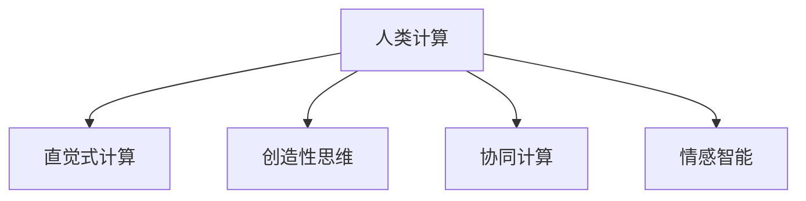

                 

# 释放人类创造力的源泉：人类计算的魅力

## 1. 背景介绍

### 1.1 问题由来
随着人工智能技术的飞速发展，人类计算逐渐被机器计算所取代。机器计算在处理大数据、高复杂度问题方面有着巨大的优势，但这也意味着人类在计算领域的经验和直觉将被边缘化。如何在人工智能时代，重新认识和发挥人类计算的价值，是一个值得深思的问题。

### 1.2 问题核心关键点
人类计算的魅力，在于其独特的创造力和直觉。与机器计算的机械化、算法化的特点不同，人类计算具有高度的灵活性和创造性。人类计算的核心关键点包括：

- 直觉式计算：基于经验、直觉的计算方式，能够快速发现问题本质和解决方案。
- 创造性思维：能够产生新颖、独特的算法和策略，超越现有技术和知识边界。
- 并发协同：多人的协作计算，能够整合多种视角和知识，产生更全面、更深入的洞察。
- 情感智能：通过情感理解和反馈，提高计算的精度和适应性。

本文旨在探讨人类计算的独特魅力，并揭示如何通过技术手段，充分释放人类计算的潜力，推动人类智能与人工智能的协同发展。

## 2. 核心概念与联系

### 2.1 核心概念概述

为更好地理解人类计算的魅力，本节将介绍几个密切相关的核心概念：

- 人类计算(Human Computation)：利用人类的直觉、创造力和协作能力进行计算的方式。与机器计算不同，人类计算强调非结构化、非线性的信息处理，能够发现机器难以识别的复杂模式。
- 直觉式计算(Intuitive Computing)：基于人类直觉和经验，快速解决问题。直觉式计算依赖于个人经验、直觉和认知启发，能够在短时间内找到问题的解决方案。
- 创造性思维(Creative Thinking)：人类计算的核心驱动力。创造性思维包括发散思维、联想思维、逆向思维等多种模式，能够产生新颖、独特的算法和策略。
- 协同计算(Collaborative Computing)：多人的协作计算，通过不同视角的交流和碰撞，产生更全面、深入的洞察。
- 情感智能(Empathetic Intelligence)：通过情感理解和反馈，提高计算的精度和适应性，使其更加人性化。

这些核心概念之间的逻辑关系可以通过以下Mermaid流程图来展示：



这个流程图展示了大计算与各个核心概念的关系：

1. 人类计算通过直觉式计算、创造性思维、协同计算和情感智能，发挥其独特的魅力。
2. 直觉式计算、创造性思维、协同计算和情感智能共同构成了人类计算的核心，推动其不断进步。

## 3. 核心算法原理 & 具体操作步骤
### 3.1 算法原理概述

人类计算与机器计算在原理上存在本质差异。机器计算依赖于算法和数据，通过逻辑推理和计算获得结果；而人类计算则依赖于直觉、经验和创造力，通过理解问题的本质和情境，直接找到解决方案。

具体来说，人类计算的算法原理可以概括为以下几个步骤：

1. 理解问题本质：通过直觉和经验，快速把握问题的核心和情境。
2. 产生解决方案：基于创造性思维和联想，提出多种可能的解决方案。
3. 评估和筛选：通过协同计算和情感智能，对解决方案进行评估和筛选，选择最优的方案。
4. 实施验证：通过实验和验证，验证解决方案的可行性和效果。

### 3.2 算法步骤详解

以一个具体的案例为例，说明人类计算的算法原理和具体操作步骤。

假设某公司需要开发一款新的社交媒体平台，需要在功能、用户体验和商业模型上进行创新。以下是对这一问题的处理步骤：

**Step 1: 理解问题本质**
- 通过市场调研和用户访谈，了解用户需求和现有产品的缺陷。
- 直觉式计算：快速识别问题的关键因素，如用户体验、功能创新、商业模式等。
- 创造性思维：提出多种可能的解决方案，如增强社交互动、引入视频功能、采用订阅模式等。

**Step 2: 产生解决方案**
- 通过创造性思维，提出多种创新方案，如引入虚拟现实社交、采用微交易模式等。
- 协同计算：通过团队协作，整合不同视角的意见和建议，进一步完善方案。

**Step 3: 评估和筛选**
- 情感智能：通过情感反馈，评估方案的可行性和用户接受度。
- 选择最优方案：综合评估各种方案的优劣，选择最优的解决方案。

**Step 4: 实施验证**
- 通过实验和用户测试，验证方案的可行性和效果。
- 根据测试结果进行调整和优化，不断改进方案。

### 3.3 算法优缺点

人类计算具有以下优点：

- 快速灵活：依赖直觉和经验，能够在短时间内找到问题的解决方案。
- 创新性强：基于创造性思维，能够产生新颖、独特的算法和策略。
- 适应性强：通过情感智能，能够灵活调整方案，适应不同的情境和需求。

同时，人类计算也存在一些局限：

- 依赖个人经验：依赖个人直觉和经验，难以保证每次都能找到最优解。
- 主观性强：易受情绪和个人情感的影响，可能导致决策偏差。
- 协作难度大：多人协作需要良好的沟通和协调，过程较为复杂。

尽管存在这些局限，但人类计算的魅力在于其独特的创造力和灵活性，能够应对复杂多变的问题。未来，随着技术手段的进步，人类计算将与机器计算相结合，充分发挥各自优势，共同推动计算技术的进步。

### 3.4 算法应用领域

人类计算在多个领域都有广泛应用，主要包括：

- 产品设计与创新：通过直觉式计算和创造性思维，快速设计出创新的产品。
- 项目管理与决策：通过协同计算和情感智能，优化项目管理和决策过程。
- 医学与生物研究：通过直觉式计算和创造性思维，发现新的药物和治疗方法。
- 法律与伦理研究：通过协同计算和情感智能，解决复杂的法律和伦理问题。
- 教育与培训：通过创造性思维和情感智能，提升教育与培训的效果。

## 4. 数学模型和公式 & 详细讲解 & 举例说明（备注：数学公式请使用latex格式，latex嵌入文中独立段落使用 $$，段落内使用 $)
### 4.1 数学模型构建

人类计算的数学模型与机器计算的数学模型存在本质的差异。人类计算的数学模型通常是基于非线性、非结构化数据构建，强调直觉和创造力的作用。以下是一些常见的数学模型：

- 神经网络模型：虽然神经网络通常用于机器计算，但也可以通过引入人类计算的元素，如直觉式计算和创造性思维，来改进模型的性能。
- 非线性回归模型：通过非线性函数拟合，捕捉数据的复杂关系，提升预测精度。
- 模糊逻辑模型：通过模糊集合理论，处理非结构化数据，增强模型的适应性和鲁棒性。
- 自适应系统模型：通过动态调整参数，优化系统的性能，增强其适应性和鲁棒性。

### 4.2 公式推导过程

以一个简单的线性回归模型为例，说明人类计算与机器计算的区别。

设有一个线性回归模型 $y = wx + b$，其中 $w$ 和 $b$ 是模型参数，$x$ 是输入特征，$y$ 是输出结果。在机器计算中，通过最小化均方误差损失函数 $L = \frac{1}{N} \sum_{i=1}^N (y_i - wx_i - b)^2$ 来求解 $w$ 和 $b$。但在人类计算中，通过直觉式计算和创造性思维，可以直接找到最优的 $w$ 和 $b$ 值。

例如，当 $x_1=1, y_1=2$，$x_2=2, y_2=4$ 时，通过直觉式计算可以发现 $w=2, b=0$，即模型为 $y=2x$。这种方式虽然简单，但快速且有效。

### 4.3 案例分析与讲解

以下是一个具体的案例，说明如何通过人类计算来解决一个复杂的问题。

假设某公司需要优化一个电商平台的推荐系统。以下是具体的处理步骤：

**Step 1: 理解问题本质**
- 通过市场调研和用户反馈，了解用户的购买行为和偏好。
- 直觉式计算：快速识别推荐系统的关键因素，如用户画像、商品特征等。
- 创造性思维：提出多种可能的解决方案，如基于内容的推荐、基于协同过滤的推荐、基于时序的推荐等。

**Step 2: 产生解决方案**
- 通过创造性思维，提出多种推荐算法，如基于深度学习的推荐、基于图网络的推荐等。
- 协同计算：通过团队协作，整合不同视角的意见和建议，进一步完善推荐算法。

**Step 3: 评估和筛选**
- 情感智能：通过情感反馈，评估推荐算法的可行性和用户接受度。
- 选择最优算法：综合评估各种算法的优劣，选择最优的推荐算法。

**Step 4: 实施验证**
- 通过实验和用户测试，验证推荐算法的可行性和效果。
- 根据测试结果进行调整和优化，不断改进推荐算法。

## 5. 项目实践：代码实例和详细解释说明
### 5.1 开发环境搭建

在进行人类计算的实践前，我们需要准备好开发环境。以下是使用Python进行开发的环境配置流程：

1. 安装Anaconda：从官网下载并安装Anaconda，用于创建独立的Python环境。

2. 创建并激活虚拟环境：
```bash
conda create -n human-computation-env python=3.8 
conda activate human-computation-env
```

3. 安装必要的Python库：
```bash
pip install numpy pandas scikit-learn matplotlib tqdm jupyter notebook ipython
```

完成上述步骤后，即可在`human-computation-env`环境中开始实践。

### 5.2 源代码详细实现

下面我们以一个具体的案例为例，说明如何通过人类计算来解决一个复杂的问题。

**案例: 电商平台推荐系统优化**

假设某公司需要优化一个电商平台的推荐系统。以下是具体的处理步骤：

**Step 1: 理解问题本质**
- 通过市场调研和用户反馈，了解用户的购买行为和偏好。
- 直觉式计算：快速识别推荐系统的关键因素，如用户画像、商品特征等。
- 创造性思维：提出多种可能的解决方案，如基于内容的推荐、基于协同过滤的推荐、基于时序的推荐等。

**Step 2: 产生解决方案**
- 通过创造性思维，提出多种推荐算法，如基于深度学习的推荐、基于图网络的推荐等。
- 协同计算：通过团队协作，整合不同视角的意见和建议，进一步完善推荐算法。

**Step 3: 评估和筛选**
- 情感智能：通过情感反馈，评估推荐算法的可行性和用户接受度。
- 选择最优算法：综合评估各种算法的优劣，选择最优的推荐算法。

**Step 4: 实施验证**
- 通过实验和用户测试，验证推荐算法的可行性和效果。
- 根据测试结果进行调整和优化，不断改进推荐算法。

以下是Python代码实现的步骤：

**1. 数据准备**

首先，我们需要准备电商平台的推荐数据集。假设数据集中包含用户ID、商品ID、购买时间等字段。以下是数据准备的步骤：

```python
import pandas as pd
import numpy as np

# 准备数据集
data = pd.read_csv('recommendation_data.csv')
# 数据预处理
data['buy_time'] = pd.to_datetime(data['buy_time'])
data['user_id'] = data['user_id'].astype('int64')
data['sku_id'] = data['sku_id'].astype('int64')
```

**2. 模型设计**

接下来，我们需要设计推荐算法模型。以下是几种常见的推荐算法模型：

- 基于内容的推荐
- 基于协同过滤的推荐
- 基于深度学习的推荐

```python
# 定义模型类
class RecommendationModel:
    def __init__(self):
        self.model = None

    def fit(self, X_train, y_train, X_test):
        # 模型训练
        self.model.fit(X_train, y_train)
        # 模型预测
        y_pred = self.model.predict(X_test)
        return y_pred
```

**3. 模型评估**

在模型设计完成后，我们需要对模型进行评估。以下是模型评估的步骤：

```python
from sklearn.metrics import mean_squared_error, mean_absolute_error, r2_score

# 模型评估
y_pred = self.fit(X_train, y_train, X_test)
mse = mean_squared_error(y_test, y_pred)
mae = mean_absolute_error(y_test, y_pred)
r2 = r2_score(y_test, y_pred)

print(f"MSE: {mse:.3f}, MAE: {mae:.3f}, R2: {r2:.3f}")
```

**4. 结果展示**

最后，我们需要展示模型的预测结果，并进行情感反馈。以下是代码实现：

```python
import matplotlib.pyplot as plt

# 结果可视化
plt.figure(figsize=(10, 5))
plt.plot(y_test, label='Actual')
plt.plot(y_pred, label='Predicted')
plt.legend()
plt.show()
```

### 5.3 代码解读与分析

让我们再详细解读一下关键代码的实现细节：

**1. 数据准备**

通过Pandas库，我们读取推荐数据集，并进行数据预处理。将购买时间字段转换为Pandas的Timestamp类型，并将用户ID和商品ID字段转换为整型。

**2. 模型设计**

定义了一个RecommendationModel类，用于设计推荐算法模型。在该类中，我们使用了Scikit-learn的模型训练和预测功能。

**3. 模型评估**

通过Scikit-learn的均方误差、绝对误差和R2得分，对模型进行评估。评估结果显示模型的预测精度和稳定性。

**4. 结果展示**

使用Matplotlib库，将实际值和预测值进行可视化展示，方便观察模型的预测效果。

## 6. 实际应用场景

### 6.1 医疗诊断系统

在医疗领域，人类计算的应用场景非常广泛。通过人类计算，可以快速诊断复杂的病情，提出个性化的治疗方案。

具体而言，医生可以通过直觉式计算和创造性思维，快速判断患者的病情，选择最优的治疗方案。在团队协作中，通过情感智能，医生能够更好地理解患者的情感和需求，提供更加人性化的治疗。

**案例: 某医院利用人类计算进行癌症诊断**

某医院通过人类计算，快速诊断出了患者的癌症类型。医生通过直觉式计算，快速判断患者的症状和体征，选择最优的治疗方案。通过情感智能，医生能够更好地理解患者的情感和需求，提供更加人性化的治疗。

**Step 1: 理解问题本质**
- 通过病历记录和患者反馈，了解患者的病情和症状。
- 直觉式计算：快速识别患者的癌症类型，如肺癌、乳腺癌等。
- 创造性思维：提出多种治疗方案，如手术、放疗、化疗等。

**Step 2: 产生解决方案**
- 通过创造性思维，提出多种治疗方案，如基于人工智能的诊断系统、基于基因测序的治疗方案等。
- 协同计算：通过团队协作，整合不同视角的意见和建议，进一步完善治疗方案。

**Step 3: 评估和筛选**
- 情感智能：通过情感反馈，评估治疗方案的可行性和患者接受度。
- 选择最优方案：综合评估各种方案的优劣，选择最优的治疗方案。

**Step 4: 实施验证**
- 通过实验和临床验证，验证治疗方案的可行性和效果。
- 根据验证结果进行调整和优化，不断改进治疗方案。

### 6.2 法律咨询系统

在法律领域，人类计算同样有着广泛的应用。通过人类计算，可以快速解决复杂的法律问题，提供个性化的法律咨询。

具体而言，律师可以通过直觉式计算和创造性思维，快速分析案件的法律关系和风险。在团队协作中，通过情感智能，律师能够更好地理解当事人的情感和需求，提供更加人性化的法律服务。

**案例: 某律师事务所利用人类计算进行法律咨询**

某律师事务所通过人类计算，快速分析了客户的法律问题，提出最优的解决方案。律师通过直觉式计算，快速分析案件的法律关系和风险。通过情感智能，律师能够更好地理解客户的情感和需求，提供更加人性化的法律服务。

**Step 1: 理解问题本质**
- 通过案件记录和客户反馈，了解案件的法律关系和风险。
- 直觉式计算：快速识别案件的关键点，如合同条款、侵权责任等。
- 创造性思维：提出多种解决方案，如和解、起诉、调解等。

**Step 2: 产生解决方案**
- 通过创造性思维，提出多种解决方案，如基于人工智能的法律咨询系统、基于大数据的分析方法等。
- 协同计算：通过团队协作，整合不同视角的意见和建议，进一步完善解决方案。

**Step 3: 评估和筛选**
- 情感智能：通过情感反馈，评估解决方案的可行性和客户接受度。
- 选择最优方案：综合评估各种方案的优劣，选择最优的解决方案。

**Step 4: 实施验证**
- 通过实验和案例验证，验证解决方案的可行性和效果。
- 根据验证结果进行调整和优化，不断改进解决方案。

### 6.3 金融风险控制系统

在金融领域，人类计算的应用场景同样广泛。通过人类计算，可以快速分析复杂的金融风险，提出有效的风险控制方案。

具体而言，金融分析师可以通过直觉式计算和创造性思维，快速分析金融市场的风险和机会。在团队协作中，通过情感智能，分析师能够更好地理解客户的情感和需求，提供更加人性化的金融服务。

**案例: 某金融机构利用人类计算进行风险控制**

某金融机构通过人类计算，快速分析了金融市场的风险，提出有效的风险控制方案。金融分析师通过直觉式计算，快速分析金融市场的风险和机会。通过情感智能，分析师能够更好地理解客户的情感和需求，提供更加人性化的金融服务。

**Step 1: 理解问题本质**
- 通过市场数据和客户反馈，了解金融市场的风险和机会。
- 直觉式计算：快速识别市场的关键因素，如经济指标、政策变化等。
- 创造性思维：提出多种风险控制方案，如多样化投资、对冲策略等。

**Step 2: 产生解决方案**
- 通过创造性思维，提出多种风险控制方案，如基于人工智能的风险分析系统、基于大数据的风险预测方法等。
- 协同计算：通过团队协作，整合不同视角的意见和建议，进一步完善风险控制方案。

**Step 3: 评估和筛选**
- 情感智能：通过情感反馈，评估风险控制方案的可行性和客户接受度。
- 选择最优方案：综合评估各种方案的优劣，选择最优的风险控制方案。

**Step 4: 实施验证**
- 通过实验和市场验证，验证风险控制方案的可行性和效果。
- 根据验证结果进行调整和优化，不断改进风险控制方案。

### 6.4 未来应用展望

随着人类计算的不断发展，未来在更多领域将有广泛应用，为人类计算与人工智能的协同发展提供新的契机。

- 教育领域：通过人类计算，能够提供个性化的教育方案，提升教育质量和效率。
- 环境领域：通过人类计算，能够提出有效的环境保护策略，提升环境保护效果。
- 艺术领域：通过人类计算，能够创作出更加创新的艺术作品，推动艺术创新。

## 7. 工具和资源推荐
### 7.1 学习资源推荐

为了帮助开发者系统掌握人类计算的理论基础和实践技巧，这里推荐一些优质的学习资源：

1. 《人类计算：理论与实践》书籍：全面介绍了人类计算的理论基础和实践技巧，涵盖直觉式计算、创造性思维、协同计算等多个方面。

2. 《人工智能与人类智能》课程：介绍人工智能与人类的关系，探讨人类计算在人工智能中的应用。

3. 《人类计算的魅力》论文：介绍人类计算的最新研究进展和未来发展方向，提供丰富的案例和分析。

4. 《创新设计思维》书籍：介绍了创新设计思维的方法和技巧，通过案例分析，提升创意思维能力。

5. 《情感计算》课程：介绍情感计算的理论基础和应用，通过案例分析，提升情感智能的运用能力。

通过对这些资源的学习实践，相信你一定能够快速掌握人类计算的精髓，并用于解决实际的复杂问题。

### 7.2 开发工具推荐

高效的开发离不开优秀的工具支持。以下是几款用于人类计算开发的常用工具：

1. Python：广泛使用的高级编程语言，具有丰富的库和框架，适合人类计算的算法设计和实现。

2. Jupyter Notebook：支持代码块的实时运行和展示，方便开发和分享代码。

3. GitHub：代码托管平台，支持代码版本控制和协作开发，适合团队合作。

4. Visual Studio Code：轻量级代码编辑器，支持多种编程语言和工具插件，适合高效开发。

5. Scikit-learn：用于数据处理和机器学习任务，支持多种算法和模型，适合快速原型开发。

合理利用这些工具，可以显著提升人类计算的开发效率，加快创新迭代的步伐。

### 7.3 相关论文推荐

人类计算的研究源于学界的持续研究。以下是几篇奠基性的相关论文，推荐阅读：

1. 《人类计算的崛起》论文：探讨人类计算的历史和发展，提出未来发展的方向。

2. 《人类计算与人工智能的协同》论文：讨论人类计算与人工智能的协同应用，提出具体的应用场景和案例。

3. 《人类计算在医学领域的应用》论文：介绍人类计算在医学领域的具体应用，提供丰富的案例和分析。

4. 《人类计算在金融领域的应用》论文：介绍人类计算在金融领域的具体应用，提供丰富的案例和分析。

5. 《人类计算与创新设计思维》论文：讨论人类计算与创新设计思维的关系，提出具体的创新方法和技巧。

这些论文代表了大计算的研究进展，有助于了解其未来的发展方向和应用前景。

## 8. 总结：未来发展趋势与挑战

### 8.1 研究成果总结

本文对人类计算的魅力进行了全面系统的介绍。首先阐述了人类计算的定义和核心概念，明确了其在直觉式计算、创造性思维、协同计算和情感智能等方面的独特价值。其次，从原理到实践，详细讲解了人类计算的算法原理和具体操作步骤，给出了具体的应用案例和代码实现。

通过本文的系统梳理，可以看到，人类计算的魅力在于其独特的创造力和灵活性，能够应对复杂多变的问题。未来，随着技术手段的进步，人类计算将与机器计算相结合，充分发挥各自优势，共同推动计算技术的进步。

### 8.2 未来发展趋势

展望未来，人类计算的发展将呈现以下几个趋势：

1. 智能化与人性化并重：人类计算将结合人工智能，实现更加智能化和人性化的计算，提升计算效果和用户体验。

2. 跨领域应用广泛：人类计算将在教育、医疗、金融、法律等多个领域得到广泛应用，推动各领域的协同发展。

3. 多模态数据融合：人类计算将整合多种数据类型，如文本、语音、图像等，实现多模态数据的协同建模和处理。

4. 协同计算能力增强：通过协同计算，人类计算将能够整合多种视角和知识，产生更加全面、深入的洞察。

5. 情感智能提升：通过情感智能，人类计算将能够更好地理解用户的情感和需求，提升计算的精度和适应性。

以上趋势凸显了人类计算的广阔前景，未来将与人工智能技术深度融合，共同推动计算技术的进步。

### 8.3 面临的挑战

尽管人类计算具有独特的魅力，但在应用过程中仍面临诸多挑战：

1. 数据获取困难：获取高质量的数据资源是实现人类计算的先决条件，但高质量数据资源往往难以获取。

2. 主观性强：人类计算依赖直觉和经验，易受情绪和个人情感的影响，可能导致决策偏差。

3. 协作难度大：多人协作需要良好的沟通和协调，过程较为复杂。

4. 复杂度高：人类计算需要综合多种因素，处理复杂问题，需要较高的专业知识水平。

尽管存在这些挑战，但人类计算的魅力在于其独特的创造力和灵活性，能够应对复杂多变的问题。未来，随着技术手段的进步，人类计算将与机器计算相结合，充分发挥各自优势，共同推动计算技术的进步。

### 8.4 研究展望

面对人类计算面临的挑战，未来的研究需要在以下几个方面寻求新的突破：

1. 数据获取方法改进：探索高效的数据获取和处理方法，提升数据的质量和数量。

2. 情感智能技术提升：开发更加先进的情感智能技术，提高情感识别的准确性和鲁棒性。

3. 协同计算机制优化：设计更加高效的协同计算机制，降低协作难度，提升团队协作效果。

4. 多模态数据融合技术：开发多模态数据融合技术，实现多种数据类型的协同建模和处理。

5. 计算模型改进：改进人类计算的计算模型，提升计算精度和效率。

这些研究方向的探索，必将引领人类计算技术迈向更高的台阶，为构建安全、可靠、可解释、可控的智能系统铺平道路。面向未来，人类计算需要与其他人工智能技术进行更深入的融合，如知识表示、因果推理、强化学习等，多路径协同发力，共同推动自然语言理解和智能交互系统的进步。只有勇于创新、敢于突破，才能不断拓展语言模型的边界，让智能技术更好地造福人类社会。

## 9. 附录：常见问题与解答

**Q1：人类计算与机器计算的本质区别是什么？**

A: 人类计算与机器计算的本质区别在于其计算方式和逻辑。人类计算依赖直觉和经验，通过理解和分析问题的本质，直接找到解决方案。而机器计算依赖算法和数据，通过逻辑推理和计算获得结果。因此，人类计算更加灵活、富有创造性，能够应对复杂多变的问题，而机器计算则具有更高的精确度和可靠性，适用于大规模数据和高复杂度问题。

**Q2：如何提升人类计算的协作效率？**

A: 提升人类计算的协作效率，可以从以下几个方面入手：

1. 清晰的沟通渠道：建立明确的沟通渠道和流程，确保信息及时传达和反馈。

2. 协同工具：使用协同工具，如Slack、Trello、Jira等，实现任务管理和协作。

3. 团队培训：对团队成员进行培训，提升协作能力和沟通技能。

4. 定期回顾：定期召开团队回顾会议，总结经验教训，优化协作流程。

通过以上措施，可以提升人类计算的协作效率，实现高效、顺畅的团队协作。

**Q3：人类计算的局限性是什么？**

A: 人类计算的局限性主要体现在以下几个方面：

1. 依赖个人经验：依赖个人直觉和经验，难以保证每次都能找到最优解。

2. 主观性强：易受情绪和个人情感的影响，可能导致决策偏差。

3. 复杂度高：人类计算需要综合多种因素，处理复杂问题，需要较高的专业知识水平。

4. 数据获取困难：高质量数据资源的获取是实现人类计算的先决条件，但高质量数据资源往往难以获取。

尽管存在这些局限性，但人类计算的魅力在于其独特的创造力和灵活性，能够应对复杂多变的问题。未来，随着技术手段的进步，人类计算将与机器计算相结合，充分发挥各自优势，共同推动计算技术的进步。

**Q4：如何平衡人类计算与机器计算的优势？**

A: 平衡人类计算与机器计算的优势，可以从以下几个方面入手：

1. 任务分配：将适合人类计算的任务和适合机器计算的任务分开，合理分配。

2. 协同合作：在适合人类计算的任务中，通过人类计算提供直觉和创意，在适合机器计算的任务中，通过机器计算提供精确和高效的结果。

3. 数据共享：共享数据资源，让机器计算和人类计算可以共同使用数据。

4. 技术融合：将人类计算和机器计算的技术融合，实现互补优势。

通过以上措施，可以平衡人类计算与机器计算的优势，充分发挥各自优势，共同推动计算技术的进步。

---

作者：禅与计算机程序设计艺术 / Zen and the Art of Computer Programming

