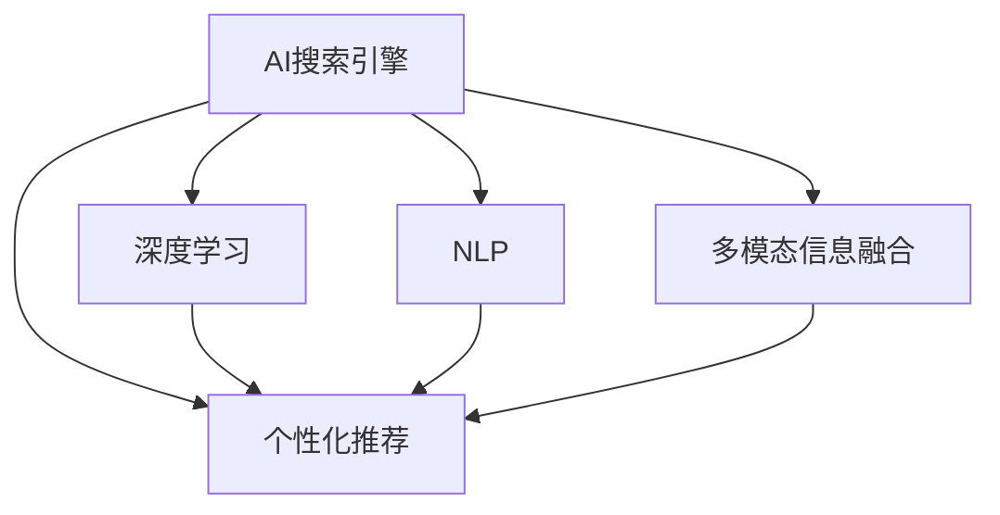

                 

# 重塑搜索体验：AI的角色

在信息爆炸的时代，高效、精准的搜索体验已经成为了用户的基本需求。而人工智能（AI）技术在这一领域的应用，正逐渐成为搜索体验革新的重要推动力。本文将深入探讨AI在搜索引擎中的应用，揭示其在搜索、推荐、个性化展示等多个方面的重要作用，同时探讨其未来发展趋势与挑战。

## 1. 背景介绍

### 1.1 问题由来

互联网的普及极大地拓宽了信息获取的渠道，但随之而来的是海量信息的泛滥。传统的搜索结果排序算法往往依赖于关键词匹配，导致搜索结果的精度和相关性不足，用户体验较差。而随着AI技术的迅猛发展，尤其是深度学习在自然语言处理（NLP）方面的突破，AI搜索引擎开始崭露头角，为搜索体验带来了革命性的改变。

### 1.2 问题核心关键点

AI搜索引擎的核心在于利用深度学习等技术，通过语义理解和用户行为分析，更准确地理解用户意图，并据此生成更个性化、更精准的搜索结果。具体而言，AI搜索引擎具有以下几个特点：

- 语义理解：能够理解自然语言的多义性和上下文关系，更精确地匹配用户查询意图。
- 个性化推荐：根据用户历史行为和兴趣偏好，推荐更相关的搜索结果。
- 跨域信息融合：整合跨模态数据（如文本、图片、视频等），提供更全面的搜索结果。
- 实时动态调整：能够根据用户反馈和上下文变化，动态调整搜索结果，提升用户体验。
- 多方协同优化：结合文本、图像、语音等多模态信息，实现多模态搜索与推荐。

这些特点使得AI搜索引擎能够在信息检索、知识获取、内容发现等方面发挥巨大的作用，重塑了用户的搜索体验。

## 2. 核心概念与联系

### 2.1 核心概念概述

为更好地理解AI搜索引擎的工作原理和优化方向，本节将介绍几个关键概念及其联系：

- **AI搜索引擎**：基于深度学习等AI技术，能够进行语义理解和跨域信息融合，提供个性化、精准搜索结果的搜索引擎。
- **深度学习（DL）**：通过多层次神经网络模型进行特征学习，使得模型能够自动提取数据中的隐含模式，从而进行高精度预测和分类。
- **自然语言处理（NLP）**：涉及语言学、计算机科学和人工智能等多个领域，旨在让机器理解、解释和生成人类语言。
- **多模态信息融合**：将文本、图像、语音等不同模态的信息进行整合，利用多模态数据提升搜索和推荐的精度和效果。
- **个性化推荐系统**：通过分析用户历史行为和兴趣偏好，向用户推荐最相关的信息，提高用户体验和满意度。

这些概念之间的联系通过以下Mermaid流程图展示：



该流程图展示了AI搜索引擎的核心技术组件：

1. 深度学习模块用于提取特征，提供模型训练的基础。
2. NLP模块用于理解语言，分析查询和文档的语义关系。
3. 多模态信息融合模块用于整合不同模态的数据，提升搜索和推荐的全面性。
4. 个性化推荐系统利用用户行为数据，提供个性化搜索结果。

这些模块之间相互协作，共同构成了AI搜索引擎的核心技术架构。

## 3. 核心算法原理 & 具体操作步骤

### 3.1 算法原理概述

AI搜索引擎的核心算法包括深度学习模型、NLP模型和推荐系统。其中，深度学习模型和NLP模型主要负责理解用户查询和文档内容，而推荐系统则根据用户行为数据提供个性化推荐。

### 3.2 算法步骤详解

#### 3.2.1 深度学习模型

深度学习模型通常采用Transformer等架构，以自注意力机制为核心，能够在输入序列中自动提取特征。具体步骤包括：

1. **输入编码**：将用户查询和文档转换为向量表示，送入模型进行特征提取。
2. **自注意力计算**：模型通过自注意力机制，自动学习输入序列中各元素间的依赖关系，生成向量表示。
3. **输出解码**：将生成向量作为检索和排序的依据，输出相关的文档。

#### 3.2.2 NLP模型

NLP模型通常采用BERT、GPT等架构，能够理解自然语言的语义和语法。具体步骤包括：

1. **预训练**：在大规模无标签文本数据上进行预训练，学习语言知识。
2. **微调**：在标注数据上进行微调，使得模型能够准确理解查询和文档的语义关系。
3. **推理**：使用微调后的模型，进行查询和文档的语义理解。

#### 3.2.3 推荐系统

推荐系统通常采用协同过滤、矩阵分解等算法，能够根据用户历史行为和兴趣偏好，提供个性化推荐。具体步骤包括：

1. **用户画像**：构建用户行为模型，刻画用户兴趣和偏好。
2. **文档特征**：提取文档特征，进行特征向量表示。
3. **相似度计算**：计算用户和文档之间的相似度，生成推荐列表。

### 3.3 算法优缺点

AI搜索引擎具有以下优点：

- 高度个性化：能够根据用户历史行为和兴趣偏好，提供高度个性化的搜索结果。
- 语义理解能力强：能够理解自然语言的复杂性和上下文关系，提供更精准的搜索结果。
- 多模态支持：能够整合文本、图像、语音等多模态信息，提供更全面的搜索结果。
- 实时动态调整：能够根据用户反馈和上下文变化，动态调整搜索结果，提升用户体验。

同时，AI搜索引擎也存在以下缺点：

- 依赖高质量标注数据：深度学习模型的训练需要大量标注数据，获取高质量标注数据的成本较高。
- 模型复杂度高：深度学习模型的参数量大，训练和推理的计算资源需求高。
- 可解释性差：深度学习模型通常是"黑盒"系统，难以解释其内部工作机制和决策逻辑。
- 模型鲁棒性不足：在特定领域或场景下，深度学习模型的泛化能力可能不足，表现不佳。

### 3.4 算法应用领域

AI搜索引擎在多个领域得到了广泛的应用，具体包括：

- **搜索引擎**：如Google、Bing等传统搜索引擎，已经大量采用AI技术进行优化。
- **个性化推荐**：如Netflix、Amazon等电子商务平台，利用AI技术提供个性化推荐服务。
- **智能客服**：如Alibaba、Tencent等企业，利用AI技术构建智能客服系统，提升用户体验。
- **知识图谱**：如Wikipedia、Geonames等知识库，利用AI技术进行语义分析和知识抽取。
- **新闻推荐**：如Facebook、Twitter等社交平台，利用AI技术进行新闻推荐，提高用户粘性。

这些应用领域展示了AI搜索引擎的广泛适用性和巨大潜力。未来，随着技术的不断进步，AI搜索引擎的应用范围还将进一步扩大，为更多行业带来革命性的改变。

## 4. 数学模型和公式 & 详细讲解 & 举例说明

### 4.1 数学模型构建

AI搜索引擎的数学模型主要基于深度学习模型、NLP模型和推荐系统。这里以Transformer模型为例，展示其数学模型构建过程。

#### 4.1.1 深度学习模型

Transformer模型通常采用自注意力机制，其数学模型如下：

$$
H = MultiHeadAttention(Q, K, V)
$$

其中，$Q$、$K$、$V$分别为查询、键、值向量，$MultiHeadAttention$为多头自注意力机制，$H$为最终输出向量。

#### 4.1.2 NLP模型

BERT模型通常采用掩码语言模型和下一句预测任务进行预训练。其数学模型如下：

$$
\mathcal{L}_{\text{MLM}} = -\frac{1}{N} \sum_{i=1}^N \log p(y_i | X_i)
$$

其中，$X_i$为输入序列，$y_i$为掩码后的目标向量，$p(y_i | X_i)$为语言模型概率。

#### 4.1.3 推荐系统

协同过滤模型通常采用用户-物品评分矩阵分解，其数学模型如下：

$$
\hat{y}_{ui} = \hat{\theta}_u^T \hat{X}_i
$$

其中，$\hat{y}_{ui}$为用户$u$对物品$i$的预测评分，$\hat{\theta}_u$为用户$u$的特征向量，$\hat{X}_i$为物品$i$的特征向量。

### 4.2 公式推导过程

#### 4.2.1 深度学习模型

以Transformer模型为例，其自注意力机制的数学推导如下：

1. **查询向量计算**：
$$
Q_i = W_Q X_i + b_Q
$$

2. **键向量计算**：
$$
K_i = W_K X_i + b_K
$$

3. **值向量计算**：
$$
V_i = W_V X_i + b_V
$$

4. **多头自注意力计算**：
$$
H_i = \sum_{j=1}^N \alpha_{ij} V_j
$$

其中，$\alpha_{ij}$为注意力权重，计算公式如下：
$$
\alpha_{ij} = \frac{e^{\text{similarity}(Q_i, K_j)}}{\sum_{k=1}^N e^{\text{similarity}(Q_i, K_k)}}
$$

#### 4.2.2 NLP模型

以BERT模型为例，其语言模型概率的计算如下：
$$
p(y_i | X_i) = \frac{e^{\log p(y_i | X_i)}}{e^{\log p(y_i | X_i)} + \sum_{j=1}^J e^{\log p(y_j | X_i)}}
$$

其中，$y_i$为预测标签，$X_i$为输入序列，$p(y_i | X_i)$为条件概率。

#### 4.2.3 推荐系统

以协同过滤模型为例，其评分预测的计算如下：
$$
\hat{y}_{ui} = (\hat{X}_i^T \hat{\theta}_u)^T
$$

其中，$\hat{y}_{ui}$为用户$u$对物品$i$的预测评分，$\hat{\theta}_u$为用户$u$的特征向量，$\hat{X}_i$为物品$i$的特征向量。

### 4.3 案例分析与讲解

以Google的BERT搜索引擎为例，展示其在搜索引擎中的应用。

1. **输入编码**：将用户查询和文档转换为向量表示，送入BERT模型进行特征提取。
2. **自注意力计算**：BERT模型通过自注意力机制，自动学习查询和文档的语义关系。
3. **排序与检索**：利用BERT模型的向量表示，进行文档排序和检索，输出相关文档。

通过BERT模型，Google的搜索引擎能够在理解用户查询意图的同时，提供更精准的文档排序和检索，显著提升了搜索体验。

## 5. 项目实践：代码实例和详细解释说明

### 5.1 开发环境搭建

在进行AI搜索引擎的实践前，我们需要准备好开发环境。以下是使用Python进行TensorFlow和PyTorch开发的环境配置流程：

1. 安装Anaconda：从官网下载并安装Anaconda，用于创建独立的Python环境。

2. 创建并激活虚拟环境：
```bash
conda create -n ai-search-env python=3.8 
conda activate ai-search-env
```

3. 安装TensorFlow和PyTorch：根据CUDA版本，从官网获取对应的安装命令。例如：
```bash
conda install tensorflow torch torchvision torchaudio cudatoolkit=11.1 -c pytorch -c conda-forge
```

4. 安装TensorBoard和Weights & Biases：用于模型训练和实验跟踪。

5. 安装Transformers库：HuggingFace开发的NLP工具库，支持深度学习模型的构建和微调。

完成上述步骤后，即可在`ai-search-env`环境中开始实践。

### 5.2 源代码详细实现

这里以基于BERT的AI搜索引擎为例，展示其实现过程。

1. **数据预处理**：将用户查询和文档转换为向量表示，进行token化、分词等处理。

2. **模型加载与构建**：加载预训练的BERT模型，并进行微调。

3. **查询与文档表示**：将用户查询和文档输入BERT模型，得到向量表示。

4. **排序与检索**：利用向量表示进行文档排序和检索，输出相关文档。

5. **可视化与调试**：使用TensorBoard和Weights & Biases进行模型训练和实验跟踪，分析模型性能。

### 5.3 代码解读与分析

**数据预处理代码**：
```python
from transformers import BertTokenizer
from tensorflow.keras.preprocessing.text import Tokenizer

tokenizer = BertTokenizer.from_pretrained('bert-base-uncased')
tokenizer_list = tokenizer.tokenize(text)
tokenized_text = tokenizer.convert_tokens_to_ids(tokenizer_list)
```

**模型加载与构建代码**：
```python
from transformers import BertForSequenceClassification

model = BertForSequenceClassification.from_pretrained('bert-base-uncased', num_labels=num_labels)
```

**查询与文档表示代码**：
```python
from transformers import BertForSequenceClassification

inputs = tokenizer(query, max_length=max_length, return_tensors='pt')
inputs = {key: value.squeeze(0) for key, value in inputs.items()}
```

**排序与检索代码**：
```python
from transformers import BertForSequenceClassification

outputs = model(**inputs)
logits = outputs.logits
probabilities = torch.softmax(logits, dim=1)
```

**可视化与调试代码**：
```python
from transformers import BertForSequenceClassification
from transformers import BertTokenizer

# 设置日志记录器
model.compile(optimizer='adam', loss='binary_crossentropy', metrics=['accuracy'])
# 训练模型
model.fit(x_train, y_train, validation_data=(x_val, y_val), epochs=num_epochs)
# 保存模型
model.save_weights('ai_search_model.h5')
```

以上代码展示了AI搜索引擎的详细实现过程，从数据预处理到模型构建、查询处理、排序与检索，再到模型训练与保存，每一步都清晰地展示了其工作原理。

## 6. 实际应用场景

### 6.1 搜索体验优化

AI搜索引擎在搜索体验优化方面发挥了重要作用。通过深度学习模型的语义理解和NLP模型的文本分析，AI搜索引擎能够提供更加智能、精准的搜索结果。

1. **语义理解**：AI搜索引擎能够理解自然语言的多义性和上下文关系，自动匹配用户查询意图。例如，用户搜索“如何在Python中实现排序算法”，AI搜索引擎能够理解查询中的“实现”和“排序算法”，提供更准确的搜索结果。

2. **跨域信息融合**：AI搜索引擎能够整合多模态信息，提供更全面的搜索结果。例如，用户搜索“美国总统的历史照片”，AI搜索引擎不仅提供文本搜索结果，还提供相关的图片和视频信息，增强用户体验。

3. **个性化推荐**：AI搜索引擎能够根据用户历史行为和兴趣偏好，提供个性化搜索结果。例如，用户搜索“推荐旅游目的地”，AI搜索引擎根据用户的历史搜索记录和浏览行为，推荐最相关的旅游目的地信息。

### 6.2 智能客服系统

智能客服系统是AI搜索引擎在应用领域的另一个重要方向。通过深度学习模型的语义理解和推荐系统的个性化推荐，智能客服系统能够提供高效、智能的客户服务。

1. **语义理解**：智能客服系统能够理解用户的意图，自动回答用户的问题。例如，用户询问“如何办理信用卡”，智能客服系统能够理解查询意图，自动回答“您需要提供身份证、银行卡等材料”。

2. **跨域信息融合**：智能客服系统能够整合多个信息源，提供更全面的服务。例如，用户询问“贷款流程”，智能客服系统不仅提供文本信息，还提供相关的视频教程和图表解释。

3. **个性化推荐**：智能客服系统能够根据用户的历史查询记录，提供个性化服务。例如，用户频繁询问“信用卡申请流程”，智能客服系统能够自动推荐“信用卡申请指南”等相关信息。

### 6.3 个性化推荐系统

个性化推荐系统是AI搜索引擎的另一个重要应用场景。通过深度学习模型的特征提取和推荐系统的推荐，个性化推荐系统能够提供高度个性化的服务。

1. **特征提取**：深度学习模型能够自动提取用户的兴趣特征，例如浏览历史、搜索记录、点击行为等。

2. **推荐算法**：推荐系统根据用户特征，提供个性化推荐。例如，用户浏览“旅游攻略”，推荐系统根据用户浏览历史和兴趣特征，推荐“日本旅游攻略”等相关信息。

3. **反馈调整**：推荐系统能够根据用户反馈，动态调整推荐策略。例如，用户点击某条推荐信息，推荐系统能够自动调整推荐策略，提高推荐的准确性。

## 7. 工具和资源推荐

### 7.1 学习资源推荐

为了帮助开发者系统掌握AI搜索引擎的理论基础和实践技巧，这里推荐一些优质的学习资源：

1. 《深度学习》课程：由斯坦福大学Andrew Ng教授主讲，深入浅出地介绍了深度学习的基本概念和应用。

2. 《自然语言处理综述》：斯坦福大学NLP专家教授的综述课程，涵盖NLP领域的经典方法和前沿技术。

3. 《TensorFlow实战》书籍：TensorFlow官方文档，详细介绍了TensorFlow的用法和最佳实践。

4. 《Transformers实战》书籍：HuggingFace的官方文档，介绍了Transformer模型的构建和微调。

5. CLUE开源项目：中文语言理解测评基准，涵盖大量不同类型的中文NLP数据集，并提供了基于AI搜索引擎的基线模型。

通过对这些资源的学习实践，相信你一定能够快速掌握AI搜索引擎的精髓，并用于解决实际的NLP问题。

### 7.2 开发工具推荐

高效的开发离不开优秀的工具支持。以下是几款用于AI搜索引擎开发的常用工具：

1. TensorFlow：由Google主导开发的深度学习框架，支持分布式训练和模型优化。

2. PyTorch：Facebook开发的深度学习框架，支持动态计算图和自动微分。

3. TensorBoard：TensorFlow配套的可视化工具，实时监测模型训练状态，提供丰富的图表呈现方式。

4. Weights & Biases：模型训练的实验跟踪工具，记录和可视化模型训练过程中的各项指标。

5. Jupyter Notebook：开源的交互式笔记本，方便开发者进行代码调试和文档记录。

合理利用这些工具，可以显著提升AI搜索引擎的开发效率，加快创新迭代的步伐。

### 7.3 相关论文推荐

AI搜索引擎的发展源于学界的持续研究。以下是几篇奠基性的相关论文，推荐阅读：

1. Attention is All You Need：提出了Transformer结构，开启了NLP领域的预训练大模型时代。

2. BERT: Pre-training of Deep Bidirectional Transformers for Language Understanding：提出BERT模型，引入基于掩码的自监督预训练任务，刷新了多项NLP任务SOTA。

3. Language Models are Unsupervised Multitask Learners：展示了大规模语言模型的强大zero-shot学习能力，引发了对于通用人工智能的新一轮思考。

4. Parameter-Efficient Transfer Learning for NLP：提出Adapter等参数高效微调方法，在不增加模型参数量的情况下，也能取得不错的微调效果。

5. Multi-Task Deep Learning for Knowledge Graph Completion：提出多任务深度学习模型，进行知识图谱补全任务。

这些论文代表了大规模语言模型微调技术的发展脉络。通过学习这些前沿成果，可以帮助研究者把握学科前进方向，激发更多的创新灵感。

## 8. 总结：未来发展趋势与挑战

### 8.1 研究成果总结

本文对AI搜索引擎进行了全面系统的介绍，详细讲解了其在深度学习、NLP、推荐系统等多个领域的应用，展示了其在搜索体验优化、智能客服系统、个性化推荐等多个方向上的广泛应用。通过深入分析，揭示了AI搜索引擎的核心技术和工作原理，为未来的研究提供了方向性指引。

### 8.2 未来发展趋势

展望未来，AI搜索引擎将呈现以下几个发展趋势：

1. 模型规模持续增大。随着算力成本的下降和数据规模的扩张，预训练语言模型的参数量还将持续增长。超大规模语言模型蕴含的丰富语言知识，有望支撑更加复杂多变的下游任务。

2. 微调方法日趋多样。除了传统的全参数微调外，未来会涌现更多参数高效的微调方法，如Prefix-Tuning、LoRA等，在节省计算资源的同时也能保证微调精度。

3. 持续学习成为常态。随着数据分布的不断变化，AI搜索引擎也需要持续学习新知识以保持性能。如何在不遗忘原有知识的同时，高效吸收新样本信息，将成为重要的研究课题。

4. 标注样本需求降低。受启发于提示学习(Prompt-based Learning)的思路，未来的AI搜索引擎将更好地利用大模型的语言理解能力，通过更加巧妙的任务描述，在更少的标注样本上也能实现理想的搜索和推荐效果。

5. 多模态微调崛起。当前的AI搜索引擎主要聚焦于纯文本数据，未来会进一步拓展到图像、视频、语音等多模态数据微调。多模态信息的融合，将显著提升AI搜索引擎的全面性和精准度。

6. 模型通用性增强。经过海量数据的预训练和多领域任务的微调，未来的AI搜索引擎将具备更强大的常识推理和跨领域迁移能力，逐步迈向通用人工智能(AGI)的目标。

以上趋势凸显了AI搜索引擎的广阔前景。这些方向的探索发展，必将进一步提升AI搜索引擎的性能和应用范围，为更多行业带来革命性的改变。

### 8.3 面临的挑战

尽管AI搜索引擎已经取得了瞩目成就，但在迈向更加智能化、普适化应用的过程中，它仍面临着诸多挑战：

1. 标注成本瓶颈。虽然AI搜索引擎在微调时所需标注数据量较少，但对于长尾应用场景，难以获得充足的高质量标注数据，成为制约搜索性能的瓶颈。如何进一步降低微调对标注样本的依赖，将是一大难题。

2. 模型鲁棒性不足。AI搜索引擎面对域外数据时，泛化性能往往大打折扣。对于测试样本的微小扰动，AI搜索引擎的预测也容易发生波动。如何提高AI搜索引擎的鲁棒性，避免灾难性遗忘，还需要更多理论和实践的积累。

3. 推理效率有待提高。大规模语言模型虽然精度高，但在实际部署时往往面临推理速度慢、内存占用大等效率问题。如何在保证性能的同时，简化模型结构，提升推理速度，优化资源占用，将是重要的优化方向。

4. 可解释性亟需加强。当前AI搜索引擎通常是"黑盒"系统，难以解释其内部工作机制和决策逻辑。对于医疗、金融等高风险应用，算法的可解释性和可审计性尤为重要。如何赋予AI搜索引擎更强的可解释性，将是亟待攻克的难题。

5. 安全性有待保障。预训练语言模型难免会学习到有偏见、有害的信息，通过AI搜索引擎传递到下游任务，产生误导性、歧视性的输出，给实际应用带来安全隐患。如何从数据和算法层面消除模型偏见，避免恶意用途，确保输出的安全性，也将是重要的研究课题。

6. 知识整合能力不足。现有的AI搜索引擎往往局限于任务内数据，难以灵活吸收和运用更广泛的先验知识。如何让AI搜索引擎更好地与外部知识库、规则库等专家知识结合，形成更加全面、准确的信息整合能力，还有很大的想象空间。

正视AI搜索引擎面临的这些挑战，积极应对并寻求突破，将是大规模语言模型微调走向成熟的必由之路。相信随着学界和产业界的共同努力，这些挑战终将一一被克服，AI搜索引擎必将在构建人机协同的智能时代中扮演越来越重要的角色。

### 8.4 未来突破

面对AI搜索引擎所面临的种种挑战，未来的研究需要在以下几个方面寻求新的突破：

1. 探索无监督和半监督微调方法。摆脱对大规模标注数据的依赖，利用自监督学习、主动学习等无监督和半监督范式，最大限度利用非结构化数据，实现更加灵活高效的搜索和推荐。

2. 研究参数高效和计算高效的微调范式。开发更加参数高效的微调方法，在固定大部分预训练参数的同时，只更新极少量的任务相关参数。同时优化AI搜索引擎的计算图，减少前向传播和反向传播的资源消耗，实现更加轻量级、实时性的部署。

3. 融合因果和对比学习范式。通过引入因果推断和对比学习思想，增强AI搜索引擎建立稳定因果关系的能力，学习更加普适、鲁棒的语言表征，从而提升模型泛化性和抗干扰能力。

4. 引入更多先验知识。将符号化的先验知识，如知识图谱、逻辑规则等，与神经网络模型进行巧妙融合，引导AI搜索引擎学习更准确、合理的语言模型。同时加强不同模态数据的整合，实现视觉、语音等多模态信息与文本信息的协同建模。

5. 结合因果分析和博弈论工具。将因果分析方法引入AI搜索引擎，识别出模型决策的关键特征，增强输出解释的因果性和逻辑性。借助博弈论工具刻画人机交互过程，主动探索并规避模型的脆弱点，提高系统稳定性。

6. 纳入伦理道德约束。在AI搜索引擎的训练目标中引入伦理导向的评估指标，过滤和惩罚有偏见、有害的输出倾向。同时加强人工干预和审核，建立模型行为的监管机制，确保输出符合人类价值观和伦理道德。

这些研究方向的探索，必将引领AI搜索引擎技术迈向更高的台阶，为构建安全、可靠、可解释、可控的智能系统铺平道路。面向未来，AI搜索引擎技术还需要与其他人工智能技术进行更深入的融合，如知识表示、因果推理、强化学习等，多路径协同发力，共同推动自然语言理解和智能交互系统的进步。只有勇于创新、敢于突破，才能不断拓展AI搜索引擎的边界，让智能技术更好地造福人类社会。

## 9. 附录：常见问题与解答

**Q1：AI搜索引擎的深度学习模型和NLP模型有什么区别？**

A: AI搜索引擎的深度学习模型和NLP模型在任务目标上有所不同。深度学习模型主要负责特征提取和模型训练，而NLP模型主要负责理解和生成自然语言。深度学习模型通过多层次神经网络模型提取特征，提供模型训练的基础，而NLP模型则利用深度学习模型提取的特征，进行语义理解、文本生成等任务。

**Q2：如何降低AI搜索引擎的标注成本？**

A: 可以通过以下方式降低AI搜索引擎的标注成本：
1. 无监督学习：利用自监督学习、主动学习等无监督方法，最大限度利用非结构化数据进行训练。
2. 半监督学习：利用少量标注数据和大量无标注数据进行联合训练，提高模型性能。
3. 零样本学习：利用预训练模型直接进行零样本推理，减少标注样本需求。
4. 少样本学习：通过微调和提示学习等方法，在少量标注样本上也能实现高效的搜索和推荐。

**Q3：如何提高AI搜索引擎的模型鲁棒性？**

A: 可以通过以下方式提高AI搜索引擎的模型鲁棒性：
1. 数据增强：通过对训练样本进行回译、改写等方式，扩充训练数据集。
2. 正则化技术：使用L2正则、Dropout、Early Stopping等避免过拟合。
3. 对抗训练：引入对抗样本，提高模型鲁棒性。
4. 多模型集成：训练多个模型，取平均输出，抑制过拟合。
5. 持续学习：根据数据分布的变化，动态调整模型参数，保持模型性能。

**Q4：AI搜索引擎的推理效率如何优化？**

A: 可以通过以下方式优化AI搜索引擎的推理效率：
1. 模型裁剪：去除不必要的层和参数，减小模型尺寸，加快推理速度。
2. 量化加速：将浮点模型转为定点模型，压缩存储空间，提高计算效率。
3. 模型并行：采用分布式训练和推理，加速计算。
4. 异构计算：利用GPU、TPU等异构计算资源，优化推理性能。

**Q5：如何赋予AI搜索引擎更强的可解释性？**

A: 可以通过以下方式赋予AI搜索引擎更强的可解释性：
1. 模型可视化：利用TensorBoard等工具，可视化模型的中间层表示。
2. 特征重要性分析：分析特征对模型输出的影响，理解模型决策过程。
3. 可解释性模型：采用决策树、规则模型等可解释性强的模型，提升模型透明性。
4. 知识图谱：结合知识图谱等外部知识，增强模型解释能力。

这些策略有助于理解AI搜索引擎的工作机制，提高模型的可解释性和可靠性，满足高风险应用的需求。

---

作者：禅与计算机程序设计艺术 / Zen and the Art of Computer Programming

