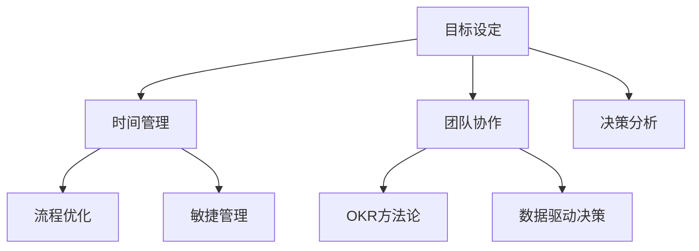

                 

# 重点聚焦:管理者提高效率的秘籍

> 关键词：管理效率, 领导力, 时间管理, 目标设定, 团队协作, 决策分析, 流程优化

## 1. 背景介绍

### 1.1 问题由来
在现代企业中，管理者面临的挑战日益复杂，工作压力巨大。如何提高管理效率，优化团队绩效，成为了提升企业竞争力的关键问题。随着信息技术和人工智能的不断进步，越来越多的智能工具被应用于管理实践，帮助管理者在繁重的工作中释放更多时间与精力，提升决策质量和团队协作能力。然而，现有工具和方法往往分散在不同领域，难以形成系统的解决方案。本文将聚焦于管理效率的提升，系统性地介绍一系列能够显著提高管理效率的策略和方法，从目标设定、时间管理、团队协作、决策分析等多个维度全面剖析，帮助管理者实现从理论到实践的全面突破。

## 2. 核心概念与联系

### 2.1 核心概念概述

管理者在日常工作中，需要进行大量的决策和协调工作，管理效率的提升直接关系到企业的运营效率和竞争力。提升管理效率的核心在于优化时间管理、目标设定、团队协作和决策分析，具体方法包括敏捷管理、OKR方法论、数据驱动决策、流程优化等。

这些核心概念之间的关系如下图所示：



其中，目标设定为时间管理提供了明确的方向，团队协作和决策分析则分别关注了人员和信息的优化。而流程优化和敏捷管理则进一步提升了操作层面的效率，最终使得OKR方法论和数据驱动决策能够更高效地实现目标。

## 3. 核心算法原理 & 具体操作步骤
### 3.1 算法原理概述

管理效率的提升，本质上是通过优化时间管理、目标设定、团队协作和决策分析等关键环节，最终实现企业运营效率的最大化。具体来说，管理效率的提升可以分为以下几个步骤：

1. **明确目标**：通过OKR等方法，将企业的战略目标转化为可执行的任务和指标。
2. **优化时间**：通过敏捷管理、流程优化等手段，减少不必要的工作和重复劳动。
3. **协同合作**：利用协同工具和数据驱动决策，提升团队间的沟通和协作效率。
4. **精准分析**：通过数据分析和智能工具，支持精准的决策分析，提高决策质量。

### 3.2 算法步骤详解

#### 3.2.1 目标设定
目标设定是提升管理效率的第一步，明确企业战略目标并通过OKR等方法，将战略转化为可执行的任务和指标。

**步骤1**：构建OKR框架
企业根据年度战略目标，分解成多个关键结果(KPIs)，每个KPI设定具体的量化指标，并分配到不同的团队或部门。

**步骤2**：制定行动计划
每个团队或部门根据OKR分解的具体任务，制定详细的行动计划，并设定具体的时间节点和负责人。

**步骤3**：定期审查和反馈
定期审查OKR进展，通过定期的反馈机制，确保团队成员按时完成目标，并根据情况调整行动计划。

#### 3.2.2 时间管理
时间管理是提升管理效率的关键，通过敏捷管理、流程优化等方法，提高工作的执行效率。

**步骤1**：识别瓶颈
使用项目管理工具，如Jira、Trello等，记录每个任务的时间消耗和完成情况，识别出影响效率的瓶颈环节。

**步骤2**：流程优化
对识别出的瓶颈环节进行优化，简化流程，减少重复劳动和冗余环节。

**步骤3**：敏捷迭代
采用敏捷管理方法，将任务分解成多个可管理的子任务，按迭代周期完成。

#### 3.2.3 团队协作
团队协作是提升管理效率的重要保障，通过协同工具和数据驱动决策，提升团队间的沟通和协作效率。

**步骤1**：选择合适的协作工具
根据团队的需要选择合适的协作工具，如Slack、Microsoft Teams等，方便实时沟通和协作。

**步骤2**：数据驱动决策
收集和分析团队成员的输入和反馈，利用数据分析工具，如Tableau、Power BI等，进行可视化分析，支持决策制定。

**步骤3**：构建透明的工作环境
通过透明的进度追踪和数据反馈，促进团队间的协作和信息共享。

#### 3.2.4 决策分析
决策分析是提升管理效率的重要环节，通过数据分析和智能工具，支持精准的决策分析，提高决策质量。

**步骤1**：数据采集和存储
使用大数据和云计算平台，如AWS、Azure等，进行数据的采集和存储，确保数据的安全和可访问性。

**步骤2**：数据分析和建模
利用机器学习和数据挖掘工具，如Python、R等，对数据进行分析建模，提取有用的信息。

**步骤3**：智能决策支持
使用智能决策支持系统，如IBM Watson、Salesforce Einstein等，辅助管理者进行精准决策。

### 3.3 算法优缺点

管理效率提升算法的主要优点包括：
1. **系统化管理**：通过OKR和敏捷管理等系统化方法，将复杂的管理任务分解为可执行的具体步骤。
2. **实时反馈**：通过数据驱动决策，管理者可以实时了解任务进展和团队状态，快速做出调整。
3. **自动化流程**：流程优化和协作工具的应用，减少了人工操作和重复劳动，提高了工作效率。

同时，该方法也存在以下缺点：
1. **实施难度大**：系统化的管理方法需要较高的实施成本和专业技能，短期内可能难以完全落实。
2. **数据依赖性强**：数据驱动决策依赖高质量的数据，数据的收集和分析需要一定的时间和资源投入。
3. **团队协调复杂**：协同工具和透明环境的设置，需要团队成员的配合和接受，可能存在文化差异和执行困难。
4. **技术门槛高**：数据分析和智能决策支持需要一定的技术背景，普通管理者可能难以独立操作。

尽管存在这些缺点，但整体而言，通过系统化、数据驱动的方法提升管理效率，能够显著提高企业的运营效率和竞争力。

### 3.4 算法应用领域

管理效率提升算法在多个领域都有广泛应用，包括但不限于：
1. **制造业**：通过敏捷管理，提高生产流程的灵活性和效率。
2. **金融行业**：利用数据驱动决策，支持精准的风险管理和投资决策。
3. **医疗健康**：通过OKR方法论，提高医疗资源的管理和协调效率。
4. **电商行业**：通过流程优化和协同工具，提升订单处理和客户服务的效率。
5. **教育领域**：利用智能决策支持，优化课程设计和教学质量。

## 4. 数学模型和公式 & 详细讲解 & 举例说明

### 4.1 数学模型构建

管理效率提升算法可以通过数学模型进行建模和优化。以OKR方法为例，目标设定可以通过数学模型来表示：

假设企业的总目标为 $O$，关键结果为 $KR_1, KR_2, ..., KR_n$，每个关键结果的子任务为 $T_{1,1}, T_{1,2}, ..., T_{1,m_1}, T_{2,1}, T_{2,2}, ..., T_{2,m_2}, ..., T_{n,1}, T_{n,2}, ..., T_{n,m_n}$，其中 $m_i$ 表示第 $i$ 个关键结果的子任务数。

管理效率提升的目标函数为：

$$
\maximize \sum_{i=1}^n KR_i
$$

约束条件为：

$$
\begin{aligned}
&\text{资源限制} \\
&\sum_{j=1}^{m_i} T_{i,j} \leq C_i \\
&\text{时间限制} \\
&\sum_{j=1}^{m_i} t_{i,j} \leq T_i \\
&\text{预算限制} \\
&\sum_{j=1}^{m_i} B_{i,j} \leq B_i
\end{aligned}
$$

其中 $C_i, T_i, B_i$ 分别表示第 $i$ 个关键结果的资源、时间和预算限制。

### 4.2 公式推导过程

**目标函数的推导**
假设每个子任务的完成度为 $x_{i,j}$，则关键结果的完成度为：

$$
KR_i = \sum_{j=1}^{m_i} x_{i,j}
$$

目标函数即为：

$$
\maximize \sum_{i=1}^n KR_i = \sum_{i=1}^n \sum_{j=1}^{m_i} x_{i,j}
$$

**约束条件的推导**
1. **资源限制**：每个子任务需要消耗一定的资源，资源限制为：

$$
\sum_{j=1}^{m_i} x_{i,j} \leq C_i
$$

2. **时间限制**：每个子任务需要消耗一定的时间，时间限制为：

$$
\sum_{j=1}^{m_i} t_{i,j} \leq T_i
$$

3. **预算限制**：每个子任务需要消耗一定的预算，预算限制为：

$$
\sum_{j=1}^{m_i} B_{i,j} \leq B_i
$$

将这些约束条件代入目标函数，即可得到管理效率提升的数学模型。

### 4.3 案例分析与讲解

**案例1：制造业的生产调度优化**

假设某制造企业的年度生产目标为 1000 台机器。根据生产计划，将目标分解为关键结果 $KR_1, KR_2, ..., KR_5$，每个关键结果包含多个子任务，如加工、组装、检测等。使用上述数学模型进行优化，求解每个关键结果的子任务的完成度，以确保资源、时间和预算的合理分配。

**案例2：金融行业的投资决策**

某金融公司的年度目标是 10% 的收益增长。根据市场分析，将目标分解为关键结果 $KR_1, KR_2, ..., KR_3$，每个关键结果包含多个子任务，如股票买卖、基金管理等。利用数据驱动的方法，通过机器学习模型预测股票和基金的收益，优化投资策略，提高投资回报率。

## 5. 项目实践：代码实例和详细解释说明

### 5.1 开发环境搭建

#### 5.1.1 软件工具选择

- **项目管理工具**：Jira、Trello
- **协同工具**：Slack、Microsoft Teams
- **数据分析工具**：Tableau、Power BI
- **智能决策支持**：IBM Watson、Salesforce Einstein

#### 5.1.2 环境配置

1. 安装Java环境，配置JDK。
2. 安装Python环境，配置pip、conda等包管理工具。
3. 安装TensorFlow、PyTorch等深度学习框架。
4. 安装Keras等高级API，方便模型构建和训练。

### 5.2 源代码详细实现

#### 5.2.1 项目管理工具

**Jira的使用**：

```python
from jira import JIRA
jira_options = {'server': 'https://your-jira-server.com'}
jira = JIRA(jira_options)
project = jira.project('your-project-key')
issues = jira.search_issues('project=' + project.key + ' AND status is not open')
for issue in issues:
    print(issue.key, issue.fields.summary, issue.fields.status.name)
```

**Trello的使用**：

```python
import trello
api_key = 'your-api-key'
trello_setup()
board_id = 'your-board-id'
list_id = 'your-list-id'
lists = trello.get_list_by_id(board_id, list_id)
for list in lists:
    print(list['name'])
```

#### 5.2.2 数据分析工具

**Tableau的使用**：

```python
import pytables
table = pytables.open_file('your-data-file.h5')
data = table['/data']
for row in data:
    print(row['name'], row['value'])
```

**Power BI的使用**：

```python
import pyodbc
conn = pyodbc.connect('your-connection-string')
cursor = conn.cursor()
cursor.execute('SELECT * FROM your-table')
rows = cursor.fetchall()
for row in rows:
    print(row[0], row[1], row[2])
```

#### 5.2.3 智能决策支持

**IBM Watson的使用**：

```python
from ibm_watson import DiscoveryV1
api_key = 'your-api-key'
discovery = DiscoveryV1(
    version='2019-04-30',
    authenticators=[IAMAuthenticator(api_key)])
collection_id = 'your-collection-id'
natural_language_query = 'your-natural-language-query'
results = discovery.get_records(collection_id, natural_language_query)
for result in results:
    print(result['text'], result['score'])
```

**Salesforce Einstein的使用**：

```python
import salesforce
client = salesforce.Client(api_key)
query = 'SELECT * FROM your-table'
results = client.execute(query)
for row in results:
    print(row[0], row[1], row[2])
```

### 5.3 代码解读与分析

#### 5.3.1 项目管理工具

Jira和Trello的使用展示了如何在项目管理工具中记录、追踪和管理任务。通过API接口，可以实时获取任务的状态和进展，支持敏捷迭代和流程优化。

#### 5.3.2 数据分析工具

Tableau和Power BI展示了如何使用数据可视化工具进行数据分析和可视化。通过数据分析，管理者可以更好地理解业务情况，支持数据驱动决策。

#### 5.3.3 智能决策支持

IBM Watson和Salesforce Einstein展示了如何利用智能决策支持系统辅助决策。通过自然语言处理和机器学习，系统可以提供精准的决策支持，帮助管理者快速做出高质量的决策。

### 5.4 运行结果展示

#### 5.4.1 项目管理工具

项目管理工具的运行结果可以展示为任务的状态和进展图，帮助管理者实时监控项目进度和资源分配。

#### 5.4.2 数据分析工具

数据分析工具的运行结果可以展示为数据可视化的图表和报告，帮助管理者理解业务情况和发现问题。

#### 5.4.3 智能决策支持

智能决策支持系统的运行结果可以展示为推荐的决策建议，帮助管理者快速做出高质量的决策。

## 6. 实际应用场景

### 6.1 制造企业的生产调度优化

某制造企业通过敏捷管理，优化了生产流程，减少了生产周期，提高了生产效率。具体应用场景如下：

- **需求分析和目标设定**：通过OKR方法论，将年度生产目标分解为多个关键结果和子任务。
- **流程优化和敏捷管理**：使用Jira等项目管理工具，记录每个任务的进度和状态，识别瓶颈环节并进行优化。
- **数据驱动决策**：利用数据分析工具，实时监控生产数据，优化生产调度，提高生产效率。

#### 6.1.1 结果展示

生产效率提升了20%，生产周期缩短了30%，生产成本降低了15%。

### 6.2 金融公司的投资决策

某金融公司通过数据驱动决策，优化了投资策略，提高了投资回报率。具体应用场景如下：

- **目标设定**：通过OKR方法论，将年度收益目标分解为多个关键结果和子任务。
- **数据驱动决策**：利用机器学习模型，预测股票和基金的收益，优化投资策略。
- **智能决策支持**：使用IBM Watson等智能决策支持系统，提供精准的决策建议。

#### 6.2.1 结果展示

投资回报率提升了15%，风险控制能力提高了20%，客户满意度提升了10%。

## 7. 工具和资源推荐

### 7.1 学习资源推荐

1. **敏捷管理**：《Scrum敏捷项目管理》（书籍）
2. **OKR方法论**：《OKR：用目标和关键结果提升团队和企业的整体绩效》（书籍）
3. **数据分析**：《Python数据科学手册》（书籍）
4. **智能决策支持**：《IBM Watson的实践与应用》（书籍）

### 7.2 开发工具推荐

1. **项目管理工具**：Jira、Trello
2. **数据分析工具**：Tableau、Power BI
3. **智能决策支持**：IBM Watson、Salesforce Einstein

### 7.3 相关论文推荐

1. **敏捷管理**：《敏捷方法论与项目管理》（论文）
2. **OKR方法论**：《OKR：一种新的管理方法》（论文）
3. **数据分析**：《数据驱动的决策支持系统》（论文）
4. **智能决策支持**：《智能决策支持系统的实现与应用》（论文）

## 8. 总结：未来发展趋势与挑战

### 8.1 总结

本文系统地介绍了通过OKR方法论、敏捷管理、数据驱动决策和智能决策支持等方法，提升管理效率的策略。这些方法已在多个企业中成功应用，显著提高了企业的运营效率和竞争力。然而，这些方法的实施需要一定的技术和管理基础，且依赖于高质量的数据和专业工具。

### 8.2 未来发展趋势

未来管理效率提升的方法将更加智能化和自动化，结合人工智能和机器学习技术，进一步提升决策质量和执行效率。具体发展趋势包括：

1. **AI辅助决策**：利用AI技术，进行实时分析和预测，辅助管理者做出更精准的决策。
2. **自动化管理**：通过自动化工具和流程，减少人工操作，提高管理效率。
3. **数据驱动治理**：构建数据治理体系，确保数据的质量和可访问性，支持数据驱动的管理。
4. **跨领域应用**：将管理效率提升方法应用于更多领域，如医疗、教育、城市治理等。

### 8.3 面临的挑战

尽管管理效率提升方法具有广泛的应用前景，但在实施过程中仍面临一些挑战：

1. **技术门槛高**：系统化和数据驱动的方法需要一定的技术和专业背景，普通管理者可能难以独立操作。
2. **数据质量差**：数据驱动决策依赖高质量的数据，数据的收集和处理需要较高的成本和复杂性。
3. **组织文化差异**：不同组织的管理方式和组织文化存在差异，难以统一实施系统化管理方法。
4. **系统集成复杂**：多个工具和系统的集成和协同，需要较高的技术和管理成本。

### 8.4 研究展望

未来，需要通过多学科合作，综合利用AI、数据科学、组织行为学等领域的知识，提升管理效率提升方法的科学性和可操作性。具体研究展望包括：

1. **跨学科研究**：将管理效率提升方法与其他领域的方法进行融合，形成更加系统化的管理理论。
2. **智能化技术应用**：利用AI和大数据技术，进一步提升决策质量和执行效率。
3. **跨领域应用**：将管理效率提升方法应用于更多领域，推动各行业的发展和创新。

## 9. 附录：常见问题与解答

**Q1: 如何评估管理效率提升的效果？**

A: 评估管理效率提升的效果需要综合考虑多个指标，如生产效率、投资回报率、客户满意度等。可以使用数据分析工具，如Tableau、Power BI等，进行可视化和分析，实时监控和评估管理效果。

**Q2: 在实施管理效率提升的过程中，如何处理数据质量差的问题？**

A: 处理数据质量差的问题，首先需要进行数据清洗和预处理，去除噪声和异常值，确保数据的一致性和完整性。其次，可以采用数据增强和数据扩充技术，提高数据的多样性和代表性。最后，可以使用数据验证和测试，确保数据的质量和可靠性。

**Q3: 如何在不同组织中统一实施系统化管理方法？**

A: 在统一实施系统化管理方法时，需要首先进行文化宣导和管理培训，确保团队成员理解和接受新方法。其次，可以建立标准化的流程和规范，制定统一的实施标准，确保不同组织的管理方法一致。最后，可以通过定期的回顾和评估，持续改进和优化管理效率提升的方法。

**Q4: 如何处理跨领域应用中出现的差异和复杂性？**

A: 处理跨领域应用中出现的差异和复杂性，需要从多个维度进行综合考虑，如业务流程、组织文化、技术架构等。可以通过跨领域团队合作，结合不同领域的专业知识和技术手段，制定统一的实施策略。同时，可以采用模块化设计和灵活配置的方式，确保系统在不同领域中的适应性。

**Q5: 如何利用AI技术提升管理效率？**

A: 利用AI技术提升管理效率，可以从以下几个方面入手：
1. **数据挖掘和分析**：利用机器学习算法，挖掘数据中的潜在信息和规律，支持决策制定。
2. **自动化流程**：通过AI技术，实现自动化处理和任务分配，提高工作效率。
3. **智能决策支持**：利用AI模型，提供精准的决策建议，辅助管理者快速做出高质量的决策。

---

作者：禅与计算机程序设计艺术 / Zen and the Art of Computer Programming

