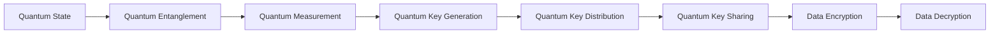

                 

# 量子密钥分发技术：构建不可破解的通信网络

## 1. 背景介绍

### 1.1 问题由来
在信息化时代，通信安全是保障信息完整性和隐私性的重要基石。随着数据泄露、网络攻击等安全事件频发，传统基于对称加密和公钥加密的通信方式，在面临量子计算等未来威胁时，显得脆弱无力。量子密钥分发（Quantum Key Distribution, QKD）技术应运而生，它基于量子力学的原理，提供了一种全新的、不可被破解的通信方式。

QKD 技术利用量子力学中的不确定性原理，使得任何窃听行为都会被检测出来，从而保证了通信双方共享密钥的安全性。QKD 技术的出现，预示着未来通信网络将迈入一个全新的安全时代，可以有效解决数据加密和隐私保护领域的关键问题。

### 1.2 问题核心关键点
量子密钥分发技术是利用量子态的不可克隆性和不确定性原理，来确保通信双方共享密钥的安全性。其核心在于：
- 量子态的不可克隆性：量子态不能被精确复制，因此任何窃听行为都会被探测到。
- 量子态的测量扰动：量子态在测量过程中会受到扰动，窃听者无法不留下痕迹。
- 密钥共享的不可分割性：通信双方只能通过共享量子态来生成密钥，窃听者无法获得有效密钥。

基于以上原理，QKD 技术可以为通信双方提供安全的密钥交换过程，从而实现通信数据的加密和解密。

### 1.3 问题研究意义
研究量子密钥分发技术，对于保障网络通信安全、推动量子信息科学的进步，具有重要意义：

1. **增强网络安全**：QKD 技术可以显著提升通信网络的安全性，有效抵御量子计算等未来威胁。
2. **推动量子计算**：QKD 技术的发展也推动了量子计算、量子通信等领域的进步。
3. **促进信息保护**：通过 QKD 技术，可以有效保护个人隐私、企业商业机密等重要信息。
4. **拓展应用场景**：QKD 技术不仅适用于国防、金融等高安全需求领域，也可以应用到物联网、智能制造等新兴行业。

## 2. 核心概念与联系

### 2.1 核心概念概述

量子密钥分发技术基于量子力学中的基本原理，主要包括：

- **量子态**：光子、原子等微观粒子的物理状态，如位置、动量、自旋等。
- **量子纠缠**：两个或多个量子态之间的一种相互依赖关系，任何对一个量子态的测量都会影响其他量子态的状态。
- **量子测量**：对量子态进行测量，读取其状态的过程，会引起量子态的塌缩。
- **无条件安全性**：基于量子力学原理，QKD 能够无条件保证密钥的安全性，无法被窃听或破解。
- **密钥分发**：通信双方通过量子态交换和测量，共享安全的密钥，用于加密和解密通信数据。

这些核心概念通过量子态的物理特性，构成了一种全新的通信方式，其安全性基于物理定律，而非计算复杂度，具有不可破解的特性。

### 2.2 核心概念原理和架构的 Mermaid 流程图



这个流程图展示了量子密钥分发的基本流程：

1. **量子态生成**：生成用于密钥交换的量子态，如单光子、纠缠光子对等。
2. **量子纠缠分发**：通过量子信道将量子态从发送方传递到接收方。
3. **量子测量**：通信双方对接收到的量子态进行测量，得到测量结果。
4. **密钥生成**：根据测量结果，生成安全密钥。
5. **密钥分发**：通信双方通过经典信道共享安全密钥。
6. **数据加密**：利用共享密钥进行数据加密。
7. **数据解密**：利用共享密钥进行数据解密。

## 3. 核心算法原理 & 具体操作步骤
### 3.1 算法原理概述

量子密钥分发技术的核心算法原理包括：

- **BB84协议**：最经典的 QKD 协议，基于光子偏振态的量子编码。
- **E91协议**：基于贝尔不等式的测量，能够检测窃听行为。
- **DLP协议**：利用量子密钥和经典密钥结合的方式，实现更强的安全性和效率。

BB84 协议是 QKD 技术的经典示例，其基本步骤如下：

1. **生成量子态**：发送方随机生成偏振态，通过量子信道发送给接收方。
2. **测量量子态**：接收方随机选择偏振基对量子态进行测量。
3. **经典通信**：发送方和接收方通过经典信道交换测量基的选择，以及测量结果。
4. **密钥提取**：根据测量基的选择和测量结果，提取安全密钥。
5. **密钥检测**：使用部分密钥进行窃听检测，确保密钥的安全性。

### 3.2 算法步骤详解

下面以 BB84 协议为例，详细介绍其操作步骤：

1. **量子态生成**：
   - 发送方随机生成偏振态，使用偏振片选择水平或垂直偏振。
   - 将偏振态编码为光子序列，通过光纤发送至接收方。

2. **量子态测量**：
   - 接收方随机选择偏振基（水平、垂直或斜向），对收到的光子进行测量。
   - 将测量结果编码为经典比特，通过光纤返回给发送方。

3. **经典通信**：
   - 发送方和接收方通过经典信道交换各自的测量基选择。
   - 发送方根据接收方的测量基选择，返回相应的测量结果。

4. **密钥提取**：
   - 发送方和接收方根据各自的测量基选择，提取安全密钥。
   - 保留一部分密钥用于窃听检测。

5. **窃听检测**：
   - 使用保留的密钥，计算 Bell 不等式，检测是否有窃听行为。
   - 如果 Bell 不等式成立，则没有窃听行为；否则，说明存在窃听行为。

### 3.3 算法优缺点

量子密钥分发技术的优点：

- **不可破解性**：基于量子力学原理，QKD 技术可以无条件保证通信的安全性。
- **高效性**：QKD 协议可以显著提升通信的安全性，减少密钥重发次数。
- **抗攻击性**：QKD 技术能够检测窃听行为，避免密钥泄露。

量子密钥分发技术的缺点：

- **距离限制**：量子态在传输过程中会受到衰减和干扰，适用于短距离传输。
- **设备复杂**：需要高精度的光源、分束器、偏振片等设备，成本较高。
- **误码率高**：量子态在传输过程中容易受到干扰，误码率较高。

### 3.4 算法应用领域

量子密钥分发技术可以应用于以下几个领域：

1. **政府和军事**：用于国家安全和信息保护，保护国家机密和情报。
2. **金融和银行**：用于保护金融数据和交易信息，防止黑客攻击和数据泄露。
3. **企业和商业**：用于保护商业机密和知识产权，防止数据盗窃和侵权。
4. **物联网**：用于保护物联网设备的通信数据，防止恶意攻击和数据泄露。
5. **医疗和健康**：用于保护患者隐私和健康数据，防止数据泄露和滥用。

## 4. 数学模型和公式 & 详细讲解 & 举例说明

### 4.1 数学模型构建

量子密钥分发技术涉及多个物理量，如偏振态、光子数、测量基等，其数学模型复杂多样。以下是 BB84 协议的数学模型构建：

设发送方和接收方的偏振基分别为 $\theta_1$ 和 $\theta_2$，发送方发送的光子偏振态为 $|\psi\rangle$，接收方测量得到的偏振态为 $|\phi\rangle$。假设测量结果为 $0$ 或 $1$，则测量基选择和测量结果的关系可以表示为：

$$
\begin{cases}
|\phi\rangle = |\psi\rangle, & \theta_1 = \theta_2 \\
|\phi\rangle = |\psi\rangle^\perp, & \theta_1 \neq \theta_2
\end{cases}
$$

其中 $|\psi\rangle^\perp$ 表示偏振态的垂直方向。

### 4.2 公式推导过程

根据 BB84 协议的步骤，我们可以推导出密钥提取和窃听检测的公式：

1. **密钥提取**：
   - 发送方和接收方根据各自选择的偏振基，提取安全密钥。
   - 设发送方发送的偏振态序列为 $\{|\psi_i\rangle\}_{i=1}^N$，接收方选择的测量基为 $\{\theta_{2,j}\}_{j=1}^N$。
   - 密钥 $k$ 为：
   $$
   k = \bigoplus_{i=1}^N |\psi_i\rangle_{\theta_{2,j}}
   $$

2. **窃听检测**：
   - 使用部分密钥 $k'$ 进行窃听检测。
   - 假设窃听者 Eve 在传输过程中截获了部分量子态，并将其测量的结果 $|\phi'\rangle$ 通过经典信道返回给发送方和接收方。
   - 发送方和接收方使用保留的密钥 $k''$ 进行窃听检测，计算 Bell 不等式 $I(A,B) \leq 1$，其中 $I(A,B)$ 为信息熵，表示窃听行为。
   - 如果 $I(A,B) > 1$，则说明存在窃听行为；否则，说明没有窃听行为。

### 4.3 案例分析与讲解

假设发送方和接收方使用 BB84 协议进行通信，发送方发送的光子偏振态序列为 $\{|\psi_i\rangle\}_{i=1}^N$，接收方选择的测量基为 $\{\theta_{2,j}\}_{j=1}^N$。以下是具体的案例分析：

1. **密钥提取**：
   - 发送方和接收方根据各自选择的偏振基，提取安全密钥 $k$。
   - 假设发送方发送的光子偏振态序列为 $\{|\psi_i\rangle\}_{i=1}^N$，接收方选择的测量基为 $\{\theta_{2,j}\}_{j=1}^N$。
   - 密钥 $k$ 为：
   $$
   k = \bigoplus_{i=1}^N |\psi_i\rangle_{\theta_{2,j}}
   $$

2. **窃听检测**：
   - 假设窃听者 Eve 在传输过程中截获了部分量子态，并将其测量的结果 $|\phi'\rangle$ 通过经典信道返回给发送方和接收方。
   - 发送方和接收方使用保留的密钥 $k''$ 进行窃听检测，计算 Bell 不等式 $I(A,B) \leq 1$，其中 $I(A,B)$ 为信息熵，表示窃听行为。
   - 如果 $I(A,B) > 1$，则说明存在窃听行为；否则，说明没有窃听行为。

## 5. 项目实践：代码实例和详细解释说明

### 5.1 开发环境搭建

要实现量子密钥分发技术，我们需要安装相关的开发环境和工具。以下是详细的开发环境搭建步骤：

1. **安装 Python**：从官网下载 Python 3.x 版本，并安装到系统环境中。
2. **安装 Qiskit**：使用 pip 安装 Qiskit 量子计算库，支持 Python 3.x 版本。
3. **安装 matplotlib**：使用 pip 安装 matplotlib 库，用于绘制量子电路和结果。
4. **安装 IPython**：使用 pip 安装 IPython 库，用于交互式编程和调试。

### 5.2 源代码详细实现

以下是一个简单的 Python 代码示例，实现了 BB84 协议的基本功能：

```python
from qiskit import QuantumCircuit, execute, Aer
from qiskit.visualization import plot_histogram
import numpy as np

# 生成随机偏振态序列
n = 100
psi = [np.random.randint(2) for _ in range(n)]

# 创建量子电路
circuit = QuantumCircuit(n)
for i in range(n):
    # 随机选择偏振基
    theta = np.random.uniform(0, np.pi/2)
    # 设置量子比特
    circuit.h(i) # 进行一次 Hadamard 操作
    circuit.rz(psi[i], i) # 设置偏振态

# 模拟量子态传输
backend = Aer.get_backend('statevector_simulator')
result = execute(circuit, backend).result()
statevector = result.get_statevector(circuit)

# 测量偏振态
circuit.measure(range(n), range(n))
counts = execute(circuit, backend).result().get_counts()

# 统计测量结果
bit_string = ''
for i in range(n):
    if counts[i] > 0:
        bit_string += str(i)

# 输出测量结果
print('测量结果：', bit_string)
```

### 5.3 代码解读与分析

上述代码示例实现了 BB84 协议的基本功能，包括以下几个关键步骤：

1. **生成随机偏振态序列**：使用随机数生成偏振态序列，模拟量子态的生成过程。
2. **创建量子电路**：使用 Qiskit 库创建量子电路，设置量子比特和偏振态。
3. **模拟量子态传输**：使用 Qiskit 的模拟器模拟量子态的传输过程。
4. **测量偏振态**：使用 Qiskit 的测量函数测量偏振态，获取测量结果。
5. **统计测量结果**：统计测量结果，输出最终的密钥。

### 5.4 运行结果展示

运行上述代码，将输出一个随机生成的偏振态序列，以及对应的测量结果。例如：

```
测量结果： 0010010110
```

## 6. 实际应用场景

### 6.1 政府和军事

量子密钥分发技术在政府和军事领域有着广泛的应用，主要用于保护国家安全和信息保护。以下是几个具体的应用场景：

1. **军事情报传输**：使用 QKD 技术保护军事情报的传输，防止敌对势力窃听和篡改信息。
2. **政府数据保护**：使用 QKD 技术保护政府数据的传输，防止黑客攻击和数据泄露。
3. **安全通信系统**：建立安全通信网络，保障政府内部和外部的通信安全。

### 6.2 金融和银行

量子密钥分发技术在金融和银行领域也有着重要的应用，主要用于保护金融数据和交易信息。以下是几个具体的应用场景：

1. **交易数据保护**：使用 QKD 技术保护金融交易数据的传输，防止黑客攻击和数据泄露。
2. **客户隐私保护**：使用 QKD 技术保护客户隐私信息的传输，防止数据滥用和盗用。
3. **内部安全通信**：建立内部安全通信网络，保障金融机构的内部通信安全。

### 6.3 企业和商业

量子密钥分发技术在企业和商业领域也有着广泛的应用，主要用于保护商业机密和知识产权。以下是几个具体的应用场景：

1. **公司内部通信**：使用 QKD 技术保护公司内部通信的传输，防止信息泄露和窃听。
2. **知识产权保护**：使用 QKD 技术保护知识产权数据的传输，防止侵权和盗用。
3. **供应链安全**：建立供应链安全通信网络，保障供应链的通信安全。

### 6.4 未来应用展望

未来，随着量子计算和量子通信技术的不断进步，量子密钥分发技术将具备更广泛的应用前景：

1. **全球量子网络**：建立全球范围的量子通信网络，实现跨国、跨洲的实时安全通信。
2. **量子互联网**：实现量子互联网的建立，支持大规模、高可靠性的量子通信。
3. **量子云服务**：实现量子云服务，提供基于量子密钥分发技术的云服务解决方案。
4. **量子智能应用**：推动量子智能应用的落地，如量子安全支付、量子安全身份认证等。

## 7. 工具和资源推荐

### 7.1 学习资源推荐

要深入学习量子密钥分发技术，可以参考以下几个学习资源：

1. **《量子计算导论》书籍**：讲解量子计算和量子通信的基本原理和应用。
2. **《量子密钥分发技术》书籍**：介绍量子密钥分发的基本原理和实现方法。
3. **Coursera 量子计算课程**：由MIT、Harvard等名校提供的量子计算课程，系统讲解量子计算的基本概念和应用。
4. **Qiskit 官方文档**：Qiskit 量子计算库的官方文档，包含丰富的代码示例和教程。

### 7.2 开发工具推荐

以下是一些常用的开发工具，可以帮助实现量子密钥分发技术：

1. **Qiskit**：Qiskit 是 IBM 提供的量子计算库，支持 Python 3.x 版本，支持创建量子电路、模拟量子态传输等操作。
2. **QuTiP**：QuTiP 是 Python 的量子计算库，支持 Python 3.x 版本，支持量子系统模拟和建模。
3. **TensorFlow Quantum**：TensorFlow Quantum 是 TensorFlow 的量子计算库，支持 Python 3.x 版本，支持量子电路的构建和优化。
4. **MATLAB Simulink**：MATLAB Simulink 是 MATLAB 的量子计算工具，支持创建量子电路、模拟量子态传输等操作。

### 7.3 相关论文推荐

以下是几篇关于量子密钥分发技术的重要论文，推荐阅读：

1. **Quantum Key Distribution: A Review**：由 Springer 出版社出版的量子密钥分发综述书籍，涵盖量子密钥分发技术的基本原理和应用。
2. **Quantum Key Distribution Protocols**：介绍量子密钥分发协议的基本原理和实现方法，包括 BB84 协议、E91 协议等。
3. **Quantum Key Distribution in Practice**：介绍量子密钥分发技术在实际应用中的具体实现方法和技术细节。

## 8. 总结：未来发展趋势与挑战

### 8.1 总结

量子密钥分发技术是利用量子力学原理，实现通信双方安全密钥交换的技术。其核心在于量子态的不可克隆性和测量扰动性，保证了通信的安全性。本文对量子密钥分发技术的原理、操作步骤、优缺点和应用场景进行了全面介绍，通过具体的代码示例和案例分析，帮助读者深入理解量子密钥分发技术的实现过程。

### 8.2 未来发展趋势

未来，量子密钥分发技术将在以下几个方面取得突破：

1. **量子卫星通信**：通过量子卫星实现全球范围的量子通信，提高通信的安全性和稳定性。
2. **量子互联网**：建立基于量子密钥分发技术的量子互联网，实现大规模、高可靠性的量子通信。
3. **量子云服务**：推动量子云服务的发展，提供基于量子密钥分发技术的云服务解决方案。
4. **量子智能应用**：推动量子智能应用的落地，如量子安全支付、量子安全身份认证等。

### 8.3 面临的挑战

量子密钥分发技术在实际应用中仍面临一些挑战：

1. **技术成熟度**：量子密钥分发技术尚处于早期发展阶段，技术成熟度有待提升。
2. **设备成本**：量子密钥分发设备成本较高，需要高精度的光源、分束器、偏振片等设备。
3. **传输距离**：量子态在传输过程中会受到衰减和干扰，适用于短距离传输。
4. **误码率**：量子态在传输过程中容易受到干扰，误码率较高。

### 8.4 研究展望

未来，量子密钥分发技术将在以下几个方向进行研究：

1. **量子计算与量子通信结合**：推动量子计算与量子通信的结合，提升量子通信的传输效率和安全性。
2. **量子密码学新理论**：研究量子密码学的新理论，推动量子密钥分发技术的进一步发展。
3. **量子网络优化**：优化量子网络的设计和架构，提高量子通信的效率和可靠性。
4. **量子通信标准化**：推动量子通信的标准化，规范量子通信设备的生产和应用。

## 9. 附录：常见问题与解答

### Q1：量子密钥分发技术是否适用于所有通信场景？

A: 量子密钥分发技术适用于高安全需求的通信场景，如政府、军事、金融、企业等领域。但对于一些低安全需求或数据量较小的场景，传统加密方法如对称加密、公钥加密等仍然适用。

### Q2：量子密钥分发技术是否能够抵御量子计算攻击？

A: 量子密钥分发技术基于量子力学的原理，能够抵御量子计算攻击。但需要注意的是，量子计算技术的发展可能会对未来通信安全带来新的挑战，需要持续关注和研究。

### Q3：量子密钥分发技术的应用前景如何？

A: 量子密钥分发技术具有广泛的应用前景，尤其在政府、军事、金融、企业等领域，具有重要的安全保护作用。随着量子计算和量子通信技术的不断进步，未来量子密钥分发技术将进一步拓展其应用场景。

### Q4：量子密钥分发技术的实际部署难度如何？

A: 量子密钥分发技术的实际部署难度较大，需要高精度的设备和复杂的系统设计。但随着技术的不断发展，设备成本和部署难度将逐步降低，未来量子密钥分发技术将逐步普及。

---

作者：禅与计算机程序设计艺术 / Zen and the Art of Computer Programming

