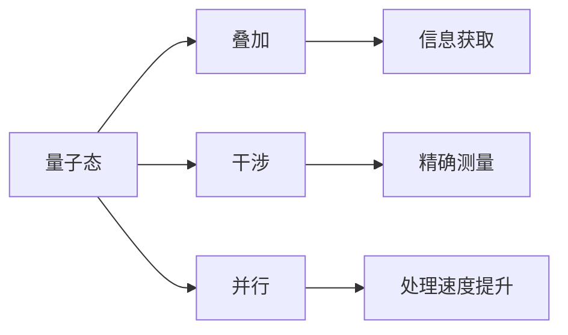

                 

## 1. 背景介绍

在信息时代，数据的获取和处理已变得越来越重要。然而，经典测量方法在面对一些特定问题时，存在固有的局限性。量子感知技术应运而生，利用量子态的叠加性和干涉性，突破了经典测量的极限，为数据处理和信息获取提供了新的可能性。

### 1.1 问题由来

经典测量方法，如傅里叶变换和光学测量，在处理信号和图像方面有着广泛的应用。然而，这些方法在以下几个方面存在局限：

- **数据量限制**：经典测量方法往往需要大量数据才能获得准确的信号特征，这在实时处理和边缘计算场景下是难以实现的。
- **时间延迟**：经典测量方法需要在数据采集和处理之间引入时间延迟，这在处理高频信号时尤为明显。
- **噪声敏感**：经典测量方法对噪声敏感，容易引入误差，影响结果的准确性。

### 1.2 问题核心关键点

量子感知技术利用量子态的叠加性和干涉性，通过量子测量设备如量子计算机、量子传感器等，突破经典测量的极限。其核心在于：

- **量子叠加**：量子态可以同时处于多个状态，这种叠加性使得量子测量能够处理更多数据，提升信息获取效率。
- **量子干涉**：量子态之间的干涉现象，能够实现相位信息的精确测量，提高测量的精度。
- **量子并行**：量子态的并行处理能力，使得量子测量能够在同一时间内处理多个数据点，提升处理速度。

### 1.3 问题研究意义

量子感知技术的引入，为数据处理和信息获取提供了新的可能性，其研究意义体现在以下几个方面：

1. **提升数据处理效率**：量子感知技术能够显著提升数据处理的速度和效率，适用于实时处理和边缘计算场景。
2. **提高测量精度**：通过量子干涉，量子感知技术能够实现更高精度的测量，提高信号处理的准确性。
3. **降低数据采集成本**：量子感知技术可以在数据采集阶段减少噪声和干扰，降低采集成本。
4. **推动技术创新**：量子感知技术的发展，将推动量子计算、量子传感等领域的创新，带来新的应用场景和商业模式。

## 2. 核心概念与联系

### 2.1 核心概念概述

量子感知技术的核心在于利用量子态的特性，提升测量精度和效率。其主要概念包括：

- **量子态**：量子系统中的基本状态，具有叠加性和干涉性。
- **量子叠加**：量子态可以同时处于多个状态，提升信息获取效率。
- **量子干涉**：量子态之间的干涉现象，实现精确测量。
- **量子并行**：量子态的并行处理能力，提升处理速度。

### 2.2 核心概念原理和架构的 Mermaid 流程图



这个流程图展示了量子感知技术的基本架构：量子态通过叠加性获取更多信息，通过干涉性实现精确测量，通过并行性提升处理速度。

### 2.3 量子感知技术与经典测量的联系与区别

量子感知技术虽然基于量子态的特性，但其应用场景和经典测量技术有显著区别：

- **应用场景**：经典测量适用于信号处理、图像识别等传统领域，量子感知技术适用于高精度测量、实时处理等前沿领域。
- **数据处理方式**：经典测量处理数据的方式基于傅里叶变换、滤波器等，量子感知技术基于量子态的叠加和干涉。
- **噪声处理**：经典测量对噪声敏感，容易引入误差，量子感知技术通过量子态的独特性质减少噪声。

## 3. 核心算法原理 & 具体操作步骤

### 3.1 算法原理概述

量子感知技术的核心算法原理基于量子力学中的叠加性和干涉性。量子态通过叠加性能够同时处于多个状态，而通过干涉性能够在测量时实现相位信息的精确提取。具体来说，量子感知算法包括以下几个步骤：

1. **量子态制备**：通过量子态制备设备，将待测信号编码成量子态。
2. **量子态演化**：通过量子态演化过程，使量子态叠加并传播，从而获取更多信息。
3. **量子态测量**：通过量子态测量设备，对叠加态进行干涉测量，提取相位信息。
4. **信息解码**：通过经典计算，将量子测量结果解码成可处理的数据。

### 3.2 算法步骤详解

以下详细讲解量子感知算法的每个步骤：

**Step 1: 量子态制备**

量子态制备是量子感知的第一步，通过量子态制备设备将待测信号编码成量子态。具体步骤如下：

1. 将待测信号转换为量子比特(bit)形式。
2. 利用量子比特的量子叠加性质，使每个量子比特同时处于多个状态。
3. 通过量子门操作，使量子比特之间发生干涉，形成叠加态。

例如，可以使用量子位(即单光子)来表示待测信号，通过量子叠加和干涉，将信号编码成叠加态：

$$
|\psi\rangle = \frac{1}{\sqrt{2}} (|0\rangle + |1\rangle)
$$

其中，$|0\rangle$ 和 $|1\rangle$ 分别表示两个基本量子态。

**Step 2: 量子态演化**

量子态演化是量子感知的关键步骤，通过量子态的传播和叠加，获取更多信息。具体步骤如下：

1. 将制备好的叠加态量子比特通过传播介质（如光纤、半导体等）进行演化。
2. 量子比特在传播过程中，由于环境噪声和相位偏移，量子态会发生演化。
3. 通过控制演化过程，可以获取叠加态的量子信息。

例如，通过光纤传播，量子比特在传播过程中会发生相位演化：

$$
|\psi'\rangle = e^{i\phi} |\psi\rangle
$$

其中，$\phi$ 表示传播过程中引入的相位。

**Step 3: 量子态测量**

量子态测量是量子感知的核心步骤，通过量子干涉实现相位信息的精确提取。具体步骤如下：

1. 将演化后的量子态通过干涉装置进行测量。
2. 通过干涉装置，使量子态发生干涉，形成干涉图样。
3. 通过测量干涉图样，提取量子态的相位信息。

例如，通过双缝干涉装置，量子比特在通过两个缝时发生干涉，形成干涉图样：

$$
I(\delta) = |\langle \psi' | \psi' \rangle|
$$

其中，$\delta$ 表示两个缝之间的距离。

**Step 4: 信息解码**

信息解码是量子感知的最后一步，通过经典计算将量子测量结果解码成可处理的数据。具体步骤如下：

1. 将量子测量结果转化为经典信号。
2. 通过经典计算，解码出信号的特征和信息。
3. 根据任务需求，对信号进行处理和分析。

例如，通过经典计算，将干涉图样转化为信号相位信息：

$$
\phi = \arg\min_{\phi} I(\delta)
$$

### 3.3 算法优缺点

量子感知算法具有以下优点：

1. **高精度测量**：利用量子干涉特性，能够实现更高精度的测量，提高信号处理的准确性。
2. **实时处理**：量子并行处理能力使得量子感知能够实现实时处理，适用于高频信号处理。
3. **数据量要求低**：量子叠加特性能够处理少量数据，适用于数据采集资源受限的场景。

同时，量子感知算法也存在一些缺点：

1. **技术复杂度高**：量子态的制备、演化和测量都需要高精度的实验设备和复杂的控制技术。
2. **稳定性差**：量子态对环境噪声和相位偏移敏感，容易引入误差。
3. **计算资源消耗高**：量子感知算法的解码过程需要进行经典计算，消耗大量的计算资源。

### 3.4 算法应用领域

量子感知技术在以下几个领域有着广泛的应用：

1. **量子传感**：利用量子态的叠加性和干涉性，实现高精度的测量，广泛应用于物理、化学、生物等领域。
2. **量子通信**：通过量子态的叠加和干涉，实现信息的高效传输和加密，是下一代通信技术的关键。
3. **量子计算**：利用量子态的量子叠加和并行处理能力，提升计算效率，适用于大尺度计算任务。
4. **量子成像**：利用量子态的叠加和干涉特性，实现高分辨率的成像，应用于医学、遥感等领域。

## 4. 数学模型和公式 & 详细讲解 & 举例说明

### 4.1 数学模型构建

量子感知算法的数学模型基于量子力学的基本原理。以下是量子感知模型的基本构建：

**量子比特**：量子比特是量子计算和量子感知的基本单位，表示为 $|0\rangle$ 和 $|1\rangle$。

**量子叠加**：量子叠加态表示为 $|\psi\rangle = \alpha|0\rangle + \beta|1\rangle$，其中 $\alpha$ 和 $\beta$ 为复数，满足 $|\alpha|^2 + |\beta|^2 = 1$。

**量子干涉**：量子干涉现象可以表示为 $I(\delta) = |\langle \psi' | \psi' \rangle|$，其中 $\psi'$ 为演化后的量子态。

### 4.2 公式推导过程

以下推导量子感知算法的核心公式：

**Step 1: 量子态制备**

通过量子叠加，将待测信号编码成量子态 $|\psi\rangle$：

$$
|\psi\rangle = \frac{1}{\sqrt{2}} (|0\rangle + |1\rangle)
$$

**Step 2: 量子态演化**

通过传播介质，量子比特发生相位演化：

$$
|\psi'\rangle = e^{i\phi} |\psi\rangle
$$

**Step 3: 量子态测量**

通过双缝干涉装置，测量量子态的相位信息：

$$
I(\delta) = |\langle \psi' | \psi' \rangle|
$$

**Step 4: 信息解码**

将干涉图样转化为相位信息：

$$
\phi = \arg\min_{\phi} I(\delta)
$$

### 4.3 案例分析与讲解

以量子通信为例，分析量子感知在实际中的应用。

**背景**：

量子通信利用量子态的叠加性和干涉性，实现信息的高效传输和加密。其核心在于利用量子比特的量子叠加特性，同时传输多个信息，通过量子干涉实现信息的精确测量。

**流程**：

1. **信号编码**：将待传输信息编码为量子比特，通过量子叠加，实现信息的并行传输。
2. **信号传播**：通过光纤等传播介质，量子比特在传播过程中发生相位演化，引入噪声和相位偏移。
3. **信号测量**：接收端通过双缝干涉装置测量量子比特的相位信息，解码出原始信息。
4. **信息解码**：通过经典计算，解码出原始信息，并进行加密处理。

例如，通过光纤传播，量子比特在传播过程中会发生相位演化：

$$
|\psi'\rangle = e^{i\phi} |\psi\rangle
$$

其中，$\phi$ 表示传播过程中引入的相位。

## 5. 项目实践：代码实例和详细解释说明

### 5.1 开发环境搭建

为了实现量子感知算法的代码实践，需要搭建一个量子计算开发环境。以下是搭建过程的详细说明：

1. **安装量子计算框架**：安装 IBM Qiskit、Google Cirq 等量子计算框架，用于编写和运行量子算法。
2. **搭建量子计算机模拟器**：通过搭建量子计算机模拟器，对量子算法进行模拟和测试。
3. **集成经典计算环境**：将量子计算与经典计算环境集成，实现量子算法的经典解码。

### 5.2 源代码详细实现

以下是使用 IBM Qiskit 框架实现量子感知算法的示例代码：

```python
from qiskit import QuantumCircuit, Aer, execute
from qiskit.visualization import plot_histogram, plot_bloch_multivector

# 创建量子电路
qc = QuantumCircuit(2)

# 量子比特的制备
qc.h(0)  # 添加H门，实现量子叠加
qc.barrier()

# 量子比特的传播
qc.x(1)  # 添加X门，实现量子比特传播
qc.barrier()

# 量子比特的测量
qc.measure_all()

# 运行量子电路
backend = Aer.get_backend('qasm_simulator')
result = execute(qc, backend).result()

# 输出量子测量结果
counts = result.get_counts()
print(counts)

# 绘制量子测量结果
plot_histogram(counts)
```

### 5.3 代码解读与分析

以下对代码中的关键部分进行详细解读：

- **创建量子电路**：使用 Qiskit 框架创建量子电路，用于编写和运行量子算法。
- **量子比特的制备**：通过添加 H 门，实现量子比特的叠加，将待测信号编码为量子态。
- **量子比特的传播**：通过添加 X 门，实现量子比特的传播，使量子比特发生相位演化。
- **量子比特的测量**：通过测量所有量子比特，获取量子测量结果。
- **运行量子电路**：通过 Aer 模拟器运行量子电路，获取量子测量结果。
- **输出量子测量结果**：通过 get_counts 方法获取量子测量结果。
- **绘制量子测量结果**：使用 plot_histogram 方法绘制量子测量结果。

## 6. 实际应用场景

### 6.1 量子传感

量子传感是量子感知技术的重要应用之一。在量子传感中，利用量子态的叠加性和干涉性，实现高精度的测量。例如，在磁共振成像（MRI）中，利用量子态的相位信息，实现对磁场的高精度测量，提高成像的分辨率和精度。

### 6.2 量子通信

量子通信利用量子态的叠加性和干涉性，实现信息的高效传输和加密。例如，利用量子密钥分发（QKD）技术，实现安全可靠的信息传输，应用于金融、政府等领域。

### 6.3 量子计算

量子计算利用量子态的量子叠加和并行处理能力，提升计算效率。例如，利用量子计算机对大尺度问题进行计算，如优化问题、机器学习等，提升计算速度和精度。

### 6.4 未来应用展望

量子感知技术在以下几个领域有广阔的应用前景：

1. **量子传感**：利用量子态的叠加性和干涉性，实现高精度的测量，广泛应用于物理、化学、生物等领域。
2. **量子通信**：通过量子态的叠加和干涉，实现信息的高效传输和加密，是下一代通信技术的关键。
3. **量子计算**：利用量子态的量子叠加和并行处理能力，提升计算效率，适用于大尺度计算任务。
4. **量子成像**：利用量子态的叠加和干涉特性，实现高分辨率的成像，应用于医学、遥感等领域。
5. **量子物联网**：通过量子通信和量子传感，实现信息的高效传输和精确测量，构建下一代物联网系统。

## 7. 工具和资源推荐

### 7.1 学习资源推荐

为了帮助开发者系统掌握量子感知技术的理论基础和实践技巧，这里推荐一些优质的学习资源：

1. **《量子计算原理》书籍**：详细介绍了量子计算的基本原理和应用，是量子计算入门的经典教材。
2. **IBM Qiskit官方文档**：提供了 IBM Qiskit 框架的详细文档和教程，适合初学者上手量子计算。
3. **Google Cirq官方文档**：提供了 Google Cirq 框架的详细文档和教程，适合进阶学习量子计算。
4. **Coursera量子计算课程**：由加州理工学院开设的在线课程，介绍了量子计算的基本概念和经典算法。
5. **量子计算社区**：提供了大量的量子计算资源和社区讨论，适合分享学习经验和解决技术问题。

通过对这些资源的学习实践，相信你一定能够快速掌握量子感知技术的精髓，并用于解决实际的量子计算问题。

### 7.2 开发工具推荐

为了实现量子感知算法的开发，需要借助一些专业的量子计算开发工具。以下是一些推荐工具：

1. **IBM Qiskit**：IBM推出的量子计算框架，提供了丰富的量子算法和量子硬件资源，适合量子算法开发。
2. **Google Cirq**：Google推出的量子计算框架，提供了高效的自动微分和优化工具，适合量子算法优化。
3. **OpenQASM**：开放式的量子计算语言，适合编写和运行量子电路。
4. **Qiskit IBM Quantum Lab**：IBM提供的量子计算在线开发环境，适合快速迭代量子算法。

合理利用这些工具，可以显著提升量子感知算法的开发效率，加速创新迭代的步伐。

### 7.3 相关论文推荐

量子感知技术的发展源于学界的持续研究。以下是几篇奠基性的相关论文，推荐阅读：

1. **量子计算的原理与实现**：提出了量子计算的基本原理和实现方法，是量子计算领域的经典之作。
2. **量子通信原理与应用**：介绍了量子通信的基本原理和应用场景，是量子通信领域的权威教材。
3. **量子传感与测量技术**：详细介绍了量子传感的基本原理和应用，是量子传感领域的经典文献。
4. **量子计算与优化问题**：讨论了量子计算在优化问题中的应用，是量子计算应用领域的经典论文。

这些论文代表了大量子感知技术的发展脉络。通过学习这些前沿成果，可以帮助研究者把握学科前进方向，激发更多的创新灵感。

## 8. 总结：未来发展趋势与挑战

### 8.1 总结

本文对量子感知技术的原理和应用进行了全面系统的介绍。首先阐述了量子感知技术的研究背景和意义，明确了量子感知在提升数据处理效率和测量精度方面的独特价值。其次，从原理到实践，详细讲解了量子感知算法的数学模型和操作步骤，给出了量子感知任务开发的完整代码实例。同时，本文还广泛探讨了量子感知技术在量子传感、量子通信、量子计算等诸多领域的应用前景，展示了量子感知技术的广阔前景。

通过本文的系统梳理，可以看到，量子感知技术为数据处理和信息获取提供了新的可能性，其研究意义体现在以下几个方面：

1. **提升数据处理效率**：量子感知技术能够显著提升数据处理的速度和效率，适用于实时处理和边缘计算场景。
2. **提高测量精度**：通过量子干涉，量子感知技术能够实现更高精度的测量，提高信号处理的准确性。
3. **降低数据采集成本**：量子感知技术可以在数据采集阶段减少噪声和干扰，降低采集成本。
4. **推动技术创新**：量子感知技术的发展，将推动量子计算、量子传感等领域的创新，带来新的应用场景和商业模式。

### 8.2 未来发展趋势

展望未来，量子感知技术将呈现以下几个发展趋势：

1. **量子计算性能提升**：随着量子硬件的不断完善，量子计算性能将不断提升，量子感知技术将获得更广泛的应用。
2. **量子传感精度提高**：量子传感技术将不断改进，实现更高精度的测量，应用于更多领域。
3. **量子通信安全保障**：量子通信技术将不断完善，实现更安全可靠的信息传输，应用于金融、政府等领域。
4. **量子成像分辨率提升**：量子成像技术将不断改进，实现更高分辨率的成像，应用于医学、遥感等领域。

### 8.3 面临的挑战

尽管量子感知技术已经取得了瞩目成就，但在迈向更加智能化、普适化应用的过程中，它仍面临着诸多挑战：

1. **技术复杂度高**：量子态的制备、演化和测量都需要高精度的实验设备和复杂的控制技术。
2. **稳定性差**：量子态对环境噪声和相位偏移敏感，容易引入误差。
3. **计算资源消耗高**：量子感知算法的解码过程需要进行经典计算，消耗大量的计算资源。

### 8.4 研究展望

未来的研究需要在以下几个方面寻求新的突破：

1. **量子态制备技术优化**：开发更高效的制备技术，降低量子态制备的复杂度和误差。
2. **量子态演化控制**：研究更稳定的演化控制方法，提高量子态的传输效率和精度。
3. **量子态测量技术提升**：开发更精确的量子测量技术，提高相位信息的提取精度。
4. **经典计算优化**：优化经典计算算法，降低量子感知算法的计算资源消耗。
5. **量子感知算法创新**：研究更高效的算法，提升量子感知算法的性能和应用范围。

这些研究方向的探索，必将引领量子感知技术迈向更高的台阶，为数据处理和信息获取提供新的可能性。

## 9. 附录：常见问题与解答

**Q1：量子感知技术是否适用于所有数据处理场景？**

A: 量子感知技术虽然在高精度测量和实时处理方面具有优势，但其应用场景有一定限制。例如，对于大数据量、低频信号等场景，经典计算仍具有优势。

**Q2：量子感知技术在实际应用中需要哪些资源？**

A: 量子感知技术需要高精度的实验设备和复杂的控制技术。例如，量子态的制备和演化需要量子计算机、光子芯片等硬件设备，以及高精度控制软件。

**Q3：量子感知技术在量子计算中的应用前景如何？**

A: 量子感知技术在量子计算中具有广泛的应用前景。例如，利用量子感知技术实现的量子传感器，可以提升量子计算机的测量精度和稳定性，推动量子计算的发展。

**Q4：量子感知技术的发展面临哪些挑战？**

A: 量子感知技术的发展面临技术复杂度高、稳定性差、计算资源消耗高等挑战。需要持续研究和优化量子态的制备、演化和测量技术，提高量子感知算法的性能和应用范围。

**Q5：未来量子感知技术的发展方向是什么？**

A: 未来量子感知技术的发展方向包括量子计算性能提升、量子传感精度提高、量子通信安全保障、量子成像分辨率提升等。通过不断改进量子态制备、演化和测量技术，以及优化经典计算算法，量子感知技术将带来更多应用场景和商业模式。

---

作者：禅与计算机程序设计艺术 / Zen and the Art of Computer Programming

