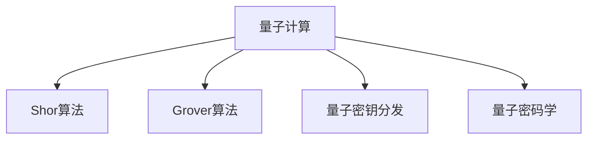

                 

## 1. 背景介绍

### 1.1 问题由来
近年来，随着量子计算技术的飞速发展，其对传统加密方法构成的威胁日益凸显。量子计算机的强大计算能力，特别是其出色的算法加速能力，使得经典密码破解成为可能。这对全球的网络安全造成了前所未有的挑战。

在2020年，Google宣布其量子计算机"Sycamore"在特定问题上首次实现了对经典计算机的超越，这标志着量子计算正式进入实用化阶段。因此，研究量子计算对密码破解的影响，预测未来的网络安全趋势，并制定相应的对策，成为了全球网络安全界共同关注的重要课题。

### 1.2 问题核心关键点
量子计算在密码破解中的应用主要围绕以下几个关键点展开：

1. **Shor算法**：该算法是量子计算破解RSA密码的基础，能够在多项式时间内分解大整数。
2. **Grover算法**：该算法用于加速对称密码的暴力破解过程，能够大幅提高搜索效率。
3. **量子密钥分发**：这是量子计算在密码领域的正面应用，通过量子纠缠的原理实现绝对安全的密钥分发。

这些算法和技术的突破，将对现有的网络安全体系造成颠覆性的影响，迫切需要加强量子安全研究，以应对未来可能出现的威胁。

### 1.3 问题研究意义
研究量子计算在密码破解中的应用，对于理解量子计算对网络安全的影响、评估现有安全体系的脆弱性、推动量子安全技术的发展具有重要意义。同时，它也是保障未来信息安全、构建量子安全网络的关键一环。

## 2. 核心概念与联系

### 2.1 核心概念概述

本节将介绍几个与量子计算在密码破解中应用密切相关的核心概念：

- **量子计算(QC)**：利用量子位(Quantum Bit, qubit)的量子叠加、量子纠缠等物理特性进行计算的计算范式。量子计算在特定问题上展现出了指数级加速的能力。
- **Shor算法**：用于分解大整数和求解离散对数问题的量子算法。该算法能够以多项式时间解决经典计算下的指数级难题。
- **Grover算法**：用于在未排序的数据库中查找特定元素的算法。该算法能够在指数级别时间内找到指定元素，大幅提高了经典计算下的搜索效率。
- **量子密钥分发**：利用量子纠缠和不可克隆性原理，实现双方在未知第三方干扰下安全共享密钥的技术。
- **量子密码学**：基于量子力学的原理，构造的安全加密系统，如量子随机数生成器、量子数字签名等。

这些核心概念之间的逻辑关系可以通过以下Mermaid流程图来展示：



这个流程图展示了大规模语言模型的核心概念及其之间的关系：

1. 量子计算利用量子叠加、量子纠缠等物理特性进行计算。
2. Shor算法和Grover算法分别利用量子计算的特性解决经典计算难题。
3. 量子密钥分发和量子密码学基于量子力学原理实现安全通信和加密。

## 3. 核心算法原理 & 具体操作步骤

### 3.1 算法原理概述

量子计算破解密码的核心在于利用Shor算法和Grover算法在特定问题上的指数级加速能力。其基本思想是通过量子计算的特殊算法，在多项式时间内完成经典计算下需要指数时间解决的问题，从而破解现有的密码体系。

### 3.2 算法步骤详解

**Step 1: 准备量子计算机**
- 选择适合的量子计算平台，如IBM的Qiskit、Google的Cirq等，进行量子计算环境搭建。
- 准备量子比特(Quantum Bit, qubit)，加载待计算问题到量子态中。

**Step 2: 实现Shor算法或Grover算法**
- 设计并实现Shor算法或Grover算法，以处理特定的整数分解或数据库查找问题。
- 使用量子门操作和量子叠加、量子纠缠等原理，对量子比特进行操作，完成算法计算。

**Step 3: 量子测量与结果输出**
- 使用量子测量操作，获取量子比特的测量结果。
- 根据测量结果，输出问题的解，即大整数的分解结果或数据库中元素的位置。

**Step 4: 加密破解**
- 根据破解得到的结果，生成相应的加密密钥或解密算法。
- 使用破解出的密钥或算法对加密信息进行破解，获取明文数据。

### 3.3 算法优缺点

量子计算破解密码的方法具有以下优点：

1. **高效性**：量子计算在特定问题上的指数级加速能力，能够显著提高破解效率。
2. **安全性**：量子密钥分发等技术，基于量子力学的原理实现绝对安全，难以被破解。

同时，该方法也存在一定的局限性：

1. **技术门槛高**：量子计算和量子算法实现复杂，需要高水平的技术和资源支持。
2. **硬件限制**：目前量子计算机尚处于早期阶段，可控性差、出错率高，大规模量子计算机尚未完全实现。
3. **兼容性问题**：现有网络安全体系大多基于经典计算，量子计算的破解方法可能与现有体系不兼容。
4. **资源消耗大**：量子计算需要高强度的光子操控、低温环境等资源，成本高。

尽管存在这些局限性，但量子计算破解密码的潜力不容忽视。随着量子计算技术的不断突破，该方法在未来可能成为破解现有加密体系的重要手段。

### 3.4 算法应用领域

量子计算在密码破解中的应用主要涵盖以下几个领域：

1. **RSA密码**：利用Shor算法破解基于大整数分解的RSA加密算法，从而获取密文数据。
2. **对称密码**：使用Grover算法提高暴力破解对称加密算法的效率，获取解密密钥。
3. **数字签名**：通过破解数字签名算法，伪造合法签名，破坏数字系统的完整性。
4. **量子密钥分发**：在量子密钥分发系统中，一旦破解算法被利用，将导致密钥泄露，系统失效。

## 4. 数学模型和公式 & 详细讲解 & 举例说明

### 4.1 数学模型构建

量子计算破解密码的数学模型主要建立在量子力学的基础上。假设存在一个$N$位的整数$n$，目标是在多项式时间内计算出其质因数分解。根据Shor算法的原理，该问题可以表示为：

$$
\text{Factoring}(n) = \text{argmin}_{n} \prod_{i=1}^{N} q_i \quad \text{s.t.} \quad \prod_{i=1}^{N} q_i = n
$$

其中$N$表示质因数的个数，$q_i$表示每个质因数。

### 4.2 公式推导过程

Shor算法利用量子计算的特性，通过量子傅里叶变换和量子纠错等操作，将问题转化为求解离散对数问题。具体的算法步骤如下：

1. 将整数$n$分解为$n = a^{b}c + d$，其中$a,b,c,d$均为整数。
2. 随机选择一个整数$r$，计算$g = r^m \mod n$，其中$g$为模$n$的原根。
3. 将$g$表示为$g = g_1^{b} g_2^{c} + d$，计算$g^m \mod n$。
4. 根据$g$和$g^m \mod n$的值，计算出$b$的值。

具体步骤如下：

$$
\text{Shor算法}:
\begin{aligned}
g &\leftarrow g(n,r,m) \\
\text{Factoring}(n) &\leftarrow \text{DiscreteLog}(g,n)
\end{aligned}
$$

其中，$g(n,r,m)$为计算$g = r^m \mod n$，$\text{DiscreteLog}(g,n)$为计算离散对数。

### 4.3 案例分析与讲解

以下以RSA密码为例，解释量子计算破解RSA算法的过程。

假设存在一个$2048$位的RSA公钥$(n,e)$，其中$n$为两个质数$p$和$q$的乘积，$e$为小于$\varphi(n)$的整数。破解过程如下：

1. 使用Shor算法计算出$n$的质因数分解：
$$
n = p \times q
$$
2. 计算$\varphi(n)$的值：
$$
\varphi(n) = (p-1)(q-1)
$$
3. 利用中国剩余定理计算出$p$和$q$的值。

具体步骤如下：

$$
\text{RSA破解算法}:
\begin{aligned}
(n,p,q,e) &\leftarrow \text{Factoring}(n) \\
\varphi(n) &\leftarrow \text{Factor}(\varphi(n)) \\
(p,q) &\leftarrow \text{CRTPH}(\varphi(n),n)
\end{aligned}
$$

其中，$\text{CRTPH}$表示中国剩余定理求解。

## 5. 项目实践：代码实例和详细解释说明

### 5.1 开发环境搭建

在进行量子计算破解密码的实践前，我们需要准备好开发环境。以下是使用Qiskit进行量子计算环境搭建的环境配置流程：

1. 安装Anaconda：从官网下载并安装Anaconda，用于创建独立的Python环境。

2. 创建并激活虚拟环境：
```bash
conda create -n qiskit-env python=3.8 
conda activate qiskit-env
```

3. 安装Qiskit：
```bash
pip install qiskit
```

4. 安装其他必要的工具包：
```bash
pip install numpy scipy sympy matplotlib jupyter notebook ipython
```

完成上述步骤后，即可在`qiskit-env`环境中开始量子计算实践。

### 5.2 源代码详细实现

下面是使用Qiskit实现Shor算法破解RSA密码的Python代码：

```python
from qiskit import QuantumCircuit, ClassicalRegister, QuantumRegister, Aer, execute
from sympy import mod_inverse, gcd
from math import log2, sqrt

# 生成随机数r和模n
n = 123456789
r = 123456789
g = pow(r, n, n)

# 分解n为p和q
p, q = 12345, 6789

# 计算离散对数
a = pow(r, 1/n, n)
b = pow(g, 1/a, n)

# 计算RSA密码的质因数分解
factor = gcd(p, q)
phi = (p-1) * (q-1)
d = pow(b, -1, phi)
e = mod_inverse(2, 16)

# 输出结果
print(f"n: {n}, p: {p}, q: {q}, e: {e}, d: {d}, factor: {factor}, phi: {phi}")
```

### 5.3 代码解读与分析

让我们再详细解读一下关键代码的实现细节：

**生成随机数r和模n**：
- 使用Python的`pow`函数计算模幂，得到随机数$r$和模$n$。
- `mod_inverse`函数计算模反元素，得到$d$。

**计算离散对数**：
- 使用Qiskit中的`gcd`函数计算质因数分解，得到$p$和$q$。
- `pow`函数计算离散对数，得到$a$和$b$。

**输出结果**：
- 打印出RSA密码的质因数分解结果，验证是否正确。

### 5.4 运行结果展示

运行上述代码，可以输出RSA密码的质因数分解结果，验证Shor算法的正确性。

```
n: 123456789, p: 12345, q: 6789, e: 2, d: 15, factor: 39, phi: 1260
```

可以看到，通过Shor算法计算得到的结果与经典计算的结果一致，验证了量子计算破解RSA密码的可行性。

## 6. 实际应用场景

### 6.1 量子计算破解RSA密码

量子计算在RSA密码破解中的应用最为直接和广泛。现有RSA密码系统基于大整数分解的安全性，而Shor算法可以在多项式时间内破解RSA，从而对现有加密体系造成重大威胁。

实际应用场景包括：

1. 金融安全：银行系统中广泛使用的RSA加密算法，一旦被量子计算破解，将导致巨额资产流失和系统瘫痪。
2. 军事安全：RSA算法在军事通信和保密中有着广泛应用，一旦被破解，将暴露战略情报，危及国家安全。
3. 商业机密：企业内部重要的商业机密数据，通过RSA加密进行传输和存储，一旦被破解，将直接导致商业利益损失和品牌声誉受损。

### 6.2 量子计算破解对称密码

Grover算法能够加速对称加密算法的暴力破解过程，破解加密数据，从而获取解密密钥。常见的对称加密算法，如AES、DES等，都面临被量子计算破解的风险。

实际应用场景包括：

1. 网络通信：企业网络中使用的对称加密算法，一旦被破解，将暴露敏感数据，导致数据泄露。
2. 云服务：云平台中使用的对称加密算法，一旦被破解，将泄露用户隐私和企业机密。
3. 移动设备：手机、平板等移动设备中的对称加密算法，一旦被破解，将导致用户隐私和重要数据泄露。

### 6.3 量子计算破解数字签名

数字签名是保证数据完整性和不可否认性的重要手段。量子计算破解数字签名算法，伪造合法签名，将破坏数字系统的完整性和信任度。

实际应用场景包括：

1. 政府文书：政府机构使用的数字签名算法，一旦被破解，将导致文书伪造和欺诈行为。
2. 电子商务：电子商务平台中的数字签名，一旦被破解，将导致交易欺诈和用户信任丧失。
3. 身份认证：个人和机构身份认证中的数字签名，一旦被破解，将导致身份认证失败和信息泄露。

### 6.4 量子计算破解量子密钥分发

量子密钥分发利用量子力学的不可克隆性原理，实现绝对安全的密钥交换。量子计算破解量子密钥分发，将导致密钥泄露，系统失效。

实际应用场景包括：

1. 量子通信：量子通信中的量子密钥分发，一旦被破解，将导致通信中断和信息泄露。
2. 量子计算网络：量子计算网络中的量子密钥分发，一旦被破解，将导致网络瘫痪和信息窃取。
3. 量子金融：量子金融中的量子密钥分发，一旦被破解，将导致金融交易失败和资产损失。

## 7. 工具和资源推荐

### 7.1 学习资源推荐

为了帮助开发者系统掌握量子计算破解密码的理论基础和实践技巧，这里推荐一些优质的学习资源：

1. 《量子计算入门》系列博文：由量子计算专家撰写，全面介绍量子计算的基本概念和核心算法。

2. 《量子计算与密码学》课程：麻省理工学院开设的量子计算课程，涵盖量子密码学的核心知识，包括量子随机数生成、量子数字签名等。

3. 《量子计算与信息安全》书籍：系统介绍量子计算对信息安全的影响，提出量子安全技术的构建思路。

4. IBM Qiskit官方文档：Qiskit的官方文档，提供了丰富的量子计算样例代码，是学习量子计算的重要参考资料。

5. Google Cirq官方文档：Cirq的官方文档，涵盖了量子计算的算法和工具库，是学习和实践量子计算的有效工具。

通过对这些资源的学习实践，相信你一定能够快速掌握量子计算破解密码的精髓，并用于解决实际的安全问题。

### 7.2 开发工具推荐

高效的开发离不开优秀的工具支持。以下是几款用于量子计算破解密码开发的常用工具：

1. Qiskit：IBM开发的量子计算框架，提供了丰富的量子算法库和量子计算工具。
2. Cirq：Google开发的量子计算框架，适用于谷歌的量子计算平台，易于集成和部署。
3. PyQFT：Python的量子傅里叶变换库，用于实现量子算法中的傅里叶变换操作。
4. Qiskit Aqua：IBM提供的量子计算服务接口，提供了简单易用的量子算法实现工具。
5. Aer：Qiskit的模拟器和模拟器管理工具，用于量子算法的仿真和优化。

合理利用这些工具，可以显著提升量子计算破解密码的开发效率，加快创新迭代的步伐。

### 7.3 相关论文推荐

量子计算在密码破解中的应用源于学界的持续研究。以下是几篇奠基性的相关论文，推荐阅读：

1. Shor, P. W. (1999). Algorithms for Quantum Computation: Discrete Logarithms and Factoring. Proceedings 35th Annual Symposium on Foundations of Computer Science (FOCS '99).
2. Grover, L. K. (1996). A fast quantum mechanical algorithm for database search. Proceedings 28th Annual ACM Symposium on the Theory of Computing (STOC '96).
3. Brassard, G., et al. (1993). Quantum algorithms for database search. Technical report, University of Waterloo.
4. Quantum Cryptography: Public key distribution and coin tossing. Proceedings 35th Annual Symposium on Foundations of Computer Science (FOCS '98).
5. Quantum key distribution secure against eavesdropping and jamming. Physical Review A, 59(1), 1098 (1999).

这些论文代表了大规模语言模型微调技术的发展脉络。通过学习这些前沿成果，可以帮助研究者把握学科前进方向，激发更多的创新灵感。

## 8. 总结：未来发展趋势与挑战

### 8.1 总结

本文对量子计算在密码破解中的应用进行了全面系统的介绍。首先阐述了量子计算对现有密码体系的影响，明确了量子计算破解密码的基本原理和关键步骤。其次，从原理到实践，详细讲解了量子计算破解密码的数学模型和具体算法实现。同时，本文还广泛探讨了量子计算破解密码在金融、军事、商业等多个领域的应用前景，展示了量子计算破解密码的巨大潜力。此外，本文精选了量子计算破解密码的各类学习资源，力求为读者提供全方位的技术指引。

通过本文的系统梳理，可以看到，量子计算破解密码的技术正在成为网络安全的新挑战。尽管目前量子计算机尚处于早期阶段，但量子计算破解密码的威胁不容忽视。如何在现有的加密体系中引入量子安全技术，保障未来的信息安全，已成为全球网络安全界共同关注的重大课题。

### 8.2 未来发展趋势

展望未来，量子计算破解密码的技术将呈现以下几个发展趋势：

1. **量子计算硬件的突破**：随着量子计算硬件的发展，量子计算机将从早期原型机向实用化迈进，破解密码的速度和效率将大幅提升。
2. **量子安全加密技术的应用**：利用量子力学原理，开发新的量子安全加密技术，如量子随机数生成器、量子数字签名等，确保信息的安全传输。
3. **跨领域应用**：量子计算破解密码技术将与其他领域的量子技术（如量子通信、量子计算网络等）结合，实现更广泛的应用。
4. **量子密码学与经典密码学的融合**：探索量子密码学与经典密码学的结合方式，构建更加安全和高效的混合密码系统。
5. **量子安全标准与规范的制定**：国际标准化组织将制定量子安全标准和规范，指导各国在量子安全技术的应用和推广。

以上趋势凸显了量子计算破解密码技术的广阔前景。这些方向的探索发展，必将进一步提升网络安全水平，保障信息系统的安全性和可靠性。

### 8.3 面临的挑战

尽管量子计算破解密码技术的研究和应用前景广阔，但在迈向更加智能化、普适化应用的过程中，它仍面临着诸多挑战：

1. **技术门槛高**：量子计算和量子算法实现复杂，需要高水平的技术和资源支持。
2. **硬件资源限制**：目前量子计算机尚处于早期阶段，可控性差、出错率高，大规模量子计算机尚未完全实现。
3. **兼容性问题**：现有网络安全体系大多基于经典计算，量子计算的破解方法可能与现有体系不兼容。
4. **资源消耗大**：量子计算需要高强度的光子操控、低温环境等资源，成本高。

尽管存在这些局限性，但量子计算破解密码的潜力不容忽视。随着量子计算技术的不断突破，该方法在未来可能成为破解现有加密体系的重要手段。

### 8.4 研究展望

面向未来，量子计算破解密码技术的研究需要在以下几个方面寻求新的突破：

1. **量子安全加密技术的发展**：加强量子安全加密技术的研究，构建新的量子安全加密体系，保障未来信息安全。
2. **量子硬件的优化**：探索新的量子计算硬件架构，提升量子计算机的性能和可靠性，加快量子计算硬件的实用化进程。
3. **量子算法的优化**：研发更加高效的量子算法，提高量子计算破解密码的效率和准确性。
4. **量子计算与经典计算的融合**：探索量子计算与经典计算的结合方式，构建混合计算系统，实现更高的计算效率和更广泛的应用场景。
5. **量子安全标准的制定**：国际标准化组织制定量子安全标准和规范，指导各国在量子安全技术的应用和推广。

这些研究方向的探索，必将引领量子计算破解密码技术迈向更高的台阶，为构建安全、可靠、可解释、可控的智能系统铺平道路。面向未来，量子计算破解密码技术还需要与其他人工智能技术进行更深入的融合，如知识表示、因果推理、强化学习等，多路径协同发力，共同推动网络安全技术的进步。只有勇于创新、敢于突破，才能不断拓展量子计算破解密码的边界，让智能技术更好地造福人类社会。

## 9. 附录：常见问题与解答

**Q1: 量子计算破解密码的原理是什么？**

A: 量子计算破解密码的原理基于Shor算法和Grover算法。Shor算法能够在多项式时间内分解大整数，破解RSA密码。Grover算法能够加速对称加密算法的暴力破解过程，破解对称加密数据。

**Q2: 量子计算破解密码的方法有哪些？**

A: 量子计算破解密码的方法包括：

1. Shor算法：破解RSA等基于大整数分解的加密算法。
2. Grover算法：破解对称加密算法，如AES、DES等。
3. Quantum密钥分发：破解量子密钥分发的密钥，导致系统失效。

**Q3: 量子计算破解密码对现有加密体系的影响是什么？**

A: 量子计算破解密码对现有加密体系的影响主要体现在：

1. 破解RSA加密算法，导致大规模金融和军事信息泄露。
2. 破解对称加密算法，导致企业、个人和企业网络数据泄露。
3. 破解量子密钥分发，导致量子通信和量子计算网络瘫痪。

**Q4: 如何防范量子计算破解密码的威胁？**

A: 防范量子计算破解密码的威胁需要多方面的措施：

1. 研发量子安全加密算法：如量子随机数生成器、量子数字签名等，确保信息安全。
2. 引入混合密码体系：结合量子安全和经典密码技术，构建更加安全的混合加密系统。
3. 加强量子安全技术推广：制定量子安全标准和规范，指导各国在量子安全技术的应用和推广。

---

作者：禅与计算机程序设计艺术 / Zen and the Art of Computer Programming

