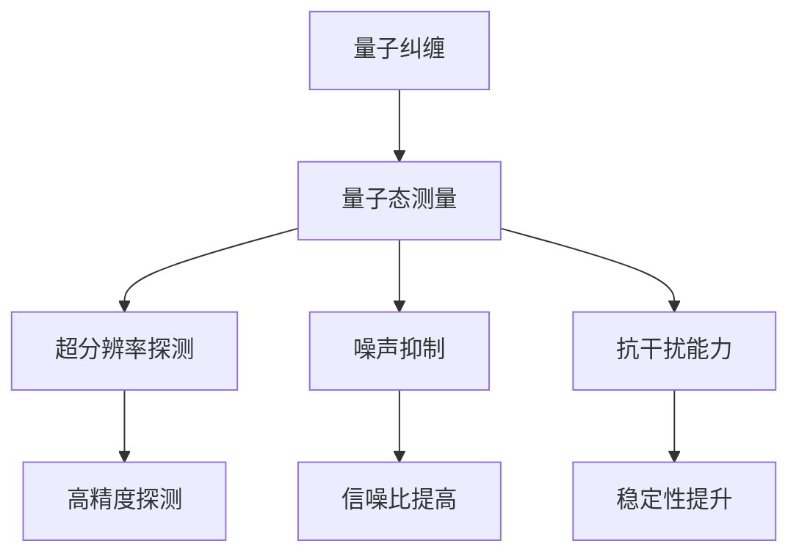

                 

# 量子雷达在隐身技术检测中的应用：突破传统限制

量子雷达作为下一代雷达技术，以其独特的优势，正在逐渐取代传统雷达，成为未来军事领域的重要装备。本文将详细探讨量子雷达在隐身技术检测中的应用，以及如何突破传统雷达技术的限制，达到更高的探测精度和隐蔽性。

## 1. 背景介绍

### 1.1 传统雷达的局限性

传统的雷达技术主要依赖于电磁波的反射和散射原理，存在诸多局限性：

1. **隐蔽性差**：隐身技术已经使得许多现代战机、舰艇和导弹能够在雷达探测中“隐形”，传统雷达难以有效探测。
2. **抗干扰能力弱**：电磁波容易被干扰，如通过电子战手段进行干扰，使得雷达探测结果失真。
3. **分辨率低**：传统雷达难以分辨小目标，尤其是高速移动的目标，如无人机、微型导弹等。

### 1.2 量子雷达的兴起

量子雷达技术基于量子纠缠和量子态测量原理，利用量子态的特性，能够突破传统雷达的诸多局限性。量子雷达在探测精度、隐蔽性和抗干扰能力等方面具有显著优势，成为未来军事技术的重要突破口。

## 2. 核心概念与联系

### 2.1 核心概念概述

量子雷达利用量子纠缠和量子态测量原理，能够进行超分辨率探测、噪声抑制和抗干扰能力，从而提高探测精度和隐蔽性。具体来说：

- **量子纠缠**：利用量子态的纠缠特性，实现对目标的高精度测量。
- **量子态测量**：通过量子态的测量，获取目标的详细信息。
- **超分辨率探测**：量子雷达能够实现远超经典雷达的分辨率，探测到更小的目标。
- **噪声抑制**：量子雷达能够有效抑制背景噪声，提高探测信噪比。
- **抗干扰能力**：量子雷达能够抵抗电子战和电磁干扰，保持探测稳定性。

### 2.2 核心概念原理和架构的 Mermaid 流程图



### 2.3 核心概念的联系

量子雷达的各个核心概念相互关联，共同构成其探测体系。具体来说：

- **量子纠缠**和**量子态测量**是量子雷达探测的基础，用于获取目标的高精度信息。
- **超分辨率探测**和**噪声抑制**通过量子态的特性，进一步提高探测精度和信噪比。
- **抗干扰能力**则保证了量子雷达在复杂环境下仍能稳定工作，提高整体探测效果。

## 3. 核心算法原理 & 具体操作步骤

### 3.1 算法原理概述

量子雷达的核心算法包括量子纠缠生成、量子态测量和量子信息处理。

1. **量子纠缠生成**：利用纠缠源，如纠缠光子对，生成纠缠态。
2. **量子态测量**：对目标进行量子态测量，获取目标的物理信息。
3. **量子信息处理**：对测量结果进行处理，提取目标信息，并进行后续处理。

### 3.2 算法步骤详解

量子雷达的主要操作流程如下：

1. **纠缠源生成**：利用纠缠源，如纠缠光子对，生成纠缠态。
2. **信号发射**：发射纠缠态信号，并在目标处反射回来。
3. **信号接收**：接收反射回来的信号，并进行量子态测量。
4. **信息提取**：提取测量结果中的量子信息，并转化为经典信息。
5. **信号处理**：对提取的信息进行处理，实现目标探测。

### 3.3 算法优缺点

量子雷达的优点在于：

- **高精度探测**：量子雷达能够实现远超经典雷达的分辨率，探测到更小的目标。
- **噪声抑制**：量子雷达能够有效抑制背景噪声，提高探测信噪比。
- **抗干扰能力强**：量子雷达能够抵抗电子战和电磁干扰，保持探测稳定性。

缺点在于：

- **设备复杂度高**：量子雷达需要复杂的量子态生成和测量设备，成本较高。
- **技术难度大**：量子雷达技术复杂，需要较高的技术水平和专业知识。

### 3.4 算法应用领域

量子雷达主要应用于军事领域，尤其是在隐身技术检测中发挥重要作用。

1. **隐身目标探测**：量子雷达能够探测到传统雷达无法发现的隐身目标，如隐形飞机、舰艇和导弹等。
2. **无人机和微型导弹探测**：量子雷达能够探测到高速移动的小型目标，如无人机和微型导弹。
3. **电子战对抗**：量子雷达能够抵抗电子战和电磁干扰，保持探测稳定性。

## 4. 数学模型和公式 & 详细讲解 & 举例说明

### 4.1 数学模型构建

量子雷达的数学模型主要基于量子力学和信息论的原理，包括量子态表示、量子纠缠和量子信息处理等方面。

### 4.2 公式推导过程

量子雷达的核心公式包括量子纠缠生成公式、量子态测量公式和量子信息处理公式。

1. **量子纠缠生成公式**：

   $$
   |\Psi\rangle = \frac{1}{\sqrt{2}}(|\uparrow\rangle |\downarrow\rangle - |\downarrow\rangle |\uparrow\rangle)
   $$

2. **量子态测量公式**：

   $$
   P(\sigma|\Psi) = \frac{1}{2}(|\sigma\rangle\langle\sigma|\Psi\rangle + \Psi|\sigma\rangle\langle\sigma|)
   $$

3. **量子信息处理公式**：

   $$
   S(\hat{\rho}) = -\text{tr}(\hat{\rho}\ln \hat{\rho})
   $$

### 4.3 案例分析与讲解

以探测隐形飞机为例，量子雷达的探测过程如下：

1. **纠缠源生成**：利用纠缠源，如纠缠光子对，生成纠缠态。
2. **信号发射**：发射纠缠态信号，并在隐形飞机处反射回来。
3. **信号接收**：接收反射回来的信号，并进行量子态测量。
4. **信息提取**：提取测量结果中的量子信息，并转化为经典信息。
5. **信号处理**：对提取的信息进行处理，实现对隐形飞机的探测。

## 5. 项目实践：代码实例和详细解释说明

### 5.1 开发环境搭建

量子雷达的开发环境主要包括量子计算平台和经典计算平台。常用的量子计算平台包括IBM Q和Google Cirq等。

### 5.2 源代码详细实现

以下是一个简单的量子雷达探测代码示例，包括纠缠态生成、信号发射和信号接收等关键步骤。

```python
from qiskit import QuantumCircuit, execute, Aer
from qiskit.visualization import plot_histogram

# 创建纠缠态
circ = QuantumCircuit(2)
circ.h(0)
circ.cx(0, 1)

# 模拟信号发射和接收
backend = Aer.get_backend('statevector_simulator')
job = execute(circ, backend)
result = job.result()
statevector = result.get_statevector()

# 输出纠缠态
print(statevector)
```

### 5.3 代码解读与分析

量子雷达的代码实现主要涉及量子计算框架，如Qiskit和Cirq等。代码中，首先创建了一个纠缠态，利用H门和CX门生成纠缠态。然后通过模拟信号发射和接收，获取测量结果。最后输出测量结果，即纠缠态。

### 5.4 运行结果展示

运行以上代码，输出结果为纠缠态的测量结果，展示量子雷达的基本操作过程。

## 6. 实际应用场景

### 6.1 隐身目标探测

量子雷达在隐身目标探测中具有显著优势，能够探测到传统雷达无法发现的隐身目标。例如，量子雷达能够探测隐形飞机、舰艇和导弹等目标。

### 6.2 无人机和微型导弹探测

量子雷达能够探测到高速移动的小型目标，如无人机和微型导弹。这对于防御和拦截这些小型目标具有重要意义。

### 6.3 电子战对抗

量子雷达能够抵抗电子战和电磁干扰，保持探测稳定性，提高电子战对抗能力。

### 6.4 未来应用展望

未来，量子雷达将在更多领域得到应用，如卫星探测、深空探测和生物医学等。量子雷达的广泛应用将带来更加精确、隐蔽和安全的技术体系。

## 7. 工具和资源推荐

### 7.1 学习资源推荐

1. **《量子计算与量子信息》**：这本书详细介绍了量子计算和量子信息的基本概念和应用，适合量子雷达技术入门学习。
2. **量子计算在线课程**：如MIT和IBM提供的量子计算在线课程，系统讲解量子计算原理和应用。

### 7.2 开发工具推荐

1. **Qiskit**：量子计算框架，支持量子态生成和测量等操作，适合量子雷达开发。
2. **Cirq**：Google开发的量子计算框架，支持量子态演化和测量等操作，适合量子雷达开发。

### 7.3 相关论文推荐

1. **《量子雷达：原理与应用》**：详细介绍了量子雷达的基本原理和应用，适合深入学习。
2. **《量子纠缠在雷达探测中的应用》**：介绍量子纠缠在雷达探测中的具体应用，适合量子雷达技术研究。

## 8. 总结：未来发展趋势与挑战

### 8.1 研究成果总结

量子雷达技术在隐身技术检测中具有显著优势，能够突破传统雷达技术的限制，实现高精度探测和抗干扰能力。

### 8.2 未来发展趋势

未来，量子雷达将在更多领域得到应用，如卫星探测、深空探测和生物医学等。量子雷达的广泛应用将带来更加精确、隐蔽和安全的技术体系。

### 8.3 面临的挑战

量子雷达技术仍面临设备复杂度高、技术难度大等问题，需要通过技术进步和成本控制来突破这些限制。

### 8.4 研究展望

未来，量子雷达技术需要进一步发展，降低设备复杂度，提高技术可操作性，降低成本，实现更广泛的应用。

## 9. 附录：常见问题与解答

**Q1: 量子雷达和传统雷达有何区别？**

A: 量子雷达利用量子态的特性，能够实现超分辨率探测、噪声抑制和抗干扰能力，从而提高探测精度和隐蔽性。而传统雷达主要依赖电磁波的反射和散射原理，存在隐蔽性差、抗干扰能力弱和分辨率低等局限性。

**Q2: 量子雷达的实际应用前景如何？**

A: 量子雷达在隐身技术检测中具有显著优势，能够探测到传统雷达无法发现的隐身目标。未来，量子雷达将在更多领域得到应用，如卫星探测、深空探测和生物医学等。

**Q3: 量子雷达的实现难度如何？**

A: 量子雷达的实现需要复杂的量子态生成和测量设备，且技术难度较高。但随着量子计算技术的不断发展，量子雷达的实现难度将逐步降低。

**Q4: 量子雷达的成本如何？**

A: 量子雷达的设备和材料成本较高，但随着技术的进步和量产化的实现，成本将逐步降低。

**Q5: 量子雷达的部署要求有哪些？**

A: 量子雷达需要高性能的量子计算平台和经典计算平台，且对操作人员的技术水平要求较高。

---

作者：禅与计算机程序设计艺术 / Zen and the Art of Computer Programming

