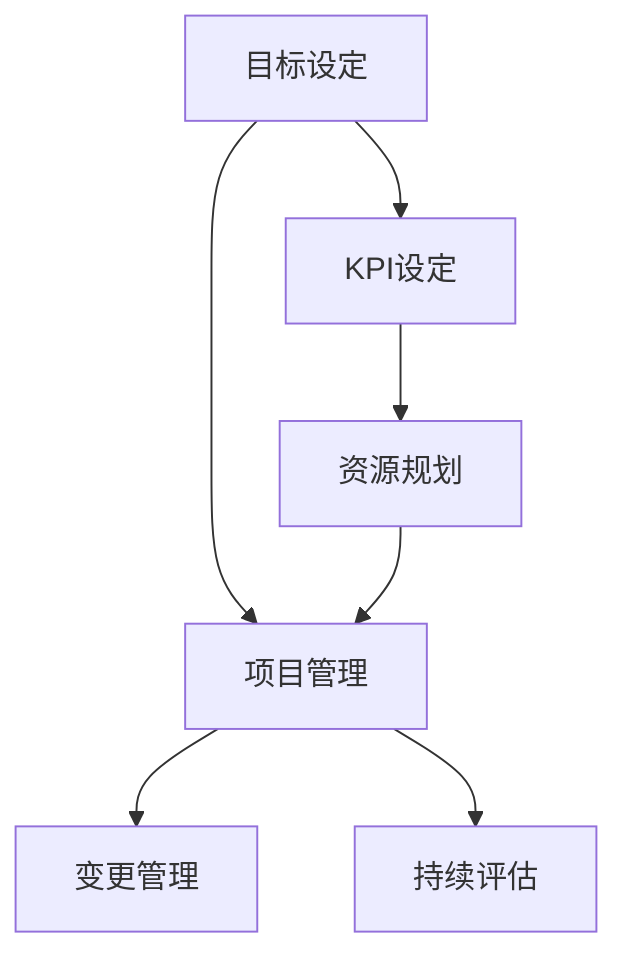

                 

# 长期目标管理的意识机制

在技术发展和企业运营中，目标管理（Goal Management）扮演着至关重要的角色。它不仅是确保项目和团队保持专注和高效执行的基石，也是衡量进展、提升整体表现的关键。然而，随着项目复杂度的提升和企业规模的扩大，有效管理长期目标变得愈发困难。本文将深入探讨长期目标管理的意识机制，旨在提供一套系统化的策略和工具，帮助组织和个人实现长期目标。

## 1. 背景介绍

### 1.1 问题由来

现代技术的发展和复杂性的增加，使得目标管理面临诸多挑战：

- **跨部门协作**：随着企业规模的扩大，项目往往涉及多个部门，不同部门间的沟通和协作难度加大。
- **资源分配**：在资源有限的情况下，如何有效分配和利用资源变得尤为重要。
- **时间跨度**：长期目标涉及的时间跨度长，不确定性高，难以持续追踪和调整。
- **变更管理**：在项目执行过程中，频繁的变更和调整需要灵活的管理机制。

### 1.2 问题核心关键点

长期目标管理的关键点在于：

- **明确目标设定**：确保目标是具体、可衡量、可实现、相关性强和时限性的（SMART原则）。
- **有效沟通**：通过透明的沟通机制，确保所有相关方对目标的共识和理解。
- **灵活调整**：在项目执行过程中，根据实际情况灵活调整目标和策略。
- **持续评估**：定期评估目标进展，确保目标的实现和优化。

## 2. 核心概念与联系

### 2.1 核心概念概述

- **目标设定**：明确项目或团队所要达成的具体、可衡量、可实现、相关性强和时限性的目标。
- **KPI设定**：设定关键绩效指标（Key Performance Indicators, KPIs），用于衡量目标实现情况。
- **资源规划**：合理分配和规划资源，确保资源的高效利用。
- **项目管理**：通过有效的项目管理工具和方法，实现目标的跟踪和控制。
- **变更管理**：在项目执行过程中，根据实际情况灵活调整目标和策略。
- **持续评估**：定期评估目标进展，确保目标的实现和优化。

### 2.2 核心概念原理和架构的 Mermaid 流程图



这个流程图展示了长期目标管理的核心步骤：

1. 首先，明确目标设定（A），确保目标的SMART性。
2. 接着，设定KPI（B），用于衡量目标实现情况。
3. 根据目标设定和KPI，进行资源规划（C），确保资源的高效利用。
4. 采用项目管理工具和方法（D），实现目标的跟踪和控制。
5. 在项目执行过程中，根据实际情况灵活调整目标和策略（E），即变更管理。
6. 定期评估目标进展（F），确保目标的实现和优化。

## 3. 核心算法原理 & 具体操作步骤

### 3.1 算法原理概述

长期目标管理的核心算法基于SMART原则和关键绩效指标（KPI），旨在通过系统的目标设定、资源规划、项目管理、变更管理和持续评估，实现目标的高效管理。

### 3.2 算法步骤详解

#### 3.2.1 目标设定

- **明确目标**：使用SMART原则，明确项目或团队所要达成的具体、可衡量、可实现、相关性强和时限性的目标。
- **分解目标**：将大目标分解为可管理的子目标，确保每个子目标的可行性和独立性。

#### 3.2.2 KPI设定

- **选择关键指标**：根据目标的重要性和影响范围，选择关键绩效指标（KPI）。
- **设定目标值**：为每个KPI设定具体的目标值，用于衡量目标实现情况。

#### 3.2.3 资源规划

- **资源评估**：评估项目所需的所有资源，包括人力、物资、时间等。
- **资源分配**：根据资源评估结果，合理分配和规划资源，确保资源的高效利用。

#### 3.2.4 项目管理

- **工具选择**：选择合适的项目管理工具，如Jira、Trello等。
- **任务分解**：将项目任务分解为具体的可执行任务，明确每个任务的负责人和截止日期。
- **进度跟踪**：利用项目管理工具跟踪任务进度，确保项目按时完成。

#### 3.2.5 变更管理

- **变更审批**：建立变更审批流程，确保变更的必要性和合理性。
- **变更实施**：根据审批结果，实施变更，调整项目计划和资源分配。

#### 3.2.6 持续评估

- **定期评估**：定期评估目标进展和KPI实现情况，确保目标的实现和优化。
- **反馈机制**：建立反馈机制，及时收集项目执行过程中的问题和建议，持续改进管理流程。

### 3.3 算法优缺点

#### 3.3.1 优点

- **系统性**：通过系统的目标设定、资源规划、项目管理、变更管理和持续评估，确保目标管理的全面性和系统性。
- **透明度**：通过透明的沟通机制和项目管理工具，确保所有相关方对目标的共识和理解。
- **灵活性**：在项目执行过程中，能够灵活调整目标和策略，应对变化。

#### 3.3.2 缺点

- **复杂性**：长期目标管理涉及多个环节和步骤，需要综合考虑多个因素，管理复杂度高。
- **资源消耗**：系统的目标管理和项目管理需要消耗大量的资源，包括时间、人力和工具等。

### 3.4 算法应用领域

长期目标管理适用于各种规模和类型的组织和项目，特别是在以下领域：

- **企业项目管理**：确保企业战略目标的实现，提升整体运营效率。
- **软件开发**：管理软件项目的开发流程，确保按时交付和高质量交付。
- **市场推广**：制定市场推广策略，衡量和评估市场推广效果。
- **组织变革**：管理组织变革过程，确保变革目标的实现和组织文化的转型。

## 4. 数学模型和公式 & 详细讲解 & 举例说明

### 4.1 数学模型构建

长期目标管理的数学模型包括目标设定、资源规划和项目管理等部分。

- **目标设定**：使用SMART原则，设定目标值 $T_i$ 和权重 $w_i$，其中 $i$ 为任务编号。
- **资源规划**：评估所需资源 $R_j$ 和分配比例 $p_j$，其中 $j$ 为资源编号。
- **项目管理**：任务进度 $P_k$，任务完成时间 $E_k$。

### 4.2 公式推导过程

根据上述模型，可以构建以下公式：

$$
\begin{aligned}
\text{目标总值} &= \sum_{i} T_i w_i \\
\text{资源需求} &= \sum_{j} R_j p_j \\
\text{任务进度} &= \sum_{k} P_k \\
\text{项目完成时间} &= \max(\text{任务完成时间}) \\
\text{项目总成本} &= \text{资源需求} \times \text{资源单价}
\end{aligned}
$$

### 4.3 案例分析与讲解

假设某企业需要实施一项市场推广项目，设定以下目标：

- 目标：增加销售额20%，增加用户数量30%。
- KPI：销售额增长率、用户数量增长率、市场覆盖率。
- 资源：市场推广预算、销售团队、技术支持团队。
- 项目管理：分解任务、进度跟踪、变更审批。

通过上述模型和公式，可以计算出所需资源、任务进度和项目完成时间，从而实现项目的高效管理。

## 5. 项目实践：代码实例和详细解释说明

### 5.1 开发环境搭建

在开始项目实践前，需要准备好开发环境：

- **安装项目管理工具**：选择如Jira、Trello等项目管理工具，安装和配置环境。
- **配置资源管理工具**：如Ping、Slack等，用于资源规划和沟通。
- **准备数据和模型**：收集项目相关数据，如资源需求、任务进度等，建立模型和算法。

### 5.2 源代码详细实现

以下是一个基于Jira的项目管理代码实现示例：

```python
# 引入Jira API
from jira import JIRA
from jira.issues import Issue

# 连接Jira实例
jira = JIRA(options={'server': 'http://example.com'}, basic_auth=('user', 'password'))

# 获取所有任务
tasks = jira.search_issues(jql='project=KEY')
for task in tasks:
    print(task.key, task.status, task.priority)
```

通过上述代码，可以连接到Jira实例，获取所有任务，并输出任务ID、状态和优先级。

### 5.3 代码解读与分析

Jira API提供了丰富的功能，可以用于项目管理和任务跟踪。上述代码示例展示了如何通过Jira API获取任务信息，并输出任务状态和优先级。

## 6. 实际应用场景

### 6.1 企业项目管理

在企业项目管理中，长期目标管理的应用场景包括：

- **战略目标管理**：通过SMART原则设定企业长期战略目标，确保目标的实现和优化。
- **项目进度跟踪**：利用项目管理工具，实时跟踪项目进度，确保项目按时完成。
- **资源优化**：根据项目需求，合理分配和规划资源，提高资源利用率。

### 6.2 软件开发

在软件开发中，长期目标管理的应用场景包括：

- **项目里程碑设定**：设定项目的重要里程碑，确保项目按时交付。
- **任务分解和进度跟踪**：将项目任务分解为具体的可执行任务，实时跟踪任务进度。
- **变更管理**：在项目执行过程中，根据实际情况灵活调整任务和资源分配。

### 6.3 市场推广

在市场推广中，长期目标管理的应用场景包括：

- **推广策略制定**：设定市场推广目标，如销售额增长率、用户数量增长率等。
- **推广效果评估**：通过KPI评估市场推广效果，优化推广策略。
- **资源分配**：合理分配市场推广预算和团队资源，确保推广效果。

## 7. 工具和资源推荐

### 7.1 学习资源推荐

为了帮助开发者系统掌握长期目标管理的理论基础和实践技巧，推荐以下学习资源：

- **《项目管理知识体系指南》**：项目管理领域的经典书籍，涵盖项目管理的各个环节。
- **《敏捷项目管理》**：介绍敏捷项目管理方法和工具的书籍，适用于快速变化的项目环境。
- **《软件项目管理：计划与实践》**：详细介绍软件项目管理的方法和实践，涵盖目标设定、资源规划和变更管理等。
- **Coursera和Udemy**：提供系统的项目管理课程，包括敏捷项目管理、Scrum等方法。

### 7.2 开发工具推荐

以下是几款用于长期目标管理的常用工具：

- **Jira**：广泛使用的项目管理工具，支持任务跟踪、进度管理和变更审批等。
- **Trello**：简单易用的项目管理工具，适用于小团队和快速变化的项目环境。
- **Asana**：功能全面的项目管理工具，支持任务分配、进度跟踪和资源管理等。
- **Microsoft Project**：企业级项目管理工具，支持资源规划和进度跟踪。

### 7.3 相关论文推荐

长期目标管理的研究涉及多个领域，以下是几篇奠基性的相关论文，推荐阅读：

- **《项目管理最佳实践》**：介绍项目管理理论和方法的经典论文，涵盖目标设定、资源规划和变更管理等。
- **《敏捷项目管理：方法和实践》**：详细介绍敏捷项目管理的方法和工具，适用于快速变化的项目环境。
- **《项目管理和执行：有效整合资源》**：详细介绍项目管理和执行的策略和方法，涵盖目标设定、资源规划和变更管理等。

## 8. 总结：未来发展趋势与挑战

### 8.1 总结

本文对长期目标管理的意识机制进行了全面系统的介绍。首先阐述了目标管理的重要性，明确了目标管理的核心关键点。其次，从原理到实践，详细讲解了长期目标管理的各个环节，包括目标设定、KPI设定、资源规划、项目管理、变更管理和持续评估。同时，本文还探讨了长期目标管理的实际应用场景，并推荐了相关学习资源和工具。

通过本文的系统梳理，可以看到，长期目标管理在项目管理、软件开发、市场推广等多个领域的应用潜力，帮助组织和个人实现高效的目标管理。未来，伴随项目管理方法和工具的不断演进，长期目标管理必将进入更加智能化的阶段，助力企业和组织实现更好的绩效。

### 8.2 未来发展趋势

展望未来，长期目标管理的发展趋势包括：

- **智能化和自动化**：利用人工智能和大数据技术，实现目标管理的智能化和自动化，提升管理效率。
- **跨部门协同**：通过数字化平台和工具，促进跨部门协同，提高项目执行效率。
- **动态调整**：在项目执行过程中，通过实时数据分析和反馈机制，动态调整目标和策略。
- **数据驱动**：利用数据分析和可视化工具，提供更加全面的项目管理支持。

### 8.3 面临的挑战

长期目标管理在实施过程中，仍面临以下挑战：

- **资源配置**：在资源有限的情况下，如何合理分配和规划资源，确保资源的高效利用。
- **变更管理**：在项目执行过程中，如何灵活调整目标和策略，应对变化。
- **数据管理**：如何收集、管理和利用数据，提升项目管理决策的科学性。
- **团队协作**：如何促进跨部门协同，提高项目执行效率。

### 8.4 研究展望

未来的研究需要在以下几个方面寻求新的突破：

- **智能化优化**：利用人工智能和大数据技术，实现目标管理的智能化和自动化，提升管理效率。
- **动态调整机制**：在项目执行过程中，通过实时数据分析和反馈机制，动态调整目标和策略。
- **数据驱动决策**：利用数据分析和可视化工具，提供更加全面的项目管理支持。
- **跨部门协同工具**：开发和推广跨部门协同工具，促进跨部门协同，提高项目执行效率。

这些研究方向的探索，必将引领长期目标管理技术迈向更高的台阶，为项目管理和组织运营带来新的变革。面向未来，长期目标管理需要与大数据、人工智能等前沿技术深度融合，多路径协同发力，共同推动项目管理的进步。

## 9. 附录：常见问题与解答

**Q1：长期目标管理是否适用于所有项目？**

A: 长期目标管理适用于大多数项目，特别是涉及多个部门、资源消耗大、时间跨度长的项目。但针对一些短期、小规模的项目，可能过于复杂，需要根据实际情况选择适合的策略和方法。

**Q2：如何确保目标管理的透明度和共识？**

A: 通过透明的沟通机制和项目管理工具，确保所有相关方对目标的共识和理解。定期召开会议，汇报项目进展和问题，收集反馈，及时调整目标和策略。

**Q3：如何处理项目执行中的变更？**

A: 建立变更审批流程，确保变更的必要性和合理性。根据审批结果，实施变更，调整项目计划和资源分配。同时，通过项目管理工具实时跟踪变更，确保变更的顺利实施。

**Q4：如何评估目标管理的成效？**

A: 定期评估目标进展和KPI实现情况，确保目标的实现和优化。利用数据分析和可视化工具，提供全面的项目管理支持。同时，建立反馈机制，及时收集项目执行过程中的问题和建议，持续改进管理流程。

---

作者：禅与计算机程序设计艺术 / Zen and the Art of Computer Programming

