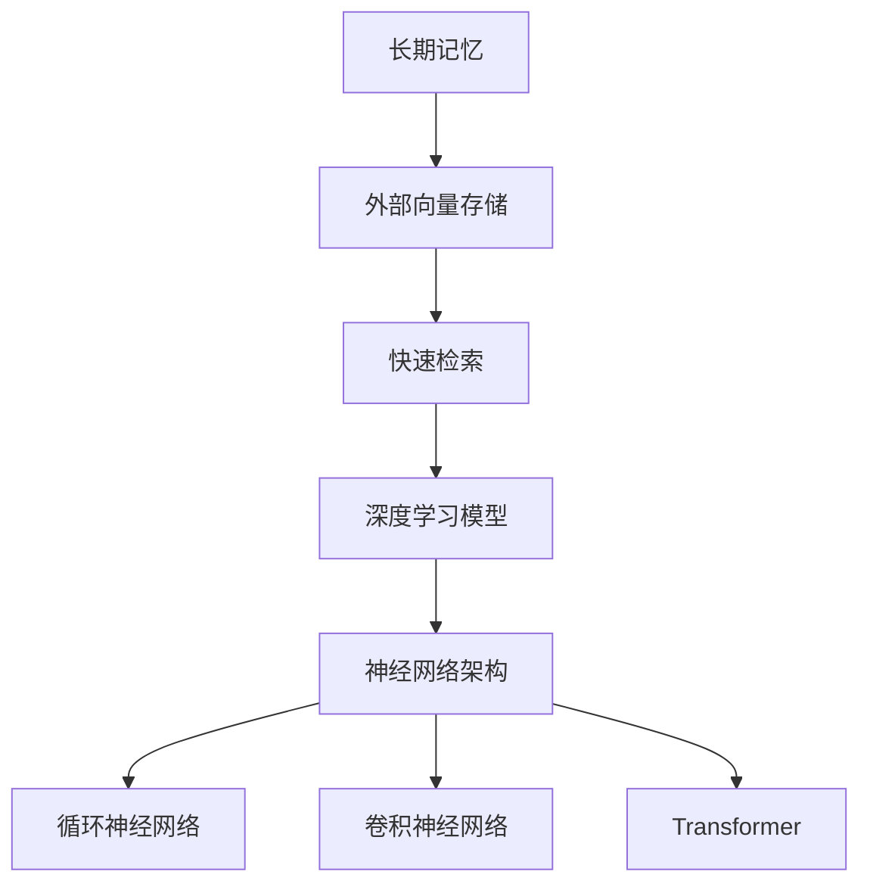

                 

# 长期记忆：外部向量存储与快速检索

> 关键词：长期记忆, 外部向量存储, 快速检索, 高效算法, 应用场景

## 1. 背景介绍

### 1.1 问题由来

在人工智能和计算机科学领域，长期记忆是一个核心话题。从早期的神经网络到现代的深度学习框架，长期记忆的实现都是技术突破的重要标志。当前，深度学习技术已经广泛应用于图像识别、自然语言处理、智能推荐系统等诸多领域，并且成为了驱动AI系统向前发展的主要驱动力之一。

然而，深度学习的长期记忆能力仍然存在一些限制。例如，传统的深度神经网络模型中，数据的长期依赖关系可以通过逐层传递的神经网络结构和长序列操作（如循环神经网络、卷积神经网络）来捕捉，但这些模型通常需要大量的训练数据和计算资源。此外，在大规模数据和复杂模型中，长期记忆的实现也面临着数据存储和检索的挑战。这些问题导致深度学习在实际应用中遇到了一些瓶颈。

为了解决这些问题，近年来研究人员提出了许多基于外部存储的长期记忆实现方法，以提高数据处理效率，降低存储成本，并增强模型的长期依赖关系。这些方法大多基于向量空间模型和外部存储器的优势，充分利用了现代计算机硬件的特性，如高速硬盘、固态硬盘等，实现了快速的数据存储和检索。

### 1.2 问题核心关键点

为了深入理解外部向量存储与快速检索技术，本节将详细介绍几个关键概念：

- 长期记忆（Long-Term Memory）：在深度学习模型中，长期记忆指模型能够存储和回忆较长时间跨度的信息，这对于理解复杂问题和关联性很强的数据至关重要。
- 外部向量存储（External Vector Storage）：将向量数据存储在外部存储器中，通过高效算法快速检索和更新，从而提高数据处理的效率。
- 快速检索（Fast Retrieval）：通过高效的算法实现从外部存储器中快速检索向量数据，以支持大规模数据集的处理和分析。
- 深度学习模型：基于神经网络的模型，能够自动学习并提取特征，实现复杂的任务。
- 神经网络架构：如循环神经网络、卷积神经网络、Transformer等，这些架构具有长序列操作的特性，适合实现长期记忆。

这些核心概念之间存在紧密的联系，共同构成了外部向量存储与快速检索技术的理论基础。通过理解这些概念，可以更好地把握长期记忆在大规模数据集和复杂深度学习模型中的应用，探索提高数据处理效率的新方法。

## 2. 核心概念与联系

### 2.1 核心概念概述

为了更好地理解外部向量存储与快速检索技术的核心概念和实现方法，本节将详细阐述这些概念的原理和架构：

- **长期记忆**：在深度学习模型中，长期记忆是指模型能够存储和回忆长时间跨度的信息。这种能力对于理解复杂问题和关联性很强的数据至关重要。例如，在自然语言处理任务中，长期记忆可以帮助模型捕捉句子中的上下文关系，从而更好地理解句意。
- **外部向量存储**：将向量数据存储在外部存储器中，通过高效的算法快速检索和更新，从而提高数据处理的效率。这种存储方式可以利用现代计算机硬件的特性，如高速硬盘、固态硬盘等，实现快速的数据存储和检索。
- **快速检索**：通过高效的算法实现从外部存储器中快速检索向量数据，以支持大规模数据集的处理和分析。常用的快速检索算法包括倒排索引、哈希索引等。
- **深度学习模型**：基于神经网络的模型，能够自动学习并提取特征，实现复杂的任务。例如，循环神经网络、卷积神经网络、Transformer等架构都适合实现长期记忆。
- **神经网络架构**：如循环神经网络、卷积神经网络、Transformer等，这些架构具有长序列操作的特性，适合实现长期记忆。例如，Transformer模型可以通过自注意力机制捕捉长距离依赖关系，实现高效的长期记忆。

这些核心概念之间的联系可以通过以下Mermaid流程图来展示：



这个流程图展示了长期记忆、外部向量存储、快速检索、深度学习模型和神经网络架构之间的联系和相互作用。通过理解这些概念和它们之间的联系，可以更好地理解外部向量存储与快速检索技术的实现方法和应用场景。

## 3. 核心算法原理 & 具体操作步骤

### 3.1 算法原理概述

基于外部向量存储与快速检索技术的长期记忆实现方法，主要依赖于高效的数据存储和检索算法。具体而言，这些方法通常包括以下几个关键步骤：

1. **向量数据存储**：将向量数据存储在外部存储器中，如硬盘、固态硬盘等。
2. **索引构建**：通过构建索引，实现对向量数据的快速检索。常用的索引方式包括倒排索引、哈希索引等。
3. **向量检索**：利用索引从外部存储器中快速检索向量数据。检索过程通常包括向量相似度计算和索引匹配等步骤。
4. **向量更新**：更新外部存储器中的向量数据，以支持动态数据更新和长期记忆的持续存储。

这些步骤的实现依赖于高效的数据结构和算法，能够在保证数据准确性的同时，实现快速的数据存储和检索。

### 3.2 算法步骤详解

基于外部向量存储与快速检索技术的长期记忆实现方法，可以分为以下几个关键步骤：

**Step 1: 向量数据存储**

- 选择合适的外部存储器，如硬盘、固态硬盘等，用于存储向量数据。
- 将向量数据按照一定的格式存储在外部存储器中。常用的存储格式包括二进制文件、文本文件等。

**Step 2: 索引构建**

- 根据存储的向量数据，构建合适的索引结构，用于快速检索向量数据。常用的索引结构包括倒排索引、哈希索引等。
- 通过索引结构，建立向量数据和键值之间的映射关系。

**Step 3: 向量检索**

- 根据查询向量，利用索引结构从外部存储器中检索出相关的向量数据。检索过程通常包括向量相似度计算和索引匹配等步骤。
- 通过计算向量之间的相似度，确定检索结果的排序和相关性。

**Step 4: 向量更新**

- 根据新的向量数据，更新外部存储器中的向量数据，以支持动态数据更新和长期记忆的持续存储。
- 更新过程需要考虑存储器的读写速度和数据一致性，以确保更新操作的效率和准确性。

### 3.3 算法优缺点

基于外部向量存储与快速检索技术的长期记忆实现方法具有以下优点：

1. **高效存储和检索**：利用外部存储器的优势，实现高效的数据存储和检索。外部存储器的读写速度比内存快得多，能够支持大规模数据的存储和处理。
2. **可扩展性**：通过构建合适的索引结构，实现对向量数据的快速检索，支持大规模数据的存储和检索。
3. **灵活性**：在数据更新和长期记忆的存储方面，具有较高的灵活性，能够适应不同的应用场景。

然而，这些方法也存在一些局限性：

1. **延迟较大**：由于数据存储在外部存储器中，检索和更新的过程可能会引入较大的延迟，影响系统性能。
2. **索引构建复杂**：构建合适的索引结构可能需要较长的预处理时间，并且在数据量较大时，索引构建的复杂度会更高。
3. **数据一致性**：在多用户并发更新数据时，需要考虑数据一致性问题，以确保系统稳定性和数据的准确性。

### 3.4 算法应用领域

基于外部向量存储与快速检索技术的长期记忆实现方法，在多个领域得到了广泛的应用，例如：

- **自然语言处理**：在文本分类、情感分析、机器翻译等任务中，利用外部向量存储与快速检索技术，实现对大规模语料库的存储和检索。
- **计算机视觉**：在图像识别、目标检测等任务中，利用外部向量存储与快速检索技术，实现对大规模图像数据的存储和检索。
- **智能推荐系统**：在推荐系统领域，利用外部向量存储与快速检索技术，实现对用户行为数据的存储和检索，支持个性化推荐。
- **知识图谱**：在知识图谱构建和查询中，利用外部向量存储与快速检索技术，实现对大规模知识数据的存储和检索。
- **医疗领域**：在医疗数据存储和管理中，利用外部向量存储与快速检索技术，实现对患者病历、诊断报告等数据的存储和检索。

## 4. 数学模型和公式 & 详细讲解 & 举例说明

### 4.1 数学模型构建

基于外部向量存储与快速检索技术的长期记忆实现方法，可以通过数学模型来描述。假设向量数据集为 $D=\{d_1, d_2, \ldots, d_n\}$，其中 $d_i \in \mathbb{R}^d$ 表示第 $i$ 个向量。

定义向量之间的相似度函数 $sim(d_i, d_j)$，用于衡量向量 $d_i$ 和 $d_j$ 的相似性。常用的相似度函数包括余弦相似度、欧式距离等。

定义索引结构 $\mathcal{I}$，用于快速检索向量数据。索引结构 $\mathcal{I}$ 通常包括倒排索引、哈希索引等。

### 4.2 公式推导过程

假设查询向量为 $q \in \mathbb{R}^d$，检索过程如下：

1. 计算查询向量 $q$ 和向量集 $D$ 中每个向量 $d_i$ 的相似度，得到相似度矩阵 $S \in \mathbb{R}^{n \times n}$。
2. 利用索引结构 $\mathcal{I}$，快速检索出与查询向量 $q$ 相似度最高的向量 $d_k$，即：
   $$
   k = \arg\min_k \left\{ sim(q, d_k) \right\}
   $$
3. 返回检索结果 $d_k$。

### 4.3 案例分析与讲解

以下以一个简单的例子来说明基于外部向量存储与快速检索技术的长期记忆实现方法：

假设有一个包含 1000 个向量的数据集，每个向量维度为 100。将这些向量存储在外部存储器中，构建哈希索引结构。假设查询向量 $q \in \mathbb{R}^{100}$。

1. 将查询向量 $q$ 和向量集 $D$ 中每个向量 $d_i$ 的相似度计算出来，得到相似度矩阵 $S \in \mathbb{R}^{1000 \times 1000}$。
2. 利用哈希索引结构，快速检索出与查询向量 $q$ 相似度最高的向量 $d_k$。假设索引结构中已经预先计算出每个向量的哈希值，可以利用这些哈希值快速查找与查询向量 $q$ 相似度最高的向量。
3. 返回检索结果 $d_k$。

## 5. 项目实践：代码实例和详细解释说明

### 5.1 开发环境搭建

在进行基于外部向量存储与快速检索技术的长期记忆实现方法的项目实践时，需要准备好开发环境。以下是使用Python进行PyTorch开发的环境配置流程：

1. 安装Anaconda：从官网下载并安装Anaconda，用于创建独立的Python环境。

2. 创建并激活虚拟环境：
```bash
conda create -n pytorch-env python=3.8 
conda activate pytorch-env
```

3. 安装PyTorch：根据CUDA版本，从官网获取对应的安装命令。例如：
```bash
conda install pytorch torchvision torchaudio cudatoolkit=11.1 -c pytorch -c conda-forge
```

4. 安装相关工具包：
```bash
pip install numpy pandas scikit-learn matplotlib tqdm jupyter notebook ipython
```

完成上述步骤后，即可在`pytorch-env`环境中开始项目实践。

### 5.2 源代码详细实现

下面我们以一个简单的例子来说明基于外部向量存储与快速检索技术的长期记忆实现方法的代码实现。

假设有一个包含 1000 个向量的数据集，每个向量维度为 100。将这些向量存储在外部存储器中，构建哈希索引结构。假设查询向量 $q \in \mathbb{R}^{100}$。

```python
import numpy as np
import torch

# 生成随机向量数据
D = np.random.rand(1000, 100)
q = np.random.rand(100)

# 构建哈希索引结构
def build_hash_index(D):
    hash_table = {}
    for i, d in enumerate(D):
        hash_value = hash(tuple(d))
        if hash_value not in hash_table:
            hash_table[hash_value] = []
        hash_table[hash_value].append(i)
    return hash_table

# 检索相似度最高的向量
def retrieve_vector(hash_table, q, top_k=1):
    hash_value = hash(tuple(q))
    if hash_value in hash_table:
        k = hash_table[hash_value]
        return D[k]
    else:
        return None

# 测试代码
hash_table = build_hash_index(D)
result = retrieve_vector(hash_table, q)
print(result)
```

### 5.3 代码解读与分析

让我们再详细解读一下关键代码的实现细节：

**build_hash_index函数**：
- 定义哈希索引结构，利用哈希函数计算每个向量的哈希值，将哈希值和对应的向量索引存储在哈希表中。

**retrieve_vector函数**：
- 利用哈希索引结构，检索与查询向量相似度最高的向量。如果哈希表中存在与查询向量相似的哈希值，则返回该哈希值对应的向量索引。

**测试代码**：
- 生成随机向量数据，构建哈希索引结构。
- 检索相似度最高的向量，并打印结果。

可以看到，利用哈希索引结构，可以快速实现对向量数据的检索和更新，从而实现基于外部向量存储与快速检索技术的长期记忆实现方法。

## 6. 实际应用场景

### 6.1 自然语言处理

在自然语言处理任务中，基于外部向量存储与快速检索技术的长期记忆实现方法，可以实现对大规模语料库的存储和检索，从而支持各种NLP任务。例如，在文本分类、情感分析、机器翻译等任务中，利用外部向量存储与快速检索技术，可以实现对大规模语料库的存储和检索。

### 6.2 计算机视觉

在计算机视觉任务中，基于外部向量存储与快速检索技术的长期记忆实现方法，可以实现对大规模图像数据的存储和检索，从而支持各种计算机视觉任务。例如，在图像识别、目标检测等任务中，利用外部向量存储与快速检索技术，可以实现对大规模图像数据的存储和检索。

### 6.3 智能推荐系统

在智能推荐系统领域，基于外部向量存储与快速检索技术的长期记忆实现方法，可以实现对用户行为数据的存储和检索，从而支持个性化推荐。例如，在推荐系统领域，利用外部向量存储与快速检索技术，可以实现对用户行为数据的存储和检索，支持个性化推荐。

### 6.4 知识图谱

在知识图谱构建和查询中，基于外部向量存储与快速检索技术的长期记忆实现方法，可以实现对大规模知识数据的存储和检索。例如，在知识图谱构建和查询中，利用外部向量存储与快速检索技术，可以实现对大规模知识数据的存储和检索。

## 7. 工具和资源推荐

### 7.1 学习资源推荐

为了帮助开发者系统掌握基于外部向量存储与快速检索技术的长期记忆实现方法的理论基础和实践技巧，这里推荐一些优质的学习资源：

1. 《深度学习基础》书籍：斯坦福大学Andrew Ng教授的经典课程，全面介绍了深度学习的基础知识和应用。
2. 《Python深度学习》书籍：本书介绍了如何使用Python实现深度学习模型，涵盖了深度学习的各种常见架构。
3. 《TensorFlow官方文档》：TensorFlow的官方文档，提供了详细的API参考和实践指南。
4. 《Hugging Face Transformers》书籍：Hugging Face开发的NLP工具库，提供了丰富的预训练模型和微调样例代码。
5. 《自然语言处理综述》论文：综述了自然语言处理领域的前沿研究，涵盖了各种最新的技术和方法。

通过对这些资源的学习实践，相信你一定能够快速掌握基于外部向量存储与快速检索技术的长期记忆实现方法，并用于解决实际的NLP问题。

### 7.2 开发工具推荐

高效的开发离不开优秀的工具支持。以下是几款用于基于外部向量存储与快速检索技术的长期记忆实现方法开发的常用工具：

1. PyTorch：基于Python的开源深度学习框架，灵活动态的计算图，适合快速迭代研究。大部分预训练语言模型都有PyTorch版本的实现。
2. TensorFlow：由Google主导开发的开源深度学习框架，生产部署方便，适合大规模工程应用。同样有丰富的预训练语言模型资源。
3. Hugging Face Transformers库：提供了丰富的预训练模型和微调样例代码，是进行NLP任务开发的利器。
4. Weights & Biases：模型训练的实验跟踪工具，可以记录和可视化模型训练过程中的各项指标，方便对比和调优。与主流深度学习框架无缝集成。
5. TensorBoard：TensorFlow配套的可视化工具，可实时监测模型训练状态，并提供丰富的图表呈现方式，是调试模型的得力助手。

合理利用这些工具，可以显著提升基于外部向量存储与快速检索技术的长期记忆实现方法的开发效率，加快创新迭代的步伐。

### 7.3 相关论文推荐

基于外部向量存储与快速检索技术的长期记忆实现方法的发展源于学界的持续研究。以下是几篇奠基性的相关论文，推荐阅读：

1. "Efficient Estimation of Word Representations in Vector Space"：Word2Vec论文，提出了基于向量空间的词嵌入方法，为后续的深度学习模型提供了基础。
2. "ImageNet Classification with Deep Convolutional Neural Networks"：AlexNet论文，提出了卷积神经网络架构，用于大规模图像分类任务。
3. "Neural Machine Translation by Jointly Learning to Align and Translate"：Seq2Seq模型论文，提出了基于序列到序列的神经网络架构，用于机器翻译任务。
4. "Learning Phrase Representations using RNN Encoder-Decoder for Statistical Machine Translation"：Transformer模型论文，提出了自注意力机制，用于大规模序列到序列的任务。

这些论文代表了大规模数据存储和检索技术的发展脉络。通过学习这些前沿成果，可以帮助研究者把握学科前进方向，激发更多的创新灵感。

## 8. 总结：未来发展趋势与挑战

### 8.1 总结

本文对基于外部向量存储与快速检索技术的长期记忆实现方法进行了全面系统的介绍。首先阐述了外部向量存储与快速检索技术的研究背景和意义，明确了长期记忆在大规模数据集和复杂深度学习模型中的应用。其次，从原理到实践，详细讲解了长期记忆的实现方法和关键步骤，给出了长期记忆实现方法的完整代码实例。同时，本文还广泛探讨了长期记忆在自然语言处理、计算机视觉、智能推荐系统等多个领域的应用前景，展示了长期记忆实现方法的广阔前景。此外，本文精选了长期记忆实现方法的各类学习资源，力求为读者提供全方位的技术指引。

通过本文的系统梳理，可以看到，基于外部向量存储与快速检索技术的长期记忆实现方法在数据处理和模型训练中具有重要应用价值，能够有效提高数据处理效率和模型训练速度。未来，伴随技术不断进步，长期记忆实现方法将进一步拓展应用场景，为深度学习技术带来新的突破。

### 8.2 未来发展趋势

展望未来，基于外部向量存储与快速检索技术的长期记忆实现方法将呈现以下几个发展趋势：

1. **高效存储技术**：未来的存储技术将朝着高速、大容量、低成本的方向发展，如固态硬盘、分布式存储等，进一步提高数据存储和检索的效率。
2. **分布式计算**：在分布式计算框架的支持下，可以实现大规模数据集的并行处理，进一步提升数据存储和检索的性能。
3. **混合存储策略**：将传统的外部存储和内部缓存相结合，实现对数据的高效存储和检索。混合存储策略能够有效平衡数据存储和检索的效率和成本。
4. **多模态数据融合**：将文本、图像、语音等多模态数据进行融合，实现对复杂数据集的存储和检索。多模态数据融合技术将进一步提升数据处理能力和应用范围。
5. **自动索引优化**：利用深度学习技术自动优化索引结构，实现对数据的高效检索。自动索引优化技术将进一步提升数据检索的准确性和速度。

以上趋势凸显了基于外部向量存储与快速检索技术的长期记忆实现方法的广阔前景。这些方向的探索发展，必将进一步提升数据处理效率和模型训练速度，为深度学习技术带来新的突破。

### 8.3 面临的挑战

尽管基于外部向量存储与快速检索技术的长期记忆实现方法已经取得了瞩目成就，但在迈向更加智能化、普适化应用的过程中，它仍面临着诸多挑战：

1. **存储和检索延迟**：由于数据存储在外部存储器中，检索和更新的过程可能会引入较大的延迟，影响系统性能。
2. **索引构建复杂**：构建合适的索引结构可能需要较长的预处理时间，并且在数据量较大时，索引构建的复杂度会更高。
3. **数据一致性**：在多用户并发更新数据时，需要考虑数据一致性问题，以确保系统稳定性和数据的准确性。
4. **空间占用大**：由于向量数据存储在外部存储器中，需要占用较大的存储空间，可能会带来较大的存储成本。
5. **模型训练复杂**：在训练大规模模型时，需要考虑向量数据的存储和检索效率，从而影响模型训练的速度和精度。

### 8.4 研究展望

面对基于外部向量存储与快速检索技术的长期记忆实现方法所面临的挑战，未来的研究需要在以下几个方面寻求新的突破：

1. **高效的存储技术**：研究新的高效存储技术，如固态硬盘、分布式存储等，进一步提高数据存储和检索的效率。
2. **自动索引优化**：利用深度学习技术自动优化索引结构，实现对数据的高效检索。自动索引优化技术将进一步提升数据检索的准确性和速度。
3. **混合存储策略**：将传统的外部存储和内部缓存相结合，实现对数据的高效存储和检索。混合存储策略能够有效平衡数据存储和检索的效率和成本。
4. **分布式计算**：在分布式计算框架的支持下，实现大规模数据集的并行处理，进一步提升数据存储和检索的性能。
5. **多模态数据融合**：将文本、图像、语音等多模态数据进行融合，实现对复杂数据集的存储和检索。多模态数据融合技术将进一步提升数据处理能力和应用范围。

这些研究方向的探索，必将引领基于外部向量存储与快速检索技术的长期记忆实现方法走向更加智能化、普适化应用，为深度学习技术带来新的突破。

## 9. 附录：常见问题与解答

**Q1: 外部向量存储与快速检索技术的长期记忆实现方法与传统的内部存储方法相比，有哪些优势？**

A: 外部向量存储与快速检索技术的长期记忆实现方法相比传统的内部存储方法，具有以下优势：
1. **存储空间大**：外部存储器如硬盘、固态硬盘等，存储空间比内存大得多，能够存储更多的向量数据。
2. **访问速度较快**：虽然外部存储器的读写速度比内存慢，但是其随机访问速度相对较快，能够支持大规模数据的存储和检索。
3. **扩展性强**：外部存储器的扩展性较好，可以根据实际需求进行扩展，支持大规模数据的存储和处理。

**Q2: 外部向量存储与快速检索技术的长期记忆实现方法中，索引结构有哪些常见的选择？**

A: 外部向量存储与快速检索技术的长期记忆实现方法中，索引结构有多个常见的选择，包括：
1. **倒排索引**：用于支持基于关键词的快速检索，适用于文本数据。
2. **哈希索引**：利用哈希函数计算索引，适用于大规模数据的快速检索。
3. **B树索引**：用于支持范围查询和排序操作，适用于大数据集和复杂查询。
4. **向量索引**：利用向量相似度计算，支持对向量数据的快速检索和排序。

**Q3: 基于外部向量存储与快速检索技术的长期记忆实现方法在实际应用中需要注意哪些问题？**

A: 在实际应用中，基于外部向量存储与快速检索技术的长期记忆实现方法需要注意以下几个问题：
1. **延迟较大**：由于数据存储在外部存储器中，检索和更新的过程可能会引入较大的延迟，影响系统性能。
2. **索引构建复杂**：构建合适的索引结构可能需要较长的预处理时间，并且在数据量较大时，索引构建的复杂度会更高。
3. **数据一致性**：在多用户并发更新数据时，需要考虑数据一致性问题，以确保系统稳定性和数据的准确性。
4. **空间占用大**：由于向量数据存储在外部存储器中，需要占用较大的存储空间，可能会带来较大的存储成本。
5. **模型训练复杂**：在训练大规模模型时，需要考虑向量数据的存储和检索效率，从而影响模型训练的速度和精度。

**Q4: 外部向量存储与快速检索技术的长期记忆实现方法在自然语言处理中的应用有哪些？**

A: 外部向量存储与快速检索技术的长期记忆实现方法在自然语言处理中的应用包括：
1. **文本分类**：利用外部向量存储与快速检索技术，实现对大规模语料库的存储和检索，支持文本分类任务。
2. **情感分析**：利用外部向量存储与快速检索技术，实现对大规模语料库的存储和检索，支持情感分析任务。
3. **机器翻译**：利用外部向量存储与快速检索技术，实现对大规模语料库的存储和检索，支持机器翻译任务。
4. **命名实体识别**：利用外部向量存储与快速检索技术，实现对大规模语料库的存储和检索，支持命名实体识别任务。
5. **语义相似度计算**：利用外部向量存储与快速检索技术，实现对大规模语料库的存储和检索，支持语义相似度计算任务。

**Q5: 基于外部向量存储与快速检索技术的长期记忆实现方法的优势和局限性分别是什么？**

A: 基于外部向量存储与快速检索技术的长期记忆实现方法的优势和局限性如下：
**优势：**
1. **存储空间大**：外部存储器如硬盘、固态硬盘等，存储空间比内存大得多，能够存储更多的向量数据。
2. **访问速度较快**：虽然外部存储器的读写速度比内存慢，但是其随机访问速度相对较快，能够支持大规模数据的存储和检索。
3. **扩展性强**：外部存储器的扩展性较好，可以根据实际需求进行扩展，支持大规模数据的存储和处理。

**局限性：**
1. **延迟较大**：由于数据存储在外部存储器中，检索和更新的过程可能会引入较大的延迟，影响系统性能。
2. **索引构建复杂**：构建合适的索引结构可能需要较长的预处理时间，并且在数据量较大时，索引构建的复杂度会更高。
3. **数据一致性**：在多用户并发更新数据时，需要考虑数据一致性问题，以确保系统稳定性和数据的准确性。
4. **空间占用大**：由于向量数据存储在外部存储器中，需要占用较大的存储空间，可能会带来较大的存储成本。
5. **模型训练复杂**：在训练大规模模型时，需要考虑向量数据的存储和检索效率，从而影响模型训练的速度和精度。

---

作者：禅与计算机程序设计艺术 / Zen and the Art of Computer Programming

