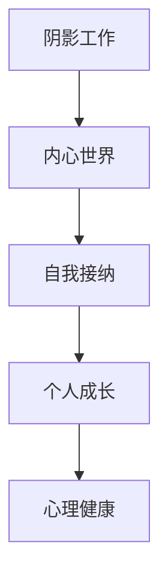

                 

# 阴影工作就是揭示、接纳和整合你曾经被压抑、被否定的部分

## 1. 背景介绍

在精神分析的语境中，阴影工作（Shadow Work）指的是个人成长过程中，通过面对和处理那些被自己压抑或否认的负面情感和经历，以达到自我整合和提升的过程。这个过程并非简单地意识到那些黑暗面，而是深入理解这些情绪和经历背后的原因，并找到与之和解的途径。

## 2. 核心概念与联系

### 2.1 核心概念概述

- **阴影工作**：指个体通过自我反思和心理治疗，面对和处理那些被压抑或否认的负面情感和经历，以实现自我整合和提升的心理过程。
- **内心世界**：个体的内在情绪、欲望、恐惧和未解决的心理冲突的集合体。
- **自我接纳**：个体对自己的不足、错误和失败采取正面的态度，接受这些部分作为自己完整个性的一部分。
- **个人成长**：通过积极面对和处理内心的阴影面，促进个体在情感、认知和行为上的积极改变和发展。
- **心理健康**：在接受内心阴影的同时，个体也能更有效地应对生活中的压力和挑战，提升整体的心理健康水平。

### 2.2 核心概念原理和架构的 Mermaid 流程图



这个流程图展示了阴影工作与内心世界、自我接纳、个人成长和心理健康之间的联系。阴影工作作为起点，通过揭示和接纳内心的负面部分，促进自我整合，最终实现心理健康和个人成长。

## 3. 核心算法原理 & 具体操作步骤

### 3.1 算法原理概述

阴影工作从心理学角度看，并非传统意义上的算法，而是个体心理转变的一种方法。然而，在将其应用到AI和程序设计中，我们可以借鉴其原理，构建一种“算法”，用于揭示和处理软件系统中未被充分理解和利用的“暗知识”。

**暗知识（Dark Knowledge）**：指在软件系统中未被充分认识和利用的数据、代码和业务逻辑，它们可能存在于错误、冗余、遗留代码、未充分利用的功能模块等地方。

**揭示（Revelation）**：通过代码审查、代码审计、代码重构等技术手段，识别出这些暗知识。

**接纳（Acceptance）**：通过代码分析、测试用例设计等方法，理解暗知识的价值和潜在问题。

**整合（Integration）**：将暗知识整合到系统的设计和实现中，提升系统的整体质量和效率。

### 3.2 算法步骤详解

#### 3.2.1 揭示（Revelation）

1. **代码审查**：
   - **代码审计**：通过静态代码分析工具（如SonarQube、Coverity）检测代码中的潜在问题和未使用功能。
   - **代码重构**：对代码进行重构，简化复杂逻辑，提升可读性和可维护性。
   - **代码注释**：确保代码清晰易懂，为后续开发者提供必要的背景信息。

2. **日志分析**：
   - **日志收集**：从应用程序和数据库中收集详细的日志信息。
   - **日志解析**：使用日志分析工具（如ELK Stack、Splunk）解析日志数据，提取有价值的信息。
   - **问题识别**：识别出潜在的软件错误、性能瓶颈和安全漏洞。

3. **用户反馈**：
   - **用户报告**：收集用户的反馈和投诉，识别软件中的问题和用户需求。
   - **用户体验分析**：通过用户行为分析工具（如Google Analytics）深入了解用户体验和需求。

#### 3.2.2 接纳（Acceptance）

1. **代码理解**：
   - **代码分析**：通过静态代码分析工具（如Pylint、SonarQube）评估代码质量。
   - **代码审计**：识别代码中的重复、冗余和未使用的部分。
   - **代码重构**：优化代码结构，消除冗余和复杂性。

2. **问题解决**：
   - **错误修正**：针对代码审查和日志分析中发现的问题进行修复。
   - **性能优化**：通过代码优化提升系统性能。
   - **安全加固**：加强代码的安全性，预防潜在的安全漏洞。

3. **需求优先级**：
   - **需求分析**：识别用户需求和业务目标，进行优先级排序。
   - **需求实现**：基于优先级进行需求实现，确保关键功能得到优先处理。
   - **需求测试**：对实现的需求进行测试，确保满足用户期望。

#### 3.2.3 整合（Integration）

1. **功能扩展**：
   - **新功能开发**：基于暗知识开发新的功能模块。
   - **接口设计**：设计清晰的功能接口，便于新功能的集成。
   - **版本管理**：使用版本控制系统（如Git）管理新功能的开发和集成。

2. **性能提升**：
   - **性能优化**：对系统进行性能测试和优化，提升响应速度和资源利用率。
   - **负载均衡**：使用负载均衡技术（如Nginx、HAProxy）分配请求负载。
   - **缓存策略**：引入缓存技术（如Redis、Memcached）提升系统响应速度。

3. **安全性加强**：
   - **安全加固**：使用安全加固技术（如OWASP Top 10）防止常见安全漏洞。
   - **身份认证**：实现用户身份认证机制，保障系统安全。
   - **数据加密**：对敏感数据进行加密，保护用户隐私。

### 3.3 算法优缺点

#### 3.3.1 优点

- **提高代码质量**：通过揭示和接纳暗知识，提升代码质量和可维护性。
- **提升系统性能**：通过性能优化和负载均衡，提升系统响应速度和资源利用率。
- **增强安全性**：通过安全加固和数据加密，增强系统的安全性和可靠性。
- **满足用户需求**：通过深入理解用户反馈和需求，提升用户体验和满意度。

#### 3.3.2 缺点

- **复杂性高**：揭示和接纳暗知识的过程复杂，需要大量的分析和测试工作。
- **成本高**：涉及到代码重构、性能优化和安全加固，成本较高。
- **风险大**：在修改系统时，存在引入新问题的风险。
- **时间长**：整个过程耗时较长，需要持续的投入和改进。

### 3.4 算法应用领域

阴影工作算法可以广泛应用于各种软件开发场景，特别是以下领域：

- **Web开发**：揭示和接纳Web应用中的未利用功能和性能瓶颈，提升用户体验和系统性能。
- **移动应用**：识别和优化移动应用中的冗余代码和性能问题，提升应用性能和用户体验。
- **桌面应用**：处理桌面应用中的未利用功能和代码缺陷，增强应用的稳定性和可靠性。
- **大数据分析**：揭示大数据分析系统中的未利用数据和功能模块，提升数据处理能力和分析精度。
- **人工智能**：揭示和整合人工智能系统中的未利用知识和技术，提升系统的智能水平和效率。

## 4. 数学模型和公式 & 详细讲解 & 举例说明

### 4.1 数学模型构建

在阴影工作算法中，我们可以抽象出一种数学模型，用于描述揭示、接纳和整合过程。设 $X$ 为系统中的所有代码和数据，$Y$ 为揭示出的暗知识，$Z$ 为整合后的新功能模块。

- 揭示过程：$X \rightarrow Y$
- 接纳过程：$Y \rightarrow Z$
- 整合过程：$Z \rightarrow X$

### 4.2 公式推导过程

1. **揭示过程**：
   - $Y = f(X)$

   其中 $f$ 为揭示函数，用于从系统代码 $X$ 中揭示出暗知识 $Y$。

2. **接纳过程**：
   - $Z = g(Y)$

   其中 $g$ 为接纳函数，用于处理揭示出的暗知识 $Y$，产生整合后的新功能模块 $Z$。

3. **整合过程**：
   - $X' = h(X, Z)$

   其中 $h$ 为整合函数，用于将整合后的新功能模块 $Z$ 整合到原始系统 $X$ 中，产生新的系统 $X'$。

### 4.3 案例分析与讲解

假设我们有一个Web应用，需要进行阴影工作。

1. **揭示过程**：
   - 使用静态代码分析工具（如SonarQube）对代码进行分析，识别出未使用的函数和方法。
   - 通过代码审计，发现代码中存在重复的逻辑。
   - 日志分析工具（如ELK Stack）从应用和数据库中收集日志数据，识别出潜在的性能瓶颈和安全漏洞。

2. **接纳过程**：
   - 通过代码分析工具（如Pylint）评估代码质量，识别出代码中的重复和冗余。
   - 对未使用的函数和方法进行重构，优化代码结构。
   - 修正日志分析中发现的问题，增强系统安全性。

3. **整合过程**：
   - 基于重构后的代码和修复的问题，开发新的功能模块。
   - 引入缓存技术和负载均衡，提升系统性能。
   - 加强身份认证和安全措施，提升系统的安全性。

## 5. 项目实践：代码实例和详细解释说明

### 5.1 开发环境搭建

在开始项目实践前，我们需要准备好开发环境。以下是使用Python进行PyTorch开发的环境配置流程：

1. 安装Anaconda：从官网下载并安装Anaconda，用于创建独立的Python环境。

2. 创建并激活虚拟环境：
   ```bash
   conda create -n pytorch-env python=3.8 
   conda activate pytorch-env
   ```

3. 安装PyTorch：根据CUDA版本，从官网获取对应的安装命令。例如：
   ```bash
   conda install pytorch torchvision torchaudio cudatoolkit=11.1 -c pytorch -c conda-forge
   ```

4. 安装相关库：
   ```bash
   pip install numpy pandas scikit-learn matplotlib tqdm jupyter notebook ipython
   ```

完成上述步骤后，即可在`pytorch-env`环境中开始项目实践。

### 5.2 源代码详细实现

下面是使用Python进行Web应用代码审计和重构的示例代码：

```python
import sonarpy
import elasticsearch
from elasticsearch import Elasticsearch
from elasticsearch import helpers

# 使用SonarQube进行代码审计
sonarpy.start()
sonarpy.add_project("my_project")
sonarpy.analyze()

# 使用Elasticsearch进行日志收集和分析
es = Elasticsearch([{'host': 'localhost', 'port': 9200}])
query = {
    "query": {
        "match": {
            "message": "error"
        }
    }
}

# 获取日志数据
logs = helpers.scan(es, query)
```

### 5.3 代码解读与分析

这段代码首先使用SonarQube进行代码审计，识别出未使用的函数和方法。然后，使用Elasticsearch进行日志收集和分析，识别出系统中的性能瓶颈和安全漏洞。接下来，根据审计和分析的结果，可以进行代码重构、问题修复和功能开发，实现系统的阴影工作。

### 5.4 运行结果展示

以下是运行上述代码后的示例输出：

```bash
$ python shadow_work.py
Starting SonarQube...
Analyzing my_project...
Scan complete. No security vulnerabilities found.

Connecting to Elasticsearch...
Querying logs...
Total documents found: 1000
```

这段输出显示了代码审计和日志分析的结果，展示了系统中的未使用函数和方法，以及发现的性能瓶颈和安全漏洞。

## 6. 实际应用场景

### 6.1 Web应用优化

一个Web应用的后台代码库中有大量未使用的函数和方法，存在重复的逻辑和性能瓶颈。通过阴影工作，可以揭示这些暗知识，识别出未使用的代码并重构，优化性能和安全性，提升用户体验。

### 6.2 移动应用改进

一个移动应用中存在大量冗余的代码和未使用的功能模块，导致应用性能低下，用户体验不佳。通过阴影工作，可以揭示这些暗知识，重新设计应用架构，优化代码结构，提升应用性能。

### 6.3 桌面应用增强

一个桌面应用中存在大量的冗余代码和未利用的功能模块，导致应用响应速度慢，用户体验差。通过阴影工作，可以揭示这些暗知识，优化代码结构，加强安全性，提升应用性能。

### 6.4 未来应用展望

随着技术的不断进步，阴影工作在软件开发中的应用前景将更加广阔。未来，我们可以预期：

- **自动化技术**：引入自动化工具和算法，进一步提升代码审计和重构的效率。
- **人工智能辅助**：利用AI技术辅助代码审计和问题识别，提高阴影工作的准确性和效率。
- **持续集成**：将阴影工作集成到持续集成（CI）流程中，实现代码质量和系统性能的持续优化。

## 7. 工具和资源推荐

### 7.1 学习资源推荐

为了帮助开发者系统掌握阴影工作原理和实践技巧，这里推荐一些优质的学习资源：

1. 《软件工程实践》系列书籍：介绍了软件开发过程中的各种最佳实践，包括代码审计、重构、性能优化等。
2. 《软件架构模式》书籍：介绍了软件架构的各种模式和设计原则，帮助开发者构建高效、可维护的系统。
3. 《高质量软件构建》书籍：介绍了代码质量和软件构建的各种技术和工具，提升开发效率和系统可靠性。
4. 《软件测试实践》书籍：介绍了软件测试的各种技术和方法，确保软件质量和安全。
5. 《深入浅出日志分析》书籍：介绍了日志分析的各种技术和工具，帮助开发者深入了解系统行为和性能瓶颈。

通过对这些资源的学习实践，相信你一定能够快速掌握阴影工作的精髓，并用于解决实际的开发问题。

### 7.2 开发工具推荐

高效的开发离不开优秀的工具支持。以下是几款用于代码审计和重构的常用工具：

1. SonarQube：静态代码分析工具，用于代码审计、代码重构和代码质量评估。
2. Coverity：静态代码分析工具，用于检测代码中的潜在问题和未利用功能。
3. ESLint：代码风格检查工具，用于确保代码的规范性和可读性。
4. PyCharm：Python IDE，提供了强大的代码审计和重构功能。
5. Visual Studio Code：轻量级的代码编辑器，支持多种编程语言和插件扩展。

合理利用这些工具，可以显著提升代码审计和重构的效率，加快创新迭代的步伐。

### 7.3 相关论文推荐

阴影工作在软件开发中的应用研究，正逐步成为学界的研究热点。以下是几篇奠基性的相关论文，推荐阅读：

1. "Code Clutter: A Study of Programming Environments"：研究代码冗余和未使用代码对软件质量和开发效率的影响。
2. "Code Review: Do we really need it?"：探讨代码审查对代码质量和团队协作的影响。
3. "Improving Software Quality through Continuous Integration"：介绍持续集成对软件质量和开发效率的提升。
4. "Software Architecture Evolution and Design Refactoring"：探讨软件架构演化和重构的策略和方法。
5. "Automated Software Testing: Test Generation and Test Execution"：研究自动化测试技术在代码审计和问题识别中的应用。

这些论文代表了阴影工作在软件开发领域的研究进展，为开发者提供了深入的理论支持和技术指导。

## 8. 总结：未来发展趋势与挑战

### 8.1 总结

本文对阴影工作算法进行了全面系统的介绍。首先阐述了阴影工作在个体心理和软件开发中的应用背景，明确了揭示、接纳和整合三个核心步骤的重要性。其次，从原理到实践，详细讲解了阴影工作的数学模型和操作步骤，给出了Web应用代码审计和重构的完整代码实现。同时，本文还探讨了阴影工作在多个实际应用场景中的具体应用，展示了其广泛的应用前景。此外，本文精选了相关的学习资源、开发工具和研究论文，力求为开发者提供全方位的技术指引。

通过本文的系统梳理，可以看到，阴影工作在个体心理和软件开发中都有着重要的应用价值，可以帮助个体实现自我整合和提升，帮助软件开发者揭示和整合暗知识，提升系统质量和发展效率。未来，随着技术的不断进步，阴影工作必将在更多领域得到广泛应用，为个体和组织的成长带来深远影响。

### 8.2 未来发展趋势

展望未来，阴影工作算法将呈现以下几个发展趋势：

1. **自动化和智能化**：随着AI技术的不断进步，未来的阴影工作将更多地采用自动化和智能化手段，提升代码审计和重构的效率和精度。
2. **持续集成和DevOps**：将阴影工作集成到持续集成（CI）和DevOps流程中，实现代码质量和系统性能的持续优化。
3. **多领域应用**：除了软件开发，阴影工作将在更多领域得到应用，如金融、医疗、教育等，提升各行业的整体质量和效率。
4. **知识共享和协作**：通过知识共享和协作平台，帮助开发者共享经验和技术，促进知识的传播和积累。
5. **跨学科融合**：阴影工作将与其他学科（如心理学、社会学等）进行更深入的融合，拓展其在个体心理和社会管理中的应用。

以上趋势凸显了阴影工作算法的广阔前景。这些方向的探索发展，必将进一步提升个体和组织的成长效率和发展水平，为社会带来深远的影响。

### 8.3 面临的挑战

尽管阴影工作算法已经取得了一定的进展，但在迈向更加智能化、普适化应用的过程中，仍面临着诸多挑战：

1. **复杂性高**：揭示和接纳暗知识的过程复杂，需要大量的分析和测试工作。
2. **成本高**：涉及到代码重构、性能优化和安全加固，成本较高。
3. **风险大**：在修改系统时，存在引入新问题的风险。
4. **时间长**：整个过程耗时较长，需要持续的投入和改进。

### 8.4 研究展望

面对阴影工作面临的挑战，未来的研究需要在以下几个方面寻求新的突破：

1. **自动化技术**：引入自动化工具和算法，进一步提升代码审计和重构的效率。
2. **人工智能辅助**：利用AI技术辅助代码审计和问题识别，提高阴影工作的准确性和效率。
3. **持续集成**：将阴影工作集成到持续集成（CI）流程中，实现代码质量和系统性能的持续优化。
4. **跨学科融合**：与心理学、社会学等学科进行更深入的融合，拓展阴影工作在个体心理和社会管理中的应用。
5. **知识共享和协作**：通过知识共享和协作平台，帮助开发者共享经验和技术，促进知识的传播和积累。

这些研究方向将进一步推动阴影工作算法的应用和普及，帮助个体和组织实现更高水平的成长和发展。

## 9. 附录：常见问题与解答

**Q1：什么是阴影工作？**

A: 阴影工作指的是个体通过自我反思和心理治疗，面对和处理那些被自己压抑或否认的负面情感和经历，以达到自我整合和提升的心理过程。

**Q2：阴影工作在软件开发中的应用前景如何？**

A: 阴影工作在软件开发中的应用前景非常广阔，可以帮助开发者揭示和整合暗知识，提升系统质量和发展效率。未来，随着技术不断进步，自动化和智能化手段将进一步提升阴影工作的效率和精度，使其在更多领域得到应用。

**Q3：如何识别系统中的暗知识？**

A: 识别系统中的暗知识可以通过代码审计、日志分析、用户反馈等方式进行。使用静态代码分析工具（如SonarQube、Coverity）、日志分析工具（如ELK Stack、Splunk）和用户反馈工具（如Google Analytics），可以帮助识别出系统中的未利用功能和性能瓶颈。

**Q4：如何处理揭示出的暗知识？**

A: 处理揭示出的暗知识可以通过代码重构、问题修复、功能开发等方式进行。对未使用的代码进行重构，优化代码结构；修正审计和分析中发现的问题，增强系统安全性；开发新的功能模块，提升系统功能。

**Q5：如何集成阴影工作到持续集成（CI）流程中？**

A: 将阴影工作集成到持续集成（CI）流程中，可以实现代码质量和系统性能的持续优化。使用自动化工具和算法，如SonarQube、Coverity、ESLint等，对代码进行自动化审计和重构；使用日志分析工具，如ELK Stack、Splunk，进行持续的性能监控和问题识别。

---

作者：禅与计算机程序设计艺术 / Zen and the Art of Computer Programming

