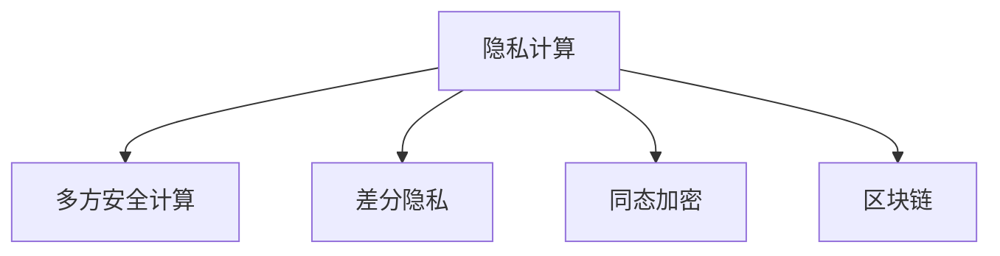

                 

# 隐私计算：在保护数据隐私的同时进行计算

> 关键词：隐私计算, 数据隐私, 计算, 安全性, 多方安全计算, 差分隐私, 同态加密, 可解释性, 区块链

## 1. 背景介绍

### 1.1 问题由来
随着大数据和人工智能技术的迅猛发展，数据已成为一种重要的资产，可用于驱动商业决策、提升产品服务、优化运营管理等。然而，数据往往包含敏感信息，如个人身份、行为习惯、消费记录等，如果被未经授权的第三方获取，将可能造成严重的隐私风险，甚至威胁到个人和社会安全。因此，如何在利用数据的同时保护数据隐私，成为了当前数据处理领域面临的重大挑战。

隐私计算（Privacy-Preserving Computation, PPC）技术，通过将数据加密、分布式计算和匿名化等手段结合，可以在不泄露原始数据的前提下进行数据计算，从而有效保护数据隐私。隐私计算被广泛应用于金融、医疗、零售、政府等多个领域，成为数据驱动型企业和社会治理的重要保障。

### 1.2 问题核心关键点
隐私计算的核心在于通过安全计算机制，使得数据参与方可以在不暴露数据隐私的前提下，共同完成计算任务。其关键技术包括多方安全计算（Secure Multi-Party Computation, SMPC）、差分隐私（Differential Privacy, DP）、同态加密（Homomorphic Encryption, HE）、区块链等。

这些技术能够从不同的角度解决数据隐私问题，保障计算过程的安全性和隐私性。例如，多方安全计算保障了计算过程中各方的数据不会被非法获取；差分隐私通过添加噪声的方式保护个体隐私，使得攻击者难以从计算结果中反向推断出原始数据；同态加密允许数据在不解密的情况下进行计算，保持数据的加密状态。

## 2. 核心概念与联系

### 2.1 核心概念概述

为更好地理解隐私计算的核心概念及其应用，本节将介绍几个密切相关的核心概念：

- 隐私计算（Privacy-Preserving Computation, PPC）：指在不暴露参与方数据隐私的前提下，利用加密和匿名化技术，在多个参与方之间进行安全计算。

- 多方安全计算（Secure Multi-Party Computation, SMPC）：指多个参与方共同计算一个函数，确保每个参与方只能获取自己的计算结果，而无法推断其他参与方的输入数据。

- 差分隐私（Differential Privacy, DP）：指在数据处理和分析过程中，加入噪声以保护个体隐私，使得攻击者难以从数据中识别出特定个体。

- 同态加密（Homomorphic Encryption, HE）：指在加密数据上直接进行计算，计算结果仍保持加密状态，避免了数据解密过程中的隐私泄露。

- 区块链（Blockchain）：指通过分布式账本和共识机制，保障数据的安全和透明，提供数据审计和追踪功能。

这些核心概念之间的逻辑关系可以通过以下Mermaid流程图来展示：



这个流程图展示隐私计算的核心概念及其之间的关系：

1. 隐私计算是保护数据隐私的总体框架，包括多方安全计算、差分隐私、同态加密等多种技术手段。
2. 多方安全计算通过安全的计算方式，确保各参与方仅获取自己的计算结果。
3. 差分隐私通过在数据上添加噪声，保护个体隐私。
4. 同态加密允许数据在不解密的情况下进行计算。
5. 区块链通过分布式账本和共识机制，提供数据的安全性和透明性。

## 3. 核心算法原理 & 具体操作步骤

### 3.1 算法原理概述

隐私计算的算法原理，主要基于以下几个核心思想：

1. 数据加密：在数据传输和存储过程中，对数据进行加密，确保数据在未授权情况下难以被解读。
2. 安全计算：设计安全的计算协议，使得多个参与方可以在不共享原始数据的前提下，共同完成计算任务。
3. 隐私保护：通过差分隐私、同态加密等手段，保护个体隐私，防止数据泄露。
4. 数据共享：通过区块链等技术，实现数据的透明和可审计，增强数据共享的信任度。

### 3.2 算法步骤详解

隐私计算的典型操作流程，可以总结如下：

**Step 1: 数据收集与预处理**
- 收集各参与方的数据，并进行清洗、去重等预处理，确保数据质量。
- 对敏感数据进行加密，防止在传输和存储过程中被非法获取。

**Step 2: 设计计算协议**
- 根据具体计算任务，设计合适的多方安全计算协议，如zk-SNARK、BCNP等。
- 确定参与方的角色和责任，如计算方、验证方等，确保计算过程的公正性和透明性。

**Step 3: 计算过程执行**
- 各参与方按照协议要求，将加密数据输入到计算引擎中，进行计算。
- 计算过程中，各参与方仅能获取自己的计算结果，而无法推断其他参与方的输入数据。

**Step 4: 结果验证与共享**
- 使用差分隐私技术对计算结果进行噪声扰动，确保个体隐私的保护。
- 将结果发布到区块链上，进行透明化存储和共享，确保数据的可审计性。

**Step 5: 结果使用**
- 从区块链上获取计算结果，进行后续的数据分析和应用。
- 确保结果的准确性和安全性，防止恶意攻击和数据篡改。

### 3.3 算法优缺点

隐私计算的优势主要体现在以下几个方面：
1. 数据隐私保护：通过加密和匿名化技术，保护数据隐私，防止数据泄露。
2. 数据安全共享：通过区块链等技术，实现数据的透明和可审计，增强数据共享的信任度。
3. 安全计算：通过多方安全计算协议，确保各参与方仅获取自己的计算结果。

同时，隐私计算也存在一些局限性：
1. 计算复杂度高：加密和解密等操作增加了计算复杂度，影响计算效率。
2. 成本高昂：硬件和软件基础设施的投入较大，且需要专业的技术支持。
3. 安全性依赖于协议设计：协议设计不当可能导致计算过程被攻击者破解。
4. 结果准确性问题：差分隐私等技术可能导致结果的噪声干扰，影响结果的准确性。

尽管存在这些局限性，但隐私计算在保障数据隐私方面具有不可替代的重要价值，未来仍有广阔的发展空间。

### 3.4 算法应用领域

隐私计算在多个领域都有广泛的应用，例如：

- 金融：利用隐私计算进行联合信用评分、反欺诈检测、风险管理等，保护客户隐私。
- 医疗：利用隐私计算进行医疗数据分析、患者隐私保护、数据共享等，提升医疗服务质量。
- 零售：利用隐私计算进行用户行为分析、个性化推荐、精准营销等，保护消费者隐私。
- 政府：利用隐私计算进行公共数据共享、社会治理、智能监管等，提高治理效率。
- 智能合约：利用隐私计算进行区块链上的智能合约计算，确保合约执行的公正性和透明性。

## 4. 数学模型和公式 & 详细讲解 & 举例说明

### 4.1 数学模型构建

隐私计算的数学模型构建，主要基于以下几个关键理论：

- 差分隐私（DP）：通过在数据上添加噪声，保护个体隐私，确保攻击者难以从数据中识别出特定个体。
- 同态加密（HE）：允许在加密数据上直接进行计算，保持数据的加密状态。
- 多方安全计算（SMPC）：通过安全计算协议，确保各参与方仅获取自己的计算结果。

### 4.2 公式推导过程

以差分隐私为例，推导噪声扰动的计算公式：

设原始数据集为 $D$，加入噪声后的数据集为 $D'$，噪声为 $\epsilon$ 高斯噪声。差分隐私的目标是使得加入噪声后的数据集的分布与原始数据集的分布相似。

定义 $DP(\epsilon)$ 为差分隐私的隐私参数，其计算公式为：

$$
DP(\epsilon) = \frac{1}{\epsilon}
$$

其中 $\epsilon$ 为隐私参数，表示加入的噪声强度。

加入噪声的计算公式为：

$$
D'_i = D_i + \mathcal{N}(0, \sigma^2)
$$

其中 $\sigma^2$ 为噪声方差，$\mathcal{N}(0, \sigma^2)$ 为均值为0、方差为 $\sigma^2$ 的高斯噪声分布。

### 4.3 案例分析与讲解

以下以多方安全计算（SMPC）为例，说明隐私计算的实现过程。

假设三方 A、B、C 需要共同计算 $f(x_1, x_2, x_3) = x_1 + x_2 + x_3$，其中 $x_i$ 为各方的输入数据。

1. 各方分别将输入数据 $x_i$ 加密，得到 $c_i$。
2. 各方将加密后的数据 $c_i$ 传递给可信的第三方协调器。
3. 协调器使用安全的计算协议，如 zk-SNARK，进行计算。
4. 计算结果 $f_{c_i}$ 返回给各方。
5. 各方将计算结果解密，得到 $f(x_1, x_2, x_3)$。

通过上述过程，各参与方仅能获取自己的计算结果，而无法推断其他参与方的输入数据，从而保证了数据隐私。

## 5. 项目实践：代码实例和详细解释说明

### 5.1 开发环境搭建

在进行隐私计算项目实践前，我们需要准备好开发环境。以下是使用Python进行PySyft开发的环境配置流程：

1. 安装Anaconda：从官网下载并安装Anaconda，用于创建独立的Python环境。

2. 创建并激活虚拟环境：
```bash
conda create -n privacy-env python=3.8 
conda activate privacy-env
```

3. 安装PySyft：
```bash
pip install pysyft==0.11.5
```

4. 安装各类工具包：
```bash
pip install numpy pandas scikit-learn matplotlib tqdm jupyter notebook ipython
```

完成上述步骤后，即可在`privacy-env`环境中开始隐私计算实践。

### 5.2 源代码详细实现

下面以多方安全计算（SMPC）为例，给出使用PySyft库进行SMPC实践的Python代码实现。

```python
import pysyft as sy
from pysyft.models import MultiPCP

# 定义多方安全计算协议
def secure_computation():
    # 创建多方计算框架
    pcp = MultiPCP()
    # 设置多方计算协议参数
    pcp.set(priv_params=[{'name': 'x1', 'share': None, 'noise': 0.1},
                        {'name': 'x2', 'share': None, 'noise': 0.1},
                        {'name': 'x3', 'share': None, 'noise': 0.1}])
    # 将数据加密，并共享给其他方
    pcp.set_shared_parameters([sy.encrypt(data) for data in [x1, x2, x3]])
    # 执行计算
    result = pcp.compute(0)
    # 解密结果
    return result.de解密()

# 数据示例
x1 = 5
x2 = 3
x3 = 7

# 计算结果
result = secure_computation()
print(result)
```

### 5.3 代码解读与分析

让我们再详细解读一下关键代码的实现细节：

**PySyft库**：
- 提供了强大的隐私计算支持，包含多方计算、同态加密、差分隐私等多种隐私保护手段。
- 通过创建`MultiPCP`对象，可以轻松构建多方计算框架，并定义计算协议。
- 支持Python语法和Jupyter Notebook环境，便于开发者快速上手和调试。

**secure_computation函数**：
- 定义了一个多方计算协议，包含三个输入数据 $x_1, x_2, x_3$，并设置了每个输入数据的噪声水平。
- 通过`set_shared_parameters`方法将输入数据加密后共享给其他方。
- 使用`compute`方法执行计算，返回计算结果。

**计算结果解析**：
- 使用`deencrpyt`方法将计算结果解密，得到最终的数字结果。
- 输出结果，验证计算的正确性。

通过上述代码，我们可以看到，利用PySyft库，我们可以在短时间内实现多方安全计算，并验证其正确性。

## 6. 实际应用场景

### 6.1 金融数据联合分析

在金融领域，不同金融机构掌握着不同的客户数据，这些数据包含大量敏感信息，如收入、消费习惯、信用记录等。为提升金融服务质量，各金融机构需要进行联合分析，如信用评分、风险管理等。但这些数据往往需要严格保护，不能直接共享。

通过隐私计算，可以在不泄露原始数据的前提下，进行联合分析。各金融机构将客户数据加密后，共同计算信用评分模型，输出结果仅包含模型参数，不包含原始数据。这样，各金融机构可以放心地使用联合分析结果，而无需担心数据隐私问题。

### 6.2 医疗数据分析

医疗领域的数据包含大量敏感信息，如病历、检查结果等。为提升医疗服务质量，医疗机构需要进行数据分析，如疾病预测、患者治疗方案优化等。但这些数据需要严格保护，不能直接共享。

通过隐私计算，可以在不泄露原始数据的前提下，进行数据分析。医疗机构将病历数据加密后，共同计算疾病预测模型，输出结果仅包含模型参数，不包含原始数据。这样，各医疗机构可以放心地使用数据分析结果，而无需担心数据隐私问题。

### 6.3 社交网络隐私保护

社交网络平台掌握着大量的用户数据，包括用户的社交关系、行为记录、地理位置等。为保护用户隐私，社交网络平台需要进行隐私保护，防止数据泄露。

通过隐私计算，可以在不泄露原始数据的前提下，进行数据分析。社交网络平台将用户数据加密后，共同计算用户行为分析模型，输出结果仅包含模型参数，不包含原始数据。这样，社交网络平台可以放心地使用数据分析结果，而无需担心数据隐私问题。

### 6.4 未来应用展望

随着隐私计算技术的发展，未来其在数据隐私保护方面将具有更加广阔的应用前景：

- 联邦学习：基于隐私计算的多方联合学习，可以在不共享原始数据的前提下，进行模型训练和更新，保障数据隐私。
- 区块链隐私保护：利用区块链的分布式账本和透明性，保障数据的共享和审计，增强数据使用的可信度。
- 隐私计算与人工智能结合：通过隐私计算保护模型训练过程中的数据隐私，实现AI模型的安全训练和推理。
- 隐私计算在边缘计算中的应用：利用边缘计算靠近数据源的特性，提高隐私计算的效率和安全性。

## 7. 工具和资源推荐

### 7.1 学习资源推荐

为了帮助开发者系统掌握隐私计算的理论基础和实践技巧，这里推荐一些优质的学习资源：

1. 《隐私计算概论》系列博文：由隐私计算专家撰写，深入浅出地介绍了隐私计算的原理、方法及其应用。

2. 《区块链与隐私计算》课程：国内顶级高校开设的隐私计算与区块链课程，涵盖隐私计算的核心技术和应用场景。

3. 《Practical Privacy-Preserving Computation with PySyft》书籍：详细介绍了如何使用PySyft库进行隐私计算开发，包含多方计算、同态加密、差分隐私等多种技术手段。

4. 《Privacy-Preserving Machine Learning》书籍：介绍了如何在机器学习中保护数据隐私，通过隐私计算技术实现数据共享和模型训练。

5. 《隐私计算与大数据》报告：提供了隐私计算的最新研究进展和应用案例，有助于理解隐私计算的最新动态和应用前景。

通过对这些资源的学习实践，相信你一定能够快速掌握隐私计算的精髓，并用于解决实际的隐私问题。

### 7.2 开发工具推荐

高效的开发离不开优秀的工具支持。以下是几款用于隐私计算开发的常用工具：

1. PySyft：由OpenMined社区开发的隐私计算工具，支持多方计算、同态加密、差分隐私等多种技术手段。

2. Zcash：基于区块链的隐私保护货币，采用零知识证明等技术，保障交易隐私和安全。

3. Synthesis：基于Zcash的隐私支付平台，支持复杂的隐私交易，提供便捷的隐私计算服务。

4. Truistical：基于区块链和智能合约的隐私保护平台，提供隐私计算和数据共享解决方案。

5. Kinto：隐私保护的数据共享平台，支持差分隐私和同态加密，保障数据共享的安全性和隐私性。

合理利用这些工具，可以显著提升隐私计算的开发效率，加快创新迭代的步伐。

### 7.3 相关论文推荐

隐私计算作为前沿技术，其研究进展和应用实践持续涌现。以下是几篇奠基性的相关论文，推荐阅读：

1. Secure Computation – How to Make a Secret Slightly Public – How to Make a Public Slightly Secret：提出了多方安全计算的基本框架，阐述了安全计算协议的设计原则。

2. Zero-Knowledge Proofs：介绍了零知识证明技术，展示了如何在不泄露数据的前提下验证数据的真实性。

3. The Mathematics of Privacy-Preserving Computation：从数学角度深入分析了隐私计算的原理和挑战，提供了隐私计算的理论基础。

4. A Framework for Privacy-Preserving Machine Learning：提出了一种隐私保护机器学习框架，实现了数据共享和模型训练的安全性。

5. Practical Trustless Set Operations on Distributed Ledgers Using Homomorphic Encryption：研究了同态加密在区块链上的应用，实现了安全的数据共享和计算。

这些论文代表了隐私计算技术的最新进展，通过学习这些前沿成果，可以帮助研究者把握学科前进方向，激发更多的创新灵感。

## 8. 总结：未来发展趋势与挑战

### 8.1 总结

本文对隐私计算的原理和应用进行了全面系统的介绍。首先阐述了隐私计算的重要性，明确了数据隐私保护在当前数据驱动型企业和社会治理中的重要地位。其次，从原理到实践，详细讲解了隐私计算的数学原理和核心技术，给出了隐私计算任务开发的完整代码实例。同时，本文还广泛探讨了隐私计算在金融、医疗、社交网络等多个行业领域的应用前景，展示了隐私计算的广泛应用潜力。

通过本文的系统梳理，可以看到，隐私计算正在成为数据驱动型企业和社会治理的重要保障，成为保障数据隐私的关键技术。随着隐私计算技术的不断演进，未来将有更多创新应用涌现，极大地提升数据驱动型企业的竞争力。

### 8.2 未来发展趋势

展望未来，隐私计算技术将呈现以下几个发展趋势：

1. 隐私计算技术不断发展。随着硬件和算法的不断进步，隐私计算的效率和安全性将进一步提升。

2. 隐私计算与其他技术的融合。隐私计算将与区块链、AI、边缘计算等技术深度结合，形成更加安全、高效的隐私保护方案。

3. 隐私计算在多领域的应用拓展。隐私计算将应用于更多垂直领域，如金融、医疗、社交网络等，推动数据驱动型企业的数字化转型。

4. 隐私计算的法规和标准逐步完善。各国政府和企业将逐步完善隐私计算的法规和标准，规范隐私计算的应用，保障用户隐私。

5. 隐私计算的商业化应用加速。随着隐私计算技术的成熟和普及，商业化的应用场景将不断涌现，为数据驱动型企业带来新的商业机会。

以上趋势凸显了隐私计算技术的广阔前景。这些方向的探索发展，必将进一步提升隐私计算系统的性能和应用范围，为数据驱动型企业和社会治理带来新的技术红利。

### 8.3 面临的挑战

尽管隐私计算技术已经取得了显著进展，但在迈向更广泛应用的过程中，仍面临诸多挑战：

1. 计算复杂度高。隐私计算的加密和解密等操作增加了计算复杂度，影响计算效率。

2. 成本高昂。隐私计算需要大量的硬件和软件基础设施投入，且需要专业的技术支持。

3. 安全性依赖于协议设计。协议设计不当可能导致计算过程被攻击者破解。

4. 结果准确性问题。差分隐私等技术可能导致结果的噪声干扰，影响结果的准确性。

5. 法规和标准缺失。隐私计算的法规和标准尚未完全建立，可能面临合规风险。

6. 技术门槛高。隐私计算涉及复杂的数学和算法，需要专业的技术背景。

尽管存在这些挑战，但隐私计算在保障数据隐私方面具有不可替代的重要价值，未来仍有广阔的发展空间。

### 8.4 研究展望

面对隐私计算所面临的种种挑战，未来的研究需要在以下几个方面寻求新的突破：

1. 探索更加高效的隐私计算算法。通过改进加密算法、优化计算协议，提高隐私计算的效率和安全性。

2. 研究更加灵活的隐私保护机制。根据具体应用场景，选择适合的隐私保护技术，如差分隐私、同态加密、多方安全计算等。

3. 开发更加易用的隐私计算工具。通过工具封装，简化隐私计算的使用门槛，加速隐私计算的普及应用。

4. 建立更加完善的隐私计算法规和标准。通过政府和企业共同努力，规范隐私计算的应用，保障用户隐私。

5. 加强隐私计算的基础理论研究。通过理论创新，提升隐私计算的可靠性、可解释性和可扩展性。

这些研究方向的探索，必将引领隐私计算技术迈向更高的台阶，为构建安全、可靠、可解释、可控的智能系统铺平道路。面向未来，隐私计算技术还需要与其他人工智能技术进行更深入的融合，共同推动隐私保护技术的进步。只有勇于创新、敢于突破，才能不断拓展隐私计算技术的边界，让智能技术更好地造福人类社会。

## 9. 附录：常见问题与解答

**Q1：隐私计算是否适用于所有数据类型？**

A: 隐私计算适用于多种数据类型，包括数值型、文本型、图像型、语音型等。但不同类型的数据，其隐私计算方法和技术实现略有差异。

**Q2：隐私计算在实际应用中如何保证安全性？**

A: 隐私计算通过加密、匿名化、分布式计算等手段，保障数据隐私。具体而言，可以采用以下策略：

1. 数据加密：在数据传输和存储过程中，对数据进行加密，防止数据泄露。
2. 安全计算协议：设计安全的计算协议，确保各参与方仅获取自己的计算结果。
3. 差分隐私：通过在数据上添加噪声，保护个体隐私，防止数据泄露。
4. 区块链：通过分布式账本和透明性，保障数据的共享和审计，增强数据使用的可信度。

**Q3：隐私计算的计算复杂度如何？**

A: 隐私计算的计算复杂度相对较高，主要由于加密和解密等操作增加了计算量。但通过优化算法和优化硬件，可以提升隐私计算的效率。

**Q4：隐私计算是否适用于所有的数据处理场景？**

A: 隐私计算适用于需要保护数据隐私的数据处理场景，如金融、医疗、社交网络等。但对于不需要保护数据隐私的场景，隐私计算的效率可能较低，不适用。

**Q5：隐私计算的未来发展趋势是什么？**

A: 隐私计算的未来发展趋势包括：

1. 隐私计算技术不断发展。随着硬件和算法的不断进步，隐私计算的效率和安全性将进一步提升。
2. 隐私计算与其他技术的融合。隐私计算将与区块链、AI、边缘计算等技术深度结合，形成更加安全、高效的隐私保护方案。
3. 隐私计算在多领域的应用拓展。隐私计算将应用于更多垂直领域，如金融、医疗、社交网络等，推动数据驱动型企业的数字化转型。
4. 隐私计算的法规和标准逐步完善。各国政府和企业将逐步完善隐私计算的法规和标准，规范隐私计算的应用，保障用户隐私。
5. 隐私计算的商业化应用加速。随着隐私计算技术的成熟和普及，商业化的应用场景将不断涌现，为数据驱动型企业带来新的商业机会。

这些趋势凸显了隐私计算技术的广阔前景，隐私计算将在未来发挥更加重要的作用，为数据驱动型企业和社会治理带来新的技术红利。

---

作者：禅与计算机程序设计艺术 / Zen and the Art of Computer Programming

