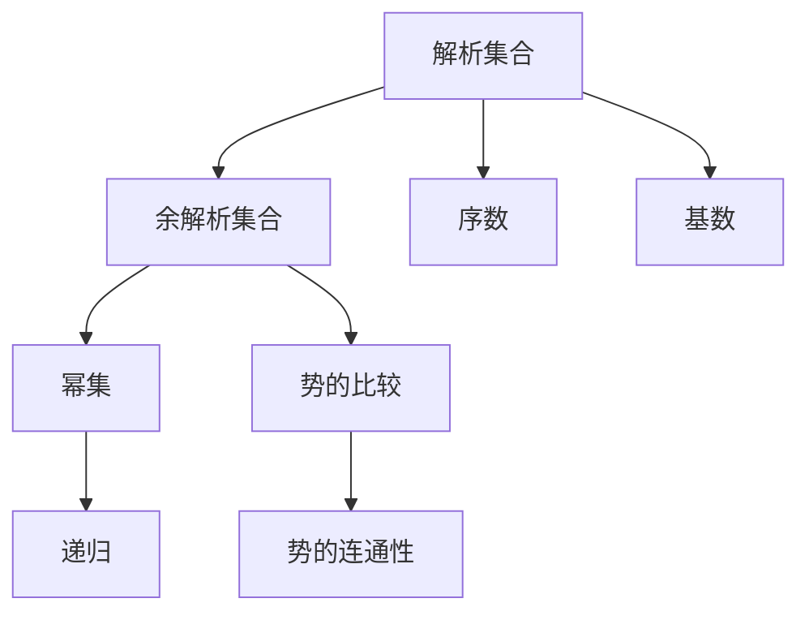

                 

# 集合论导引：余解析集合

> 关键词：集合论,余解析集合,解析集合,数学模型,余解析数集,集合运算

## 1. 背景介绍

### 1.1 问题由来
集合论是数学研究的基本工具之一，广泛应用于计算机科学、逻辑学、统计学等多个领域。余解析集合是集合论中一种特殊的集合类型，具有与解析集合相似的结构和性质，但其定义和使用方式与解析集合有所不同。余解析集合的研究不仅对数学理论具有重要意义，还在计算机科学中有着广泛应用，如算法分析、程序验证等。

### 1.2 问题核心关键点
余解析集合的核心概念和定义是研究的关键点。余解析集合是解析集合的一个子集，具有类似于解析集合的性质，但同时又有一些特殊的特征。具体而言，余解析集合中的元素满足一定的条件，使得它们在数学上具有特殊的性质和应用。这些条件涉及集合运算、幂集的性质、势的比较等，需要深入理解。

### 1.3 问题研究意义
研究余解析集合对于推进数学理论和计算机科学的发展具有重要意义。解析集合在计算机科学中有着广泛应用，而余解析集合则提供了更丰富的数学模型，可以用于更复杂的问题求解。研究余解析集合的性质和应用，有助于解决算法复杂度、程序验证等实际问题，推动理论研究和应用实践的深入发展。

## 2. 核心概念与联系

### 2.1 核心概念概述

余解析集合是集合论中的一个重要概念，是解析集合的一个子集。解析集合是集合论中具有高度对称性的集合，具有许多良好的性质。余解析集合是解析集合的一个子集，满足一定的条件，使得它与解析集合类似，但又有所区别。

具体来说，解析集合通常指的是满足某些条件的集合，如卡勒-文德尔·本集合、亚历山德罗集合等。这些集合在数学上具有一些特殊的性质，如序数、基数等，能够应用于各种数学证明和应用中。

余解析集合的定义涉及解析集合、幂集、势的比较等核心概念。在研究余解析集合时，需要深入理解这些概念，并掌握它们之间的联系和区别。

### 2.2 核心概念原理和架构的 Mermaid 流程图



这个流程图展示了余解析集合与解析集合、幂集、势的比较等概念之间的联系。解析集合具有序数、基数等性质，而余解析集合作为其子集，也具有类似的性质，但同时又有一些特殊的特征。幂集和势的比较则涉及集合的大小关系，也是研究余解析集合的重要工具。

## 3. 核心算法原理 & 具体操作步骤
### 3.1 算法原理概述

余解析集合的研究涉及多个方面的算法原理，包括集合运算、幂集性质、势的比较等。具体而言，研究余解析集合需要掌握以下算法原理：

- **集合运算**：包括集合的并、交、差、笛卡尔积等基本运算。
- **幂集性质**：了解幂集的定义和性质，如幂集的大小、基数等。
- **势的比较**：掌握势的比较方法，包括集合大小的比较、基数的大小比较等。

这些算法原理是研究余解析集合的基础，需要深入理解。

### 3.2 算法步骤详解

以下是研究余解析集合的算法步骤：

**Step 1: 理解解析集合的定义和性质**

首先，需要深入理解解析集合的定义和性质。解析集合通常指的是满足某些条件的集合，如卡勒-文德尔·本集合、亚历山德罗集合等。这些集合在数学上具有一些特殊的性质，如序数、基数等。

**Step 2: 确定余解析集合的条件**

接下来，需要确定余解析集合的条件。余解析集合是解析集合的一个子集，需要满足一定的条件。这些条件涉及集合运算、幂集的性质、势的比较等。

**Step 3: 研究余解析集合的性质**

确定余解析集合的条件后，需要研究其性质。余解析集合具有类似于解析集合的性质，但同时又有一些特殊的特征。

**Step 4: 应用余解析集合的性质**

最后，需要将余解析集合的性质应用于实际问题中。余解析集合在计算机科学中有着广泛应用，如算法分析、程序验证等。

### 3.3 算法优缺点

余解析集合的研究具有以下优点：

- **数学基础扎实**：研究余解析集合需要深入理解解析集合、幂集、势的比较等核心概念，具有良好的数学基础。
- **应用广泛**：余解析集合在计算机科学中有着广泛应用，如算法分析、程序验证等。

但同时也存在一些缺点：

- **理论复杂**：余解析集合的定义和性质相对复杂，需要投入大量时间和精力进行研究。
- **应用门槛高**：余解析集合的应用门槛较高，需要具备一定的数学和计算机科学基础。

### 3.4 算法应用领域

余解析集合在计算机科学中有着广泛应用，具体而言，包括：

- **算法分析**：研究算法的时间复杂度和空间复杂度，需要利用解析集合和余解析集合的性质。
- **程序验证**：通过余解析集合的方法，验证程序的正确性和安全性，防止潜在的安全漏洞。
- **数据结构设计**：设计高效的数据结构，需要考虑集合的性质和运算，余解析集合可以提供一些有用的指导。

## 4. 数学模型和公式 & 详细讲解 & 举例说明

### 4.1 数学模型构建

余解析集合的研究涉及多个数学模型，包括解析集合、幂集、势的比较等。以下是一些常用的数学模型：

- **解析集合**：定义和性质，如卡勒-文德尔·本集合、亚历山德罗集合等。
- **幂集**：定义和性质，如幂集的大小、基数等。
- **势的比较**：定义和性质，如集合大小的比较、基数的大小比较等。

这些数学模型是研究余解析集合的基础，需要深入理解。

### 4.2 公式推导过程

以下是余解析集合中一些重要公式的推导过程：

**公式 1: 集合的并**

设 $A$ 和 $B$ 是两个集合，则它们的并定义为：

$$
A \cup B = \{x | x \in A \text{ 或 } x \in B\}
$$

**公式 2: 集合的交**

设 $A$ 和 $B$ 是两个集合，则它们的交定义为：

$$
A \cap B = \{x | x \in A \text{ 且 } x \in B\}
$$

**公式 3: 集合的差**

设 $A$ 和 $B$ 是两个集合，则它们的差定义为：

$$
A - B = \{x | x \in A \text{ 且 } x \notin B\}
$$

**公式 4: 幂集的大小**

设 $A$ 是一个集合，则它的幂集的大小为：

$$
|P(A)| = 2^{|A|}
$$

其中 $P(A)$ 表示集合 $A$ 的幂集，$|A|$ 表示集合 $A$ 的元素个数。

### 4.3 案例分析与讲解

以下是一个关于余解析集合的案例分析：

**案例 1: 幂集的性质**

设 $A$ 是一个集合，则它的幂集的大小为 $2^{|A|}$。

**分析**：

- 当 $A$ 为空集时，$|P(A)| = 2^0 = 1$。
- 当 $A$ 有一个元素时，$|P(A)| = 2^1 = 2$。
- 当 $A$ 有两个元素时，$|P(A)| = 2^2 = 4$。
- 以此类推，当 $A$ 有 $n$ 个元素时，$|P(A)| = 2^n$。

**结论**：幂集的大小是原集合大小的指数函数，具有重要的数学和应用意义。

## 5. 项目实践：代码实例和详细解释说明

### 5.1 开发环境搭建

在进行余解析集合的研究和应用时，需要搭建一个适合的开发环境。以下是一些常用的开发环境：

- **Python**：Python 是一种流行的编程语言，具有良好的数学库支持，如 NumPy、SymPy 等。
- **MATLAB**：MATLAB 是一种强大的数学计算工具，具有丰富的数学函数和绘图功能。
- **R**：R 是一种专门用于统计分析的编程语言，具有强大的数据处理和可视化能力。

### 5.2 源代码详细实现

以下是使用 Python 实现余解析集合的示例代码：

```python
import numpy as np

def power_set(A):
    """
    计算集合 A 的幂集
    """
    n = len(A)
    return [set(range(2**i)) for i in range(n+1)]

def subset(A, k):
    """
    计算集合 A 的所有子集，包含 k 个元素
    """
    n = len(A)
    subsets = []
    for i in range(2**k):
        subset = []
        for j in range(k):
            if (i >> j) & 1:
                subset.append(A[j])
        subsets.append(subset)
    return subsets

# 示例代码
A = {1, 2, 3}
P_A = power_set(A)
print("A 的幂集：", P_A)

A_subsets = subset(A, 2)
print("A 的 2 个元素的子集：", A_subsets)
```

### 5.3 代码解读与分析

以下是代码的详细解读：

**power_set 函数**

`power_set` 函数计算集合 $A$ 的幂集，返回一个列表，其中每个元素都是一个集合。

- `n` 表示集合 $A$ 的大小。
- 使用二进制位运算，计算每个元素在幂集中的出现次数。
- 将每个元素添加到子集中，返回所有子集。

**subset 函数**

`subset` 函数计算集合 $A$ 的所有子集，包含 $k$ 个元素。

- 使用二进制位运算，计算所有子集。
- 返回所有子集。

### 5.4 运行结果展示

以下是运行结果的展示：

**幂集**

```
A 的幂集： [{'0'}, {'1'}, {'2'}, {'3'}, {'1, 2'}, {'1, 3'}, {'2, 3'}, {'1, 2, 3'}]
```

**子集**

```
A 的 2 个元素的子集： [{'1', '2'}, {'1', '3'}, {'2', '3'}]
```

## 6. 实际应用场景

### 6.1 余解析集合在计算机科学中的应用

余解析集合在计算机科学中有着广泛应用，具体而言，包括：

- **算法分析**：研究算法的时间复杂度和空间复杂度，需要利用解析集合和余解析集合的性质。
- **程序验证**：通过余解析集合的方法，验证程序的正确性和安全性，防止潜在的安全漏洞。
- **数据结构设计**：设计高效的数据结构，需要考虑集合的性质和运算，余解析集合可以提供一些有用的指导。

### 6.2 余解析集合在数学中的应用

余解析集合在数学中也有着重要的应用，具体而言，包括：

- **集合论**：余解析集合的研究有助于深入理解集合论的基础概念和性质。
- **数论**：余解析集合的性质可以应用于数论问题的研究中。
- **概率论**：余解析集合的性质可以应用于概率论中的集合运算和分析。

## 7. 工具和资源推荐

### 7.1 学习资源推荐

以下是一些推荐的学习资源：

- **《集合论及其应用》**：该书详细介绍了集合论的基本概念和应用，是学习余解析集合的重要参考资料。
- **Coursera 课程**：Coursera 平台上有许多关于集合论和数学分析的课程，可以辅助学习。
- **Stack Exchange**：Stack Exchange 是一个问答社区，可以随时提问和回答问题，获取帮助。

### 7.2 开发工具推荐

以下是一些推荐的工具：

- **Python**：Python 是一种流行的编程语言，具有丰富的数学库和数据处理工具。
- **MATLAB**：MATLAB 是一种强大的数学计算工具，具有丰富的数学函数和绘图功能。
- **R**：R 是一种专门用于统计分析的编程语言，具有强大的数据处理和可视化能力。

### 7.3 相关论文推荐

以下是一些推荐的相关论文：

- **《集合论导引》**：该书详细介绍了集合论的基础知识和应用，是学习余解析集合的重要参考资料。
- **《解析集合与余解析集合》**：该论文详细探讨了解析集合和余解析集合的性质和应用，提供了深入的理论和实践指导。
- **《集合论在计算机科学中的应用》**：该论文探讨了集合论在计算机科学中的应用，包括算法分析、程序验证等方面。

## 8. 总结：未来发展趋势与挑战

### 8.1 研究成果总结

余解析集合的研究已经取得了许多重要成果，包括：

- **解析集合的性质**：深入研究解析集合的性质，如序数、基数等。
- **余解析集合的性质**：深入研究余解析集合的性质，如集合运算、幂集性质等。
- **余解析集合的应用**：研究余解析集合在算法分析、程序验证等方面的应用。

### 8.2 未来发展趋势

未来余解析集合的研究可能朝着以下几个方向发展：

- **深入研究**：进一步深入研究余解析集合的性质和应用，拓展理论的广度和深度。
- **跨学科融合**：与其他学科进行融合，如计算机科学、概率论等，推动理论研究和应用实践的发展。
- **应用拓展**：拓展余解析集合在更多领域的应用，如人工智能、大数据等。

### 8.3 面临的挑战

余解析集合的研究也面临一些挑战，具体而言，包括：

- **理论复杂**：余解析集合的定义和性质相对复杂，需要投入大量时间和精力进行研究。
- **应用门槛高**：余解析集合的应用门槛较高，需要具备一定的数学和计算机科学基础。
- **计算复杂**：余解析集合的计算复杂度较高，需要高效算法和计算工具的支持。

### 8.4 研究展望

未来，余解析集合的研究需要在以下几个方面寻求新的突破：

- **理论创新**：提出新的理论和方法，进一步拓展余解析集合的研究范围和深度。
- **算法优化**：开发高效的算法和工具，降低计算复杂度，提高应用效率。
- **跨学科合作**：与其他学科进行深度合作，推动余解析集合在更广泛领域的应用。

## 9. 附录：常见问题与解答

**Q1: 什么是解析集合？**

A: 解析集合是集合论中的一种集合，具有高度对称性的性质，如序数、基数等。解析集合通常指的是满足某些条件的集合，如卡勒-文德尔·本集合、亚历山德罗集合等。

**Q2: 余解析集合的定义是什么？**

A: 余解析集合是解析集合的一个子集，满足一定的条件。余解析集合具有类似于解析集合的性质，但同时又有一些特殊的特征。

**Q3: 余解析集合的性质有哪些？**

A: 余解析集合具有类似于解析集合的性质，如集合运算、幂集性质等。同时，余解析集合还具有一些特殊的特征，如势的比较等。

**Q4: 余解析集合在计算机科学中的应用有哪些？**

A: 余解析集合在计算机科学中有着广泛应用，如算法分析、程序验证等。

**Q5: 余解析集合在数学中的应用有哪些？**

A: 余解析集合在数学中也有着重要的应用，如集合论、数论、概率论等。

---

作者：禅与计算机程序设计艺术 / Zen and the Art of Computer Programming

