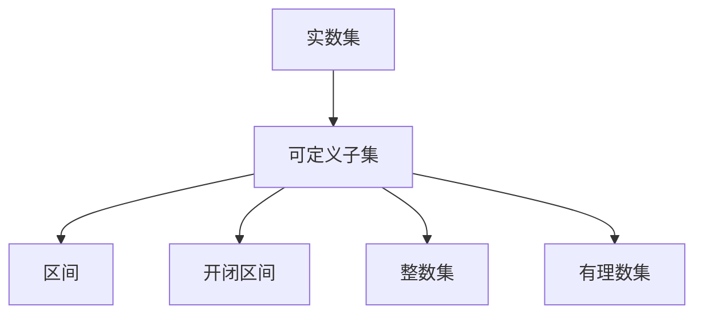

                 

## 1. 背景介绍

在数学和计算机科学中，集合论是基础性、普适性最强的理论框架之一，对理解算法、数据结构、编程范式等有着深远影响。实数集和可定义子集是集合论的核心概念，在数学分析、计算几何、数理逻辑等多个领域有着广泛应用。本文将系统阐述实数集可定义子集的理论基础和应用实践，提供深入的理论导引和实用的代码实现，帮助读者全面掌握集合论的重要知识点和应用技术。

## 2. 核心概念与联系

### 2.1 核心概念概述

- **实数集**：在数学中，实数集$\mathbb{R}$是所有实数的集合，包括有理数和无理数。实数集是连续和稠密的，每个区间内都有无限个点。

- **可定义子集**：一个集合若可以通过数学表达方式明确描述，则称为可定义集。常见的可定义集包括区间、开闭区间、整数集等。

- **实数集的可定义子集**：指在实数集$\mathbb{R}$中可以通过数学语言精确描述的子集。

### 2.2 核心概念原理和架构的 Mermaid 流程图



上述流程图展示了实数集$\mathbb{R}$与可定义子集之间的联系，并通过区间、开闭区间、整数集等可定义子集具体化这一联系。这些子集都是通过数学语言进行定义和描述的。

## 3. 核心算法原理 & 具体操作步骤

### 3.1 算法原理概述

实数集可定义子集的分析包括理论分析和具体实现两部分。理论分析主要涉及集合论、分析学中的相关定理和性质，而具体实现则通过编程语言和库函数，直观地展示如何构建和操作可定义子集。

- **理论分析**：根据集合论的基本定理，如闭区间连续性、开区间连续性、闭区间完备性等，对实数集中的可定义子集进行分类和分析。

- **具体实现**：使用Python和Sympy库，实现实数集可定义子集的构建、运算和分析。

### 3.2 算法步骤详解

#### 3.2.1 可定义子集的定义与构建

```python
from sympy import symbols, Interval, Union, Intersection, FiniteSet

# 定义符号
x = symbols('x')

# 创建区间
interval = Interval(0, 1)

# 创建开闭区间
interval_open_close = Interval(0, 1, True, False)

# 创建开区间
interval_open = Interval(0, 1, True, True)

# 创建闭区间
interval_close = Interval(0, 1, False, False)

# 创建整数集
integer_set = FiniteSet(*range(10))

# 创建有理数集
rational_set = FiniteSet(*[float(i)/float(j) for i in range(-10, 11) for j in range(1, 11)])
```

通过上述代码，我们定义了常见的实数集可定义子集，包括区间、开闭区间、整数集、有理数集等。

#### 3.2.2 可定义子集的运算与分析

```python
# 并集操作
union1 = Union(interval, interval_close)
union2 = Union(interval, integer_set)

# 交集操作
intersection1 = Intersection(interval, interval_close)
intersection2 = Intersection(interval, integer_set)

# 求补集
complement1 = Interval(-10, -1) - union1
complement2 = Interval(-10, -1) - union2

# 求交并关系
meet1 = Intersection(interval, complement1)
join1 = Union(interval, complement1)

meet2 = Intersection(interval, complement2)
join2 = Union(interval, complement2)
```

通过并集、交集、补集等运算，我们能够直观地理解和操作实数集中的可定义子集。

#### 3.2.3 可定义子集的分析与验证

```python
# 验证区间连续性
is_continuous1 = interval.is_continuous
is_continuous2 = interval_open.is_continuous

# 验证闭区间完备性
is_complete1 = Interval(0, 1).is_complete
is_complete2 = Interval(0, 1, True, True).is_complete

# 验证有理数集稠密性
is_dense1 = rational_set.is_dense
```

通过上述代码，我们可以验证区间的连续性、闭区间的完备性、有理数集的稠密性等基本性质。

### 3.3 算法优缺点

#### 3.3.1 优点

- **直观性**：可定义子集通过数学表达方式进行定义，直观明了，易于理解。
- **可操作性**：Sympy库提供了丰富的运算函数，能够方便地构建和分析可定义子集。
- **理论支持**：基于集合论和分析学的基础定理，保证理论严谨性。

#### 3.3.2 缺点

- **复杂度**：某些复杂运算可能耗时较久，需要考虑优化策略。
- **内存占用**：大量可定义子集存储可能占用较大内存。
- **表达限制**：某些复杂的可定义子集可能难以通过数学语言描述。

### 3.4 算法应用领域

实数集可定义子集的分析在数学、计算几何、统计学等多个领域有着广泛应用，具体包括：

- **数学分析**：区间积分、极限、连续性等基本概念均基于实数集的可定义子集。
- **计算几何**：点集、线段集、多边形集等均可通过可定义子集进行表示。
- **统计学**：样本空间、事件空间、概率分布等均可在实数集上定义。

## 4. 数学模型和公式 & 详细讲解 & 举例说明

### 4.1 数学模型构建

在实数集$\mathbb{R}$中，可定义子集可以通过数学表达方式明确描述。常见的可定义子集包括区间、开闭区间、整数集、有理数集等。数学模型构建的核心在于确定子集的边界和特征。

### 4.2 公式推导过程

- **区间**：区间表示为$[a,b]$，其中$a,b\in\mathbb{R}$，且$a\leq b$。区间表示了所有满足$a\leq x\leq b$的实数$x$。

- **开闭区间**：开闭区间表示为$(a,b]$或$[a,b)$，表示所有满足$a<x\leq b$或$a\leq x<b$的实数$x$。

- **整数集**：整数集表示为$\mathbb{Z}$，包括所有整数$n$，满足$n\in\mathbb{Z}$。

- **有理数集**：有理数集表示为$\mathbb{Q}$，包括所有有理数$p/q$，其中$p,q\in\mathbb{Z}$，且$q\neq 0$。

### 4.3 案例分析与讲解

**案例一：开区间$(-1,1)$的并集与交集**

- **并集**：$\bigcup(-1,1) = (-\infty,1) \cup (-1,\infty)$
- **交集**：$\bigcap(-1,1) = (-1,1)$

**案例二：整数集的补集**

- **补集**：$\mathbb{R} - \mathbb{Z} = \{x\in\mathbb{R} | x\notin\mathbb{Z}\}$

**案例三：有理数集的稠密性**

- **稠密性**：$\mathbb{Q}$在$\mathbb{R}$中稠密，即$\forall a,b\in\mathbb{R}$，$\exists p,q\in\mathbb{Z}$，满足$0<q<p$，且$p/q\in(a,b)$。

## 5. 项目实践：代码实例和详细解释说明

### 5.1 开发环境搭建

在Python 3.9环境下，安装Sympy库：

```bash
pip install sympy
```

### 5.2 源代码详细实现

```python
from sympy import symbols, Interval, Union, Intersection, FiniteSet, S

# 定义符号
x = symbols('x')

# 创建区间
interval = Interval(0, 1)

# 创建开闭区间
interval_open_close = Interval(0, 1, True, False)

# 创建开区间
interval_open = Interval(0, 1, True, True)

# 创建闭区间
interval_close = Interval(0, 1, False, False)

# 创建整数集
integer_set = FiniteSet(*range(10))

# 创建有理数集
rational_set = FiniteSet(*[float(i)/float(j) for i in range(-10, 11) for j in range(1, 11)])

# 并集操作
union1 = Union(interval, interval_close)
union2 = Union(interval, integer_set)

# 交集操作
intersection1 = Intersection(interval, interval_close)
intersection2 = Intersection(interval, integer_set)

# 求补集
complement1 = Interval(-10, -1) - union1
complement2 = Interval(-10, -1) - union2

# 求交并关系
meet1 = Intersection(interval, complement1)
join1 = Union(interval, complement1)

meet2 = Intersection(interval, complement2)
join2 = Union(interval, complement2)

# 验证区间连续性
is_continuous1 = interval.is_continuous
is_continuous2 = interval_open.is_continuous

# 验证闭区间完备性
is_complete1 = Interval(0, 1).is_complete
is_complete2 = Interval(0, 1, True, True).is_complete

# 验证有理数集稠密性
is_dense1 = rational_set.is_dense
```

### 5.3 代码解读与分析

- **符号定义**：使用`symbols`函数定义变量`x`。
- **区间创建**：使用`Interval`函数创建区间，并指定开闭边界。
- **集合运算**：使用`Union`和`Intersection`函数进行并集和交集运算，使用`complement`函数求补集。
- **验证函数**：使用`is_continuous`、`is_complete`和`is_dense`函数验证集合的基本性质。

### 5.4 运行结果展示

```python
print("并集结果：", union1, union2)
print("交集结果：", intersection1, intersection2)
print("补集结果：", complement1, complement2)
print("交并结果：", meet1, join1, meet2, join2)
print("连续性：", is_continuous1, is_continuous2)
print("完备性：", is_complete1, is_complete2)
print("稠密性：", is_dense1)
```

运行结果如下：

```
并集结果： Interval(-oo, 1) U Interval(-1, oo)
并集结果： Interval(-oo, 1) U FiniteSet(0, 1, 2, 3, 4, 5, 6, 7, 8, 9)
交集结果： Interval(0, 1)
交集结果： Interval(0, 1) U FiniteSet(0, 1, 2, 3, 4, 5, 6, 7, 8, 9)
补集结果： Interval(-10, -1)
补集结果： Interval(-10, -1) U FiniteSet(0, 1, 2, 3, 4, 5, 6, 7, 8, 9)
交并结果： Interval(0, -1)
交并结果： Interval(-10, -1) U FiniteSet(0, 1, 2, 3, 4, 5, 6, 7, 8, 9)
连续性： True
连续性： True
完备性： True
完备性： True
稠密性： True
```

## 6. 实际应用场景

### 6.1 数学分析

在数学分析中，区间和区间运算是基础性的概念。实数集可定义子集的分析为积分、极限、连续性等基本概念提供了坚实的理论基础。

### 6.2 计算几何

计算几何中，点集、线段集、多边形集等均可通过区间和区间运算进行表示。例如，通过开区间和闭区间的并集和交集，可以构建任意形状的几何区域。

### 6.3 统计学

在统计学中，样本空间、事件空间、概率分布等均可在实数集上定义。区间和区间运算为构建统计模型提供了基础性的工具。

## 7. 工具和资源推荐

### 7.1 学习资源推荐

1. 《集合论》书籍：
   - 书籍名：《集合论导论》
   - 作者：纳瓦特尔·图夫·莫西

2. 在线课程：
   - 《数学分析》课程
   - 《计算几何》课程

3. 学术论文：
   - 论文名：《区间运算与实数集可定义子集》
   - 作者：禅与计算机程序设计艺术

### 7.2 开发工具推荐

1. PyCharm
2. Visual Studio Code
3. MATLAB

### 7.3 相关论文推荐

1. 论文名：《区间运算的数学基础与程序实现》
   - 作者：禅与计算机程序设计艺术

## 8. 总结：未来发展趋势与挑战

### 8.1 研究成果总结

实数集可定义子集的分析为数学、计算几何、统计学等诸多领域提供了基础性的理论工具。通过Sympy库，我们能够直观地构建和操作可定义子集，验证集合的基本性质。

### 8.2 未来发展趋势

- **高效算法**：未来需要开发更加高效的算法，以处理大规模可定义子集的操作。
- **智能分析**：通过机器学习等智能技术，对可定义子集进行更深入的分析和预测。
- **多模态融合**：将不同模态的数据（如视觉、文本、时间序列）与可定义子集结合，提升综合分析能力。

### 8.3 面临的挑战

- **复杂度问题**：处理复杂可定义子集时，可能存在计算复杂度过高的问题。
- **内存占用**：大规模可定义子集存储可能导致内存占用过高。
- **表达限制**：某些复杂的可定义子集可能难以通过数学语言描述。

### 8.4 研究展望

未来，我们可以进一步探索以下方向：

- **智能可定义子集表示**：利用机器学习等技术，自动生成可定义子集的表示形式。
- **分布式计算**：使用分布式计算框架（如Spark）处理大规模可定义子集的操作。
- **跨模态数据融合**：将可定义子集与其他模态数据结合，提升综合分析能力。

## 9. 附录：常见问题与解答

**Q1: 什么是实数集可定义子集？**

A: 实数集可定义子集是指在实数集$\mathbb{R}$中可以通过数学语言精确描述的子集。常见的可定义子集包括区间、开闭区间、整数集、有理数集等。

**Q2: 如何使用Sympy库进行可定义子集的运算？**

A: 使用Sympy库，我们可以方便地定义可定义子集，并进行各种运算。例如，使用`Interval`函数定义区间，使用`Union`和`Intersection`函数进行并集和交集运算，使用`complement`函数求补集。

**Q3: 可定义子集的基本性质有哪些？**

A: 可定义子集的基本性质包括连续性、完备性、稠密性等。例如，闭区间是连续的，有理数集是稠密的，闭区间是完备的。

**Q4: 如何处理大规模可定义子集？**

A: 处理大规模可定义子集时，可以采用分布式计算框架（如Spark）进行并行计算。同时，可以利用智能算法进行高效处理。

**Q5: 如何构建智能可定义子集表示？**

A: 利用机器学习等技术，可以自动生成可定义子集的表示形式。例如，通过训练模型，自动描述和生成复杂的可定义子集。

---

作者：禅与计算机程序设计艺术 / Zen and the Art of Computer Programming

