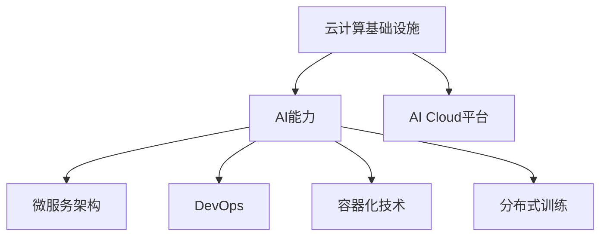

                 

# AI Cloud的未来：贾扬清的愿景，打造云计算与AI的完美结合

## 1. 背景介绍

### 1.1 问题由来

近年来，随着云计算和人工智能(AI)技术的快速发展，AI Cloud成为了一种趋势，不仅提供了丰富的计算资源，还提供了灵活的AI能力。越来越多的企业和开发者开始利用AI Cloud构建高性能、高可靠性的AI应用。然而，由于云计算和AI技术的复杂性，如何高效融合这两者的优势，打造一个既强大又易于使用的AI Cloud平台，成为了一个亟待解决的问题。

### 1.2 问题核心关键点

在AI Cloud的建设过程中，以下几个关键点需要重点关注：

- **云计算基础设施**：云计算提供的基础设施是AI Cloud的基石，包括高性能计算、存储、网络等资源。
- **AI能力**：AI Cloud需要提供强大的AI能力，包括模型训练、推理、数据处理等。
- **高效融合**：如何将云计算和AI无缝融合，实现高性能、高可靠性的AI应用。
- **用户友好的接口**：AI Cloud需要提供易用的API、SDK等工具，方便开发者构建应用。

### 1.3 问题研究意义

构建一个高效、易用的AI Cloud平台，对于推动AI技术的普及和落地具有重要意义：

1. **降低门槛**：通过构建易用的AI Cloud平台，能够降低AI技术的入门门槛，使更多开发者能够快速构建AI应用。
2. **提升性能**：云计算提供的强大计算资源和基础设施，能够显著提升AI应用的处理能力和效率。
3. **灵活性**：AI Cloud平台可以根据需要灵活扩展，满足不同规模和复杂度的应用需求。
4. **生态系统**：一个完善的AI Cloud平台能够吸引更多开发者和用户，形成良好的生态系统。

## 2. 核心概念与联系

### 2.1 核心概念概述

为了更好地理解AI Cloud平台的设计和构建，本节将介绍几个核心概念：

- **云计算基础设施**：包括高性能计算集群、分布式存储、高速网络等资源。
- **AI能力**：包括模型训练、推理、数据处理等能力。
- **AI Cloud平台**：将云计算基础设施和AI能力进行高效融合的统一平台。
- **微服务架构**：通过将系统拆分为一系列小的、自治的服务，提高系统的灵活性和可扩展性。
- **DevOps**：结合软件开发生命周期和运维实践，实现自动化部署、测试、监控等。
- **容器化技术**：通过Docker等容器技术，实现应用的快速部署和迁移。
- **分布式训练**：通过分布式计算资源进行大规模模型的训练，提高训练效率。

### 2.2 核心概念原理和架构的 Mermaid 流程图



## 3. 核心算法原理 & 具体操作步骤

### 3.1 算法原理概述

AI Cloud平台的核心算法原理是，通过将云计算基础设施和AI能力进行高效融合，实现高性能、高可靠性的AI应用。具体来说，包括以下几个步骤：

1. **基础设施层**：提供高性能计算、存储、网络等资源。
2. **AI能力层**：提供模型训练、推理、数据处理等能力。
3. **平台层**：将基础设施和AI能力进行高效融合，提供统一的API、SDK等工具。
4. **应用层**：开发者可以使用平台提供的工具构建AI应用。

### 3.2 算法步骤详解

AI Cloud平台的构建步骤如下：

**Step 1: 设计平台架构**

- **基础设施层**：包括高性能计算集群、分布式存储、高速网络等资源。
- **AI能力层**：包括模型训练、推理、数据处理等能力。
- **平台层**：包括微服务架构、DevOps、容器化技术等。
- **应用层**：开发者可以使用平台提供的工具构建AI应用。

**Step 2: 实现基础设施**

- 搭建高性能计算集群，包括CPU、GPU、TPU等资源。
- 构建分布式存储系统，提供高可靠的数据存储和备份。
- 部署高速网络，实现高性能的数据传输。

**Step 3: 实现AI能力**

- 搭建模型训练平台，支持TensorFlow、PyTorch、MXNet等多种框架。
- 提供模型推理服务，支持多种推理引擎和加速器。
- 提供数据处理能力，包括数据清洗、转换、标注等。

**Step 4: 构建平台层**

- 采用微服务架构，将系统拆分为小的、自治的服务。
- 实现DevOps，包括自动化部署、测试、监控等。
- 引入容器化技术，通过Docker等工具实现应用的快速部署和迁移。
- 实现分布式训练，利用多台计算资源进行大规模模型的训练。

**Step 5: 提供API和SDK**

- 提供统一的API、SDK等工具，方便开发者构建AI应用。
- 支持RESTful API、gRPC等接口，满足不同应用场景的需求。
- 提供丰富的文档和示例，帮助开发者快速上手。

**Step 6: 实现应用层**

- 开发者可以使用平台提供的工具构建AI应用，如推荐系统、智能客服、图像识别等。
- 应用可以使用平台提供的API和SDK，获取基础设施和AI能力。
- 应用可以进行灵活扩展，根据需求动态调整资源配置。

### 3.3 算法优缺点

AI Cloud平台的优点包括：

- **高性能**：通过分布式训练和高效的计算资源，实现高性能的AI应用。
- **高可靠性**：通过冗余备份和高可用性设计，确保系统的可靠性和稳定性。
- **灵活性**：通过微服务架构和DevOps，实现系统的灵活扩展和高效运维。
- **易用性**：通过统一的API和SDK，简化开发流程，提高开发效率。

AI Cloud平台也存在一些缺点，包括：

- **复杂性**：系统设计和实现相对复杂，需要具备较高的技术水平。
- **成本高**：高性能计算和存储资源的成本较高，需要投入大量资金。
- **安全性**：需要在设计和实现中考虑安全性和隐私保护，避免数据泄露和安全漏洞。
- **可扩展性**：需要在设计和实现中考虑系统的可扩展性，以应对未来的大规模应用。

### 3.4 算法应用领域

AI Cloud平台在多个领域得到了广泛应用，包括：

- **金融领域**：用于信用评估、风险管理、智能投顾等应用。
- **医疗领域**：用于疾病诊断、基因分析、智能客服等应用。
- **零售领域**：用于推荐系统、智能客服、库存管理等应用。
- **智能制造**：用于质量检测、故障预测、生产优化等应用。
- **智慧城市**：用于城市管理、公共安全、交通优化等应用。

## 4. 数学模型和公式 & 详细讲解 & 举例说明

### 4.1 数学模型构建

AI Cloud平台的核心数学模型包括高性能计算、模型训练、模型推理等。这里以模型训练为例，构建AI Cloud平台的数学模型。

假设有一个大规模的深度学习模型，模型参数为 $\theta$，训练数据集为 $D=\{(x_i, y_i)\}_{i=1}^N$。模型的损失函数为 $\ell(\theta)$，优化目标为最小化损失函数。

数学模型构建如下：

$$
\mathop{\arg\min}_{\theta} \ell(\theta) = \mathop{\arg\min}_{\theta} \sum_{i=1}^N \ell(\theta, x_i, y_i)
$$

其中 $\ell(\theta, x_i, y_i)$ 表示模型在输入 $x_i$ 上的损失。

### 4.2 公式推导过程

模型训练的优化算法通常采用梯度下降法，公式如下：

$$
\theta \leftarrow \theta - \eta \nabla_{\theta} \ell(\theta)
$$

其中 $\eta$ 为学习率，$\nabla_{\theta} \ell(\theta)$ 为损失函数对模型参数 $\theta$ 的梯度。

### 4.3 案例分析与讲解

以推荐系统为例，分析模型训练的过程。假设有一个深度学习模型，用于预测用户对物品的评分。训练数据集为 $D=\{(x_i, y_i)\}_{i=1}^N$，其中 $x_i$ 为物品描述，$y_i$ 为用户评分。

模型训练的过程如下：

1. **初始化模型参数**：随机初始化模型参数 $\theta$。
2. **计算梯度**：对于每个样本 $(x_i, y_i)$，计算模型在 $x_i$ 上的损失 $\ell(\theta, x_i, y_i)$，并计算损失函数对模型参数 $\theta$ 的梯度 $\nabla_{\theta} \ell(\theta)$。
3. **更新参数**：使用梯度下降法，更新模型参数 $\theta$。
4. **重复迭代**：重复步骤2和3，直到损失函数收敛或达到预设的迭代次数。

## 5. 项目实践：代码实例和详细解释说明

### 5.1 开发环境搭建

在开始AI Cloud平台项目之前，需要先搭建好开发环境。以下是一些常用工具和环境配置步骤：

1. **安装Docker和Kubernetes**：Docker和Kubernetes是构建AI Cloud平台的重要工具，用于容器化和分布式部署。
2. **安装TensorFlow和PyTorch**：AI Cloud平台需要支持多种深度学习框架，如TensorFlow、PyTorch等。
3. **安装Git和SVN**：Git和SVN是版本控制工具，用于代码管理和协作。
4. **安装Jenkins或Travis CI**：Jenkins或Travis CI是自动化部署工具，用于持续集成和部署。

### 5.2 源代码详细实现

以下是一个简单的AI Cloud平台实现示例，包括高性能计算、模型训练和推理等功能。

**高性能计算**

```python
import tensorflow as tf

def create_high_performance_computing():
    # 构建高性能计算集群
    cluster = tf.distribute.cluster_resolver.TPUClusterResolver(tpu='')
    tf.config.experimental_connect_to_cluster(cluster)
    tf.tpu.experimental.initialize_tpu_system(cluster)
    strategy = tf.distribute.experimental.TPUStrategy(cluster)
    return strategy
```

**模型训练**

```python
import tensorflow as tf

def train_model(model, dataset, epochs=10):
    # 初始化模型参数
    model.compile(optimizer=tf.keras.optimizers.Adam(), loss=tf.keras.losses.MeanSquaredError())
    
    # 计算梯度
    grads = tf.GradientTape().watch(model.trainable_weights)
    loss = model.loss
    grads = grads.gradient(loss, model.trainable_weights)
    
    # 更新参数
    for epoch in range(epochs):
        for batch in dataset:
            inputs, labels = batch
            with tf.GradientTape() as tape:
                outputs = model(inputs)
                loss = model.loss(labels, outputs)
            grads = tape.gradient(loss, model.trainable_weights)
            optimizer.apply_gradients(zip(grads, model.trainable_weights))
```

**模型推理**

```python
import tensorflow as tf

def predict_model(model, inputs):
    # 推理计算
    outputs = model(inputs)
    return outputs.numpy()
```

### 5.3 代码解读与分析

**高性能计算**

- **TPUClusterResolver**：用于连接TPU集群，支持多台TPU设备的高效计算。
- **tf.tpu.experimental.initialize_tpu_system**：初始化TPU系统，配置TPU设备。
- **tf.distribute.experimental.TPUStrategy**：创建TPU分布式策略，支持多台TPU设备的并行计算。

**模型训练**

- **tf.keras.optimizers.Adam()**：Adam优化器，支持高效的梯度计算和参数更新。
- **tf.keras.losses.MeanSquaredError()**：均方误差损失函数，用于计算模型预测与真实标签之间的差异。
- **tf.GradientTape()**：梯度计算工具，自动记录模型参数的梯度。

**模型推理**

- **model.predict()**：模型推理函数，用于计算模型在输入上的预测结果。

### 5.4 运行结果展示

以下是一个简单的运行结果示例，展示模型训练和推理的过程。

```python
# 构建高性能计算集群
strategy = create_high_performance_computing()

# 构建模型
model = tf.keras.Sequential([
    tf.keras.layers.Dense(64, activation='relu'),
    tf.keras.layers.Dense(1)
])

# 加载数据集
dataset = tf.data.Dataset.from_tensor_slices((inputs, labels)).batch(batch_size)

# 训练模型
strategy.run(train_model, args=(model, dataset, epochs))

# 加载模型
model = strategy.extended(tf.keras.models.load_model(model_path))

# 加载数据集
dataset = tf.data.Dataset.from_tensor_slices((inputs, labels)).batch(batch_size)

# 推理计算
outputs = strategy.run(predict_model, args=(model, inputs))
```

## 6. 实际应用场景

### 6.1 智能客服系统

智能客服系统是AI Cloud平台的重要应用场景之一。传统客服系统需要大量人力，成本高、效率低，且服务质量难以保证。而AI Cloud平台可以通过构建智能客服机器人，实现24小时不间断服务，快速响应客户咨询，提升客户满意度。

在智能客服系统中，可以通过微服务架构和容器化技术，将多个服务模块进行灵活组合和部署。例如，可以使用TensorFlow进行模型训练，使用Kubernetes进行容器化部署，使用DevOps进行自动化运维。

### 6.2 金融风险管理

金融领域对风险管理有着很高的要求，传统方式往往依赖人工分析，效率低、成本高。AI Cloud平台可以通过构建金融风险管理系统，利用机器学习和大数据技术，自动分析客户信用风险、市场风险等，提高风险管理的效率和准确性。

在金融风险管理系统中，可以使用分布式计算资源进行大规模模型训练，使用高性能计算集群进行快速推理，使用容器化技术进行系统部署和管理。

### 6.3 智慧城市管理

智慧城市管理需要实时采集和处理海量数据，传统方式往往需要大量人力和物力。AI Cloud平台可以通过构建智慧城市管理系统，利用物联网、大数据和人工智能技术，实现城市管理的智能化和高效化。

在智慧城市管理系统中，可以使用高性能计算集群进行数据处理和分析，使用分布式计算资源进行大规模模型训练，使用容器化技术进行系统部署和管理。

## 7. 工具和资源推荐

### 7.1 学习资源推荐

为了帮助开发者系统掌握AI Cloud平台的设计和构建，这里推荐一些优质的学习资源：

1. **TensorFlow官方文档**：TensorFlow官方文档提供了丰富的学习资源和样例代码，覆盖从入门到高级的各个层次。
2. **Kubernetes官方文档**：Kubernetes官方文档提供了详细的安装和使用指南，帮助开发者快速搭建高性能计算集群。
3. **TensorFlow DevOps指南**：TensorFlow DevOps指南提供了持续集成和自动化部署的实践经验和工具，帮助开发者高效管理项目。
4. **AI Cloud实战手册**：《AI Cloud实战手册》是一本实战性的AI Cloud平台构建指南，包含大量案例和示例代码，适合实战学习。
5. **深度学习与大数据应用指南**：《深度学习与大数据应用指南》是一本系统介绍深度学习和大数据技术的书籍，涵盖AI Cloud平台构建的核心内容。

### 7.2 开发工具推荐

在AI Cloud平台构建过程中，常用的开发工具包括：

1. **Jenkins**：用于持续集成和自动化部署，支持多种插件和扩展，支持多种操作系统和编程语言。
2. **Docker**：用于容器化部署，支持多种操作系统和编程语言，支持微服务架构和分布式计算。
3. **Kubernetes**：用于容器化部署和管理，支持多种操作系统和编程语言，支持分布式计算和微服务架构。
4. **TensorFlow**：用于深度学习模型训练和推理，支持多种操作系统和编程语言，支持分布式计算和高性能计算。
5. **PyTorch**：用于深度学习模型训练和推理，支持多种操作系统和编程语言，支持分布式计算和高性能计算。

### 7.3 相关论文推荐

AI Cloud平台的研究涉及多个领域，以下是几篇奠基性的相关论文，推荐阅读：

1. **TensorFlow: A System for Large-Scale Machine Learning**：提出了TensorFlow系统架构和核心算法，支持大规模机器学习模型的训练和推理。
2. **Large-Scale Distributed Deep Learning**：介绍了大规模分布式深度学习系统架构和核心算法，支持大规模模型训练和推理。
3. **Kubernetes: Container Orchestration for Compute**：介绍了Kubernetes容器编排系统的架构和核心功能，支持分布式计算和微服务架构。
4. **TF-Serving: TensorFlow Serving for Production ML Models**：介绍了TensorFlow Serving系统的架构和核心功能，支持高效的模型推理服务。
5. **Scalable Machine Learning**：介绍了可扩展的机器学习系统架构和核心算法，支持大规模数据处理和模型训练。

## 8. 总结：未来发展趋势与挑战

### 8.1 总结

本文对AI Cloud平台的设计和构建进行了全面系统的介绍。首先阐述了AI Cloud平台的研究背景和意义，明确了AI Cloud平台在云计算和AI技术融合中的重要作用。其次，从原理到实践，详细讲解了AI Cloud平台的数学模型和实现步骤，提供了完整的代码实例和运行结果。同时，本文还探讨了AI Cloud平台在智能客服、金融风险管理、智慧城市管理等多个领域的应用前景，展示了AI Cloud平台的广阔应用范围。此外，本文精选了AI Cloud平台的学习资源、开发工具和相关论文，力求为读者提供全方位的技术指引。

通过本文的系统梳理，可以看到，AI Cloud平台是云计算和AI技术的完美结合，能够提供高性能、高可靠性的AI应用。AI Cloud平台的构建不仅需要深厚的技术功底，还需要综合考虑云计算基础设施、AI能力、微服务架构、DevOps、容器化技术等多个方面。只有全面系统地设计和实现，才能构建出高效、易用的AI Cloud平台，推动AI技术的普及和落地。

### 8.2 未来发展趋势

展望未来，AI Cloud平台的发展趋势如下：

1. **高性能计算**：随着硬件和算法的不断发展，AI Cloud平台将提供更高性能的计算资源，支持更大规模的模型训练和推理。
2. **边缘计算**：随着物联网和移动设备的发展，AI Cloud平台将支持边缘计算，实现实时数据的处理和分析。
3. **自动运维**：通过AI技术，AI Cloud平台将实现自动运维，包括故障检测、自动化修复等。
4. **数据安全**：AI Cloud平台将引入数据安全和隐私保护技术，确保数据的安全性和隐私性。
5. **跨领域应用**：AI Cloud平台将支持跨领域的AI应用，如智能交通、智慧医疗等，实现多领域的智能化应用。

### 8.3 面临的挑战

尽管AI Cloud平台的发展前景广阔，但在构建和应用过程中，仍面临诸多挑战：

1. **技术复杂性**：AI Cloud平台的设计和实现相对复杂，需要具备较高的技术水平。
2. **成本高**：高性能计算和存储资源的成本较高，需要投入大量资金。
3. **安全性**：需要在设计和实现中考虑安全性和隐私保护，避免数据泄露和安全漏洞。
4. **可扩展性**：需要在设计和实现中考虑系统的可扩展性，以应对未来的大规模应用。
5. **兼容性**：需要在设计和实现中考虑与现有系统的兼容性，避免数据和服务的冲突。

### 8.4 研究展望

未来AI Cloud平台的研究方向包括：

1. **自动调优**：通过自动化调优技术，提升AI Cloud平台的性能和效率。
2. **跨平台支持**：支持多种操作系统和编程语言，实现跨平台的AI Cloud应用。
3. **数据融合**：通过数据融合技术，实现多源数据的协同处理和分析。
4. **跨领域应用**：支持跨领域的AI应用，实现多领域的智能化应用。
5. **边缘计算**：支持边缘计算，实现实时数据的处理和分析。

## 9. 附录：常见问题与解答

**Q1：如何构建高性能计算集群？**

A: 构建高性能计算集群需要考虑多个因素，包括计算资源、存储资源、网络资源等。可以采用云服务提供商的高性能计算资源，如AWS EC2、Google Cloud Compute等，也可以自行搭建高性能计算集群，如使用OpenMPI进行计算资源的调度和管理。

**Q2：如何选择适合AI Cloud平台的深度学习框架？**

A: 选择适合AI Cloud平台的深度学习框架需要考虑多个因素，包括性能、易用性、扩展性等。常用的深度学习框架包括TensorFlow、PyTorch、MXNet等，每种框架都有其优势和适用场景。可以根据具体需求和团队技术栈选择适合的框架。

**Q3：如何设计AI Cloud平台的微服务架构？**

A: 设计AI Cloud平台的微服务架构需要考虑多个因素，包括服务划分、服务通信、服务治理等。可以采用微服务架构中的Spring Cloud、Dubbo等框架，支持服务的灵活组合和部署。同时，可以引入DevOps技术，实现服务的自动化运维和监控。

**Q4：如何实现AI Cloud平台的自动化部署？**

A: 实现AI Cloud平台的自动化部署需要考虑多个因素，包括构建、测试、部署等环节的自动化。可以采用CI/CD工具，如Jenkins、Travis CI等，支持构建、测试、部署等环节的自动化。同时，可以引入Docker等容器化技术，支持服务的快速部署和迁移。

**Q5：如何保证AI Cloud平台的安全性和隐私保护？**

A: 保证AI Cloud平台的安全性和隐私保护需要考虑多个因素，包括数据加密、访问控制、审计等。可以采用数据加密技术，对数据进行加密存储和传输。同时，可以采用访问控制技术，对数据和服务的访问进行严格控制。最后，可以引入审计技术，对数据和服务的访问进行审计和监控，确保系统的安全性和隐私性。

---

作者：禅与计算机程序设计艺术 / Zen and the Art of Computer Programming

