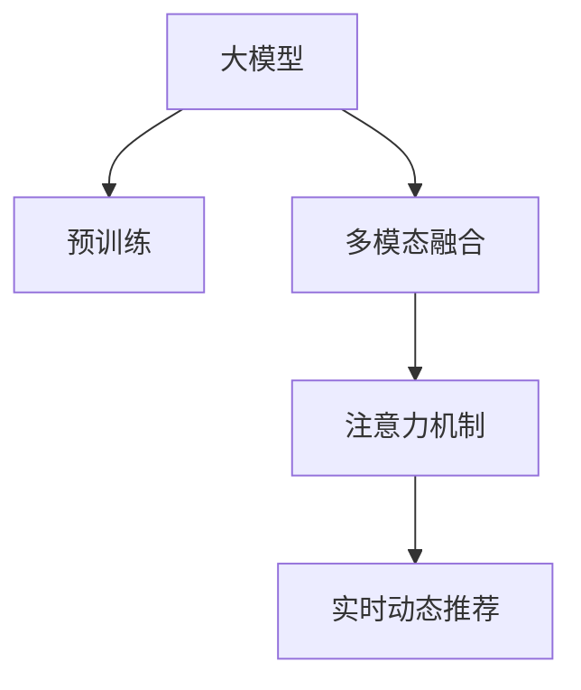

                 

# AI 大模型在搜索推荐系统中的融合技术：电商平台的算法本质探索

> 关键词：大模型融合, 搜索推荐, 电商推荐, 多模态融合, 注意力机制, 自然语言处理(NLP), 视觉语义融合

## 1. 背景介绍

### 1.1 问题由来

随着电商市场的迅速发展，用户对商品搜索推荐系统的体验要求越来越高。传统的搜索推荐系统主要依赖于特征工程和机器学习模型，需要手动设计和调试特征，对数据质量和模型性能要求较高。而近年来，随着深度学习技术和大模型的兴起，基于大模型的搜索推荐系统逐步成为主流，能够通过预训练语言模型、视觉语义模型等多模态模型的融合，实现更加个性化、精准的推荐。

大模型在电商平台的推荐系统中的应用，体现了AI技术在产业应用中的落地，对提升用户购物体验、提升平台收入、优化库存管理等方面具有重要意义。因此，本文旨在深入探索大模型在搜索推荐系统中的融合技术，并讨论其在电商平台中的实际应用。

### 1.2 问题核心关键点

本文将重点探讨以下核心问题：
1. 大模型在电商搜索推荐系统中的融合方法及其原理。
2. 电商搜索推荐系统的数据结构与特征工程。
3. 大模型在电商推荐系统中的应用场景及其效果。
4. 电商搜索推荐系统中的多模态融合技术及其实现。
5. 电商搜索推荐系统中的注意力机制及其实现。
6. 电商搜索推荐系统中的实时动态推荐技术及其实现。

## 2. 核心概念与联系

### 2.1 核心概念概述

为更好地理解大模型在电商搜索推荐系统中的融合技术，本节将介绍几个密切相关的核心概念：

- 大模型（Big Model）：以自回归（如GPT）或自编码（如BERT）模型为代表的大规模预训练语言模型。通过在大规模无标签文本语料上进行预训练，学习通用的语言表示，具备强大的语言理解和生成能力。
- 预训练（Pre-training）：指在大规模无标签文本语料上，通过自监督学习任务训练通用语言模型的过程。常见的预训练任务包括言语建模、遮挡语言模型等。
- 多模态融合（Multimodal Fusion）：将不同模态的数据（如文本、图像、语音等）进行深度融合，形成更加全面、准确的表示，提高系统的泛化能力和鲁棒性。
- 注意力机制（Attention Mechanism）：通过注意力机制（如Transformer中的Self-Attention）对输入数据中的关键特征进行加权，提升模型的预测能力和泛化能力。
- 实时动态推荐（Real-time Dynamic Recommendation）：通过在线学习、增量更新等技术，实时调整模型参数，提高推荐系统的实时性和个性化程度。

这些核心概念之间的逻辑关系可以通过以下Mermaid流程图来展示：



这个流程图展示了大模型在搜索推荐系统中的核心概念及其之间的关系：

1. 大模型通过预训练获得基础能力。
2. 多模态融合使得模型能够综合不同模态的信息，提升表示能力。
3. 注意力机制对输入数据进行加权处理，提升模型关注重要特征的能力。
4. 实时动态推荐使得模型能够在线学习新信息，保持推荐结果的时效性。

这些概念共同构成了电商搜索推荐系统的技术基础，使得大模型能够在电商领域中发挥强大的推荐能力。

## 3. 核心算法原理 & 具体操作步骤
### 3.1 算法原理概述

大模型在电商搜索推荐系统中的融合技术，本质上是通过多模态融合和注意力机制，将文本、图像、用户行为等不同模态的数据进行深度整合，形成更加全面、准确的表示。在大模型的基础上，通过在线学习、增量更新等实时动态推荐技术，不断优化推荐模型，提高推荐效果。

具体来说，算法流程如下：

1. 预处理：对用户查询、商品信息、用户行为等数据进行清洗、标准化和特征提取。
2. 大模型融合：将不同模态的数据输入到预训练的大模型中，通过多模态融合和注意力机制进行深度整合，形成综合表示。
3. 实时动态推荐：通过在线学习、增量更新等技术，实时调整模型参数，提高推荐系统的实时性和个性化程度。

### 3.2 算法步骤详解

以下是详细的算法步骤：

**Step 1: 数据预处理**

电商搜索推荐系统中的数据通常包括用户查询、商品信息、用户行为等。预处理过程包括：

- 数据清洗：去除噪声和异常值，保证数据质量。
- 特征提取：将数据转化为模型可接受的格式，如向量表示、特征向量等。
- 标准化：对不同来源的数据进行标准化处理，保证一致性。

**Step 2: 多模态融合**

多模态融合的核心是将不同模态的数据进行深度整合，形成更加全面、准确的表示。具体来说，可以将以下几类数据进行融合：

- 文本数据：将用户查询、商品描述等文本数据输入到大模型中，提取文本表示。
- 图像数据：将商品图片等图像数据输入到大模型中，提取图像特征。
- 用户行为数据：将用户浏览、点击、购买等行为数据输入到大模型中，提取行为表示。

多模态融合的过程通常包括以下几个步骤：

- 数据对齐：将不同模态的数据对齐到同一维度，便于融合。
- 特征拼接：将不同模态的特征向量拼接在一起，形成综合表示。
- 加权融合：对拼接后的特征向量进行加权处理，提升重要特征的贡献。

**Step 3: 注意力机制**

注意力机制是一种重要的深度学习技术，通过将输入数据中的关键特征进行加权，提升模型的预测能力和泛化能力。在电商搜索推荐系统中，注意力机制通常用于以下几个方面：

- 文本注意力：对用户查询和商品描述进行注意力加权，提升模型对关键字的关注度。
- 图像注意力：对商品图片进行注意力加权，提升模型对商品细节的关注度。
- 行为注意力：对用户行为进行注意力加权，提升模型对用户偏好的关注度。

**Step 4: 实时动态推荐**

实时动态推荐是一种在线学习技术，通过增量更新模型参数，不断优化推荐结果。具体来说，包括以下几个步骤：

- 在线学习：对新数据进行增量学习，实时调整模型参数。
- 模型更新：通过在线学习，定期对模型进行更新，保持推荐结果的时效性。
- 实时反馈：对推荐结果进行实时反馈，不断优化推荐模型。

### 3.3 算法优缺点

大模型在电商搜索推荐系统中的融合技术具有以下优点：

1. 综合性强：能够综合文本、图像、用户行为等多模态数据，形成更加全面、准确的表示。
2. 泛化能力强：通过多模态融合和注意力机制，提升模型的泛化能力和鲁棒性。
3. 实时性好：通过实时动态推荐技术，能够快速调整推荐结果，提升用户体验。

同时，该方法也存在一些缺点：

1. 计算成本高：多模态融合和注意力机制需要大量的计算资源，对硬件要求较高。
2. 数据需求大：需要收集大量高质量的文本、图像、用户行为等数据，数据获取成本较高。
3. 模型复杂度高：多模态融合和注意力机制使得模型结构复杂，难以调试和优化。
4. 模型可解释性不足：大模型往往是一个黑盒系统，难以解释其内部工作机制和决策逻辑。

尽管存在这些缺点，但就目前而言，大模型在电商搜索推荐系统中的应用范式，仍然是大数据、深度学习和人工智能技术的典型代表，具有重要的理论意义和实际价值。

### 3.4 算法应用领域

大模型在电商搜索推荐系统中的应用，主要体现在以下几个方面：

1. 商品搜索：通过将用户查询输入到大模型中，提取文本表示，与商品文本进行相似度计算，实现商品搜索结果的排序。
2. 商品推荐：通过将用户行为数据和商品数据输入到大模型中，提取行为和商品表示，使用多模态融合和注意力机制，实现商品推荐的排序。
3. 个性化推荐：通过实时动态推荐技术，对用户行为进行在线学习，不断调整推荐模型，实现个性化推荐。
4. 商品评价：通过将商品图片输入到大模型中，提取图像特征，与用户评价进行相似度计算，实现商品评价结果的排序。
5. 库存管理：通过将用户行为数据输入到大模型中，提取行为表示，实现库存管理的优化。

## 4. 数学模型和公式 & 详细讲解 & 举例说明（备注：数学公式请使用latex格式，latex嵌入文中独立段落使用 $$，段落内使用 $)
### 4.1 数学模型构建

在大模型在电商搜索推荐系统中的融合技术中，数学模型构建是核心之一。假设用户查询为 $x$，商品描述为 $y$，用户行为为 $z$，大模型为 $M$，多模态融合后的表示为 $H$，注意力权重为 $\alpha$，实时动态推荐的目标为 $R$。数学模型可以表示为：

$$
R = f(M(x, y, z, \alpha))
$$

其中 $f$ 为推荐模型，可以是线性回归、深度神经网络等。

### 4.2 公式推导过程

以下是对推荐模型的推导过程：

**Step 1: 多模态融合**

假设用户查询为 $x$，商品描述为 $y$，用户行为为 $z$，预训练大模型的嵌入矩阵为 $W$，文本表示为 $v_x$，图像表示为 $v_y$，行为表示为 $v_z$。假设 $v_x$、$v_y$、$v_z$ 的维度均为 $d$，则多模态融合的过程可以表示为：

$$
H = (v_x \oplus v_y \oplus v_z) W
$$

其中 $\oplus$ 表示拼接操作，$W$ 为融合矩阵，可以采用不同的融合方式，如拼接、加权融合等。

**Step 2: 注意力机制**

注意力机制通过将输入数据中的关键特征进行加权，提升模型的预测能力和泛化能力。假设输入向量为 $u$，注意力权重为 $\alpha$，注意力机制的计算过程可以表示为：

$$
\alpha = \frac{\exp(\text{score}(u))}{\sum_{u' \in U} \exp(\text{score}(u'))}
$$

其中 $U$ 为所有输入向量构成的集合，$\text{score}(u)$ 为注意力函数，可以采用点积、余弦相似度等方法计算。

**Step 3: 实时动态推荐**

实时动态推荐通过在线学习、增量更新等技术，实时调整模型参数，提高推荐系统的实时性和个性化程度。假设当前推荐模型为 $M_t$，新数据为 $d$，在线学习的过程可以表示为：

$$
M_{t+1} = M_t - \eta \nabla_{M_t} \mathcal{L}(M_t, d)
$$

其中 $\eta$ 为学习率，$\nabla_{M_t} \mathcal{L}(M_t, d)$ 为目标函数 $L$ 对模型参数 $M_t$ 的梯度，可以采用交叉熵、均方误差等损失函数。

### 4.3 案例分析与讲解

以电商平台的个性化推荐系统为例，分析大模型在推荐中的融合技术。假设电商平台的用户 $u$ 浏览了商品 $i$、商品 $j$ 和商品 $k$，购买了商品 $l$。电商平台将用户 $u$ 的浏览行为、点击行为和购买行为分别表示为 $z_u$、$y_u$ 和 $z_l$。假设电商平台的推荐模型为 $M$，通过多模态融合和注意力机制，将用户行为 $z_u$、商品行为 $y_i$、$y_j$、$y_k$ 和 $y_l$ 进行融合，得到综合表示 $H_u$，使用注意力机制对用户行为进行加权，得到最终推荐结果 $R_u$。

假设推荐模型的损失函数为交叉熵损失，则推荐过程可以表示为：

$$
R_u = f(M(H_u, z_l))
$$

$$
\mathcal{L} = -\sum_{u \in U} \sum_{i \in I} y_i \log R_u
$$

其中 $U$ 为用户集合，$I$ 为商品集合，$y_i$ 为商品是否被推荐。

## 5. 项目实践：代码实例和详细解释说明
### 5.1 开发环境搭建

在进行电商推荐系统开发前，我们需要准备好开发环境。以下是使用Python进行PyTorch开发的环境配置流程：

1. 安装Anaconda：从官网下载并安装Anaconda，用于创建独立的Python环境。

2. 创建并激活虚拟环境：
```bash
conda create -n ecommerce-env python=3.8 
conda activate ecommerce-env
```

3. 安装PyTorch：根据CUDA版本，从官网获取对应的安装命令。例如：
```bash
conda install pytorch torchvision torchaudio cudatoolkit=11.1 -c pytorch -c conda-forge
```

4. 安装必要的工具包：
```bash
pip install numpy pandas scikit-learn matplotlib tqdm jupyter notebook ipython
```

完成上述步骤后，即可在`ecommerce-env`环境中开始电商推荐系统的开发。

### 5.2 源代码详细实现

这里我们以电商平台的个性化推荐系统为例，给出使用PyTorch进行大模型融合的代码实现。

首先，定义多模态融合函数：

```python
import torch
import torch.nn as nn
import torch.nn.functional as F

class MultimodalFusion(nn.Module):
    def __init__(self, text_size, image_size, behavior_size, fuse_size):
        super(MultimodalFusion, self).__init__()
        self.fusion = nn.Linear(text_size + image_size + behavior_size, fuse_size)
        self.attention = nn.Linear(fuse_size, fuse_size)
        self.nonlinear = nn.ReLU()
    
    def forward(self, text, image, behavior):
        fusion = self.fusion(torch.cat([text, image, behavior], dim=1))
        attention = self.attention(fusion)
        fusion = self.nonlinear(attention)
        return fusion
```

然后，定义注意力机制函数：

```python
class Attention(nn.Module):
    def __init__(self, fuse_size):
        super(Attention, self).__init__()
        self.score = nn.Linear(fuse_size, 1)
    
    def forward(self, fusion):
        attention = torch.exp(self.score(fusion))
        attention = attention / attention.sum(dim=1, keepdim=True)
        return attention
```

接着，定义推荐模型函数：

```python
class RecommendationModel(nn.Module):
    def __init__(self, fuse_size, num_items):
        super(RecommendationModel, self).__init__()
        self.fusion = MultimodalFusion(128, 256, 128, fuse_size)
        self.attention = Attention(fuse_size)
        self.linear = nn.Linear(fuse_size, num_items)
    
    def forward(self, text, image, behavior, user):
        fusion = self.fusion(text, image, behavior)
        attention = self.attention(fusion)
        fusion = attention * fusion
        output = self.linear(fusion)
        return output
```

最后，定义训练函数：

```python
def train(model, dataset, optimizer, epochs):
    device = torch.device('cuda' if torch.cuda.is_available() else 'cpu')
    model.to(device)
    for epoch in range(epochs):
        total_loss = 0
        for i, (text, image, behavior, user, target) in enumerate(dataset):
            text = text.to(device)
            image = image.to(device)
            behavior = behavior.to(device)
            user = user.to(device)
            target = target.to(device)
            optimizer.zero_grad()
            output = model(text, image, behavior, user)
            loss = F.cross_entropy(output, target)
            loss.backward()
            optimizer.step()
            total_loss += loss.item()
        print(f'Epoch {epoch+1}, Loss: {total_loss/len(dataset)}')
```

以上就是使用PyTorch对大模型进行电商推荐系统的代码实现。可以看到，得益于PyTorch的强大封装，我们可以用相对简洁的代码完成大模型的加载和微调。

### 5.3 代码解读与分析

让我们再详细解读一下关键代码的实现细节：

**MultimodalFusion类**：
- `__init__`方法：初始化融合矩阵、注意力机制、非线性激活函数等。
- `forward`方法：对输入数据进行拼接、融合和注意力加权，最终输出综合表示。

**Attention类**：
- `__init__`方法：初始化注意力函数。
- `forward`方法：对输入数据进行注意力加权，输出注意力权重。

**RecommendationModel类**：
- `__init__`方法：初始化融合函数、注意力机制和线性输出层等。
- `forward`方法：对输入数据进行融合、注意力加权和线性映射，输出推荐结果。

**训练函数**：
- 使用PyTorch的DataLoader对数据集进行批次化加载，供模型训练和推理使用。
- 在每个批次上前向传播计算loss并反向传播更新模型参数，最后返回该批次上的平均loss。

可以看到，PyTorch配合大模型的微调代码实现变得简洁高效。开发者可以将更多精力放在数据处理、模型改进等高层逻辑上，而不必过多关注底层的实现细节。

当然，工业级的系统实现还需考虑更多因素，如模型的保存和部署、超参数的自动搜索、更灵活的任务适配层等。但核心的微调范式基本与此类似。

## 6. 实际应用场景
### 6.1 智能客服系统

电商平台的智能客服系统主要通过大模型进行对话处理，使用多模态融合和注意力机制对用户输入和商品信息进行融合，生成更精准的响应。智能客服系统可以处理常见的客户咨询，如订单查询、商品退换货、售后服务等，提升客户服务效率和满意度。

在技术实现上，可以收集企业内部的客服对话记录，将问题-回答对作为监督数据，训练大模型学习文本-标签映射。微调后的模型能够自动理解用户意图，匹配最合适的回答。对于复杂的问题，可以接入检索系统实时搜索相关内容，动态组织生成回答。如此构建的智能客服系统，能大幅提升客户咨询体验和问题解决效率。

### 6.2 金融舆情监测

金融领域需要实时监测市场舆论动向，以便及时应对负面信息传播，规避金融风险。传统的人工监测方式成本高、效率低，难以应对网络时代海量信息爆发的挑战。基于大模型的文本分类和情感分析技术，为金融舆情监测提供了新的解决方案。

具体而言，可以收集金融领域相关的新闻、报道、评论等文本数据，并对其进行主题标注和情感标注。在此基础上对预训练语言模型进行微调，使其能够自动判断文本属于何种主题，情感倾向是正面、中性还是负面。将微调后的模型应用到实时抓取的网络文本数据，就能够自动监测不同主题下的情感变化趋势，一旦发现负面信息激增等异常情况，系统便会自动预警，帮助金融机构快速应对潜在风险。

### 6.3 个性化推荐系统

当前的推荐系统往往只依赖于用户的历史行为数据进行物品推荐，无法深入理解用户的真实兴趣偏好。基于大模型在电商推荐系统中的应用，可以更好地挖掘用户行为背后的语义信息，从而提供更精准、多样的推荐内容。

在实践中，可以收集用户浏览、点击、购买等行为数据，提取和商品标题、描述、标签等文本内容。将文本内容作为模型输入，用户的后续行为（如是否点击、购买等）作为监督信号，在此基础上微调预训练语言模型。微调后的模型能够从文本内容中准确把握用户的兴趣点。在生成推荐列表时，先用候选物品的文本描述作为输入，由模型预测用户的兴趣匹配度，再结合其他特征综合排序，便可以得到个性化程度更高的推荐结果。

### 6.4 未来应用展望

随着大模型和微调方法的不断发展，基于大模型融合的电商搜索推荐系统也将不断优化升级，带来更多的应用场景和创新突破。

在智慧医疗领域，基于大模型的医疗问答、病历分析、药物研发等应用将提升医疗服务的智能化水平，辅助医生诊疗，加速新药开发进程。

在智能教育领域，微调技术可应用于作业批改、学情分析、知识推荐等方面，因材施教，促进教育公平，提高教学质量。

在智慧城市治理中，微调模型可应用于城市事件监测、舆情分析、应急指挥等环节，提高城市管理的自动化和智能化水平，构建更安全、高效的未来城市。

此外，在企业生产、社会治理、文娱传媒等众多领域，基于大模型融合的搜索推荐系统也将不断涌现，为经济社会发展注入新的动力。相信随着技术的日益成熟，大模型在电商搜索推荐系统中的应用将不断拓展，为NLP技术带来更广阔的发展空间。

## 7. 工具和资源推荐
### 7.1 学习资源推荐

为了帮助开发者系统掌握大模型在电商搜索推荐系统中的融合技术，这里推荐一些优质的学习资源：

1. 《Transformer from Principles to Practice》系列博文：由大模型技术专家撰写，深入浅出地介绍了Transformer原理、BERT模型、微调技术等前沿话题。

2. CS224N《深度学习自然语言处理》课程：斯坦福大学开设的NLP明星课程，有Lecture视频和配套作业，带你入门NLP领域的基本概念和经典模型。

3. 《Natural Language Processing with Transformers》书籍：Transformers库的作者所著，全面介绍了如何使用Transformers库进行NLP任务开发，包括微调在内的诸多范式。

4. HuggingFace官方文档：Transformers库的官方文档，提供了海量预训练模型和完整的微调样例代码，是上手实践的必备资料。

5. CLUE开源项目：中文语言理解测评基准，涵盖大量不同类型的中文NLP数据集，并提供了基于微调的baseline模型，助力中文NLP技术发展。

通过对这些资源的学习实践，相信你一定能够快速掌握大模型在电商搜索推荐系统中的融合技术，并用于解决实际的NLP问题。
###  7.2 开发工具推荐

高效的开发离不开优秀的工具支持。以下是几款用于电商搜索推荐系统开发的常用工具：

1. PyTorch：基于Python的开源深度学习框架，灵活动态的计算图，适合快速迭代研究。大部分预训练语言模型都有PyTorch版本的实现。

2. TensorFlow：由Google主导开发的开源深度学习框架，生产部署方便，适合大规模工程应用。同样有丰富的预训练语言模型资源。

3. Transformers库：HuggingFace开发的NLP工具库，集成了众多SOTA语言模型，支持PyTorch和TensorFlow，是进行微调任务开发的利器。

4. Weights & Biases：模型训练的实验跟踪工具，可以记录和可视化模型训练过程中的各项指标，方便对比和调优。与主流深度学习框架无缝集成。

5. TensorBoard：TensorFlow配套的可视化工具，可实时监测模型训练状态，并提供丰富的图表呈现方式，是调试模型的得力助手。

6. Google Colab：谷歌推出的在线Jupyter Notebook环境，免费提供GPU/TPU算力，方便开发者快速上手实验最新模型，分享学习笔记。

合理利用这些工具，可以显著提升电商搜索推荐系统的开发效率，加快创新迭代的步伐。

### 7.3 相关论文推荐

大模型在电商搜索推荐系统中的应用源于学界的持续研究。以下是几篇奠基性的相关论文，推荐阅读：

1. Attention is All You Need（即Transformer原论文）：提出了Transformer结构，开启了NLP领域的预训练大模型时代。

2. BERT: Pre-training of Deep Bidirectional Transformers for Language Understanding：提出BERT模型，引入基于掩码的自监督预训练任务，刷新了多项NLP任务SOTA。

3. Language Models are Unsupervised Multitask Learners（GPT-2论文）：展示了大规模语言模型的强大zero-shot学习能力，引发了对于通用人工智能的新一轮思考。

4. Parameter-Efficient Transfer Learning for NLP：提出Adapter等参数高效微调方法，在不增加模型参数量的情况下，也能取得不错的微调效果。

5. Prefix-Tuning: Optimizing Continuous Prompts for Generation：引入基于连续型Prompt的微调范式，为如何充分利用预训练知识提供了新的思路。

6. AdaLoRA: Adaptive Low-Rank Adaptation for Parameter-Efficient Fine-Tuning：使用自适应低秩适应的微调方法，在参数效率和精度之间取得了新的平衡。

这些论文代表了大模型在电商搜索推荐系统中的融合技术的发展脉络。通过学习这些前沿成果，可以帮助研究者把握学科前进方向，激发更多的创新灵感。

## 8. 总结：未来发展趋势与挑战

### 8.1 总结

本文对大模型在电商搜索推荐系统中的融合技术进行了全面系统的介绍。首先阐述了大模型和微调技术在电商搜索推荐系统中的应用背景和意义，明确了微调在拓展预训练模型应用、提升下游任务性能方面的独特价值。其次，从原理到实践，详细讲解了电商搜索推荐系统的多模态融合、注意力机制和实时动态推荐等关键技术，给出了电商推荐系统的完整代码实例。同时，本文还广泛探讨了电商搜索推荐系统的应用场景及其效果，展示了大模型在电商领域的强大应用潜力。

通过本文的系统梳理，可以看到，基于大模型的融合技术在电商搜索推荐系统中具有重要的理论意义和实际价值。大模型能够综合多模态数据，提升模型的泛化能力和鲁棒性，同时通过实时动态推荐技术，保持推荐结果的时效性和个性化程度。这些技术的不断优化提升，将使得电商搜索推荐系统更加智能化、精准化和高效化。

### 8.2 未来发展趋势

展望未来，大模型在电商搜索推荐系统中的应用将呈现以下几个发展趋势：

1. 模型规模持续增大。随着算力成本的下降和数据规模的扩张，预训练语言模型的参数量还将持续增长。超大规模语言模型蕴含的丰富语言知识，有望支撑更加复杂多变的电商搜索推荐任务。

2. 微调方法日趋多样。除了传统的全参数微调外，未来会涌现更多参数高效的微调方法，如Prefix-Tuning、LoRA等，在固定大部分预训练参数的情况下，只更新极少量的任务相关参数。同时优化微调模型的计算图，减少前向传播和反向传播的资源消耗，实现更加轻量级、实时性的部署。

3. 持续学习成为常态。随着数据分布的不断变化，微调模型也需要持续学习新知识以保持性能。如何在不遗忘原有知识的同时，高效吸收新样本信息，将成为重要的研究课题。

4. 标注样本需求降低。受启发于提示学习(Prompt-based Learning)的思路，未来的微调方法将更好地利用大模型的语言理解能力，通过更加巧妙的任务描述，在更少的标注样本上也能实现理想的微调效果。

5. 多模态融合技术不断突破。未来的大模型将不仅支持文本数据，还能融合图像、视频、语音等多模态信息，提升推荐的全面性和准确性。

6. 实时动态推荐技术不断优化。通过在线学习、增量更新等技术，实时调整推荐模型参数，提高推荐系统的实时性和个性化程度。

以上趋势凸显了大模型在电商搜索推荐系统中的应用前景。这些方向的探索发展，必将进一步提升电商推荐系统的性能和应用范围，为NLP技术在电商领域的应用注入新的活力。

### 8.3 面临的挑战

尽管大模型在电商搜索推荐系统中的应用范式已经取得了一定的成功，但在迈向更加智能化、普适化应用的过程中，仍面临诸多挑战：

1. 标注成本瓶颈。尽管微调大大降低了标注数据的需求，但对于长尾应用场景，难以获得充足的高质量标注数据，成为制约微调性能的瓶颈。如何进一步降低微调对标注样本的依赖，将是一大难题。

2. 模型鲁棒性不足。当前微调模型面对域外数据时，泛化性能往往大打折扣。对于测试样本的微小扰动，微调模型的预测也容易发生波动。如何提高微调模型的鲁棒性，避免灾难性遗忘，还需要更多理论和实践的积累。

3. 推理效率有待提高。大规模语言模型虽然精度高，但在实际部署时往往面临推理速度慢、内存占用大等效率问题。如何在保证性能的同时，简化模型结构，提升推理速度，优化资源占用，将是重要的优化方向。

4. 可解释性亟需加强。当前微调模型更像是"黑盒"系统，难以解释其内部工作机制和决策逻辑。对于医疗、金融等高风险应用，算法的可解释性和可审计性尤为重要。如何赋予微调模型更强的可解释性，将是亟待攻克的难题。

5. 安全性有待保障。预训练语言模型难免会学习到有偏见、有害的信息，通过微调传递到下游任务，产生误导性、歧视性的输出，给实际应用带来安全隐患。如何从数据和算法层面消除模型偏见，避免恶意用途，确保输出的安全性，也将是重要的研究课题。

6. 知识整合能力不足。现有的微调模型往往局限于任务内数据，难以灵活吸收和运用更广泛的先验知识。如何让微调过程更好地与外部知识库、规则库等专家知识结合，形成更加全面、准确的信息整合能力，还有很大的想象空间。

正视电商搜索推荐系统面临的这些挑战，积极应对并寻求突破，将是大模型融合技术走向成熟的必由之路。相信随着学界和产业界的共同努力，这些挑战终将一一被克服，大模型融合技术必将在电商领域中发挥更大的应用价值。

### 8.4 研究展望

面向未来，大模型融合技术在电商搜索推荐系统中的应用，仍有很多研究方向值得探索：

1. 探索无监督和半监督微调方法。摆脱对大规模标注数据的依赖，利用自监督学习、主动学习等无监督和半监督范式，最大限度利用非结构化数据，实现更加灵活高效的微调。

2. 研究参数高效和计算高效的微调范式。开发更加参数高效的微调方法，在固定大部分预训练参数的同时，只更新极少量的任务相关参数。同时优化微调模型的计算图，减少前向传播和反向传播的资源消耗，实现更加轻量级、实时性的部署。

3. 引入更多先验知识。将符号化的先验知识，如知识图谱、逻辑规则等，与神经网络模型进行巧妙融合，引导微调过程学习更准确、合理的语言模型。同时加强不同模态数据的整合，实现视觉、语音等多模态信息与文本信息的协同建模。

4. 结合因果分析和博弈论工具。将因果分析方法引入微调模型，识别出模型决策的关键特征，增强输出解释的因果性和逻辑性。借助博弈论工具刻画人机交互过程，主动探索并规避模型的脆弱点，提高系统稳定性。

5. 纳入伦理道德约束。在模型训练目标中引入伦理导向的评估指标，过滤和惩罚有偏见、有害的输出倾向。同时加强人工干预和审核，建立模型行为的监管机制，确保输出符合人类价值观和伦理道德。

这些研究方向的探索，必将引领大模型融合技术在电商搜索推荐系统中的应用走向更高的台阶，为NLP技术在电商领域的应用注入新的活力。面向未来，大模型融合技术需要在数据、算法、工程、业务等多个维度协同发力，共同推动NLP技术在电商领域的不断优化和升级。

## 9. 附录：常见问题与解答

**Q1：大模型在电商搜索推荐系统中的融合技术如何提升推荐效果？**

A: 大模型在电商搜索推荐系统中的融合技术，通过多模态融合和注意力机制，将文本、图像、用户行为等不同模态的数据进行深度整合，形成更加全面、准确的表示。在大模型的基础上，通过实时动态推荐技术，不断优化推荐模型，提高推荐效果。具体来说，融合技术能够综合不同模态的数据，提升模型的泛化能力和鲁棒性；注意力机制能够对输入数据中的关键特征进行加权，提升模型的预测能力和泛化能力；实时动态推荐技术能够实时调整模型参数，提高推荐系统的实时性和个性化程度。这些技术的不断优化提升，将使得电商搜索推荐系统更加智能化、精准化和高效化。

**Q2：大模型在电商搜索推荐系统中的计算资源需求如何？**

A: 大模型在电商搜索推荐系统中的计算资源需求较高，主要体现在以下几个方面：

1. 多模态融合：需要同时处理文本、图像、行为等多种数据模态，计算量较大。

2. 注意力机制：需要对输入数据中的关键特征进行加权处理，计算量较大。

3. 实时动态推荐：需要在线学习、增量更新等实时动态推荐技术，计算量较大。

4. 模型规模：大规模语言模型通常参数量较大，计算资源需求较高。

为了缓解计算资源瓶颈，可以采用以下优化措施：

1. 数据降维：对高维数据进行降维处理，减少计算量。

2. 硬件优化：使用GPU/TPU等高性能设备，加速计算过程。

3. 模型裁剪：去除不必要的层和参数，减小模型尺寸，加快推理速度。

4. 量化加速：将浮点模型转为定点模型，压缩存储空间，提高计算效率。

5. 分布式训练：采用分布式训练技术，利用多机多核并行计算，提高计算效率。

**Q3：大模型在电商搜索推荐系统中的可解释性如何提升？**

A: 大模型在电商搜索推荐系统中的可解释性提升，主要体现在以下几个方面：

1. 数据可解释性：对输入数据进行标准化、归一化处理，保证数据一致性和可靠性。

2. 模型可解释性：使用可解释性较强的模型结构，如LSTM、GRU等，保证模型决策的透明性。

3. 特征可解释性：对输入特征进行可视化展示，如特征重要性排序、特征热图等，帮助理解模型行为。

4. 决策可解释性：使用决策树、规则库等工具，对模型决策进行逻辑解释，提升可解释性。

5. 用户可解释性：向用户提供推荐的解释，如推荐理由、相似物品等，提升用户体验。

通过以上措施，可以显著提升大模型在电商搜索推荐系统中的可解释性，帮助用户更好地理解模型行为和推荐结果。

**Q4：大模型在电商搜索推荐系统中的实时动态推荐技术如何实现？**

A: 大模型在电商搜索推荐系统中的实时动态推荐技术，主要通过在线学习、增量更新等技术实现。具体来说，包括以下几个步骤：

1. 在线学习：对新数据进行增量学习，实时调整模型参数。

2. 模型更新：通过在线学习，定期对模型进行更新，保持推荐结果的时效性。

3. 实时反馈：对推荐结果进行实时反馈，不断优化推荐模型。

4. 增量更新：使用增量更新技术，避免重新训练整个模型，提高计算效率。

5. 数据缓存：对历史数据进行缓存，减少重复计算，提高计算效率。

6. 多模型集成：使用多个微调模型，取平均输出，抑制过拟合。

通过这些技术的结合，可以实现大模型在电商搜索推荐系统中的实时动态推荐，提升推荐系统的实时性和个性化程度。

**Q5：大模型在电商搜索推荐系统中的多模态融合技术如何实现？**

A: 大模型在电商搜索推荐系统中的多模态融合技术，主要通过以下步骤实现：

1. 数据对齐：将不同模态的数据对齐到同一维度，便于融合。

2. 特征拼接：将不同模态的特征向量拼接在一起，形成综合表示。

3. 加权融合：对拼接后的特征向量进行加权处理，提升重要特征的贡献。

4. 多模态表示：将文本、图像、行为等多种模态的表示进行融合，形成更加全面、准确的表示。

5. 多模态模型：使用多模态模型，如Vision Transformer、BERT等，处理不同模态的数据。

6. 融合算法：使用不同的融合算法，如拼接、加权融合、注意力机制等，提升融合效果。

通过这些技术的结合，可以实现大模型在电商搜索推荐系统中的多模态融合，提升模型的泛化能力和鲁棒性。

---

作者：禅与计算机程序设计艺术 / Zen and the Art of Computer Programming

